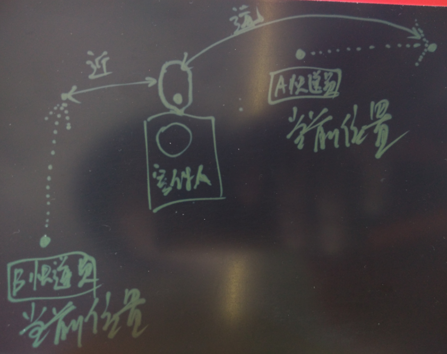
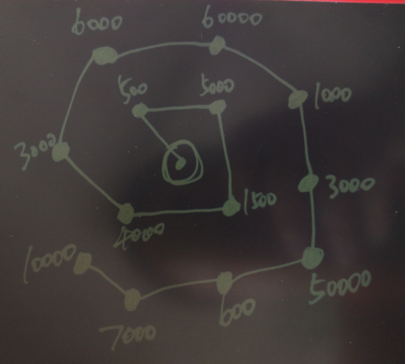

## 聊一聊双十一背后的技术 - 物流, 动态路径规划  
                                              
### 作者                                             
digoal                                              
                                              
### 日期                                             
2016-07-10                                                     
                                              
### 标签                                            
PostgreSQL , 物流 , 路径规划 ,  LBS , PostGIS , Greenplum , 最短路径 , 双十一 , 地理位置信息 , 快递 , 菜鸟物流 , 菜鸟                                                                               
                                              
----                                            
         
## 背景  
### 双十一背后的技术系列文章  
[《聊一聊双十一背后的技术 - 分词和搜索》](https://yq.aliyun.com/articles/64240)    
  
每年双十一的交易额都创新高，今年也不例外，双十一几乎成了各种IT系统的大考，物流也不例外。  
  
每次双十一快递几乎都被爆仓，但是随着技术的发展，今年，听说双十一刚过，小伙伴们的包裹差不多都收到了，今年的快递效率怎么如此之高呢?  
  
今天，来给大家分享一下物流与背后的数据库技术，当然我讲的还是PostgreSQL, Greenplum, PostGIS一类，大伙了解我的。  
  
物流行业是被电子商务催生的产业之一。  
  
快件的配送和揽件的调度算法是物流行业一个非常重要的课题，直接关系到配送或揽件的时效，以及物流公司的运作成本。  
  
好的算法，可以提高时效，降低成本，甚至可以更好的调动社会资源，就像滴滴打车一样，也许能全民参与哦。  
  
以后也许上班路途还能顺路提供快递服务呢。  
  
本文将以物流行业为例，给大家分析一下PostgreSQL与Greenplum在地理位置信息处理，最佳路径算法，机器学习等方面的物流行业应用方法。  
    
## 要素分析  
物流做的事情很简单，寄件，送件。    
    
物流环节的要素有几个，都与位置有关     
    
    
    
* 寄件人  
* 揽件员  
  PS，揽件人通常不是直接将货收到仓库，而是网点。所以网点到仓库也是需要调度的，本文未涉及。    
  调度方法与配送差不太多。    
    
* 货物  
* 仓库  
* 运输工具  
* 派件员  
* 收件人  
      
如果引入时间属性，则更具有想象空间，例如前面提到的像滴滴打车一样，也许能全民参与哦。    
    
我们这里先从简单的入手，假设现在只关心位置信息。    
    
### 1. 寄件  
货物从寄件人到揽件员，通常是预约的操作，而且寄件人可以直接去网点办理寄件，所以没有太多的算法在里面。    
    
如果派件和揽件混合在一起的话，可以用KNN算法来解决，再结合派件点路径调度，选出最佳的揽件人。    
    
例如，寄件人当前位置，与快递员调度的下一个位置，进行KNN运算，因此B来揽件是成本最低的。    
  
    
    
### 2. 货物在仓库之间流转的物流调度  
  
    
假设上图为仓库的位置，两个仓库之间如果开通了线路的话，就以线段连接起来。    
    
每个仓库负责一个区域，这个区域是一个几何的图形。    
    
通过寄件人和收件人的位置，与仓库的区域进行点面判断，找出寄件人的仓库与收件人的仓库。     
  
快件为点，仓库为面，寄件时根据寄件人填写的寄件和收件信息转换为寄件和收件两个经纬度，通过这两个经纬度与快递公司的仓库表进行点面包含的判断匹配，就可以找出快件对应的起点和重点的仓库。   
  
  
  
点面判断    
  
  
    
有了源和目标就可以通过pgrouting提供的各种最佳路径算法算出每件货物的最佳路径。    
  
本文后面会有demo来讲解如何使用pgrouting计算最佳路径。    
  
  
    
仓库之间的货车的工作就简单了，装满就走 或 分波次(考虑到时效) 的原则，负责好两个直连节点的来回运输，并不是一辆车完成整个货物的从起点到终点的运输。    
  
例如负责A和B之间线路的货车，只在AB之间跑运输。    
  
  
    
### 3. 货物从终点仓库到网点的物流调度  
货物在抵达目标仓库后，首先要将货物分拣到派件的网点。    
    
其实也是一个点面判断的过程，网点覆盖的派件范围为面，快件则为点，点面判断找出对应的网点。    
    
从仓库到网点，也可以使用仓库建流转的原理，计算出最佳线路。货车只负责2个网点之间的货物流转即可。      
    
### 4. 派件  
进入派件的流程，也就是货物在抵达收件人手中的最后一公里要做的事情。    
    
为了更好的实现派件调度，需要对快件进行聚合操作，根据位置进行聚合。    
    
原理和前面类似，还是要做点面判断，只是目标更加精确，例如精确到小区或者很小的区域。    
  
  
    
派件除了要考虑快件的目的地（聚合后的），还需要考虑快件的体积，重量，以及快递员的运货能力（体积与重量）  。      
  
假设一个网点当前收到的快件覆盖了以下需要派送的点（聚合后的），同时每个点的货物体积总和如数字所表示。     
  
路径规划与前面不一样的地方，这里规划的是多个点作为目标。    
  
  
    
多点目标的最佳路径，用意是确保相邻目标的连续性，确保切分不同网点的快件后，拿到快件的人跑的是还是相邻的点。    
  
例如中心是网点的位置，其他点是目标位置，目标位置的数字是体积，假设每个快递员一次运输的体积是7000，虚线是一个快递员拿到的一趟的快件。      
  
这种方法确保了每趟的快件是连续的。      
  
  
  
多点目标的最佳路径规划，在本文后面的部分也会有DEMO。    
    
## 地址转换成坐标  
如何将地址转换成坐标，不在本文的讨论范围，很多做导航的公司都可以输出这个能力。    
    
但是作为快递公司，还有一种方法可以获得精确的坐标信息，例如快递员的手持GPS终端，收件时扫个条码，同时上报位置信息。    
    
有了一定的基数后，通过文本分析和机器学习，也可以输出地址转坐标的能力。    
    
如果基数非常庞大，可以选择基于PostgreSQL的Greenplum数据仓库，进行文本分析与机器学习(支持MADlib库，支持R)。    
    
Greenplum支持文本分析，支持地理位置信息处理，支持MADlib机器学习库，还支持R语言自定义函数，python函数，支持分布式并行计算。  最重要的是它开源，绝对是有文本和地理位置分析需求的用户最好的选择。    
    
## 最佳路径运算  
以仓库之间的数据流转为例    
    
需要用到PostgreSQL数据库的PostGIS与pgrouting。     
  
http://docs.pgrouting.org/  
    
基础数据需求，用来表示开通了运输航线的仓库之间的线段数据，公里数据。      
  
```
Road link ID (gid)  唯一，指路段号    
Road class (class_id)    
Road link length (length)，长度，公里数    
Road name (name)，路名    
Road geometry (the_geom)，线段（可以是多点线段，也可以是双点线段）    
```
    
假设表名为ways，里面存储的就是仓库之间的线段信息    
  
```  
               Table "public.ways"  
  Column  |           Type            | Modifiers  
----------+---------------------------+-----------  
 gid      | bigint                    |  
 class_id | integer                   | not null  
 length   | double precision          |  
 name     | character(200)            |  
 osm_id   | bigint                    |  
 the_geom | geometry(LineString,4326) |  
Indexes:  
    "ways_gid_idx" UNIQUE, btree (gid)  
    "geom_idx" gist (the_geom)  
```  
    
### 1. 生成拓扑  
要生成最佳路径，首先要生成合法的拓扑，否则怎么生成路径呢？    
  
生成拓扑前，需要添加两个字段，用来存储线段的首尾编号  
  
```  
-- Add "source" and "target" column  
ALTER TABLE ways ADD COLUMN "source" integer;  
ALTER TABLE ways ADD COLUMN "target" integer;  
```  
    
调用pgr_createTopology生成拓扑，注意就是生成线段的首位编号的过程      
  
```  
pgr_createTopology(  
'<table>',   -- 需要生成拓扑的表名  
float tolerance,   --  容错值，例如线段的端不能完全吻合时，允许多少误差，单位一般为角度或公里数  
'<geometry column>',   --  线段列名  
'<gid>')  --  gid  
```  
    
例如，ABC三条线段，其中B线段的两端都没有和AC完全吻合，误差分别为1米和10米，所以需要设置容错。    
  
    
生成线段，实际上就是设置source和target的ID，设置完后，可能就变成这样的了      
  
    
例子    
  
```
-- Run topology function  
SELECT pgr_createTopology('ways', 0.00001, 'the_geom', 'gid');  
```
  
### 2. 生成最佳路径  
pgrouting支持的最佳路径算法很多    
  
http://docs.pgrouting.org/2.3/en/doc/index.html    
    
  
    
这里以Shortest Path A*和Shortest Path Dijkstra为例，介绍如何生成最佳路径    

http://docs.pgrouting.org/  
  
如果仓库之间的线段支持双向，回来的成本是多少？      
  
如果回程要考虑堵车更多一点，那么成本就不仅仅是公里数了，还需要加上堵车的成本。    
  
  
    
本例加上回程成本的字段，并设置为公里数，也就是说这条线段支持回程。      
  
```  
ALTER TABLE ways ADD COLUMN reverse_cost double precision;  
UPDATE ways SET reverse_cost = length;  
```  
    
#### 2.1 Shortest Path Dijkstra算法举例    
调用   
  
```  
pgr_costResult[] pgr_dijkstra(  
text sql, -- 用于计算最佳路径的数据来源, 用SQL表示, 例如   
          -- SELECT id (gid), source (线段起点id), target (线段重点ID), cost (起点到重点的成本) [,reverse_cost (重点到起点的成本)] FROM edge_table  
integer source,   --  规划路径的起点  
integer target,   --  规划路径的终点  
boolean directed,   --  if the graph is directed  
boolean has_rcost  -- if true, the reverse_cost column of the SQL generated set of rows will be used for the cost of the traversal of the edge in the opposite direction.  
);    
```  
    
返回多行，即路径。        
  
```
a set of pgr_costResult (seq (序号), id1 (起点id), id2 (目标ID, -1表示终点), cost (这一段的成本)) rows, that make up a path.      
```
  
例子    
  
从30到60的最佳路径      
  
```  
SELECT seq, id1 AS node, id2 AS edge, cost FROM pgr_dijkstra('  
                SELECT gid AS id,  
                         source::integer,  
                         target::integer,  
                         length::double precision AS cost  
                        FROM ways',  
                30, 60, false, false);  
  
 seq | node | edge |        cost  
-----+------+------+---------------------  
   0 |   30 |   53 |  0.0591267653820616  
   1 |   44 |   52 |  0.0665408320949312  
   2 |   14 |   15 |  0.0809556879332114  
   ...  
   6 |   10 | 6869 |  0.0164274192597773  
   7 |   59 |   72 |  0.0109385169537801  
   8 |   60 |   -1 |                   0  
(9 rows)  
```  
    
#### 2.2 Shortest Path A*算法举例    
与Shortest Path Dijkstra算法类似，只是SQL需要用到每条线段的起点和重点的坐标，其他参数和pgr_dijkstra都一样。   
  
```  
ALTER TABLE ways ADD COLUMN x1 double precision;  
ALTER TABLE ways ADD COLUMN y1 double precision;  
ALTER TABLE ways ADD COLUMN x2 double precision;  
ALTER TABLE ways ADD COLUMN y2 double precision;  
  
UPDATE ways SET x1 = ST_x(ST_PointN(the_geom, 1));  -- 线段起点坐标x  
UPDATE ways SET y1 = ST_y(ST_PointN(the_geom, 1));  -- 线段起点坐标y  
  
UPDATE ways SET x2 = ST_x(ST_PointN(the_geom, ST_NumPoints(the_geom)));  -- 线段终点坐标x  
UPDATE ways SET y2 = ST_y(ST_PointN(the_geom, ST_NumPoints(the_geom)));  -- 线段终点坐标y  
```  
    
调用    
  
```  
pgr_costResult[] pgr_astar(  
sql text,     -- SELECT id, source, target, cost, x1, y1, x2, y2 [,reverse_cost] FROM edge_table ，包含了起点和重点坐标，计算速度比Shortest Path A*算法快一点  
source integer,     
target integer,   
directed boolean,   
has_rcost boolean    
);  
```  
    
返回结果与pgr_dijkstra一样      
  
```
a set of pgr_costResult (seq, id1, id2, cost) rows, that make up a path.    
```
  
例子    
  
```  
SELECT seq, id1 AS node, id2 AS edge, cost FROM pgr_astar('  
                SELECT gid AS id,  
                         source::integer,  
                         target::integer,  
                         length::double precision AS cost,  
                         x1, y1, x2, y2  
                        FROM ways',  
                30, 60, false, false);  
```  
    
结果    
  
```  
 seq | node | edge |        cost  
-----+------+------+---------------------  
   0 |   30 |   53 |  0.0591267653820616  
   1 |   44 |   52 |  0.0665408320949312  
   2 |   14 |   15 |  0.0809556879332114  
   ...  
   6 |   10 | 6869 |  0.0164274192597773  
   7 |   59 |   72 |  0.0109385169537801  
   8 |   60 |   -1 |                   0  
(9 rows)  
```  
    
#### 2.3 生成多目标最佳路径  
在使用导航时，我们可以选择途径点，这其实就是多目标规划的一种常见场景。      
    
例如从杭州到万载，途径江山去丈母娘家休息一晚。    
    
本例使用的算法是Multiple Shortest Paths with kDijkstra    
    
用法与kDijkstra类似，只有一个参数不一样，就是targets是使用数组表示的。    
    
##### 生成分段成本    
```  
pgr_costResult[] pgr_kdijkstraCost(text sql, integer source,  
                 integer[] targets, boolean directed, boolean has_rcost);  
```  
    
例子   
  
从10出发，到达60,70,80    
  
```  
SELECT seq, id1 AS source, id2 AS target, cost FROM pgr_kdijkstraCost('  
                SELECT gid AS id,  
                         source::integer,  
                         target::integer,  
                         length::double precision AS cost  
                        FROM ways',  
                10, array[60,70,80], false, false);  
  
 seq | source | target |       cost  
-----+--------+--------+------------------  
   0 |     10 |     60 | 13.4770181770774  
   1 |     10 |     70 | 16.9231630493294  
   2 |     10 |     80 | 17.7035050077573  
(3 rows)  
```  
    
##### 生成路径    
```  
pgr_costResult[] pgr_kdijkstraPath(text sql, integer source,  
                 integer[] targets, boolean directed, boolean has_rcost);  
```  
    
例子    
    
从10出发，到达60,70,80    
    
```  
SELECT seq, id1 AS path, id2 AS edge, cost FROM pgr_kdijkstraPath('  
                SELECT gid AS id,  
                         source::integer,  
                         target::integer,  
                         length::double precision AS cost  
                        FROM ways',  
                10, array[60,70,80], false, false);  
  
		 seq | path | edge |        cost  
-----+------+------+---------------------  
   0 |   60 | 3163 |   0.427103399132954  
   1 |   60 | 2098 |   0.441091435851107  
...  
  40 |   60 |   56 |  0.0452819891352444  
  41 |   70 | 3163 |   0.427103399132954  
  42 |   70 | 2098 |   0.441091435851107  
...  
 147 |   80 |  226 |  0.0730263299529259  
 148 |   80 |  227 |  0.0741906229622583  
(149 rows)  
```  
    
## 小结  
本文用到哪些技术    
* 点面判断    
  用法请参考PostGIS手册    
    
* 点面判断后，按面进行聚合    
    
* 路径规划    
  具体的用法请参考pgrouting的手册以及workshop    
    
* 支持哪些最优算法    
  非常多，具体的用法请参考pgrouting的手册以及workshop    
    
* UDF  
  PostgreSQL支持python, R, C等各种自定义函数的语言    
  
* 机器学习    
  PostgreSQL与Greenplum都支持MADlib库，对于Greenplum的R用户，可以使用Greenplum进行隐式的并行数据挖掘，处理大数据量的挖掘很有帮助    
    
* 地址转换成坐标    
    
* 聚类算法  
  如果小区信息在数据库中存储的不是面，而是点，那么派件的点面判断，可以用PostgreSQL或者Greenplum的K-Means聚类算法，将快件与小区进行聚合，达到同样的目的。     
  用法举例：    
  http://blog.163.com/digoal@126/blog/static/163877040201571745048121/    
```  
    SELECT kmeans(ARRAY[x, y, z], 10) OVER (), * FROM samples;  
    SELECT kmeans(ARRAY[x, y], 2, ARRAY[0.5, 0.5, 1.0, 1.0]) OVER (), * FROM samples;  
    SELECT kmeans(ARRAY[x, y, z], 2, ARRAY[ARRAY[0.5, 0.5], ARRAY[1.0, 1.0]]) OVER (PARTITION BY group_key), * FROM samples;  
```  
  第一个参数是需要参与聚类分析的数组，第二个参数是最终分成几类（输出结果时类是从0开始的，如分2类的话，输出是0和1）。  
  第三个参数是种子参数，可以是1维或2维数组，如果是1维数组，必须是第一个参数的元素个数乘以第二个元素的值。(可以认为是给每一个类分配一个种子)。  
  我们需要指定的种子数组，即网点覆盖的小区或写字楼等组成的点值数组。    
    
PostgreSQL在地理位置处理的领域一直处于非常领先的地位，用户群体也非常的庞大，PostGIS和pgrouting只是这个领域的两插件。    
    
以前还写过一篇point cloud的数据处理相关文章，有兴趣的童鞋可以参考如下    
  
https://yq.aliyun.com/articles/57095    
    
PostGIS和pgrouting在阿里云的RDS PG数据库都有提供，欢迎使用。    
    
祝大家玩得开心，欢迎随时来 **阿里云促膝长谈** 业务需求 ，恭候光临。    
    
阿里云的小伙伴们加油，努力做 **最贴地气的云数据库**  。     
    
    
     
  
<a rel="nofollow" href="http://info.flagcounter.com/h9V1"  ></a>  
  
  
  
  
  
  
## [digoal's 大量PostgreSQL文章入口](https://github.com/digoal/blog/blob/master/README.md "22709685feb7cab07d30f30387f0a9ae")
  
