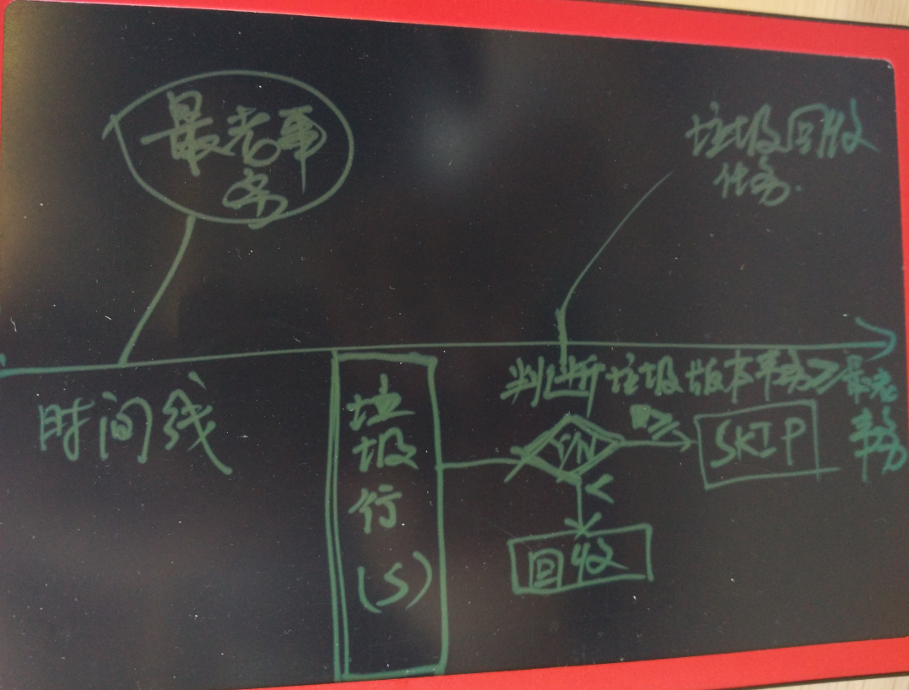
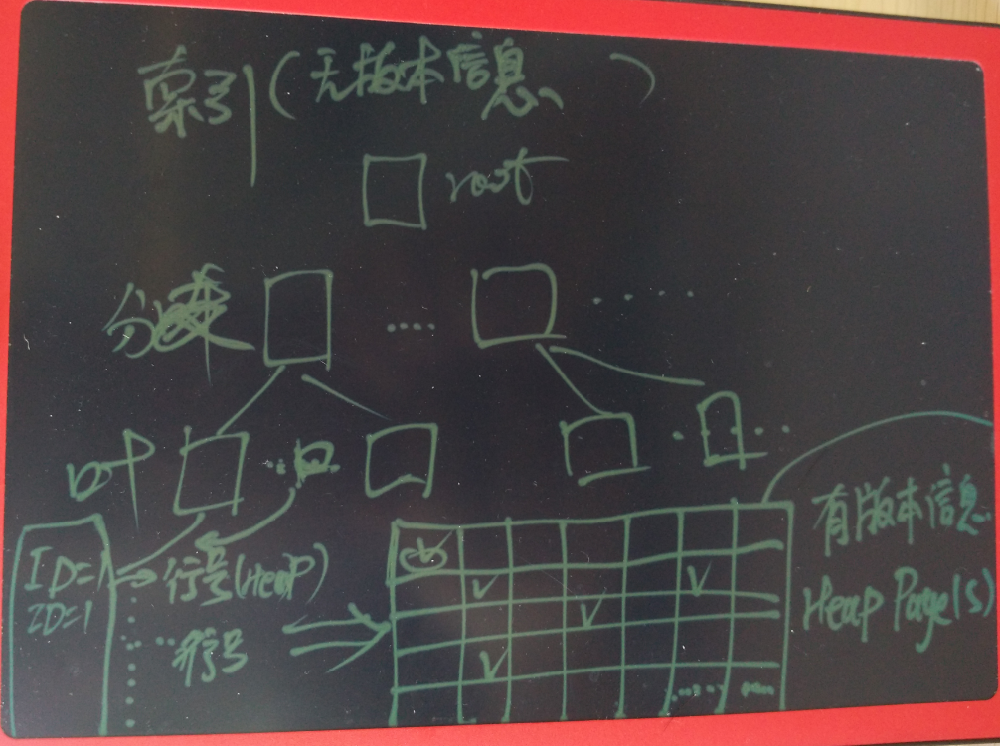
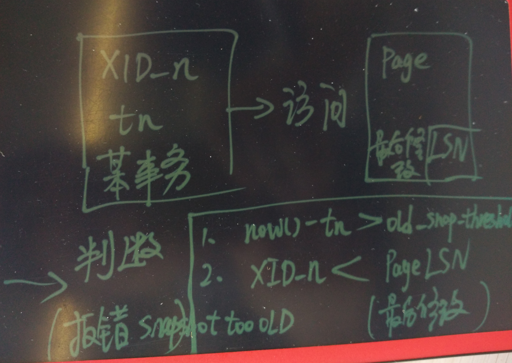

## PostgreSQL 老湿机图解平安科技遇到的垃圾回收"坑"    
                                                                                                      
### 作者                                                                                                     
digoal                                                                                                      
                                                                                                      
### 日期                                                                                                    
2016-07-15              
                                                                                                      
### 标签                                                                                                    
PostgreSQL , mvcc , vacuum , naptime , iops , 垃圾回收 , 原理 , btree , 索引组织表                                            
                                        
----                                                                                                    
                                            
## 背景  
近日收到 平安科技 海安童鞋 那里反馈的一个问题，在生产环境使用PostgreSQL的过程中，遇到的一个有点"不可思议"的问题。    
    
一张经常被更新的表，通过主键查询这张表的记录时，发现需要扫描异常多的数据块。    
    
本文将为你详细剖析这个问题，同时给出规避的方法，以及内核改造的方法。    
    
文中还涉及到索引的结构解说，仔细阅读定有收获。    
    
## 原因分析  
1\. 和长事务有关，我在很多文章都提到过，PG在垃圾回收时，只判断垃圾版本是否是当前数据库中最老的事务之前的，如果是之后产生的，则不回收。    
    
所以当数据库存在长事务时，同时被访问的记录被多次变更，造成一些垃圾版本没有回收。    
  
  
    
2\. PG的索引没有版本信息，所以必须要访问heap tuple获取版本。    
  
  
    
## 复现方法  
测试表    
  
```  
postgres=# create unlogged table test03 (id int primary key, info text);  
```  
    
频繁更新100条记录    
  
```  
$ vi test.sql  
\setrandom id 1 100  
insert into test03 values(:id, repeat(md5(random()::text), 1000)) on conflict on constraint test03_pkey do update set info=excluded.info;  
  
pgbench -M prepared -n -r -P 1 -f ./test.sql -c 48 -j 48 -T 10000000  
```  
    
开启长事务，啥也不干    
  
```  
postgres=# begin;  
BEGIN  
postgres=# select txid_current();  
 txid_current   
--------------  
   3474642778  
(1 row)  
```  
    
经过一段时间的更新，发现需要访问很多数据块了。    
  
```  
postgres=# explain (analyze,verbose,timing,costs,buffers) select * from test03 where id=2;  
                                                         QUERY PLAN                                                            
-----------------------------------------------------------------------------------------------------------------------------  
 Index Scan using test03_pkey on public.test03  (cost=0.42..8.44 rows=1 width=417) (actual time=0.661..4.440 rows=1 loops=1)  
   Output: id, info  
   Index Cond: (test03.id = 2)  
   Buffers: shared hit=1753  
 Planning time: 0.104 ms  
 Execution time: 4.468 ms  
(6 rows)  
```  
    
观察访问很多的块是heap块    
  
```  
postgres=# set enable_indexscan=off;  
SET  
  
postgres=# explain (analyze,verbose,timing,costs,buffers) select * from test03 where id=2;  
                                                      QUERY PLAN                                                         
-----------------------------------------------------------------------------------------------------------------------  
 Bitmap Heap Scan on public.test03  (cost=4.43..8.44 rows=1 width=416) (actual time=5.818..5.819 rows=1 loops=1)  
   Output: id, info  
   Recheck Cond: (test03.id = 2)  
   Heap Blocks: exact=1986  
   Buffers: shared hit=1996  
   ->  Bitmap Index Scan on test03_pkey  (cost=0.00..4.43 rows=1 width=0) (actual time=0.418..0.418 rows=1986 loops=1)  
         Index Cond: (test03.id = 2)  
         Buffers: shared hit=10  
 Planning time: 0.200 ms  
 Execution time: 5.851 ms  
(10 rows)  
```  
    
提交长事务前，使用vacuum verbose可以看到无法回收这些持续产生的垃圾page(包括index和heap的page)。    
    
提交长事务    
  
```  
postgres=# end;  
COMMIT  
```  
    
等待autovacuum进程回收垃圾，delete half index page。    
  
访问的数据块数量下降了。    
  
```  
postgres=# explain (analyze,verbose,timing,costs,buffers) select * from test03 where id=2;  
                                                     QUERY PLAN                                                       
--------------------------------------------------------------------------------------------------------------------  
 Bitmap Heap Scan on public.test03  (cost=4.43..8.45 rows=1 width=417) (actual time=0.113..0.118 rows=1 loops=1)  
   Output: id, info  
   Recheck Cond: (test03.id = 2)  
   Heap Blocks: exact=3  
   Buffers: shared hit=14  
   ->  Bitmap Index Scan on test03_pkey  (cost=0.00..4.43 rows=1 width=0) (actual time=0.067..0.067 rows=3 loops=1)  
         Index Cond: (test03.id = 2)  
         Buffers: shared hit=11  
 Planning time: 0.101 ms  
 Execution time: 0.148 ms  
(10 rows)  
```  
  
## 深入分析  
使用pageinspect观察测试过程中索引页的内容变化    
    
创建extension    
  
```  
postgres=# create extension pageinspect;  
```  
    
开启长事务    
  
```  
postgres=# begin;  
BEGIN  
postgres=# select txid_current();  
```  
    
测试60秒更新    
  
```  
pgbench -M prepared -n -r -P 1 -f ./test.sql -c 48 -j 48 -T 60  
```  
    
观察需要扫描多少数据块    
  
```  
postgres=# explain (analyze,verbose,timing,costs,buffers) select * from test03 where id=1;  
                                                          QUERY PLAN                                                            
------------------------------------------------------------------------------------------------------------------------------  
 Index Scan using test03_pkey on public.test03  (cost=0.43..8.45 rows=1 width=417) (actual time=0.052..15.738 rows=1 loops=1)  
   Output: id, info  
   Index Cond: (test03.id = 1)  
   Buffers: shared hit=2663  
 Planning time: 0.572 ms  
 Execution time: 15.790 ms  
(6 rows)  
  
postgres=# set enable_indexscan=off;  
SET  
  
postgres=# explain (analyze,verbose,timing,costs,buffers) select * from test03 where id=1;  
                                                      QUERY PLAN                                                         
-----------------------------------------------------------------------------------------------------------------------  
 Bitmap Heap Scan on public.test03  (cost=4.44..8.45 rows=1 width=417) (actual time=6.138..6.139 rows=1 loops=1)  
   Output: id, info  
   Recheck Cond: (test03.id = 1)  
   Heap Blocks: exact=2651  
   Buffers: shared hit=2663  
   ->  Bitmap Index Scan on test03_pkey  (cost=0.00..4.44 rows=1 width=0) (actual time=0.585..0.585 rows=2651 loops=1)  
         Index Cond: (test03.id = 1)  
         Buffers: shared hit=12  
 Planning time: 0.093 ms  
 Execution time: 6.218 ms  
(10 rows)  
```  
    
观察索引页, root=412, 层级=2        
  
```  
postgres=# select * from bt_metap('test03_pkey');  
 magic  | version | root | level | fastroot | fastlevel   
--------+---------+------+-------+----------+-----------  
 340322 |       2 |  412 |     2 |      412 |         2  
(1 row)  
```  
    
查看root页内容      
  
```  
postgres=# select * from bt_page_stats('test03_pkey',412);  
 blkno | type | live_items | dead_items | avg_item_size | page_size | free_size | btpo_prev | btpo_next | btpo | btpo_flags   
-------+------+------------+------------+---------------+-----------+-----------+-----------+-----------+------+------------  
   412 | r    |          3 |          0 |            13 |      8192 |      8096 |         0 |         0 |    2 |          2  
(1 row)  
  
postgres=# select * from bt_page_items('test03_pkey',412);  
 itemoffset |  ctid   | itemlen | nulls | vars |          data             
------------+---------+---------+-------+------+-------------------------  
          1 | (3,1)   |       8 | f     | f    |   
          2 | (584,1) |      16 | f     | f    | 21 00 00 00 00 00 00 00  
          3 | (411,1) |      16 | f     | f    | 46 00 00 00 00 00 00 00  
(3 rows)  
```  
    
查看最左branch 页内容      
  
```  
postgres=# select * from bt_page_items('test03_pkey',3);  
 itemoffset |  ctid   | itemlen | nulls | vars |          data             
------------+---------+---------+-------+------+-------------------------  
          1 | (58,1)  |      16 | f     | f    | 21 00 00 00 00 00 00 00  
          2 | (1,1)   |       8 | f     | f    |   
          3 | (937,1) |      16 | f     | f    | 01 00 00 00 00 00 00 00  
          4 | (767,1) |      16 | f     | f    | 01 00 00 00 00 00 00 00  
          5 | (666,1) |      16 | f     | f    | 01 00 00 00 00 00 00 00  
          6 | (572,1) |      16 | f     | f    | 01 00 00 00 00 00 00 00  
          7 | (478,1) |      16 | f     | f    | 01 00 00 00 00 00 00 00  
          8 | (395,1) |      16 | f     | f    | 01 00 00 00 00 00 00 00  
          9 | (307,1) |      16 | f     | f    | 01 00 00 00 00 00 00 00  
         10 | (173,1) |      16 | f     | f    | 01 00 00 00 00 00 00 00  
         11 | (99,1)  |      16 | f     | f    | 01 00 00 00 00 00 00 00  
         12 | (951,1) |      16 | f     | f    | 02 00 00 00 00 00 00 00  
         13 | (867,1) |      16 | f     | f    | 02 00 00 00 00 00 00 00  
         14 | (773,1) |      16 | f     | f    | 02 00 00 00 00 00 00 00  
         15 | (660,1) |      16 | f     | f    | 02 00 00 00 00 00 00 00  
         16 | (564,1) |      16 | f     | f    | 02 00 00 00 00 00 00 00  
         17 | (496,1) |      16 | f     | f    | 02 00 00 00 00 00 00 00  
         18 | (413,1) |      16 | f     | f    | 02 00 00 00 00 00 00 00  
         19 | (319,1) |      16 | f     | f    | 02 00 00 00 00 00 00 00  
         20 | (204,1) |      16 | f     | f    | 02 00 00 00 00 00 00 00  
         21 | (151,1) |      16 | f     | f    | 02 00 00 00 00 00 00 00  
         22 | (64,1)  |      16 | f     | f    | 02 00 00 00 00 00 00 00  
         23 | (865,1) |      16 | f     | f    | 03 00 00 00 00 00 00 00  
         24 | (777,1) |      16 | f     | f    | 03 00 00 00 00 00 00 00  
```  
    
查看包含最小值的最左叶子节点内容    
  
```  
postgres=# select * from bt_page_items('test03_pkey',1);  
 itemoffset |    ctid    | itemlen | nulls | vars |          data             
------------+------------+---------+-------+------+-------------------------  
          1 | (57342,14) |      16 | f     | f    | 01 00 00 00 00 00 00 00  
          2 | (71195,14) |      16 | f     | f    | 01 00 00 00 00 00 00 00  
          3 | (71171,12) |      16 | f     | f    | 01 00 00 00 00 00 00 00  
          4 | (71185,1)  |      16 | f     | f    | 01 00 00 00 00 00 00 00  
          5 | (71150,17) |      16 | f     | f    | 01 00 00 00 00 00 00 00  
          6 | (71143,1)  |      16 | f     | f    | 01 00 00 00 00 00 00 00  
......  
```  
    
查看包含最小值的最右叶子节点内容    
  
```  
postgres=# select * from bt_page_items('test03_pkey',99);  
 itemoffset |    ctid    | itemlen | nulls | vars |          data             
------------+------------+---------+-------+------+-------------------------  
          1 | (66214,10) |      16 | f     | f    | 02 00 00 00 00 00 00 00  
          2 | (12047,15) |      16 | f     | f    | 01 00 00 00 00 00 00 00  
......  
         40 | (11052,15) |      16 | f     | f    | 01 00 00 00 00 00 00 00  
         41 | (11009,6)  |      16 | f     | f    | 01 00 00 00 00 00 00 00  
         42 | (11021,6)  |      16 | f     | f    | 01 00 00 00 00 00 00 00  
         43 | (71209,3)  |      16 | f     | f    | 02 00 00 00 00 00 00 00  
         44 | (69951,1)  |      16 | f     | f    | 02 00 00 00 00 00 00 00  
```  
    
查看这些叶子索引页包含data='01 00 00 00 00 00 00 00'的item有多少条，可以对应到需要扫描多少heap page    
  
```  
select count(distinct substring(ctid::text, 1, "position"(ctid::text, ','))) from (  
select * from bt_page_items('test03_pkey',1)   
union all  
select * from bt_page_items('test03_pkey',937)   
union all  
select * from bt_page_items('test03_pkey',767)   
union all  
select * from bt_page_items('test03_pkey',666)   
union all  
select * from bt_page_items('test03_pkey',572)   
union all  
select * from bt_page_items('test03_pkey',478)   
union all  
select * from bt_page_items('test03_pkey',395)   
union all  
select * from bt_page_items('test03_pkey',307)   
union all  
select * from bt_page_items('test03_pkey',173)   
union all  
select * from bt_page_items('test03_pkey',99)   
union all  
select * from bt_page_items('test03_pkey',951)  
) t   
where data='01 00 00 00 00 00 00 00';  
  
 count   
-------  
  2652  
(1 row)  
```  
  
2652与前面执行计划中看到的2651对应。    
    
提交长事务    
  
```  
postgres=# end;  
COMMIT  
```  
    
等待autovacuum结束    
  
```  
postgres=# select * from pg_stat_all_tables where relname='test03';  
-[ RECORD 1 ]-------+------------------------------  
relid               | 14156713  
schemaname          | public  
relname             | test03  
seq_scan            | 39  
seq_tup_read        | 5137822  
idx_scan            | 3522865664  
idx_tup_fetch       | 3521843178  
n_tup_ins           | 1022487  
n_tup_upd           | 3476465702  
n_tup_del           | 22387  
n_tup_hot_upd       | 3433472972  
n_live_tup          | 100  
n_dead_tup          | 0  
n_mod_since_analyze | 0  
last_vacuum         | 2016-07-15 00:03:53.909086+08  
last_autovacuum     | 2016-07-15 00:32:04.177672+08  
last_analyze        | 2016-07-15 00:03:53.909825+08  
last_autoanalyze    | 2016-07-15 00:07:23.541629+08  
vacuum_count        | 10  
autovacuum_count    | 125  
analyze_count       | 7  
autoanalyze_count   | 99  
```  
    
观察现在需要扫描多少块    
  
```  
postgres=# explain (analyze,verbose,timing,costs,buffers) select * from test03 where id=1;  
                                                     QUERY PLAN                                                        
---------------------------------------------------------------------------------------------------------------------  
 Bitmap Heap Scan on public.test03  (cost=40.40..44.41 rows=1 width=417) (actual time=0.026..0.027 rows=1 loops=1)  
   Output: id, info  
   Recheck Cond: (test03.id = 1)  
   Heap Blocks: exact=1  
   Buffers: shared hit=5  
   ->  Bitmap Index Scan on test03_pkey  (cost=0.00..40.40 rows=1 width=0) (actual time=0.014..0.014 rows=1 loops=1)  
         Index Cond: (test03.id = 1)  
         Buffers: shared hit=4  
 Planning time: 0.137 ms  
 Execution time: 0.052 ms  
(10 rows)  
```  
    
查看现在的索引页内容，half page已经remove掉了      
  
```  
postgres=# select count(distinct substring(ctid::text, 1, "position"(ctid::text, ','))) from (  
select * from bt_page_items('test03_pkey',1)   
union all  
select * from bt_page_items('test03_pkey',937)   
union all  
select * from bt_page_items('test03_pkey',767)   
union all  
select * from bt_page_items('test03_pkey',666)   
union all  
select * from bt_page_items('test03_pkey',572)   
union all  
select * from bt_page_items('test03_pkey',478)   
union all  
select * from bt_page_items('test03_pkey',395)   
union all  
select * from bt_page_items('test03_pkey',307)   
union all  
select * from bt_page_items('test03_pkey',173)   
union all  
select * from bt_page_items('test03_pkey',99)   
union all  
select * from bt_page_items('test03_pkey',951)  
) t   
where data='01 00 00 00 00 00 00 00' ;  
NOTICE:  page is deleted  
NOTICE:  page is deleted  
NOTICE:  page is deleted  
NOTICE:  page is deleted  
NOTICE:  page is deleted  
NOTICE:  page is deleted  
NOTICE:  page is deleted  
NOTICE:  page is deleted  
NOTICE:  page is deleted  
-[ RECORD 1 ]  
count | 2  
```  
    
再观察索引页内容，已经被autovacuum收缩了    
  
```  
postgres=# select * from bt_metap('test03_pkey');  
 magic  | version | root | level | fastroot | fastlevel   
--------+---------+------+-------+----------+-----------  
 340322 |       2 |  412 |     2 |      412 |         2  
(1 row)  
  
postgres=# select * from bt_page_items('test03_pkey',412);  
 itemoffset |  ctid   | itemlen | nulls | vars |          data             
------------+---------+---------+-------+------+-------------------------  
          1 | (3,1)   |       8 | f     | f    |   
          2 | (584,1) |      16 | f     | f    | 21 00 00 00 00 00 00 00  
          3 | (411,1) |      16 | f     | f    | 46 00 00 00 00 00 00 00  
(3 rows)  
  
postgres=# select * from bt_page_items('test03_pkey',3);  
 itemoffset |  ctid   | itemlen | nulls | vars |          data             
------------+---------+---------+-------+------+-------------------------  
          1 | (58,1)  |      16 | f     | f    | 21 00 00 00 00 00 00 00  
          2 | (1,1)   |       8 | f     | f    |   
          3 | (99,1)  |      16 | f     | f    | 01 00 00 00 00 00 00 00  
          4 | (865,1) |      16 | f     | f    | 02 00 00 00 00 00 00 00  
          5 | (844,1) |      16 | f     | f    | 03 00 00 00 00 00 00 00  
          6 | (849,1) |      16 | f     | f    | 04 00 00 00 00 00 00 00  
          7 | (18,1)  |      16 | f     | f    | 05 00 00 00 00 00 00 00  
          8 | (95,1)  |      16 | f     | f    | 06 00 00 00 00 00 00 00  
          9 | (63,1)  |      16 | f     | f    | 07 00 00 00 00 00 00 00  
         10 | (34,1)  |      16 | f     | f    | 08 00 00 00 00 00 00 00  
         11 | (851,1) |      16 | f     | f    | 09 00 00 00 00 00 00 00  
         12 | (10,1)  |      16 | f     | f    | 0a 00 00 00 00 00 00 00  
         13 | (71,1)  |      16 | f     | f    | 0b 00 00 00 00 00 00 00  
         14 | (774,1) |      16 | f     | f    | 0c 00 00 00 00 00 00 00  
         15 | (213,1) |      16 | f     | f    | 0d 00 00 00 00 00 00 00  
         16 | (881,1) |      16 | f     | f    | 0e 00 00 00 00 00 00 00  
         17 | (837,1) |      16 | f     | f    | 0f 00 00 00 00 00 00 00  
         18 | (100,1) |      16 | f     | f    | 10 00 00 00 00 00 00 00  
         19 | (872,1) |      16 | f     | f    | 11 00 00 00 00 00 00 00  
         20 | (32,1)  |      16 | f     | f    | 12 00 00 00 00 00 00 00  
         21 | (65,1)  |      16 | f     | f    | 13 00 00 00 00 00 00 00  
         22 | (870,1) |      16 | f     | f    | 14 00 00 00 00 00 00 00  
         23 | (841,1) |      16 | f     | f    | 15 00 00 00 00 00 00 00  
         24 | (850,1) |      16 | f     | f    | 16 00 00 00 00 00 00 00  
         25 | (30,1)  |      16 | f     | f    | 17 00 00 00 00 00 00 00  
         26 | (91,1)  |      16 | f     | f    | 18 00 00 00 00 00 00 00  
         27 | (829,1) |      16 | f     | f    | 19 00 00 00 00 00 00 00  
         28 | (16,1)  |      16 | f     | f    | 1a 00 00 00 00 00 00 00  
         29 | (784,1) |      16 | f     | f    | 1b 00 00 00 00 00 00 00  
         30 | (31,1)  |      16 | f     | f    | 1c 00 00 00 00 00 00 00  
         31 | (88,1)  |      16 | f     | f    | 1d 00 00 00 00 00 00 00  
         32 | (48,1)  |      16 | f     | f    | 1e 00 00 00 00 00 00 00  
         33 | (822,1) |      16 | f     | f    | 1f 00 00 00 00 00 00 00  
         34 | (817,1) |      16 | f     | f    | 20 00 00 00 00 00 00 00  
         35 | (109,1) |      16 | f     | f    | 21 00 00 00 00 00 00 00  
(35 rows)  
  
postgres=# select * from bt_page_items('test03_pkey',1);  
 itemoffset |    ctid    | itemlen | nulls | vars |          data             
------------+------------+---------+-------+------+-------------------------  
          1 | (57342,14) |      16 | f     | f    | 01 00 00 00 00 00 00 00  
          2 | (71195,14) |      16 | f     | f    | 01 00 00 00 00 00 00 00  
(2 rows)  
  
postgres=# select * from bt_page_items('test03_pkey',99);  
 itemoffset |    ctid    | itemlen | nulls | vars |          data             
------------+------------+---------+-------+------+-------------------------  
          1 | (66214,10) |      16 | f     | f    | 02 00 00 00 00 00 00 00  
          2 | (71209,3)  |      16 | f     | f    | 02 00 00 00 00 00 00 00  
(2 rows)  
```  
    
## 相关源码  
src/backend/access/nbtree/nbtpage.c  
  
```  
/*  
 * Unlink a page in a branch of half-dead pages from its siblings.  
 *  
 * If the leaf page still has a downlink pointing to it, unlinks the highest  
 * parent in the to-be-deleted branch instead of the leaf page.  To get rid  
 * of the whole branch, including the leaf page itself, iterate until the  
 * leaf page is deleted.  
 *  
 * Returns 'false' if the page could not be unlinked (shouldn't happen).  
 * If the (new) right sibling of the page is empty, *rightsib_empty is set  
 * to true.  
 */  
static bool  
_bt_unlink_halfdead_page(Relation rel, Buffer leafbuf, bool *rightsib_empty)  
{  
...  
        /*  
         * Mark the page itself deleted.  It can be recycled when all current  
         * transactions are gone.  Storing GetTopTransactionId() would work, but  
         * we're in VACUUM and would not otherwise have an XID.  Having already  
         * updated links to the target, ReadNewTransactionId() suffices as an  
         * upper bound.  Any scan having retained a now-stale link is advertising  
         * in its PGXACT an xmin less than or equal to the value we read here.  It  
         * will continue to do so, holding back RecentGlobalXmin, for the duration  
         * of that scan.  
         */  
        page = BufferGetPage(buf);  
        opaque = (BTPageOpaque) PageGetSpecialPointer(page);  
        opaque->btpo_flags &= ~BTP_HALF_DEAD;  
        opaque->btpo_flags |= BTP_DELETED;  
        opaque->btpo.xact = ReadNewTransactionId();  
...  
```  
    
contrib/pageinspect/btreefuncs.c    
  
```  
                if (P_ISDELETED(opaque))  
                        elog(NOTICE, "page is deleted");  
```  
  
## 参考  
1\. b-tree原理    
  
https://yq.aliyun.com/articles/54437    
    
## 优化手段  
1\. 频繁更新的表，数据库的优化手段    
  
1\.1 监控长事务，绝对控制长事务    
    
1\.2 缩小autovacuum naptime (to 1s) ,      
  
      增加autovacuum work (to 10),       
  
      设置autovacuum delay=0,       
  
      增大autovacuum work memory (to 512MB or bigger),       
  
      将经常变更的表和索引放到好的iops的设备上 。       
        
      不要小看这几个参数，非常的关键。      
      
1\.3 如果事务释放并且表上面已经出发了vacuum后，还是要查很多的PAGE，说明index page没有delete和收缩，可能是index page没有达到compact的要求，如果遇到这种情况，需要reindex。    
    
2\. PostgreSQL 9.6通过快照过旧彻底解决这个长事务引发的坑爹问题。     
  
9\.6 vacuum的改进如图    
  
    
  
如何判断snapshot too old如图    
  
    
  
https://www.postgresql.org/docs/9.6/static/runtime-config-resource.html#RUNTIME-CONFIG-RESOURCE-ASYNC-BEHAVIOR    
  
3\. 9.6的垃圾回收机制也还有改进的空间，做到更细粒度的版本控制，改进方法以前分享过，在事务列表中增加记录事务隔离级别，通过隔离级别判断需要保留的版本，而不是简单的通过最老事务来判断需要保留的垃圾版本。    
    
祝大家玩得开心，欢迎随时来 **阿里云促膝长谈** 业务需求 ，恭候光临。    
    
阿里云的小伙伴们加油，努力做 **最贴地气的云数据库** 。    
  
               
                                      
                                              
          
  
<a rel="nofollow" href="http://info.flagcounter.com/h9V1"  ></a>  
  
  
  
  
  
  
## [digoal's 大量PostgreSQL文章入口](https://github.com/digoal/blog/blob/master/README.md "22709685feb7cab07d30f30387f0a9ae")
  
