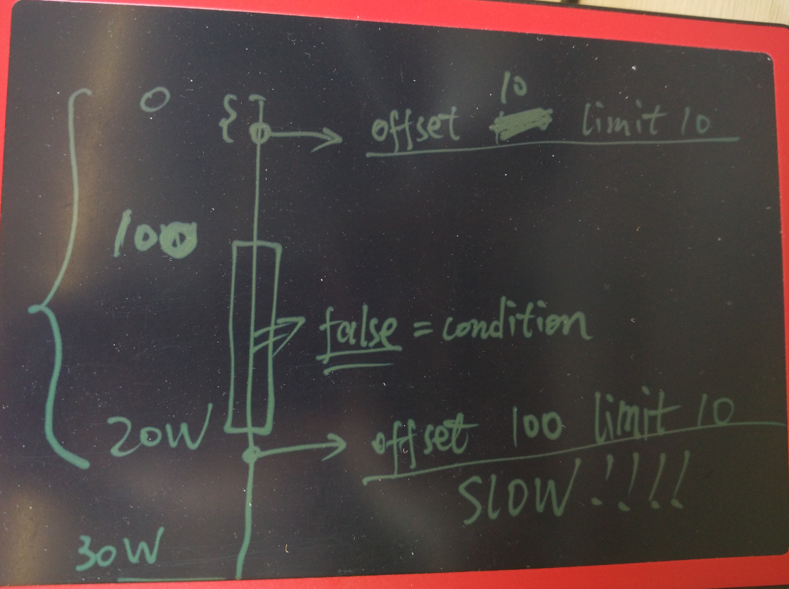

## PostgreSQL 数据访问 offset 的质变 case  
                
### 作者                    
digoal                    
                
### 日期                    
2016-07-15                    
                
### 标签                    
PostgreSQL , offset , limit , 质变                  
                
----                    
                
## 背景  
offset limit是一个多么常见的需求啊，但是你知道offset的数据可能隐藏着质变吗？       
    
如图  
  
  
  
node有30W条数据，其中前100条是满足条件的，然后100条到20W条都是不满足条件的。    
  
所以offset 10 limit 10非常的快。    
  
但是offset 100 limit 10，就要扫描从100到20W条记录，然后再往后才是满足条件的记录。    
  
这就是质变的原因。    
    
## 例子  
生成1000万测试记录。    
  
```  
postgres=# create table tbl(id int primary key, info text);  
CREATE TABLE  
postgres=# insert into tbl select generate_series(1,10000000),'';  
INSERT 0 10000000  
```  
    
更新info字段的数据，分布在前1000条和第500万后的100条。    
  
```  
postgres=# update tbl set info='test' where id<1000 or id between 5000000 and 5000100;   
UPDATE 1100  
```  
    
order by id offset 100 limit 100查询的是前面的记录，非常快。    
  
```  
postgres=# explain (analyze,verbose,timing,costs,buffers) select * from tbl where info='test' order by id offset 100 limit 100;  
                                                             QUERY PLAN                                                               
------------------------------------------------------------------------------------------------------------------------------------  
 Limit  (cost=49339.42..98678.40 rows=100 width=5) (actual time=0.154..0.343 rows=100 loops=1)  
   Output: id, info  
   Buffers: shared hit=603  
   ->  Index Scan using tbl_pkey on public.tbl  (cost=0.43..329091.45 rows=667 width=5) (actual time=0.019..0.293 rows=200 loops=1)  
         Output: id, info  
         Filter: (tbl.info = 'test'::text)  
         Buffers: shared hit=603  
 Planning time: 0.253 ms  
 Execution time: 0.386 ms  
(9 rows)  
```  
    
如果扫描的是1000条以后的，因为满足条件的记录是500W往后的，所以至少要扫描500万条记录才能拿到结果。    
  
```  
postgres=# explain (analyze,verbose,timing,costs,buffers) select * from tbl where info='test' order by id offset 1000 limit 100;  
                                                          QUERY PLAN                                                            
------------------------------------------------------------------------------------------------------------------------------  
 Limit  (cost=169291.40..169291.40 rows=1 width=5) (actual time=952.266..952.330 rows=100 loops=1)  
   Output: id, info  
   Buffers: shared hit=44260  
   ->  Sort  (cost=169289.74..169291.40 rows=667 width=5) (actual time=951.892..952.102 rows=1100 loops=1)  
         Output: id, info  
         Sort Key: tbl.id  
         Sort Method: quicksort  Memory: 100kB  
         Buffers: shared hit=44260  
         ->  Seq Scan on public.tbl  (cost=0.00..169258.45 rows=667 width=5) (actual time=951.167..951.496 rows=1100 loops=1)  
               Output: id, info  
               Filter: (tbl.info = 'test'::text)  
               Rows Removed by Filter: 9998900  
               Buffers: shared hit=44260  
 Planning time: 0.105 ms  
 Execution time: 952.375 ms  
(15 rows)  
```  
    
关闭seqscan则会使用索引扫描，一样的需要扫描一些不满足条件的记录。    
  
removed by filter就是很好的说明    
  
```  
postgres=# set enable_seqscan=off;  
SET  
postgres=# explain (analyze,verbose,timing,costs,buffers) select * from tbl where info='test' order by id offset 1000 limit 100;  
                                                              QUERY PLAN                                                                 
---------------------------------------------------------------------------------------------------------------------------------------  
 Limit  (cost=329091.45..329091.45 rows=1 width=5) (actual time=888.400..888.519 rows=100 loops=1)  
   Output: id, info  
   Buffers: shared hit=38991  
   ->  Index Scan using tbl_pkey on public.tbl  (cost=0.43..329091.45 rows=667 width=5) (actual time=0.033..888.267 rows=1100 loops=1)  
         Output: id, info  
         Filter: (tbl.info = 'test'::text)  
         Rows Removed by Filter: 4999000  
         Buffers: shared hit=38991  
 Planning time: 0.110 ms  
 Execution time: 888.632 ms  
(10 rows)  
  
or  
postgres=# set enable_seqscan=on;  
SET  
postgres=# set enable_sort=off;  
SET  
postgres=# explain (analyze,verbose,timing,costs,buffers) select * from tbl where info='test' order by id offset 1000 limit 100;  
                                                              QUERY PLAN                                                                 
---------------------------------------------------------------------------------------------------------------------------------------  
 Limit  (cost=329091.45..329091.45 rows=1 width=5) (actual time=887.791..887.906 rows=100 loops=1)  
   Output: id, info  
   Buffers: shared hit=38991  
   ->  Index Scan using tbl_pkey on public.tbl  (cost=0.43..329091.45 rows=667 width=5) (actual time=0.040..887.540 rows=1100 loops=1)  
         Output: id, info  
         Filter: (tbl.info = 'test'::text)  
         Rows Removed by Filter: 4999000  
         Buffers: shared hit=38991  
 Planning time: 0.154 ms  
 Execution time: 887.964 ms  
(10 rows)  
```  
    
如果把limit加大到超过实际的满足条件的结果，则需要扫完所有的记录。    
  
```  
postgres=# explain (analyze,verbose,timing,costs,buffers) select * from tbl where info='test' order by id offset 1000 limit 10000;  
                                                               QUERY PLAN                                                                 
----------------------------------------------------------------------------------------------------------------------------------------  
 Limit  (cost=329091.45..329091.45 rows=1 width=5) (actual time=898.675..1786.476 rows=100 loops=1)  
   Output: id, info  
   Buffers: shared hit=74776  
   ->  Index Scan using tbl_pkey on public.tbl  (cost=0.43..329091.45 rows=667 width=5) (actual time=0.030..1786.240 rows=1100 loops=1)  
         Output: id, info  
         Filter: (tbl.info = 'test'::text)  
         Rows Removed by Filter: 9998900  
         Buffers: shared hit=74776  
 Planning time: 0.110 ms  
 Execution time: 1786.536 ms  
(10 rows)  
```  
    
## 小结  
1\. offset仅仅是偏移量，不是从此位置开始扫描，所以偏移量前的tuple都是需要被扫描到的。    
  
2\. limit的使用也需要注意，如果有断层产生，会额外的扫描更多的块。    
  
3\. offset一种好的优化方法是根据PK来位移。    
  
例子见我以前写的一批文章。    
    
## 分页优化手段之一  
一位开发的同事给我一个SQL, 问我为什么只改了一个条件, 查询速度居然从毫秒就慢到几十秒了,    
  
如下 :     
  
```  
SELECT *                                                                                  
  FROM tbl  
  where create_time>='2014-02-08' and create_time<'2014-02-11'  
  and x=3  
  and id != '123'  
  and id != '321'  
  and y > 0 order by create_time limit 1 offset 0;  
```  
    
运行结果100毫秒左右.    
  
执行计划 :     
  
```  
Limit  (cost=0.56..506.19 rows=1 width=1038)  
   ->  Index Scan using idx on tbl  (cost=0.56..2381495.60 rows=4710 width=1038)  
         Index Cond: ((create_time >= '2014-02-08 00:00:00'::timestamp without time zone) AND (create_time < '2014-02-11 00:00:00'::timestamp without time zone))  
         Filter: (((id)::text <> '123'::text) AND ((id)::text <> '321'::text) AND (y > 0) AND (x = 3))  
```  
    
改成如下 :     
  
```  
SELECT *                                                                                  
  FROM tbl  
  where create_time>='2014-02-08' and create_time<'2014-02-11'  
  and x=3  
  and id != '123'  
  and id != '321'  
  and y > 0 order by create_time limit 1 offset 10;  
```  
    
运行几十秒.    
  
执行计划如下 :     
  
```  
Limit  (cost=5056.98..5562.62 rows=1 width=1038)  
   ->  Index Scan using idx on tbl  (cost=0.56..2382076.78 rows=4711 width=1038)  
         Index Cond: ((create_time >= '2014-02-08 00:00:00'::timestamp without time zone) AND (create_time < '2014-02-11 00:00:00'::timestamp without time zone))  
         Filter: (((id)::text <> '11622'::text) AND ((id)::text <> '13042'::text) AND (y > 0) AND (x = 3))  
```  
    
我们看到两个SQL执行计划是一样的, 但是走索引扫描的记录却千差万别. 第二个SQL扫描了多少行呢?    
  
我们来看看第二个查询得到的create_time值是多少:    
  
```  
select create_time from tbl   
  where create_time>='2014-02-08' and create_time<'2014-02-11'  
  and x=3  
  and id != '123'  
  and id != '321'  
  and y > 0 order by create_time limit 1 offset 10;  
```  
    
结果 :     
  
```  
'2014-02-08 18:38:35.79'  
```  
    
那么它扫描了多少行(或者说多少个数据块)呢? 通过explain verbose可以输出.     
  
当然使用以下查询也可以估算出来 :     
  
```  
select count(*) from tbl where create_time<='2014-02-08 18:38:35.79' and create_time>='2014-02-08';  
  count    
---------  
 1448081  
(1 row)  
```  
    
也就是说本例的SQL中的WHERE条件的数据在create_time这个字段顺序上的分布比较零散, 并且数据量比较庞大.    
  
所以offset 10后, 走create_time这个索引自然就慢了.    
  
仔细的了解了一下开发人员的需求, 是要做类似翻页的需求.     
    
优化方法1,    
     
在不新增任何索引的前提下, 还是走create_time这个索引, 减少重复扫描的数据.    
  
需要得到每次取到的最大的create_time值, 以及可以标示这条记录的唯一ID.    
  
下次取的时候, 不要使用offset 下一页, 而是加上这两个条件.    
  
例如 :     
  
```  
select create_time from tbl   
  where create_time>='2014-02-08' and create_time<'2014-02-11'  
  and x=3  
  and id != '123'  
  and id != '321'  
  and pk not in (?)  -- 这个ID是上次取到的create_time最大的值的所有记录的pk值.  
  and y > 0   
  and create_time >= '2014-02-08 18:38:35.79'  -- 这个时间是上次取到的数据的最大的时间值.  
  order by create_time limit ? offset 0;  
  
如果偏移量本来就是一个PK，则不需要加pk not in (?)的条件  
```  
    
通过这种方法, 可以减少limit x offset y这种方法取后面的分页数据带来的大量数据块离散扫描.    
  
以前写的一些关于分页优化的例子 :     
  
http://blog.163.com/digoal@126/blog/static/163877040201111694355822/    
  
http://blog.163.com/digoal@126/blog/static/1638770402012520105855757/      
  
  
                

  
<a rel="nofollow" href="http://info.flagcounter.com/h9V1"  ></a>  
  
  
  
  
  
  
## [digoal's 大量PostgreSQL文章入口](https://github.com/digoal/blog/blob/master/README.md "22709685feb7cab07d30f30387f0a9ae")
  
