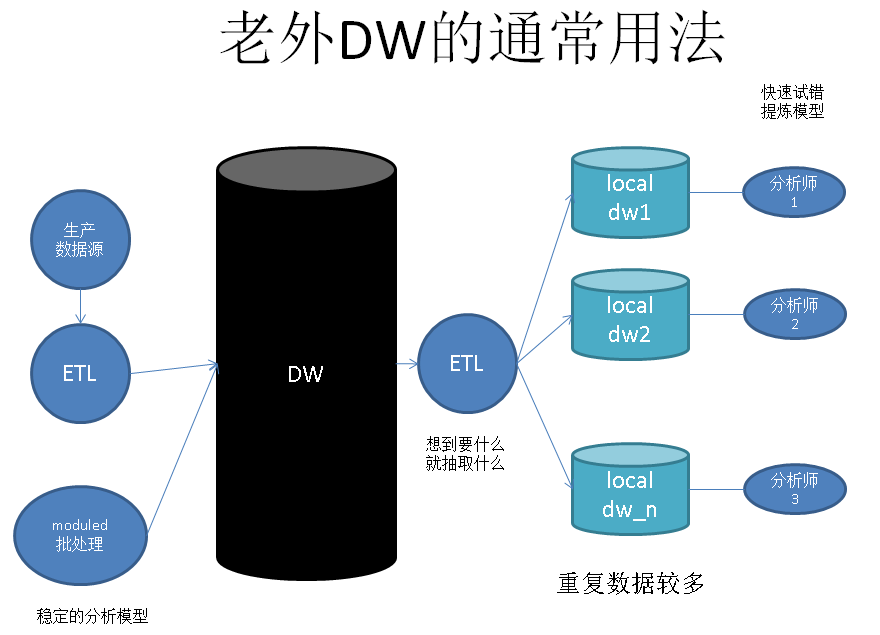
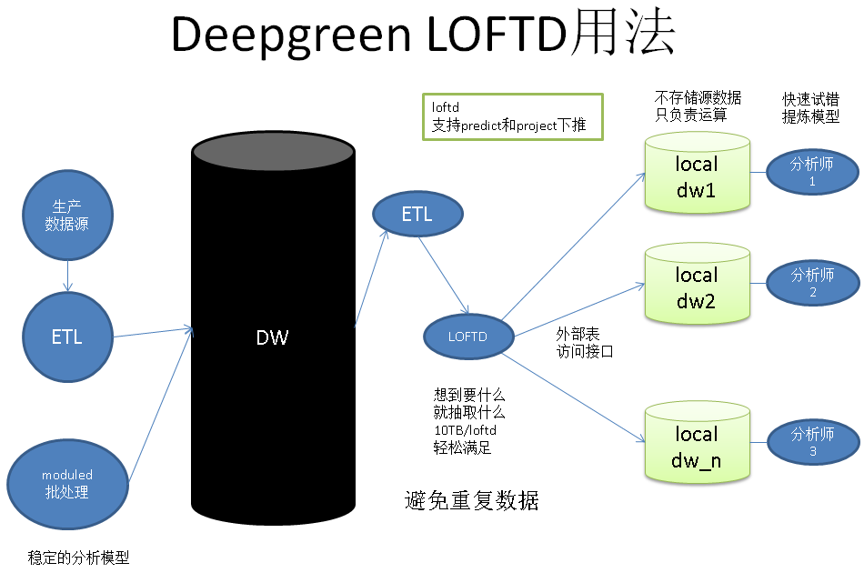
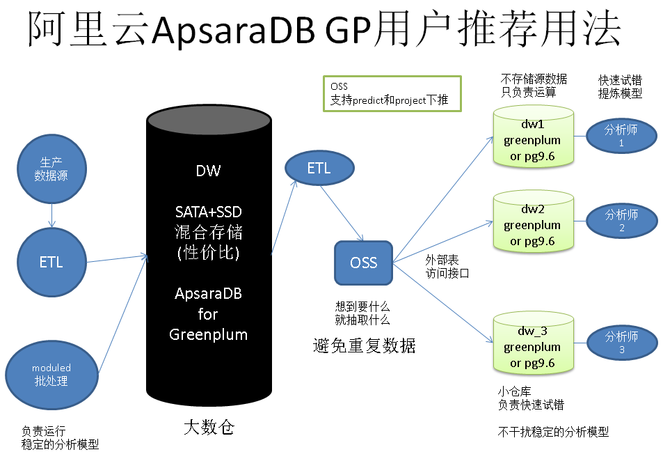

## Greenplum 最佳实践 - 三张图读懂OLAP数据库在企业的正确使用姿势  
##### [TAG 24](../class/24.md) , [TAG 11](../class/11.md)
                  
### 作者                      
digoal                      
                  
### 日期                      
2016-07-15                      
                  
### 标签                      
Greenplum                   
                  
----                      
                  
## 背景  
很多使用数据仓库的朋友可能都有过这样的困惑，为什么数据仓库的资源经常会出现不可控，或者抢用的情况，严重的甚至影响正常的作业任务，导致不能按时输出报表或者分析结果。    
    
这里的原因较多，最主要的原因可能还是使用姿势不对，MPP是用极资源的产品，一伙人在抢资源当然跑不好。你想想一个跑道能让多架飞机同时起飞或降落吗？      
    
## 第一张  
### 老外通常如何使用数据仓库  
数据仓库的使用人员通常是数据分析师，一个成熟的分析模型的建立，可能需要多次的数据模型分析试错。    
    
通常试错不会允许直接在任务库中执行，因为很容易干扰任务库的任务处理，你一定不想因为试错导致报表不能按时输出吧，相信老板会让你好看的。    
      
因此老外通常会将数据仓库分为两种，一种是跑任务的大数仓，所有的数据都在大数仓里面。    
    
分析人员使用的是独立的小型分析库，如果要试错的话，向DBA提交测试数据的ETL申请，拿到数据后进行分析建模，在多次数据模型分析试错后找到成熟的数据分析模型，再提交到大数仓去RUN 任务。    
    
由于分析人员可能较多，不同的分析人员可能会有同一份数据的分析需求，所以这种模式造成了大量的重复试错数据。每个分析师都要问DBA要数据，也会很痛苦。      
  
  
    
## 第二张  
### LOFTD消灭重复试错数据  
LOFTD是一个独立的具备处理predict, project filter请求的文件服务器。    
    
将LOFTD作为一个外部的数据源，读写非常方便。    
    
数据分析人员向DBA提交数据抽取请求，数据被抽取到LOFTD，小型分析库通过外部表的方式访问LOFTD。    
    
并且LOFTD可以共享给多个小型分析库使用，所以消除了数据的冗余。    
  
  
    
## 第三张  
### 阿里云的用户如何正确使用ApsaraDB for Greenplum  
阿里云的用户可以购买SATA+SSD混合存储的Greenplum，以非常高的性价比获得PB级的数据仓库（公测阶段只提供纯SSD的版本）。      
    
用户可以使用ETL工具，或者mysql2pgsql, pgsql2pgsql将数据增量或全量的从MySQL或PgSQL同步到Greenplum。    
    
成熟的分析任务可以跑在这个大的Greenplum数仓上面。     
  
另外，分析人员要数据分析模型试错的话，可以将数据模型分析试错的样本数据导出到OSS。  Greenplum或者RDS PG可以通过OSS外部表直接访问试错数据，进行分析。    
    
ETL可以选择阿里云市场中的ETL服务或者用户自己使用开源的ETL工具，都是非常方便的。    
    
如果试错的数据量（样本数据）在百GB的规模，建议可以直接使用RDS PG。    
  
9.6还会推出CPU并行计算的功能，处理百GB毫无压力。    数据模型分析试错数据再大一点的话，建议还是购买小型的Greenplum。    
    
这样就可以做到跑成熟的数据分析模型，试错两不误。      
    
如果用户 为了节约成本一定要将成熟模型和试错放到一个数据仓库来跑的话，如果你不想因为任务跑不出来被老板批，建议错开任务的时间。    
  
  
  
## 小结  
1\. 正确使用数仓（不管是Greenplum还是其他的数仓），必须要搞清楚跑成熟任务和分析人员模型试错是不要混到一起跑的，相互干扰，时间还漫长。  分析人员很贵的，多加几台机器，把模型试错和成熟任务分开，可以给分析人员灵活的发挥空间，又不耽误跑成熟模型，何乐不为呢。     
    
祝大家玩得开心，欢迎随时来阿里云促膝长谈业务需求 ，恭候光临。  
    
阿里云的小伙伴们加油，努力做 最贴地气的云数据库 。  
    
    
                  

  
  
  
  
  
  
  
  
  
  
  
  
  
  
  
  
  
  
  
  
  
  
  
  
  
  
  
  
  
  
  
  
  
  
  
  
  
  
  
  
  
  
  
  
  
  
  
  
  
  
  
  
  
  
  
  
  
  
  
  
  
  
  
  
  
  
  
  
  
  
  
  
  
#### [PostgreSQL 许愿链接](https://github.com/digoal/blog/issues/76 "269ac3d1c492e938c0191101c7238216")
您的愿望将传达给PG kernel hacker、数据库厂商等, 帮助提高数据库产品质量和功能, 说不定下一个PG版本就有您提出的功能点. 针对非常好的提议，奖励限量版PG文化衫、纪念品、贴纸、PG热门书籍等，奖品丰富，快来许愿。[开不开森](https://github.com/digoal/blog/issues/76 "269ac3d1c492e938c0191101c7238216").  
  
  
#### [9.9元购买3个月阿里云RDS PostgreSQL实例](https://www.aliyun.com/database/postgresqlactivity "57258f76c37864c6e6d23383d05714ea")
  
  
#### [PostgreSQL 解决方案集合](https://yq.aliyun.com/topic/118 "40cff096e9ed7122c512b35d8561d9c8")
  
  
#### [德哥 / digoal's github - 公益是一辈子的事.](https://github.com/digoal/blog/blob/master/README.md "22709685feb7cab07d30f30387f0a9ae")
  
  

  
  
#### [PolarDB 学习图谱: 训练营、培训认证、在线互动实验、解决方案、生态合作、写心得拿奖品](https://www.aliyun.com/database/openpolardb/activity "8642f60e04ed0c814bf9cb9677976bd4")
  
  
#### [购买PolarDB云服务折扣活动进行中, 55元起](https://www.aliyun.com/activity/new/polardb-yunparter?userCode=bsb3t4al "e0495c413bedacabb75ff1e880be465a")
  
  
#### [About 德哥](https://github.com/digoal/blog/blob/master/me/readme.md "a37735981e7704886ffd590565582dd0")
  
