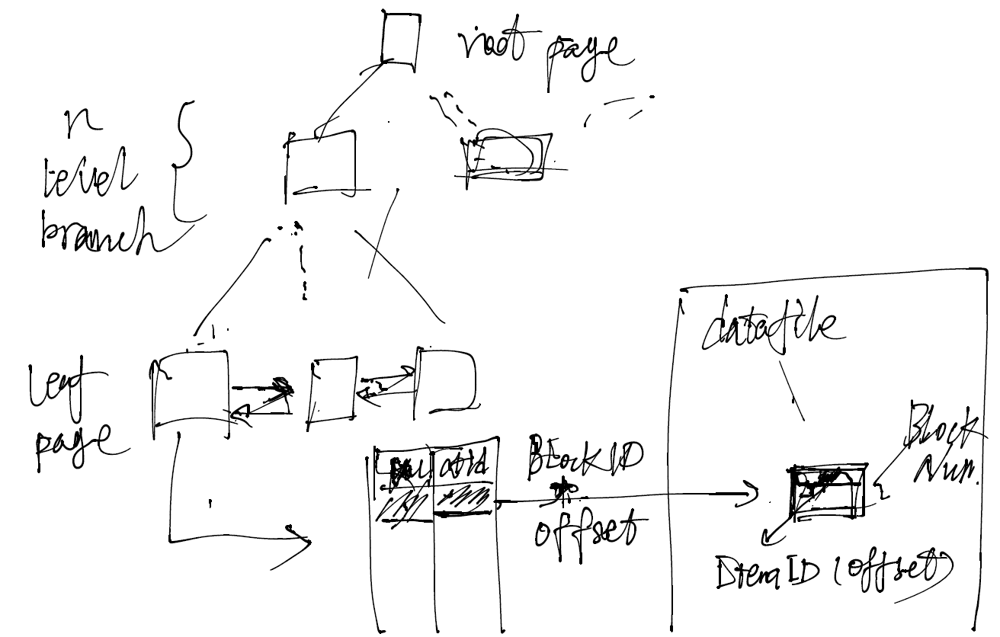
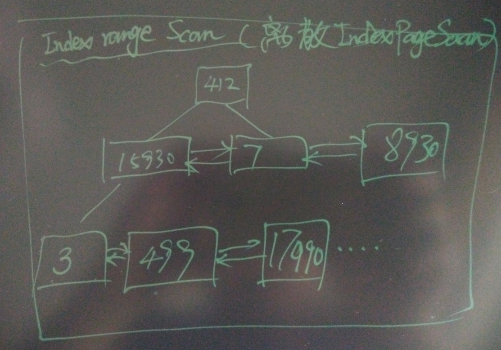

## PostgreSQL 索引扫描offset内核优化 - case  
                      
### 作者                          
digoal                          
                      
### 日期                          
2016-07-17                         
                      
### 标签                          
PostgreSQL , offset , 索引                    
                      
----                          
                      
## 背景  
最近写了好几篇与offset有关的文章，上一篇是解offset质变的问题。    
https://yq.aliyun.com/articles/57730    
    
这一篇要解的是offset偏移量越大，越慢的问题。    
    
offset偏移量很大的情况下，即使走的是索引（没有使用额外的sort），也会很慢，这是为什么呢？      
    
## 原因分析    
1\. PostgreSQL的索引里面没有版本信息，所以判断行是否可见，需要通过索引的CTID定位并访问到HEAP TUPLE，在tuple head中的信息，结合clog，snapshot等信息判断该tuple是否可见。    
  
  
    
由于需要从 HEAP page判断tuple可见性，order by xx offset xx limit xx，offset的tuple全部都要扫一遍，offset偏移量越大越慢。    
    
后来PostgreSQL引入了VISIBILITY MAP，以及INDEX ONLY SCAN，对于没有dead tuple的HEAP PAGE，从索引访问时，不需要到HEAP PAGE判断行的可见性，如果大多数heap page都是clean的，可以降低额外的heap page scan的概率。    
(visibility map用于记录heap page中是否有dirty tuple)      
    
那么什么情况下所有的heap page都是clean的呢？  如果表是insert only的，并且使用read uncommitted的隔离级别，那么就不需要到heap page判断可见性，直接读索引即可。    
    
**insert only table的index only scan + offset** 这种应用场景，是可以从内核层面进行优化的，并且可以取得非常好的优化效果。    
    
2\. 即使使用了index only scan，你会发现，PostgreSQL扫描的PAGE也比预想的多，并没有使用index leaf page的pt_next直接搜索next index page?      
  
(下面的例子中会看到)    
    
## insert only table + index only scan + 大量offset 场景内核优化手段  
因为数据是只插入的，对于read uncommitted的事务隔离级别，不需要从heap中通过版本判断行是否对用户可见。    
    
所以对于insert only table, read uncommitted 事务隔离级别，可以直接访问index。    
    
## 场景举例  
insert only table + index only scan + 大量offset 场景.    
    
测试表, 以及PK离散随机数据      
  
```  
postgres=# create unlogged table tbl(id int primary key, info text, crt_time timestamp);  
postgres=# insert into tbl select trunc(random()*100000000),'test',now() from generate_series(1,50000000) on conflict on constraint tbl_pkey do nothing;  
postgres=# vacuum analyze tbl;  
```  
    
索引和heap的pages占用    
  
```  
postgres=# select relpages from pg_class where relname='tbl';  
 relpages   
----------  
   250600  
(1 row)  
  
postgres=# select relpages from pg_class where relname='tbl_pkey';  
 relpages   
----------  
   107881  
(1 row)  
```  
    
offset 1000000行，如果走index only scan，使用index page的"双向链表"进行index range scan， 理论上不需要访问747849 个数据块，BTPageOpaqueData中包含了左右BLOCK ID，跨页访问不需要再回到root page。    
    
但是从测试结果来看，确实访问了过多的数据块，即使是index only scan。    
    
这是内核优化需要做的，把index only scan的page scan降低到实际需要扫的pages。    
  
```  
postgres=# explain (analyze,verbose,timing,costs,buffers) select id from tbl order by id offset 1000000 limit 10;  
                                                                     QUERY PLAN                                                                        
-----------------------------------------------------------------------------------------------------------------------------------  
 Limit  (cost=25968.49..25968.75 rows=10 width=4) (actual time=547.094..547.101 rows=10 loops=1)  
   Output: id  
   Buffers: shared hit=747849 read=2705  
   ->  Index Only Scan using tbl_pkey on public.tbl  (cost=0.56..1021687.32 rows=39344184 width=4) (actual time=0.031..360.758 rows=1000010 loops=1)  
         Output: id  
         Heap Fetches: 0  
         Buffers: shared hit=747849 read=2705  
 Planning time: 0.107 ms  
 Execution time: 547.131 ms  
(9 rows)  
  
  
postgres=# explain (analyze,verbose,timing,costs,buffers) select * from tbl order by id offset 1000000 limit 10;  
                                                                    QUERY PLAN                                                                      
-----------------------------------------------------------------------------------------------------------------------------------  
 Limit  (cost=51443.93..51444.45 rows=10 width=17) (actual time=2646.299..2646.316 rows=10 loops=1)  
   Output: id, info, crt_time  
   Buffers: shared hit=828838 read=173904 written=17651  
   ->  Index Scan using tbl_pkey on public.tbl  (cost=0.56..2023997.81 rows=39344184 width=17) (actual time=0.044..2445.983 rows=1000010 loops=1)  
         Output: id, info, crt_time  
         Buffers: shared hit=828838 read=173904 written=17651  
 Planning time: 0.114 ms  
 Execution time: 2646.349 ms  
(8 rows)  
```  
    
## 本文涉及的btree索引结构  
1\.   索引页中包含相邻PAGE信息，结构如下，存放在index page的special space里面（index页尾）。    
  
使用它来做index range scan可以大大降低本文提到的大批量数据扫描所需扫描的pages。    
  
src/include/access/nbtree.h    
  
```  
typedef struct BTPageOpaqueData  
{  
        BlockNumber btpo_prev;          /* left sibling, or P_NONE if leftmost */  
        BlockNumber btpo_next;          /* right sibling, or P_NONE if rightmost */  
        union  
        {  
                uint32          level;          /* tree level --- zero for leaf pages */  
                TransactionId xact;             /* next transaction ID, if deleted */  
        }                       btpo;  
        uint16          btpo_flags;             /* flag bits, see below */  
        BTCycleId       btpo_cycleid;   /* vacuum cycle ID of latest split */  
} BTPageOpaqueData;  
```  
      
2\. b-tree索引的叶子节点，相邻块并不一定是物理相邻的BLOCK，看例子：      
  
```  
postgres=#  select * from bt_metap('tbl1_pkey');  
 magic  | version |  root  | level | fastroot | fastlevel   
--------+---------+--------+-------+----------+-----------  
 340322 |       2 | 117123 |     3 |   117123 |         3  
(1 row)  
  
postgres=#  select * from bt_page_items('tbl1_pkey',117123);  
 itemoffset |    ctid    | itemlen | nulls | vars |          data             
------------+------------+---------+-------+------+-------------------------  
          1 | (412,1)    |       8 | f     | f    |   
          2 | (117122,1) |      16 | f     | f    | b5 0f 31 04 00 00 00 00  
(2 rows)  
  
postgres=#  select * from bt_page_items('tbl1_pkey',412);  
 itemoffset |    ctid    | itemlen | nulls | vars |          data             
------------+------------+---------+-------+------+-------------------------  
          1 | (19325,1)  |      16 | f     | f    | b5 0f 31 04 00 00 00 00  
          2 | (3,1)      |       8 | f     | f    |   
          3 | (109431,1) |      16 | f     | f    | 9f b5 02 00 00 00 00 00  
          4 | (52242,1)  |      16 | f     | f    | 06 cf 05 00 00 00 00 00  
          5 | (95690,1)  |      16 | f     | f    | bf f4 08 00 00 00 00 00  
...  
postgres=#  select * from bt_page_items('tbl1_pkey',3);  -- 返回的是叶子节点的数据块  
 itemoffset |    ctid    | itemlen | nulls | vars |          data             
------------+------------+---------+-------+------+-------------------------  
          1 | (88774,1)  |      16 | f     | f    | 9f b5 02 00 00 00 00 00  
          2 | (1,1)      |       8 | f     | f    |   
          3 | (100620,1) |      16 | f     | f    | b5 02 00 00 00 00 00 00  
          4 | (50720,1)  |      16 | f     | f    | 8b 05 00 00 00 00 00 00  
...  
postgres=#  select * from bt_page_items('tbl1_pkey',1);  --  叶子节点，返回heap ctid  
 itemoffset |     ctid     | itemlen | nulls | vars |          data             
------------+--------------+---------+-------+------+-------------------------  
          1 | (147618,75)  |      16 | f     | f    | b5 02 00 00 00 00 00 00  
          2 | (215874,86)  |      16 | f     | f    | 02 00 00 00 00 00 00 00  
          3 | (26831,109)  |      16 | f     | f    | 03 00 00 00 00 00 00 00  
          4 | (74722,117)  |      16 | f     | f    | 04 00 00 00 00 00 00 00  
          5 | (186526,71)  |      16 | f     | f    | 08 00 00 00 00 00 00 00  
          6 | (105855,132) |      16 | f     | f    | 0e 00 00 00 00 00 00 00  
...  
        272 | (166516,27)  |      16 | f     | f    | b3 02 00 00 00 00 00 00  
(272 rows)  
```  
    
叶子节点 block 1的相邻节点是block 100620，显然是不相邻的。      
    
因此根据索引的范围查询，仅索引BLOCK的访问就是非常离散的，再加上HEAP PAGE的访问，都是非常离散的。 好在索引页每一页都能放几百条，所以几百条的查询，实际上被访问的INDEX PAGE并不会太多。      
  
  
    
## 小结  
1\. 对于查询结果可以直接在索引输出的，带上OFFSET输出的话，可以用上 index only scan，但是从现在社区版本的情况来看，还有优化余地，至少能把需要访问的block下降。    
    
PostgreSQL的b-tree是类似"双向链表"的结构，内核层面根据index leaf page的btpo_next，实施index range scan，不需要额外的INDEX PAGE访问。       
      
2\. 索引的leaf page(s)，branch page(s)都是离散的，只是逻辑结构上是树状的，同级page之间是通过类似双向链表的形式组织的。    
    
因此index range scan时，index page扫描也是离散的。   比如做一个index only scan，offset一批数据或者直接scan一堆数据，都是离散的扫描。    
  
```  
postgres=# explain (analyze,verbose,timing,costs,buffers) select id from tbl offset 1000000 limit 10;  
                                                                     QUERY PLAN                                                                        
-----------------------------------------------------------------------------------------------------------------------------------------------------  
 Limit  (cost=25968.49..25968.75 rows=10 width=4) (actual time=528.914..528.921 rows=10 loops=1)  
   Output: id  
   Buffers: shared hit=750554  
   ->  Index Only Scan using tbl_pkey on public.tbl  (cost=0.56..1021687.32 rows=39344184 width=4) (actual time=0.030..347.409 rows=1000010 loops=1)  
         Output: id  
         Heap Fetches: 0  
         Buffers: shared hit=750554  -- offset与直接scan输出扫描的pages一致。    
 Planning time: 0.083 ms  
 Execution time: 528.948 ms  
(9 rows)  
  
  
postgres=# explain (analyze,verbose,timing,costs,buffers) select id from tbl limit 1000010;  
                                                                     QUERY PLAN                                                                        
-----------------------------------------------------------------------------------------------------------------------------------------------------  
 Limit  (cost=0.56..25968.75 rows=1000010 width=4) (actual time=0.032..736.929 rows=1000010 loops=1)  
   Output: id  
   Buffers: shared hit=750554  
   ->  Index Only Scan using tbl_pkey on public.tbl  (cost=0.56..1021687.32 rows=39344184 width=4) (actual time=0.031..362.791 rows=1000010 loops=1)  
         Output: id  
         Heap Fetches: 0  
         Buffers: shared hit=750554  -- offset与直接scan输出扫描的pages一致。    
 Planning time: 0.097 ms  
 Execution time: 916.256 ms  
(9 rows)  
```  
    
## 术语  
1\. tuple，row    
  
2\. ctid，行号（blocknum, 页内offset）    
    
祝大家玩得开心，欢迎随时来阿里云促膝长谈业务需求 ，恭候光临。    
    
阿里云的小伙伴们加油，努力做 最贴地气的云数据库 。      
    
     
                      

  
<a rel="nofollow" href="http://info.flagcounter.com/h9V1"  ></a>  
  
  
  
  
  
  
## [digoal's 大量PostgreSQL文章入口](https://github.com/digoal/blog/blob/master/README.md "22709685feb7cab07d30f30387f0a9ae")
  
