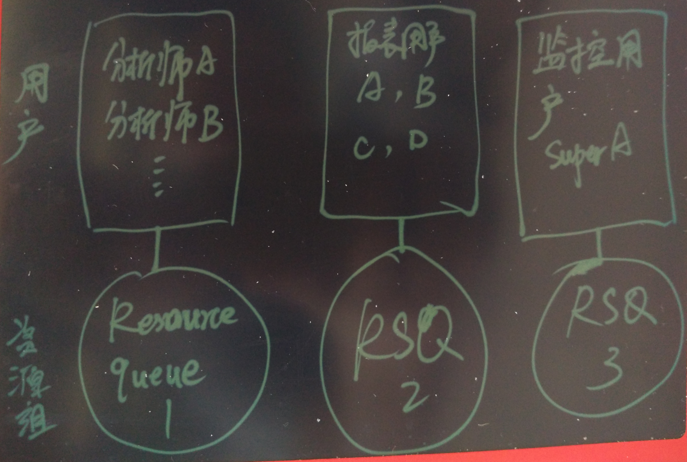
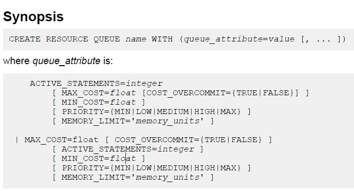
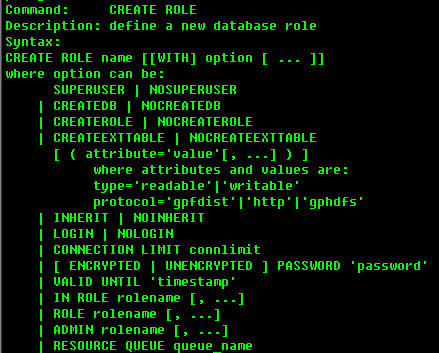
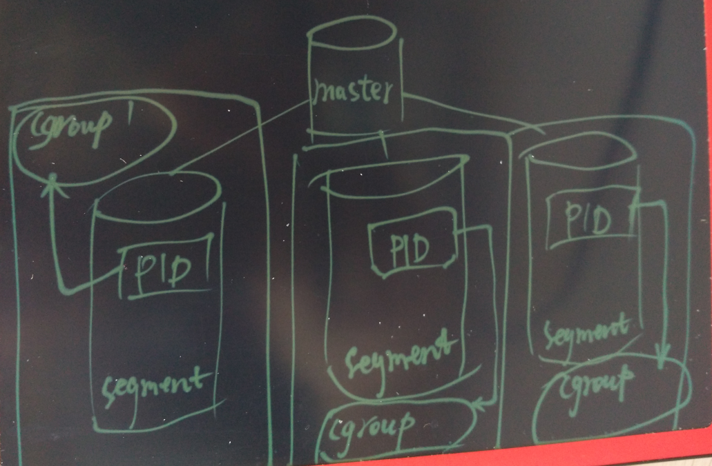
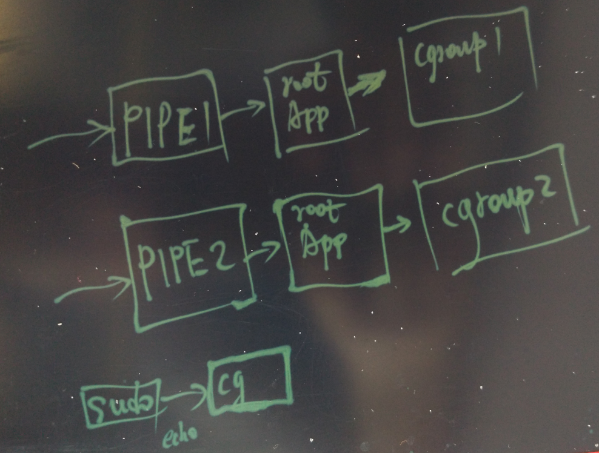

## Greenplum 资源隔离的原理与源码分析  
##### [TAG 11](../class/11.md)
                        
### 作者                            
digoal                            
                        
### 日期                            
2016-07-18                          
                        
### 标签                            
Greenplum , 资源隔离 , 源码浅析                 
                        
----                            
                        
## 背景  
Greenplum是一个MPP的数据仓库系统，最大的优点是水平扩展，并且一个QUERY就能将硬件资源的能力发挥到极致。    
    
但这也是被一些用户诟病的一点，因为一个的QUERY就可能占光所有的硬件资源，所以并发一多的话，query相互之间的资源争抢就比较严重。    
    
## Greenplum资源隔离的手段  
Greenplum为了降低并发query之间的资源争抢，设计了一套基于resource queue的资源管理方法。    
    
每个resource queue定义了资源的使用或限制模式，根据用户的用途将用户指派给resource queue，这样就起到了资源管理的目的。    
    
例如将分析师、跑报表的、ETL分为三用户。根据这三类用户的预期资源使用情况，以及任务的优先级，规划三类资源管理的队列。分别将三类用户和三类resource queue绑定，起到资源控制的作用。      
  
    
    
### resource queue的创建语法  
    
    
### 支持的资源隔离类别  
* active_statements，  该queue同时可以运行的query数量。    
  
* max_cost，指资源组内所有正在运行的query的评估成本的最大值。    
  
* cost_overcommit，当系统空闲时，是否允许该queue的query总cost超出设定的max_cost。    
  
* min_cost 指低于该值的QUERY不计入该queue 的cost成本，也不排队，而是直接执行。    
  
* priority  ， 用于平衡各个QUEUE之间的CPU争抢使用，分为5个等级，每个等级设定了响应的weight，间隔一定的时间判断使用的资源是否达到了weight，然后对该queue 的query使用pg_usleep进行抑制。    
  
* mem_limit  ， 为队列中单个segment query(s)允许的最大statement(s)运行内存。    
    
创建resource queue时必须设置active_statements与max_cost之一。    
    
只有超级用户能创建和修改resource queue。    
    
绑定角色与resource queue    
  
    
    
### resource queue用法举例    
创建两个资源队列，指派给两个用户（一个资源队列可以指派给多个用户）。    
  
```  
postgres=# create resource queue min with (active_statements=3, priority=min);  
CREATE QUEUE  
postgres=# create resource queue max with (active_statements=1, priority=max);  
CREATE QUEUE  
postgres=# create role max login encrypted password '123' resource queue max;  
CREATE ROLE  
postgres=# create role min login encrypted password '123' resource queue min;  
CREATE ROLE  
```  
    
## Greenplum资源隔离的相关代码    
src/include/catalog/pg_resqueue.h    
  
```  
#define PG_RESRCTYPE_ACTIVE_STATEMENTS  1       /* rsqcountlimit:                       count  */  
#define PG_RESRCTYPE_MAX_COST                   2       /* rsqcostlimit:                max_cost */  
#define PG_RESRCTYPE_MIN_COST                   3       /* rsqignorecostlimit:          min_cost */  
#define PG_RESRCTYPE_COST_OVERCOMMIT    4       /* rsqovercommit:                       cost_overcommit*/  
						/* start of "pg_resourcetype" entries... */  
#define PG_RESRCTYPE_PRIORITY                   5       /* backoff.c:                   priority queue */  
#define PG_RESRCTYPE_MEMORY_LIMIT               6       /* memquota.c:                  memory quota */  
```  
  
接下来我挑选了CPU的资源调度进行源码的分析，其他的几个本文就不分析了。    
    
### CPU的资源隔离  
src/backend/postmaster/backoff.c    
  
五个CPU优先级级别，以及对应的weight(可通过gp_adjust_priority函数调整当前query的weight)。    
  
```  
typedef struct PriorityMapping  
{  
        const char *priorityVal;  
        int weight;  
} PriorityMapping;  
  
const struct PriorityMapping priority_map[] = {  
                {"MAX", 1000000},  
                {"HIGH", 1000},  
                {"MEDIUM", 500},  
                {"LOW", 200},  
                {"MIN", 100},  
                /* End of list marker */  
                {NULL, 0}  
};  
```  
    
单个进程的资源使用统计信息数据结构    
  
```  
/**  
 * This is information that only the current backend ever needs to see.  
 */  
typedef struct BackoffBackendLocalEntry  
{  
        int                                     processId;              /* Process Id of backend */  
        struct rusage           startUsage;             /* Usage when current statement began. To account for caching of backends. */  
        struct rusage           lastUsage;              /* Usage statistics when backend process performed local backoff action */  
        double                          lastSleepTime;  /* Last sleep time when local backing-off action was performed */  
        int                             counter;                /* Local counter is used as an approx measure of time */  
        bool                            inTick;                 /* Is backend currently performing tick? - to prevent nested calls */  
        bool                            groupingTimeExpired;    /* Should backend try to find better leader? */  
} BackoffBackendLocalEntry;  
```  
    
单个segment或master内所有进程共享的资源使用统计信息数据结构    
  
```  
/**  
 * There is a backend entry for every backend with a valid backendid on the master and segments.  
 */  
typedef struct BackoffBackendSharedEntry  
{  
        struct  StatementId     statementId;            /* A statement Id. Can be invalid. */  
        int                                     groupLeaderIndex;       /* Who is my leader? */  
        int                                     groupSize;                      /* How many in my group ? */  
        int                                     numFollowers;           /* How many followers do I have? */  
  
        /* These fields are written by backend and read by sweeper process */  
        struct timeval          lastCheckTime;          /* Last time the backend process performed local back-off action.  
                                                                                                Used to determine inactive backends. */  
  
        /* These fields are written to by sweeper and read by backend */  
        bool                            noBackoff;                      /* If set, then no backoff to be performed by this backend */  
        double                          targetUsage;            /* Current target CPU usage as calculated by sweeper */  
        bool                            earlyBackoffExit;       /* Sweeper asking backend to stop backing off */  
  
        /* These fields are written to and read by sweeper */  
        bool                            isActive;                       /* Sweeper marking backend as active based on lastCheckTime */  
        int                                     numFollowersActive;     /* If backend is a leader, this represents number of followers that are active */  
  
        /* These fields are wrtten by backend during init and by manual adjustment */  
        int                                     weight;                         /* Weight of this statement */  
} BackoffBackendSharedEntry;  
  
  
/* In ms */  
#define MIN_SLEEP_THRESHOLD  5000  
  
/* In ms */  
#define DEFAULT_SLEEP_TIME 100.0  
```  
    
通过getrusage()系统调用获得进程的资源使用情况    
  
```  
        /* Provide tracing information */  
        PG_TRACE1(backoff__localcheck, MyBackendId);  
  
        if (gettimeofday(&currentTime, NULL) < 0)  
        {  
                elog(ERROR, "Unable to execute gettimeofday(). Please disable query prioritization.");  
        }  
  
        if (getrusage(RUSAGE_SELF, &currentUsage) < 0)  
        {  
                elog(ERROR, "Unable to execute getrusage(). Please disable query prioritization.");  
        }  
```  
    
资源使用换算    
  
```  
        if (!se->noBackoff)  
        {  
  
                /* How much did the cpu work on behalf of this process - incl user and sys time */  
                thisProcessTime = TIMEVAL_DIFF_USEC(currentUsage.ru_utime, le->lastUsage.ru_utime)  
                                                                                + TIMEVAL_DIFF_USEC(currentUsage.ru_stime, le->lastUsage.ru_stime);  
  
                /* Absolute cpu time since the last check. This accounts for multiple procs per segment */  
                totalTime = TIMEVAL_DIFF_USEC(currentTime, se->lastCheckTime);  
  
                cpuRatio = thisProcessTime / totalTime;  
  
                cpuRatio = Min(cpuRatio, 1.0);  
  
                changeFactor = cpuRatio / se->targetUsage;      // 和priority的weight有关,     
		// 和参数gp_resqueue_priority_cpucores_per_segment有关, double CPUAvailable = numProcsPerSegment(); 有关,     
		// se->targetUsage = (CPUAvailable) * (se->weight) / activeWeight / gl->numFollowersActive;  
  
                le->lastSleepTime *= changeFactor;  // 计算是否需要sleep  
  
                if (le->lastSleepTime < DEFAULT_SLEEP_TIME)  
                        le->lastSleepTime = DEFAULT_SLEEP_TIME;  
```  
    
超出MIN_SLEEP_THRESHOLD则进入休眠    
  
```  
                memcpy( &le->lastUsage, &currentUsage, sizeof(currentUsage));  
                memcpy( &se->lastCheckTime, &currentTime, sizeof(currentTime));  
  
                if (le->lastSleepTime > MIN_SLEEP_THRESHOLD)  // 计算是否需要sleep  
                {  
                        /*  
                         * Sleeping happens in chunks so that the backend may exit early from its sleep if the sweeper requests it to.  
                         */  
                        int j =0;  
                        long sleepInterval = ((long) gp_resqueue_priority_sweeper_interval) * 1000L;  
                        int numIterations = (int) (le->lastSleepTime / sleepInterval);  
                        double leftOver = (double) ((long) le->lastSleepTime % sleepInterval);  
                        for (j=0;j<numIterations;j++)  
                        {  
                                /* Sleep a chunk */  
                                pg_usleep(sleepInterval);   // 休眠  
                                /* Check for early backoff exit */  
                                if (se->earlyBackoffExit)  
                                {  
                                        le->lastSleepTime = DEFAULT_SLEEP_TIME;   /* Minimize sleep time since we may need to recompute from scratch */  
                                        break;  
                                }  
                        }  
                        if (j==numIterations)  
                                pg_usleep(leftOver);  
                }  
        }  
```  
    
除了前面的休眠调度，还需要考虑当数据库空闲的时候，应该尽量使用数据库的资源，那么什么情况下不进入休眠呢？    
  
```  
        /**  
         * Under certain conditions, we want to avoid backoff. Cases are:  
         * 1. A statement just entered or exited  
         * 2. A statement's weight changed due to user intervention via gp_adjust_priority()  
         * 3. There is no active backend  
         * 4. There is exactly one statement  
         * 5. Total number valid of backends <= number of procs per segment(gp_resqueue_priority_cpucores_per_segment 参数设置)  
         * Case 1 and 2 are approximated by checking if total statement weight changed since last sweeper loop.  
         */  
```  
    
## 如何调整正在执行的query的weight  
当正在执行一个query时，如果发现它太占资源，我们可以动态的设置它的weight。    
    
当一个query正在执行时，可以调整它的priority    
  
```  
postgres=# set gp_debug_resqueue_priority=on;  
postgres=# set client_min_messages ='debug';  
  
查询当前的resource queue priority    
postgres=# select * from gp_toolkit.gp_resq_priority_statement;  
 rqpdatname | rqpusename | rqpsession | rqpcommand | rqppriority | rqpweight |                        rqpquery                          
------------+------------+------------+------------+-------------+-----------+--------------------------------------------------------  
 postgres   | digoal     |         21 |          1 | MAX         |   1000000 | select pg_sleep(1000000) from gp_dist_random('gp_id');  
 postgres   | digoal     |         22 |          1 | MAX         |   1000000 | select pg_sleep(1000000) from gp_dist_random('gp_id');  
 postgres   | digoal     |         23 |          1 | MAX         |   1000000 | select pg_sleep(1000000) from gp_dist_random('gp_id');  
 postgres   | digoal     |         24 |          1 | MAX         |   1000000 | select pg_sleep(1000000) from gp_dist_random('gp_id');  
 postgres   | digoal     |         25 |          1 | MAX         |   1000000 | select pg_sleep(1000000) from gp_dist_random('gp_id');  
 postgres   | digoal     |         26 |         65 | MAX         |   1000000 | select * from gp_toolkit.gp_resq_priority_statement;  
(6 rows)  
  
设置，可以直接设置priority的别名（MIN, MAX, LOW, HIGH, MEDIAM）,或者使用数字设置weight。    
postgres=# select gp_adjust_priority(21,1,'MIN');  
LOG:  changing weight of (21:1) from 1000000 to 100  
 gp_adjust_priority   
--------------------  
                  1  
(1 row)  
postgres=# select * from gp_toolkit.gp_resq_priority_statement;  
 rqpdatname | rqpusename | rqpsession | rqpcommand | rqppriority | rqpweight |                        rqpquery                          
------------+------------+------------+------------+-------------+-----------+--------------------------------------------------------  
 postgres   | digoal     |         21 |          1 | MIN         |       100 | select pg_sleep(1000000) from gp_dist_random('gp_id');  
  
600是一个非标准的priority，所以显示NON-STANDARD    
postgres=# select gp_adjust_priority(21,1,600);  
postgres=# select * from gp_toolkit.gp_resq_priority_statement;  
 rqpdatname | rqpusename | rqpsession | rqpcommand | rqppriority  | rqpweight |                        rqpquery                          
------------+------------+------------+------------+--------------+-----------+--------------------------------------------------------  
 postgres   | digoal     |         21 |          1 | NON-STANDARD |       600 | select pg_sleep(1000000) from gp_dist_random('gp_id');  
```  
    
代码如下      
  
```  
/**  
 * An interface to re-weigh an existing session on the master and all backends.  
 * Input:  
 *      session id - what session is statement on?  
 *      command count - what is the command count of statement.  
 *      priority value - text, what should be the new priority of this statement.  
 * Output:  
 *      number of backends whose weights were changed by this call.  
 */  
Datum  
gp_adjust_priority_value(PG_FUNCTION_ARGS)  
{  
        int32 session_id = PG_GETARG_INT32(0);  
        int32 command_count = PG_GETARG_INT32(1);  
        Datum           dVal = PG_GETARG_DATUM(2);  
        char *priorityVal = NULL;  
        int wt = 0;  
  
        priorityVal = DatumGetCString(DirectFunctionCall1(textout, dVal));  
  
        if (!priorityVal)  
        {  
                elog(ERROR, "Invalid priority value specified.");  
        }  
  
        wt = BackoffPriorityValueToInt(priorityVal);  
  
        Assert(wt > 0);  
  
        pfree(priorityVal);  
  
        return DirectFunctionCall3(gp_adjust_priority_int, Int32GetDatum(session_id),  
                                                                Int32GetDatum(command_count), Int32GetDatum(wt));  
  
}  
```  
    
## 通过cgroup细粒度控制query的资源使用  
前面讲的是Greenplum通过自带的resource queue来控制资源使用的情况，但是Greenplum控制的资源种类有限，有没有更细粒度的控制方法呢？      
    
如果要进行更细粒度的控制，可以考虑使用cgroup来隔离各个query的资源使用。    
    
可以做到对cpu, memory, iops, network的细粒度控制。    
    
做法也很简单，      
  
首先要在所有的物理主机创建对应的cgroup，例如为每个资源分配几个等级。      
  
* cpu: 分若干个等级       
  
* memory: 分若干个等级     
  
* iops: 分若干个等级       
  
* network: 分若干个等级      
    
  
    
然后获得会话对应的所有节点的backend pid，将backend pid move到对应的cgroup即可。    
  
  
    
祝大家玩得开心，欢迎随时来阿里云促膝长谈业务需求 ，恭候光临。    
    
阿里云的小伙伴们加油，努力做 最贴地气的云数据库 。    
                        

  
<a rel="nofollow" href="http://info.flagcounter.com/h9V1"  ></a>  
  
  
  
  
  
  
## [digoal's 大量PostgreSQL文章入口](https://github.com/digoal/blog/blob/master/README.md "22709685feb7cab07d30f30387f0a9ae")
  
