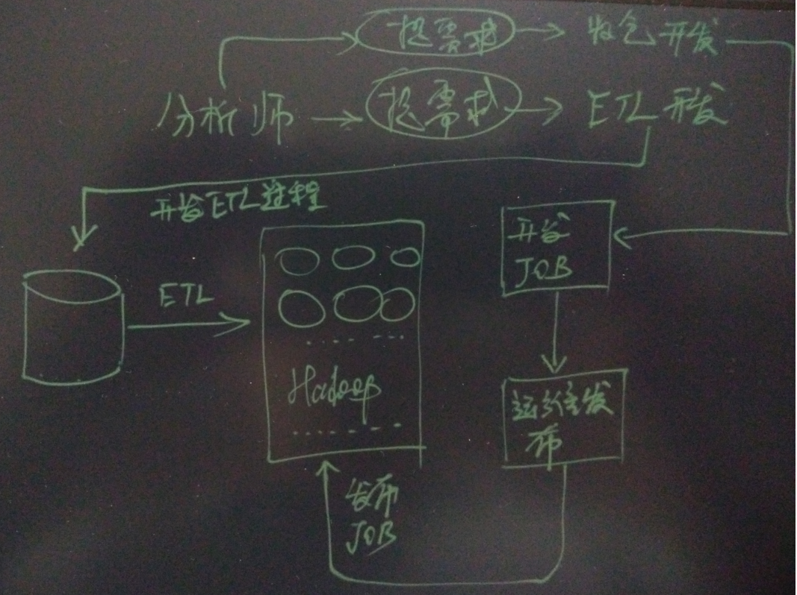
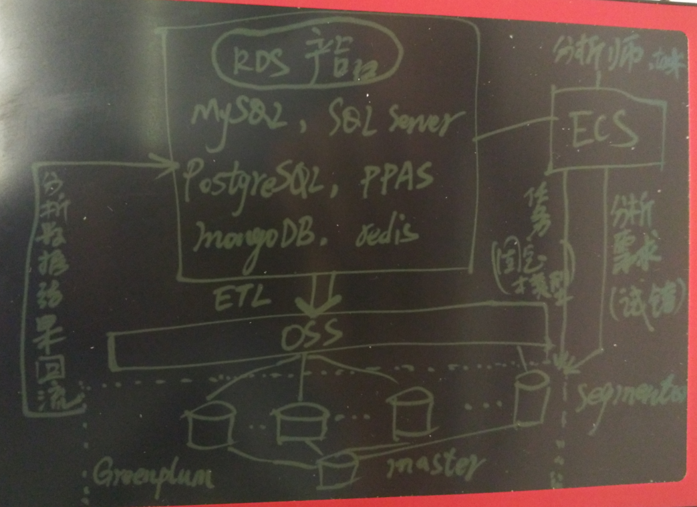
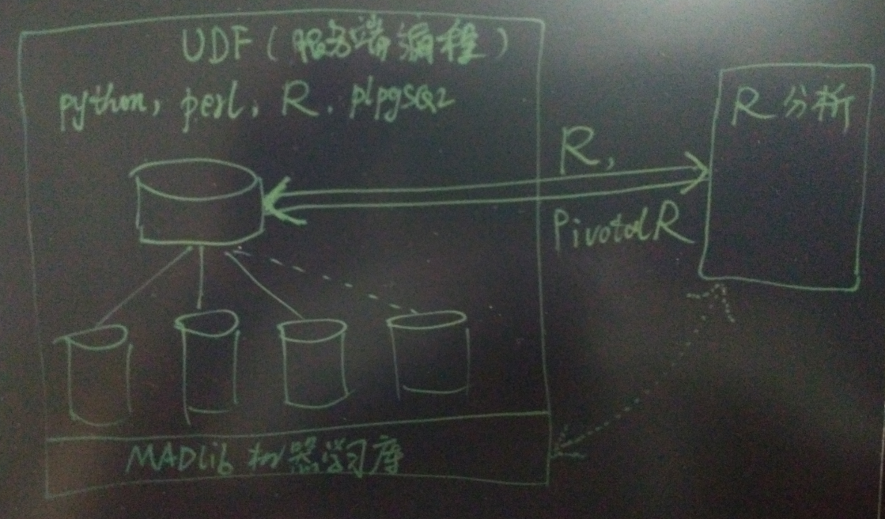

## 阿里云ApsaraDB RDS用户 - OLAP最佳实践  
##### [TAG 24](../class/24.md)
                          
### 作者                              
digoal                              
                          
### 日期                              
2016-07-19                            
                          
### 标签                              
PostgreSQL , Greenplum , OLAP , 阿里云 RDS , ApsaraDB , MySQL                  
                          
----                              
                          
## 背景  
随着大数据分析型产品越来越丰富、细化，用户可能会看得眼花缭乱，如果对产品没有深度的理解，选错了岂不是劳民伤财？      
    
本文将给大家分析一下RDS用户应该如何选择适合自己的大数据的分析产品，以及最佳实践方案。    
    
## 用户环境分析  
以最常用的服务举例，通常云用户会购买的产品如下    
  
* ECS，虚拟机  
  
* RDS，云数据库，包括(MySQL, SQL Server, PostgreSQL, PPAS, mongodb, redis, memcache, petadata)等。    
  
* OSS，对象存储（廉价的数据存储服务，也是阿里云各产品之间数据交换的桥梁）  
  
## 大数据分析产品Greenplum的定位  
* Greenplum  
  
  分布式并行计算数据仓库，生态非常成熟，在 **运营商、金融、物流、公安、政府、互联网** 等行业都有非常庞大的用户群体。      
  
  提供全面的SQL支持(包括符合SQL2008标准的OLAP分析函数)，业界流行的BI软件都可以直接使用Greenplum进行在线业务分析。    
    
  支持行存储和列存储混合模式，提高分析性能；同时提供数据压缩技术，降低存储成本。支持XML、GIS地理信息、模糊字符串等丰富的数据类型。      
  
  支持 MADlib 机器学习库，为 **物联网、互联网、金融、政企** 等行业提供丰富的业务分析能力。    
  
  用户如果自建Hadoop，无法适应处在飞速发展期的企业数据分析需求，因为一个分析可能需要经过 **分析师、ETL、运营、开发人员 多种角色，还需要部署任务，流程很长** 。哪怕是小小的分析也需要耗费很长的链路和时间。    
    
    
    
  
    
  如果你的企业处在飞速的发展期，分析模型和需求变化会很快，Greenplum 为分析人员提供了快速的试错便利。    
  
  从 **百TB到PB** 的OLAP仓库，Greenplum无疑是非常好的选择。    
    
  **对于飞速发展的企业来说，窗口期很重要，选择一个正确的数据分析产品，可以帮助用户快速试错，大大提高效率**。    
    
## RDS+Greenplum最佳实践  
阿里云的用户应该如何利用好Greenplum呢？    
    
还是老样子，一张图读懂如何用好Greenplum    
  
不管你是MySQL, SQL Server, PostgreSQL, PPAS 还是mongodb，数据流都是一致统一的，大大降低了用户的使用成本。    
  
  
    
用户分析数据来源可能是RDS、文件。      
    
Greenplum作为分析数据库，用户可以将Greenplum作为纯计算引擎使用，也可以作为计算和存储引擎。    
    
因为Greenplum是通用的SQL接口，所以数据建模试错非常敏捷，数据分析师申请好数据库账号就可以大刀阔斧的建模试错了。    
    
同时Greenplum还支持plpython、plperl、plpgsql、plR各种服务端编程语言，用户可以自行选择开发服务端的UDF。    
    
除此之外，用户如果习惯使用R语言进行分析的话，也可以使用R直接连接Greenplum，满足隐式并行的分析需求。    
  
    
    
### Greenplum作为纯计算引擎  
Greenplum通过外部表的方式访问需要分析的数据，因此数据不需要导入Greenplum。    
    
（PS: 计算时，自动将OSS数据载入Greenplum。）    
    
建议用户将需要分析的数据导入到OSS（例如每天将前一天的数据导出到OSS），Greenplum可以并行的访问OSS中的数据，以充分利用带宽提高数据提取的速度。    
    
适合用户有固定建模的场景，并且运算时间在用户接受的范围内，可以给用户节约不少成本。    
      
### Greenplum作为计算和存储引擎  
数据导入到Greenplum数据库，因为少了数据提取的过程，所以分析时更快。    
    
数据导入到Greenplum也建议走OSS通道，充分利用带宽，加快导入速度。    
    
---   
  
 **同时为用户提供三种不同性价比的方案**    
  
### 廉价方案  
所有的数据都不落地，全部存储在OSS，Greenplum只存储分析结果。    
    
### 大众方案  
常用的数据放在Greenplum（例如最近半年），历史数据放在OSS。    
    
用resource group隔离ETL、固定的分析任务、实时试错分析。    
    
推荐使用大众方案      
  
  
    
### 土豪方案  
所有的数据都放在Greenplum本地，将固定模型和试错环境的Greenplum分为两套环境。      
    
## Greenplum访问OSS外部表的方法  
https://yq.aliyun.com/articles/31632    
  
```  
CREATE [READABLE] EXTERNAL TABLE tablename  
( columnname datatype [, ...] | LIKE othertable )  
LOCATION ('ossprotocol')  
FORMAT '...'  
[ ENCODING 'encoding' ]  
[ LOG ERRORS ...]  
  
ossprotocol:  
   oss://oss_endpoint filepath=[folder/[folder/]...]/file_name   
    id=userossid key=userosskey bucket=ossbucket  
  
ossprotocol:  
   oss://oss_endpoint dir=[folder/[folder/]...]/file_name   
    id=userossid key=userosskey bucket=ossbucket  
```  
    
## 参考  
《Greenplum资源隔离指南》    
  
https://yq.aliyun.com/articles/57763     
    
《三张图读懂Greenplum在企业的正确使用姿势》    
  
https://yq.aliyun.com/articles/57736    
  
《Greenplum 公测申请页面》    
  
https://www.aliyun.com/product/gpdb?spm=5176.7960203.237031.39.3xWeRa    
  
祝大家玩得开心，欢迎随时来阿里云促膝长谈业务需求 ，恭候光临。    
  
阿里云的小伙伴们加油，努力做 最贴地气的云数据库 。     
                          

  
<a rel="nofollow" href="http://info.flagcounter.com/h9V1"  ></a>  
  
  
  
  
  
  
## [digoal's 大量PostgreSQL文章入口](https://github.com/digoal/blog/blob/master/README.md "22709685feb7cab07d30f30387f0a9ae")
  
