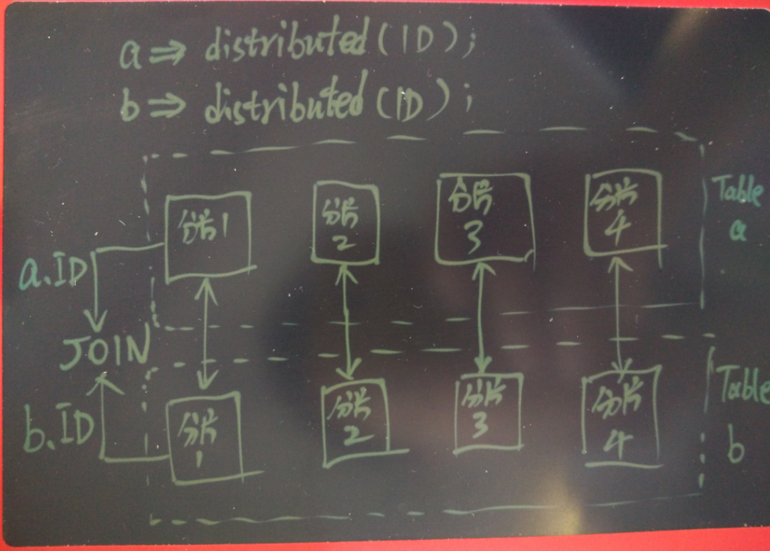
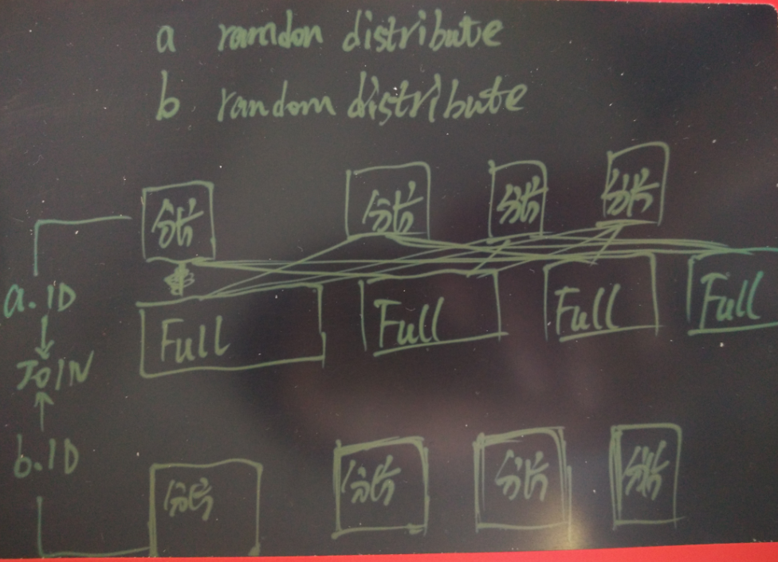
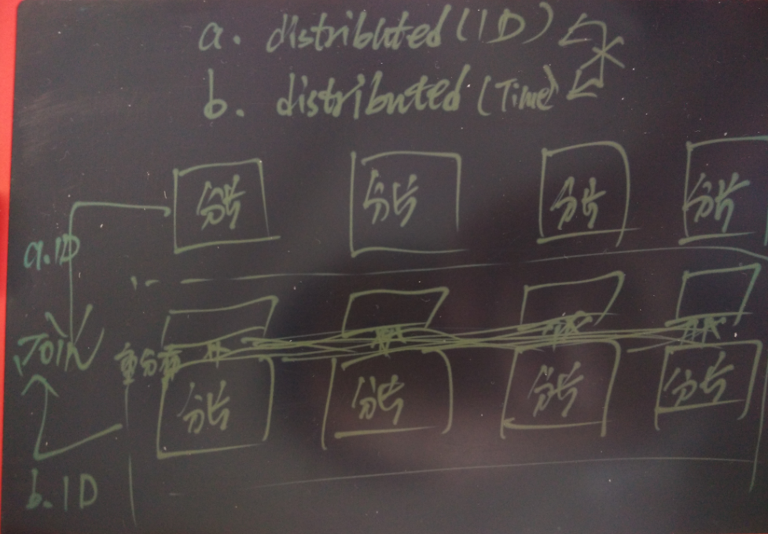

## Greenplum 最佳实践 - 数据分布黄金法则 - 分布列与分区的选择  
##### [TAG 24](../class/24.md) , [TAG 11](../class/11.md)
                            
### 作者                                
digoal                                
                            
### 日期                                
2016-07-19                              
                            
### 标签                                
PostgreSQL , Greenplum , OLAP , 阿里云 RDS , ApsaraDB , MySQL , 数据分布 , 分区键选择                     
                            
----                                
                            
## 背景  
阿里云ApsaraDB for Greenplum公测以来，已经收到好多用户的公测申请。    
      
要使用Greenplum，登陆到数据库后第一件事当然是建表，然后倒入数据开测。    
      
大部分用户以前是使用MySQL的，并没有接触过Greenplum，语法需要适应一下。    
    
例如MySQL中的建表语句    
  
```  
DROP TABLE IF EXISTS  `ab01`;  
CREATE TABLE `ab01` (  
  `aab001` bigint(10) NOT NULL ,  
  `aab007` varchar(50) DEFAULT NULL ,  
  `aab008` decimal(14,0) DEFAULT NULL ,  
  `create_time` datetime NOT NULL ,  
  `deleteedflag` bit(1) DEFAULT b'0' ,  
  PRIMARY KEY (`aab001`)  
) ENGINE=InnoDB DEFAULT CHARSET=utf8 ;  
```  
    
在Greenplum中可以写成    
  
```  
DROP TABLE IF EXISTS  ab01;  
CREATE TABLE ab01 (  
  aab001 int8 NOT NULL ,  
  aab007 varchar(50) DEFAULT NULL ,  
  aab008 decimal(14,0) DEFAULT NULL ,  -- 长度 <=15 的decimal建议替换成float8, 运算效率比decimal高  
  create_time timestamp(0) NOT NULL ,  
  deleteedflag bit(1) DEFAULT b'0' ,  
  PRIMARY KEY (aab001)  
) ;   
```  
    
Greenplum完整的建表语法参考本文末尾。    
    
## 分布列选择黄金法则  
由于Greenplum是一个分布式的数据库，数据是分散存储在各个数据节点的，所以需要告诉Greenplum数据应该如何分布。    
    
 **短板效应**  
    
当用户请求QUERY时，Greenplum会在所有的节点并行执行，所以最慢的节点会成为整个系统的瓶颈。      
    
Greenplum 支持的分布算法 :   
    
用户可以指定 **分布列(允许指定多个列)** ，或者使用 **随机分布** 算法。    
    
那么用户应该如何选择分布列，或者是否要使用随机分布算法呢？    
    
总结起来，需要考虑以下几点      
  
* JOIN    
  
  当JOIN的列都是分布列时，不需要重分布或广播小表，可以在segment内完成JOIN。      
  
    
  
  两个表在JOIN时，如果JOIN列不是表的分布列，那么其中一个更小的表会发生数据重分布，或者broadcast，以继续完成JOIN的动作。      
  
例如a和b都是随机分布的，在JOIN时，要么广播小表，要么两个表都根据JOIN 列重分布。    
  
  
  
例如a和b，其中a是JOIN列分布，b不是，那么b可以选择广播，或者重分布。     
  
  
  
  重分布或广播的动作都是自动完成的，但是这样一定会带来额外的网络开销。    
    
  想象一下，如果你的QUERY并发很高，而且大量的QUERY中涉及到JOIN的数据重分布或broadcast的话，网络很快就会成为瓶颈。    
    
  法则1，分布列尽量选择需要经常JOIN的列，这类查询的并发越高，越应该考虑。  
    
* 防止数据倾斜  
  
  Greenplum依据指定的分布列，hash取模存放到对应的segment中。    
    
  如果选择的分布列值分布不均匀，就可能导致数据倾斜，某些segment可能非常大，而某些segment非常小。    
    
  数据倾斜的显著危害，1. 空间不均匀，不好规划存储。2. 数据分布过多的节点，容易成为整个系统的短板。    
    
  法则2，尽量选择分布均匀的列，或者多列  
    
* 高并发查询，选择性好  
  
  如果数据经常被高并发的键值或离散查询，建议将查询条件的列作为分布列，这样不需要连接到所有的segment去查，可以大大提高并发能力。    
    
  例子    
    
  aa01 的分布列是aaz499  
    
  查询分布列时，定位到一个segment查询    
  
```  
postgres=# explain analyze select * from aa01 where aaz499=1;  
                                    QUERY PLAN                                      
----------------------------------------------------------------------------------  
 Gather Motion 1:1  (slice1; segments: 1)  (cost=0.00..120.00 rows=1 width=1973)  
   Rows out:  0 rows at destination with 1.352 ms to end, start offset by 144 ms.  
   ->  Seq Scan on aa01  (cost=0.00..120.00 rows=1 width=1973)  
         Filter: aaz499 = 1  
         Rows out:  0 rows with 0.031 ms to end, start offset by 145 ms.  
 Slice statistics:  
   (slice0)    Executor memory: 330K bytes.  
   (slice1)    Executor memory: 176K bytes (seg10).  
 Statement statistics:  
   Memory used: 128000K bytes  
 Optimizer status: legacy query optimizer  
 Total runtime: 145.822 ms  
(12 rows)  
```  
    
  查询非分布列，需要所有的segment参与查询    
  
```  
postgres=# explain analyze select * from aa01 where cae007='t';  
                                     QUERY PLAN                                       
------------------------------------------------------------------------------------  
 Gather Motion 16:1  (slice1; segments: 16)  (cost=0.00..120.00 rows=2 width=1973)  
   Rows out:  0 rows at destination with 2.001 ms to end, start offset by 146 ms.  
   ->  Seq Scan on aa01  (cost=0.00..120.00 rows=1 width=1973)  
         Filter: cae007::text = 't'::text  
         Rows out:  0 rows (seg0) with 0.047 ms to end, start offset by 147 ms.  
 Slice statistics:  
   (slice0)    Executor memory: 330K bytes.  
   (slice1)    Executor memory: 176K bytes avg x 16 workers, 176K bytes max (seg0).  
 Statement statistics:  
   Memory used: 128000K bytes  
 Optimizer status: legacy query optimizer  
 Total runtime: 147.813 ms  
(12 rows)  
```  
  
  法则3，尽量选择高并发查询的条件列（指该查询条件产生的中间结果集小的，如果中间结果集很大，那就让所有节点都来参与运算更好，因此不选），如果有多个条件，请先权衡前面的法则  
    
  法则4，不要轻易使用随机分布  
    
## 分区黄金法则  
目前Greenplum支持LIST和RANGE两种分区类型。    
    
分区的目的是尽可能的缩小QUERY需要扫描的数据量，因此必须和查询条件相关联。    
    
法则1，尽量选择和查询条件相关的字段，缩小QUERY需要扫描的数据  
  
法则2，当有多个查询条件时，可以使用子分区，进一步缩小需要扫描的数据  
    
例子，一个用户发起了带两个查询条件col1=xx and col2 between ?1 and ?2 的请求，通过分区，如果表已经根据col1进行了LIST分区，同时根据col2进行了range的分区，那么查询范围可以大大的缩小。    
  
  
    
## 如何查看分布键
1\. 使用psql查看  
  
```
postgres=# \d mv1
     Table "postgres.mv1"
 Column |  Type   | Modifiers 
--------+---------+-----------
 did    | integer | 
 bid    | integer | 
 cid    | integer | 
 aid    | integer | 
Indexes:
    "idx_mv1_did" btree (did)
Distributed by: (did)
```
  
2\. 使用SQL查看  
  
```
postgres=# select attname from pg_attribute 
where attrelid='postgres.mv1'::regclass 
and attnum in (SELECT unnest(attrnums) FROM pg_catalog.gp_distribution_policy t where localoid='postgres.mv1'::regclass);
 attname 
---------
 did
(1 row)
```
  
## 如何查看分区定义
1\. 使用psql查看  
  
```
\d+ log2

                            Table "postgres.log2"
  Column  |            Type             | Modifiers | Storage  | Description 
----------+-----------------------------+-----------+----------+-------------
 did      | integer                     |           | plain    | 
 state    | smallint                    |           | plain    | 
 crt_time | timestamp without time zone |           | plain    | 
 mod_time | timestamp without time zone |           | plain    | 
 aid      | integer                     |           | plain    | 
 path     | text                        |           | extended | 
 cid      | integer                     |           | plain    | 
 bid      | integer                     |           | plain    | 
Child tables: log2_1_prt_1,
              log2_1_prt_10,
              log2_1_prt_11,
              log2_1_prt_12,
              log2_1_prt_2,
              log2_1_prt_3,
              log2_1_prt_4,
              log2_1_prt_5,
              log2_1_prt_6,
              log2_1_prt_7,
              log2_1_prt_8,
              log2_1_prt_9
Has OIDs: no
Distributed by: (did)
```
  
2\. 使用SQL查看   
  
```
postgres=# select pg_get_partition_def('postgres.log2'::regclass,true);
                                                                  pg_get_partition_def                                                                   
---------------------------------------------------------------------------------------------------------------------------------------------------------
 PARTITION BY RANGE(crt_time)                                                                                                                            
           (                                                                                                                                             
           START ('2017-01-01 00:00:00'::timestamp without time zone) END ('2018-01-01 00:00:00'::timestamp without time zone) EVERY ('1 mon'::interval) 
           )
(1 row)
```
  
## 小结  
* 分布列选择法则  
  
  原则，避免短板效应。    
    
  法则1，分布列尽量选择需要经常JOIN的列，这类查询的并发越高，越应该考虑。  
    
  法则2，尽量选择分布均匀的列，或者多列  
    
  法则3，尽量选择高并发查询的条件列（指该查询条件产生的中间结果集小的，如果中间结果集很大，那就让所有节点都来参与运算更好，因此不选），如果有多个条件，请先权衡前面的法则  
    
  法则4，不要轻易使用随机分布  
    
* 分区法则  
  
  原则，缩小查询范围。    
    
  法则1，尽量选择和查询条件相关的字段，缩小QUERY需要扫描的数据  
    
  法则2，当有多个查询条件时，可以使用子分区，进一步缩小需要扫描的数据  
  
## 参考  
《阿里云ApsaraDB RDS用户 - OLAP最佳实践》    
  
https://yq.aliyun.com/articles/57778    
    
《Greenplum资源隔离指南》    
  
https://yq.aliyun.com/articles/57763    
    
《三张图读懂Greenplum在企业的正确使用姿势》    
  
https://yq.aliyun.com/articles/57736    
    
《Greenplum 公测申请页面》    
  
https://www.aliyun.com/product/gpdb?spm=5176.7960203.237031.39.3xWeRa    
    
Greenplum完整的建表语法如下 :   
  
```  
Command:     CREATE TABLE  
Description: define a new table  
Syntax:  
CREATE [[GLOBAL | LOCAL] {TEMPORARY | TEMP}] TABLE table_name (   
[ { column_name data_type [ DEFAULT default_expr ]     [column_constraint [ ... ]  
[ ENCODING ( storage_directive [,...] ) ]  
]   
   | table_constraint  
   | LIKE other_table [{INCLUDING | EXCLUDING}   
                      {DEFAULTS | CONSTRAINTS}] ...}  
   [, ... ] ]  
   [column_reference_storage_directive [, ... ]  
   )  
   [ INHERITS ( parent_table [, ... ] ) ]  
   [ WITH ( storage_parameter=value [, ... ] )  
   [ ON COMMIT {PRESERVE ROWS | DELETE ROWS | DROP} ]  
   [ TABLESPACE tablespace ]  
   [ DISTRIBUTED BY (column, [ ... ] ) | DISTRIBUTED RANDOMLY ]  -- 分布算法的选择  
   [ PARTITION BY partition_type (column)  
       [ SUBPARTITION BY partition_type (column) ]   
          [ SUBPARTITION TEMPLATE ( template_spec ) ]  
       [...]  
    ( partition_spec )   
        | [ SUBPARTITION BY partition_type (column) ]  
          [...]  
    ( partition_spec   
      [ ( subpartition_spec   
           [(...)]   
         ) ]   
    )  
where storage_parameter is:  
   APPENDONLY={TRUE|FALSE}  
   BLOCKSIZE={8192-2097152}  
   ORIENTATION={COLUMN|ROW}  
   COMPRESSTYPE={ZLIB|QUICKLZ|RLE_TYPE|NONE}  
   COMPRESSLEVEL={0-9}  
   CHECKSUM={TRUE|FALSE}  
   FILLFACTOR={10-100}  
   OIDS[=TRUE|FALSE]  
where column_constraint is:  
   [CONSTRAINT constraint_name]  
   NOT NULL | NULL   
   | UNIQUE [USING INDEX TABLESPACE tablespace]  
            [WITH ( FILLFACTOR = value )]  
   | PRIMARY KEY [USING INDEX TABLESPACE tablespace]   
                 [WITH ( FILLFACTOR = value )]  
   | CHECK ( expression )  
and table_constraint is:  
   [CONSTRAINT constraint_name]  
   UNIQUE ( column_name [, ... ] )  
          [USING INDEX TABLESPACE tablespace]   
          [WITH ( FILLFACTOR=value )]   
   | PRIMARY KEY ( column_name [, ... ] )   
                 [USING INDEX TABLESPACE tablespace]   
                 [WITH ( FILLFACTOR=value )]   
   | CHECK ( expression )  
where partition_type is:  
    LIST  
  | RANGE  
where partition_specification is:  
partition_element [, ...]  
and partition_element is:  
   DEFAULT PARTITION name  
  | [PARTITION name] VALUES (list_value [,...] )  
  | [PARTITION name]   
     START ([datatype] 'start_value') [INCLUSIVE | EXCLUSIVE]  
     [ END ([datatype] 'end_value') [INCLUSIVE | EXCLUSIVE] ]  
     [ EVERY ([datatype] [number | INTERVAL] 'interval_value') ]  
  | [PARTITION name]   
     END ([datatype] 'end_value') [INCLUSIVE | EXCLUSIVE]  
     [ EVERY ([datatype] [number | INTERVAL] 'interval_value') ]  
[ WITH ( partition_storage_parameter=value [, ... ] ) ]  
[column_reference_storage_directive [, ...] ]  
[ TABLESPACE tablespace ]  
where subpartition_spec or template_spec is:  
subpartition_element [, ...]  
and subpartition_element is:  
   DEFAULT SUBPARTITION name  
  | [SUBPARTITION name] VALUES (list_value [,...] )  
  | [SUBPARTITION name]   
     START ([datatype] 'start_value') [INCLUSIVE | EXCLUSIVE]  
     [ END ([datatype] 'end_value') [INCLUSIVE | EXCLUSIVE] ]  
     [ EVERY ([datatype] [number | INTERVAL] 'interval_value') ]  
  | [SUBPARTITION name]   
     END ([datatype] 'end_value') [INCLUSIVE | EXCLUSIVE]  
     [ EVERY ([datatype] [number | INTERVAL] 'interval_value') ]  
[ WITH ( partition_storage_parameter=value [, ... ] ) ]  
[column_reference_storage_directive [, ...] ]  
[ TABLESPACE tablespace ]  
where storage_directive is:  
   COMPRESSTYPE={ZLIB | QUICKLZ | RLE_TYPE | NONE}   
 | COMPRESSLEVEL={0-9}   
 | BLOCKSIZE={8192-2097152}  
Where column_reference_storage_directive is:  
   COLUMN column_name ENCODING ( storage_directive [, ... ] ), ...   
 | DEFAULT COLUMN ENCODING ( storage_directive [, ... ] )  
```  
  
例子  
  
```
create table tbl (id int, info text) partition by range (id) (default partition def, start (1) end (10000000) every (1000000));
```
  
```
CREATE TABLE rank (id int, rank int, year int, gender char(1), count int)
DISTRIBUTED BY (id)
PARTITION BY RANGE (year)
  ( START (2001) END (2008) EVERY (1),
    DEFAULT PARTITION extra );
```
  
```
CREATE TABLE rank (id int, rank int, year int, gender char(1), count int )
DISTRIBUTED BY (id)
PARTITION BY LIST (gender)
  ( PARTITION girls VALUES ('F'),
    PARTITION boys VALUES ('M'),
    DEFAULT PARTITION other );
```
  
多级分区例子  
  
```
create table t_p (id int8, x float, y float) 
PARTITION by range (x) 
  SUBPARTITION BY range (y) 
    SUBPARTITION TEMPLATE 
    (start (-90) end (90) every(15)) 
(start (-180) end (180) every(30));
```
  
```
CREATE TABLE sales (trans_id int, date date, amount decimal(9,2), region text)
DISTRIBUTED BY (trans_id)
PARTITION BY RANGE (date)
  SUBPARTITION BY LIST (region)
    SUBPARTITION TEMPLATE
    ( SUBPARTITION usa VALUES ('usa'),
      SUBPARTITION asia VALUES ('asia'),
      SUBPARTITION europe VALUES ('europe'),
      DEFAULT SUBPARTITION other_regions )
( START (date '2008-01-01') INCLUSIVE
  END (date '2009-01-01') EXCLUSIVE
  EVERY (INTERVAL '1 month') ),
DEFAULT PARTITION outlying_dates );
```
  
```
CREATE TABLE sales (trans_id int, date date, amount decimal(9,2), region text)
DISTRIBUTED BY (trans_id)
PARTITION BY RANGE (date)
  SUBPARTITION BY LIST (region)
    SUBPARTITION TEMPLATE
    ( SUBPARTITION usa VALUES ('usa'),
      SUBPARTITION asia VALUES ('asia'),
      SUBPARTITION europe VALUES ('europe'),
      DEFAULT SUBPARTITION other_regions)
( START (date '2008-01-01') INCLUSIVE
  END (date '2009-01-01') EXCLUSIVE
  EVERY (INTERVAL '1 month') ),
DEFAULT PARTITION outlying_dates );
```
  
http://www.dbaref.com/creating-partitioned-tables-in-greenplum   
    
祝大家玩得开心，欢迎随时来 **阿里云促膝长谈** 业务需求 ，恭候光临。  
    
阿里云的小伙伴们加油，努力做 **最贴地气的云数据库**  。  
    
                            

  
<a rel="nofollow" href="http://info.flagcounter.com/h9V1"  ></a>  
  
  
  
  
  
  
## [digoal's 大量PostgreSQL文章入口](https://github.com/digoal/blog/blob/master/README.md "22709685feb7cab07d30f30387f0a9ae")
  
