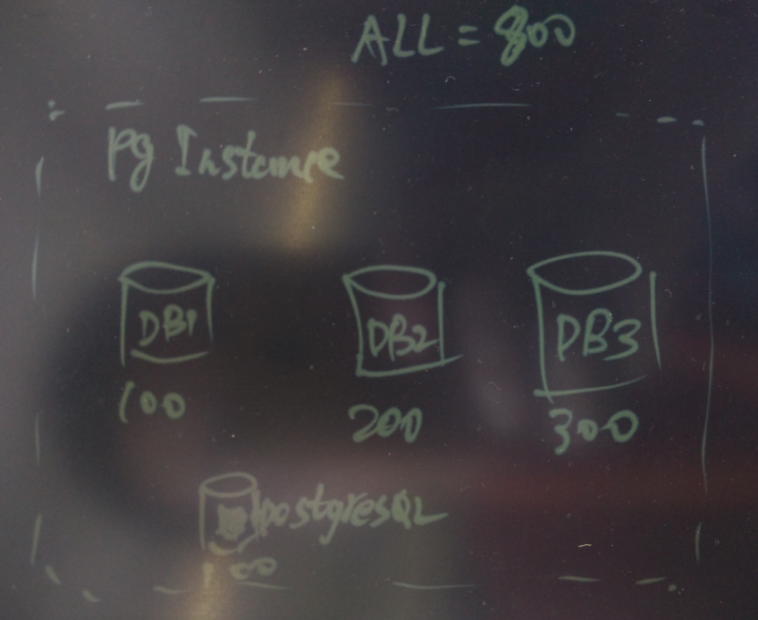
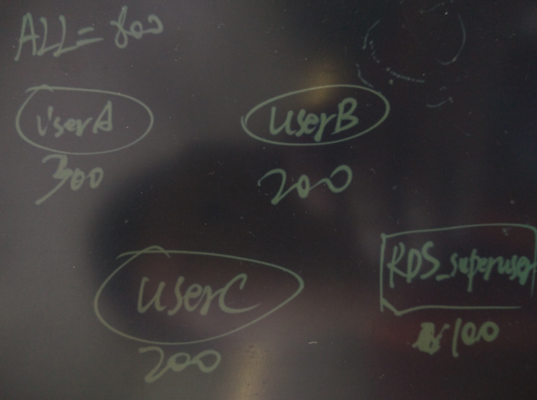

## 阿里云RDS PG/PPAS(Oracle 兼容版) 用户连接规划   
##### [TAG 24](../class/24.md)
                                
### 作者                                    
digoal                                    
                                
### 日期                                    
2016-07-21                                  
                                
### 标签                                    
PostgreSQL , 阿里云 RDS , 连接规划                      
                                
----                                    
                                
## 背景  
PostgreSQL在设计时为DBA考虑了保留连接，通过参数superuser_reserved_connections来控制，也就是说当数据库的最大连接为100时，普通用户最多能连100-superuser_reserved_connections个连接。    
    
剩余的连接是给超级用户保留的，方便DBA连接到数据库进行维护。      
    
但是由于RDS PG/PPAS的用户拿到的是普通用户，如果用户程序有问题，把所有普通用户的连接占满，用户将无法连接到RDS进行问题的排查，就像高速公路堵车连生命通道也堵了。    
  
  
    
用户遇到这种情况怎么办呢怎么办？      
    
目前的方法是提工单，RDS的售后来帮助处理，但是效率肯定没有用户自己处理高，要经过提工单的过程。      
    
有没有更好的方法呢？     
  
## RDS PG用户连接的规划  
PostgreSQL 的连接控制可以精确到数据库或用户。    
    
当用户在一个实例创建了多个用户时，可以为每个用户设置最大连接数。    
  
  
    
当用户一个实例创建了多个数据库时，可以为每个数据库设置最大的连接数。    
  
  
      
通过这两种手段，就可以为用户留出生命通道。    
    
## 用法举例  
1\. 用户购买了RDS PG的实例，实例规格为1000个连接，选择了一个rds超级用户名为rds_superuser_digoal，用户又创建了一些普通用户。    
  
( rds 超级用户 是介于 数据库超级用户 与 普通用户之间的一种用户。 )    
    
```  
create role r1 login encrypted password 'pwd' connection limit 100;  
create role r2 login encrypted password 'pwd' connection limit 500;  
create role r3 login encrypted password 'pwd' connection limit 300;  
```  
    
用户使用r1 最多能连100个连接，以此类推。  因此保留给rds_superuser_digoal的有100个连接。  出了问题用户还能用rds_superuser_digoal连接数据库进行排查。    
    
用户也可以通过设置数据库的连接限制，来给postgres或者template1保留连接。    
  
```  
create database db1 connection limit 100;  
...  
```  
    
祝大家玩得开心，欢迎随时来 **阿里云促膝长谈** 业务需求 ，恭候光临。  
  
阿里云的小伙伴们加油，努力做 **最贴地气的云数据库** 。  
    
    
                                

  
  
  
  
  
  
  
  
  
  
  
  
  
  
  
  
  
  
  
  
  
  
  
  
  
  
  
  
  
  
  
  
  
  
  
  
  
#### [免费领取阿里云RDS PostgreSQL实例、ECS虚拟机](https://www.aliyun.com/database/postgresqlactivity "57258f76c37864c6e6d23383d05714ea")
  
  
#### [大量阿里云PG解决方案: 任意维度实时圈人; 时序数据实时处理; 时间、空间、业务 多维数据实时透视; 独立事件相关性分析; 海量关系实时图式搜索; 社交业务案例; 流式数据实时处理案例; 物联网; 全文检索; 模糊、正则查询案例; 图像识别; 向量相似检索; 数据清洗、采样、脱敏、批处理、合并; GIS 地理信息空间数据应用; 金融业务; 异步消息应用案例; 海量数据 冷热分离; 倒排索引案例; 海量数据OLAP处理应用;](https://yq.aliyun.com/topic/118 "40cff096e9ed7122c512b35d8561d9c8")
  
  
#### [德哥的 / digoal's PostgreSQL文章入口 - 努力做成PG资源最丰富的个人blog](https://github.com/digoal/blog/blob/master/README.md "22709685feb7cab07d30f30387f0a9ae")
  
  

  
