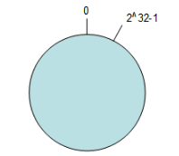
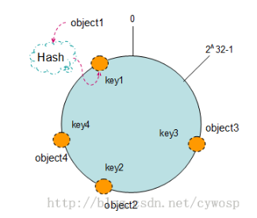
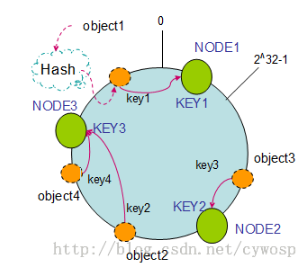
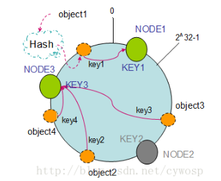
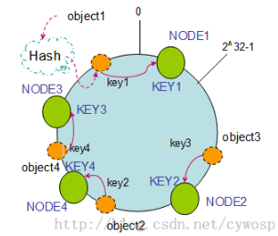
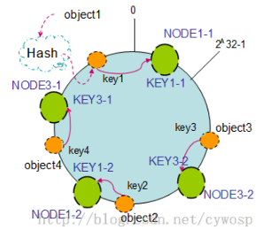

## 一致性哈希在分布式数据库中的应用探索    
                                            
### 作者                                                
digoal                                                
                                            
### 日期                                                
2016-07-23                                              
                                            
### 标签                                                
Greenplum , 一致性哈希 , 扩容 , 平均扩容                           
                                            
----                                                
                                            
## 背景    
本文大部分内容参考自      
    
http://blog.csdn.net/cywosp/article/details/23397179      
    
在分布式数据库中，设计数据分布算法通常需要考虑到几点      
      
* 平衡性(Balance)      
    
  平衡性是指哈希的结果能够尽可能分布到所有的分片节点中去，这样可以使得所有的分片节点都得到利用。    
    
  很多哈希算法都能够满足这一条件。      
      
* 单调性(Monotonicity)      
    
  单调性是指如果已经有一些内容通过哈希分派到了相应的分片节点中，又有新的分片节点加入到系统中。    
    
  哈希的结果应能够保证原有已分配的内容可以被映射到原有的或者新的分片节点中去，而不会被映射到旧的分片节点集合中的其他分片节点。     
    
  例如原来有4个分片节点，如果加一个分片节点，则在进行数据重分布时，已有节点的数据只可能继续在已有当前节点待着 或 移动到新加的节点，绝对不会移动到已有的其他节点。      
      
* 分散性(Spread)      
    
  在分布式环境中，终端有可能看不到所有的分片数据，而是只能看到其中的一部分。    
    
  当终端希望通过哈希过程将内容映射到分片节点上时，由于不同终端所见的分片节点范围有可能不同，从而导致哈希的结果不一致，最终的结果是相同的内容被不同的终端映射到不同的分片节点中。    
    
  这种情况显然是应该避免的，因为它导致相同内容被存储到不同分片节点中去，降低了系统存储的效率。    
    
  分散性的定义就是上述情况发生的严重程度。    
    
  好的哈希算法应能够尽量避免不一致的情况发生，也就是尽量降低分散性。     
      
* 负载(Load)      
    
  负载问题实际上是从另一个角度看待分散性问题。    
    
  既然不同的终端可能将相同的内容映射到不同的分片节点中，那么对于一个特定的分片节点而言，也可能被不同的用户映射为不同的内容。      
    
  与分散性一样，这种情况也是应当避免的，因此好的哈希算法应能够尽量降低分片节点的负荷。    
      
## 哈希取模    
用得较多的分片算法是哈希取模决定数据分片映射关系。       
      
例子 mod(hash(column), 4) 可以将数据分片到4个分片节点。        
      
为了满足单调性，哈希取模的方式在扩展或者删除节点时，必须以目标为倍数或者整除数的节点个数进行。      
      
例子      
      
原来有8个分片，需要进行扩容时，最终的节点数必须是8的倍数。  如扩成24个节点。      
      
那么原来 mod(x, 8) = 0 的 现在 mod(x, 24) = 0 或 16 或 24 。      
      
这样的话，原有节点的数据在扩容的过程中，一定是在原有节点，或者在新加的节点。      
      
删除节点也是同样的道理，必须删除到整除数为止。  例如 从24个节点删除到剩下8个节点。      
      
如果不以倍数或者整除数的目标数进行扩容或缩容，那么旧的节点之间也会有数据相互移动的可能。      
        
因此哈希取模的方式弹性不够。      
        
## 一致性哈希    
### 环形Hash空间    
按照常用的hash算法来将对应的key哈希到一个具有2^32次方个桶的空间中，即0~(2^32)-1的数字空间中。    
      
现在我们可以将这些数字头尾相连，想象成一个闭合的环形。如下图      
    
    
      
了解PostgreSQL的童鞋一定会联想到XID吧，XID也是循环使用的。      
      
只不过引入了冻结的概念，冻结号在闭环内移动，从而确保了XID循环使用时始终有一半是未来的，有一半是过去的XID。      
      
### 把数据通过一定的hash算法处理后映射到环上      
现在我们将object1、object2、object3、object4四个对象通过特定的Hash函数计算出对应的key值，然后散列到Hash环上。如下图：      
    
```    
    Hash(object1) = key1；    
    Hash(object2) = key2；    
    Hash(object3) = key3；    
    Hash(object4) = key4；    
```    
    
    
      
### 将机器的唯一标示通过hash算法映射到环上    
在采用一致性哈希算法的分布式集群中将新的机器加入，其原理是通过使用与对象存储一样的Hash算法将机器也映射到环中（一般情况下对机器的hash计算是采用机器的IP或者机器唯一的别名作为输入值），然后以顺时针的方向计算，将所有对象存储到离自己最近的机器中。      
      
假设现在有NODE1，NODE2，NODE3三台机器，通过Hash算法得到对应的KEY值，映射到环中，其示意图如下：      
    
```    
Hash(NODE1) = KEY1;    
Hash(NODE2) = KEY2;    
Hash(NODE3) = KEY3;    
```    
    
    
      
通过上图可以看出对象与机器处于同一哈希空间中，这样按顺时针转动object1存储到了NODE1中，object3存储到了NODE2中，object2、object4存储到了NODE3中。      
      
在这样的部署环境中，hash环是不会变更的，因此，通过算出对象的hash值就能快速的定位到对应的机器中，这样就能找到对象真正的存储位置了。      
      
### 机器的删除与添加    
哈希取模对于扩容或缩容的目标节点数不是倍数或整除数的情况，需要在旧的节点之间迁移数据。      
      
下面来分析一下一致性哈希算法是如何做到添加或删除任意个数的节点都不会出现以上问题的。      
      
#### 节点（机器）的删除    
以上面的分布为例，如果NODE2出现故障被删除了，那么按照顺时针迁移的方法，object3将会被迁移到NODE3中，这样仅仅是object3的映射位置发生了变化，其它的对象没有任何的改动。如下图：      
    
    
      
#### 节点（机器）的添加       
如果往集群中添加一个新的节点NODE4，通过对应的哈希算法得到KEY4，并映射到环中，如下图：      
    
      
    
通过按顺时针迁移的规则，那么object2被迁移到了NODE4中，其它对象还保持这原有的存储位置。      
    
通过对节点的添加和删除的分析，一致性哈希算法在保持了单调性的同时，还是数据的迁移达到了最小，  这样的算法对分布式集群来说是非常合适的，避免了大量数据迁移，减小了服务器的的压力。      
    
### 平衡性    
根据上面的图解分析，一致性哈希算法满足了单调性和负载均衡的特性以及一般hash算法的分散性，但这还并不能当做其被广泛应用的原由，因为还缺少了平衡性。      
    
下面将分析一致性哈希算法是如何满足平衡性的。      
    
hash算法是不保证平衡的，如上面只部署了NODE1和NODE3的情况（NODE2被删除的图），object1存储到了NODE1中，而object2、object3、object4都存储到了NODE3中，这样就照成了非常不平衡的状态。      
    
在一致性哈希算法中，为了尽可能的满足平衡性，其引入了虚拟节点。      
      
“虚拟节点”（ virtual node ）是实际节点（机器）在 hash 空间的复制品（ replica ），一实际个节点（机器）对应了若干个“虚拟节点”，这个对应个数也成为“复制个数”，“虚拟节点”在 hash 空间中以hash值排列。      
    
以上面只部署了NODE1和NODE3的情况（NODE2被删除的图）为例，之前的对象在机器上的分布很不均衡，现在我们以2个副本（复制个数）为例，这样整个hash环中就存在了4个虚拟节点，最后对象映射的关系图如下：      
    
    
      
根据上图可知对象的映射关系：      
    
```    
object1->NODE1-1，object2->NODE1-2，object3->NODE3-2，object4->NODE3-1。      
```    
    
通过虚拟节点的引入，对象的分布就比较均衡了。      
    
那么在实际操作中，正真的对象查询是如何工作的呢？      
    
对象从hash到虚拟节点到实际节点的转换如下图：      
    
    
    
虚拟节点与实际节点的个数是倍数关系，例如有4个实际的物理节点，你可以有4*n个虚拟节点，例如96个虚拟节点。       
    
即每个物理节点负责24个虚拟节点。       
    
虚拟节点的目的就是让数更加分散，从而减少数据倾斜的出现。      
      
“虚拟节点”的hash计算可以采用对应节点的IP地址加数字后缀的方式。      
    
例如假设NODE1的IP地址为192.168.1.100。      
    
引入“虚拟节点”前，计算 cache A 的 hash 值：      
    
```    
Hash(“192.168.1.100”);    
```    
    
引入“虚拟节点”后，计算“虚拟节”点NODE1-1和NODE1-2的hash值：      
    
```    
Hash(“192.168.1.100#1”); // NODE1-1    
Hash(“192.168.1.100#2”); // NODE1-2    
```    
      
## 参考    
* http://blog.csdn.net/x15594/article/details/6270242    
    
* http://blog.csdn.net/cywosp/article/details/23397179    
    
* http://blog.csdn.net/sparkliang/article/details/5279393    
      
## 小结    
* 哈希取模的弊端    
    
  当需要增加或删除节点时，如果要满足分布式系统设计的单调性，则扩容或缩容的目标节点数必须是原节点数的倍数或者整除数。      
    
  否则数据就有需要在原有节点的内部相互迁移。      
        
* 一致性哈希通过一个闭环，以及对象与hash value的mapping算法，做到了单调性。      
    
  同时也引入了一个新的问题，当节点数很少时，数据的倾斜问题。      
      
* 一致性哈希如何解决当节点数很少时，数据倾斜的问题？      
    
  通过虚拟分片解决数据倾斜以及数据重分布时的单调问题。        
    
  一个物理节点，对应闭环中的若干个虚拟节点，从而提高节点位置的离散度。      
      
* 假设需要添加 n 个节点，即产生 n*x 个虚拟节点（假设每个物理节点对应 x 个虚拟节点）。      
    
  添加节点的过程中，需要移动的数据可能在已有的 n*x 个区间里（当已有节点数大于等于n时），每个区间分裂成两段，分别由新增节点与已有节点负责这两个区间的数据mapping。        
    
  （PS 这种做法依旧是不均衡的，只是虚拟节点越多，这种数据倾斜越不明显）。     
         
  例如, 可以2个扩到6个，也2个扩到4个。  区别只是新增的节点数是不是大于已有的节点数，如果大于已有节点数，则一定有某一个区间可能被拆成多个区间（当然，即使小于也存在这种情况，但不是一定，最均衡的情况是一个区间拆成2个区间）。          
      
  这样做很好的解决了数据需要在已有节点内移动的问题，在虚拟节点很多时，也基本上解决了数据的倾斜问题，虚拟节点越多，数据越均衡 。       
      
祝大家玩得开心，欢迎随时来 **阿里云促膝长谈** 业务需求 ，恭候光临。      
      
阿里云的小伙伴们加油，努力做 **最贴地气的云数据库** 。       
                                            

  
<a rel="nofollow" href="http://info.flagcounter.com/h9V1"  ></a>  
  
  
  
  
  
  
## [digoal's 大量PostgreSQL文章入口](https://github.com/digoal/blog/blob/master/README.md "22709685feb7cab07d30f30387f0a9ae")
  
