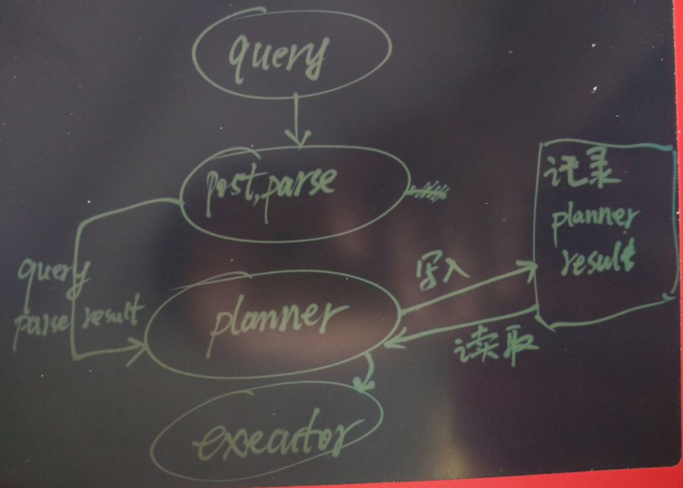

## PostgreSQL Oracle 兼容性之 - 锁定执行计划(Outline system)         
##### [TAG 21](../class/21.md)
                                                      
### 作者                                                          
digoal                                                          
                                                      
### 日期                                                          
2016-07-25                                                        
                                                      
### 标签                                                          
PostgreSQL , Oracle , 兼容性 , outline system , profiling , 锁定执行计划 , sr_plan                                     
                                                      
----                                                          
                                                      
## 背景  
绑定SQL执行计划，大家一定会想到SQL HINT，通过HINT告诉优化器你要用什么访问方法，用什么JOIN方法，JOIN的顺序，驱动表等等。    
    
但是SQL HINT有一定的弊端，它需要修改应用程序中的SQL语句，把SQL加上HINT。    
    
对pg_hint_plan感兴趣的同学，可以参考我写到文档    
  
https://yq.aliyun.com/articles/57945    
    
但是，有什么方法可以在不修改应用程序，不修改SQL的情况下，锁定SQL的执行计划呢？    
    
## 锁定执行计划  
要锁定执行计划，同样要用到PostgreSQL的 HOOK，在生成plan时动手。    
    
源码    
  
https://github.com/postgrespro/sr_plan    
  
原理如下图    
  
parser的hook，用于获取query text。    
  
planner的hook，干了两间事情，    
  
1\. 在开启了writer模式时，判断表中是否有该sql的执行计划，没有的话就将planner记录在表中。     
  
2\. 从表中读取到对应的执行计划，传给executor，从而达到锁定执行计划的目的。    
  
  
    
## 用法介绍  
安装略    
    
在需要锁定执行计划的数据库中创建扩展    
  
```  
CREATE EXTENSION sr_plan;  
```  
    
生成正确的执行计划    
  
连接到对应数据库，并打开一个会话    
  
```  
使用一些开关，使得接下来要记录的执行计划    
set enable_bitmapscan=off;  
......  
  
打开记录模式    
set sr_plan.write_mode = true;  
  
执行需要生成执行计划的QUERY，例如    
select a,b,c from tbl where id=1 and c1=2;    
  
检查执行计划是否正确    
select * from sr_plans;  
  
如果发现执行计划不正确，删除即可，重新生成。      
delett from sr_plans where query_hash=...;  
  
记得关闭记录模式    
set sr_plan.write_mode = false;  
  
如果要生成下一条QUERY的执行计划，继续前面的步骤即可。    
```  
    
让优化器使用已生成的执行计划    
  
生成后的执行计划，并不会马上生效，需要更新sr_plans.enable字段    
  
```  
select query_hash, enable, valid, query, explain_jsonb_plan(plan) from sr_plans;  
  
 query_hash | enable | valid |                        query                         |                 explain_jsonb_plan                   
------------+--------+-------+------------------------------------------------------+----------------------------------------------------  
 1783086253 | f      | t     | select query_hash from sr_plans where query_hash=10; | Bitmap Heap Scan on sr_plans                      +  
            |        |       |                                                      |   Recheck Cond: (query_hash = 10)                 +  
            |        |       |                                                      |   ->  Bitmap Index Scan on sr_plans_query_hash_idx+  
            |        |       |                                                      |         Index Cond: (query_hash = 10)             +  
            |        |       |                                                      |   
  
explain_jsonb_plan function allows you to display explain execute the plan of which lies in jsonb.   
By default, all the plans are off, you need enable it:  
  
update sr_plans set enable=true where query_hash=1783086253;  
  
(1783086253 for example only) After that, the plan for the query will be taken from the sr_plans.  
```  
    
对于使用参数的QUERY，同样适用。    
  
```  
In addition sr plan allows you to save a parameterized query plan.   
In this case, we have some constants in the query are not essential.   
For the parameters we use a special function _p (anyelement) example:  
  
select query_hash from sr_plans where query_hash=1000+_p(10);  
  
if we keep the plan for the query and enable it to be used also for the following queries:  
  
select query_hash from sr_plans where query_hash=1000+_p(11);  
select query_hash from sr_plans where query_hash=1000+_p(-5);  
```  
    
## 源码    
1\. 获取query text  
  
src/backend/optimizer/plan/planner.c    
  
```  
/*****************************************************************************  
 *  
 *         Query optimizer entry point  
 *  
 * To support loadable plugins that monitor or modify planner behavior,  
 * we provide a hook variable that lets a plugin get control before and  
 * after the standard planning process.  The plugin would normally call  
 * standard_planner().  
 *  
 * Note to plugin authors: standard_planner() scribbles on its Query input,  
 * so you'd better copy that data structure if you want to plan more than once.  
 *  
 *****************************************************************************/  
PlannedStmt *  
planner(Query *parse, int cursorOptions, ParamListInfo boundParams)  
{  
        PlannedStmt *result;  
  
        if (planner_hook)  
                result = (*planner_hook) (parse, cursorOptions, boundParams);  
        else  
                result = standard_planner(parse, cursorOptions, boundParams);  
        return result;  
}  
```  
    
2\.   
  
src/backend/parser/analyze.c    
  
```  
/*  
 * parse_analyze  
 *              Analyze a raw parse tree and transform it to Query form.  
 *  
 * Optionally, information about $n parameter types can be supplied.  
 * References to $n indexes not defined by paramTypes[] are disallowed.  
 *  
 * The result is a Query node.  Optimizable statements require considerable  
 * transformation, while utility-type statements are simply hung off  
 * a dummy CMD_UTILITY Query node.  
 */  
Query *  
parse_analyze(Node *parseTree, const char *sourceText,  
                          Oid *paramTypes, int numParams)  
{  
        ParseState *pstate = make_parsestate(NULL);  
        Query      *query;  
  
        Assert(sourceText != NULL); /* required as of 8.4 */  
  
        pstate->p_sourcetext = sourceText;  
  
        if (numParams > 0)  
                parse_fixed_parameters(pstate, paramTypes, numParams);  
  
        query = transformTopLevelStmt(pstate, parseTree);  
  
        if (post_parse_analyze_hook)  
                (*post_parse_analyze_hook) (pstate, query);  
  
        free_parsestate(pstate);  
  
        return query;  
}  
  
/*  
 * parse_analyze_varparams  
 *  
 * This variant is used when it's okay to deduce information about $n  
 * symbol datatypes from context.  The passed-in paramTypes[] array can  
 * be modified or enlarged (via repalloc).  
 */  
Query *  
parse_analyze_varparams(Node *parseTree, const char *sourceText,  
                                                Oid **paramTypes, int *numParams)  
{  
        ParseState *pstate = make_parsestate(NULL);  
        Query      *query;  
  
        Assert(sourceText != NULL); /* required as of 8.4 */  
  
        pstate->p_sourcetext = sourceText;  
  
        parse_variable_parameters(pstate, paramTypes, numParams);  
  
        query = transformTopLevelStmt(pstate, parseTree);  
  
        /* make sure all is well with parameter types */  
        check_variable_parameters(pstate, query);  
  
        if (post_parse_analyze_hook)  
                (*post_parse_analyze_hook) (pstate, query);  
  
        free_parsestate(pstate);  
  
        return query;  
}  
```  
    
## 小结  
* 对相应的表执行DDL之后，记得清理在sr_plans中对应表的执行计划。    
    
祝大家玩得开心，欢迎随时来 **阿里云促膝长谈** 业务需求 ，恭候光临。  
  
阿里云的小伙伴们加油，努力做 **最贴地气的云数据库** 。  
                                                      
        
    
  
<a rel="nofollow" href="http://info.flagcounter.com/h9V1"  ></a>  
  
  
  
  
  
  
## [digoal's 大量PostgreSQL文章入口](https://github.com/digoal/blog/blob/master/README.md "22709685feb7cab07d30f30387f0a9ae")
  
