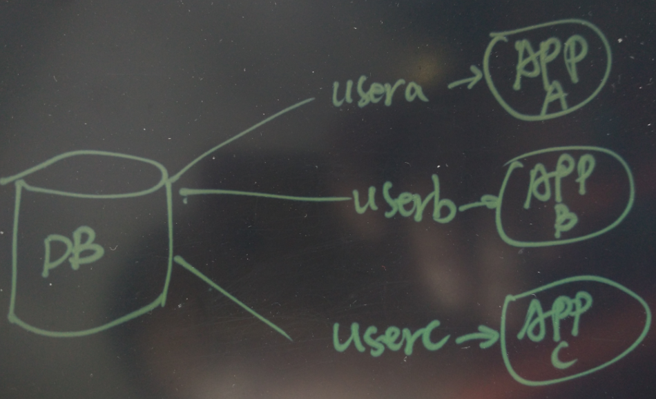
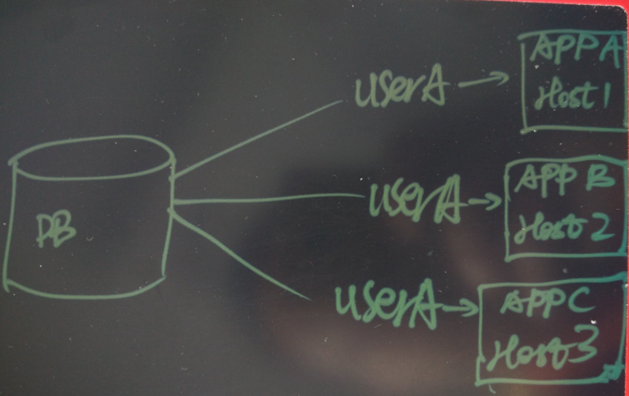
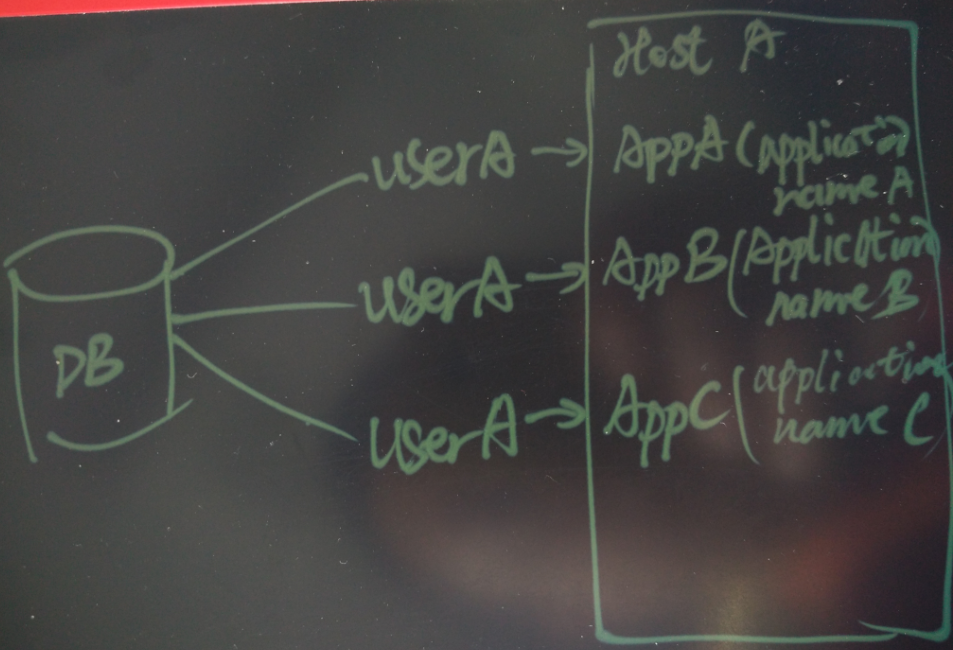
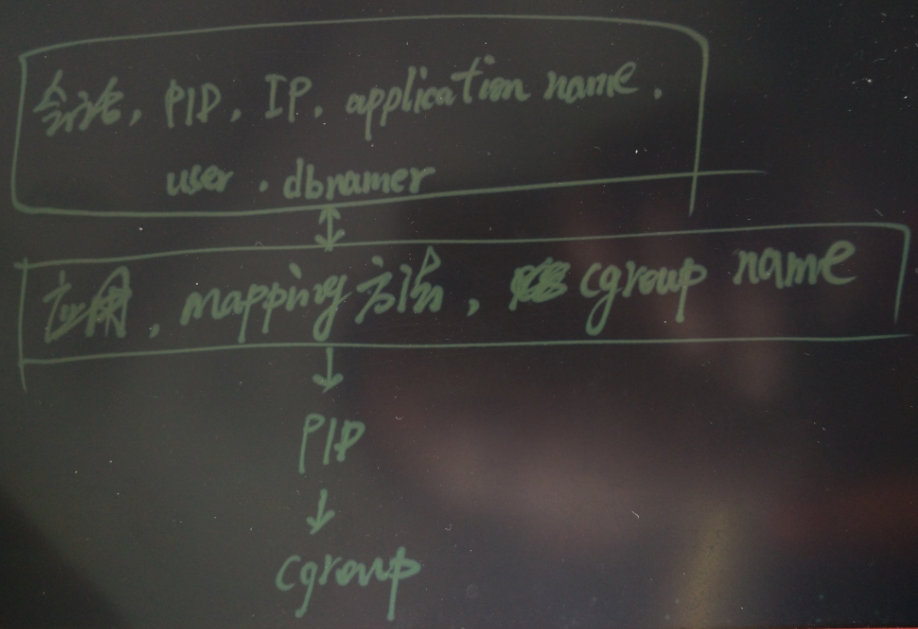

## PostgreSQL 会话级资源隔离探索    
                                                          
### 作者                                                              
digoal                                                              
                                                          
### 日期                                                              
2016-07-27                                                           
                                                          
### 标签                                                              
PostgreSQL , 资源隔离 , cgroup , 用户进程 , backend process                                          
                                                          
----                                                              
                                                          
## 背景  
如果一个数据库对外提供的服务，或者承载的业务很多时，你首先想到的肯定是拆分数据库。      
    
但是，拆分毕竟是有成本的，而且有时并不是所有的场景都适合拆分来解决。      
    
如果多个业务混合在一起使用一个数据库，就容易造成资源的争抢。      
    
那么不拆分的情况下，控制每个业务或者每个会话的资源使用呢？      
    
## 如何区分来源应用  
要隔离应用使用数据库的资源，首先要区分应用。   
     
通常如果一个数据库提供了多个业务服务时，会给每个业务创建不同的库或者分配不同的用户。   
  
  
    
当然，如果你用了同一个库，或者同一个数据库，就分不清业务了吗？      
  
当然不是，你还可以从业务的来源IP区分。      
  
  
    
如果业务部署在同一个IP上，就没有办法区分业务了吧？     
  
当然也不是，你还可以通过application_name来区分业务。    
  
  
    
## 用什么手段隔离资源  
PostgreSQL 是进程模式的，如果结合cgroup，就可以做到会话级别的资源隔离。    
    
客户端向postmaster发起连接请求，postmaster fork一个backend process处理该连接请求，以及将来改客户端的SQL请求。    
    
根据前面区分来源应用的方法，找到对应的应用。（这个区分方法应该首先要存储在数据库的表中，或者使用函数的手段获得）    
    
根据应用于cgroup的映射关系，找到对应的cgroup，然后将这个PID写入对应cgroup的tasks文件即可。    
  
  
    
    
    
步骤    
  
* 创建cgroup，包括mem, net, cpu, iops  
  
* 在每个cgroup中为每个业务创建对应的subcgroup，并配置对应的资源限制。    
  
  例如(内存，网络包转发限制，网络带宽限制，CPU时间片分配限制，块设备的读写IOPS和读写带宽限制)  
  
* 修改内核，在fork后，需要处理将pid写入cgroup的动作。    
  
* 创建对应的函数，将指定的PID放到指定的CGROUP中。    
    
## 小结  
* PostgreSQL的进程模式，为会话级资源隔离提供了便利。    
  
* 即使不改内核，你也可以通过在操作系统层部署程序的方式，做到对PostgreSQL会话级的资源隔离管理。    
  
  pg_stat_activity中有你需要的用来区分客户端应用的信息（包括客户端IP, username, dbname, pid, application_name）。      
    
祝大家玩得开心，欢迎随时来 **阿里云促膝长谈** 业务需求 ，恭候光临。    
    
阿里云的小伙伴们加油，努力做 **最贴地气的云数据库** 。    
                                                          
            
        
  
  
  
  
  
  
  
  
  
  
  
  
  
  
  
  
  
  
  
  
  
  
  
  
  
  
  
  
  
  
  
  
  
  
  
  
  
  
  
  
  
  
  
  
  
  
  
  
  
  
  
  
  
  
  
  
  
  
  
  
  
  
  
  
  
  
  
  
  
  
  
  
  
#### [PostgreSQL 许愿链接](https://github.com/digoal/blog/issues/76 "269ac3d1c492e938c0191101c7238216")
您的愿望将传达给PG kernel hacker、数据库厂商等, 帮助提高数据库产品质量和功能, 说不定下一个PG版本就有您提出的功能点. 针对非常好的提议，奖励限量版PG文化衫、纪念品、贴纸、PG热门书籍等，奖品丰富，快来许愿。[开不开森](https://github.com/digoal/blog/issues/76 "269ac3d1c492e938c0191101c7238216").  
  
  
#### [9.9元购买3个月阿里云RDS PostgreSQL实例](https://www.aliyun.com/database/postgresqlactivity "57258f76c37864c6e6d23383d05714ea")
  
  
#### [PostgreSQL 解决方案集合](https://yq.aliyun.com/topic/118 "40cff096e9ed7122c512b35d8561d9c8")
  
  
#### [德哥 / digoal's github - 公益是一辈子的事.](https://github.com/digoal/blog/blob/master/README.md "22709685feb7cab07d30f30387f0a9ae")
  
  

  
  
#### [PolarDB 学习图谱: 训练营、培训认证、在线互动实验、解决方案、生态合作、写心得拿奖品](https://www.aliyun.com/database/openpolardb/activity "8642f60e04ed0c814bf9cb9677976bd4")
  
  
#### [购买PolarDB云服务折扣活动进行中, 55元起](https://www.aliyun.com/activity/new/polardb-yunparter?userCode=bsb3t4al "e0495c413bedacabb75ff1e880be465a")
  
  
#### [About 德哥](https://github.com/digoal/blog/blob/master/me/readme.md "a37735981e7704886ffd590565582dd0")
  
