## 为PostgreSQL讨说法 - 浅析《UBER ENGINEERING SWITCHED FROM POSTGRES TO MYSQL》          
                                                                                                    
### 作者                                                                                                   
digoal                                                                                                    
                                                                                                    
### 日期                                                                                                  
2016-07-28            
                                                                                                    
### 标签                                                                                                  
PostgreSQL , uber , mysql , mvcc , index , 索引组织表 , innodb                                       
                                      
----                                                                                                  
                                          
## 背景   
最近有一篇文档，在国外闹得沸沸扬扬，是关于UBER使用mysql替换postgres原因的文章。    
    
英文原文    
  
https://eng.uber.com/mysql-migration/    
    
[来自高可用架构的 中文翻译](http://mp.weixin.qq.com/s?__biz=MzAwMDU1MTE1OQ==&mid=2653547609&idx=1&sn=cbb55ee823ddec9d98ef1fa984e001f6&scene=0#wechat_redirect)    
    
文章涉及到 **PG数据库的部分，背后的原理并没有深入的剖析，导致读者对PostgreSQL的误解** 。      
       
## uber在文章阐述的遇到的PG问题    
  
We encountered many Postgres limitations:      
  
* Inefficient architecture for writes     
  
* Inefficient data replication     
  
* Issues with table corruption     
  
* Poor replica MVCC support     
  
* Difficulty upgrading to newer releases      
    
**本文接下来会依依介绍其背后的原理**。    
  
### 1. Inefficient architecture for writes  
#### **uber文章的观点**   
PG的MVCC机制，更新数据为新增版本，会带来两个问题      
  
* SSD的写放大    
    
* 索引的写放大    
    
#### **本文观点**    
事实并不是PG的MVCC的问题，所有的数据库只要支持并发读写，就需要MVCC，只是版本管理的手段可能不一样。    
  
有通过回滚段管理的，也有通过多版本进行管理的。    
    
#### **原理剖析**     
**基于回滚段实现MVCC的数据库**   
  
当更新一条记录时，有些数据库需要将整个数据块拷贝到回滚段区域（有些是基于逻辑行的拷贝，则拷贝到回滚段的是记录）。     
  
注意写回滚段也是会产生REDO写操作的。    
  
带来一个问题，包含更新、删除操作的事务会变慢，相当于双倍的时间。    
  
* 更新可能在当前的row进行。     
  
   这种情况，只要索引字段不变化，索引就不需要变。     
     
   如果索引字段值发生变化，索引也要变化。      
  
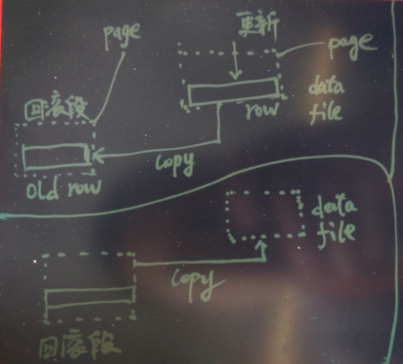    
    
* 如果更新后的记录超过原来行的长度，可能在本页找一块空闲区域（如果能装下），也可能要到其他页找一块区域进行更新，有擦除旧记录，写入新纪录的写操作。    
  
  不管怎样，索引都要变化。      
  
    
    
基于回滚段实现MVCC的数据库，除了前面说的更新、删除操作的响应变慢，同时还有另一个影响如果要回滚事务，开销会很大（特别是当事务修改的数据量很大时），因为要从回滚段将整个块拷贝到数据文件（基于逻辑行拷贝的回滚则是类似重新来一遍UNDO事务的SQL操作，同时还需要擦除之前更改的行）。      
  
*代价非常高* 。    
  
通常出现在执行大事务，同时回滚段写满的时候，报snapshot too old，导致事务不得不回滚，回滚又会是一个非常漫长的操作。    
    
**基于多版本实现MVCC的数据库**    
  
当更新一条记录时，产生一个新的版本。    
  
* PostgreSQL 会优先使用在当前页更新（HOT），即在当前页进行更新，不管行长度是否发生变化。     
  
   这种情况，只要索引字段不变化，索引就不需要变。    
    
   如果索引字段值发生变化，索引也要变化。      
  
  (hot时，索引不变，通过HEAP页内旧item指向新item来做到定位到新的记录)      
  
  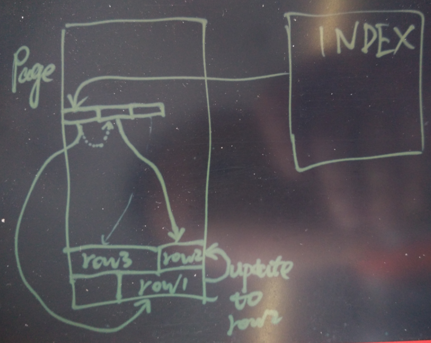    
    
* 如果未在当前页更新，则索引才需要变化    
  
  （通过配置表的fillfactor，可以大大减少这种情况的发送，尽量走HOT）    
  
  如果读者还是担心这个问题，我们可以做一个压测试验，看看到底会不会更新索引，会不会对更新造成性能影响如何？    
  
  有几个参数需要注意，很多用户可能不关注这个，导致了膨胀      
  
```  
autovacuum_work_mem = 4GB               # min 1MB, or -1 to use maintenance_work_mem  
autovacuum = on                 # Enable autovacuum subprocess?  'on'  
autovacuum_max_workers = 8              # max number of autovacuum subprocesses  
autovacuum_naptime = 30s         # time between autovacuum runs  
autovacuum_vacuum_threshold = 50        # min number of row updates before  
autovacuum_analyze_threshold = 50       # min number of row updates before  
autovacuum_vacuum_scale_factor = 0.002  # fraction of table size before vacuum  
autovacuum_analyze_scale_factor = 0.001 # fraction of table size before analyze  
autovacuum_vacuum_cost_delay = 0        # default vacuum cost delay for  
```  
  
  测试1000万数据，9个字段，8个索引，更新其中的mod_time字段。    
  
```  
postgres=# create table tbl(id int, mod_time timestamp(0), c1 int, c2 int, c3 int, c4 int, c5 int, c6 int, c7 int) with (fillfactor=80);  
CREATE TABLE  
Time: 1.906 ms  
postgres=# insert into tbl select i,clock_timestamp(),i+1,i+2,i+3,i+4,i+5,i+6,i+6 from generate_series(1,10000000) t(i);  
INSERT 0 10000000  
Time: 14522.098 ms  
postgres=# create index idx1 on tbl(c1) with (fillfactor=80);  
CREATE INDEX  
Time: 3005.753 ms  
postgres=# create index idx2 on tbl(c2) with (fillfactor=80);  
CREATE INDEX  
Time: 2793.361 ms  
postgres=# create index idx3 on tbl(c3) with (fillfactor=80);  
CREATE INDEX  
Time: 2804.031 ms  
postgres=# create index idx4 on tbl(c4) with (fillfactor=80);  
CREATE INDEX  
Time: 2856.954 ms  
postgres=# create index idx5 on tbl(c5) with (fillfactor=80);  
CREATE INDEX  
Time: 2895.643 ms  
postgres=# create index idx6 on tbl(c6) with (fillfactor=80);  
CREATE INDEX  
Time: 2932.394 ms  
postgres=# create index idx7 on tbl(c7) with (fillfactor=80);  
CREATE INDEX  
Time: 2939.927 ms  
postgres=# alter table tbl add constraint pk_tbl primary key(id) with (fillfactor=80);  
ALTER TABLE  
Time: 3292.544 ms  
```  
  
  记录下当前表的大小和8个索引的大小，用于压测后对比大小变化      
  
```  
postgres=# \dt+ tbl  
                    List of relations  
 Schema | Name | Type  |  Owner   |  Size  | Description   
--------+------+-------+----------+--------+-------------  
 public | tbl  | table | postgres | 919 MB |   
(1 row)  
postgres=# \di+   
                                      List of relations  
 Schema |         Name          | Type  |  Owner   |      Table       |  Size  | Description   
--------+-----------------------+-------+----------+------------------+--------+-------------  
 public | idx1                  | index | postgres | tbl              | 241 MB |   
 public | idx2                  | index | postgres | tbl              | 241 MB |   
 public | idx3                  | index | postgres | tbl              | 241 MB |   
 public | idx4                  | index | postgres | tbl              | 241 MB |   
 public | idx5                  | index | postgres | tbl              | 241 MB |   
 public | idx6                  | index | postgres | tbl              | 241 MB |   
 public | idx7                  | index | postgres | tbl              | 241 MB |   
 public | pk_tbl                | index | postgres | tbl              | 241 MB |   
```  
  
  全力压测30分钟，更新mod_time字段    
  
```  
$ vi test.sql  
\setrandom id 1 10000000  
update tbl set mod_time=now() where id=:id;  
压测开始  
pgbench -M prepared -n -r -P 5 -f ./test.sql -c 48 -j 48 -T 1800  
```  
  
  压测结果，更新速度维持在 13万/s 以上。  这个压力应该可以覆盖很多的用户吧。    
  
```  
progress: 5.0 s, 133373.6 tps, lat 0.357 ms stddev 0.269  
progress: 10.0 s, 133148.2 tps, lat 0.359 ms stddev 0.310  
progress: 15.0 s, 134249.0 tps, lat 0.356 ms stddev 0.299  
progress: 20.0 s, 131037.9 tps, lat 0.364 ms stddev 0.341  
progress: 25.0 s, 135326.3 tps, lat 0.353 ms stddev 0.292  
progress: 30.0 s, 135023.9 tps, lat 0.354 ms stddev 0.289  
......  
progress: 1385.0 s, 135997.9 tps, lat 0.351 ms stddev 0.261  
progress: 1390.0 s, 133152.5 tps, lat 0.359 ms stddev 0.302  
progress: 1395.0 s, 133540.7 tps, lat 0.357 ms stddev 0.287  
progress: 1400.0 s, 132034.8 tps, lat 0.362 ms stddev 0.314  
progress: 1405.0 s, 135366.6 tps, lat 0.353 ms stddev 0.266  
progress: 1410.0 s, 134606.6 tps, lat 0.355 ms stddev 0.280  
.....  
progress: 1855.0 s, 134013.7 tps, lat 0.356 ms stddev 0.298  
progress: 1860.0 s, 132374.8 tps, lat 0.361 ms stddev 0.306  
progress: 1865.0 s, 133868.3 tps, lat 0.357 ms stddev 0.282  
progress: 1870.0 s, 133457.1 tps, lat 0.358 ms stddev 0.303  
progress: 1875.0 s, 133598.3 tps, lat 0.357 ms stddev 0.297  
progress: 1880.0 s, 133234.5 tps, lat 0.358 ms stddev 0.297  
progress: 1885.0 s, 131778.9 tps, lat 0.362 ms stddev 0.319  
progress: 1890.0 s, 134932.2 tps, lat 0.354 ms stddev 0.274  
......  
progress: 2235.0 s, 135724.6 tps, lat 0.352 ms stddev 0.284  
progress: 2240.0 s, 136845.0 tps, lat 0.349 ms stddev 0.256  
progress: 2245.0 s, 136240.6 tps, lat 0.350 ms stddev 0.264  
progress: 2250.0 s, 136983.2 tps, lat 0.348 ms stddev 0.248  
progress: 2255.0 s, 137494.5 tps, lat 0.347 ms stddev 0.251  
......  
```  
  
  压测结束后，查看表和索引的大小，如果按UBER文中指出的，会更新索引，但实际上，结果说话，表和索引根本没有膨胀。    
  
  UBER 文章对用户的误导不攻自破。    
  
```  
表的大小未变化  
postgres=# \dt+  
                          List of relations  
 Schema |       Name       | Type  |  Owner   |  Size   | Description   
--------+------------------+-------+----------+---------+-------------  
 public | tbl              | table | postgres | 919 MB  |   
索引的大小也未变化  
postgres=# \di+  
                                      List of relations  
 Schema |         Name          | Type  |  Owner   |      Table       |  Size  | Description   
--------+-----------------------+-------+----------+------------------+--------+-------------  
 public | idx1                  | index | postgres | tbl              | 241 MB |   
 public | idx2                  | index | postgres | tbl              | 241 MB |   
 public | idx3                  | index | postgres | tbl              | 241 MB |   
 public | idx4                  | index | postgres | tbl              | 241 MB |   
 public | idx5                  | index | postgres | tbl              | 241 MB |   
 public | idx6                  | index | postgres | tbl              | 241 MB |   
 public | idx7                  | index | postgres | tbl              | 241 MB |   
 public | pk_tbl                | index | postgres | tbl              | 241 MB |   
```  
      
另外再给大家分析一个信息，PostgreSQL nbtree 索引方法针对更新做了优化，可以大幅降低锁的产生，所以并发的更新性能是非常棒的。    
  
我们来看一个测试，更新c1与mod_time两个字段，其中c1是索引字段。     
  
压测脚本变更如下     
  
```  
vi test.sql  
\setrandom id 1 10000000  
update tbl set mod_time=now(),c1=c1+1 where id=:id;   
```  
    
压测数据截取，可以看出性能是很好的，和单纯更新非索引列差不多    
  
```  
...  
progress: 1025.0 s, 138077.5 tps, lat 0.346 ms stddev 0.264  
progress: 1030.0 s, 138746.9 tps, lat 0.344 ms stddev 0.270  
progress: 1035.0 s, 137590.2 tps, lat 0.347 ms stddev 0.273  
progress: 1040.0 s, 139072.3 tps, lat 0.343 ms stddev 0.258  
progress: 1045.0 s, 140480.3 tps, lat 0.340 ms stddev 0.255  
...  
```  
    
欲了解PostgreSQL nbtree的原理，可以参考Lehman & Yao Algorithm    
  
src/backend/access/nbtree/README    
    
#### **小结**       
* 基于回滚段实现MVCC的数据库，在更新数据时SSD写放大 > 100%(因为回滚段是一定要写的，并行写回滚段的操作也需要写REDO)；而基于多版本实现MVCC的数据库，SSD写放大的概率低于100%(因为可能发生HOT，发生在当前页)，而且旧记录只改行的xmax标记，产生的REDO极少。      
    
* 基于回滚段实现MVCC的数据库，在删除数据时SSD写放大是100%(因为回滚段是一定要写的，并行写回滚段的操作也需要写REDO)；而基于多版本实现MVCC的数据库，SSD写放大的概率为0 (因为只需要改一下行头部的xmax的标记)。      
    
* 基于回滚段或MVCC的数据库，索引的写放大，都与是否发生行迁移有关，概率差不多。    
    
* 基于回滚段实现MVCC的数据库，如果要回滚事务，开销会很大（特别是当事务修改的数据量很大时），因为要从回滚段将整个块拷贝到数据文件（基于逻辑行拷贝的回滚则是类似重新来一遍UNDO事务的SQL操作，同时还需要擦除之前更改的行）。      
    
* 基于多版本实现MVCC的数据库，事务回滚非常快，因为不需要拷贝行或者数据块，也不需要修改已更新的记录，只是记录clog时将当前事务标记为ABORT即可，也就是说只需要改2个比特位。    
    
* 早在2007年，PostgreSQL就已经使用HOT技术完美的解决了索引更新的问题，根本不存在UPDATE数据时一定需要更新索引的问题。    
  
  我在很多场合分享过HOT的原理，也有相应的文章介绍。    
  
  要了解细节的话，可以看一下PostgreSQL源码中的 src/backend/access/heap/README.HOT    
  
  另外PostgreSQL还支持hash, gin, gist, sp-gist, brin索引，用户如果想了解这些索引，可以参考    
  
  https://www.pgcon.org/2016/schedule/attachments/434_Index-internals-PGCon2016.pdf    
    
* UBER文章指出的基于B+tree即secondary index指向PK，仅仅是一种避免UPDATE数据需要索引的方法。    
  
  但是这种方法引入了一些问题如下 ：      
  
  1\. 插入数据会变慢，因为数据存储是B+Tree结构的。    
  
  2\. 如果插入的是随机的PK值，则会频繁的带来页分裂，会造成IO写放大。    
  
  3\. 为了解决索引分裂的问题，导致了写堵塞读。 原因是引入了ChangeBuffer，当读的数据还在ChangeBuffer中时，需要先将其merge到b+tree，merge过程是堵塞读的。    
  
  4\. 查询secondary时，要再走一遍primary index，带来了额外的离散扫描开销，如果secondary是范围扫描或者多点扫描，这个放大倍数是很可观的。  例如用户要从secondary index扫描10条记录，primary index的深度是4，那么除了secondary index的数据块扫描，还有额外多扫描40个primary的块。    
    
  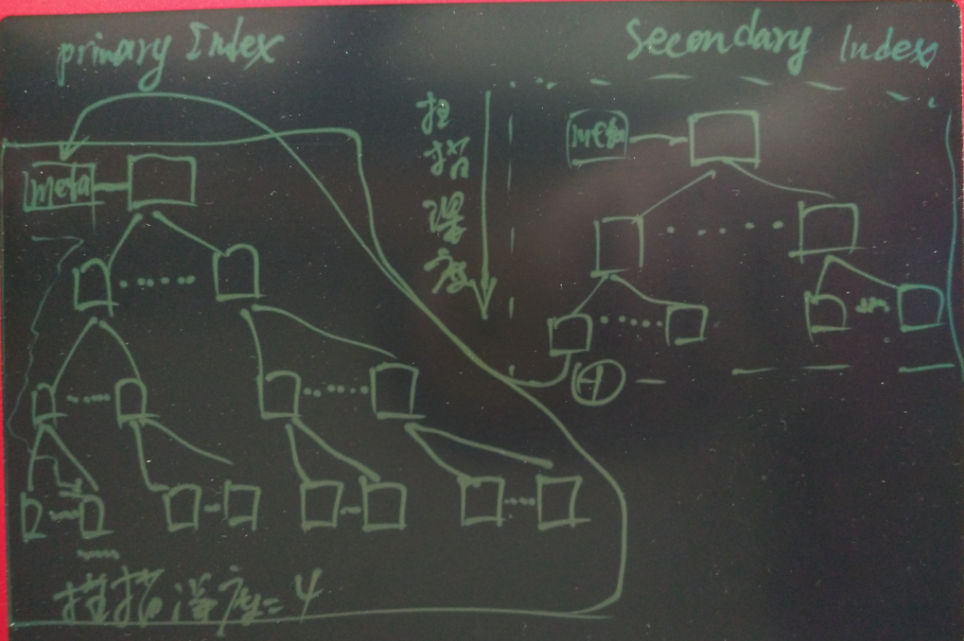    
    
  PostgreSQL是记录的(block_number, offset)，所以1条记录只需要扫描1个数据块。      
    
  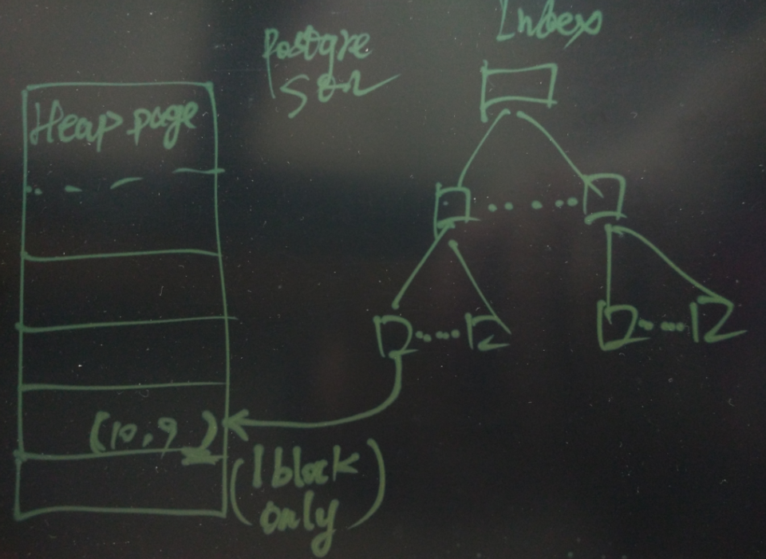    
    
  5\. 因为b+tree会将行存储在索引页中，所以一页能存下的记录数会大大减少，从而导致b+tree的层级比单纯的b-tree深一些。 特别是行宽较宽的表。    
    
  例如行宽为几百字节，16K的页可能就只能存储十几条记录，一千万记录的表，索引深度达到7级，加上metapage，命中一条记录需要扫描8个数据块。    
    
  而使用PostgreSQL堆表+PK的方式，索引页通常能存几百条记录（以16K为例，约存储800条记录），索引深度为3时能支撑5亿记录，所以命中一条记录实际上只需要扫描5个块(meta+2 branch+leaf+heap)。      
      
#### **彩蛋**   
* PostgreSQL TOAST机制    
    
  PostgreSQL的TOAST机制，可以将变长类型的值，自动压缩存储到另一片区域，通过内部的POINT指向，而不影响行的其他值。  例如存储文档，或者图片的表，如果这个表上有一些字段要更新，有一些字段不要更新，那么在更新时，PostgreSQL数据库会有非常大的优势，因为行很小。      
    
  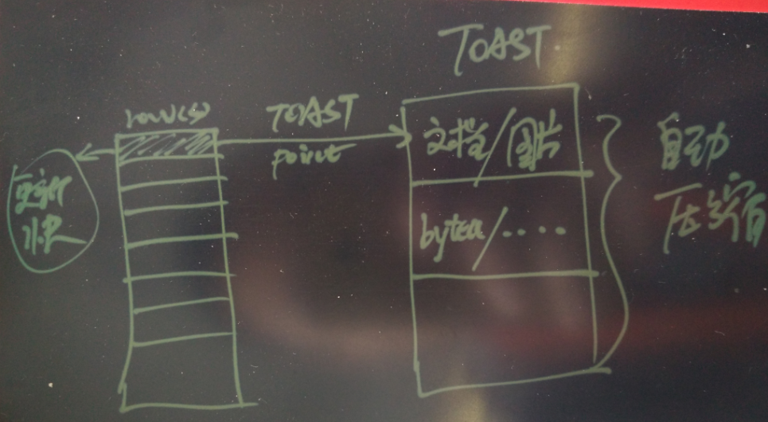  
    
  基于回滚段实现MVCC的数据库，需要拷贝旧的记录或数据块到回滚段，记录或块越大，这个开销越大。    
    
     
    
  存储文档、图像、非结构化数据，使用PostgreSQL很有优势。    
  
* MySQL innodb是基于B+树的存储，当PK数据随机数据写入时存在巨大写放大，因为经常要分裂，不仅影响插入速度和查询速度，同时数据存放也会变得非常无序。    
    
  即使按PK顺序扫描时，也可能出现大量的离散IO。    
    
  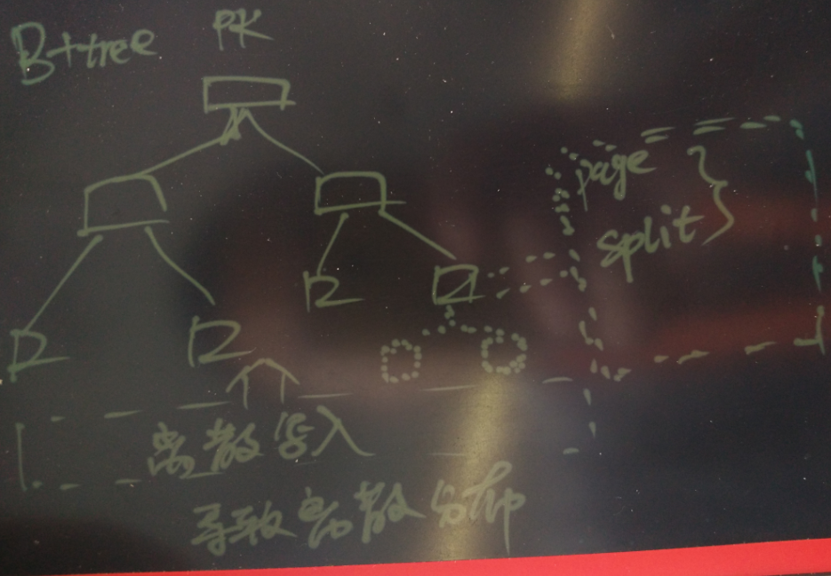  
    
  基于B+树结构的存储，为了提高插入速度，如果使用index cache的话，则影响并发的查询，因为查询时要先合并索引。    
    
  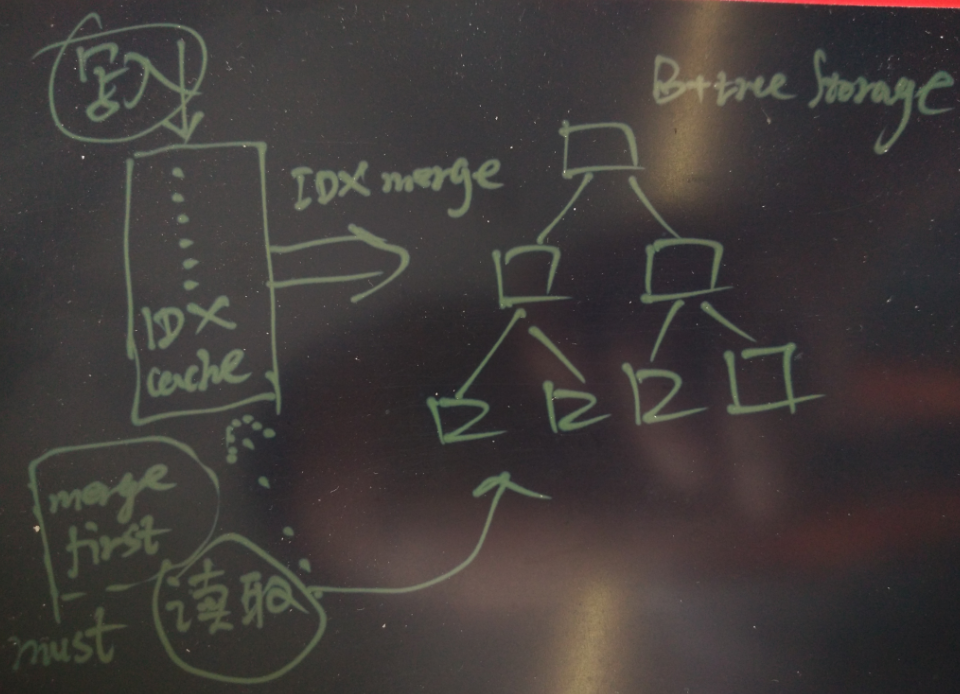  
    
  另一方面，B+树的存储，必须要求表需要一个PK（即使表没有PK的需求，也要硬塞一个PK列进来），secondary index则指向这个PK。    
    
  如果PK发生更新，则所有的secondary index都要更新，也就是说，为了保证secondary不更新，务必确保PK不更新。    
    
  如果要对secondary index进行范围扫描，物理的扫描上是离散的。    
  
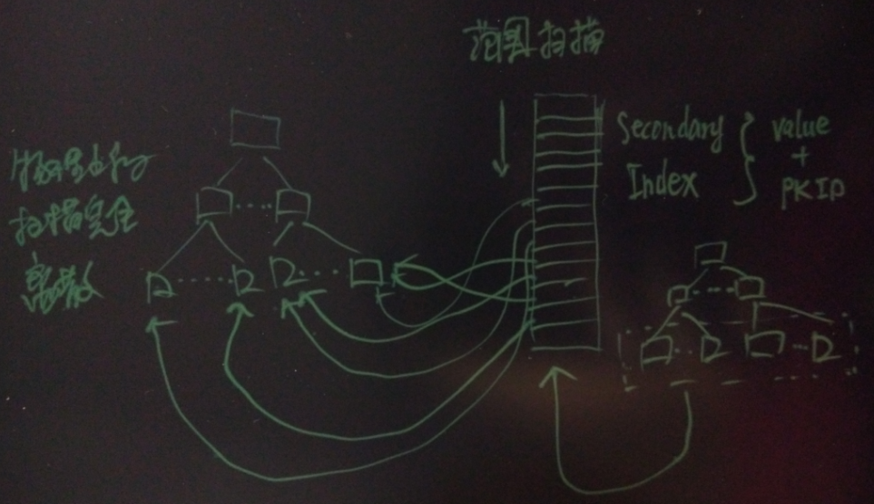  
    
  所以uber本文提出的，secondary index 不需要变更的好处，其实背后是有以上代价存在的（例如一定要加PK，插入速度更慢，插入时PK不能随机否则分裂带来的IO巨大，使用secondary index范围扫描时会造成离散的IO等弊端），把原理，代价都交代清楚，才能看得更明白。    
    
    
  PostgreSQL 有几种方法来消除这种离散IO。    
    
  1\. bitmap scan，获取heap tuple前，先根据ctid的blockid排序然后再从heap获取记录，以获得物理上顺序的扫描。     
  
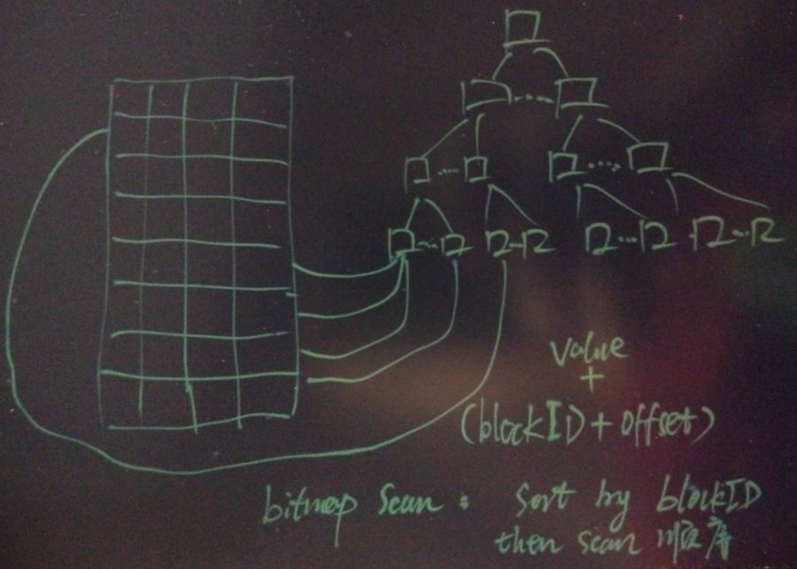  
    
  2\. cluster by index，将表的物理存储顺序按照索引的顺序来存放，从而使用该索引进行范围扫描时，则是顺序的扫描。     
    
  但是请注意cluster的行为是一次性的，表依旧是堆表，只是物理存储的顺序与索引的顺序相关性一致，从而达到了查询时消除离散扫描的功效，它更适合静态的历史数据。    
    
  例如微博类的应用，可以将历史数据按用户ID和时间索引进行cluster化，那么在根据时间或用户ID查询这个用户的历史记录时，就不会产生离散的IO。    
  
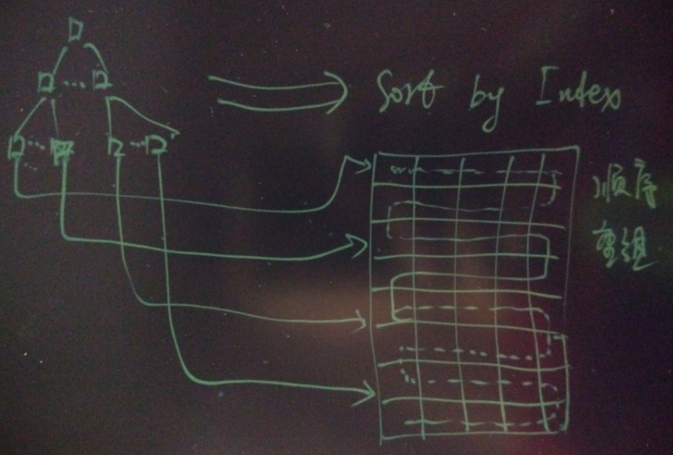    
    
  3\. BRIN索引，这个是针对流式记录的一种索引，只记录块或者相邻块的元数据，如取值范围。  从而实现快速检索的目的。  详见    
    
  https://yq.aliyun.com/articles/27860  
    
* PostgreSQL的表是基于HEAP存储的，不存在以上B+树存储的问题，随便怎么插入，速度都很快。    
    
* SSD的原子写，通常SSD写入时是以最小单位为4K的写入，即使修改很小的数据。    
    
  那么以directio或buffer io为主的数据库，哪个对SSD的伤害更大呢？    
    
  对于directio的数据库，因为每次都是真实的伤害，而buffer io的数据库，OS层还会合并IO，可以大幅降低SSD的真实写(os 层调整vm.dirty_background_ratio可以调整写频率，从而影响合并粒度)。    
    
  PostgreSQL的shared buffer管理是基于buffer io的管理，对SSD来说是一种很好的保护，有兴趣的童鞋可以测试验证一下。    
    
  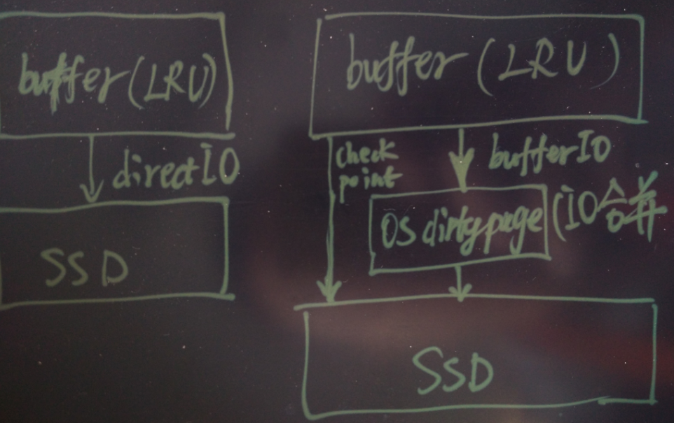    
    
### 2. Inefficient data replication     
#### **uber文章的观点**      
PG的复制低效，有写放大。    
    
#### **本文观点**        
PostgreSQL的流复制非常高效，延迟几乎为0，同时还支持流的压缩和加密传输，很多企业用流复制来实现异地容灾，HA，读写分离的应用场景。    
  
同时PostgreSQL也支持逻辑复制（>=9.4支持流式逻辑复制, <9.4的版本则支持基于触发器或者基于异步消息的逻辑复制）。     
    
#### **原理剖析**     
* 问题反驳 1 （复制低效）   
    
  我第一次听说PG的复制低效，要知道PG的复制是基于流式的物理变更，业界有名的高效，延迟极低（复制延迟与事务大小无关），几乎是接近0的延迟。     
    
  甚至用来做主备同步复制，对主库事务提交的RT影响也是可控的，主库依旧可以保持几十万的tps。    
    
  PostgreSQL流复制原理      
    
  即时唤醒，流式复制，所以延迟极低。    
    
  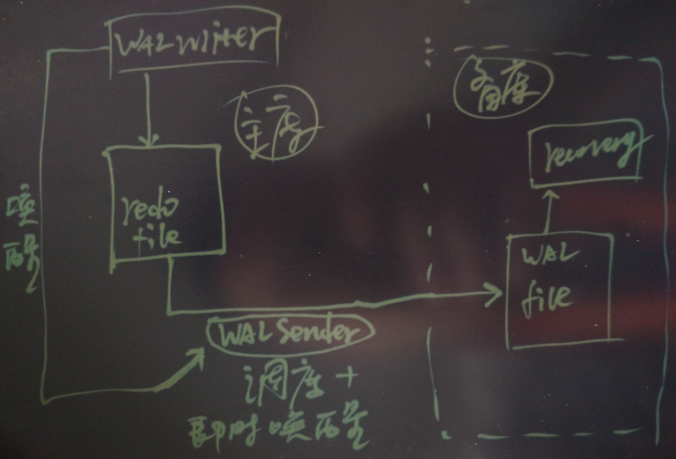  
    
* 问题反驳 2  （REDO写放大）    
    
  基于回滚段实现MVCC的数据库，在更新时，拷贝到回滚段的旧版本，是要写REDO的。     
    
  而基于多版本实现MVCC的数据库，旧版本仅仅需要写修改行头bit位的REDO，所以基于多版本实现MVCC的数据库，更新时写入的REDO应该是基于回滚段实现MVCC的数据库的一半甚至更少（比如基于物理的回滚段要拷贝整个块，产生的REDO也很大）。     
    
  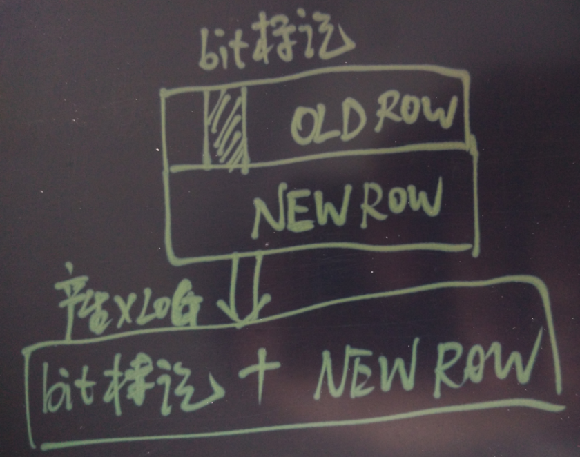  
    
  同时，由于基于回滚段实现MVCC的数据库回滚时，要将回滚段的数据拷贝回数据文件，是会产生REDO的，这一点，基于多版本实现MVCC的数据库不存在这种写放大的问题。    
    
  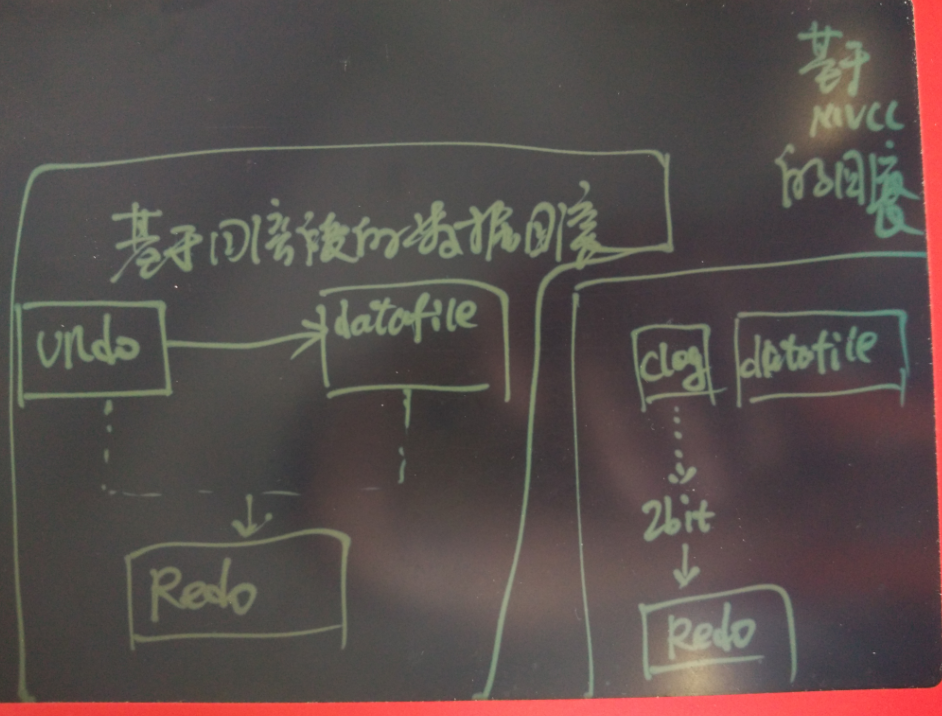  
    
* 问题反驳 3（复制流量放大）    
    
  基于REDO的物理复制，意思就是要把REDO复制一份到备库。    
    
  所以REDO写了多少，就要复制多少到备库，网络的流量也是这样的。    
  
  另一种是基于REDO的逻辑复制，需要复制的数据不仅仅包括新的数据，还要包括旧的版本数据(PK或者full row)。    
    
  可能一条记录更新前和更新后的数据都要复制。    
    
  对更新操作来说，物理复制，不需要复制旧的记录(因为产生REDO的仅仅是XMAX的变化)过去，而逻辑复制则需要复制旧的记录过去。    
    
  另外需要注意的是，目前PG的垃圾回收也是以物理恢复的形式复制的，在实现上还有改进空间，比如通过逻辑的方式复制垃圾回收(只复制block id)，可以大大减少网络传输的流量。    
    
  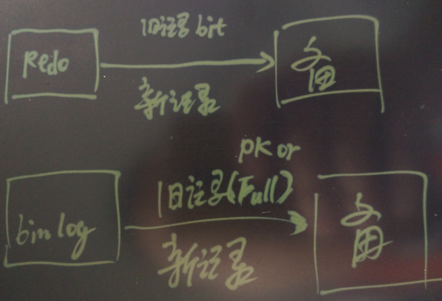  
      
  而 uber 文章并没有指出，事实上 MySQL 目前只支持逻辑复制，并且如果要开启逻辑复制，不仅仅要写redo，同时还要写 binlog，等于写了双份日志，这个写放大也是很大的。     
  
  MySQL redo 用于恢复数据库，binlog用于复制。     
    
  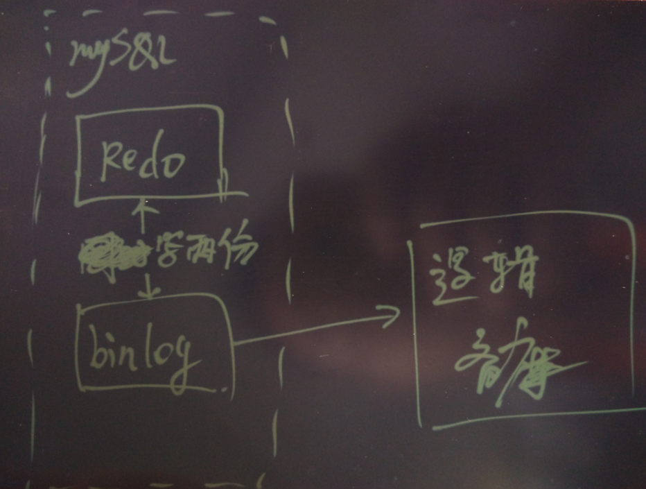   
    
  自PostgreSQL 9.4开始，PG内核层就同时支持物理复制和逻辑复制，而且仅仅写一份日志就能同时支持物理以及逻辑复制。    
    
  在9.4版本之前，则可以通过其他软件进行逻辑复制（例如Londiste3, slone-I）    
    
  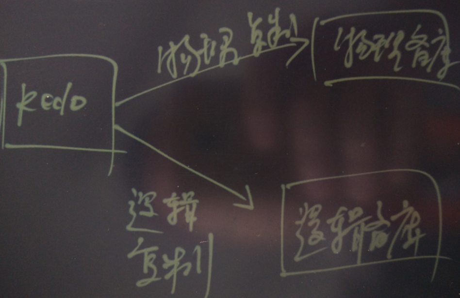    
    
  逻辑复制需要注意1，被复制的表一定要有PK。 **物理复制不存在这个问题** 。    
    
  逻辑复制需要注意2，大事务导致主备的延迟非常大，因为备库一定要等主库事务结束，备库才能开始回放该事务。 **物理复制不存在这个问题** 。      
   
#### **小结**    
* PG的复制是业界有名的高效，延迟极低（关键是复制延迟与事务大小无关），网络好的话，几乎是接近0的延迟。    
  
* 基于多版本实现MVCC的数据库，就版本仅仅需要写修改行头bit位的REDO，所以基于多版本实现MVCC的数据库，更新时写入的REDO应该是基于回滚段实现MVCC的数据库的一半甚至更少（比如物理回滚段要拷贝整个块，产生的REDO也很大）。   
  
* 对更新操作来说，基于REDO的物理复制，不需要复制旧的记录过去，而逻辑复制则需要复制旧的记录过去，物理复制产生的网络流量更小。     
  
* 逻辑复制有一个弊端，一定要PK。 **物理复制不存在这个问题** 。    
  
* 逻辑复制另一个弊端，大事务导致主备的延迟非常大，因为备库一定要等主库事务结束，备库才能开始回放该事务。 **物理复制不存在这个问题，不需要等待主库事务结束后再回放redo** 。    
    
#### **彩蛋**    
* PostgreSQL可以开启协议层压缩，同时可以选择是否加密传输，压缩传输REDO。更高效，更安全。    
  
* PG的用户如果有主备环境，可以关闭FULL_PAGE_WRITE，产生的REDO更少(第一次更新的PAGE不需要写FULL PAGE)。    
  
  但是需要注意，如果关闭了FPW并且主库因主机问题或在OS问题挂了，需要从备份环境恢复。    
  
* PG用户，可以将checkpoint拉长，减少FULL PAGE的产生，从而减少REDO的产生。    
  
* PG的用户，如果需要从PG或者MYSQL复制到阿里云的rds PG，可以使用阿里dbsync插件，目前支持全量复制，增量的逻辑复制正在开发中。    
  
  https://help.aliyun.com/document_detail/35458.html    
  
  https://help.aliyun.com/document_detail/35459.html   
   
  https://github.com/aliyun/rds_dbsync  
    
### 3. Issues with table corruption     
#### **uber文章的观点**       
用户在使用PG 9.2 时，因为极端情况下的主备切换，导致了一些数据corruption问题。      
    
#### **本文观点**        
从社区了解到，这个问题已经在9.2的版本修复，后面的版本也没有这个问题。      
        
PG一直以来就是一个以稳定性和功能强大著称的数据库，在企业市场有非常好的口碑。    
    
**国内的银行，运营商，保险，互联网公司都有在核心环境使用**    
  
- 平安科技、阿里巴巴、高德、去哪儿、腾讯、用友、阳光、中移动、探探、智联、典典、华为、斯凯、通策医疗、同花顺、核电、国家电网、邮储银行、友盟、莲子。。。。。。     
    
**海外的汽车生产巨头，政府部门，医疗，物流等各个行业也都有非常多的用户**       
  
- 生物制药 {Affymetrix(基因芯片), 美国化学协会, gene(结构生物学应用案例), …}  
  
- 电子商务 { CD BABY, etsy(与淘宝类似), whitepages, flightstats, Endpoint Corporation …}  
  
- 学校 {加州大学伯克利分校, 哈佛大学互联网与社会中心, .LRN, 莫斯科国立大学, 悉尼大学, …}  
  
- 金融 {Journyx, LLC, trusecommerce(类似支付宝),  日本证券交易交所, 邮储银行, 同花顺…}  
  
- 游戏 {MobyGames, …}  
  
- 政府 {美国国家气象局, 印度国家物理实验室, 联合国儿童基金, 美国疾病控制和预防中心,  美国国务院, 俄罗斯杜马…}  
  
- 医疗 {calorieking, 开源电子病历项目, shannon医学中心, …}  
  
- 制造业 {Exoteric Networks, 丰田, 捷豹路虎}  
  
- 媒体 {IMDB.com, 美国华盛顿邮报国会投票数据库, MacWorld, 绿色和平组织, …}  
  
- 零售 {ADP, CTC, Safeway, Tsutaya, Rockport, …}  
  
- 科技 {Sony, MySpace, Yahoo, Afilias, APPLE, 富士通, Omniti,  Red Hat, Sirius IT, SUN, 国际空间站, Instagram,  Disqus,  …}  
  
- 通信 {Cisco, Juniper, NTT(日本电信), 德国电信, Optus, Skype, Tlestra(澳洲电讯),  中国移动…}  
  
- 物流 {SF}  
    
#### **小结**   
基于逻辑复制的数据库，主库压力大或者有长事务时，备库追不上主库时有发生。     
  
又或者因为某些原因导致主备不一致，即使发现了，可能并没有很好的修复手段，因为你不知道该以哪个数据为准。    
  
逻辑复制导致主备不一致的原因较多，例如  主库执行失败，备库执行成功，或者备库执行成功，主库执行失败。    
  
又或者 主库和备库的环境不一致，例如字符集，或者其他的，都非常容易导致主和备的不一致。    
    
对于要求主备严格一致的场景，强烈建议使用物理复制。    
    
### 4. Poor replica MVCC support     
#### **uber文章的观点**      
PG备库的MVCC支持较差，查询会与恢复堵塞     
    
#### **本文观点**        
首先，PG的备库分两种，一种是物理备库，一种是逻辑备库。    
    
对于逻辑备库来说，与MYSQL的恢复机制是一样的，既然是一样就不需要讨论了。    
    
UBER文章说的 查询会与恢复堵塞，说的是物理备库，但必须纠正一个观点，查询是否堵塞恢复，要论场景，况且堵塞的情况极为少见。    
    
还有一点要注意，逻辑复制也会有堵塞备库的QUERY。    
    
#### **原理剖析**     
    
物理复制，什么情况下查询会堵塞、或与恢复冲突？        
  
当以下操作产生的REDO被复制到备库，并且备库准备拿这些REDO来恢复时。    
* Access Exclusive locks taken on the primary server, including both explicit LOCK commands and various DDL actions, conflict with table accesses in standby queries.  
    
  主库的访问排它锁，与备库对应的锁产生冲突。    
    
  例如主库truncate a表, 备库查询a表。    
    
  这种情况的冲突面很窄。    
    
* Dropping a tablespace on the primary conflicts with standby queries using that tablespace for temporary work files.    
    
  主库删除表空间，备库使用这个表空间产生临时文件。 例如主库删除TBS，备库的一个大的查询需要写临时文件，并且这个临时文件是写到这个表空间的。    
    
  这种情况非常少见，也很容易规避，新建一个临时表空间不要删除即可。     
    
* Dropping a database on the primary conflicts with sessions connected to that database on the standby.  
    
  主库删除数据库，备库刚好连在这个数据库上。    
    
  这种情况也非常的少见。    
    
* Application of a vacuum cleanup record from WAL conflicts with standby transactions whose snapshots can still "see" any of the rows to be removed.  
    
  主库回收dead tuple的REDO，同事备库当前的query snapshot需要看到这些记录。     
    
  这种情况可以通过参数控制，恢复优先，或查询优先。 可以配置时间窗口。     
    
  而且这种冲突出现的概率也非常的小，除非用户在备库使用repeatable read，同时是非常大的事务。     
    
  而通常用户用的都是read committed.    
    
* Application of a vacuum cleanup record from WAL conflicts with queries accessing the target page on the standby, whether or not the data to be removed is visible.  
    
  同上，但是当query访问的页就是要清理垃圾的页时，也是有冲突的。      
    
  这是物理复制与逻辑复制唯一有差别的地方，但是对现实场景来说，这种情况出现的概率也不大。    
      
        
PostgreSQL提供了3种解决备库上查询与恢复冲突的办法      
  
* 在主库配置vacuum_defer_cleanup_age来解决以上最后两种冲突。    
  
```  
vacuum_defer_cleanup_age = 0   # number of xacts by which cleanup is delayed  
```  
    
* 在备库配置recovery延迟来解决以上所有冲突，给备库的QUERY设置一个执行窗口     
  
```  
max_standby_archive_delay = 30s        # max delay before canceling queries  
# when reading WAL from archive;  
# -1 allows indefinite delay  
#   
max_standby_streaming_delay = 30s      # max delay before canceling queries  
# when reading streaming WAL;  
# -1 allows indefinite delay  
```  
    
* 在备库配置hot_standby_feedback，备库会反馈给主库QUERY情况（可能是快照，而不是QUERY本身）（如果是级联环境，则会反馈给最上层的主库）    
    
  从而主库知道备库在干什么，在cleanup dead tuple时，会考虑备库的情况，防止冲突。    
  
```  
hot_standby_feedback = off             # send info from standby to prevent query conflicts  
#   
wal_retrieve_retry_interval = 1s   
```  
    
很显然UBER没有意识到PostgreSQL防止冲突的手段。    
    
在备库查询与恢复冲突只会导致apply延迟，并不会堵塞备库接收主库产生的REDO。    
  
对于PG来说，主备冲突导致的备库apply延迟，理论上不会有逻辑复制在碰到大事务时那么可怕，逻辑复制遇到大事务，导致的延迟是很严重。    
  
在现实应用场景中，很少有用户担心PG的备库延迟，即使有短暂的冲突，因为是基于块的恢复，恢复速度是很快的，马上就能追平（只要备库的IO能力够好，通常追平是瞬间完成的）。    
       
逻辑复制，什么情况下查询会堵塞、与恢复冲突？        
  
* 备库发起一个repeatable read的事务，由于备库不断的恢复，备库的该查询事务有可能因为snapshot too old失败。    
  
* 主库发起的DDL语句，回放时会与备库的查询冲突，DDL的回放会被完全堵塞。     
  
* 主库删除一个数据库，回放时如果备库正好连在这个数据库上，产生冲突。    
        
#### **小结**    
基于物理复制或逻辑复制，只要备库拿来使用，都有可能出现查询与恢复冲突的情况。    
  
PG对于冲突的处理非常的人性化，你可以选择恢复优先 or 查询优先，设置时间窗口即可。    
  
同时PG还支持备库的QUERY反馈机制，主库可以根据备库的QUERY，控制垃圾回收的延迟窗口，避免QUERY和垃圾回收的冲突。    
    
### 5. Difficulty upgrading to newer releases      
#### **uber文章的观点**     
PG的跨版本升级较难，跨版本不支持复制      
    
#### **本文观点**       
PG的大版本升级的途径非常多，也很方便。      
    
我这里给出两个方法    
  
1\. **方法1** , 通过迁移元数据的方式升级，这种升级方式，取决于元数据的大小（即数据结构，函数，视图等元信息）所以不管数据库多大，都能很快的完成升级。    
  
例如以10万张表，1万个函数，1000个视图为例，这样的元数据大小可能在几十MB的水平。  自动化程度高的话，导出再导入应该可以控制在分钟级别完成。    
  
关键是它能支持原地升级，也就是说，你不需要再准备一套环境，特别是数据库非常庞大的情况下，再准备一套环境是很恐怖的开销。    
  
当然，如果企业有环境的话，为了保险，通常的做法是，复制一个备库出来，在备库实现原地升级，然后激活备库转换为主库的角色。     
  
备库升级结束后，再升级老的主库，由于只动到元数据，所以主备的差异很小，rsync一小部分数据给老的主库，就能让老的主库实现升级，同时将老的主库切换成备库即可。    
  
简单的几步就完成了主备的大版本升级。    
  
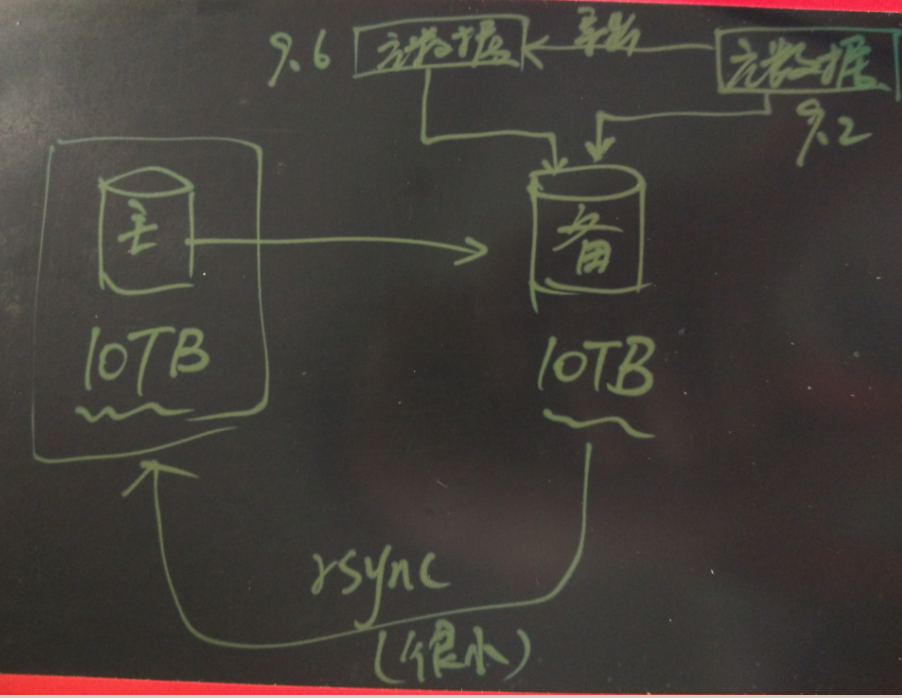    
    
基于pg_upgrade的大版本升级可以参考我以前写的文章    
  
http://blog.163.com/digoal@126/blog/static/1638770402014111991023862/    
  
http://blog.163.com/digoal@126/blog/static/163877040201341981648918/    
  
2\. **方法2** , 通过逻辑复制增量平滑升级，与MySQL的升级方法一样，也很便利，但是要求一定要准备一个备库环境，如果数据库已经很庞大的话，总的升级时间会比较漫长。    
  
对于 >= 9.4的版本可以使用PG内置的逻辑复制。      
  
小于9.4的版本则可以使用londiste3或者slony-I。      
    
PG跨版本支持复制，而且支持的很好。    
  
对于>=9.4的版本，可以用基于流的逻辑复制。    
  
对于<9.4的版本，可以使用londiste3, slony-I。    
    
## 扩展阅读，用心感受PostgreSQL  
----  
  
**内核扩展**    
    
《找对业务G点, 体验酸爽 - PostgreSQL内核扩展指南》    
  
https://yq.aliyun.com/articles/55981     
    
《当物流调度遇见PostgreSQL - GIS, 路由, 机器学习 (狮子,女巫,魔衣橱)》    
  
https://yq.aliyun.com/articles/57857     
    
《弱水三千,只取一瓢,当图像搜索遇见PostgreSQL (Haar wavelet)》    
  
https://yq.aliyun.com/articles/58246     
    
《用PostgreSQL支持含有更新，删除，插入的实时流式计算》    
  
https://yq.aliyun.com/articles/30985     
    
《PostgreSQL 内核扩展之 - 管理十亿级3D扫描数据》    
  
https://yq.aliyun.com/articles/57095     
    
《PostgreSQL 内核扩展之 - ElasticSearch同步插件》    
  
https://yq.aliyun.com/articles/56824     
    
《为了部落 - 如何通过PostgreSQL基因配对，产生优良下一代》    
  
https://yq.aliyun.com/articles/55869     
    
《PostgreSQL 结巴分词》    
  
https://yq.aliyun.com/articles/58007     
    
《PostgreSQL 如何高效解决 按任意字段分词检索的问题 - case 1》  
  
https://yq.aliyun.com/articles/58006    
    
《mongoDB BI 分析利器 - PostgreSQL FDW (MongoDB Connector for BI)》    
  
https://yq.aliyun.com/articles/57987     
    
《关键时刻HINT出彩 - PG优化器的参数如何优化、执行计划如何固化》    
  
https://yq.aliyun.com/articles/57945     
    
《PostgreSQL Oracle兼容性之 - 锁定执行计划 (Outline system)》    
  
https://yq.aliyun.com/articles/57999     
    
《使用PostgreSQL 流复制decode 对接kafka，实现数据跨应用融合》  
  
http://www.confluent.io/blog/bottled-water-real-time-integration-of-postgresql-and-kafka/    
    
----  
  
**场景与优化**    
    
《PostgreSQL 如何潇洒的处理每天上百TB的数据增量》    
  
https://yq.aliyun.com/articles/8528    
    
《PostgreSQL 秒杀场景优化》    
  
https://yq.aliyun.com/articles/3010    
    
《PostgreSQL独孤九式搞定物联网》    
  
https://yq.aliyun.com/articles/52405    
    
《PostgreSQL 用CPU "硬解码" 提升1倍 数值运算能力 助力金融大数据量计算》    
  
https://yq.aliyun.com/articles/7482     
    
《PostgreSQL 百亿数据 秒级响应 正则及模糊查询》    
  
https://yq.aliyun.com/articles/7444     
    
《PostgreSQL 1000亿数据量 正则匹配 速度与激情》    
  
https://yq.aliyun.com/articles/7549     
    
《PostgreSQL 百亿地理位置数据 近邻查询性能优化》    
  
https://yq.aliyun.com/articles/2999     
    
----  
  
**大数据实践**   
    
《Greenplum 数据分布黄金法则 - 论分布列与分区的选择》    
  
https://yq.aliyun.com/articles/57822     
    
《Greenplum行存与列存的选择以及转换方法》    
  
https://yq.aliyun.com/articles/59132    
    
《阿里云ApsaraDB RDS用户 - OLAP最佳实践》    
  
https://yq.aliyun.com/articles/57778     
    
《Greenplum 资源隔离的原理与源码分析》    
  
https://yq.aliyun.com/articles/57763     
    
《PostgreSQL 多维分析 CASE》    
  
https://yq.aliyun.com/articles/53750     
    
《一致性哈希在分布式数据库中的应用探索》    
  
https://yq.aliyun.com/articles/57954     
    
《PostgreSQL 9.5新特性 width_bucket 位置插值，展示柱状图》    
  
https://yq.aliyun.com/articles/2642     
    
《PostgreSQL 9.5 新特性 高斯（正态）分布和指数分布 数据生成器》    
  
https://yq.aliyun.com/articles/2639     
    
《一个简单算法可以帮助物联网,金融 用户 节约98%的数据存储成本》    
  
https://yq.aliyun.com/articles/18042     
    
《开源数据库 PostgreSQL 攻克并行计算难题》    
  
https://yq.aliyun.com/articles/44655     
    
《PostgreSQL 并行计算 - 助力实时精准营销应用》    
  
https://yq.aliyun.com/articles/44649     
    
《PostgreSQL 9.6 并行计算 优化器算法浅析》    
  
https://yq.aliyun.com/articles/59180    
    
《PostgreSQL 计算 任意类型 字段之间的线性相关性》    
  
https://yq.aliyun.com/articles/18038    
    
《HLL 估值算法在PostgreSQL大数据 估值计算中的应用》    
  
http://blog.163.com/digoal@126/blog/static/16387704020131264480325/    
  
http://blog.163.com/digoal@126/blog/static/1638770402013127917876/    
  
http://blog.163.com/digoal@126/blog/static/16387704020131288553810/    
    
《PostgreSQL 流式计算数据库pipelineDB》    
  
http://www.pipelinedb.com/    
    
《旋转门数据压缩算法在PostgreSQL中的实现》    
  
https://yq.aliyun.com/articles/59101    
    
《PostgreSQL 三角函数的用法举例 - 已知3点求夹角（旋转门续）》    
  
https://yq.aliyun.com/articles/59175    
    
《PostgreSQL 文本数据分析实践之 - 相似度分析》    
  
https://yq.aliyun.com/articles/59212    
    
----  
  
**最佳实践**    
    
《固若金汤 - PostgreSQL pgcrypto加密插件》    
  
https://yq.aliyun.com/articles/58377     
    
《PostgreSQL 物联网黑科技 - 瘦身500倍的索引(范围索引 BRIN)》    
  
https://yq.aliyun.com/articles/27860     
    
《PostgreSQL 物联网黑科技 - 阅后即焚》    
  
https://yq.aliyun.com/articles/27722     
    
《如何用PostgreSQL解决一个人工智能 语义去重 的小问题》    
  
https://yq.aliyun.com/articles/25899     
    
《PostgreSQL 老湿机图解平安科技遇到的垃圾回收"坑"，及解法》    
  
https://yq.aliyun.com/articles/57710     
    
《PostgreSQL雕虫小技，分组TOP性能提升44倍》    
  
https://yq.aliyun.com/articles/57315     
    
《PostgreSQL 9.6 黑科技 bloom 算法索引，一个索引支撑任意列组合查询》    
  
https://yq.aliyun.com/articles/51131     
    
《PostgreSQL 9.6 攻克金融级多副本可靠性问题》    
  
https://yq.aliyun.com/articles/45518     
    
《distinct xx和count(distinct xx)的 变态优化方法》    
  
https://yq.aliyun.com/articles/39689     
    
《PostgreSQL 百亿级数据范围查询, 分组排序窗口取值 变态优化 case》    
  
https://yq.aliyun.com/articles/39680     
    
《中文模糊查询性能优化 by PostgreSQL trgm》    
  
https://yq.aliyun.com/articles/39033     
    
《PostgreSQL Oracle兼容性之 - connect by》    
  
https://yq.aliyun.com/articles/54657     
    
《论云数据库编程能力的重要性》    
  
https://yq.aliyun.com/articles/38377     
    
《使用sysbench测试阿里云RDS PostgreSQL性能》    
  
https://yq.aliyun.com/articles/35517     
    
《PostgreSQL merge json的正确姿势》    
  
https://yq.aliyun.com/articles/54646     
    
《PostgreSQL 在路上的特性 - 远离触发器, 拥抱内置分区》    
  
https://yq.aliyun.com/articles/54456     
    
《PostgreSQL 如何轻松搞定行驶、运动轨迹合并和切分》    
  
https://yq.aliyun.com/articles/54445     
    
《在PostgreSQL中如何生成kmean算法的测试数据》    
  
https://yq.aliyun.com/articles/53992     
    
《在PostgreSQL中如何生成线性相关的测试数据》    
  
https://yq.aliyun.com/articles/53993     
    
----  
  
**内核探索**   
  
《PostgreSQL plan cache 源码浅析 - 如何确保不会计划倾斜》    
  
https://yq.aliyun.com/articles/55719     
    
《为什么用 PostgreSQL 绑定变量 没有 Oracle pin S 等待问题》    
  
https://yq.aliyun.com/articles/55698     
    
《PostgreSQL 同步流复制原理和代码浅析》    
  
https://yq.aliyun.com/articles/55676     
    
《深入浅出PostgreSQL B-Tree索引结构》    
  
https://yq.aliyun.com/articles/53701     
    
《PostgreSQL 可靠性和一致性 代码分析》    
  
https://yq.aliyun.com/articles/37395     
    
《PostgreSQL HOT技术》   
  
src/backend/access/heap/README.HOT    
    
《PostgreSQL B-Tree GIN GIST SP-GIST BRIN HASH索引内部结构》    
  
https://www.pgcon.org/2016/schedule/attachments/434_Index-internals-PGCon2016.pdf    
    
----  
  
**更多内容请访问**   
  
云栖PostgreSQL圈子    
  
https://yq.aliyun.com/groups/29    
    
云栖Greenplum圈子    
  
https://yq.aliyun.com/groups/13    
    
ApsaraDB 数据库内核组月报（涵盖MySQL PostgreSQL Greenplum mongoDB 等数据库引擎）    
  
http://mysql.taobao.org/monthly/    
    
我的BLOG    
  
http://blog.163.com/digoal@126    
    
我的git    
  
https://github.com/digoal    
    
## 小结    
每种数据库都要去深入了解，才能去解决业务上面对的问题。    
    
每种数据库存在即有存在的理由，有它适合的场景，MySQL和PostgreSQL发展这么多年，都有各自的用户群体，相互都有学习和借鉴的地方。    
     
**作为数据库内核工作者，要多学习，把数据库做好，把最终用户服务好才是王道 ** ，    
    
UBER发表的该文章对PG的论点过于表面和片面，再加上 很多国内的用户对PostgreSQL的认识还停留在07年以前的水平 ，读者要多思考，否则容易被拿去当枪使  。    
     
基于线程和进程的讨论非常多，优劣都很鲜明，PostgreSQL基于进程的模型，优势则是非常稳健，可以动态的fork worker进程，动态的分配共享内存段，新增插件很方便。     
     
所以PG的扩展能力极强，看看PG那无数的插件就知道了，它是一个贴近用户，并且高度可定制化的数据库。    
     
本文末尾的扩展阅读也包含了大量通过插件方式扩展PG功能的文章。      
     
劣势就是建立连接时的开销较大，但通常应用都有连接池，没有的话可以通过加连接池解决这个问题。      
      
PG社区对PostgreSQL的技术普及与推广任重道远，加油！！！      
    
本文仅对uber发文的PG部分，从技术实现的角度作出剖析和解释，网友可以多多交流。    
       
祝大家玩得开心，欢迎随时来 **阿里云促膝长谈业务需求**  ，恭候光临。    
      
PostgreSQL作为一个开源数据库，还有很多值得改进和优化的地方，阿里云ApsaraDB for PG的小伙伴们一直在努力。     
      
阿里云的小伙伴们加油，努力做好内核与服务，打造 **最贴地气的云数据库**  。     
      
  
<a rel="nofollow" href="http://info.flagcounter.com/h9V1"  ></a>  
  
  
  
  
  
  
## [digoal's 大量PostgreSQL文章入口](https://github.com/digoal/blog/blob/master/README.md "22709685feb7cab07d30f30387f0a9ae")
  
