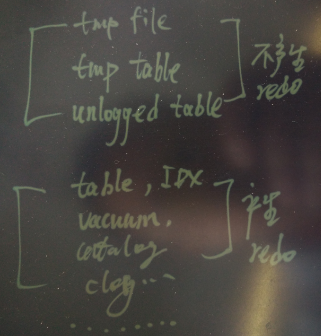
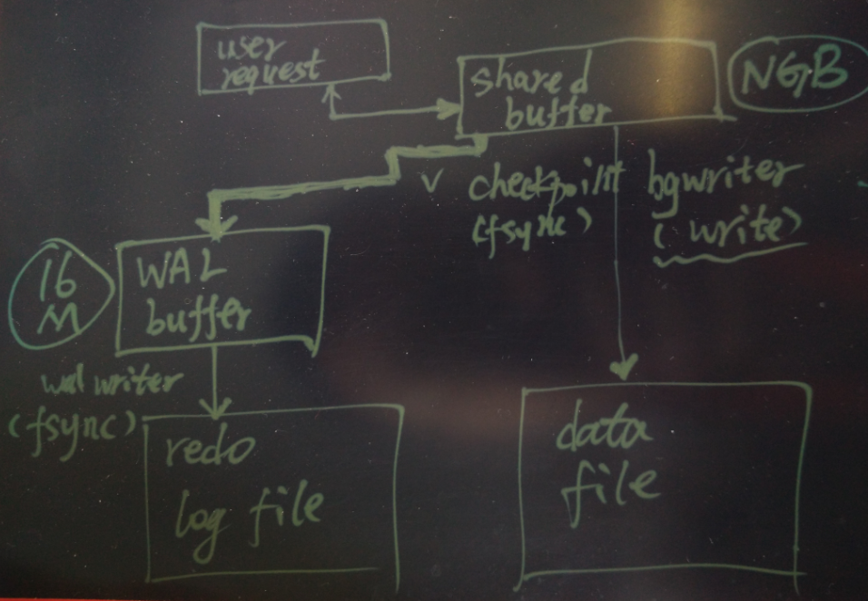
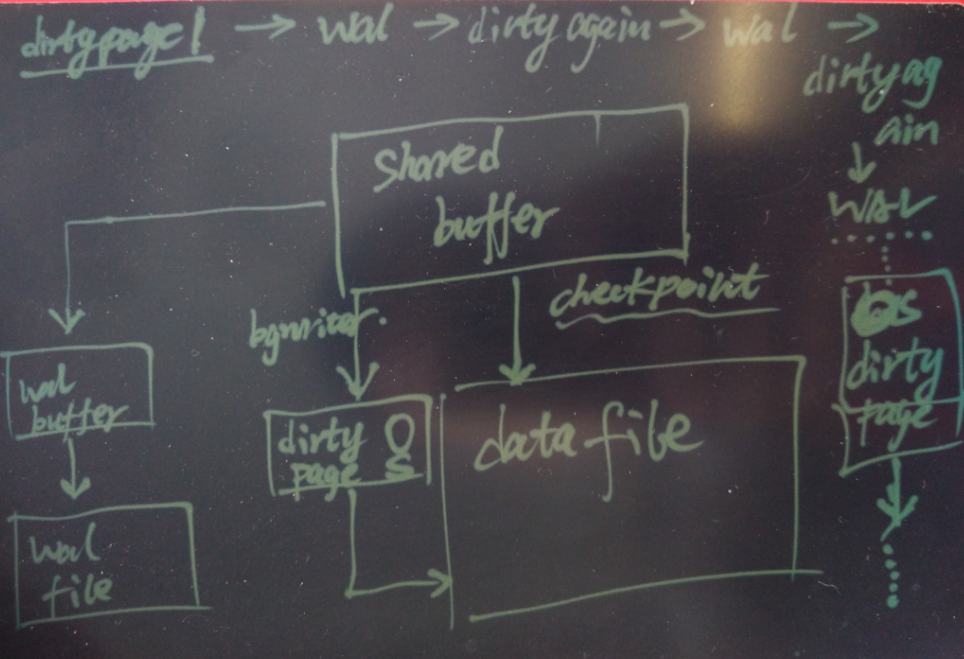

## 论数据库redo/data存储规划与SSD写倾斜      
                                                                                                          
### 作者                                                                                                         
digoal                                                                                                          
                                                                                                          
### 日期                                                                                                        
2016-07-28                  
                                                                                                          
### 标签                                                                                                        
PostgreSQL , ssd寿命 , raid , 写倾斜 , data , xlog , redo                                      
                                            
----                                                                                                        
                                                
## 背景    
SSD以其良好的IOPS和读写带宽，正在逐渐取代原来的主流存储，成为企业存储市场的新宠。      
      
在一些对存储IOPS和读写带宽需要较大的重要应用中，例如数据库，SSD的使用也越来越普遍。      
      
但是SSD的寿命和写入量有关，如果没有规划好，可能会拉高故障率和成本。      
      
另一方面，SSD还存在写放大的可能，例如写1字节，对应到SSD上也需要一个原子写（可能是4KB或者其他大小（厂家决定）），厂家可能还有写缓存来减缓写放大的问题。就不再深入讨论了。      
      
## 读写倾斜的分析    
以PostgreSQL数据库为例，如果没有规划好存储，出现倾斜是必然的。      
      
出现写倾斜后，SSD的剩余寿命也会出现倾斜，你一定不愿意看到一边是满血，一边是奄奄一息的硬盘吧。  小时候就教育我们要德智体全面发展的人才，数据库设计也一样。        
      
通常一个PostgreSQL数据库会有这样一些目录      
    
```    
drwx------ 6 digoal digoal  4096 Jul 28 10:11 base    
drwx------ 2 digoal digoal  4096 Jul 28 10:18 global    
drwx------ 2 digoal digoal  4096 Jul 28 11:17 pg_clog    
drwx------ 2 digoal digoal  4096 Jul 28 10:03 pg_commit_ts    
drwx------ 2 digoal digoal  4096 Jul 28 10:03 pg_dynshmem    
-rw------- 1 digoal digoal  4468 Jul 28 10:03 pg_hba.conf    
-rw------- 1 digoal digoal  1636 Jul 28 10:03 pg_ident.conf    
drwx------ 2 digoal digoal  4096 Jul 28 10:18 pg_log    
drwx------ 4 digoal digoal  4096 Jul 28 10:03 pg_logical    
drwx------ 4 digoal digoal  4096 Jul 28 10:03 pg_multixact    
drwx------ 2 digoal digoal  4096 Jul 28 10:18 pg_notify    
drwx------ 2 digoal digoal  4096 Jul 28 10:03 pg_replslot    
drwx------ 2 digoal digoal  4096 Jul 28 10:03 pg_serial    
drwx------ 2 digoal digoal  4096 Jul 28 10:03 pg_snapshots    
drwx------ 2 digoal digoal  4096 Jul 28 10:18 pg_stat    
drwx------ 2 digoal digoal  4096 Jul 28 11:32 pg_stat_tmp    
drwx------ 2 digoal digoal 12288 Jul 28 11:18 pg_subtrans    
drwx------ 2 digoal digoal  4096 Jul 28 10:03 pg_tblspc    
drwx------ 2 digoal digoal  4096 Jul 28 10:03 pg_twophase    
-rw------- 1 digoal digoal     4 Jul 28 10:03 PG_VERSION    
lrwxrwxrwx 1 digoal digoal    22 Jul 28 10:03 pg_xlog -> /data05/digoal/pg_xlog    
-rw------- 1 digoal digoal    88 Jul 28 10:03 postgresql.auto.conf    
-rw------- 1 digoal digoal 21641 Jul 28 10:09 postgresql.conf    
-rw------- 1 digoal digoal    35 Jul 28 10:18 postmaster.opts    
-rw------- 1 digoal digoal    75 Jul 28 10:18 postmaster.pid    
```    
      
写入量较大的目录或内容 ：       
    
* 临时表空间      
    
* 数据表空间      
    
* REDO日志      
      
写请求较多的：      
    
* REDO日志，      
    
  几乎所有的数据变更都要写REDO，包括垃圾回收的操作在内（除临时表，UNLOGGED，HASH索引不需要），    
    
      
    
  每次写入量的最小单位为wal-blocksize，默认8KB。    
    
```    
   --with-wal-blocksize=BLOCKSIZE    
                          set WAL block size in kB [8]    
```    
      
  * 数据库有两块buffer, wal buffer和shared buffer。      
    
  当数据发生变更时，首先会在SHARED BUFFER中变更，每一次变更都会记录redo，而且检查点后的第一次变更需要记录完整的数据块(if full page write=on)，所有的REDO都会经过wal buffer，最终都要落盘。      
       
      
      
  而shared buffer，则由bgwriter调度，每隔一段时间将根据老化算法，将脏页write到OS DIRTY PAGE，再由OS调度最终落盘，OS调度还会合并IO，所以IO量相比xlog会小很多。        
      
  另外checkpoint也会将shared buffer写入磁盘，调用的是SYNC接口，但是由于checkpoint不频繁，所以shared buffer的sync操作是极少的。      
      
      
      
  所以当一个数据块发生多次变更时，被写入到数据盘的次数可能很少，而被写入到XLOG的次数则是每次变更都要写（当然每次小的变更，可能只写BLOCK的一部分数据到XLOG（但还是会包含很多额外的附加信息）），从这个现象上来看，XLOG的写入量会比数据盘的写入量大很多。      
      
      
      
从上面的分析来看，XLOG盘的写入量会比数据盘大很多，如果你将XLOG盘分离出去，就要小心写倾斜了。      
      
        
      
## 佐证读写倾斜的推理    
用cgroup统计xlog盘与数据盘的读写请求与字节数来佐证前面的论据。      
      
用于测试的块设备对应的加载点        
    
```    
[root@iZ28tqoemgtZ cgroups]# ll /dev/vde    
brw-rw---- 1 root disk 253, 64 Jul  7 22:35 /dev/vde    
[root@iZ28tqoemgtZ cgroups]# ll /dev/vdd    
brw-rw---- 1 root disk 253, 48 Jul  7 22:35 /dev/vdd    
    
/dev/vde        689G   13G  642G   2% /data05    
/dev/vdd        689G   13G  642G   2% /data04    
```    
      
cgroup配置      
    
```    
        mount -t tmpfs cgroup_root /sys/fs/cgroup    
        mkdir /sys/fs/cgroup/blkio    
        mount -t cgroup -o blkio none /sys/fs/cgroup/blkio    
    
        mkdir -p /sys/fs/cgroup/blkio/test1/    
    
echo "253:48 10000000000" >./blkio.throttle.read_iops_device     
echo "253:64 10000000000" >./blkio.throttle.read_iops_device    
echo "253:64 10000000000" >./blkio.throttle.write_iops_device    
echo "253:48 10000000000" >./blkio.throttle.write_iops_device     
```    
      
数据库      
    
```    
# su - digoal    
$ vi env.sh    
export PS1="$USER@`/bin/hostname -s`-> "    
export PGPORT=1921    
export PGDATA=/data04/digoal/pg_root    
export LANG=en_US.utf8    
export PGHOME=/home/digoal/pgsql9.5    
export LD_LIBRARY_PATH=$PGHOME/lib:/lib64:/usr/lib64:/usr/local/lib64:/lib:/usr/lib:/usr/local/lib:$LD_LIBRARY_PATH    
export DATE=`date +"%Y%m%d%H%M"`    
export PATH=$PGHOME/bin:$PATH:.    
export MANPATH=$PGHOME/share/man:$MANPATH    
export PGHOST=$PGDATA    
export PGUSER=postgres    
export PGDATABASE=postgres    
alias rm='rm -i'    
alias ll='ls -lh'    
#unalias vi    
```    
      
xlog和数据盘分布在data05和data04目录        
    
```    
initdb -D /data04/digoal/pg_root -X /data05/digoal/pg_xlog -E UTF8 --locale=C -U postgres    
```    
      
数据库参数      
    
```    
listen_addresses = '0.0.0.0'            # what IP address(es) to listen on;    
port = 1921                             # (change requires restart)    
max_connections = 100                   # (change requires restart)    
superuser_reserved_connections = 3      # (change requires restart)    
unix_socket_directories = '.'   # comma-separated list of directories    
shared_buffers = 16GB                   # min 128kB    
maintenance_work_mem = 512MB            # min 1MB    
dynamic_shared_memory_type = posix      # the default is the first option    
vacuum_cost_delay = 0                   # 0-100 milliseconds    
bgwriter_delay = 10ms                   # 10-10000ms between rounds    
wal_level = minimal                     # minimal, archive, hot_standby, or logical    
fsync = on                              # turns forced synchronization on or off    
synchronous_commit = on         # synchronization level;    
full_page_writes = on                   # recover from partial page writes    
wal_buffers = 16MB                      # min 32kB, -1 sets based on shared_buffers    
commit_delay = 10                       # range 0-100000, in microseconds    
commit_siblings = 5                     # range 1-1000    
checkpoint_timeout = 55min              # range 30s-1h    
max_wal_size = 32GB    
checkpoint_completion_target = 0.9      # checkpoint target duration, 0.0 - 1.0    
log_destination = 'csvlog'              # Valid values are combinations of    
logging_collector = on          # Enable capturing of stderr and csvlog    
log_truncate_on_rotation = on           # If on, an existing log file with the    
log_timezone = 'PRC'    
autovacuum = on                 # Enable autovacuum subprocess?  'on'    
autovacuum_max_workers = 8              # max number of autovacuum subprocesses    
autovacuum_naptime = 30s         # time between autovacuum runs    
autovacuum_vacuum_cost_delay = 0        # default vacuum cost delay for    
datestyle = 'iso, mdy'    
timezone = 'PRC'    
lc_messages = 'C'                       # locale for system error message    
lc_monetary = 'C'                       # locale for monetary formatting    
lc_numeric = 'C'                        # locale for number formatting    
lc_time = 'C'                           # locale for time formatting    
default_text_search_config = 'pg_catalog.english'    
```    
      
启动数据库放入分组    
    
```    
# cgexec -g blkio:test1 su - digoal -c ". ~/env.sh ; pg_ctl start"    
    
# cd /sys/fs/cgroup/blkio/test1    
[test1]# cat tasks     
20749    
20750    
20752    
20753    
20754    
20755    
20756    
```    
      
生成tpc-B测试数据1000万条      
    
```    
$ pgbench -i -s 100    
```    
      
开始压测      
    
```    
$ pgbench -M prepared -n -r -P 5 -c 48 -j 48 -T 10000    
```    
      
观察数据盘和日志盘的数据写入量和sync量        
    
日志盘的写入量远远大于数据盘，日志盘没有write，全部是sync操作          
    
数据盘由于有write操作，所以write大于sync，这也佐证了我前面的论据      
    
```    
# cat blkio.throttle.io_service_bytes     
253:64 Read 69632    
253:64 Write 39504248832    
253:64 Sync 39504248832    
253:64 Async 69632    
253:64 Total 39504318464    
253:48 Read 0    
253:48 Write 522616832    
253:48 Sync 248053760    
253:48 Async 274563072    
253:48 Total 522616832    
253:0 Read 126976    
253:0 Write 0    
253:0 Sync 0    
253:0 Async 126976    
253:0 Total 126976    
Total 40027062272    
    
# cat blkio.throttle.io_serviced    
253:64 Read 17    
253:64 Write 2949886    
253:64 Sync 2949886    
253:64 Async 17    
253:64 Total 2949903    
253:48 Read 0    
253:48 Write 50796    
253:48 Sync 8722    
253:48 Async 42074    
253:48 Total 50796    
253:0 Read 25    
253:0 Write 0    
253:0 Sync 0    
253:0 Async 25    
253:0 Total 25    
Total 3000724    
```    
      
结论就是日志盘的写入量比数据盘大很多，这个CASE是75倍。      
      
## 如何解这个问题    
如果你的生产中是这么部署的，日志盘用了4块SSD，数据盘用了8块SSD，那么问题来了。       
      
每块SSD的写入量假设为10PB，那么SSD4块盘的SSD总的写入量为40PB，8快盘的总写入量为80PB。      
      
那么也许1年之后XLOG就写入40PB了，而数据盘才写入1PB不到。        
      
SSD的剩余寿命就会相差悬殊，如果因为日志盘的问题，直接下线整台主机就不对了，还有8快盘没磨损呢。         
    
    
      
怎么解呢？      
      
XLOG的写入是无法避免的，但是我们有方法防止故障。      
      
1\. 在XLOG盘还有命的时候，提取更换，如果有RAID的话，一块块换，提前rebuild。      
    
    需要注意的是，热插拔可能会有短暂的IO堵塞，rebuild过程中也会造成性能影响。      
      
减少XLOG的写入方法      
    
2\.1\. 关闭full page write会少写一点XLOG，但是造成无法处理操作系统或硬件的数据库崩溃恢复。      
      
2\.2\. 拉长检查点会少些一点XLOG。     
      
均衡磨损的方法      
    
3\. 数据盘和日志盘不要分开，大家放在一起，一起磨损。这样就不会倾斜了，但是同样要解决一个问题，rebuild。        
      
## 其他    
1\. 机械盘也有机械盘的问题，例如某个场景导致的磁盘问题（例如Oracle数据库，一直读写的轮询使用的REDO区间），或者一直更新某一个数据块的记录。 这部分磁盘可能很容易损坏。      
    
  而SSD不存在这个问题，因为有磨损算法，即使你不停更新一个块，也不会出现这个CEIL坏掉导致不可用，肯定SSD内部已经提前将这个ceil的内容转移并更新映射关系了。      
    
2\. cgroup      
    
```    
Proportional Weight division of bandwidth    
-----------------------------------------    
You can do a very simple testing of running two dd threads in two different    
cgroups. Here is what you can do.    
    
- Enable Block IO controller    
        CONFIG_BLK_CGROUP=y    
    
- Enable group scheduling in CFQ    
        CONFIG_CFQ_GROUP_IOSCHED=y    
    
- Compile and boot into kernel and mount IO controller (blkio); see    
  cgroups.txt, Why are cgroups needed?.    
    
        mount -t tmpfs cgroup_root /sys/fs/cgroup    
        mkdir /sys/fs/cgroup/blkio    
        mount -t cgroup -o blkio none /sys/fs/cgroup/blkio    
    
        mkdir -p /sys/fs/cgroup/blkio/test1/    
    
- blkio.sectors    
        - number of sectors transferred to/from disk by the group. First    
          two fields specify the major and minor number of the device and    
          third field specifies the number of sectors transferred by the    
          group to/from the device.    
    
- blkio.io_service_bytes    
        - Number of bytes transferred to/from the disk by the group. These    
          are further divided by the type of operation - read or write, sync    
          or async. First two fields specify the major and minor number of the    
          device, third field specifies the operation type and the fourth field    
          specifies the number of bytes.    
    
- blkio.io_serviced    
        - Number of IOs completed to/from the disk by the group. These    
          are further divided by the type of operation - read or write, sync    
          or async. First two fields specify the major and minor number of the    
          device, third field specifies the operation type and the fourth field    
          specifies the number of IOs.    
```    
      
                   
                                          
                                                  
              
  
<a rel="nofollow" href="http://info.flagcounter.com/h9V1"  ></a>  
  
  
  
  
  
  
## [digoal's 大量PostgreSQL文章入口](https://github.com/digoal/blog/blob/master/README.md "22709685feb7cab07d30f30387f0a9ae")
  
