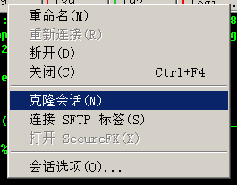
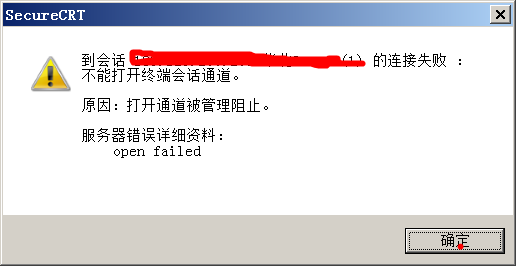

## securecrt克隆会话与sshd 的 MaxSessions    
                                                                
### 作者                                                                    
digoal                                                                    
                                                                
### 日期                                                                    
2016-07-28                                                                
                                                                
### 标签                                                                    
PostgreSQL , securecrt , sshd , MaxSessions                         
                                                                
----                                                                    
                                                                
## 背景  
使用securecrt克隆会话时，原有会话连接的session数会自增。    
    
例如    
    
    
    
要使用ssh连接，sshd的MaxSessions必须>=1，默认是10。    
    
如果把MaxSessions改成2，那么对同一个ssh连接，只能克隆1个，（克隆出来的ssh连接窗可以再克隆，但是对同一个连接窗只能克隆一个会话）    
    
    
    
/var/log/secure中的报错    
  
```  
sshd[11318]: error: no more sessions  
```  
    
代码    
  
新建的会话，消耗一个session计数，如果在当前会话中新建会话，就会继续消耗当前会话的会话数。    
  
如果消耗的会话数大于设置的maxsessions，则报错。    
  
openssh  session.c      
  
```  
Session *  
session_new(void)  
{  
        Session *s, *tmp;  
  
        if (sessions_first_unused == -1) {  
                if (sessions_nalloc >= options.max_sessions)  
                        return NULL;  
                debug2("%s: allocate (allocated %d max %d)",  
                    __func__, sessions_nalloc, options.max_sessions);  
                tmp = xrealloc(sessions, sessions_nalloc + 1,  
                    sizeof(*sessions));  
                if (tmp == NULL) {  
                        error("%s: cannot allocate %d sessions",  
                            __func__, sessions_nalloc + 1);  
                        return NULL;  
                }  
                sessions = tmp;  
                session_unused(sessions_nalloc++);  
        }  
  
        if (sessions_first_unused >= sessions_nalloc ||  
            sessions_first_unused < 0) {  
                fatal("%s: insane first_unused %d max %d nalloc %d",  
                    __func__, sessions_first_unused, options.max_sessions,  
                    sessions_nalloc);  
        }  
  
        s = &sessions[sessions_first_unused];  
        if (s->used) {  
                fatal("%s: session %d already used",  
                    __func__, sessions_first_unused);  
        }  
        sessions_first_unused = s->next_unused;  
        s->used = 1;  
        s->next_unused = -1;  
        debug("session_new: session %d", s->self);  
  
        return s;  
}  
  
  
/*  
 * Prepares for an interactive session.  This is called after the user has  
 * been successfully authenticated.  During this message exchange, pseudo  
 * terminals are allocated, X11, TCP/IP, and authentication agent forwardings  
 * are requested, etc.  
 */  
static void  
do_authenticated1(Authctxt *authctxt)  
{  
...  
        s = session_new();  
        if (s == NULL) {  
                error("no more sessions");  //session_new失败，报错  
                return;  
        }  
...  
  
```  
    
## 参考  
http://unix.stackexchange.com/questions/26170/sshd-config-maxsessions-parameter    
  
/usr/src/debug/openssh-6.4p1/sessions.c  
  
                                                                
                  
              
  
<a rel="nofollow" href="http://info.flagcounter.com/h9V1"  ></a>  
  
  
  
  
  
  
## [digoal's 大量PostgreSQL文章入口](https://github.com/digoal/blog/blob/master/README.md "22709685feb7cab07d30f30387f0a9ae")
  
