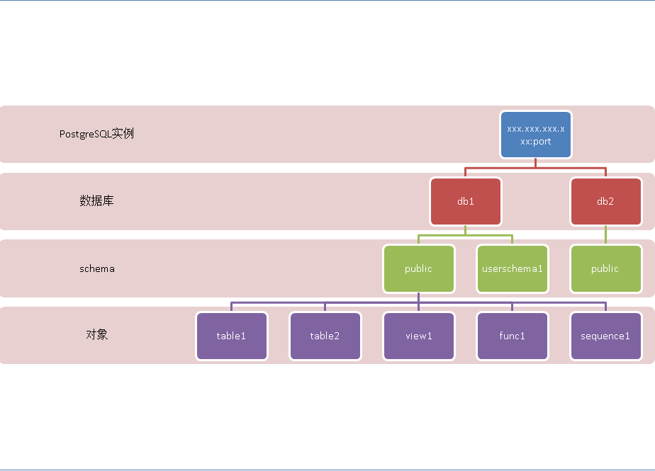

## search_path在PostgreSQL函数开发中的注意事项       
                                                                    
### 作者                                                                        
digoal                                                                        
                                                                    
### 日期                                                                        
2016-07-29                                                                    
                                                                    
### 标签                                                                        
PostgreSQL , search_path                               
                                                                    
----                                                                        
                                                                    
## 背景    
PostgreSQL 与大多数数据库一样，通过schema，逻辑上划分对象的归属，如图。      
    
      
      
用户还可以参考《PostgreSQL 逻辑结构 和 权限体系 介绍》      
    
https://yq.aliyun.com/articles/41210      
      
因为有了schema的概念，在访问数据库中的对象时，我们需要指定是哪个schema下面的。      
      
例如schema_a.table。      
    
为了方便用户使用，PostgreSQL 还有一个客户端的环境参数叫search_path，用来控制搜索路径的顺序。        
      
例如 search_path= '"$user",public' 表示优先搜索与当前用户名同名的schema，如果没有则搜索public schema。      
      
例如 当前用户为a, 在数据库中有一张表是a.tbl还有一张表public.tbl。  那么select * from tbl，访问的是a.tbl。      
      
## 函数编写注意事项      
我们在写函数时，很容易忽略一点，就是搜索路径。      
      
比如我写了一个这样的函数      
    
```    
sanity=> CREATE OR REPLACE FUNCTION "digoal"."getbusinessname"("ptypeno" varchar)    
  RETURNS "pg_catalog"."varchar" AS $BODY$    
    
        BEGIN    
    
                RETURN (select typename from tbl_core_bus where typeno= ptypeno);    
    
        END;    
    
$BODY$    
  LANGUAGE 'plpgsql' VOLATILE;    
CREATE FUNCTION    
```    
      
会有点乱哦，tbl_core_bus表到底是哪个schema下的呢？        
    
与search_path有关，所以如果在search_path中没有这个表时，访问这个函数就会报错。        
        
因此在写函数时务必注意，使用schema，避免这种问题。      
        
上面的函数可以改成如下，在访问对象的前面加上schema表示        
    
```    
CREATE OR REPLACE FUNCTION "digoal"."getbusinessname"("ptypeno" varchar)    
  RETURNS "pg_catalog"."varchar" AS $BODY$    
    
        BEGIN    
    
                RETURN (select typename from digoal.tbl_core_bus where typeno= ptypeno);    
    
        END;    
    
$BODY$    
  LANGUAGE 'plpgsql' VOLATILE;    
```    
      
或者改成如下，设置函数的参数search_path        
    
```    
CREATE OR REPLACE FUNCTION "digoal"."getbusinessname"("ptypeno" varchar)    
  RETURNS "pg_catalog"."varchar" AS $BODY$    
    
        BEGIN    
    
                RETURN (select typename from tbl_core_bus where typeno= ptypeno);    
    
        END;    
    
$BODY$    
  LANGUAGE 'plpgsql' VOLATILE set search_path='digoal';    
```    
      
或者改成如下，在函数内使用set命令设置search_path        
    
```    
CREATE OR REPLACE FUNCTION "digoal"."getbusinessname"("ptypeno" varchar)    
  RETURNS "pg_catalog"."varchar" AS $BODY$    
    
        BEGIN    
        set search_path='digoal';    
    
                RETURN (select typename from tbl_core_bus where typeno= ptypeno);    
    
        END;    
    
$BODY$    
  LANGUAGE 'plpgsql' VOLATILE ;    
```    
      
祝大家玩得开心，欢迎随时来 **阿里云促膝长谈业务需求** ，恭候光临。      
      
阿里云的小伙伴们加油，努力 **做好内核与服务，打造最贴地气的云数据库**  。      
      
                                                                    
                      
                  
  
<a rel="nofollow" href="http://info.flagcounter.com/h9V1"  ></a>  
  
  
  
  
  
  
## [digoal's 大量PostgreSQL文章入口](https://github.com/digoal/blog/blob/master/README.md "22709685feb7cab07d30f30387f0a9ae")
  
