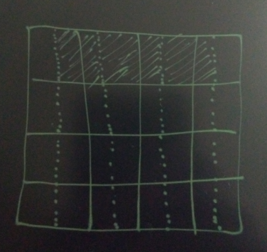

## 未对齐(alignment)造成SSD 写放大一例  
                                                                              
### 作者                                                                                  
digoal                                                                                  
                                                                              
### 日期                                                                                  
2016-08-06                                                                              
                                                                              
### 标签                                                                                  
Linux , SSD , 对齐 , alignment , 写放大                       
                                                                              
----                                                                                  
                                                                              
## 背景  
SSD的存储组织，决定了它在写入操作时，是以固定的单元进行写入的，所以在使用SSD时，务必要进行对齐操作。    
    
不对齐的后果很严重，不仅仅使得性能下降，还会带来写放大。    
    
来看一张图，例如实线分开的是SSD的写入单元，如果建立分区，或者LVM时，没有进行对齐，那么一个IO操作就可能跨SSD的写入单元，从而使得写入放大了一倍。    
     
再加上SSD的ceil是有擦写次数的寿命的，这种放大实际上不仅仅是性能的下降，寿命其实也减半了。    
    
    
    
## 例子  
两块PCI-E SSD，做成条带LVM，发现性能还不如一块的，我们来看看原因。    
    
**SSD未对齐测试**   
  
```  
pvcreate /dev/xxa  
pvcreate /dev/xxb  
  
vgcreate -s 128M vgdata01 /dev/xxa /dev/xxb  
lvcreate -i 2 -I 8 -n lv01 -l 100%VG vgdata01  
  
mkfs.ext4 /dev/mapper/vgdata01-lv01 -m 0 -O extent,uninit_bg -E lazy_itable_init=1  
  
mkdir /data01  
  
mount -o defaults,noatime,nodiratime,nodelalloc,barrier=0,data=writeback /dev/mapper/vgdata01-lv01 /data01  
  
dd if=/dev/zero of=/data01/img01 bs=1024k count=1024000 oflag=direct &  
dd if=/dev/zero of=/data01/img02 bs=1024k count=1024000 oflag=direct &  
dd if=/dev/zero of=/data01/img03 bs=1024k count=1024000 oflag=direct &  
dd if=/dev/zero of=/data01/img04 bs=1024k count=1024000 oflag=direct &  
dd if=/dev/zero of=/data01/img05 bs=1024k count=1024000 oflag=direct &  
dd if=/dev/zero of=/data01/img06 bs=1024k count=1024000 oflag=direct &  
```  
    
性能数据    
  
```  
#dstat  
----total-cpu-usage---- -dsk/total- -net/total- ---paging-- ---system--  
usr sys idl wai hiq siq| read  writ| recv  send|  in   out | int   csw   
  0   3  92   5   0   0|8192B 2951M| 470B  810B|   0     0 |  42k   99k  
  0   3  92   5   0   0|4096B 2971M| 246B  358B|   0     0 |  42k   99k  
  0   3  92   5   0   0|8192B 2945M| 220B  750B|   0     0 |  40k   98k  
  0   3  92   5   0   0|4096B 2940M|  66B  268B|   0     0 |  39k   92k  
  0   3  92   5   0   0|4096B 2896M|  66B  268B|   0     0 |  40k   94k  
  0   3  92   5   0   0|4096B 2883M|  66B  358B|   0     0 |  40k   96k  
```  
  
写入速度2.9GB/s左右，就是上不去。    
    
**SSD对齐测试1**   
  
使用parted分区对齐    
  
```  
umount /data01  
lvchange -an /dev/mapper/vgdata01-lv01  
lvremove /dev/mapper/vgdata01-lv01  
vgremove vgdata01  
pvremove /dev/xxa  
pvremove /dev/xxb  
  
parted -a optimal -s /dev/xxa mklabel gpt mkpart primary 1MB 6390GB  
parted -a optimal -s /dev/xxb mklabel gpt mkpart primary 1MB 6390GB  
```  
    
parted的对齐参数      
  
```  
       -a alignment-type, --align alignment-type  
              Set alignment for newly created partitions, valid alignment types are:  
  
              none   Use the minimum alignment allowed by the disk type.  
  
              cylinder  
                     Align partitions to cylinders.  
  
              minimal  
         Use minimum alignment as given by the disk topology information.   
         This and the opt value will use layout information provided by the disk to align  the  logical  partition  table  addresses  to  actual physical blocks on the disks.    
         The min value is the minimum alignment needed to align the partition properly to physical blocks, which avoids performance degradation.  
  
              optimal  
                     Use optimum alignment as given by the disk topology information.   
This aligns to a multiple of the physical block size in a way that guarantees optimal performance.  
```  
    
分区，测试    
  
```  
pvcreate /dev/xxa1  
pvcreate /dev/xxb1  
  
vgcreate -s 128M vgdata01 /dev/xxa1 /dev/xxb1  
  
lvcreate -i 2 -I 8 -n lv01 -l 100%VG vgdata01  
  
mkfs.ext4 /dev/mapper/vgdata01-lv01 -m 0 -O extent,uninit_bg -E lazy_itable_init=1  
  
mkdir /data01  
  
mount -o defaults,noatime,nodiratime,nodelalloc,barrier=0,data=writeback /dev/mapper/vgdata01-lv01 /data01  
  
dd if=/dev/zero of=/data01/img01 bs=1024k count=1024000 oflag=direct &  
dd if=/dev/zero of=/data01/img02 bs=1024k count=1024000 oflag=direct &  
dd if=/dev/zero of=/data01/img03 bs=1024k count=1024000 oflag=direct &  
dd if=/dev/zero of=/data01/img04 bs=1024k count=1024000 oflag=direct &  
dd if=/dev/zero of=/data01/img05 bs=1024k count=1024000 oflag=direct &  
dd if=/dev/zero of=/data01/img06 bs=1024k count=1024000 oflag=direct &  
```  
    
性能数据    
  
```  
# dstat  
----total-cpu-usage---- -dsk/total- -net/total- ---paging-- ---system--  
usr sys idl wai hiq siq| read  writ| recv  send|  in   out | int   csw   
  0   8  88   4   0   0|  16k 5959M| 190B  268B|   0     0 | 100k  229k  
  0   8  87   4   0   0|8192B 5967M|  66B  358B|   0     0 |  98k  228k  
  0   9  87   4   0   0|  16k 5936M| 190B  178B|   0     0 | 112k  232k  
  0   8  87   4   0   0|8192B 5920M|  66B  426B|   0     0 | 110k  233k  
```  
  
写放大消除后，写入速度提到了5.9GB/s左右。    
  
**SSD对齐测试2**   
  
考虑到文件系统层的锁问题，分成多个LV，多个文件系统，继续测试      
  
```  
lvcreate -i 2 -I 8 -n lv01 -l 30%VG vgdata01  
lvcreate -i 2 -I 8 -n lv02 -l 30%VG vgdata01  
lvcreate -i 2 -I 8 -n lv03 -l 30%VG vgdata01  
  
mkfs.ext4 /dev/mapper/vgdata01-lv01 -m 0 -O extent,uninit_bg -E lazy_itable_init=1  
mkfs.ext4 /dev/mapper/vgdata01-lv02 -m 0 -O extent,uninit_bg -E lazy_itable_init=1  
mkfs.ext4 /dev/mapper/vgdata01-lv03 -m 0 -O extent,uninit_bg -E lazy_itable_init=1  
  
mkdir /data01  
mkdir /data02  
mkdir /data03  
  
mount -o defaults,noatime,nodiratime,nodelalloc,barrier=0,data=writeback /dev/mapper/vgdata01-lv01 /data01  
mount -o defaults,noatime,nodiratime,nodelalloc,barrier=0,data=writeback /dev/mapper/vgdata01-lv02 /data02  
mount -o defaults,noatime,nodiratime,nodelalloc,barrier=0,data=writeback /dev/mapper/vgdata01-lv03 /data03  
  
dd if=/dev/zero of=/data01/img01 bs=1024k count=1024000 oflag=direct &  
dd if=/dev/zero of=/data02/img01 bs=1024k count=1024000 oflag=direct &  
dd if=/dev/zero of=/data03/img01 bs=1024k count=1024000 oflag=direct &  
  
dd if=/dev/zero of=/data01/img02 bs=1024k count=1024000 oflag=direct &  
dd if=/dev/zero of=/data02/img02 bs=1024k count=1024000 oflag=direct &  
dd if=/dev/zero of=/data03/img02 bs=1024k count=1024000 oflag=direct &  
```  
    
性能数据    
  
```  
#dstat  
----total-cpu-usage---- -dsk/total- -net/total- ---paging-- ---system--  
usr sys idl wai hiq siq| read  writ| recv  send|  in   out | int   csw   
  0   7  87   6   0   0|8192B 6498M|  66B  338B|   0     0 |  92k  222k  
  0   7  87   6   0   0|  16k 6447M| 156B  268B|   0     0 |  92k  222k  
  0   7  87   6   0   0|8192B 6483M|  66B  178B|   0     0 | 102k  219k  
  0   7  87   6   0   0|  16k 6396M|  66B  178B|   0     0 |  95k  205k  
  0   7  87   6   0   0|8192B 6403M| 220B  750B|   0     0 |  80k  191k  
  0   6  87   6   0   0|  16k 6330M| 190B  178B|   0     0 |  95k  206k  
  0   6  88   6   0   0|8192B 6474M| 132B  272B|   0     0 |  97k  233k  
  0   6  88   6   0   0|  16k 6441M| 190B  178B|   0     0 | 100k  229k  
  0   6  87   6   0   0|8192B 6375M|  66B  516B|   0     0 |  88k  208k  
  0   7  87   6   0   0|  16k 6365M| 715B  437B|   0     0 |  95k  207k  
  0   6  88   6   0   0|8192B 6500M|  66B  252B|   0     0 |  95k  220k  
  0   6  88   6   0   0|8192B 6433M|  66B  178B|   0     0 |  93k  224k  
```  
  
使用多个文件系统，解决了文件系统的锁瓶颈，写入速度提升到了6.4GB/s左右。    
    
**SSD对齐测试3**   
  
再来看看不使用LVM，直接使用块设备的性能    
  
```  
lvchange -an /dev/mapper/vgdata01-lv01  
lvremove /dev/mapper/vgdata01-lv01  
lvchange -an /dev/mapper/vgdata01-lv02  
lvremove /dev/mapper/vgdata01-lv02  
lvchange -an /dev/mapper/vgdata01-lv03  
lvremove /dev/mapper/vgdata01-lv03  
vgremove vgdata01  
pvremove /dev/xxa1  
pvremove /dev/xxb1  
  
parted -a optimal -s /dev/xxa mklabel gpt mkpart primary 1MB 6390GB  
parted -a optimal -s /dev/xxb mklabel gpt mkpart primary 1MB 6390GB  
  
mkfs.ext4 /dev/xxa1 -m 0 -O extent,uninit_bg -E lazy_itable_init=1  
mkfs.ext4 /dev/xxb1 -m 0 -O extent,uninit_bg -E lazy_itable_init=1  
  
mkdir /data01  
mkdir /data02  
  
mount -o defaults,noatime,nodiratime,nodelalloc,barrier=0,data=writeback /dev/xxa1 /data01  
mount -o defaults,noatime,nodiratime,nodelalloc,barrier=0,data=writeback /dev/xxb1 /data02  
  
  
dd if=/dev/zero of=/data01/img01 bs=1024k count=1024000 oflag=direct &  
dd if=/dev/zero of=/data02/img01 bs=1024k count=1024000 oflag=direct &  
  
dd if=/dev/zero of=/data01/img02 bs=1024k count=1024000 oflag=direct &  
dd if=/dev/zero of=/data02/img02 bs=1024k count=1024000 oflag=direct &  
  
dd if=/dev/zero of=/data01/img03 bs=1024k count=1024000 oflag=direct &  
dd if=/dev/zero of=/data02/img03 bs=1024k count=1024000 oflag=direct &  
```  
    
性能数据    
  
```  
#dstat  
----total-cpu-usage---- -dsk/total- -net/total- ---paging-- ---system--  
usr sys idl wai hiq siq| read  writ| recv  send|  in   out | int   csw   
  0   3  89   8   0   0|8192B 6564M| 322B  428B|   0     0 |  42k  103k  
  0   3  89   8   0   0|  24k 6558M|  66B  178B|   0     0 |  43k  102k  
  0   3  89   8   0   0|  24k 6518M|  66B  268B|   0     0 |  42k  102k  
  0   3  89   8   0   0|8192B 6545M| 344B  750B|   0     0 |  43k  101k  
  0   3  89   8   0   0|8192B 6543M|  66B  268B|   0     0 |  43k  103k  
  0   3  89   8   0   0|  16k 6592M| 132B  362B|   0     0 |  42k  101k  
  0   3  89   8   0   0|  16k 6586M| 280B  482B|   0     0 |  42k  105k  
  0   3  89   8   0   0|8192B 6617M|  66B  302B|   0     0 |  42k  103k  
  0   3  89   8   0   0|8192B 6560M|  66B  268B|   0     0 |  40k  101k  
  0   3  89   8   0   0|  24k 6541M|  66B  178B|   0     0 |  39k  101k  
```  
  
不使用LVM，直接对块设备进行分区，速度可以达到6.5GB/s左右。    
    
SSD对齐后，lvm strip 相对单个盘的性能提升基本上是线性的，基本达到了独立使用块设备相加的性能。    
    
## 小结  
1\. SSD对齐使用是非常重要的，本文的测试结果可以证明这一点，对齐后，不仅能发挥最好的性能，还能保证最长的寿命。    
    
2\. LVM Linear vs Striped Logical Volumes    
  
https://sysadmincasts.com/episodes/27-lvm-linear-vs-striped-logical-volumes    
                                                                              
                                
                            
  
<a rel="nofollow" href="http://info.flagcounter.com/h9V1"  ></a>  
  
  
  
  
  
  
## [digoal's 大量PostgreSQL文章入口](https://github.com/digoal/blog/blob/master/README.md "22709685feb7cab07d30f30387f0a9ae")
  
