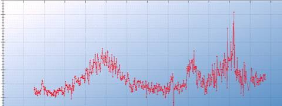
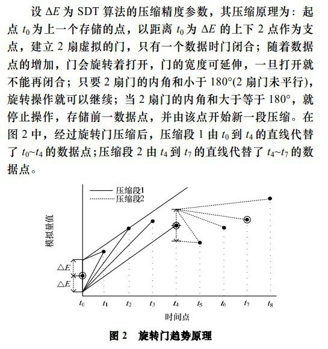
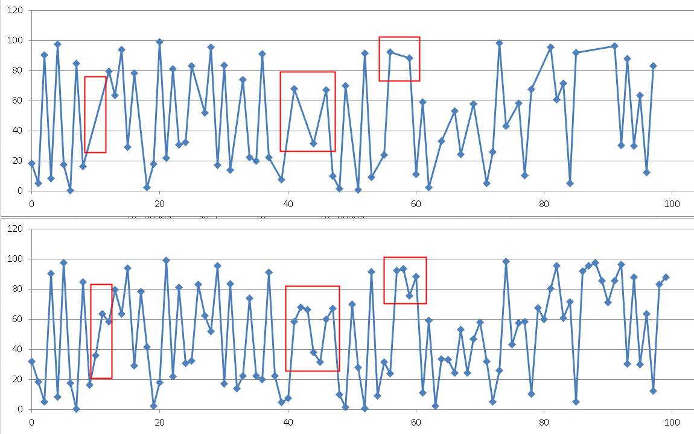

## 旋转门数据压缩算法在PostgreSQL中的实现 - 流式压缩在物联网、监控、传感器等场景的应用
                                    
### 作者                                   
digoal                                    
                                    
### 日期                                  
2016-08-13                                     
                                    
### 标签                                  
PostgreSQL , 旋转门 , 物联网 , 有损压缩 , 流式数据 , 时序数据 , 传感器 , 监控数据 , 日志数据                                                                          
                                    
----                                  
                                    
## 背景
在物联网、监控、传感器、金融等应用领域，数据在时间维度上流式的产生，而且数据量非常庞大。  
  
例如我们经常看到的性能监控视图，就是很多点在时间维度上描绘的曲线。  
  
又比如金融行业的走势数据等等。  
  
  
  
我们想象一下，如果每个传感器或指标每100毫秒产生1个点，一天就是864000个点。  
  
而传感器或指标是非常多的，例如有100万个传感器或指标，一天的量就接近一亿的量。  
  
假设我们要描绘一个时间段的图形，这么多的点，渲染估计都要很久。  
  
那么有没有好的压缩算法，即能保证失真度，又能很好的对数据进行压缩呢？    

## 旋转门压缩算法原理
旋转门压缩算法（SDT）是一种直线趋势化压缩算法,其本质是通过一条由起点和终点确定的直线代替一系列连续数据点。  
  
该算法需要记录每段时间间隔长度、起点数据和终点数据, 前一段的终点数据即为下一段的起点数据。  
  
其基本原理较为简单, 参见图。  
  
  
  
  
  
第一个数据点a上下各有一点,它们与a点之间的距离为E(即门的宽度), 这两个点作为“门”的两个支点。  
  
当只有第一个数据点时,两扇门都是关闭的;随着点数越来越多,门将逐步打开;注意到每扇门的宽度是可以伸缩的,在一段时间间隔里面,门一旦打开就不能闭;  
  
只要两扇门未达到平行,或者说两个内角之和小于180°(本文的算法将利用这一点进行判断),这种“转门”操作即可继续进行。  
  
图中第一个时间段是从a到e, 结果是用a点到e点之间的直线代替数据点(a,b,c,d,e);  起到了可控失真(E)的压缩作用。  
  
第二个时间间隔从e点开始,开始时两扇门关闭,然后逐步打开,后续操作与前一段类似。  
  
## 在PostgreSQL中实现旋转门压缩算法
通过旋转门算法的原理，可以了解到，有几个必要的输入项。  
  
* 有x坐标和y坐标的点（如果是时间轴上的点，可以通过epoch转换成这种形式）    
  
* E，即门的宽度，起到了控制压缩失真度的作用  
  
### 例子
#### 创建测试表  
```
create table tbl(id int, -- ID，可有可无
val numeric, -- 值（如传感器或金融行业的点值）
t timestamp  -- 取值时间戳
);
```
  
#### 插入10万条测试数据  
```
insert into tbl select generate_series(1,100000), round((random()*100)::numeric, 2), clock_timestamp()+(generate_series(1,100000) || ' second')::interval ; 

test=> select * from tbl limit 10;
 id |  val  |             t              
----+-------+----------------------------
  1 | 31.79 | 2016-08-12 23:22:27.530318
  2 | 18.23 | 2016-08-12 23:22:28.530443
  3 |  5.14 | 2016-08-12 23:22:29.530453
  4 | 90.25 | 2016-08-12 23:22:30.530459
  5 |  8.17 | 2016-08-12 23:22:31.530465
  6 | 97.43 | 2016-08-12 23:22:32.53047
  7 | 17.41 | 2016-08-12 23:22:33.530476
  8 |  0.23 | 2016-08-12 23:22:34.530481
  9 | 84.67 | 2016-08-12 23:22:35.530487
 10 | 16.37 | 2016-08-12 23:22:36.530493
(10 rows)
```
  
#### 时间如何转换成X轴的数值，假设每1秒为X坐标的1个单位    
```
test=> select (extract(epoch from t)-extract(epoch from first_value(t) over())) / 1 as x,  -- 除以1秒为1个单位
val, t from tbl limit 100;
        x         |  val  |             t              
------------------+-------+----------------------------
                0 | 31.79 | 2016-08-12 23:22:27.530318
 1.00012493133545 | 18.23 | 2016-08-12 23:22:28.530443
 2.00013494491577 |  5.14 | 2016-08-12 23:22:29.530453
 3.00014090538025 | 90.25 | 2016-08-12 23:22:30.530459
 4.00014686584473 |  8.17 | 2016-08-12 23:22:31.530465
 5.00015187263489 | 97.43 | 2016-08-12 23:22:32.53047
 6.00015807151794 | 17.41 | 2016-08-12 23:22:33.530476
 7.00016307830811 |  0.23 | 2016-08-12 23:22:34.530481
 8.00016903877258 | 84.67 | 2016-08-12 23:22:35.530487
```
  
#### 编写实现螺旋门算法的函数  
```
create or replace function f (
  i_radius numeric,       --  压缩半径
  i_time timestamp,       --  开始时间
  i_interval_s numeric,   --  时间转换间隔 (秒，例如每5秒在坐标上表示1个单位间隔，则这里使用5) 
  query text,             --  需要进行旋转门压缩的数据, 例子 'select t, val from tbl where t>=%L order by t limit 100' ， select 子句必须固定， 必须按t排序
  OUT o_val numeric,      --  值，纵坐标 y  (跳跃点y)
  OUT o_time timestamp,   --  时间，横坐标 x (跳跃点x)
  OUT o_x numeric         --  跳跃点x, 通过 o_time 转换
)
returns setof record as $$
declare
  v_time timestamp;       -- 时间变量
  v_x numeric;            -- v_time 转换为v_x
  v_val numeric;          -- y坐标
  v1_time timestamp;      -- 前一点 时间变量
  v1_x numeric;           -- 前一点 v_time 转换为v_x
  v1_val numeric;         -- 前一点 y坐标
  v_start_time numeric;   -- 记录第一条的时间坐标, 用于计算x偏移量
  v_rownum int8 := 0;     -- 用于标记是否第一行
  v_max_angle1 numeric;   -- 最大上门夹角角度
  v_max_angle2 numeric;   -- 最大下门夹角角度
  v_angle1 numeric;       -- 上门夹角角度
  v_angle2 numeric;       -- 下门夹角角度
begin
  for v_time , v_val in execute format(query, i_time) 
  LOOP
    -- 第一行，第一个点，是实际要记录的点位
    v_rownum := v_rownum + 1;
    if v_rownum=1 then 
      v_start_time := extract(epoch from v_time);  
      v_x := 0;  
      o_val := v_val;  
      o_time := v_time;  
      o_x := v_x;  
      -- raise notice 'rownum=1 %, %', o_val,o_time;
      return next;  -- 返回第一个点  
    else
      v_x := (extract(epoch from v_time) - v_start_time) / i_interval_s;  -- 生成X坐标
      SELECT 180-ST_Azimuth(
                              ST_MakePoint(o_x, o_val+i_radius),    -- 门上点
                              ST_MakePoint(v_x, v_val)              -- next point
                           )/(2*pi())*360 as degAz,                 -- 上夹角
                 ST_Azimuth(
                              ST_MakePoint(o_x, o_val-i_radius),    -- 门下点
                              ST_MakePoint(v_x, v_val)              -- next point
                           )/(2*pi())*360 As degAzrev               -- 下夹角
      INTO v_angle1, v_angle2; 

      select GREATEST(v_angle1, v_max_angle1), GREATEST(v_angle2, v_max_angle2) into v_max_angle1, v_max_angle2;

      if (v_max_angle1 + v_max_angle2) >= 180 then  -- 找到四边形外的点位，输出上一个点，并从上一个点开始重新计算四边形
        -- raise notice 'max1 %, max2 %', v_max_angle1 , v_max_angle2;
        -- 复原
        v_angle1 := 0;
        v_max_angle1 := 0;
        v_angle2 := 0;
        v_max_angle2 := 0;

        -- 门已完全打开，输出前一个点的值
        o_val := v1_val; 
        o_time := v1_time; 
        v1_x := (extract(epoch from v1_time) - v_start_time) / i_interval_s;  -- 生成前一个点的X坐标 
        o_x := v1_x; 

        -- 用新的门，与当前点计算新的夹角 
        SELECT 180-ST_Azimuth(
                                ST_MakePoint(o_x, o_val+i_radius),    -- 门上点
                                ST_MakePoint(v_x, v_val)              -- next point
                             )/(2*pi())*360 as degAz,                 -- 上夹角
                   ST_Azimuth(
                                ST_MakePoint(o_x, o_val-i_radius),    -- 门下点
                                ST_MakePoint(v_x, v_val)              -- next point
                             )/(2*pi())*360 As degAzrev               -- 下夹角
        INTO v_angle1, v_angle2;

        select GREATEST(v_angle1, v_max_angle1), GREATEST(v_angle2, v_max_angle2) into v_max_angle1, v_max_angle2; 

        -- raise notice 'new max %, new max %', v_max_angle1 , v_max_angle2;

        -- raise notice 'rownum<>1 %, %', o_val, o_time;

        return next;
      end if; 

      -- 记录当前值，保存作为下一个点的前点
      v1_val := v_val; 
      v1_time := v_time; 
    end if; 
  END LOOP; 
end; 
$$ language plpgsql strict;
```
  
#### 压缩测试  
门宽为15，起始时间为'2016-08-12 23:22:27.530318'，每1秒表示1个X坐标单位。  
  
```
test=> 
select * from f (
  15, -- 门宽度=15
  '2016-08-12 23:22:27.530318', -- 开始时间
  1, -- 时间坐标换算间隔，1秒
  'select t, val from tbl where t>=%L order by t limit 100'  -- query
);

 o_val |           o_time           |       o_x        
-------+----------------------------+------------------
 18.23 | 2016-08-12 23:22:28.530443 |                0
  5.14 | 2016-08-12 23:22:29.530453 | 1.00001287460327
 90.25 | 2016-08-12 23:22:30.530459 | 2.00001883506775
......
 87.90 | 2016-08-12 23:24:01.53098  | 93.0005400180817
 29.94 | 2016-08-12 23:24:02.530985 | 94.0005450248718
 63.53 | 2016-08-12 23:24:03.53099  | 95.0005497932434
 12.25 | 2016-08-12 23:24:04.530996 | 96.0005559921265
 83.21 | 2016-08-12 23:24:05.531001 | 97.0005609989166
(71 rows)
```
  
可以看到100个点，压缩成了71个点。  
  
#### 对比一下原来的100个点的值  
```
test=> select val, t, (extract(epoch from t)-extract(epoch from first_value(t) over()))/1 as x from tbl where t>'2016-08-12 23:22:27.530318' order by t limit 100;
  val  |             t              |        x         
-------+----------------------------+------------------
 18.23 | 2016-08-12 23:22:28.530443 |                0
  5.14 | 2016-08-12 23:22:29.530453 | 1.00001001358032
 90.25 | 2016-08-12 23:22:30.530459 |  2.0000159740448
......
 83.21 | 2016-08-12 23:24:05.531001 | 97.0005581378937
 87.97 | 2016-08-12 23:24:06.531006 | 98.0005631446838
 58.97 | 2016-08-12 23:24:07.531012 | 99.0005691051483
(100 rows)
```
  
使用excel绘图，进行压缩前后的对比  
  
上面是压缩后的数据绘图，下面是压缩前的数据绘图  
  
红色标记的位置，就是通过旋转门算法压缩掉的数据。  
  
失真度是可控的。  
  

  
## 流式压缩的实现
本文略，其实也很简单，这个函数改一下，创建一个以数组为输入参数的函数。  
  
以lambda的方式，实时的从流式输入的管道取数，并执行即可。  
     
[《HTAP数据库 PostgreSQL 场景与性能测试之 32 - (OLTP) 高吞吐数据进出(堆存、行扫、无需索引) - 阅后即焚(JSON + 函数流式计算)》](../201711/20171107_33.md)  
  
[《HTAP数据库 PostgreSQL 场景与性能测试之 31 - (OLTP) 高吞吐数据进出(堆存、行扫、无需索引) - 阅后即焚(读写大吞吐并测)》](../201711/20171107_32.md)  
  
[《HTAP数据库 PostgreSQL 场景与性能测试之 27 - (OLTP) 物联网 - FEED日志, 流式处理 与 阅后即焚 (CTE)》](../201711/20171107_28.md)  
  
[《在PostgreSQL中实现update | delete limit - CTID扫描实践  (高效阅后即焚)》](../201608/20160827_01.md)  
  
方法1，阅后即焚：  
  
流计算结果表（即有效位点），增加2个字段：PK于明细表关联，时间戳代表最后一条记录。下次阅后即焚从最后一个有效位点开始，从明细表继续消费。  
  
方法2，直接在明细表上更新状态（点、当前记录是否可见）。  
  
其他，所有涉及到中间计算结果的，都可以用类似方法实现：  
  
计算当前记录时，更新计算结果到当前记录上（也就是通过直接更新明细表的流计算方法）。如果计算时需要用到上一条或者上若干条流计算结果，通过递归，或者使用UDF调用都很容易得到。  
  
例子  
  
```
create table 明细表 (
  上报内容字段定义....,
  中间结果字段....,
  可见性字段....
);
```
  
也可以写成聚合函数，在基于PostgreSQL 的流式数据库pipelineDB中调用，实现流式计算。  
  
http://www.pipelinedb.com/  

## 小结
通过旋转门算法，对IT监控、金融、电力、水利等监控、物联网、等流式数据进行实时的压缩。  
  
数据不需要从数据库LOAD出来即可在库内完成运算和压缩。  
  
用户也可以根据实际的需求，进行流式的数据压缩，同样数据也不需要从数据库LOAD出来，在数据库端即可完成。  
  
PostgreSQL的功能一如既往的强大，好用，快用起来吧。  
  
## 参考
1\. http://baike.baidu.com/view/3478397.htm  
  
2\. http://postgis.net/docs/manual-2.2/ST_Azimuth.html  
  
3\. https://www.postgresql.org/docs/devel/static/functions-conditional.html  
  
4\. http://gis.stackexchange.com/questions/25126/how-to-calculate-the-angle-at-which-two-lines-intersect-in-postgis  
  
5\. http://gis.stackexchange.com/questions/668/how-can-i-calculate-the-bearing-between-two-points-in-postgis  
  
6\. http://www.pipelinedb.com/  
      
                  
                            
  
<a rel="nofollow" href="http://info.flagcounter.com/h9V1"  ></a>  
  
  
  
  
  
  
## [digoal's 大量PostgreSQL文章入口](https://github.com/digoal/blog/blob/master/README.md "22709685feb7cab07d30f30387f0a9ae")
  
