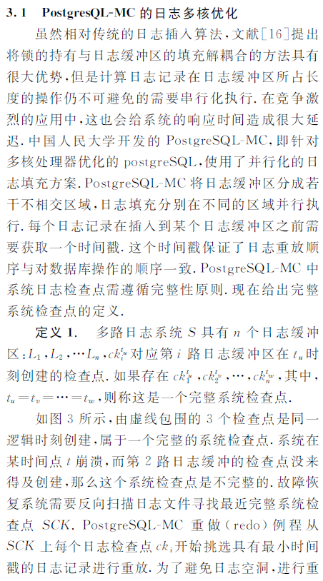
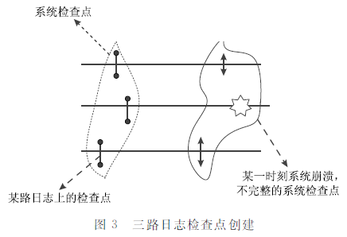
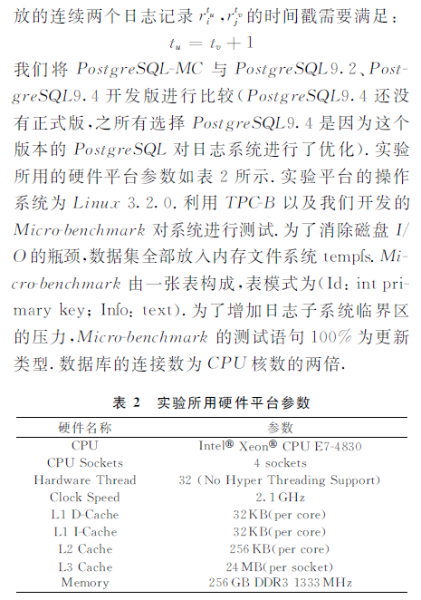
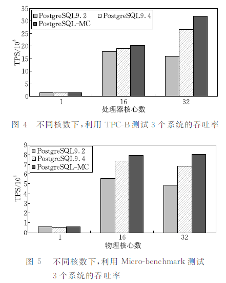
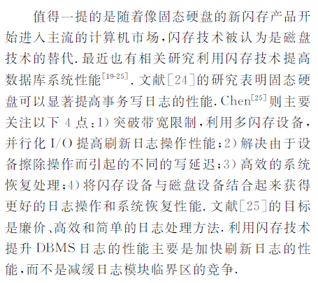

## PostgreSQL 多路并行 xlog 设计  
                      
### 作者                     
digoal                      
                      
### 日期                    
2016-08-15                       
                      
### 标签                    
PostgreSQL , wal , xlog , redo , 并行        
                      
----                    
                      
## 背景           
本文截取自《多核处理器下事务型数据库性能优化技术综述》  
  
http://www.cnki.com.cn/Article/CJFDTotal-JSJX201509012.htm  
  
数据库的redo记录了事务的重做信息，它最重要的功能之一是用来恢复数据库，例如当数据库crash后，需要从数据库的一致检查点开始，读取redo并回放。  
  
为了保证事务回放的先后顺序，XLOG是串行的，所以写XLOG时也需要锁的。  
  
为了提高写性能，PostgreSQL使用了xlog buffer来缓解写压力。  
  
在使用了xlog buffer或者XLOG使用了SSD硬盘后，串行的写可能会成为瓶颈。  
  
本文旨在研究多路并行XLOG的实现，从而减少不必要的等待，提高写的吞吐率。  
  
  
  
  
  
  
  
  
  
  
  
  
  
当使用了多路XLOG后，不同路数的XLOG相互之间是没有锁竞争的，大大提高了XLOG的写并发。  
  
同时，为了保证XLOG回放时的先后顺序，每一笔XLOG都需要申请一个时间戳，并写入XLOG文件中，回放时严格按照时间戳顺序来回放。  
  
对于检查点的创建，多路XLOG都必须完成检查点的创建，才是一个有效的检查点。  
  
从测试结果来看，使用多路XLOG的话，测试并行度越高，性能表现相比没有XLOG并行的越好。  
  
  
  
  
  
  
  
  
  
  
  
  
  
  
  
  
  
  
  
  
  
  
  
  
  
  
  
  
  
  
  
  
  
  
  
  
  
  
  
  
  
  
  
  
  
  
  
  
  
  
  
  
  
  
  
  
  
  
  
  
  
  
  
  
  
  
  
  
  
  
  
  
  
  
#### [PostgreSQL 许愿链接](https://github.com/digoal/blog/issues/76 "269ac3d1c492e938c0191101c7238216")
您的愿望将传达给PG kernel hacker、数据库厂商等, 帮助提高数据库产品质量和功能, 说不定下一个PG版本就有您提出的功能点. 针对非常好的提议，奖励限量版PG文化衫、纪念品、贴纸、PG热门书籍等，奖品丰富，快来许愿。[开不开森](https://github.com/digoal/blog/issues/76 "269ac3d1c492e938c0191101c7238216").  
  
  
#### [9.9元购买3个月阿里云RDS PostgreSQL实例](https://www.aliyun.com/database/postgresqlactivity "57258f76c37864c6e6d23383d05714ea")
  
  
#### [PostgreSQL 解决方案集合](https://yq.aliyun.com/topic/118 "40cff096e9ed7122c512b35d8561d9c8")
  
  
#### [德哥 / digoal's github - 公益是一辈子的事.](https://github.com/digoal/blog/blob/master/README.md "22709685feb7cab07d30f30387f0a9ae")
  
  

  
  
#### [PolarDB 学习图谱: 训练营、培训认证、在线互动实验、解决方案、生态合作、写心得拿奖品](https://www.aliyun.com/database/openpolardb/activity "8642f60e04ed0c814bf9cb9677976bd4")
  
  
#### [购买PolarDB云服务折扣活动进行中, 55元起](https://www.aliyun.com/activity/new/polardb-yunparter?userCode=bsb3t4al "e0495c413bedacabb75ff1e880be465a")
  
  
#### [About 德哥](https://github.com/digoal/blog/blob/master/me/readme.md "a37735981e7704886ffd590565582dd0")
  
