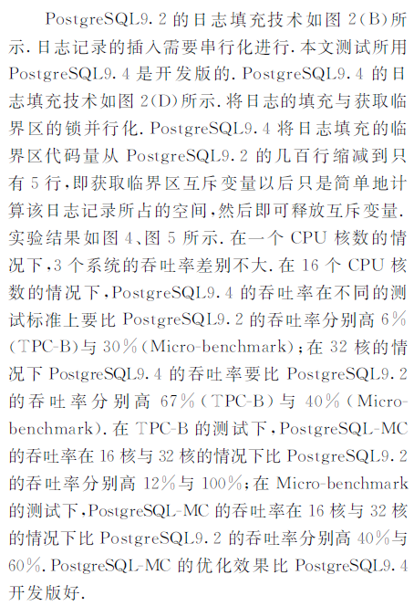

## PostgreSQL 多路并行 xlog 设计  
                      
### 作者                     
digoal                      
                      
### 日期                    
2016-08-15                       
                      
### 标签                    
PostgreSQL , wal , xlog , redo , 并行        
                      
----                    
                      
## 背景           
本文截取自《多核处理器下事务型数据库性能优化技术综述》  
  
http://www.cnki.com.cn/Article/CJFDTotal-JSJX201509012.htm  
  
数据库的redo记录了事务的重做信息，它最重要的功能之一是用来恢复数据库，例如当数据库crash后，需要从数据库的一致检查点开始，读取redo并回放。  
  
为了保证事务回放的先后顺序，XLOG是串行的，所以写XLOG时也需要锁的。  
  
为了提高写性能，PostgreSQL使用了xlog buffer来缓解写压力。  
  
在使用了xlog buffer或者XLOG使用了SSD硬盘后，串行的写可能会成为瓶颈。  
  
本文旨在研究多路并行XLOG的实现，从而减少不必要的等待，提高写的吞吐率。  
  
  
  
  
  
  
  
  
  
  
  
  
  
当使用了多路XLOG后，不同路数的XLOG相互之间是没有锁竞争的，大大提高了XLOG的写并发。  
  
同时，为了保证XLOG回放时的先后顺序，每一笔XLOG都需要申请一个时间戳，并写入XLOG文件中，回放时严格按照时间戳顺序来回放。  
  
对于检查点的创建，多路XLOG都必须完成检查点的创建，才是一个有效的检查点。  
  
从测试结果来看，使用多路XLOG的话，测试并行度越高，性能表现相比没有XLOG并行的越好。  
  
  
  
  
  
  
  
  
  
## [digoal's 大量PostgreSQL文章入口](https://github.com/digoal/blog/blob/master/README.md "22709685feb7cab07d30f30387f0a9ae")
  
