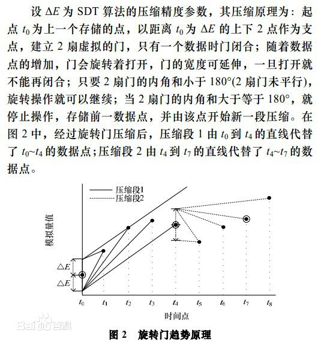
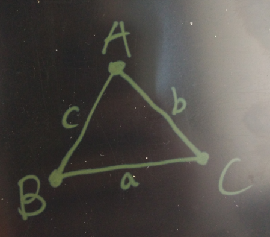
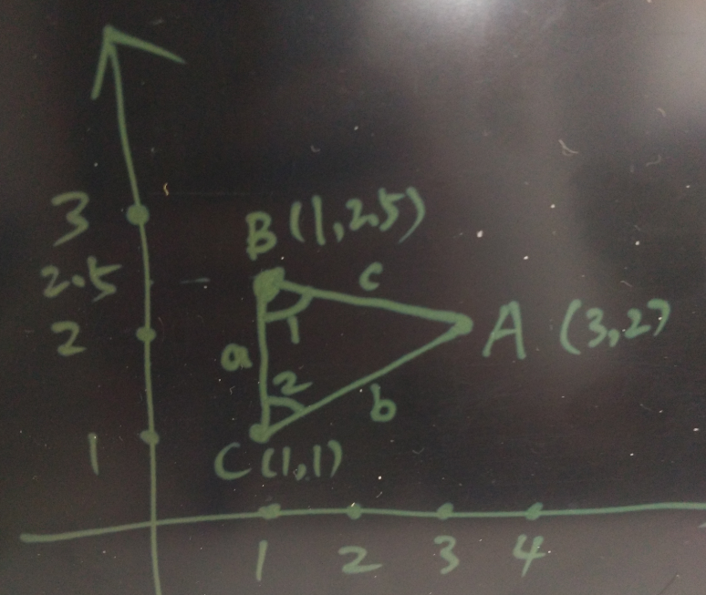

## PostgreSQL 三角函数的用法举例 - 已知3点求任意夹角（旋转门续）  
                                                                                              
### 作者                                                                                                  
digoal                                                                                                  
                                                                                              
### 日期                                                                                                  
2016-08-16                                                                                             
                                                                                              
### 标签                                                                                                  
PostgreSQL , 旋转门压缩 , 三角函数 , 物联网                             
                                                                                              
----                                                                                                  
                                                                                              
## 背景  
前几天写了一篇关于旋转门的数据压缩算法在PostgreSQL中的实现，里面用到了PostGIS里面的ST_Azimuth函数用来计算夹角，其实在PostgreSQL 中，我们还可以使用三角函数，以及三边来求夹角。    
    
https://yq.aliyun.com/articles/59101    
    
    
    
文中用到的计算夹角的方法如下    
    
```  
      SELECT 180-ST_Azimuth(  
                              ST_MakePoint(o_x, o_val+i_radius),    -- 门上点  
                              ST_MakePoint(v_x, v_val)              -- next point  
                           )/(2*pi())*360 as degAz,                 -- 上夹角  
                 ST_Azimuth(  
                              ST_MakePoint(o_x, o_val-i_radius),    -- 门下点  
                              ST_MakePoint(v_x, v_val)              -- next point  
                           )/(2*pi())*360 As degAzrev               -- 下夹角  
      INTO v_angle1, v_angle2;   
```  
    
## 余弦定理   
**cosA=(b²+c²-a²)/(2bc)**     
    
    
    
定点为A、B、C；  对的边分别为a、b、c；      
    
## PostgreSQL 支持的三角函数  
https://www.postgresql.org/docs/9.6/static/functions-math.html    
      
Function (radians)	| Function (degrees)	| Description  
---|---|---  
acos(x)	| acosd(x)	| inverse cosine  
asin(x)	| asind(x)	| inverse sine  
atan(x)	| atand(x)	| inverse tangent  
atan2(y, x)	| atan2d(y, x)	| inverse tangent of y/x  
cos(x)	| cosd(x)	| cosine  
cot(x)	| cotd(x)	| cotangent  
sin(x)	| sind(x)	| sine  
tan(x)	| tand(x)	| tangent  
      
## 例子    
已知三个点A(3,2)，B(1,2.5)，C(1,1)。  求夹角B, C。     
       
  
       
套用余弦公式      
  
```  
cosB=(a²+c²-b²)/(2ac)     
    
cosC=(b²+a²-c²)/(2ba)       
```  
    
首先求三条边长    
  
```  
postgres=# select point_distance(point(3,2), point(1,2.5)) as c , point_distance(point(3,2), point(1,1)) as b , point_distance(point(1,1), point(1,2.5)) as a;  
        c         |        b         |  a    
------------------+------------------+-----  
 2.06155281280883 | 2.23606797749979 | 1.5  
(1 row)    
```  
    
运算如下    
  
```  
cosB=(a²+c²-b²)/(2ac)        
=(1.5^2 + 2.06155281280883^2 - 2.23606797749979^2) / (2*1.5*2.06155281280883)    
=0.24253562503633260164    
    
cosC=(b²+a²-c²)/(2ba)       
=(1.5^2 + 2.23606797749979^2 - 2.06155281280883^2) / (2*2.23606797749979*1.5)    
=0.44721359549995825124    
```  
    
求夹角  1  度数    
  
```  
postgres=# select acosd(0.24253562503633260164);  
      acosd         
------------------  
 75.9637565320735  
(1 row)  
```  
    
求夹角  2  度数    
  
```  
postgres=# select acosd(0.44721359549995825124);  
      acosd        
-----------------  
 63.434948822922  
(1 row)  
```  
    
比对使用PostGIS计算的结果一致      
  
```  
test=>  SELECT 180-ST_Azimuth(  
                              ST_MakePoint(1,2.5),    -- 门上点  
                              ST_MakePoint(3,2)              -- next point  
                           )/(2*pi())*360 as degAz,          -- 上夹角  
                 ST_Azimuth(  
                              ST_MakePoint(1,1),      -- 门下点  
                              ST_MakePoint(3,2)              -- next point  
                           )/(2*pi())*360 As degAzrev ;  
      degaz       |    degazrev       
------------------+-----------------  
 75.9637565320735 | 63.434948822922  
(1 row)  
```  
     
## 源码  
三角函数属于浮点运算中的函数    
    
src/backend/utils/adt/float.c    
  
```  
/*  
 *              acosd_q1                - returns the inverse cosine of x in degrees, for x in  
 *                                                the range [0, 1].  The result is an angle in the  
 *                                                first quadrant --- [0, 90] degrees.  
 *  
 *                                                For the 3 special case inputs (0, 0.5 and 1), this  
 *                                                function will return exact values (0, 60 and 90  
 *                                                degrees respectively).  
 */  
static double  
acosd_q1(double x)  
{  
        /*  
         * Stitch together inverse sine and cosine functions for the ranges [0,  
         * 0.5] and (0.5, 1].  Each expression below is guaranteed to return  
         * exactly 60 for x=0.5, so the result is a continuous monotonic function  
         * over the full range.  
         */  
        if (x <= 0.5)  
        {  
                volatile float8 asin_x = asin(x);  
  
                return 90.0 - (asin_x / asin_0_5) * 30.0;  
        }  
        else  
        {  
                volatile float8 acos_x = acos(x);  
  
                return (acos_x / acos_0_5) * 60.0;  
        }  
}  
  
  
/*  
 *              dacosd                  - returns the arccos of arg1 (degrees)  
 */  
Datum  
dacosd(PG_FUNCTION_ARGS)  
{  
        float8          arg1 = PG_GETARG_FLOAT8(0);  
        float8          result;  
  
        /* Per the POSIX spec, return NaN if the input is NaN */  
        if (isnan(arg1))  
                PG_RETURN_FLOAT8(get_float8_nan());  
  
        INIT_DEGREE_CONSTANTS();  
  
        /*  
         * The principal branch of the inverse cosine function maps values in the  
         * range [-1, 1] to values in the range [0, 180], so we should reject any  
         * inputs outside that range and the result will always be finite.  
         */  
        if (arg1 < -1.0 || arg1 > 1.0)  
                ereport(ERROR,  
                                (errcode(ERRCODE_NUMERIC_VALUE_OUT_OF_RANGE),  
                                 errmsg("input is out of range")));  
  
        if (arg1 >= 0.0)  
                result = acosd_q1(arg1);  
        else  
                result = 90.0 + asind_q1(-arg1);  
  
        CHECKFLOATVAL(result, false, true);  
        PG_RETURN_FLOAT8(result);  
}  
```  
     
```  
man asin   
NAME  
       asin, asinf, asinl - arc sine function  
  
SYNOPSIS  
       #include <math.h>  
  
       double asin(double x);  
       float asinf(float x);  
       long double asinl(long double x);  
  
///  
  
CONFORMING TO  
       C99, POSIX.1-2001.  The variant returning double also conforms to SVr4, 4.3BSD, C89.  
  
SEE ALSO  
       acos(3), atan(3), atan2(3), casin(3), cos(3), sin(3), tan(3)  
```  
   
将这个功能函数化，如下，这样就能方便的计算夹角的度数了：  
  
```
create or replace function angle (a point, b point, c point, d int) returns float8 as $$
declare
  ab float8 := point_distance(a, b); 
  ac float8 := point_distance(a, c); 
  bc float8 := point_distance(b, c); 
  cosa float8 := (ac^2 + ab^2 - bc^2) / (2*ac*ab);
  cosb float8 := (bc^2 + ab^2 - ac^2) / (2*bc*ab);
  cosc float8 := (ac^2 + bc^2 - ab^2) / (2*ac*bc);
begin
  -- raise notice '%,%,%,  %,%,%', ab, ac, bc, cosa, cosb, cosc;
  case d
    when 1 then return acosd(cosa);  -- 第一个参数点为夹角顶点
    when 2 then return acosd(cosb);  -- 第二个参数点为夹角顶点
    when 3 then return acosd(cosc);  -- 第三个参数点为夹角顶点
    else return null;
  end case;
end;
$$ language plpgsql strict immutable;


postgres=# select angle(point(3,2), point(1,2.5), point(1,1), 1);
NOTICE:  00000: 2.06155281280883,2.23606797749979,1.5,  0.759256602365297,0.242535625036333,0.447213595499958
LOCATION:  exec_stmt_raise, pl_exec.c:3337
      angle       
------------------
 40.6012946450045
(1 row)

postgres=# select angle(point(3,2), point(1,2.5), point(1,1), 2);
NOTICE:  00000: 2.06155281280883,2.23606797749979,1.5,  0.759256602365297,0.242535625036333,0.447213595499958
LOCATION:  exec_stmt_raise, pl_exec.c:3337
      angle       
------------------
 75.9637565320735
(1 row)

postgres=# select angle(point(3,2), point(1,2.5), point(1,1), 3);
NOTICE:  00000: 2.06155281280883,2.23606797749979,1.5,  0.759256602365297,0.242535625036333,0.447213595499958
LOCATION:  exec_stmt_raise, pl_exec.c:3337
      angle      
-----------------
 63.434948822922
(1 row)
```
    
祝大家玩得开心，欢迎随时来 **阿里云促膝长谈业务需求 ，恭候光临**。    
    
阿里云的小伙伴们加油，努力 **做好内核与服务，打造最贴地气的云数据库** 。    
    
                                                                                              
                                                
                                            
  
<a rel="nofollow" href="http://info.flagcounter.com/h9V1"  ></a>  
  
  
  
  
  
  
## [digoal's 大量PostgreSQL文章入口](https://github.com/digoal/blog/blob/master/README.md "22709685feb7cab07d30f30387f0a9ae")
  
