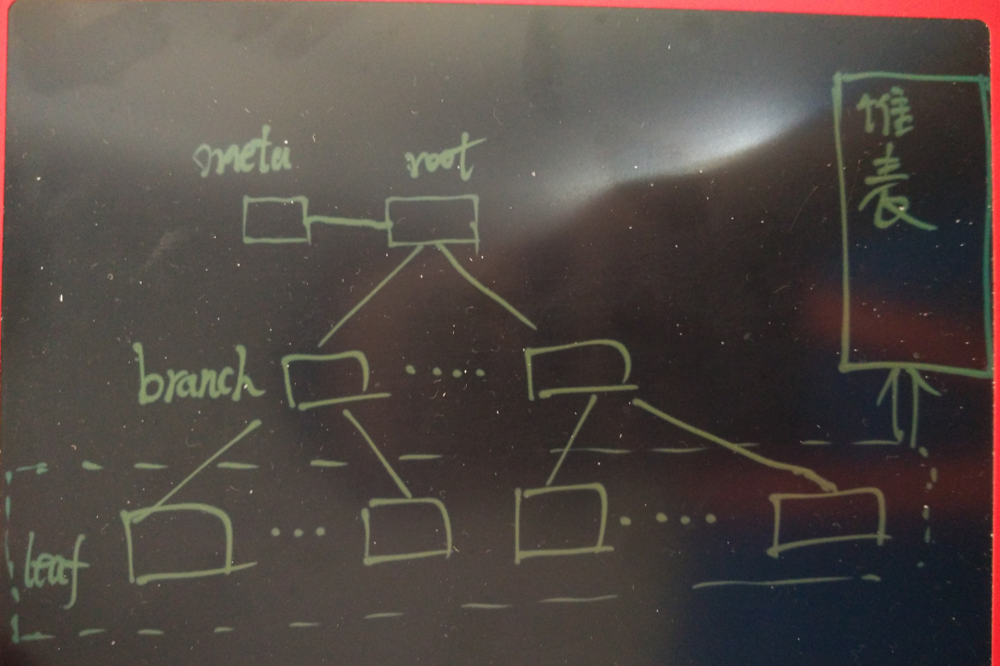

## 如何评估QUERY的响应时间？       
                                                                                                                
### 作者                                                                                                               
digoal                                                                                                                
                                                                                                                
### 日期                                                                                                              
2016-08-17                       
                                                                                                                
### 标签                                                                                                              
PostgreSQL , 如何评估QUERY的响应时间 , 进度条                                                
                                                  
----                                                                                                              
                                                      
## 背景          
如何评估QUERY的响应时间？    
    
需要买什么样的硬件能满足为了业务XXX的需求？    
    
这种问题在企业中非常常见，但是估计大多数是拍脑袋的回复，做得更好点，可能是根据业务的benchmark提供的数据，给一个拍脑袋的决定。    
    
本文将针对数据库的QUERY展开，看看应该如何正确的评估QUERY的响应时间。    
    
## 从执行计划谈起  
对于数据库来说，比如PostgreSQL，支持非常多的access method，以及非常多的运算路径和方法。    
    
每种方法或路径都有对应的成本评估算法。    
    
算法可参考    
  
src/backend/optimizer/path/costsize.c    
    
不同的path，算法不同，算法中的因子也各不相同。    
    
例如，全表扫描path，成本取决于需要扫描的块的多少，扫描每个块的成本；以及需要获取的记录数的多少，获取每条记录需要消耗的成本是多少。    
    
评估QUERY的响应时间，与数据库优化器评估COST的道理是想通的。    
    
你可以参考一下文档，planner如何使用统计信息评估path成本，里面有很多例子。     
  
https://www.postgresql.org/docs/9.5/static/planner-stats-details.html    
    
## 场景引入  
一张业务表有15个字段，平均行长度为100字节，其中有一个PK字段为INT类型，当数据量达到10000亿时，使用PK查询1条记录需要多久的响应时间？    
    
这个场景其实蛮简单的，就是基于PK的查询。    
    
执行计划也很简单    
  
```  
postgres=# create table tt1(id int primary key, c1 text, c2 text, c3 int, c4 int, c5 timestamp, c6 inet, c7 int4range, c8 point, c9 float8, c10 tsvector, c11 tsquery, c12 line, c13 box, c14 int[], c15 interval);   
CREATE TABLE  
  
postgres=# explain select * from tt1 where id=1;  
                              QUERY PLAN                                
----------------------------------------------------------------------  
 Index Scan using tt1_pkey on tt1  (cost=0.14..8.16 rows=1 width=340)  
   Index Cond: (id = 1)  
(2 rows)  
```  
    
按照索引扫描的path，成本分为  
  
* 扫描索引块的成本  
  
* 扫描HEAP块的成本  
  
* 索引 get tuple cpu成本  
  
* heap get tuple cpu成本  
    
基于PK的扫描，相比IO的成本，cpu的成本几乎可以忽略。    
    
所以我们只需要评估出需要扫描多少个数据块，就可以大致评估出QUERY需要多长时间。    
    
以b-tree索引扫描为例，如下    
  
  
      
B-Tree和B+Tree      
  
https://yq.aliyun.com/articles/54437      
    
深入浅出PostgreSQL B-Tree索引结构      
  
https://yq.aliyun.com/articles/53701        
      
## b-tree索引扫描开销评估  
1\. 评估单个索引页的item数  
  
  b-tree索引页，除了固定的头和尾部信息，剩下的就是value+ctid。     
    
  ctid为6个字节，value则由列的类型决定。      
  
  例如int类型的索引，一个索引条目的大小=4+6=10字节，每个条目还需要加上一些条目的head。      
  
  一个8K的数据块，除掉头部和尾部，可能能存下约400个条目。    
    
2\. 评估索引深度    
  
  一个页的索引条目数固定了之后，就可以算出每个深度最多能支持的记录数了。    
  
  以上面case为例，  只有root page的索引，只能存下400条。    
  
  2级索引则能存下400^2 的记录数。    
  
  以此类推。    
    
3\. 评估索引扫描的扫描块数    
  
  如果是PK查询，索引扫描要扫描的块数=metapage + level + heap page.    
  
  例如深入为2的索引，需要扫描4个块。    
    
4\. 评估时间  
  
  因为索引都是离散的块，离散扫描的时延完全由块设备决定。    
  
  例如机械盘的时延约等于8毫秒，扫描4个块就是32毫秒。    
  
  SSD的扫描时延相比机械盘则很低。    
    
## 例子  
回到前面的场景, 一张业务表有15个字段，平均行长度为100字节，其中有一个PK字段为INT类型，当数据量达到1万亿时，使用PK查询1条记录需要多久的响应时间？      
      
```  
postgres=# create table tt1(id int primary key, c1 text, c2 text, c3 int, c4 int, c5 timestamp, c6 inet, c7 int4range, c8 point, c9 float8, c10 tsvector, c11 tsquery, c12 line, c13 box, c14 int[], c15 interval);   
CREATE TABLE  
```  
    
评估索引层级    
  
```  
postgres=# select 400^5 > 1000000000000;  
 ?column?   
----------  
 t  
(1 row)  
    
postgres=# select 400^4 > 1000000000000;  
 ?column?   
----------  
 f  
(1 row)  
```  
    
8KB 的块，5级索引即可满足 **1万亿** 的记录数。    
  
即使为机械盘，这类扫描的成本也只需要56毫秒。    
    
如果考虑分区表，假设每1000万一个分区，则只需要3级索引，40毫秒可以满足需求。    
  
```  
postgres=# select 400^2 > 10000000;  
 ?column?   
----------  
 f  
(1 row)  
  
postgres=# select 400^3 > 10000000;  
 ?column?   
----------  
 t  
(1 row)  
```  
    
其他的QUERY，同样也需要从执行计划入手，评估出需要扫描的记录数，以及需要扫描多少数据块。  从而推算出需要的时间。    
      
可能还有人会问，为什么评估出来的QUERY只需要几十毫秒，但是在生产中需要秒级返回？    
    
因为前面的评估是不考虑并发的，考虑并发的情况下，就会遇到资源争抢的问题，例如机械盘提供的IOPS有限，遇到争抢，等待的时间也要算上去。  并发达到100时，有些QUERY可能就要等待上秒的时间了。    
    
所以对于活跃数据非常庞大，又需要低延迟响应的场景，还是考虑SSD吧。    
    
## 补充  
对于B+tree, 如innodb引擎，因为数据和索引值是在一棵树里面的，虽然只在最下面一层存储，但是也不可避免的造成一个PAGE存储的条目更加有限，比如一条记录500字节，8K的块最多能存储10几条记录，这样的话1万亿需要7级索引。  前5级存储400每页，最后一级存储18每页。   
  
访问7个数据块，定位到一条记录。    
    
祝大家玩得开心，欢迎随时来 **阿里云促膝长谈业务需求 ，恭候光临**。    
    
阿里云的小伙伴们加油，努力 **做好内核与服务，打造最贴地气的云数据库** 。    
      
                         
                                                
                                                        
                    
  
<a rel="nofollow" href="http://info.flagcounter.com/h9V1"  ></a>  
  
  
  
  
  
  
## [digoal's 大量PostgreSQL文章入口](https://github.com/digoal/blog/blob/master/README.md "22709685feb7cab07d30f30387f0a9ae")
  
