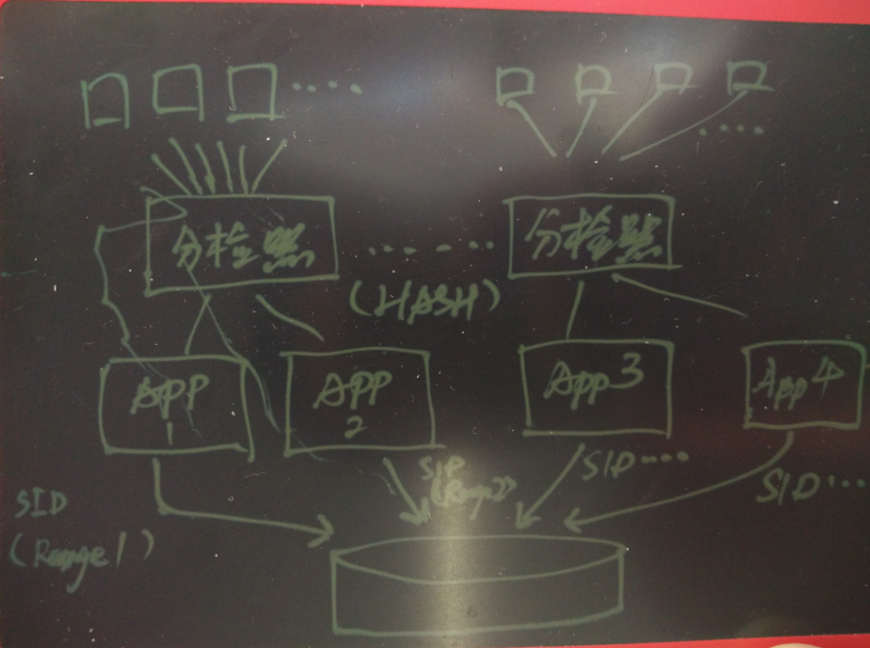
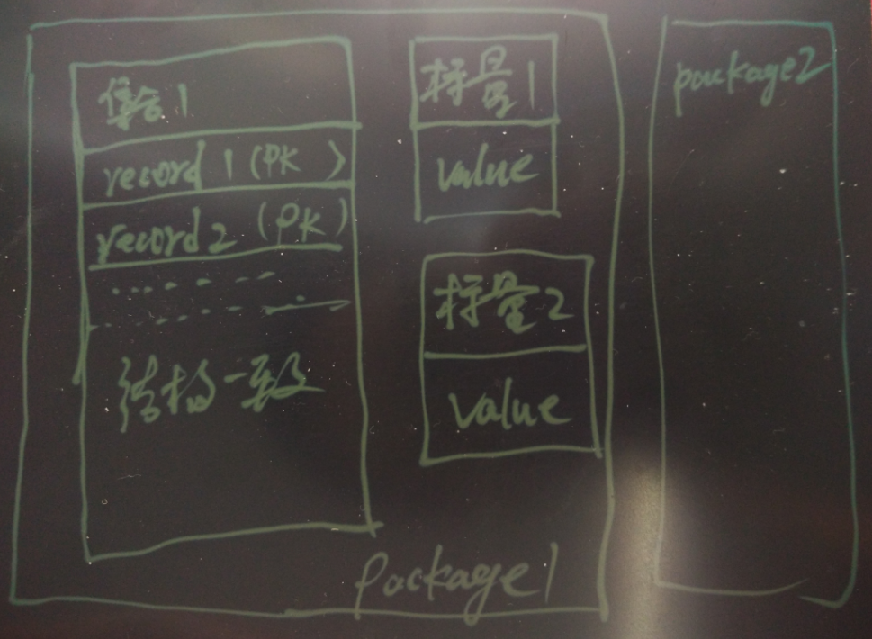

## PostgreSQL 内存表   
                                                                                                    
### 作者                                                                                                        
digoal                                                                                                        
                                                                                                    
### 日期                                                                                                        
2016-08-18                                                                                                   
                                                                                                    
### 标签                                                                                                        
PostgreSQL , 内存表 , 会话级内存表 , pg_variables                             
                                                                                                    
----                                                                                                        
             
## 背景    
在某些场景，要求快速的DML，并且对数据可靠性要求不是非常高。    
      
例如游戏的会话信息，传感器上传的最新数据，运算的中间结果，等等。    
  
    
  
例如在一个场景中，有非常多的传感器的数据要不断的被更新和查询，可以使用这种方法，每个传感器的ID哈希后分配给对应的会话，这个传感器。    
      
上面的需求，PostgreSQL 临时表都能满足。    
      
但是临时表也存在一定的限制或弊端。    
      
临时表为会话级内存表，跨会话不共享数据和结构，不写REDO。    
  
超过一定大小时会落盘，不是纯内存的。     
  
同时临时表继承了普通表的多版本，但是实际上会话级不需要多版本。     
  
会话断开需要重建临时表结构。    
      
虽然现在的SSD IO能力很强，但是与内存还有一定的插件，同时SSD 擦写次数受限，所以临时表或者普通表难以满足本文开头提到的场景需求。    
    
Oracle 12C 推出列存储内存表，但是它是基于OLAP的应用场景，并不适合本文开头提到的场景。      
    
PostgreSQL 社区也在考虑增加内存表的功能，本文是一个引子，可以看到社区在这方面的努力。    
    
## PostgreSQL内存表之路  
在postgrespro发表的postgres roadmap中，可以看到，他们正在搞热插拔的存储引擎。    
    
https://wiki.postgresql.org/wiki/Postgres_Professional_roadmap    
    
Pluggable storages    
  
```  
We achieved a significant progress in PostgreSQL extendability:   
  FDWs, custom access methods, generic WAL. And we're not so far from having pluggable storage engines.   
  Concept of API will be presented at PGCon.  
  
We are planning to implement the following types of storage engines:  
  
In-memory row-oriented storage engine with optional support of transactions and optional support of persistency;  
Columnar storage engine;  
In-memory columnar storage engine;  
On-disk row-oriented storage engine with undo-log for better bloat control.  
```  
    
行式内存引擎、列式内存引擎、列存磁盘存储引擎、以及回滚段模式的行式磁盘存储引擎。    
    
目前还没有看到代码方面的输出，但是在postgrespro的项目里有一个与内存表非常类似的项目，会话级变量。    
    
数据保存在内存中，目前支持如下操作    
  
https://github.com/postgrespro/pg_variables    
    
操作看起来是不是有点像redis呢?    
    
### Integer variables  
    
Function | Returns  
-------- | -------  
`pgv_set_int(package text, name text, value int)` | `void`  
`pgv_get_int(package text, name text, strict bool default true)` | `int`  
    
### Text variables  
    
Function | Returns  
-------- | -------  
`pgv_set_text(package text, name text, value text)` | `void`  
`pgv_get_text(package text, name text, strict bool default true)` | `text`  
    
### Numeric variables  
    
Function | Returns  
-------- | -------  
`pgv_set_numeric(package text, name text, value numeric)` | `void`  
`pgv_get_numeric(package text, name text, strict bool default true)` | `numeric`  
    
### Timestamp variables  
    
Function | Returns  
-------- | -------  
`pgv_set_timestamp(package text, name text, value timestamp)` | `void`  
`pgv_get_timestamp(package text, name text, strict bool default true)` | `timestamp`  
    
### Timestamp with timezone variables  
    
Function | Returns  
-------- | -------  
`pgv_set_timestamptz(package text, name text, value timestamptz)` | `void`  
`pgv_get_timestamptz(package text, name text, strict bool default true)` | `timestamptz`  
    
### Date variables  
    
Function | Returns  
-------- | -------  
`pgv_set_date(package text, name text, value date)` | `void`  
`pgv_get_date(package text, name text, strict bool default true)` | `date`  
    
### Jsonb variables  
    
Function | Returns  
-------- | -------  
`pgv_set_jsonb(package text, name text, value jsonb)` | `void`  
`pgv_get_jsonb(package text, name text, strict bool default true)` | `jsonb`  
    
同样支持集合哦    
    
### Records  
    
The following functions are provided by the module to work with collections of record types.    
    
To use **pgv_update()**, **pgv_delete()** and **pgv_select()** functions required package and variable must exists.     
Otherwise the error will be raised.      
It is necessary to set variable with **pgv_insert()** function to use these functions.      
    
**pgv_update()**, **pgv_delete()** and **pgv_select()** functions check the variable type.     
If the variable type does not **record** type the error will be raised.    
    
Function | Returns | Description  
-------- | ------- | -----------  
`pgv_insert(package text, name text, r record)` | `void` | Inserts a record to the variable collection. If package and variable do not exists they will be created. The first column of **r** will be a primary key. If exists a record with the same primary key the error will be raised. If this variable collection has other structure the error will be raised.  
`pgv_update(package text, name text, r record)` | `boolean` | Updates a record with the corresponding primary key (the first column of **r** is a primary key). Returns **true** if a record was found. If this variable collection has other structure the error will be raised.  
`pgv_delete(package text, name text, value anynonarray)` | `boolean` | Deletes a record with the corresponding primary key (the first column of **r** is a primary key). Returns **true** if a record was found.  
`pgv_select(package text, name text)` | `set of record` | Returns the variable collection records.  
`pgv_select(package text, name text, value anynonarray)` | `record` | Returns the record with the corresponding primary key (the first column of **r** is a primary key).  
`pgv_select(package text, name text, value anyarray)` | `set of record` | Returns the variable collection records with the corresponding primary keys (the first column of **r** is a primary key).  
    
下面更像redis了    
    
### Miscellaneous functions  
    
Function | Returns | Description  
-------- | ------- | -----------  
`pgv_exists(package text, name text)` | `bool` | Returns **true** if package and variable exists.  
`pgv_remove(package text, name text)` | `void` | Removes the variable with the corresponding name. Required package and variable must exists, otherwise the error will be raised.  
`pgv_remove(package text)` | `void` | Removes the package and all package variables with the corresponding name. Required package must exists, otherwise the error will be raised.  
`pgv_free()` | `void` | Removes all packages and variables.  
`pgv_list()` | `table(package text, name text)` | Returns set of records of assigned packages and variables.  
`pgv_stats()` | `table(package text, used_memory bigint)` | Returns list of assigned packages and used memory in bytes.  
      
Note that **pgv_stats()** works only with the PostgreSQL 9.6 and newer.    
        
目前数据仅支持会话级，会话断开则自动释放，期待真正的内存表引擎吧，这只是个引子。    
    
### 存储逻辑结构  
  
    
### 术语  
package : 包名  
name :    变量名  
value :   标量类型的值  
r :       集合类型的单条记录  
pk :      集合类型的主键  
      
## 测试  
### 安装内存表插件    
```  
export PATH=/home/digoal/pgsql9.6/bin:$PATH  
  
git clone https://github.com/postgrespro/pg_variables  
  
cd pg_variables/  
  
make USE_PGXS=1  
  
make USE_PGXS=1 install  
  
make USE_PGXS=1 installcheck  
  
postgres=# create extension pg_variables;  
CREATE EXTENSION  
```  
    
### 标量测试    
```  
postgres=# select pgv_set_int('pkg1','k1',100);  
 pgv_set_int   
-------------  
   
(1 row)  
  
postgres=# select pgv_get_int('pkg1','k1');  
 pgv_get_int   
-------------  
         100  
(1 row)  
  
postgres=# select pgv_set_jsonb('pkg1','k2','{"a":"b", "c":{"hello":"digoal"}}');  
 pgv_set_jsonb   
---------------  
   
(1 row)  
  
postgres=# select pgv_get_jsonb('pkg1','k2');  
            pgv_get_jsonb               
--------------------------------------  
 {"a": "b", "c": {"hello": "digoal"}}  
(1 row)  
```  
    
更新与自增用法    
  
```  
postgres=# select pgv_set_int(pkg,k, pgv_get_int(pkg,k)+1 ) from (values ('pkg1','k1')) t(pkg,k);  
 pgv_set_int   
-------------  
   
(1 row)  
  
postgres=# select pgv_get_int('pkg1','k1');  
 pgv_get_int   
-------------  
         102  
(1 row)  
  
postgres=# select pgv_set_int(pkg,k, pgv_get_int(pkg,k)+1 ) from (values ('pkg1','k1')) t(pkg,k);  
 pgv_set_int   
-------------  
   
(1 row)  
  
postgres=# select pgv_get_int('pkg1','k1');  
 pgv_get_int   
-------------  
         103  
(1 row)  
```  
    
性能，每秒标量更新达到了239万次。      
  
```  
postgres=# select count(*) from (select pgv_set_int('pkg1','k1',id) from generate_series(1,10000000) t(id) ) t;  
  count     
----------  
 10000000  
(1 row)  
Time: 4185.179 ms  
  
postgres=# select pgv_get_int('pkg1','k1');  
 pgv_get_int   
-------------  
    10000000  
(1 row)  
Time: 0.470 ms  
  
postgres=# select 10000000/4.185;  
       ?column?         
----------------------  
 2389486.260454002389  
(1 row)  
Time: 0.869 ms  
```  
    
### 集合测试    
```  
postgres=# select pgv_insert('pkg2', 'k1', row(1::int, 'hello world'::text, current_date::date));  
 pgv_insert   
------------  
   
(1 row)  
  
postgres=# select * from pgv_select('pkg2', 'k1') as t(c1 int,c2 text,c3 date);  
 c1 |     c2      |     c3       
----+-------------+------------  
  1 | hello world | 2016-08-18  
(1 row)  
  
postgres=# select count(*) from (select pgv_insert('pkg2', 'k1', row(c1,'test'::text,current_date::date)) from generate_series(2,100000) t(c1)) t;  
 count   
-------  
 99999  
(1 row)  
  
postgres=# select * from pgv_select('pkg2', 'k1', array[1,2,3]) as t(c1 int,c2 text,c3 date);  
 c1 |     c2      |     c3       
----+-------------+------------  
  1 | hello world | 2016-08-18  
  2 | test        | 2016-08-18  
  3 | test        | 2016-08-18  
(3 rows)  
```  
    
内存表和普通表的JOIN    
  
```  
postgres=# select t1.*,t2.* from (select * from pgv_select('pkg2', 'k1') as t(c1 int,c2 text,c3 date)) t1, tbl1 t2 where t1.c1=t2.id and t2.id<10;  
 c1 |     c2      |     c3     | id |               info                 
----+-------------+------------+----+----------------------------------  
  8 | test        | 2016-08-18 |  8 | a8a7e0f849c5895820bbca32d7e798b1  
  4 | test        | 2016-08-18 |  4 | f6954fb12336881d590fa7a50dd03916  
  9 | test        | 2016-08-18 |  9 | 45ff843fcd5372e525368829f9846def  
  5 | test        | 2016-08-18 |  5 | d8afe53f0a7d553716caa9ffaef7ea3d  
  7 | test        | 2016-08-18 |  7 | 2b20f485974500d7b3ecb1f4c1d0f975  
  2 | test        | 2016-08-18 |  2 | 3d36418926b2e0e2dc7090da17e39451  
  6 | test        | 2016-08-18 |  6 | 6923416bbca7634f01f7f79030609f64  
  1 | hello world | 2016-08-18 |  1 | 3bb6c833f1b10139edf7e2f2eb4f4a69  
  3 | test        | 2016-08-18 |  3 | de5b51374e1db3ccac9c61af75b69a33  
(9 rows)  
```  
    
更新与删除内存表的数据    
  
```  
postgres=# select pgv_update('pkg2', 'k1', t) from (select c1,'new val'::text,'2017-01-01'::date from pgv_select('pkg2', 'k1', 1) as tb(c1 int, c2 text, c3 date)) t;  
 pgv_update   
------------  
 t  
(1 row)  
  
Time: 0.665 ms  
  
postgres=# select * from pgv_select('pkg2', 'k1', 1) as tb(c1 int, c2 text, c3 date);  
 c1 |   c2    |     c3       
----+---------+------------  
  1 | new val | 2017-01-01  
(1 row)  
  
Time: 0.518 ms  
  
postgres=# select  pgv_delete('pkg2', 'k1', 1);  
 pgv_delete   
------------  
 t  
(1 row)  
  
Time: 0.440 ms  
```  
    
## 管理内存对象    
```  
postgres=# select * from pgv_exists('pkg1','k1');  
 pgv_exists   
------------  
 f  
(1 row)  
  
Time: 0.491 ms  
  
postgres=# select pgv_list();  
 pgv_list    
-----------  
 (pkg2,k1)  
(1 row)  
  
Time: 0.455 ms  
  
postgres=# select pgv_stats();  
    pgv_stats      
-----------------  
 (pkg2,16785408)  
(1 row)  
  
Time: 0.514 ms  
  
postgres=# select pgv_remove('pkg2','k1');  
 pgv_remove   
------------  
   
(1 row)  
  
Time: 1.868 ms  
postgres=# select pgv_stats();  
  pgv_stats     
--------------  
 (pkg2,24576)  
(1 row)  
  
Time: 0.367 ms  
postgres=# select pgv_remove('pkg2');  
 pgv_remove   
------------  
   
(1 row)  
  
Time: 0.415 ms  
postgres=# select pgv_stats();  
 pgv_stats   
-----------  
(0 rows)  
  
Time: 0.369 ms  
```  
    
## 数据持久化    
```  
postgres=# select count(*) from (select pgv_insert('pkg2', 'k1', row(c1,'test'::text,current_date::date)) from generate_series(2,10000000) t(c1)) t;  
  count    
---------  
 9999999  
(1 row)  
  
在事务中持久化数据    
  
postgres=# begin;  
postgres=# create table tbl as select * from pgv_select('pkg2','k1') as t(c1 int, c2 text, c3 date);  
postgres=# end;  
  
postgres=# select count(*) from tbl;  
  count    
---------  
 9999999  
(1 row)  
```  
    
祝大家玩得开心，欢迎随时来 **阿里云促膝长谈业务需求 ，恭候光临**。    
    
阿里云的小伙伴们加油，努力 **做好内核与服务，打造最贴地气的云数据库** 。    
                                                                            
                                                      
                                                  
  
<a rel="nofollow" href="http://info.flagcounter.com/h9V1"  ></a>  
  
  
  
  
  
  
## [digoal's 大量PostgreSQL文章入口](https://github.com/digoal/blog/blob/master/README.md "22709685feb7cab07d30f30387f0a9ae")
  
