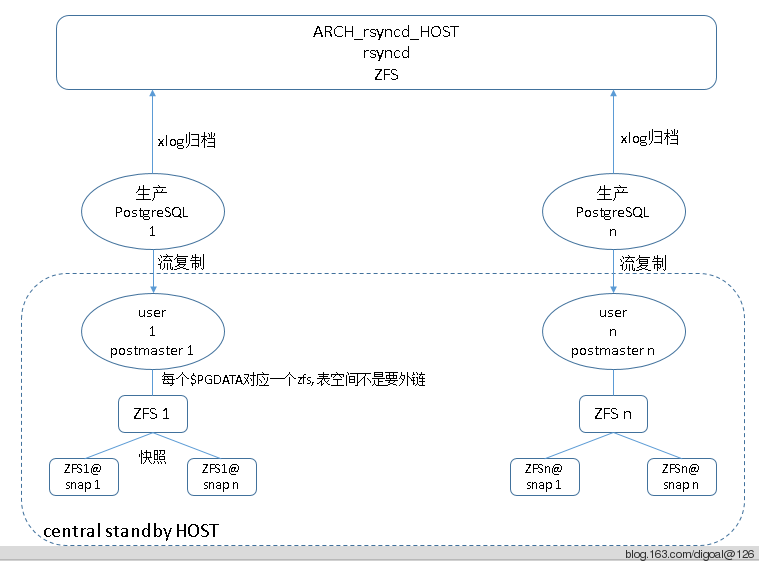

## PostgreSQL 最佳实践 - 块级增量备份(ZFS篇)方案与实战   
##### [TAG 24](../class/24.md)
                                                                                                            
### 作者                                                                                                                
digoal                                                                                                                
                                                                                                            
### 日期                                                                                                                
2016-08-23                                                                                                           
                                                                                                            
### 标签                                                                                                                
PostgreSQL , 增量备份 , 块级 , COW , 写时复制 , zfs , clone , snapshot , 快照                                 
                                                                                                            
----                                                                                                                
                     
## 背景  
在实际的生产环境中, 当数据库越来越多, 越来越大.    
    
备份可能会成为比较大的问题, 传统的逻辑备份对于大的数据库不适用(因为备份和还原可能是比较耗时的, 而且也不能回到任意时间点, 还会造成数据库膨胀(长时间repeatable read隔离级别), 好处是可以跨平台恢复, 可选恢复表等).    
    
而基于XLOG的增量备份, 虽然备份可以在线进行，同时支持恢复到任意时间点，但是恢复需要APPLY从基础备份到恢复目标之间所有产生的XLOG，如果基础备份做得不频繁，那么恢复时可能需要APPLY的XLOG文件数很多，导致恢复时间长。    
    
如果频繁的执行全量基础备份可以解决恢复时间长的问题，又会带来一系列问题，占用跟多的空间、占用更多的备份带宽、消耗数据库读资源、备份时间长等问题。    
    
这些问题随着数据库变大而放大。    
    
有什么好的解决方案么？    
    
## 解决方案，文件系统级快照 + 归档  
为了解决增量备份的问题，我们可能马上会想到类似Oracle的增量备份，只需要上次备份以来的变更或新增的数据块。    
    
PostgreSQL目前也支持这种备份方式，我会在下一篇文档中介绍。    
    
除了数据库本身支持的块级别增量备份，我们还可以使用文件系统的快照来支持块级增量备份，例如zfs或者btrfs。    
    
zfs在这里主要用到它的压缩, 去重和snapshot功能.     
    
使用zfs可以减少存储空间, 加快恢复速度.     
    
可以放在crontab定时执行, 例如2小时1次.    
      
最近在写一个集中式的PostgreSQL基于块的增量备份的CASE，刚好完美的解决了大实例的备份难题.    
    
集中备份主机环境    
  
```  
CentOS 6.5 x64    
  
ZFS 0.6.3    
  
磁盘12*4TB SATA + 2*300G SAS, 其中4TB的盘使用RAW模式, 未配置RAID卡. 300G的使用RAID1    
  
内存32G    
  
CPU Intel(R) Xeon(R) CPU E5-2609 v2 @ 2.50GHz 8核    
```  
    
## 架构  
  
    
归档主机配置(本例归档主机和备机主机使用同一台主机)  
    
## 配置归档存储节点  
    
### 配置ZFS  
配置ZFS, 开启压缩, 同时注意写性能至少要和网卡带宽相当, 否则容易造成瓶颈.     
    
一旦造成瓶颈, 可能导致主库XLOG堵塞膨胀(因为归档完成的XLOG才可以重用或被删除).    
    
考虑到写居多, 所以考虑加一个性能好的ilog设备. l2arc没必要加.    
    
zpool使用raidz1+ilog+spare的模式.    
    
raidz1盘的数量9=2^3+1, 实际上本例使用的盘数11(当然你可以多vdev strip的模式例如12块盘分4组vdev raidz1 3+3+3+3, 可用容量为8块盘).    
    
1个ilog因为这个设备底层使用了RAID1 的模式, 所以没有再次mirror. 如果底层是JBOD模式的话, 建议用mirror防止ilog数据损坏. 1块hot spare.    
    
磁盘个数的选择参考 http://blog.163.com/digoal@126/blog/static/163877040201451725147753/    
    
扇区大小选择4KB.     
  
```  
# zpool create -o ashift=12 zp1 raidz1 sdb sdc sdd sde sdf sdg sdh sdi sdj sdk sdl spare sdm     
# zpool add zp1 log /dev/sda4    
```  
    
配置zpool 根 zfs默认选项, 后面创建的zfs可以继承这些选项.    
  
```  
zfs set compression=lz4 zp1    
zfs set canmount=off zp1    
zfs set atime=off zp1    
```  
    
### 配置归档目录  
创建归档目录, 日志目录, PGHOME目录等.    
  
```  
zfs create -o mountpoint=/pg168104 zp1/pg168104    
zfs create -o mountpoint=/pg_log zp1/pg_log    
zfs create -o mountpoint=/pg_home zp1/pg_home    
zfs create -o mountpoint=/pg_arch zp1/pg_arch    
df -h    
zp1/pg168104     35T   32G   35T   1% /pg168104    
zp1/pg_log       35T  256K   35T   1% /pg_log    
zp1/pg_arch      35T  256K   35T   1% /pg_arch    
zp1/pg_home      35T  149M   35T   1% /pg_home    
```  
    
### 配置NFS服务  
配置PostgreSQL归档, 例如rsync服务端, nfs, ftp 等, 如果使用NFS注意固定一下NFS端口.    
    
本文以NFS为例介绍归档配置.     
    
配置NFS端口固定    
  
```  
# grep "^[A-Z]" /etc/sysconfig/nfs     
RQUOTAD_PORT=875    
LOCKD_TCPPORT=32803    
LOCKD_UDPPORT=32769    
MOUNTD_PORT=892    
STATD_PORT=662    
STATD_OUTGOING_PORT=2020    
RDMA_PORT=20049     
```  
    
配置nfs目录, 每个PG集群一个目录, 存放该集群的归档文件.    
  
```  
# mkdir /pg_arch/pg168104    
# vi /etc/exports  (注意如果主节点有流复制的HA的话, 主备都需要配置权限)    
/pg_arch/pg168104       192.168.168.16/32(rw,no_root_squash,sync)    
/pg_arch/pg168104       192.168.168.17/32(rw,no_root_squash,sync)    
```  
    
开启NFS服务, OR service nfs reload.    
  
```  
# service nfs start    
# chkconfig nfs on    
```  
    
## 主节点集群配置  
( (注意如果主节点有流复制的HA的话, 主备都需要配置) )    
    
### 配置NFS客户端  
配置nfs挂载, 数据库启动用户的权限, 如果有必要的话, 可以配置NFS超时.    
  
```  
# mkdir /pgarch    
# vi /etc/fstab  (尽量不要配置在这里, 如果挂载失败的话, 可能导致操作系统启动失败)    
192.168.168.131:/pg_arch/pg168104 /pgarch nfs     defaults,tcp  0 0    
# mount -a    
```  
    
推荐以下配置    
    
另一种是配置在启动脚本里面    
  
```  
# vi /etc/rc.local    
/bin/mount -t nfs -o tcp 192.168.168.131:/pg_arch/pg168104 /pgarch    
# df -k    
192.168.168.131:/pg_arch/pg168104    
                     37497821184         0 37497821184   0% /pgarch    
```  
    
### 创建归档目录    
```  
# mkdir -p /pgarch/arch    
# chown postgres:postgres /pgarch/arch    
# chmod 777 /pgarch/arch    
```  
    
### 配置sudo归档权限  
主节点集群配置归档命令(如果以前没有开启归档的话, 需要重启数据库开启归档)  (注意如果主节点有流复制的HA的话, 主备都需要配置)    
    
首先要配置SUDO, 因为NFS挂载过来权限后面需要调整, 所以最好使用SUDO以免归档和还原失败.    
  
```  
sudoedit /etc/sudoers    
#Defaults    requiretty    
postgres ALL=(ALL) NOPASSWD: /bin/cp    
postgres ALL=(ALL) NOPASSWD: /usr/bin/test    
postgres ALL=(ALL) NOPASSWD: /bin/mkdir    
```  
    
### 配置归档命令  
配置归档和还原命令 :     
  
```  
vi $PGDATA/postgresql.conf    
archive_mode = on    
archive_command = 'DIR=/pgarch/arch/`date +%F`; sudo test ! -d $DIR && sudo mkdir $DIR; sudo test ! -f $DIR/%f && sudo cp %p $DIR/%f; chmod +r $DIR/%f'    
    
vi $PGDATA/recovery.conf    
restore_command = 'cp /pgarch/arch/*/%f %p'    
    
pg_ctl reload    
```  
    
主备同时配归档没有问题(因为原版的PostgreSQL备节点不会触发归档), 除非你像这样改了PG代码.    
    
http://blog.163.com/digoal@126/blog/static/163877040201452004721783/    
    
## 配置数据文件存储节点  
配置ZFS(同归档存储节点的配置)    
    
考虑到写居多, 所以需要加一个ilog设备. l2arc没必要加.    
    
zpool使用raidz1+ilog+spare的模式, 盘的数量11+1+1, 1个ilog因为这个设备底层使用了RAID1 的模式, 所以没有再次mirror.如果底层是JBOD模式的话, 建议用mirror防止ilog数据损坏.    
    
扇区大小选择4KB.    
  
```  
# zpool create -o ashift=12 zp1 raidz1 sdb sdc sdd sde sdf sdg sdh sdi sdj sdk sdl spare sdm     
# zpool add zp1 log /dev/sda4    
    
# zpool status    
  pool: zp1    
 state: ONLINE    
  scan: none requested    
config:    
    
        NAME        STATE     READ WRITE CKSUM    
        zp1         ONLINE       0     0     0    
          raidz1-0  ONLINE       0     0     0    
            sdb     ONLINE       0     0     0    
            sdc     ONLINE       0     0     0    
            sdd     ONLINE       0     0     0    
            sde     ONLINE       0     0     0    
            sdf     ONLINE       0     0     0    
            sdg     ONLINE       0     0     0    
            sdh     ONLINE       0     0     0    
            sdi     ONLINE       0     0     0    
            sdj     ONLINE       0     0     0    
            sdk     ONLINE       0     0     0    
            sdl     ONLINE       0     0     0    
        logs    
          sda4      ONLINE       0     0     0    
        spares    
          sdm       AVAIL       
    
errors: No known data errors    
    
# zpool get all    
NAME  PROPERTY               VALUE                  SOURCE    
zp1   size                   40T                    -    
zp1   capacity               0%                     -    
zp1   altroot                -                      default    
zp1   health                 ONLINE                 -    
zp1   guid                   11462343615959745695   default    
zp1   version                -                      default    
zp1   bootfs                 -                      default    
zp1   delegation             on                     default    
zp1   autoreplace            off                    default    
zp1   cachefile              -                      default    
zp1   failmode               wait                   default    
zp1   listsnapshots          off                    default    
zp1   autoexpand             off                    default    
zp1   dedupditto             0                      default    
zp1   dedupratio             1.00x                  -    
zp1   free                   40.0T                  -    
zp1   allocated              3.98G                  -    
zp1   readonly               off                    -    
zp1   ashift                 12                     local    
zp1   comment                -                      default    
zp1   expandsize             0                      -    
zp1   freeing                0                      default    
zp1   feature@async_destroy  enabled                local    
zp1   feature@empty_bpobj    active                 local    
zp1   feature@lz4_compress   active                 local    
```  
    
设置zpool默认zfs的属性, 以便创建后面的zfs继承这些属性(同上). 主要修改压缩和文件访问时间.     
    
因为是集中式的流复制场景, 所以存储的IO可能会比较大, 前面我们考虑了使用ilog来提高写性能, 同时我们还需要考虑数据压缩, 节约存储空间, 我们这里选择lz4压缩算法, 速度和压缩比比较均衡.    
    
去重(dedup)暂时不开, 因为需要消耗大量的内存, 具体耗多少内存, 可以使用zdb -S zp1来评估.     
    
参考 http://blog.163.com/digoal@126/blog/static/16387704020145173939183/    
  
```  
# zfs set compression=lz4 zp1    
# zfs set atime=off zp1    
# zfs set canmount=off zp1    
# zfs get all zp1    
NAME  PROPERTY              VALUE                  SOURCE    
zp1   type                  filesystem             -    
zp1   creation              Tue Jul  1 13:49 2014  -    
zp1   used                  4.62G                  -    
zp1   available             35.0T                  -    
zp1   referenced            242K                   -    
zp1   compressratio         2.81x                  -    
zp1   mounted               no                     -    
zp1   quota                 none                   default    
zp1   reservation           none                   default    
zp1   recordsize            128K                   default    
zp1   mountpoint            /zp1                   default    
zp1   sharenfs              off                    default    
zp1   checksum              on                     default    
zp1   compression           lz4                    local    
zp1   atime                 off                    local    
zp1   devices               on                     default    
zp1   exec                  on                     default    
zp1   setuid                on                     default    
zp1   readonly              off                    default    
zp1   zoned                 off                    default    
zp1   snapdir               hidden                 default    
zp1   aclinherit            restricted             default    
zp1   canmount              off                    local    
zp1   xattr                 on                     default    
zp1   copies                1                      default    
zp1   version               5                      -    
zp1   utf8only              off                    -    
zp1   normalization         none                   -    
zp1   casesensitivity       sensitive              -    
zp1   vscan                 off                    default    
zp1   nbmand                off                    default    
zp1   sharesmb              off                    default    
zp1   refquota              none                   default    
zp1   refreservation        none                   default    
zp1   primarycache          all                    default    
zp1   secondarycache        all                    default    
zp1   usedbysnapshots       0                      -    
zp1   usedbydataset         242K                   -    
zp1   usedbychildren        4.62G                  -    
zp1   usedbyrefreservation  0                      -    
zp1   logbias               latency                default    
zp1   dedup                 off                    default    
zp1   mlslabel              none                   default    
zp1   sync                  standard               default    
zp1   refcompressratio      1.00x                  -    
zp1   written               242K                   -    
zp1   logicalused           11.6G                  -    
zp1   logicalreferenced     15K                    -    
zp1   snapdev               hidden                 default    
zp1   acltype               off                    default    
zp1   context               none                   default    
zp1   fscontext             none                   default    
zp1   defcontext            none                   default    
zp1   rootcontext           none                   default    
zp1   relatime              off                    default    
```  
    
创建数据库集群对应的zfs, 一个数据库集群对应一个zfs, 方便我们做zfs snapshot.    
    
命名的话, 最好结合IP和数据库的业务名称.    
  
```  
zfs create -o mountpoint=/pg168104 zp1/pg168104    
```  
    
配置网卡绑定(可选), 当带宽不够时可选.    
    
参考    
  
http://blog.163.com/digoal@126/blog/static/163877040201451823232145/    
    
如果所有主数据库节点产生xlog的速率超过了网卡速率, 那么建议多网卡绑定来解决网络带宽的问题.    
    
### 配置虚拟IP, 路由    
    
(这样的话所有的主节点pg_hba.conf的配置都指向这个虚拟IP, 以后迁移的话, 虚拟IP迁移走, 主节点的pg_hba.conf可以不用修改, (当然如果有DNS的话, 也可以配置为主机名, 就没有这么麻烦了))    
    
参考 http://blog.163.com/digoal@126/blog/static/16387704020145181134983/    
    
主节点配置pg_hba.conf允许虚拟IP过来的流复制协议连接.     
    
### 配置PITR备节点  
一个用户对应一个主节点, 每个用户编译各自的PG软件(因为不同的实例，PG软件编译参数可能不一样).    
  
```  
# zfs create -o mountpoint=/pg_home zp1/pg_home    
# mkdir -p /pg_home/pg168104/soft_bak    
# cd /pg_home/pg168104/soft_bak    
# wget pgsql9.0.17 , pgfincore , 等其他和主节点一致的软件(如果只作为备份的话, 无所谓, 如果要打开只读, 那么尽量一致的SO)    
```  
    
编译与主节点一致的postgresql软件以及插件.     
    
编译项见主节点的pg_config输出或查看源编译文件的config.log.    
    
例如 :     
  
```  
# less config.log    
  $ ./configure --prefix=/pg_home/pg168104/pgsql9.0.17 --with-wal-segsize=64 --with-perl --with-python --with-openssl --with-pam --with-ldap --with-libxml --with-libxslt --enable-thread-safety    
```  
    
或    
  
```  
$ pg_config    
BINDIR = /home/pg168104/pgsql9.0.17/bin    
DOCDIR = /home/pg168104/pgsql9.0.17/share/doc    
HTMLDIR = /home/pg168104/pgsql9.0.17/share/doc    
INCLUDEDIR = /home/pg168104/pgsql9.0.17/include    
PKGINCLUDEDIR = /home/pg168104/pgsql9.0.17/include    
INCLUDEDIR-SERVER = /home/pg168104/pgsql9.0.17/include/server    
LIBDIR = /home/pg168104/pgsql9.0.17/lib    
PKGLIBDIR = /home/pg168104/pgsql9.0.17/lib    
LOCALEDIR = /home/pg168104/pgsql9.0.17/share/locale    
MANDIR = /home/pg168104/pgsql9.0.17/share/man    
SHAREDIR = /home/pg168104/pgsql9.0.17/share    
SYSCONFDIR = /home/pg168104/pgsql9.0.17/etc    
PGXS = /home/pg168104/pgsql9.0.17/lib/pgxs/src/makefiles/pgxs.mk    
CONFIGURE = '--prefix=/home/pg168104/pgsql9.0.17' '--with-pgport=1921' '--with-wal-segsize=64' '--with-perl' '--with-python' '--with-openssl' '--with-pam' '--with-ldap' '--with-libxml' '--with-libxslt' '--enable-thread-safety'    
CC = gcc    
CPPFLAGS = -D_GNU_SOURCE -I/usr/include/libxml2    
CFLAGS = -O2 -Wall -Wmissing-prototypes -Wpointer-arith -Wdeclaration-after-statement -Wendif-labels -fno-strict-aliasing -fwrapv    
CFLAGS_SL = -fpic    
LDFLAGS = -Wl,--as-needed -Wl,-rpath,'/home/pg168104/pgsql9.0.17/lib',--enable-new-dtags    
LDFLAGS_EX =     
LDFLAGS_SL =     
LIBS = -lpgport -lxslt -lxml2 -lpam -lssl -lcrypto -lz -lreadline -lcrypt -ldl -lm     
VERSION = PostgreSQL 9.0.17    
```  
    
自定义的插件查看, 可以查看$PGHOME/lib目录或, 最好是拿到数据库档案, 翻阅编译过的插件, 新增的动态链接库等.    
    
例如    
  
```  
 ll -rt $PGHOME/lib/    
pgfincore.so    
```    
    
配置环境如下    
  
```  
# ln -s /pg_home/pg168104/pgsql9.0.17 /pg_home/pg168104/pgsql    
# useradd pg168104    
# su - pg168104    
vi .bash_profile    
export PS1="$USER@`/bin/hostname -s`-> "    
export DATE=`date +"%Y%m%d%H%M"`    
export LANG=en_US.utf8    
export PGHOME=/pg_home/pg168104/pgsql    
export PATH=$PGHOME/bin:$PATH:.    
export LD_LIBRARY_PATH=$PGHOME/lib:/lib64:/usr/lib64:/usr/local/lib64:/lib:/usr/lib:/usr/local/lib    
export MANPATH=$PGHOME/share/man:$MANPATH    
export PGDATA=/pg168104/pg_root    
export PGPORT=19211    
export PGHOST=$PGDATA    
export PGUSER=postgres    
export PGDATABASE=postgres    
alias rm='rm -i'    
alias ll='ls -lh'    
```  
    
### 创建基础备份  
在备份机, 所有的表空间都不使用软链接, 直接使用$PGDATA/pg_tblspc/oid目录.    
    
方法见 http://blog.163.com/digoal@126/blog/static/163877040201451713724384/    
    
例如    
  
```  
vi /etc/exports    
/pgxxxxxx       192.168.xxx.xxx/32(rw,no_root_squash,sync)    
service nfs reload    
    
mount -t nfs -o tcp 192.168.xxx.xxx:/pgxxxxxx /mnt    
  
# echo $PGDATA    
/xxx/xxx/xxx    
  
# su - postgres    
  
$ psql -c "select pg_start_backup(now()::text);"    
cp -rL $PGDATA mnt/    
  
$ psql -c "select pg_stop_backup();"    
umount /mnt    
```  
    
### 配置standby  
recovery.conf, postgresql.conf, (注意监听端口的修改, 因为一台主机开启多个standby, 避免端口冲突., 注意pg_log位置的修改. )    
    
配置.pgpass ，设置流复制秘钥   
    
配置主节点pg_hba.conf, 允许备机的虚拟IP访问. (如果是流复制集群的话, 主备两边都需要配置.)    
    
开启standby进行恢复, (随便使用open模式hot_standby = on 或 recovery模式hot_standby = off)    
    
recovery.conf中添加 :     
  
确保当主备网络中断时可以从归档继续恢复    
  
```  
restore_command = 'cp --preserve=timestamps /pg_arch/pgxxxxxx/arch/*/%f %p'    
```  
    
### 配置snapshot crontab    
```  
#vi /root/script/zfs_snap.sh    
#!/bin/bash    
/sbin/zfs snapshot zp1/pg168104@`date +%Y%m%d`    
chmod 500 /root/script/zfs_snap.sh    
    
# crontab -e    
1 8 * * * /root/script/zfs_snap.sh    
```  
    
### 配置监控    
1\. nfs 监控    
  
```  
showmount -e 192.168.168.131    
```  
    
2\. nfs 端口监控    
    
3\. PITR上所有数据库集群的端口监控    
    
4\. PITR上所有数据库集群的stream wal receiver进程监控    
    
5\. 流复制延迟监控    
    
6\. 归档文件时间戳监控, 发现归档失败.     
    
7\. 恢复监控, 10分钟内如果没有新建的XLOG文件则告警.    
    
vi /usr/local/nagios/libexec/mon_pitr.sh     
  
```  
#!/bin/bash    
    
EXIT=0    
    
DATE="`date +%F`"    
DIR="pgxxxxxx pgxxxxxx pgxxxxxx"    
    
for i in $DIR    
do    
CNT=""    
CNT=`find /$i/pg_root/pg_xlog -maxdepth 1 -size +15M -mmin -10`    
if [ "" == "$CNT" ]; then    
  echo -e "$i restore delay"    
  EXIT=1    
fi    
    
CNT=""    
CNT=`find /pg_arch/$i/arch/$DATE -maxdepth 1 -size +15M -mmin -20`    
if [ "" == "$CNT" ]; then    
  echo -e "$i archive delay"    
  EXIT=1    
fi    
done    
    
exit $EXIT    
```  
    
因为PGDATA是700的权限, 所以find这些目录会受到权限限制, nagios监控用户会报错, 所以可以把这个命令加入SUDO    
  
```  
# sudoedit /etc/sudoers    
ALL ALL=(ALL) NOPASSWD: /usr/local/nagios/libexec/mon_pitr.sh    
# cat /usr/local/nagios/etc/nrpe.cfg     
command[mon_pitr]=sudo /usr/local/nagios/libexec/mon_pitr.sh    
```  
    
## 注意事项  
1\. 如果归档失败, 主节点的pg_xlog目录会暴增, 不能rotate. 所以pg_xlog目录尽量配置大一些, 同时加上监控.     
    
当然更靠谱的方法是使用多个归档路径, 一个失败就归档到下一个路径. 但是需要注意调小一点超时. 否则每次归档都要等待超时也会造成拥堵.    
    
2\. 对NFS主机需要添加监控, 以防有问题.    
    
3\. 对于主节点有流复制HA的情况, NFS挂载, 归档都需要在主备节点同时配置. NFS的exports也需要配置允许主备节点的IP rw.    
    
4\. 因为是集中的归档和流复制所以务必注意网络带宽是否够用. 不够用的话, 可以考虑多网卡绑定增加带宽.    
    
5\. NFS端口固定后, 可以防止NFS服务器重启后或服务重启后, NFS CLIENT需要重新MOUNT的问题. 或者防火墙精确控制的问题.    
    
6\. 关于使用虚拟IP后路由出口IP的选择问题. 参见 http://blog.163.com/digoal@126/blog/static/16387704020145181134983/    
    
7\. 关于zpool raidz的底层块设备个数选择. 参见 http://blog.163.com/digoal@126/blog/static/163877040201451725147753/    
    
8\. 关于zfs的写入优化. 参见末尾     
    
9\. 关于zfs的压缩优化. 参见末尾     
    
10\. 多数据库集群的路径冲突问题. 不使用pg_tblspc/link, 直接一个集群一个zfs dataset来解决.    
    
11\. 开启归档后, standby节点参数修改, 如wal keep 改小, listen port 修改避免冲突, log_directory目录位置修改.等    
    
12\. zpool创建时, 务必设备名建议by-id, 放在因为设备别名变更后导致无法使用.    
  
```  
# ll /dev/disk/by-id/    
total 0    
lrwxrwxrwx 1 root root  9 Jun 18 17:33 scsi-36c81f660eb18e8001af8e4ec0420e21f -> ../../sda    
lrwxrwxrwx 1 root root 10 Jun 18 09:33 scsi-36c81f660eb18e8001af8e4ec0420e21f-part1 -> ../../sda1    
lrwxrwxrwx 1 root root 10 Jun 18 17:33 scsi-36c81f660eb18e8001af8e4ec0420e21f-part2 -> ../../sda2    
lrwxrwxrwx 1 root root 10 Jun 18 17:33 scsi-36c81f660eb18e8001af8e4ec0420e21f-part3 -> ../../sda3    
lrwxrwxrwx 1 root root 10 Jul  1 13:50 scsi-36c81f660eb18e8001af8e4ec0420e21f-part4 -> ../../sda4    
lrwxrwxrwx 1 root root  9 Jul  1 13:49 scsi-36c81f660eb18e8001b32c448038b992a -> ../../sdb    
lrwxrwxrwx 1 root root 10 Jul  1 13:49 scsi-36c81f660eb18e8001b32c448038b992a-part1 -> ../../sdb1    
lrwxrwxrwx 1 root root 10 Jul  1 13:49 scsi-36c81f660eb18e8001b32c448038b992a-part9 -> ../../sdb9    
lrwxrwxrwx 1 root root  9 Jul  1 13:49 scsi-36c81f660eb18e8001b32c44f03f8bc42 -> ../../sdc    
lrwxrwxrwx 1 root root 10 Jul  1 13:49 scsi-36c81f660eb18e8001b32c44f03f8bc42-part1 -> ../../sdc1    
lrwxrwxrwx 1 root root 10 Jul  1 13:49 scsi-36c81f660eb18e8001b32c44f03f8bc42-part9 -> ../../sdc9    
lrwxrwxrwx 1 root root  9 Jul  1 13:49 scsi-36c81f660eb18e8001b32c48e07b42c1c -> ../../sdd    
lrwxrwxrwx 1 root root 10 Jul  1 13:49 scsi-36c81f660eb18e8001b32c48e07b42c1c-part1 -> ../../sdd1    
lrwxrwxrwx 1 root root 10 Jul  1 13:49 scsi-36c81f660eb18e8001b32c48e07b42c1c-part9 -> ../../sdd9    
lrwxrwxrwx 1 root root  9 Jul  1 13:49 scsi-36c81f660eb18e8001b32c49e08a8b85a -> ../../sde    
lrwxrwxrwx 1 root root 10 Jul  1 13:49 scsi-36c81f660eb18e8001b32c49e08a8b85a-part1 -> ../../sde1    
lrwxrwxrwx 1 root root 10 Jul  1 13:49 scsi-36c81f660eb18e8001b32c49e08a8b85a-part9 -> ../../sde9    
lrwxrwxrwx 1 root root  9 Jul  1 13:49 scsi-36c81f660eb18e8001b32c4b90a4c8813 -> ../../sdf    
lrwxrwxrwx 1 root root 10 Jul  1 13:49 scsi-36c81f660eb18e8001b32c4b90a4c8813-part1 -> ../../sdf1    
lrwxrwxrwx 1 root root 10 Jul  1 13:49 scsi-36c81f660eb18e8001b32c4b90a4c8813-part9 -> ../../sdf9    
lrwxrwxrwx 1 root root  9 Jul  1 13:49 scsi-36c81f660eb18e8001b32c4c60b0d6236 -> ../../sdg    
lrwxrwxrwx 1 root root 10 Jul  1 13:49 scsi-36c81f660eb18e8001b32c4c60b0d6236-part1 -> ../../sdg1    
lrwxrwxrwx 1 root root 10 Jul  1 13:49 scsi-36c81f660eb18e8001b32c4c60b0d6236-part9 -> ../../sdg9    
lrwxrwxrwx 1 root root  9 Jul  1 13:49 scsi-36c81f660eb18e8001b32c4d00baa0784 -> ../../sdh    
lrwxrwxrwx 1 root root 10 Jul  1 13:49 scsi-36c81f660eb18e8001b32c4d00baa0784-part1 -> ../../sdh1    
lrwxrwxrwx 1 root root 10 Jul  1 13:49 scsi-36c81f660eb18e8001b32c4d00baa0784-part9 -> ../../sdh9    
lrwxrwxrwx 1 root root  9 Jul  1 13:49 scsi-36c81f660eb18e8001b32c5070eed3bc5 -> ../../sdi    
lrwxrwxrwx 1 root root 10 Jul  1 13:49 scsi-36c81f660eb18e8001b32c5070eed3bc5-part1 -> ../../sdi1    
lrwxrwxrwx 1 root root 10 Jul  1 13:49 scsi-36c81f660eb18e8001b32c5070eed3bc5-part9 -> ../../sdi9    
lrwxrwxrwx 1 root root  9 Jul  1 13:49 scsi-36c81f660eb18e8001b32c534119bcc85 -> ../../sdj    
lrwxrwxrwx 1 root root 10 Jul  1 13:49 scsi-36c81f660eb18e8001b32c534119bcc85-part1 -> ../../sdj1    
lrwxrwxrwx 1 root root 10 Jul  1 13:49 scsi-36c81f660eb18e8001b32c534119bcc85-part9 -> ../../sdj9    
lrwxrwxrwx 1 root root  9 Jul  1 13:49 scsi-36c81f660eb18e8001b32c53a11f82f4c -> ../../sdk    
lrwxrwxrwx 1 root root 10 Jul  1 13:49 scsi-36c81f660eb18e8001b32c53a11f82f4c-part1 -> ../../sdk1    
lrwxrwxrwx 1 root root 10 Jul  1 13:49 scsi-36c81f660eb18e8001b32c53a11f82f4c-part9 -> ../../sdk9    
lrwxrwxrwx 1 root root  9 Jul  1 13:49 scsi-36c81f660eb18e8001b32c543127efb6d -> ../../sdl    
lrwxrwxrwx 1 root root 10 Jul  1 13:49 scsi-36c81f660eb18e8001b32c543127efb6d-part1 -> ../../sdl1    
lrwxrwxrwx 1 root root 10 Jul  1 13:49 scsi-36c81f660eb18e8001b32c543127efb6d-part9 -> ../../sdl9    
lrwxrwxrwx 1 root root  9 Jul  1 13:49 scsi-36c81f660eb18e8001b32c5c61a48318a -> ../../sdm    
lrwxrwxrwx 1 root root 10 Jul  1 13:49 scsi-36c81f660eb18e8001b32c5c61a48318a-part1 -> ../../sdm1    
lrwxrwxrwx 1 root root 10 Jul  1 13:49 scsi-36c81f660eb18e8001b32c5c61a48318a-part9 -> ../../sdm9    
lrwxrwxrwx 1 root root  9 Jun 18 17:33 wwn-0x6c81f660eb18e8001af8e4ec0420e21f -> ../../sda    
lrwxrwxrwx 1 root root 10 Jun 18 09:33 wwn-0x6c81f660eb18e8001af8e4ec0420e21f-part1 -> ../../sda1    
lrwxrwxrwx 1 root root 10 Jun 18 17:33 wwn-0x6c81f660eb18e8001af8e4ec0420e21f-part2 -> ../../sda2    
lrwxrwxrwx 1 root root 10 Jun 18 17:33 wwn-0x6c81f660eb18e8001af8e4ec0420e21f-part3 -> ../../sda3    
lrwxrwxrwx 1 root root 10 Jul  1 13:50 wwn-0x6c81f660eb18e8001af8e4ec0420e21f-part4 -> ../../sda4    
lrwxrwxrwx 1 root root  9 Jul  1 13:49 wwn-0x6c81f660eb18e8001b32c448038b992a -> ../../sdb    
lrwxrwxrwx 1 root root 10 Jul  1 13:49 wwn-0x6c81f660eb18e8001b32c448038b992a-part1 -> ../../sdb1    
lrwxrwxrwx 1 root root 10 Jul  1 13:49 wwn-0x6c81f660eb18e8001b32c448038b992a-part9 -> ../../sdb9    
lrwxrwxrwx 1 root root  9 Jul  1 13:49 wwn-0x6c81f660eb18e8001b32c44f03f8bc42 -> ../../sdc    
lrwxrwxrwx 1 root root 10 Jul  1 13:49 wwn-0x6c81f660eb18e8001b32c44f03f8bc42-part1 -> ../../sdc1    
lrwxrwxrwx 1 root root 10 Jul  1 13:49 wwn-0x6c81f660eb18e8001b32c44f03f8bc42-part9 -> ../../sdc9    
lrwxrwxrwx 1 root root  9 Jul  1 13:49 wwn-0x6c81f660eb18e8001b32c48e07b42c1c -> ../../sdd    
lrwxrwxrwx 1 root root 10 Jul  1 13:49 wwn-0x6c81f660eb18e8001b32c48e07b42c1c-part1 -> ../../sdd1    
lrwxrwxrwx 1 root root 10 Jul  1 13:49 wwn-0x6c81f660eb18e8001b32c48e07b42c1c-part9 -> ../../sdd9    
lrwxrwxrwx 1 root root  9 Jul  1 13:49 wwn-0x6c81f660eb18e8001b32c49e08a8b85a -> ../../sde    
lrwxrwxrwx 1 root root 10 Jul  1 13:49 wwn-0x6c81f660eb18e8001b32c49e08a8b85a-part1 -> ../../sde1    
lrwxrwxrwx 1 root root 10 Jul  1 13:49 wwn-0x6c81f660eb18e8001b32c49e08a8b85a-part9 -> ../../sde9    
lrwxrwxrwx 1 root root  9 Jul  1 13:49 wwn-0x6c81f660eb18e8001b32c4b90a4c8813 -> ../../sdf    
lrwxrwxrwx 1 root root 10 Jul  1 13:49 wwn-0x6c81f660eb18e8001b32c4b90a4c8813-part1 -> ../../sdf1    
lrwxrwxrwx 1 root root 10 Jul  1 13:49 wwn-0x6c81f660eb18e8001b32c4b90a4c8813-part9 -> ../../sdf9    
lrwxrwxrwx 1 root root  9 Jul  1 13:49 wwn-0x6c81f660eb18e8001b32c4c60b0d6236 -> ../../sdg    
lrwxrwxrwx 1 root root 10 Jul  1 13:49 wwn-0x6c81f660eb18e8001b32c4c60b0d6236-part1 -> ../../sdg1    
lrwxrwxrwx 1 root root 10 Jul  1 13:49 wwn-0x6c81f660eb18e8001b32c4c60b0d6236-part9 -> ../../sdg9    
lrwxrwxrwx 1 root root  9 Jul  1 13:49 wwn-0x6c81f660eb18e8001b32c4d00baa0784 -> ../../sdh    
lrwxrwxrwx 1 root root 10 Jul  1 13:49 wwn-0x6c81f660eb18e8001b32c4d00baa0784-part1 -> ../../sdh1    
lrwxrwxrwx 1 root root 10 Jul  1 13:49 wwn-0x6c81f660eb18e8001b32c4d00baa0784-part9 -> ../../sdh9    
lrwxrwxrwx 1 root root  9 Jul  1 13:49 wwn-0x6c81f660eb18e8001b32c5070eed3bc5 -> ../../sdi    
lrwxrwxrwx 1 root root 10 Jul  1 13:49 wwn-0x6c81f660eb18e8001b32c5070eed3bc5-part1 -> ../../sdi1    
lrwxrwxrwx 1 root root 10 Jul  1 13:49 wwn-0x6c81f660eb18e8001b32c5070eed3bc5-part9 -> ../../sdi9    
lrwxrwxrwx 1 root root  9 Jul  1 13:49 wwn-0x6c81f660eb18e8001b32c534119bcc85 -> ../../sdj    
lrwxrwxrwx 1 root root 10 Jul  1 13:49 wwn-0x6c81f660eb18e8001b32c534119bcc85-part1 -> ../../sdj1    
lrwxrwxrwx 1 root root 10 Jul  1 13:49 wwn-0x6c81f660eb18e8001b32c534119bcc85-part9 -> ../../sdj9    
lrwxrwxrwx 1 root root  9 Jul  1 13:49 wwn-0x6c81f660eb18e8001b32c53a11f82f4c -> ../../sdk    
lrwxrwxrwx 1 root root 10 Jul  1 13:49 wwn-0x6c81f660eb18e8001b32c53a11f82f4c-part1 -> ../../sdk1    
lrwxrwxrwx 1 root root 10 Jul  1 13:49 wwn-0x6c81f660eb18e8001b32c53a11f82f4c-part9 -> ../../sdk9    
lrwxrwxrwx 1 root root  9 Jul  1 13:49 wwn-0x6c81f660eb18e8001b32c543127efb6d -> ../../sdl    
lrwxrwxrwx 1 root root 10 Jul  1 13:49 wwn-0x6c81f660eb18e8001b32c543127efb6d-part1 -> ../../sdl1    
lrwxrwxrwx 1 root root 10 Jul  1 13:49 wwn-0x6c81f660eb18e8001b32c543127efb6d-part9 -> ../../sdl9    
lrwxrwxrwx 1 root root  9 Jul  1 13:49 wwn-0x6c81f660eb18e8001b32c5c61a48318a -> ../../sdm    
lrwxrwxrwx 1 root root 10 Jul  1 13:49 wwn-0x6c81f660eb18e8001b32c5c61a48318a-part1 -> ../../sdm1    
lrwxrwxrwx 1 root root 10 Jul  1 13:49 wwn-0x6c81f660eb18e8001b32c5c61a48318a-part9 -> ../../sdm9    
```  
    
例如把zil和spare设备换成uuid.    
  
```  
# zpool remove zp1 sdm    
# zpool remove zp1 sda4    
# zpool add zp1 log /dev/disk/by-id/scsi-36c81f660eb18e8001af8e4ec0420e21f-part4    
# zpool add zp1 spare /dev/disk/by-id/scsi-36c81f660eb18e8001b32c5c61a48318a    
# zpool status    
  pool: zp1    
 state: ONLINE    
  scan: none requested    
config:    
    
        NAME                                            STATE     READ WRITE CKSUM    
        zp1                                             ONLINE       0     0     0    
          raidz1-0                                      ONLINE       0     0     0    
            sdb                                         ONLINE       0     0     0    
            sdc                                         ONLINE       0     0     0    
            sdd                                         ONLINE       0     0     0    
            sde                                         ONLINE       0     0     0    
            sdf                                         ONLINE       0     0     0    
            sdg                                         ONLINE       0     0     0    
            sdh                                         ONLINE       0     0     0    
            sdi                                         ONLINE       0     0     0    
            sdj                                         ONLINE       0     0     0    
            sdk                                         ONLINE       0     0     0    
            sdl                                         ONLINE       0     0     0    
        logs    
          scsi-36c81f660eb18e8001af8e4ec0420e21f-part4  ONLINE       0     0     0    
        spares    
          scsi-36c81f660eb18e8001b32c5c61a48318a        AVAIL       
```  
    
13\. slog的大小4G 上下就足够了.    
    
14\. 操作系统内核参数稍作调整.    
    
15\. 不建议使用linux, 因为zfs在linux下有一定的性能问题, 可以考虑FreeBSD. 参见    
    
http://blog.163.com/digoal@126/blog/static/16387704020145253599111/    
    
http://blog.163.com/digoal@126/blog/static/1638770402014526992910/    
    
http://blog.163.com/digoal@126/blog/static/16387704020145264116819/    
    
16\. 集中式的配置standby节点可能导致资源不够用, 例如shared_buffer, 要调小的话同时还需要调小connection_max 等关联参数, 而这些参数在postgresql.conf - hot_standby=on 的情况下, 需要检测是否大于等于上游节点的参数, 所以建议standby节点的hot_standby=off, 然后就不需要检测了, 然后就可以调小shared_buffer, connection_max等了.    
    
如果要打开hot_standby=on, 那么再调会connection_max 等检测项即可.    
    
17\. 原来如果主节点已是流复制的HA节点, 可以把recovery.conf或recovery.done修改一下.    
    
因为默认情况下standby节点不会产生archive, 所以不必担心重复的archive文件.    
    
所以双方挂载对方的pgarch目录到pgrestore即可.    
    
如果想让standby也产生archive, 参考我前面写的blog, 修改一些源代码.    
    
http://blog.163.com/digoal@126/blog/static/163877040201452004721783/    
  
```  
# mount -t nfs -o tcp bi_host:/pgarch /pgrestore    
    
$ vi $PGDATA/recovery.conf    
restore_command = 'cp --preserve=timestamps /pgrestore/arch/*/%f %p'    
```  
    
重启流复制备库生效.    
    
## 参考  
1\. http://blog.163.com/digoal@126/blog/static/163877040201451713724384/    
    
2\. http://blog.163.com/digoal@126/blog/static/163877040201451711013770/    
    
3\. http://blog.163.com/digoal@126/blog/static/163877040201451725147753/    
    
4\. http://blog.163.com/digoal@126/blog/static/16387704020145173939183/    
    
5\. http://blog.163.com/digoal@126/blog/static/16387704020145181134983/    
    
6\. http://blog.163.com/digoal@126/blog/static/163877040201451823232145/    
    
7\. https://pthree.org/2012/12/13/zfs-administration-part-viii-zpool-best-practices-and-caveats/    
    
8\. http://blog.163.com/digoal@126/blog/static/163877040201452004721783/    
    
9\. man nfs 超时    
  
```  
       timeo=n        The  value  in  tenths  of  a second before sending the first retransmission after an RPC    
                      timeout.  The default value depends on whether proto=udp or proto=tcp is in  effect  (see    
                      below).  The default value for UDP is 7 tenths of a second.  The default value for TCP is    
                      60 seconds.  After the first timeout, the timeout is doubled after each successive  time-    
                      out  until  a maximum timeout of 60 seconds is reached or the enough retransmissions have    
                      occured to cause a major timeout.  Then, if the filesystem  is  hard  mounted,  each  new    
                      timeout  cascade  restarts at twice the initial value of the previous cascade, again dou-    
                      bling at each retransmission.  The maximum timeout is always 60 seconds.    
    
       retrans=n      The number of minor timeouts and retransmissions that must occur before a  major  timeout    
                      occurs.   The  default  is 5 timeouts for proto=udp and 2 timeouts for proto=tcp.  When a    
                      major timeout occurs, the file operation is either aborted or a "server  not  responding"    
                      message is printed on the console.    
```  
  
10\. nfs 可中断挂载, 否则可能hang住  
  
```  
NFS Server  
/u01    xxx.xxx.xxx.xxx(rw,sync,no_root_squash,fsid=0)  
  
   fsid=0: Export a directory over NFS v4.  
  
  
NFS Client  
rw,nosuid,soft,intr,rsize=8192,wsize=8192,tcp,minorversion=1,lookupcache=all,addr=xxx.xxx.xxx.xxx  
  
   nosuid: This prevents remote users from gaining higher privileges by running a setuid program.  
   intr: Allows NFS requests to be interrupted if the server goes down or cannot be reached.  
   These settings speed up NFS communication for reads (rsize) and writes (wsize) by setting a larger data block size (num, in bytes), to be transferred at one time.  
```  
                                                                                    
                                                              
                                                          
  
<a rel="nofollow" href="http://info.flagcounter.com/h9V1"  ></a>  
  
  
  
  
  
  
## [digoal's 大量PostgreSQL文章入口](https://github.com/digoal/blog/blob/master/README.md "22709685feb7cab07d30f30387f0a9ae")
  
