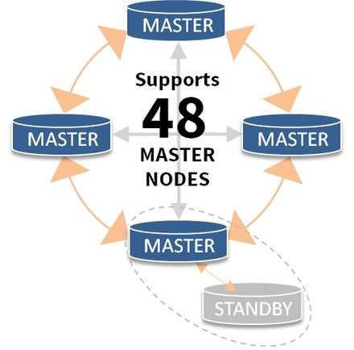

## PostgreSQL 最佳实践 - 读写分离    
##### [TAG 24](../class/24.md)
      
### 作者     
digoal      
      
### 日期    
2016-08-24      
      
### 标签    
PostgreSQL , pgpool-II , 读写分离    
      
----    
      
## 背景  
一直以来PostgreSQL数据库在scale up和scale out的方向都走得比较靠前，例如  
  
* **单元化技术**   
  oleg postgrespro的 PostgreSQL cluster，在分布式事务性能提升，选举算法方面的贡献非常大。  
  https://github.com/postgrespro/postgres_cluster  
  
  sim 他们的udr, bdr已经趋于成熟。  
  https://2ndquadrant.com/en/resources/bdr/    
    
      
    
* **分片技术**  
  10年前postgresql就非常成熟了，那就是skype开源的plproxy。  
    
  https://git.postgresql.org/gitweb/?p=skytools.git;a=summary  
    
  《阿里云 ApsaraDB for PostgreSQL 试用报告 - 2 教你RDS PG的水平分库》  
  https://yq.aliyun.com/articles/203  
    
  《阿里云 ApsaraDB for PostgreSQL 试用报告 - 3 水平分库 vs 单机 性能》  
  https://yq.aliyun.com/articles/204  
  
  《阿里云 ApsaraDB for PostgreSQL 试用报告 - 4 水平分库 之 节点扩展》  
  https://yq.aliyun.com/articles/205  
  
  《PostgreSQL 最佳实践 - 水平分库(基于plproxy)》  
  https://yq.aliyun.com/articles/59372  
  
* **NewSQL技术**  
  这个技术PostgreSQL走得非常靠前，现在Postgres-XL, Postgres-XC, citusdb, FDW based几种技术，都在趋于成熟。  
    
  以PostgreSQL社区一贯的作风，加入到内核的功能一定是成熟的，例如fdw based sharding，已经加入到内核了。 在9.6有了非常大的进步，包括sort , where , join的下推，这些查询在满足条件时都会在分片节点执行。  
  
* **读写分离**  
  目前读写分离最成熟的当属pgpool-II中间件，如果用户应用程序不希望自己来选择目标节点，可以使用pgpool-II来作为中间件使用。  
  
* **多核并行**  
  目前唯一支持多核并行的开源数据库，在某些大查询上面使用性能提升非常明显。  
    
  用户可以使用PG作为小型的数据仓库来使用，因为PG还支持机器学习库madlib，支持plpython, plr等服务端编程语言，完全可以支撑小型的分析需求(TB级别)。  
   
  《开源数据库 PostgreSQL 攻克并行计算难题》  
  https://yq.aliyun.com/articles/44655  
  
  《PostgreSQL 并行计算 - 助力实时精准营销应用》  
  https://yq.aliyun.com/articles/44649  
  
  《PostgreSQL 9.6 并行计算 优化器算法浅析》  
  https://yq.aliyun.com/articles/59180  
  
  《PostgreSQL 并行计算 在 xfs, ext4 下的表现》  
  https://yq.aliyun.com/articles/53985  
  
* **GPU并行**  
  PostgreSQL开放的接口(custom scan provider)，使得用户非常方便的可以扩展它的数据访问接口，GPU并行计算也是这么来实现的。  
  
  pgstrom 的benchmark来看，在OLAP领域性能提升非常的明显。  
  
  使用GPU的运算能力，高带宽，提升OLAP性能。  
  https://wiki.postgresql.org/wiki/PGStrom  
  https://github.com/pg-strom/devel  
  
但是在国内，这些技术的推广非常少，知道的人本身就不多，更不要说非常了解这些技术的人。  
  
本文主要针对读写分离这块，讲一下如何使用pgpool-II中间件以及PG的流复制技术实现PG的读写分离。  
  
## pgpool-II 三种负载均衡模式  
pgpool 的 load balance可以基于三种模式来实现.  
  
1\. replication  
  
2\. stream  
  
3\. slony-I  
  
### replication模式  
这三种模式最不推荐的是replication模式 , 它是由pgpool来控制的前端数据分发的复制功能, 例如一个插入语句, 将会在所有的backend database执行, 如果backend database的返回消息不一致, 则会选择degenerate少的部分backend(少数服从多数的意思), 或者是整个事务失败(由参数replication_stop_on_mismatch, failover_if_affected_tuples_mismatch 控制).  
  
这其实是个坑, 因为pgpool未提及差异数据的修复.  
  
所以极度不推荐使用.  
  
类似产品有 http://www.continuent.com/  
  
### stream模式  
stream模式使用了PostgreSQL自身提供的流复制特性. 相对来说是最完善的. 所以推荐使用.  
  
不管哪种模式, load balance都要考虑哪些SQL可以被分发到standby节点, 目前只有只读查询可以被分发到standby节点, 并且还需要考虑函数的影响, 因为有些函数是会修改数据库的, 例如nextval, 或者自定义的函数里面包含了select以外的查询.  
  
还需要考虑SELECT在事务中的情况, 对于事务中的查询不建议在standby错开节点.  
  
另外还有基于游标的更新也是需要注意的.  
  
pgpool的处理意见是, 包含函数的查询都只分发给master, 除非配置了white_function_list .  
  
## 简单的配置过程  
### 1. 配置流复制环境, 一主一备, 端口分别为1999,2000.  
停库  
```
pg93@db-172-16-3-39-> pg_ctl stop -m fast    
waiting for server to shut down.... done    
server stopped    
```
  
配置pg_hba.conf  
```
g93@db-172-16-3-39-> cd $PGDATA    
pg93@db-172-16-3-39-> ll    
total 4.0K    
drwx------ 16 pg93 pg93 4.0K May 13 11:16 pg_root    
cd pg_root    
vi pg_hba.conf    
host all all 0.0.0.0/0 md5    
host replication postgres 172.16.3.39/32 md5    
```
  
创建备库  
  
拷贝数据文件  
```
pg93@db-172-16-3-39-> cp -r pg_root pg_root_2000    
pg93@db-172-16-3-39-> mv pg_root pg_root_1999    
pg93@db-172-16-3-39-> ll    
total 8.0K    
drwx------ 16 pg93 pg93 4.0K May 13 11:16 pg_root_1999    
drwx------ 16 pg93 pg93 4.0K May 13 11:17 pg_root_2000    
```
  
配置postgresql.conf, 修改监听端口  
```
pg93@db-172-16-3-39-> cd pg_root_2000    
pg93@db-172-16-3-39-> vi postgresql.conf     
port = 2000    
  
pg93@db-172-16-3-39-> grep "^[a-z]" postgresql.conf     
listen_addresses = '0.0.0.0'            # what IP address(es) to listen on;    
port = 2000     # (change requires restart)    
max_connections = 500                   # (change requires restart)    
unix_socket_directories = '.'   # comma-separated list of directories    
unix_socket_permissions = 0700          # begin with 0 to use octal notation    
password_encryption = on    
tcp_keepalives_idle = 60                # TCP_KEEPIDLE, in seconds;    
tcp_keepalives_interval = 10            # TCP_KEEPINTVL, in seconds;    
tcp_keepalives_count = 10               # TCP_KEEPCNT;    
shared_buffers = 2048MB                 # min 128kB    
maintenance_work_mem = 512MB            # min 1MB    
max_stack_depth = 8MB                   # min 100kB    
shared_preload_libraries = 'pg_stat_statements'         # (change requires restart)    
vacuum_cost_delay = 10                  # 0-100 milliseconds    
vacuum_cost_limit = 10000               # 1-10000 credits    
bgwriter_delay = 10ms                   # 10-10000ms between rounds    
wal_level = hot_standby                 # minimal, archive, or hot_standby    
synchronous_commit = off                # synchronization level;    
wal_sync_method = fdatasync             # the default is the first option    
wal_buffers = 16384kB                   # min 32kB, -1 sets based on shared_buffers    
wal_writer_delay = 10ms         # 1-10000 milliseconds    
checkpoint_segments = 256               # in logfile segments, min 1, 16MB each    
archive_mode = on               # allows archiving to be done    
archive_command = '/bin/date'           # command to use to archive a logfile segment    
max_wal_senders = 32            # max number of walsender processes    
wal_keep_segments = 512         # in logfile segments, 16MB each; 0 disables    
hot_standby = on                        # "on" allows queries during recovery    
max_standby_archive_delay = 300s        # max delay before canceling queries    
max_standby_streaming_delay = 300s      # max delay before canceling queries    
wal_receiver_status_interval = 1s       # send replies at least this often    
hot_standby_feedback = off               # send info from standby to prevent    
random_page_cost = 1.5                  # same scale as above    
effective_cache_size = 8192MB    
log_destination = 'csvlog'              # Valid values are combinations of    
logging_collector = on          # Enable capturing of stderr and csvlog    
log_directory = 'pg_log'                # directory where log files are written,    
log_filename = 'postgresql-%Y-%m-%d_%H%M%S.log' # log file name pattern,    
log_file_mode = 0600                    # creation mode for log files,    
log_truncate_on_rotation = on           # If on, an existing log file with the    
log_rotation_age = 1d                   # Automatic rotation of logfiles will    
log_rotation_size = 10MB                # Automatic rotation of logfiles will    
log_checkpoints = on    
log_connections = on    
log_disconnections = on    
log_error_verbosity = verbose           # terse, default, or verbose messages    
log_lock_waits = on                     # log lock waits >= deadlock_timeout    
log_statement = 'ddl'                   # none, ddl, mod, all    
log_timezone = 'PRC'    
track_activity_query_size = 4096        # (change requires restart)    
autovacuum = on                 # Enable autovacuum subprocess?  'on'    
log_autovacuum_min_duration = 0 # -1 disables, 0 logs all actions and    
autovacuum_freeze_max_age = 1500000000  # maximum XID age before forced vacuum    
datestyle = 'iso, mdy'    
timezone = 'PRC'    
lc_messages = 'C'                       # locale for system error message    
lc_monetary = 'C'                       # locale for monetary formatting    
lc_numeric = 'C'                        # locale for number formatting    
lc_time = 'C'                           # locale for time formatting    
default_text_search_config = 'pg_catalog.english'    
deadlock_timeout = 1s    
pg_stat_statements.max = 1000    
pg_stat_statements.track = all    
```
  
配置recovery.conf, 主的文件名为recovery.done  
```
pg93@db-172-16-3-39-> cp $PGHOME/share/recovery.conf.sample ./    
pg93@db-172-16-3-39-> mv recovery.conf.sample recovery.conf    
vi recovery.conf    
recovery_target_timeline = 'latest'    
standby_mode = on    
primary_conninfo = 'host=172.16.3.39 port=1999 user=postgres keepalives_idle=60'    
  
pg93@db-172-16-3-39-> cp recovery.conf ../pg_root_1999/recovery.done    
pg93@db-172-16-3-39-> vi ../pg_root_1999/recovery.done    
recovery_target_timeline = 'latest'    
standby_mode = on    
primary_conninfo = 'host=172.16.3.39 port=2000 user=postgres keepalives_idle=60'    
```
  
配置连接秘钥  
```
vi ~/.pgpass    
172.16.3.39:1999:*:postgres:postgres    
172.16.3.39:2000:*:postgres:postgres    
chmod 400 ~/.pgpass    
```
  
启动主库和备库, 并确认流复制正常  
```
pg93@db-172-16-3-39-> pg_ctl start -D /pgdata/digoal/1921/data03/pg93/pg_root_1999    
pg93@db-172-16-3-39-> pg_ctl start -D /pgdata/digoal/1921/data03/pg93/pg_root_2000    
  
pg93@db-172-16-3-39-> psql -h 127.0.0.1 -p 1999    
Password:     
psql (9.3.1)    
Type "help" for help.    
digoal=# \du    
                             List of roles    
 Role name |                   Attributes                   | Member of     
-----------+------------------------------------------------+-----------    
 digoal    | Superuser                                      | {}    
 postgres  | Superuser, Create role, Create DB, Replication | {}    
digoal=# \q    
  
pg93@db-172-16-3-39-> psql -h 127.0.0.1 -p 2000    
Password:     
psql (9.3.1)    
Type "help" for help.    
digoal=# select pg_is_in_recovery();    
 pg_is_in_recovery     
-------------------    
 t    
(1 row)    
  
ps -ewf|grep stream    
postgres: wal sender process postgres 172.16.3.39(21679) streaming 2/E4    
```
  
### 2. 安装pgpool  
```
[root@db-172-16-3-150 soft_bak]# wget http://www.pgpool.net/download.php?f=pgpool-II-3.3.3.tar.gz    
[root@db-172-16-3-150 soft_bak]# mv download.php\?f\=pgpool-II-3.3.3.tar.gz pgpool.tar.gz    
[root@db-172-16-3-150 soft_bak]# tar -zxvf pgpool.tar.gz    
[root@db-172-16-3-150 soft_bak]# cd pgpool-II-3.3.3/    
[root@db-172-16-3-150 pgpool-II-3.3.3]#     
```
  
这一步需要注意, 最好pgpool依赖的postgresql版本和backend database的数据库版本一致. 例如都是9.3.1  
```
[root@db-172-16-3-150 pgpool-II-3.3.3]# ./configure --prefix=/opt/pgpool3.3.3 --with-pgsql=/home/pg93/pgsql9.3.1    
[root@db-172-16-3-150 pgpool-II-3.3.3]# gmake && gmake install    
```
  
### 3. 配置pgpool  
```
[root@db-172-16-3-150 etc]# cd /opt/pgpool3.3.3/etc/    
[root@db-172-16-3-150 etc]# cp pool_hba.conf.sample pool_hba.conf    
[root@db-172-16-3-150 etc]# cp pgpool.conf.sample-stream pgpool.conf    
[root@db-172-16-3-150 etc]# cp pcp.conf.sample pcp.conf    
[root@db-172-16-3-150 etc]# vi pgpool.conf    
listen_addresses = '0.0.0.0'    
port = 9999    
socket_dir = '/tmp'    
pcp_port = 9898    
pcp_socket_dir = '/tmp'    
backend_hostname0 = '172.16.3.39'    
backend_port0 = 1999     
backend_weight0 = 1    
backend_flag0 = 'ALLOW_TO_FAILOVER'    
backend_hostname1 = '172.16.3.39'    
backend_port1 = 2000    
backend_weight1 = 1    
backend_flag1 = 'ALLOW_TO_FAILOVER'    
enable_pool_hba = on    
pool_passwd = 'pool_passwd'    
authentication_timeout = 60    
ssl = off    
num_init_children = 32    
max_pool = 4    
child_life_time = 300    
child_max_connections = 0    
connection_life_time = 0    
client_idle_limit = 0    
log_destination = 'syslog'    
print_timestamp = on    
log_connections = on    
log_hostname = off    
  
# 以下两个参数用于调试, 能看到sql balance的情况.    
log_statement = on    
log_per_node_statement = on    
  
log_standby_delay = 'always'    
syslog_facility = 'LOCAL0'    
syslog_ident = 'pgpool'    
debug_level = 0    
pid_file_name = '/var/run/pgpool/pgpool.pid'    
logdir = '/tmp'    
connection_cache = on    
reset_query_list = 'ABORT; DISCARD ALL'    
replication_mode = off    
replicate_select = off    
insert_lock = off    
lobj_lock_table = ''    
replication_stop_on_mismatch = off    
failover_if_affected_tuples_mismatch = off    
load_balance_mode = on    
ignore_leading_white_space = on    
white_function_list = ''    
black_function_list = 'currval,lastval,nextval,setval'    
master_slave_mode = on    
master_slave_sub_mode = 'stream'    
sr_check_period = 2    
sr_check_user = 'srcheck'    
sr_check_password = 'SRCHECK'    
delay_threshold = 1024000    
follow_master_command = ''    
parallel_mode = off    
pgpool2_hostname = ''    
health_check_period = 0    
health_check_timeout = 20    
health_check_user = 'nobody'    
health_check_password = ''    
health_check_max_retries = 0    
health_check_retry_delay = 1    
failover_command = ''    
failback_command = ''    
fail_over_on_backend_error = on    
search_primary_node_timeout = 10    
recovery_user = 'nobody'    
recovery_password = ''    
recovery_1st_stage_command = ''    
recovery_2nd_stage_command = ''    
recovery_timeout = 90    
client_idle_limit_in_recovery = 0    
use_watchdog = off    
trusted_servers = ''    
ping_path = '/bin'    
wd_hostname = ''    
wd_port = 9000    
wd_authkey = ''    
delegate_IP = ''    
ifconfig_path = '/sbin'    
if_up_cmd = 'ifconfig eth0:0 inet $_IP_$ netmask 255.255.255.0'    
if_down_cmd = 'ifconfig eth0:0 down'    
arping_path = '/usr/sbin'           # arping command path    
arping_cmd = 'arping -U $_IP_$ -w 1'    
clear_memqcache_on_escalation = on    
wd_escalation_command = ''    
wd_lifecheck_method = 'heartbeat'    
wd_interval = 10    
wd_heartbeat_port = 9694    
wd_heartbeat_keepalive = 2    
wd_heartbeat_deadtime = 30    
heartbeat_destination0 = 'host0_ip1'    
heartbeat_destination_port0 = 9694     
heartbeat_device0 = ''    
wd_life_point = 3    
wd_lifecheck_query = 'SELECT 1'    
wd_lifecheck_dbname = 'template1'    
wd_lifecheck_user = 'nobody'    
wd_lifecheck_password = ''    
relcache_expire = 0    
relcache_size = 256    
check_temp_table = on    
memory_cache_enabled = off    
memqcache_method = 'shmem'    
memqcache_memcached_host = 'localhost'    
memqcache_memcached_port = 11211    
memqcache_total_size = 67108864    
memqcache_max_num_cache = 1000000    
memqcache_expire = 0    
memqcache_auto_cache_invalidation = on    
memqcache_maxcache = 409600    
memqcache_cache_block_size = 1048576    
memqcache_oiddir = '/var/log/pgpool/oiddir'    
white_memqcache_table_list = ''    
black_memqcache_table_list = ''    
```
  
生成pgpool管理秘钥, 并配置  
```
[root@db-172-16-3-150 etc]# /opt/pgpool3.3.3/bin/pg_md5 -u sup_pool sup_pool_pwd    
c21777db255631573e4233403773bb3b    
  
[root@db-172-16-3-150 etc]# vi pcp.conf    
sup_pool:c21777db255631573e4233403773bb3b    
```
  
配置pgpool pool_hba.conf  
```
[root@db-172-16-3-150 etc]# vi pool_hba.conf    
# trust会导致错误    
local   all         all                               trust    
host    all         all         127.0.0.1/32          trust    
host all all 0.0.0.0/0 md5    
```
  
配置pgpool-ii密码文件, 从postgresql数据库pg_authid获取  
```
digoal=# select rolname,rolpassword from pg_authid;    
 rolname  |             rolpassword                 
----------+-------------------------------------    
 postgres | md53175bce1d3201d16594cebf9d7eb3f9d    
 digoal   | md5462f71c79368ccf422f8a773ef40074d    
 srcheck  | md5662c10f61b27a9ab38ce69157186b25f    
(3 rows)    
  
[root@db-172-16-3-150 etc]# vi pool_passwd    
postgres:md53175bce1d3201d16594cebf9d7eb3f9d    
```
  
### 4. 创建check用户, pgpool用它连接到数据库并 检查数据库是否正常  
```
pg93@db-172-16-3-39-> psql -h 127.0.0.1 -p 1999    
Password:     
psql (9.3.1)    
Type "help" for help.    
digoal=# create role srcheck nosuperuser login encrypted password 'SRCHECK';    
CREATE ROLE    
```
  
### 5. 启动pgpool  
```
[root@db-172-16-3-150 etc]# /opt/pgpool3.3.3/bin/pgpool -f /opt/pgpool3.3.3/etc/pgpool.conf    
  
[root@db-172-16-3-150 etc]# tail -f -n 2 /var/log/messages    
May 13 11:56:45 db-172-16-3-150 pgpool[28153]: pgpool-II successfully started. version 3.3.3 (tokakiboshi)    
May 13 11:56:45 db-172-16-3-150 pgpool[28153]: find_primary_node: primary node id is 0    
```
  
### 6. 常见连接错误  
#### 问题1  
```
[root@db-172-16-3-150 etc]# su - pg93    
pg93@db-172-16-3-150-> psql -h 127.0.0.1 -p 9999 -U postgres digoal    
psql: ERROR:  MD5 authentication is unsupported in replication, master-slave and parallel modes.    
HINT:  check pg_hba.conf    
```
  
这个错误的原因已经很清楚了, 需要修改pool_hba.conf, 对应的trust改成md5 . 对应的错误代码 :  
  
pool_auth.c  
```
        /* md5 authentication? */    
        else if (authkind == 5)    
        {    
                /* If MD5 auth is not active in pool_hba.conf, it cannot be    
                 * used with other than raw mode.    
                 */    
                if (frontend->auth_method != uaMD5 && !RAW_MODE && NUM_BACKENDS > 1)    
                {    
                        pool_send_error_message(frontend, protoMajor, AUTHFAIL_ERRORCODE,    
                                                                        "MD5 authentication is unsupported in replication, master-slave and parallel modes.",    
                                                                        "",    
                                                                        "check pg_hba.conf",    
                                                                        __FILE__, __LINE__);    
                        return -1;    
                }    
```
  
错误修复  
```
[root@db-172-16-3-150 pgpool-II-3.3.3]# cd /opt/pgpool3.3.3/etc/    
[root@db-172-16-3-150 etc]# vi pool_hba.conf    
host    all         all         127.0.0.1/32          md5    
  
  
[root@db-172-16-3-150 etc]# /opt/pgpool3.3.3/bin/pgpool -f /opt/pgpool3.3.3/etc/pgpool.conf reload    
```
  
这里存在BUG, 从trust改成md5后, 报错是没了, 但是密码也不提示就直接进了(这显然是有问题的).  
```
pg93@db-172-16-3-150-> psql -h 127.0.0.1 -p 9999 -U postgres digoal    
psql (9.3.3, server 9.3.1)    
Type "help" for help.    
digoal=# \q    
```
  
连接已配置为md5验证的条目. 已有的172.16.3.150. 正常  
```
pg93@db-172-16-3-150-> psql -h 172.16.3.150 -p 9999 -U postgres digoal    
Password for user postgres:     
psql (9.3.3, server 9.3.1)    
Type "help" for help.    
digoal=# \q    
```
  
#### 问题2  
  
使用在pool_passwd中么有配置的用户连接.  
```
pg93@db-172-16-3-150-> psql -h 172.16.3.150 -p 9999 -U digoal digoal    
psql: ERROR:  "MD5" authentication with pgpool failed for user "digoal"    
```
  
这个错误并没有提示输入密码就出错, 原因是在pool_passwd文件中没有加入digoal的密码.  
  
修复错误, 在pool_passwd中添加条目  
```
[root@db-172-16-3-150 etc]# vi pool_passwd     
digoal:md5462f71c79368ccf422f8a773ef40074d    
  
[root@db-172-16-3-150 etc]# /opt/pgpool3.3.3/bin/pgpool -f /opt/pgpool3.3.3/etc/pgpool.conf reload    
[root@db-172-16-3-150 etc]# su - pg93    
pg93@db-172-16-3-150-> psql -h 127.0.0.1 -p 9999 -U digoal digoal    
Password for user digoal:     
psql (9.3.3, server 9.3.1)    
Type "help" for help.    
digoal=#     
```
  
### 7. 测试load balance  
测试hint是否可用, replication表示发到主节点  
```
digoal=# /*REPLICATION*/ SELECT 1;    
 ?column?     
----------    
        1    
(1 row)    
  
digoal=# SELECT 1;    
 ?column?     
----------    
        1    
(1 row)    
```
  
查看日志  
```
May 13 14:00:24 db-172-16-3-150 pgpool[30046]: statement: /*REPLICATION*/ SELECT 1;    
May 13 14:00:24 db-172-16-3-150 pgpool[30046]: DB node id: 0 backend pid: 19371 statement: /*REPLICATION*/ SELECT 1;    
May 13 14:00:33 db-172-16-3-150 pgpool[30046]: statement: SELECT 1;    
May 13 14:00:33 db-172-16-3-150 pgpool[30046]: DB node id: 1 backend pid: 19372 statement: SELECT 1;    
```
  
do默认分发到master节点, 因为pgpool不能确认do里面是否有修改数据库的动作.  
```
digoal=# do language plpgsql $$    
digoal$# declare     
digoal$# begin    
digoal$#   raise notice 'test';    
digoal$# end;    
digoal$# $$;    
NOTICE:  test    
DO    
  
May 13 14:16:06 db-172-16-3-150 pgpool[30072]: statement: do language plpgsql $$#012declare #012begin#012  raise notice 'test';#012end;#012$$;    
May 13 14:16:06 db-172-16-3-150 pgpool[30072]: DB node id: 0 backend pid: 20575 statement: do language plpgsql $$#012declare #012begin#012  raise notice 'test';#012end;#012$$;    
May 13 14:16:06 db-172-16-3-150 pgpool[30072]: pool_send_and_wait: Error or notice message from backend: : DB node id: 0 backend pid: 20575 statement: do language plpgsql $$#012declare #012begin#012  raise notice 'test';#012end;#012$$; message: test    
```
  
在仅仅设置了黑名单的情况下, 所有状态的函数(volatile, stable, immutable)都分发到standby节点.  
```
May 13 14:18:07 db-172-16-3-150 pgpool[30072]: statement: select now();    
May 13 14:18:07 db-172-16-3-150 pgpool[30072]: DB node id: 1 backend pid: 20576 statement: select now();    
May 13 14:18:28 db-172-16-3-150 pgpool[30072]: statement: select pg_is_in_recovery();    
May 13 14:18:28 db-172-16-3-150 pgpool[30072]: DB node id: 1 backend pid: 20576 statement: select pg_is_in_recovery();    
May 13 14:22:46 db-172-16-3-150 pgpool[30072]: statement: select clock_timestamp();    
May 13 14:22:46 db-172-16-3-150 pgpool[30072]: DB node id: 1 backend pid: 20576 statement: select clock_timestamp();    
```
  
例子, 发到standby节点  
```
digoal=# create or replace function ft1(v_id int) returns int as    
$$    
declare             
begin    
  update t set info='new' where id=v_id;     
  return 0;    
end;    
$$ language plpgsql strict;    
CREATE FUNCTION    
  
digoal=# select ft1(1);    
ERROR:  cannot execute UPDATE in a read-only transaction    
CONTEXT:  SQL statement "update t set info='new' where id=v_id"    
PL/pgSQL function ft1(integer) line 4 at SQL statement    
```
  
使用replication hint强行在master节点执行 :  
```
digoal=# /*REPLICATION*/ select ft1(1);    
 ft1     
-----    
   0    
(1 row)    
```
  
如果同时配置了黑名单和白名单, 那么以白名单为准, 不在白名单的都会发到master节点.  
```
[root@db-172-16-3-150 etc]# vi pgpool.conf    
white_function_list = 'ft'    
  
[root@db-172-16-3-150 etc]# /opt/pgpool3.3.3/bin/pgpool -f /opt/pgpool3.3.3/etc/pgpool.conf reload    
  
May 13 14:36:08 db-172-16-3-150 pgpool[30056]: statement: select ft(1);    
May 13 14:36:08 db-172-16-3-150 pgpool[30056]: DB node id: 1 backend pid: 22331 statement: select ft(1);    
May 13 14:36:14 db-172-16-3-150 pgpool[30056]: statement: select ft1(1);    
May 13 14:36:14 db-172-16-3-150 pgpool[30056]: DB node id: 0 backend pid: 22330 statement: select ft1(1);    
May 13 14:36:18 db-172-16-3-150 pgpool[30056]: statement: select now();    
May 13 14:36:18 db-172-16-3-150 pgpool[30056]: DB node id: 0 backend pid: 22330 statement: select now();    
May 13 14:36:35 db-172-16-3-150 pgpool[30056]: statement: select clock_timestamp();    
May 13 14:36:35 db-172-16-3-150 pgpool[30056]: DB node id: 0 backend pid: 22330 statement: select clock_timestamp();    
```
  
update正常分发到master节点  
```
May 13 14:31:02 db-172-16-3-150 pgpool[30072]: statement: update t set info='new' where id=1;    
May 13 14:31:02 db-172-16-3-150 pgpool[30072]: DB node id: 0 backend pid: 20575 statement: update t set info='new' where id=1;    
```
  
事务中包含游标, 游标强制在master节点执行  
```
digoal=# begin;    
BEGIN    
digoal=# select 1;    
 ?column?     
----------    
        1    
(1 row)    
  
digoal=# declare cur cursor for select * from t;    
DECLARE CURSOR    
digoal=# fetch next from cur;    
 id |               info               |          crt_time              
----+----------------------------------+----------------------------    
  3 | 37c8aae0733801d116e1c83ab60f183c | 2013-10-12 17:33:14.654526    
(1 row)    
  
digoal=# update t set info='new' where current of cur;    
UPDATE 1    
digoal=# end;    
COMMIT    
```
  
这里我们看到, begin, end是在所有节点执行的, 但是事务中的select是在standby中执行的, 游标是在master执行的.  
```
May 13 14:38:24 db-172-16-3-150 pgpool[30056]: statement: begin;    
May 13 14:38:24 db-172-16-3-150 pgpool[30056]: DB node id: 0 backend pid: 22330 statement: begin;    
May 13 14:38:24 db-172-16-3-150 pgpool[30056]: DB node id: 1 backend pid: 22331 statement: begin;    
May 13 14:38:25 db-172-16-3-150 pgpool[30056]: statement: select 1;    
May 13 14:38:25 db-172-16-3-150 pgpool[30056]: DB node id: 1 backend pid: 22331 statement: select 1;    
May 13 14:38:32 db-172-16-3-150 pgpool[30056]: statement: declare cur cursor for select * from t;    
May 13 14:38:32 db-172-16-3-150 pgpool[30056]: DB node id: 0 backend pid: 22330 statement: declare cur cursor for select * from t;    
May 13 14:38:44 db-172-16-3-150 pgpool[30056]: statement: fetch next from cur;    
May 13 14:38:44 db-172-16-3-150 pgpool[30056]: DB node id: 0 backend pid: 22330 statement: fetch next from cur;    
May 13 14:38:46 db-172-16-3-150 pgpool[30079]: Replication of node:1 is behind 1840 bytes from the primary server (node:0)    
May 13 14:38:47 db-172-16-3-150 pgpool[30056]: statement: update t set info='new' where current of cur;    
May 13 14:38:47 db-172-16-3-150 pgpool[30056]: DB node id: 0 backend pid: 22330 statement: update t set info='new' where current of cur;    
May 13 14:38:48 db-172-16-3-150 pgpool[30079]: Replication of node:1 is behind 1840 bytes from the primary server (node:0)    
May 13 14:38:49 db-172-16-3-150 pgpool[30056]: statement: end;    
May 13 14:38:49 db-172-16-3-150 pgpool[30056]: DB node id: 1 backend pid: 22331 statement: end;    
May 13 14:38:49 db-172-16-3-150 pgpool[30056]: DB node id: 0 backend pid: 22330 statement: end;    
```
  
对于先执行更新的事务, 那么后期的查询都会在master节点执行.  
```
May 13 15:33:11 db-172-16-3-150 pgpool[30056]: statement: begin;    
May 13 15:33:11 db-172-16-3-150 pgpool[30056]: DB node id: 0 backend pid: 22330 statement: begin;    
May 13 15:33:11 db-172-16-3-150 pgpool[30056]: DB node id: 1 backend pid: 22331 statement: begin;    
May 13 15:33:13 db-172-16-3-150 pgpool[30056]: statement: declare cur cursor for select * from t;    
May 13 15:33:13 db-172-16-3-150 pgpool[30056]: DB node id: 0 backend pid: 22330 statement: declare cur cursor for select * from t;    
May 13 15:33:15 db-172-16-3-150 pgpool[30056]: statement: fetch next from cur;    
May 13 15:33:15 db-172-16-3-150 pgpool[30056]: DB node id: 0 backend pid: 22330 statement: fetch next from cur;    
May 13 15:33:16 db-172-16-3-150 pgpool[30056]: statement: update t set info='new' where current of cur;    
May 13 15:33:16 db-172-16-3-150 pgpool[30056]: DB node id: 0 backend pid: 22330 statement: update t set info='new' where current of cur;    
May 13 15:33:17 db-172-16-3-150 pgpool[30056]: statement: select * from t limit 1;    
May 13 15:33:17 db-172-16-3-150 pgpool[30056]: DB node id: 0 backend pid: 22330 statement: select * from t limit 1;    
May 13 15:33:19 db-172-16-3-150 pgpool[30056]: statement: select 1;    
May 13 15:33:19 db-172-16-3-150 pgpool[30056]: DB node id: 0 backend pid: 22330 statement: select 1;    
```
  
## 参考  
1\. http://www.pgpool.net/docs/latest/pgpool-en.html  
  
2\. http://blog.163.com/digoal@126/blog/static/1638770402014316448141/  
  
3\. http://www.continuent.com/  
  
  
  
<a rel="nofollow" href="http://info.flagcounter.com/h9V1"  ></a>  
  
  
  
  
  
  
## [digoal's 大量PostgreSQL文章入口](https://github.com/digoal/blog/blob/master/README.md "22709685feb7cab07d30f30387f0a9ae")
  
