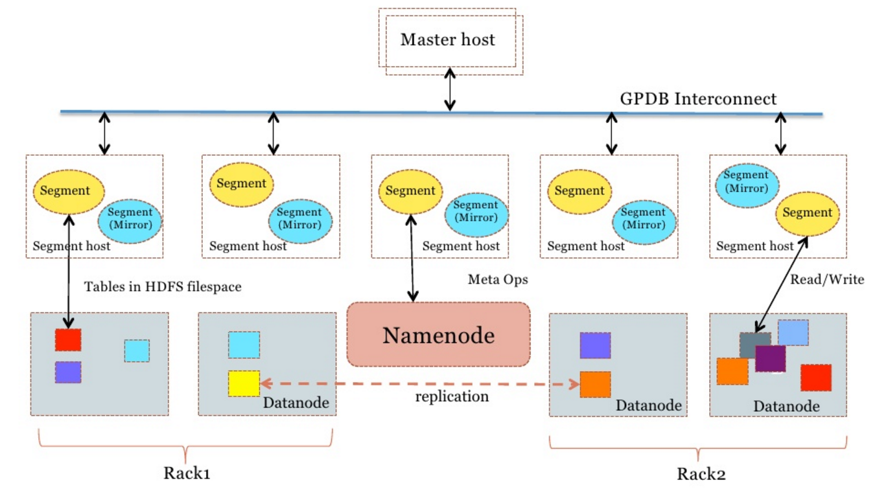

## CentOS 6.x x64 部署HAWQ    
          
### 作者         
digoal          
          
### 日期        
2016-08-31        
          
### 标签        
PostgreSQL , HAWQ    
          
----        
          
## 背景      
HAWQ与Greenplum师出同门，都是来自pivotal的分析型数据库产品，均以PostgreSQL为基础代码。  
  
**HAWQ与Greenplum相似之处**   
1\. 强大的SQL兼容性，SQL-92, SQL-99, SQL-2003, OLAP extension  
2\. ORCA查询优化器  
3\. MPP架构，节点间通过高速UDP互联  
4\. 支持多级数据分区，支持LIST，RANGE分区。  
5\. 支持gzip压缩  
6\. 支持python, perl, java, c/c++, R过程语言  
7\. 支持MADLib机器学习库  
8\. 支持丰富的BI工具 Tableau, SAS et al.    
9\. 标准的接口JDBC/ODBC  
10\. 以PostgreSQL为基础代码   
11\. 支持外部数据源（HAWQ称为PXF，目前支持HDFS,HIVE,HBASE）  
  
**HAWQ与Greenplum不同之处**     
1\. HAWQ的存储层剥离，支持create filesystem。      
2\. 数据交由HDFS进行管理，带来了一些好处，如支持动态分布，支持rank识别，主机识别等，而非全哈希分布，理论上可以比GP可以支持更大的集群。    
3\. 支持虚拟segment，计算时根据数据的分布动态启动虚拟的segment容器，实行运算。也支持根据数据量的大小，QUERY的复杂程度动态调整虚拟segment的多少。      
4\. 只支持数据追加，TRUNCATE；不支持update, delete操作。  Greenplum则同时支持update, delete操作。所以目前的vacuum其实只是针对系统表的操作。      
5\. 目前HAWQ还不支持PostGIS，而Greenplum支持。    
6\. 三级资源管理Integrate with YARN and hierarchical resource queues  
7\. 支持parquet列存储格式  
8\. 与HADOOP深度整合，HDFS存储层、资源管理(YARN)、部署(Ambari)。  
9\. 高效的 HDFS 和 YARN互联: libhdfs3 and libYARN  
10\. 支持snappy, zlib压缩算法，但是不支持quicklz算法。    
11\. 高效的新增和缩减节点，得益于HDFS    
12\. 因为hawq只有AO表，增量备份会比较好做  
13\. 结合HDFS，更容易做高可用，不需要管理segment的高可用，可以认为segment是无状态设备，数据副本的工作交给HDFS。  HAWQ只需要管好MASTER的高可用即可。    
14\. HAWQ暂时不支持索引，不支持普通表使用非HDFS表空间。    
  
**HAWQ 架构**    
  
  
  
**HAWQ 数据流**   
与Greenplum类似，支持外部数据源，同时支持从Master写入。  
一、数据来自外部数据源(PXF 架构)    
与Greenplum类似，目前支持3种外部数据源  
1\. gphdfs  
2\. hive  
3\. hbase  
二、数据从master写入  
  
**HAWQ 生态**  
HAWQ对接了Hadoop生态，将存储交给HDFS，hawq只负责计算。用户可以在其自有的HDFS之上很方便的构建HAWQ，作为查询引擎使用。  
    
目前HAWQ开源项目处于孵化状态，代码不如经历了多年商业化的Greenplum成熟。  
    
依托Hadoop生态，以强大的SQL支持为目标，满足Hadoop生态中大部分用户的SQL需求。  
    
**HAWQ & Greenplum 社区, 人才**  
hawq和greenplum的代码想通之处非常多，所以从人才角度来看，HAWQ和GP可以共用人才。  
  
**Greenplum如何吸取HAWQ的长处**  
1\. 引入主机分组，打破原有全哈希的数据分布。  
2\. 支持虚拟segment。  
  
## 安装HAWQ  
以CentOS 6.x x64主机为例  
  
依赖非常多，一步步来  
  
### gcc
#### gmp
https://gmplib.org/#DOWNLOAD  
  
```
cd ~
wget https://gmplib.org/download/gmp/gmp-6.1.1.tar.bz2
tar -jxvf gmp-6.1.1.tar.bz2
cd gmp-6.1.1
./configure --prefix=/home/digoal/app/gmp
make -j 32
make install

export LD_LIBRARY_PATH=/home/digoal/app/gmp/lib:$LD_LIBRARY_PATH
```
  
#### mpfr
http://www.mpfr.org/mpfr-current/#download  
  
```
cd ~
wget http://www.mpfr.org/mpfr-current/mpfr-3.1.4.tar.bz2
tar -jxvf mpfr-3.1.4.tar.bz2
cd mpfr-3.1.4
./configure --prefix=/home/digoal/app/mpfr --with-gmp-include=/home/digoal/app/gmp/include --with-gmp-lib=/home/digoal/app/gmp/lib
make -j 32 
make install

export LD_LIBRARY_PATH=/home/digoal/app/mpfr/lib:/home/digoal/app/gmp/lib:$LD_LIBRARY_PATH
```
  
#### mpc
http://www.multiprecision.org/  
  
```
cd ~
wget ftp://ftp.gnu.org/gnu/mpc/mpc-1.0.3.tar.gz
tar -zxvf mpc-1.0.3.tar.gz
cd mpc-1.0.3
./configure --prefix=/home/digoal/app/mpc --with-gmp=/home/digoal/app/gmp --with-mpfr=/home/digoal/app/mpfr
make -j 32
make install
export LD_LIBRARY_PATH=/home/digoal/app/mpc/lib:/home/digoal/app/mpfr/lib:/home/digoal/app/gmp/lib:$LD_LIBRARY_PATH
```
  
#### isl
```
cd ~
wget ftp://gcc.gnu.org/pub/gcc/infrastructure/isl-0.16.1.tar.bz2
tar -jxvf isl-0.16.1.tar.bz2
cd isl-0.16.1
./configure --prefix=/home/digoal/app/isl --with-gmp-prefix=/home/digoal/app/gmp
make -j 32
make install
export LD_LIBRARY_PATH=/home/digoal/app/isl/lib:/home/digoal/app/mpc/lib:/home/digoal/app/mpfr/lib:/home/digoal/app/gmp/lib:$LD_LIBRARY_PATH
```
  
#### cloog
http://www.cloog.org/  
  
```
cd ~
wget http://www.bastoul.net/cloog/pages/download/count.php3?url=./cloog-0.18.4.tar.gz
tar -zxvf cloog-0.18.4.tar.gz
cd cloog-0.18.4
./configure --prefix=/home/digoal/app/cloog --with-isl-prefix=/home/digoal/app/isl --with-gmp-prefix=/home/digoal/app/gmp
make -j 32
make install
export LD_LIBRARY_PATH=/home/digoal/app/cloog/lib:/home/digoal/app/isl/lib:/home/digoal/app/mpc/lib:/home/digoal/app/mpfr/lib:/home/digoal/app/gmp/lib:$LD_LIBRARY_PATH
export PATH=/home/digoal/app/cloog/bin:$PATH
```
  
#### gcc
https://gcc.gnu.org/gcc-4.9/  
  
```
wget http://gcc.skazkaforyou.com/releases/gcc-4.9.4/gcc-4.9.4.tar.bz2
tar -jxvf gcc-4.9.4.tar.bz2
cd gcc-4.9.4
LDFLAGS="-L/home/digoal/app/cloog/lib -L/home/digoal/app/mpc/lib -L/home/digoal/app/mpfr/lib -L/home/digoal/app/gmp/lib -L/home/digoal/app/isl/lib" ./configure --prefix=/home/digoal/app/gcc4.9.4 --with-mpc=/home/digoal/app/mpc --with-mpfr=/home/digoal/app/mpfr --with-gmp=/home/digoal/app/gmp --with-cloog=/home/digoal/app/cloog --with-isl=/home/digoal/app/isl --disable-isl-version-check --disable-multilib
make -j 32
make install
export LD_LIBRARY_PATH=/home/digoal/app/gcc4.9.4/lib:/home/digoal/app/gcc4.9.4/lib64:/home/digoal/app/cloog/lib:/home/digoal/app/isl/lib:/home/digoal/app/mpc/lib:/home/digoal/app/mpfr/lib:/home/digoal/app/gmp/lib:$LD_LIBRARY_PATH
export PATH=/home/digoal/app/gcc4.9.4/bin:/home/digoal/app/cloog/bin:$PATH
```
  
### cmake
```
cd ~
wget https://cmake.org/files/v3.6/cmake-3.6.1.tar.gz
tar -zxvf cmake-3.6.1.tar.gz
cd cmake-3.6.1
./configure --parallel=32 --prefix=/home/digoal/app/cmake
make -j 32
make install

export PATH=/home/digoal/app/cmake/bin:/home/digoal/app/gcc4.9.4/bin:/home/digoal/app/cloog/bin:$PATH
```
  
### json-c-devl
```
cd ~
wget http://oss.metaparadigm.com/json-c/json-c-0.9.tar.gz
tar -zxvf json-c-0.9.tar.gz
cd json-c-0.9
./configure --prefix=/home/digoal/app/json-c-devel 
make
make install
ln -s /home/digoal/app/json-c-devel/include/json /home/digoal/app/json-c-devel/include/json-c

export LD_LIBRARY_PATH=/home/digoal/app/json-c-devel/lib:/home/digoal/app/gcc4.9.4/lib:/home/digoal/app/gcc4.9.4/lib64:/home/digoal/app/cloog/lib:/home/digoal/app/isl/lib:/home/digoal/app/mpc/lib:/home/digoal/app/mpfr/lib:/home/digoal/app/gmp/lib:$LD_LIBRARY_PATH
```
  
### boost
```
cd ~
wget http://sourceforge.net/projects/boost/files/boost/1.56.0/boost_1_56_0.tar.bz2
tar -jxvf boost_1_56_0.tar.bz2
cd boost_1_56_0
./bootstrap.sh --prefix=/home/digoal/app/boost
./b2 --prefix=/home/digoal/app/boost link=static runtime-link=static variant=release
./b2 install
export LD_LIBRARY_PATH=/home/digoal/boost_1_56_0/stage/lib:/home/digoal/app/json-c-devel/lib:/home/digoal/app/gcc4.9.4/lib:/home/digoal/app/gcc4.9.4/lib64:/home/digoal/app/cloog/lib:/home/digoal/app/isl/lib:/home/digoal/app/mpc/lib:/home/digoal/app/mpfr/lib:/home/digoal/app/gmp/lib:$LD_LIBRARY_PATH
export PATH=/home/digoal/boost_1_56_0/stage/bin:/home/digoal/app/cmake/bin:/home/digoal/app/gcc4.9.4/bin:/home/digoal/app/cloog/bin:$PATH
```
  
### thrift
```
cd ~
wget http://archive.apache.org/dist/thrift/0.9.1/thrift-0.9.1.tar.gz
tar -zxvf thrift-0.9.1.tar.gz
cd thrift-0.9.1
./configure --prefix=/home/digoal/app/thrift --with-boost=/home/digoal/app/boost --without-tests
make -j 32
sudo make install
export LD_LIBRARY_PATH=/home/digoal/app/thrift/lib:/home/digoal/boost_1_56_0/stage/lib:/home/digoal/app/json-c-devel/lib:/home/digoal/app/gcc4.9.4/lib:/home/digoal/app/gcc4.9.4/lib64:/home/digoal/app/cloog/lib:/home/digoal/app/isl/lib:/home/digoal/app/mpc/lib:/home/digoal/app/mpfr/lib:/home/digoal/app/gmp/lib:$LD_LIBRARY_PATH
export PATH=/home/digoal/app/thrift/bin:/home/digoal/boost_1_56_0/stage/bin:/home/digoal/app/cmake/bin:/home/digoal/app/gcc4.9.4/bin:/home/digoal/app/cloog/bin:$PATH
```
  
### protobuf
```
sudo
# yum install -y autoconf automake libtool curl make gcc-c++ unzip

cd ~
git clone https://github.com/google/protobuf
cd protobuf
git checkout 3.0.0-GA
./autogen.sh
./configure --prefix=/home/digoal/app/protobuf 
make -j 32
make check -j 32
make install
export LD_LIBRARY_PATH=/home/digoal/app/protobuf/lib:/home/digoal/app/thrift/lib:/home/digoal/boost_1_56_0/stage/lib:/home/digoal/app/json-c-devel/lib:/home/digoal/app/gcc4.9.4/lib:/home/digoal/app/gcc4.9.4/lib64:/home/digoal/app/cloog/lib:/home/digoal/app/isl/lib:/home/digoal/app/mpc/lib:/home/digoal/app/mpfr/lib:/home/digoal/app/gmp/lib:$LD_LIBRARY_PATH
export PATH=/home/digoal/app/protobuf/bin:/home/digoal/app/thrift/bin:/home/digoal/boost_1_56_0/stage/bin:/home/digoal/app/cmake/bin:/home/digoal/app/gcc4.9.4/bin:/home/digoal/app/cloog/bin:$PATH
```
  
### curl
```
cd ~
wget https://curl.haxx.se/download/curl-7.44.0.tar.gz
tar -zxvf curl-7.44.0.tar.gz
cd curl-7.44.0
./configure --prefix=/home/digoal/app/curl
make -j 32
make install -j 32
export LD_LIBRARY_PATH=/home/digoal/app/curl/lib:/home/digoal/app/protobuf/lib:/home/digoal/app/thrift/lib:/home/digoal/boost_1_56_0/stage/lib:/home/digoal/app/json-c-devel/lib:/home/digoal/app/gcc4.9.4/lib:/home/digoal/app/gcc4.9.4/lib64:/home/digoal/app/cloog/lib:/home/digoal/app/isl/lib:/home/digoal/app/mpc/lib:/home/digoal/app/mpfr/lib:/home/digoal/app/gmp/lib:$LD_LIBRARY_PATH
export PATH=/home/digoal/app/curl/bin:/home/digoal/app/protobuf/bin:/home/digoal/app/thrift/bin:/home/digoal/boost_1_56_0/stage/bin:/home/digoal/app/cmake/bin:/home/digoal/app/gcc4.9.4/bin:/home/digoal/app/cloog/bin:$PATH
```
  
### JDK
```
cd ~
http://www.oracle.com/technetwork/java/javase/downloads/jdk8-downloads-2133151.html
get   
Java SE Development Kit 8u102
Linux x64	173.03 MB  	jdk-8u102-linux-x64.tar.gz

tar -zxvf jdk-8u102-linux-x64.tar.gz
mv jdk1.8.0_102 /home/digoal/app/

export JAVA_HOME=/home/digoal/app/jdk1.8.0_102
```
  
### apache-maven
http://maven.apache.org/download.cgi  
  
```
wget http://mirrors.cnnic.cn/apache/maven/maven-3/3.3.9/binaries/apache-maven-3.3.9-bin.tar.gz
tar -zxvf apache-maven-3.3.9-bin.tar.gz
mv apache-maven-3.3.9 /home/digoal/app/

export LD_LIBRARY_PATH=/home/digoal/app/apache-maven-3.3.9/lib:/home/digoal/app/curl/lib:/home/digoal/app/protobuf/lib:/home/digoal/app/thrift/lib:/home/digoal/boost_1_56_0/stage/lib:/home/digoal/app/json-c-devel/lib:/home/digoal/app/gcc4.9.4/lib:/home/digoal/app/gcc4.9.4/lib64:/home/digoal/app/cloog/lib:/home/digoal/app/isl/lib:/home/digoal/app/mpc/lib:/home/digoal/app/mpfr/lib:/home/digoal/app/gmp/lib:$LD_LIBRARY_PATH

export PATH=/home/digoal/app/apache-maven-3.3.9/bin:/home/digoal/app/curl/bin:/home/digoal/app/protobuf/bin:/home/digoal/app/thrift/bin:/home/digoal/boost_1_56_0/stage/bin:/home/digoal/app/cmake/bin:/home/digoal/app/gcc4.9.4/bin:/home/digoal/app/cloog/bin:$PATH
```
  
```
or you can  
-------------
cd ~
sudo
# wget http://repos.fedorapeople.org/repos/dchen/apache-maven/epel-apache-maven.repo -O /etc/yum.repos.d/epel-apache-maven.repo
# sed -i s/\$releasever/6/g /etc/yum.repos.d/epel-apache-maven.repo
# yum install -y apache-maven
--------------
```
  
### python pip paramiko pycrypto
```
cd ~
wget https://www.python.org/ftp/python/2.7.12/Python-2.7.12.tgz
tar -zxvf Python-2.7.12.tgz
cd Python-2.7.12
./configure --prefix=/home/digoal/app/python2.7 --enable-shared
make -j 32
make install

export LD_LIBRARY_PATH=/home/digoal/app/python2.7/lib:/home/digoal/app/apache-maven-3.3.9/lib:/home/digoal/app/curl/lib:/home/digoal/app/protobuf/lib:/home/digoal/app/thrift/lib:/home/digoal/boost_1_56_0/stage/lib:/home/digoal/app/json-c-devel/lib:/home/digoal/app/gcc4.9.4/lib:/home/digoal/app/gcc4.9.4/lib64:/home/digoal/app/cloog/lib:/home/digoal/app/isl/lib:/home/digoal/app/mpc/lib:/home/digoal/app/mpfr/lib:/home/digoal/app/gmp/lib:$LD_LIBRARY_PATH

export PATH=/home/digoal/app/python2.7/bin:/home/digoal/app/apache-maven-3.3.9/bin:/home/digoal/app/curl/bin:/home/digoal/app/protobuf/bin:/home/digoal/app/thrift/bin:/home/digoal/boost_1_56_0/stage/bin:/home/digoal/app/cmake/bin:/home/digoal/app/gcc4.9.4/bin:/home/digoal/app/cloog/bin:$PATH
```
  
sudo   
```
export LD_LIBRARY_PATH=/home/digoal/app/python2.7/lib:/home/digoal/app/apache-maven-3.3.9/lib:/home/digoal/app/curl/lib:/home/digoal/app/protobuf/lib:/home/digoal/app/thrift/lib:/home/digoal/boost_1_56_0/stage/lib:/home/digoal/app/json-c-devel/lib:/home/digoal/app/gcc4.9.4/lib:/home/digoal/app/gcc4.9.4/lib64:/home/digoal/app/cloog/lib:/home/digoal/app/isl/lib:/home/digoal/app/mpc/lib:/home/digoal/app/mpfr/lib:/home/digoal/app/gmp/lib:$LD_LIBRARY_PATH
export PATH=/home/digoal/app/python2.7/bin:/home/digoal/app/apache-maven-3.3.9/bin:/home/digoal/app/curl/bin:/home/digoal/app/protobuf/bin:/home/digoal/app/thrift/bin:/home/digoal/boost_1_56_0/stage/bin:/home/digoal/app/cmake/bin:/home/digoal/app/gcc4.9.4/bin:/home/digoal/app/cloog/bin:$PATH

# vi ~/.pip/pip.conf
[global]
trusted-host=mirrors.aliyun.com
index-url=http://mirrors.aliyun.com/pypi/simple/

wget https://bootstrap.pypa.io/get-pip.py

sudo python get-pip.py

sudo pip --retries=50 --timeout=300 install simplejson unittest2 pycrypto pygresql pyyaml lockfile paramiko psi

sudo pip --retries=50 --timeout=300 install http://darcs.idyll.org/~t/projects/figleaf-0.6.1.tar.gz

sudo pip --retries=50 --timeout=300 install http://sourceforge.net/projects/pychecker/files/pychecker/0.8.19/pychecker-0.8.19.tar.gz
```
  
### yum 
```
yum install --skip-broken -y texlive-latex libgfortran gcc-gfortran make gperf snappy-devel bzip2-devel libevent-devel libuuid-devel libgsasl-devel libxml2-devel readline-devel openssl-devel bison apr-devel libyaml-devel flex lcov libesmtp-devel
```
  
## os
```
mkdir -p /data01/corefiles

chmod 777 /data01/corefiles


vi /etc/sysctl.conf

# add by digoal.zhou
fs.aio-max-nr = 1048576
fs.file-max = 76724600
kernel.core_pattern= /data01/corefiles/core_%e_%u_%t_%s.%p         # /data01/corefiles事先建好，权限777
kernel.sem = 4096 2147483647 2147483646 512000    # 信号量, ipcs -l 或 -u 查看，每16个进程一组，每组信号量需要17个信号量。
kernel.shmall = 107374182      # 所有共享内存段相加大小限制(建议内存的80%)
kernel.shmmax = 274877906944   # 最大单个共享内存段大小(建议为内存一半), >9.2的版本已大幅降低共享内存的使用
kernel.shmmni = 819200         # 一共能生成多少共享内存段，每个PG数据库集群至少2个共享内存段
net.core.netdev_max_backlog = 10000
net.core.rmem_default = 262144       # The default setting of the socket receive buffer in bytes.
net.core.rmem_max = 4194304          # The maximum receive socket buffer size in bytes
net.core.wmem_default = 262144       # The default setting (in bytes) of the socket send buffer.
net.core.wmem_max = 4194304          # The maximum send socket buffer size in bytes.
net.core.somaxconn = 4096
net.ipv4.tcp_max_syn_backlog = 4096
net.ipv4.tcp_keepalive_intvl = 20
net.ipv4.tcp_keepalive_probes = 3
net.ipv4.tcp_keepalive_time = 60
net.ipv4.tcp_mem = 8388608 12582912 16777216
net.ipv4.tcp_fin_timeout = 5
net.ipv4.tcp_synack_retries = 2
net.ipv4.tcp_syncookies = 1    # 开启SYN Cookies。当出现SYN等待队列溢出时，启用cookie来处理，可防范少量的SYN攻击
net.ipv4.tcp_timestamps = 1    # 减少time_wait
net.ipv4.tcp_tw_recycle = 0    # 如果=1则开启TCP连接中TIME-WAIT套接字的快速回收，但是NAT环境可能导致连接失败，建议服务端关闭它
net.ipv4.tcp_tw_reuse = 1      # 开启重用。允许将TIME-WAIT套接字重新用于新的TCP连接
net.ipv4.tcp_max_tw_buckets = 262144
net.ipv4.tcp_rmem = 8192 87380 16777216
net.ipv4.tcp_wmem = 8192 65536 16777216
net.nf_conntrack_max = 1200000
net.netfilter.nf_conntrack_max = 1200000
vm.dirty_background_bytes = 4096000000       #  系统脏页到达这个值，系统后台刷脏页调度进程 pdflush（或其他） 自动将(dirty_expire_centisecs/100）秒前的脏页刷到磁盘
vm.dirty_expire_centisecs = 6000             #  比这个值老的脏页，将被刷到磁盘。6000表示60秒。
vm.dirty_ratio = 80                          #  如果系统进程刷脏页太慢，使得系统脏页超过内存 80 % 时，则用户进程如果有写磁盘的操作（如fsync, fdatasync等调用），则需要主动把系统脏页刷出。
vm.dirty_writeback_centisecs = 50            #  pdflush（或其他）后台刷脏页进程的唤醒间隔， 50表示0.5秒。
vm.extra_free_kbytes = 4096000
vm.min_free_kbytes = 2097152
vm.mmap_min_addr = 65536
vm.overcommit_memory = 0     #  在分配内存时，允许少量over malloc
vm.overcommit_ratio = 90     #  当overcommit_memory = 2 时，用于参与计算允许指派的内存大小。
vm.swappiness = 0            #  关闭交换分区
vm.zone_reclaim_mode = 0     # 禁用 numa, 或者在vmlinux中禁止.
net.ipv4.ip_local_port_range = 40000 65535    # 本地自动分配的TCP, UDP端口号范围

sysctl -p

vi /etc/security/limits.conf
* soft    nofile  1024000
* hard    nofile  1024000
* soft    nproc   unlimited
* hard    nproc   unlimited
* soft    core    unlimited
* hard    core    unlimited
* soft    memlock unlimited
* hard    memlock unlimited

rm -f /etc/security/limits.d/90-nproc.conf
```
  
## hadoop
```
cd ~
https://hadoop.apache.org/docs/stable/hadoop-project-dist/hadoop-common/SingleCluster.html  

http://apache.fayea.com/hadoop/common/stable/  

wget http://apache.fayea.com/hadoop/common/stable/hadoop-2.7.3.tar.gz
tar -zxvf hadoop-2.7.3.tar.gz
mv hadoop-2.7.3 /home/digoal/app/
cd /home/digoal/app/hadoop-2.7.3

$ bin/hadoop
Usage: hadoop [--config confdir] [COMMAND | CLASSNAME]
  CLASSNAME            run the class named CLASSNAME
 or
  where COMMAND is one of:
  fs                   run a generic filesystem user client
  version              print the version
  jar <jar>            run a jar file
                       note: please use "yarn jar" to launch
                             YARN applications, not this command.
  checknative [-a|-h]  check native hadoop and compression libraries availability
  distcp <srcurl> <desturl> copy file or directories recursively
  archive -archiveName NAME -p <parent path> <src>* <dest> create a hadoop archive
  classpath            prints the class path needed to get the
  credential           interact with credential providers
                       Hadoop jar and the required libraries
  daemonlog            get/set the log level for each daemon
  trace                view and modify Hadoop tracing settings

Most commands print help when invoked w/o parameters.
```
  
### hdfs
```
vi etc/hadoop/core-site.xml
<configuration>
    <property>
        <name>fs.defaultFS</name>
        <value>hdfs://localhost:8020</value>
    </property>
    <property>
        <name>ipc.client.connection.maxidletime</name>
        <value>3600000</value>
    </property>
    <property>
        <name>ipc.client.connect.timeout</name>
        <value>300000</value>
    </property>
    <property>
        <name>ipc.server.listen.queue.size</name>
        <value>3300</value>
    </property>
    <property>
        <name>hadoop.tmp.dir</name>
        <value>file:/u01/digoal/hadoop/tmp</value>
        <description>Abase for other temporary   directories.</description>
    </property>
</configuration>


vi etc/hadoop/hdfs-site.xml
<configuration>
    <property>
        <name>dfs.replication</name>
        <value>1</value>
    </property>
    <property>
        <name>dfs.allow.truncate</name>
        <value>true</value>
    </property>
    <property>
        <name>dfs.block.access.token.enable</name>
        <value>false</value>
    </property>
    <property>
        <name>dfs.block.local-path-access.user</name>
        <value>gpadmin</value>
    </property>
    <property>
        <name>dfs.client.socket-timeout</name>
        <value>300000000</value>
    </property>
    <property>
        <name>dfs.client.use.legacy.blockreader.local</name>
        <value>false</value>
    </property>
    <property>
        <name>dfs.datanode.data.dir.perm</name>
        <value>750</value>
    </property>
    <property>
        <name>dfs.datanode.handler.count</name>
        <value>60</value>
    </property>
    <property>
        <name>dfs.datanode.max.transfer.threads</name>
        <value>40960</value>
    </property>
    <property>
        <name>dfs.datanode.socket.write.timeout</name>
        <value>7200000</value>
    </property>
    <property>
        <name>dfs.namenode.accesstime.precision</name>
        <value>0</value>
    </property>
    <property>
        <name>dfs.namenode.handler.count</name>
        <value>600</value>
    </property>
    <property>
        <name>dfs.support.append</name>
        <value>true</value>
    </property>
    <property>
         <name>dfs.namenode.name.dir</name>
         <value>file:/u01/digoal/hadoop/dfs/name</value>
    </property>
    <property>
         <name>dfs.datanode.data.dir</name>
         <value>file:/u01/digoal/hadoop/dfs/data</value>
    </property>
</configuration>

不建议  
/*
    <property>
        <name>dfs.client.read.shortcircuit</name>
        <value>true</value>
    </property>
    <property>
        <name>dfs.domain.socket.path</name>
        <value>/u01/digoal/hadoop/sock</value>
    </property>
*/

# mkdir -p /u01/digoal/hadoop/dfs/name
# mkdir -p /u01/digoal/hadoop/dfs/data
# mkdir -p /u01/digoal/hadoop/sock
# mkdir -p /u01/digoal/hadoop/tmp
# chown -R digoal /u01/digoal
# chown root:root /


$ cd ~
$ ssh-keygen -t dsa -P '' -f ~/.ssh/id_dsa
$ cat ~/.ssh/id_dsa.pub >> ~/.ssh/authorized_keys
$ chmod 0600 ~/.ssh/authorized_keys
$ ssh localhost date
Wed Aug 31 10:56:24 CST 2016


$ bin/hdfs namenode -format


$ vi etc/hadoop/hadoop-env.sh
#export JAVA_HOME=${JAVA_HOME}
export JAVA_HOME=/home/digoal/app/jdk1.8.0_102
export HADOOP_HOME=/home/digoal/app/hadoop-2.7.3


$ sbin/start-dfs.sh
Starting namenodes on [localhost]
localhost: starting namenode, logging to /u01/digoal/digoal/app/hadoop-2.7.3/logs/hadoop-digoal-namenode-digoal_host.tbc.out
localhost: starting datanode, logging to /u01/digoal/digoal/app/hadoop-2.7.3/logs/hadoop-digoal-datanode-digoal_host.tbc.out
Starting secondary namenodes [0.0.0.0]
0.0.0.0: starting secondarynamenode, logging to /u01/digoal/digoal/app/hadoop-2.7.3/logs/hadoop-digoal-secondarynamenode-digoal_host.tbc.out


$ bin/hdfs dfsadmin -report
Configured Capacity: 3349820674048 (3.05 TB)
Present Capacity: 3095417356288 (2.82 TB)
DFS Remaining: 3095417331712 (2.82 TB)
DFS Used: 24576 (24 KB)
DFS Used%: 0.00%
Under replicated blocks: 0
Blocks with corrupt replicas: 0
Missing blocks: 0
Missing blocks (with replication factor 1): 0

-------------------------------------------------
Live datanodes (1):

Name: xxx.xxx.xxx.xxx:50010 (digoal_host.tbc)
Hostname: digoal_host.tbc
Decommission Status : Normal
Configured Capacity: 3349820674048 (3.05 TB)
DFS Used: 24576 (24 KB)
Non DFS Used: 254403317760 (236.93 GB)
DFS Remaining: 3095417331712 (2.82 TB)
DFS Used%: 0.00%
DFS Remaining%: 92.41%
Configured Cache Capacity: 0 (0 B)
Cache Used: 0 (0 B)
Cache Remaining: 0 (0 B)
Cache Used%: 100.00%
Cache Remaining%: 0.00%
Xceivers: 1
Last contact: Thu Sep 01 14:05:59 CST 2016


view http://xxx.xxx.xxx.xxx:50070/


test
$ bin/hdfs dfs -mkdir -p /user
$ bin/hdfs dfs -put /home/digoal/apache-maven-3.3.9-bin.tar.gz /usr
put: file /usr._COPYING_ on client 127.0.0.1.

```
  
### yarn
如果需要使用它来做资源管理的话，需要安装YARN  
  
YARN is only needed when you want to use YARN as the global resource manager  
  
```
$ cp etc/hadoop/mapred-site.xml.template etc/hadoop/mapred-site.xml
$ vi etc/hadoop/mapred-site.xml

<configuration>
    <property>
        <name>mapreduce.framework.name</name>
        <value>yarn</value>
    </property>
</configuration>

$ vi etc/hadoop/yarn-site.xml
<configuration>
    <property>
        <name>yarn.nodemanager.aux-services</name>
        <value>mapreduce_shuffle</value>
    </property>
</configuration>

$ sbin/start-yarn.sh
starting yarn daemons
starting resourcemanager, logging to /u01/digoal/digoal/app/hadoop-2.7.3/logs/yarn-digoal-resourcemanager-digoal_host.tbc.out
localhost: starting nodemanager, logging to /u01/digoal/digoal/app/hadoop-2.7.3/logs/yarn-digoal-nodemanager-digoal_host.tbc.out


view http://xxx.xxx.xxx.xxx:8088/
```
  
## R
```
cd ~
wget http://zlib.net/zlib-1.2.8.tar.gz
tar -zxvf zlib-1.2.8.tar.gz
cd zlib-1.2.8
./configure --prefix=/home/digoal/app/zlib --64 
make
make install


cd ~
wget http://www.bzip.org/1.0.6/bzip2-1.0.6.tar.gz
tar -zxvf bzip2-1.0.6.tar.gz
cd bzip2-1.0.6
vi Makefile
CFLAGS=-fPIC -Wall -Winline -O2 -g $(BIGFILES)

make
make install PREFIX=/home/digoal/app/bzip2


cd ~
wget http://tukaani.org/xz/xz-5.2.2.tar.gz
tar -zxvf xz-5.2.2.tar.gz
cd xz-5.2.2
./configure --prefix=/home/digoal/app/xz
make -j 32
make install


cd ~
wget http://downloads.sourceforge.net/project/pcre/pcre/8.39/pcre-8.39.tar.bz2?r=https%3A%2F%2Fsourceforge.net%2Fprojects%2Fpcre%2Ffiles%2Fpcre%2F8.39%2F&ts=1472619017&use_mirror=ncu
tar -jxvf pcre-8.39.tar.bz2
cd pcre-8.39
./configure --prefix=/home/digoal/app/pcre --enable-utf8
make -j 32
make install


cd ~
wget http://ftp.gnu.org/gnu/texinfo/texinfo-6.1.tar.gz
tar -zxvf texinfo-6.1.tar.gz
cd texinfo-6.1
./configure --prefix=/home/digoal/app/texinfo
make -j 32
make install


cd ~
wget http://mirror.ctan.org/systems/texlive/tlnet/install-tl-unx.tar.gz
tar -zxvf install-tl-unx.tar.gz
cd install-tl-20160830
./install-tl 

 a [X] Essential programs and files      A [ ] Indic scripts                   
 b [ ] BibTeX additional styles          B [ ] Italian                         
 c [ ] TeX auxiliary programs            C [ ] Japanese                        
 d [ ] ConTeXt and packages              D [ ] Korean                          
 e [ ] Additional fonts                  E [ ] Other languages                 
 f [X] Recommended fonts                 F [ ] Polish                          
 g [ ] Graphics and font utilities       G [ ] Portuguese                      
 h [ ] Additional formats                H [ ] Spanish                         
 i [ ] Games typesetting                 I [X] LaTeX fundamental packages      
 j [ ] Generic additional packages       J [ ] LaTeX additional packages       
 k [ ] Generic recommended packages      K [ ] LaTeX recommended packages      
 l [X] HTML/SGML/XML support             L [ ] LuaTeX packages                 
 m [ ] Humanities packages               M [ ] Mathematics packages            
 n [ ] African scripts                   N [ ] MetaPost and Metafont packages  
 o [ ] Arabic                            O [ ] Music packages                  
 p [ ] Chinese                           P [ ] Omega packages                  
 s [ ] Chinese/Japanese/Korean (base)    S [ ] Graphics, pictures, diagrams    
 t [ ] Cyrillic                          T [ ] Plain TeX packages              
 u [ ] Czech/Slovak                      U [ ] PSTricks                        
 v [X] US and UK English                 V [ ] Publisher styles, theses, etc.  
 w [ ] Other European languages          W [ ] Natural and computer sciences   
 x [ ] French                            X [ ] Windows-only support programs   
 y [ ] German                            Y [ ] XeTeX and packages              
 z [ ] Greek                            
 Z [ ] TeXworks editor; TL includes only the Windows binary


 <1> TEXDIR:       /home/digoal/app/texlive
     support tree: /home/digoal/app/texlive/texmf-dist

 <2> TEXMFLOCAL:     /home/digoal/app/texlive/texmf-local
 <3> TEXMFSYSVAR:    /home/digoal/app/texlive/texmf-var
 <4> TEXMFSYSCONFIG: /home/digoal/app/texlive/texmf-config

 <5> TEXMFVAR:       ~/.texlive2016/texmf-var
 <6> TEXMFCONFIG:    ~/.texlive2016/texmf-config
 <7> TEXMFHOME:      /home/digoal/app/texlive/texmf


mkdir /home/digoal/app/texlive/texmf


export LD_LIBRARY_PATH=/home/digoal/app/texinfo/lib:/home/digoal/app/pcre/lib:/home/digoal/app/xz/lib:/home/digoal/app/bzip2/lib:/home/digoal/app/zlib/lib:/home/digoal/app/python2.7/lib:/home/digoal/app/apache-maven-3.3.9/lib:/home/digoal/app/curl/lib:/home/digoal/app/protobuf/lib:/home/digoal/app/thrift/lib:/home/digoal/boost_1_56_0/stage/lib:/home/digoal/app/json-c-devel/lib:/home/digoal/app/gcc4.9.4/lib:/home/digoal/app/gcc4.9.4/lib64:/home/digoal/app/cloog/lib:/home/digoal/app/isl/lib:/home/digoal/app/mpc/lib:/home/digoal/app/mpfr/lib:/home/digoal/app/gmp/lib:$LD_LIBRARY_PATH

export PATH=/home/digoal/app/texlive/bin/x86_64-linux:/home/digoal/app/texinfo/bin:/home/digoal/app/pcre/bin:/home/digoal/app/xz/bin:/home/digoal/app/bzip2/bin:/home/digoal/app/python2.7/bin:/home/digoal/app/apache-maven-3.3.9/bin:/home/digoal/app/curl/bin:/home/digoal/app/protobuf/bin:/home/digoal/app/thrift/bin:/home/digoal/boost_1_56_0/stage/bin:/home/digoal/app/cmake/bin:/home/digoal/app/gcc4.9.4/bin:/home/digoal/app/cloog/bin:$PATH


cd ~
wget http://mirrors.ctan.org/fonts/inconsolata.zip
unzip inconsolata.zip
mv inconsolata/* /home/digoal/app/texlive/texmf/
mktexlsr /home/digoal/app/texlive/texmf


sudo yum install -y texinfo-tex texinfo


wget https://mirrors.tuna.tsinghua.edu.cn/CRAN/src/base/R-3/R-3.3.1.tar.gz
tar -zxvf R-3.3.1.tar.gz
cd R-3.3.1

CPPFLAGS="-I/home/digoal/app/pcre/include -I/home/digoal/app/xz/include -I/home/digoal/app/zlib/include -I/home/digoal/app/bzip2/include" LDFLAGS="-L/home/digoal/app/texinfo/lib -L/home/digoal/app/pcre/lib -L/home/digoal/app/xz/lib -L/home/digoal/app/bzip2/lib -L/home/digoal/app/zlib/lib" ./configure --prefix=/home/digoal/app/R --enable-R-shlib --enable-R-static-lib --with-x=no --with-libpth-prefix=/home/digoal/app/zlib --with-libpth-prefix=/home/digoal/app/bzip2 --with-libpth-prefix=/home/digoal/app/xz --with-libpth-prefix=/home/digoal/app/pcre --with-libpth-prefix=/home/digoal/app/texinfo 


make -j 32
make install all


export LD_LIBRARY_PATH=/home/digoal/app/R/lib64:/home/digoal/app/texinfo/lib:/home/digoal/app/pcre/lib:/home/digoal/app/xz/lib:/home/digoal/app/bzip2/lib:/home/digoal/app/zlib/lib:/home/digoal/app/python2.7/lib:/home/digoal/app/apache-maven-3.3.9/lib:/home/digoal/app/curl/lib:/home/digoal/app/protobuf/lib:/home/digoal/app/thrift/lib:/home/digoal/boost_1_56_0/stage/lib:/home/digoal/app/json-c-devel/lib:/home/digoal/app/gcc4.9.4/lib:/home/digoal/app/gcc4.9.4/lib64:/home/digoal/app/cloog/lib:/home/digoal/app/isl/lib:/home/digoal/app/mpc/lib:/home/digoal/app/mpfr/lib:/home/digoal/app/gmp/lib:$LD_LIBRARY_PATH

export PATH=/home/digoal/app/R/bin:/home/digoal/app/texlive/bin/x86_64-linux:/home/digoal/app/texinfo/bin:/home/digoal/app/pcre/bin:/home/digoal/app/xz/bin:/home/digoal/app/bzip2/bin:/home/digoal/app/python2.7/bin:/home/digoal/app/apache-maven-3.3.9/bin:/home/digoal/app/curl/bin:/home/digoal/app/protobuf/bin:/home/digoal/app/thrift/bin:/home/digoal/boost_1_56_0/stage/bin:/home/digoal/app/cmake/bin:/home/digoal/app/gcc4.9.4/bin:/home/digoal/app/cloog/bin:$PATH
```
  
## ORCA
貌似HAWQ是自己编译ORCA  
```
total 28
drwxr-xr-x  5 digoal users 4096 Aug 31 16:08 googletest
-rw-r--r--  1 digoal users   91 Aug 31 16:07 gporca.commit
-rw-r--r--  1 digoal users   89 Aug 31 16:07 gpos.commit
-rw-r--r--  1 digoal users   94 Aug 31 16:07 gp-xerces.commit
-rw-r--r--  1 digoal users   41 Aug 31 16:07 postgres.commit
-rw-r--r--  1 digoal users  374 Aug 31 16:07 README
drwxr-xr-x 14 digoal users 4096 Aug 31 17:11 thrift
```
  
### GPOS
```
cd ~
git clone https://github.com/greenplum-db/gpos
cd gpos
mkdir build
cd build
cmake -D CMAKE_BUILD_TYPE=RELEASE -D CMAKE_INSTALL_PREFIX=/home/digoal/app/gpos_home ../
make install

export LD_LIBRARY_PATH=/home/digoal/app/gpos_home/lib:/home/digoal/app/R/lib64:/home/digoal/app/texinfo/lib:/home/digoal/app/pcre/lib:/home/digoal/app/xz/lib:/home/digoal/app/bzip2/lib:/home/digoal/app/zlib/lib:/home/digoal/app/python2.7/lib:/home/digoal/app/apache-maven-3.3.9/lib:/home/digoal/app/curl/lib:/home/digoal/app/protobuf/lib:/home/digoal/app/thrift/lib:/home/digoal/boost_1_56_0/stage/lib:/home/digoal/app/json-c-devel/lib:/home/digoal/app/gcc4.9.4/lib:/home/digoal/app/gcc4.9.4/lib64:/home/digoal/app/cloog/lib:/home/digoal/app/isl/lib:/home/digoal/app/mpc/lib:/home/digoal/app/mpfr/lib:/home/digoal/app/gmp/lib:$LD_LIBRARY_PATH
```
  
### gp-xerces
```
cd ~
git clone https://github.com/greenplum-db/gp-xerces
cd gp-xerces
mkdir build
cd build
../configure --prefix=/home/digoal/app/gp-xerces_home
make -j 32
make install

export LD_LIBRARY_PATH=/home/digoal/app/gp-xerces_home/lib:/home/digoal/app/gpos_home/lib:/home/digoal/app/R/lib64:/home/digoal/app/texinfo/lib:/home/digoal/app/pcre/lib:/home/digoal/app/xz/lib:/home/digoal/app/bzip2/lib:/home/digoal/app/zlib/lib:/home/digoal/app/python2.7/lib:/home/digoal/app/apache-maven-3.3.9/lib:/home/digoal/app/curl/lib:/home/digoal/app/protobuf/lib:/home/digoal/app/thrift/lib:/home/digoal/boost_1_56_0/stage/lib:/home/digoal/app/json-c-devel/lib:/home/digoal/app/gcc4.9.4/lib:/home/digoal/app/gcc4.9.4/lib64:/home/digoal/app/cloog/lib:/home/digoal/app/isl/lib:/home/digoal/app/mpc/lib:/home/digoal/app/mpfr/lib:/home/digoal/app/gmp/lib:$LD_LIBRARY_PATH
export PATH=/home/digoal/app/gp-xerces_home/bin:/home/digoal/app/R/bin:/home/digoal/app/texlive/bin/x86_64-linux:/home/digoal/app/texinfo/bin:/home/digoal/app/pcre/bin:/home/digoal/app/xz/bin:/home/digoal/app/bzip2/bin:/home/digoal/app/python2.7/bin:/home/digoal/app/apache-maven-3.3.9/bin:/home/digoal/app/curl/bin:/home/digoal/app/protobuf/bin:/home/digoal/app/thrift/bin:/home/digoal/boost_1_56_0/stage/bin:/home/digoal/app/cmake/bin:/home/digoal/app/gcc4.9.4/bin:/home/digoal/app/cloog/bin:$PATH
```
  
### gporca
```
cd ~
git clone https://github.com/greenplum-db/gporca.git
cd gporca
mkdir build
cd build
cmake -D CMAKE_BUILD_TYPE=RELEASE \
-D CMAKE_INSTALL_PREFIX=/home/digoal/app/gporca_home \
-D GPOS_INCLUDE_DIR=/home/digoal/app/gpos_home/include \
-D GPOS_LIBRARY=/home/digoal/app/gpos_home/lib/libgpos.so \
-D XERCES_INCLUDE_DIR=/home/digoal/app/gp-xerces_home/include \
-D XERCES_LIBRARY=/home/digoal/app/gp-xerces_home/lib/libxerces-c.so ../
make -j 32
make install

export LD_LIBRARY_PATH=/home/digoal/app/gporca_home/lib:/home/digoal/app/gp-xerces_home/lib:/home/digoal/app/gpos_home/lib:/home/digoal/app/R/lib64:/home/digoal/app/texinfo/lib:/home/digoal/app/pcre/lib:/home/digoal/app/xz/lib:/home/digoal/app/bzip2/lib:/home/digoal/app/zlib/lib:/home/digoal/app/python2.7/lib:/home/digoal/app/apache-maven-3.3.9/lib:/home/digoal/app/curl/lib:/home/digoal/app/protobuf/lib:/home/digoal/app/thrift/lib:/home/digoal/boost_1_56_0/stage/lib:/home/digoal/app/json-c-devel/lib:/home/digoal/app/gcc4.9.4/lib:/home/digoal/app/gcc4.9.4/lib64:/home/digoal/app/cloog/lib:/home/digoal/app/isl/lib:/home/digoal/app/mpc/lib:/home/digoal/app/mpfr/lib:/home/digoal/app/gmp/lib:$LD_LIBRARY_PATH
```
  
## others
### gperf
```
cd ~
wget http://ftp.gnu.org/pub/gnu/gperf/gperf-3.0.4.tar.gz
tar -zxvf gperf-3.0.4.tar.gz
cd gperf-3.0.4
./configure --prefix=/home/digoal/app/gperf
make -j 32
make install

export PATH=/home/digoal/app/gperf/bin:/home/digoal/app/gp-xerces_home/bin:/home/digoal/app/R/bin:/home/digoal/app/texlive/bin/x86_64-linux:/home/digoal/app/texinfo/bin:/home/digoal/app/pcre/bin:/home/digoal/app/xz/bin:/home/digoal/app/bzip2/bin:/home/digoal/app/python2.7/bin:/home/digoal/app/apache-maven-3.3.9/bin:/home/digoal/app/curl/bin:/home/digoal/app/protobuf/bin:/home/digoal/app/thrift/bin:/home/digoal/boost_1_56_0/stage/bin:/home/digoal/app/cmake/bin:/home/digoal/app/gcc4.9.4/bin:/home/digoal/app/cloog/bin:$PATH
```
  
### snappy
```
cd ~
git clone https://github.com/google/snappy
cd snappy
./autogen.sh
./configure --prefix=/home/digoal/app/snappy
make -j 32
make install
export LD_LIBRARY_PATH=/home/digoal/app/snappy/lib:/home/digoal/app/gporca_home/lib:/home/digoal/app/gp-xerces_home/lib:/home/digoal/app/gpos_home/lib:/home/digoal/app/R/lib64:/home/digoal/app/texinfo/lib:/home/digoal/app/pcre/lib:/home/digoal/app/xz/lib:/home/digoal/app/bzip2/lib:/home/digoal/app/zlib/lib:/home/digoal/app/python2.7/lib:/home/digoal/app/apache-maven-3.3.9/lib:/home/digoal/app/curl/lib:/home/digoal/app/protobuf/lib:/home/digoal/app/thrift/lib:/home/digoal/boost_1_56_0/stage/lib:/home/digoal/app/json-c-devel/lib:/home/digoal/app/gcc4.9.4/lib:/home/digoal/app/gcc4.9.4/lib64:/home/digoal/app/cloog/lib:/home/digoal/app/isl/lib:/home/digoal/app/mpc/lib:/home/digoal/app/mpfr/lib:/home/digoal/app/gmp/lib:$LD_LIBRARY_PATH
```
  
### apr
```
cd ~
wget http://mirrors.cnnic.cn/apache//apr/apr-1.5.2.tar.bz2
tar -jxvf apr-1.5.2.tar.bz2
cd apr-1.5.2
./configure --prefix=/home/digoal/app/apr
make
make install

export LD_LIBRARY_PATH=/home/digoal/app/apr/lib:/home/digoal/app/snappy/lib:/home/digoal/app/gporca_home/lib:/home/digoal/app/gp-xerces_home/lib:/home/digoal/app/gpos_home/lib:/home/digoal/app/R/lib64:/home/digoal/app/texinfo/lib:/home/digoal/app/pcre/lib:/home/digoal/app/xz/lib:/home/digoal/app/bzip2/lib:/home/digoal/app/zlib/lib:/home/digoal/app/python2.7/lib:/home/digoal/app/apache-maven-3.3.9/lib:/home/digoal/app/curl/lib:/home/digoal/app/protobuf/lib:/home/digoal/app/thrift/lib:/home/digoal/boost_1_56_0/stage/lib:/home/digoal/app/json-c-devel/lib:/home/digoal/app/gcc4.9.4/lib:/home/digoal/app/gcc4.9.4/lib64:/home/digoal/app/cloog/lib:/home/digoal/app/isl/lib:/home/digoal/app/mpc/lib:/home/digoal/app/mpfr/lib:/home/digoal/app/gmp/lib:$LD_LIBRARY_PATH

export PATH=/home/digoal/app/apr/bin:/home/digoal/app/gperf/bin:/home/digoal/app/gp-xerces_home/bin:/home/digoal/app/R/bin:/home/digoal/app/texlive/bin/x86_64-linux:/home/digoal/app/texinfo/bin:/home/digoal/app/pcre/bin:/home/digoal/app/xz/bin:/home/digoal/app/bzip2/bin:/home/digoal/app/python2.7/bin:/home/digoal/app/apache-maven-3.3.9/bin:/home/digoal/app/curl/bin:/home/digoal/app/protobuf/bin:/home/digoal/app/thrift/bin:/home/digoal/boost_1_56_0/stage/bin:/home/digoal/app/cmake/bin:/home/digoal/app/gcc4.9.4/bin:/home/digoal/app/cloog/bin:$PATH
```
  
### automake
```
cd ~
wget http://ftp.gnu.org/gnu/autoconf/autoconf-2.69.tar.gz
tar -zxvf autoconf-2.69.tar.gz
cd autoconf-2.69
./configure --prefix=/home/digoal/app/autoconf
make -j 32
make install

export PATH=/home/digoal/app/autoconf/bin:/home/digoal/app/apr/bin:/home/digoal/app/gperf/bin:/home/digoal/app/gp-xerces_home/bin:/home/digoal/app/R/bin:/home/digoal/app/texlive/bin/x86_64-linux:/home/digoal/app/texinfo/bin:/home/digoal/app/pcre/bin:/home/digoal/app/xz/bin:/home/digoal/app/bzip2/bin:/home/digoal/app/python2.7/bin:/home/digoal/app/apache-maven-3.3.9/bin:/home/digoal/app/curl/bin:/home/digoal/app/protobuf/bin:/home/digoal/app/thrift/bin:/home/digoal/boost_1_56_0/stage/bin:/home/digoal/app/cmake/bin:/home/digoal/app/gcc4.9.4/bin:/home/digoal/app/cloog/bin:$PATH


cd ~
wget http://ftp.gnu.org/gnu/automake/automake-1.15.tar.gz
tar -zxvf automake-1.15.tar.gz
cd automake-1.15
./configure --prefix=/home/digoal/app/automake
make -j 32
make install

export PATH=/home/digoal/app/automake/bin:/home/digoal/app/autoconf/bin:/home/digoal/app/apr/bin:/home/digoal/app/gperf/bin:/home/digoal/app/gp-xerces_home/bin:/home/digoal/app/R/bin:/home/digoal/app/texlive/bin/x86_64-linux:/home/digoal/app/texinfo/bin:/home/digoal/app/pcre/bin:/home/digoal/app/xz/bin:/home/digoal/app/bzip2/bin:/home/digoal/app/python2.7/bin:/home/digoal/app/apache-maven-3.3.9/bin:/home/digoal/app/curl/bin:/home/digoal/app/protobuf/bin:/home/digoal/app/thrift/bin:/home/digoal/boost_1_56_0/stage/bin:/home/digoal/app/cmake/bin:/home/digoal/app/gcc4.9.4/bin:/home/digoal/app/cloog/bin:$PATH
```
  
### bison
```
cd ~
wget http://ftp.gnu.org/gnu/bison/bison-3.0.4.tar.gz
tar -zxvf bison-3.0.4.tar.gz
cd bison-3.0.4
./configure --prefix=/home/digoal/app/bison
make -j 32
make install

export PATH=/home/digoal/app/bison/bin:/home/digoal/app/automake/bin:/home/digoal/app/autoconf/bin:/home/digoal/app/apr/bin:/home/digoal/app/gperf/bin:/home/digoal/app/gp-xerces_home/bin:/home/digoal/app/R/bin:/home/digoal/app/texlive/bin/x86_64-linux:/home/digoal/app/texinfo/bin:/home/digoal/app/pcre/bin:/home/digoal/app/xz/bin:/home/digoal/app/bzip2/bin:/home/digoal/app/python2.7/bin:/home/digoal/app/apache-maven-3.3.9/bin:/home/digoal/app/curl/bin:/home/digoal/app/protobuf/bin:/home/digoal/app/thrift/bin:/home/digoal/boost_1_56_0/stage/bin:/home/digoal/app/cmake/bin:/home/digoal/app/gcc4.9.4/bin:/home/digoal/app/cloog/bin:$PATH

export LD_LIBRARY_PATH=/home/digoal/app/bison/lib:/home/digoal/app/apr/lib:/home/digoal/app/snappy/lib:/home/digoal/app/gporca_home/lib:/home/digoal/app/gp-xerces_home/lib:/home/digoal/app/gpos_home/lib:/home/digoal/app/R/lib64:/home/digoal/app/texinfo/lib:/home/digoal/app/pcre/lib:/home/digoal/app/xz/lib:/home/digoal/app/bzip2/lib:/home/digoal/app/zlib/lib:/home/digoal/app/python2.7/lib:/home/digoal/app/apache-maven-3.3.9/lib:/home/digoal/app/curl/lib:/home/digoal/app/protobuf/lib:/home/digoal/app/thrift/lib:/home/digoal/boost_1_56_0/stage/lib:/home/digoal/app/json-c-devel/lib:/home/digoal/app/gcc4.9.4/lib:/home/digoal/app/gcc4.9.4/lib64:/home/digoal/app/cloog/lib:/home/digoal/app/isl/lib:/home/digoal/app/mpc/lib:/home/digoal/app/mpfr/lib:/home/digoal/app/gmp/lib:$LD_LIBRARY_PATH
```
  
### make
```
cd ~
wget http://ftp.gnu.org/gnu/make/make-4.2.tar.bz2
tar -jxvf make-4.2.tar.bz2
cd make-4.2
./configure --prefix=/home/digoal/app/make
make -j 32
make install

export PATH=/home/digoal/app/make/bin:/home/digoal/app/bison/bin:/home/digoal/app/automake/bin:/home/digoal/app/autoconf/bin:/home/digoal/app/apr/bin:/home/digoal/app/gperf/bin:/home/digoal/app/gp-xerces_home/bin:/home/digoal/app/R/bin:/home/digoal/app/texlive/bin/x86_64-linux:/home/digoal/app/texinfo/bin:/home/digoal/app/pcre/bin:/home/digoal/app/xz/bin:/home/digoal/app/bzip2/bin:/home/digoal/app/python2.7/bin:/home/digoal/app/apache-maven-3.3.9/bin:/home/digoal/app/curl/bin:/home/digoal/app/protobuf/bin:/home/digoal/app/thrift/bin:/home/digoal/boost_1_56_0/stage/bin:/home/digoal/app/cmake/bin:/home/digoal/app/gcc4.9.4/bin:/home/digoal/app/cloog/bin:$PATH

export LD_LIBRARY_PATH=/home/digoal/app/bison/lib:/home/digoal/app/apr/lib:/home/digoal/app/snappy/lib:/home/digoal/app/gporca_home/lib:/home/digoal/app/gp-xerces_home/lib:/home/digoal/app/gpos_home/lib:/home/digoal/app/R/lib64:/home/digoal/app/texinfo/lib:/home/digoal/app/pcre/lib:/home/digoal/app/xz/lib:/home/digoal/app/bzip2/lib:/home/digoal/app/zlib/lib:/home/digoal/app/python2.7/lib:/home/digoal/app/apache-maven-3.3.9/lib:/home/digoal/app/curl/lib:/home/digoal/app/protobuf/lib:/home/digoal/app/thrift/lib:/home/digoal/boost_1_56_0/stage/lib:/home/digoal/app/json-c-devel/lib:/home/digoal/app/gcc4.9.4/lib:/home/digoal/app/gcc4.9.4/lib64:/home/digoal/app/cloog/lib:/home/digoal/app/isl/lib:/home/digoal/app/mpc/lib:/home/digoal/app/mpfr/lib:/home/digoal/app/gmp/lib:$LD_LIBRARY_PATH
```
  
## hawq
\# The Apache HAWQ source code can be obtained from the the following link: 
\# Apache Repo: https://git-wip-us.apache.org/repos/asf/incubator-hawq.git or 
\# GitHub Mirror: https://github.com/apache/incubator-hawq 
  
```
git clone https://git-wip-us.apache.org/repos/asf/incubator-hawq.git

CODE_BASE=`pwd`/incubator-hawq
 
cd $CODE_BASE
```
  
### libhdfs3
```
cd ~
wget ftp://ftp.gnu.org/gnu/gsasl/libgsasl-1.8.0.tar.gz
tar -zxvf libgsasl-1.8.0.tar.gz
cd libgsasl-1.8.0
./configure --prefix=/home/digoal/app/sasl
make -j 32
make install

git clone https://github.com/google/googletest
cd googletest
mkdir build
cd build
cmake -DCMAKE_INSTALL_PREFIX:PATH=/home/digoal/app/google ..
make -j 32
make install


export PATH=/home/digoal/app/make/bin:/home/digoal/app/bison/bin:/home/digoal/app/automake/bin:/home/digoal/app/autoconf/bin:/home/digoal/app/apr/bin:/home/digoal/app/gperf/bin:/home/digoal/app/gp-xerces_home/bin:/home/digoal/app/R/bin:/home/digoal/app/texlive/bin/x86_64-linux:/home/digoal/app/texinfo/bin:/home/digoal/app/pcre/bin:/home/digoal/app/xz/bin:/home/digoal/app/bzip2/bin:/home/digoal/app/python2.7/bin:/home/digoal/app/apache-maven-3.3.9/bin:/home/digoal/app/curl/bin:/home/digoal/app/protobuf/bin:/home/digoal/app/thrift/bin:/home/digoal/boost_1_56_0/stage/bin:/home/digoal/app/cmake/bin:/home/digoal/app/gcc4.9.4/bin:/home/digoal/app/cloog/bin:$PATH

export LD_LIBRARY_PATH=/home/digoal/app/google/lib:/home/digoal/app/sasl/lib:/home/digoal/app/bison/lib:/home/digoal/app/apr/lib:/home/digoal/app/snappy/lib:/home/digoal/app/gporca_home/lib:/home/digoal/app/gp-xerces_home/lib:/home/digoal/app/gpos_home/lib:/home/digoal/app/R/lib64:/home/digoal/app/texinfo/lib:/home/digoal/app/pcre/lib:/home/digoal/app/xz/lib:/home/digoal/app/bzip2/lib:/home/digoal/app/zlib/lib:/home/digoal/app/python2.7/lib:/home/digoal/app/apache-maven-3.3.9/lib:/home/digoal/app/curl/lib:/home/digoal/app/protobuf/lib:/home/digoal/app/thrift/lib:/home/digoal/boost_1_56_0/stage/lib:/home/digoal/app/json-c-devel/lib:/home/digoal/app/gcc4.9.4/lib:/home/digoal/app/gcc4.9.4/lib64:/home/digoal/app/cloog/lib:/home/digoal/app/isl/lib:/home/digoal/app/mpc/lib:/home/digoal/app/mpfr/lib:/home/digoal/app/gmp/lib:$LD_LIBRARY_PATH


cd $CODE_BASE/depends/libhdfs3

/*
  git clone https://github.com/Pivotal-Data-Attic/pivotalrd-libhdfs3
*/

mkdir build
cd build
../bootstrap --prefix=/home/digoal/app/libhdfs3 --dependency=/home/digoal/app/protobuf:/home/digoal/app/sasl:/home/digoal/app/google
make -j 32
make install


export PATH=/home/digoal/app/make/bin:/home/digoal/app/bison/bin:/home/digoal/app/automake/bin:/home/digoal/app/autoconf/bin:/home/digoal/app/apr/bin:/home/digoal/app/gperf/bin:/home/digoal/app/gp-xerces_home/bin:/home/digoal/app/R/bin:/home/digoal/app/texlive/bin/x86_64-linux:/home/digoal/app/texinfo/bin:/home/digoal/app/pcre/bin:/home/digoal/app/xz/bin:/home/digoal/app/bzip2/bin:/home/digoal/app/python2.7/bin:/home/digoal/app/apache-maven-3.3.9/bin:/home/digoal/app/curl/bin:/home/digoal/app/protobuf/bin:/home/digoal/app/thrift/bin:/home/digoal/boost_1_56_0/stage/bin:/home/digoal/app/cmake/bin:/home/digoal/app/gcc4.9.4/bin:/home/digoal/app/cloog/bin:$PATH

export LD_LIBRARY_PATH=/home/digoal/app/libhdfs3/lib:/home/digoal/app/google/lib:/home/digoal/app/sasl/lib:/home/digoal/app/bison/lib:/home/digoal/app/apr/lib:/home/digoal/app/snappy/lib:/home/digoal/app/gporca_home/lib:/home/digoal/app/gp-xerces_home/lib:/home/digoal/app/gpos_home/lib:/home/digoal/app/R/lib64:/home/digoal/app/texinfo/lib:/home/digoal/app/pcre/lib:/home/digoal/app/xz/lib:/home/digoal/app/bzip2/lib:/home/digoal/app/zlib/lib:/home/digoal/app/python2.7/lib:/home/digoal/app/apache-maven-3.3.9/lib:/home/digoal/app/curl/lib:/home/digoal/app/protobuf/lib:/home/digoal/app/thrift/lib:/home/digoal/boost_1_56_0/stage/lib:/home/digoal/app/json-c-devel/lib:/home/digoal/app/gcc4.9.4/lib:/home/digoal/app/gcc4.9.4/lib64:/home/digoal/app/cloog/lib:/home/digoal/app/isl/lib:/home/digoal/app/mpc/lib:/home/digoal/app/mpfr/lib:/home/digoal/app/gmp/lib:$LD_LIBRARY_PATH
```
  
### libyarn
```
cd ~
cd $CODE_BASE/depends/libyarn
mkdir build
cd build
../bootstrap --prefix=/home/digoal/app/libyarn --dependency=/home/digoal/app/protobuf:/home/digoal/app/sasl:/home/digoal/app/google
make -j 32
make install

export PATH=/home/digoal/app/make/bin:/home/digoal/app/bison/bin:/home/digoal/app/automake/bin:/home/digoal/app/autoconf/bin:/home/digoal/app/apr/bin:/home/digoal/app/gperf/bin:/home/digoal/app/gp-xerces_home/bin:/home/digoal/app/R/bin:/home/digoal/app/texlive/bin/x86_64-linux:/home/digoal/app/texinfo/bin:/home/digoal/app/pcre/bin:/home/digoal/app/xz/bin:/home/digoal/app/bzip2/bin:/home/digoal/app/python2.7/bin:/home/digoal/app/apache-maven-3.3.9/bin:/home/digoal/app/curl/bin:/home/digoal/app/protobuf/bin:/home/digoal/app/thrift/bin:/home/digoal/boost_1_56_0/stage/bin:/home/digoal/app/cmake/bin:/home/digoal/app/gcc4.9.4/bin:/home/digoal/app/cloog/bin:$PATH

export LD_LIBRARY_PATH=/home/digoal/app/libyarn/lib:/home/digoal/app/libhdfs3/lib:/home/digoal/app/google/lib:/home/digoal/app/sasl/lib:/home/digoal/app/bison/lib:/home/digoal/app/apr/lib:/home/digoal/app/snappy/lib:/home/digoal/app/gporca_home/lib:/home/digoal/app/gp-xerces_home/lib:/home/digoal/app/gpos_home/lib:/home/digoal/app/R/lib64:/home/digoal/app/texinfo/lib:/home/digoal/app/pcre/lib:/home/digoal/app/xz/lib:/home/digoal/app/bzip2/lib:/home/digoal/app/zlib/lib:/home/digoal/app/python2.7/lib:/home/digoal/app/apache-maven-3.3.9/lib:/home/digoal/app/curl/lib:/home/digoal/app/protobuf/lib:/home/digoal/app/thrift/lib:/home/digoal/boost_1_56_0/stage/lib:/home/digoal/app/json-c-devel/lib:/home/digoal/app/gcc4.9.4/lib:/home/digoal/app/gcc4.9.4/lib64:/home/digoal/app/cloog/lib:/home/digoal/app/isl/lib:/home/digoal/app/mpc/lib:/home/digoal/app/mpfr/lib:/home/digoal/app/gmp/lib:$LD_LIBRARY_PATH
```
  
### 人肉编译 hawq
```
cd ~
cd $CODE_BASE/depends/libyarn

vi ~/envhawq.sh
export JAVA_HOME=/home/digoal/app/jdk1.8.0_102
export HADOOP_HOME=/home/digoal/app/hadoop-2.7.3
export R_HOME=/home/digoal/app/R

export PATH=/home/digoal/app/make/bin:/home/digoal/app/bison/bin:/home/digoal/app/automake/bin:/home/digoal/app/autoconf/bin:/home/digoal/app/apr/bin:/home/digoal/app/gperf/bin:/home/digoal/app/gp-xerces_home/bin:/home/digoal/app/R/bin:/home/digoal/app/texlive/bin/x86_64-linux:/home/digoal/app/texinfo/bin:/home/digoal/app/pcre/bin:/home/digoal/app/xz/bin:/home/digoal/app/bzip2/bin:/home/digoal/app/python2.7/bin:/home/digoal/app/apache-maven-3.3.9/bin:/home/digoal/app/curl/bin:/home/digoal/app/protobuf/bin:/home/digoal/app/thrift/bin:/home/digoal/boost_1_56_0/stage/bin:/home/digoal/app/cmake/bin:/home/digoal/app/gcc4.9.4/bin:/home/digoal/app/cloog/bin:$PATH
export LD_LIBRARY_PATH=/home/digoal/app/libyarn/lib:/home/digoal/app/libhdfs3/lib:/home/digoal/app/google/lib:/home/digoal/app/sasl/lib:/home/digoal/app/bison/lib:/home/digoal/app/apr/lib:/home/digoal/app/snappy/lib:/home/digoal/app/gporca_home/lib:/home/digoal/app/gp-xerces_home/lib:/home/digoal/app/gpos_home/lib:/home/digoal/app/R/lib64:/home/digoal/app/texinfo/lib:/home/digoal/app/pcre/lib:/home/digoal/app/xz/lib:/home/digoal/app/bzip2/lib:/home/digoal/app/zlib/lib:/home/digoal/app/python2.7/lib:/home/digoal/app/apache-maven-3.3.9/lib:/home/digoal/app/curl/lib:/home/digoal/app/protobuf/lib:/home/digoal/app/thrift/lib:/home/digoal/boost_1_56_0/stage/lib:/home/digoal/app/json-c-devel/lib:/home/digoal/app/gcc4.9.4/lib:/home/digoal/app/gcc4.9.4/lib64:/home/digoal/app/cloog/lib:/home/digoal/app/isl/lib:/home/digoal/app/mpc/lib:/home/digoal/app/mpfr/lib:/home/digoal/app/gmp/lib:$LD_LIBRARY_PATH


. ~/envhawq.sh

/* 
sudo vi /etc/ld.so.conf
/home/digoal/app/gmp/lib
/home/digoal/app/mpfr/lib
/home/digoal/app/mpc/lib
/home/digoal/app/isl/lib
/home/digoal/app/cloog/lib
/home/digoal/app/gcc4.9.4/lib
/home/digoal/app/gcc4.9.4/lib64
/home/digoal/app/json-c-devel/lib
/home/digoal/boost_1_56_0/stage/lib
/home/digoal/app/thrift/lib
/home/digoal/app/protobuf/lib
/home/digoal/app/curl/lib
/home/digoal/app/apache-maven-3.3.9/lib
/home/digoal/app/python2.7/lib
/home/digoal/app/zlib/lib
/home/digoal/app/bzip2/lib
/home/digoal/app/xz/lib
/home/digoal/app/pcre/lib
/home/digoal/app/texinfo/lib
/home/digoal/app/texlive/lib
/home/digoal/app/R/lib64
/home/digoal/app/gpos_home/lib
/home/digoal/app/gp-xerces_home/lib
/home/digoal/app/gporca_home/lib
/home/digoal/app/snappy/lib
/home/digoal/app/apr/lib
/home/digoal/app/bison/lib
/home/digoal/app/google/lib
/home/digoal/app/libhdfs3/lib
/home/digoal/app/libyarn/lib

ldconfig
*/


CPPFLAGS="-I/home/digoal/app/libyarn/lib -I/home/digoal/app/libhdfs3/lib -I/home/digoal/app/google/lib -I/home/digoal/app/sasl/lib -I/home/digoal/app/protobuf/include -I/home/digoal/app/apr/include -I/home/digoal/app/json-c-devel/include -I/home/digoal/app/boost/include -I/home/digoal/app/snappy/include -I/home/digoal/app/python2.7/include -I/home/digoal/app/thrift/include -I/home/digoal/app/gporca_home/include -I/home/digoal/app/hadoop-2.7.3/include" LDFLAGS="-L/home/digoal/app/libyarn/lib  -L/home/digoal/app/libhdfs3/lib -L/home/digoal/app/google/lib -L/home/digoal/app/sasl/lib -L/lib -L/lib64 -L/usr/lib -L/usr/lib64 -L/home/digoal/app/protobuf/lib -L/home/digoal/app/bison/lib -L/home/digoal/app/apr/lib -L/home/digoal/app/json-c-devel/lib -L/home/digoal/app/boost/lib -L/home/digoal/app/snappy/lib -L/home/digoal/app/python2.7/lib -L/home/digoal/app/R/lib64 -L/home/digoal/app/thrift/lib -L/home/digoal/app/gporca_home/lib -L/home/digoal/app/hadoop-2.7.3/lib" ./configure --prefix=/home/digoal/app/hawq --with-python --with-r --with-pgcrypto --with-openssl --enable-debug --enable-orca --enable-gphdfs --with-thrift


make -j 32
```

问题1  
```
./configure: line 17165: syntax error near unexpected token `QT5,'
./configure: line 17165: `    PKG_CHECK_MODULES(QT5, Qt5Core >= 5.0, Qt5Network >= 5.0,'
```
  
修复方法  
```
vi depends/thirdparty/thrift/configure.ac

注释

  #if test "$with_qt4" = "yes";  then
  #  PKG_CHECK_MODULES(QT, QtCore >= 4.3, QtNetwork >= 4.3, have_qt=yes, have_qt=no)
  #fi

  #if test "$with_qt5" = "yes";  then
  #  PKG_CHECK_MODULES([QT5], [Qt5Core >= 5.0, Qt5Network >= 5.0],
  #                    [have_qt5=yes;qt_reduce_reloc=`$PKG_CONFIG --variable=qt_config Qt5Core | grep "reduce_relocations"`],
  #                    [have_qt5=no])
  #fi

#if test "$with_c_glib" = "yes"; then
#  PKG_CHECK_MODULES([GLIB], [glib-2.0 >= 2.0], have_glib2=yes, have_glib2=no)
#  PKG_CHECK_MODULES([GOBJECT], [gobject-2.0 >= 2.0], have_gobject2=yes, have_gobject2=no)
#  if test "$have_glib2" = "yes" -a "$have_gobject2" = "yes" ; then
#    have_c_glib="yes"
#  fi
#fi

#if test "$with_csharp" = "yes";  then
#  PKG_CHECK_MODULES(MONO, mono >= 2.11.0, mono_2_11=yes, mono_2_11=no)
#  if test "$mono_2_11" == "yes"; then
#    AC_PATH_PROG([MCS], [mcs])
#    if test "x$MCS" != "x"; then
#      mono_mcs="yes"
#    fi
#  fi
#  PKG_CHECK_MODULES(MONO, mono >= 2.0.0, net_3_5=yes, net_3_5=no)
#  PKG_CHECK_MODULES(MONO, mono >= 1.2.4, have_mono=yes, have_mono=no)
#  if test "$have_mono" = "yes" ; then
#    have_csharp="yes"
#  fi
#fi

make clean
make distclean

CPPFLAGS="-I/home/digoal/app/libyarn/lib -I/home/digoal/app/libhdfs3/lib -I/home/digoal/app/google/lib -I/home/digoal/app/sasl/lib -I/home/digoal/app/protobuf/include -I/home/digoal/app/apr/include -I/home/digoal/app/json-c-devel/include -I/home/digoal/app/boost/include -I/home/digoal/app/snappy/include -I/home/digoal/app/python2.7/include -I/home/digoal/app/thrift/include -I/home/digoal/app/gporca_home/include -I/home/digoal/app/hadoop-2.7.3/include" LDFLAGS="-L/home/digoal/app/libyarn/lib  -L/home/digoal/app/libhdfs3/lib -L/home/digoal/app/google/lib -L/home/digoal/app/sasl/lib -L/lib -L/lib64 -L/usr/lib -L/usr/lib64 -L/home/digoal/app/protobuf/lib -L/home/digoal/app/bison/lib -L/home/digoal/app/apr/lib -L/home/digoal/app/json-c-devel/lib -L/home/digoal/app/boost/lib -L/home/digoal/app/snappy/lib -L/home/digoal/app/python2.7/lib -L/home/digoal/app/R/lib64 -L/home/digoal/app/thrift/lib -L/home/digoal/app/gporca_home/lib -L/home/digoal/app/hadoop-2.7.3/lib" ./configure --prefix=/home/digoal/app/hawq --with-python --with-r --with-pgcrypto --with-openssl --enable-debug --enable-orca --enable-gphdfs --with-thrift

make -j 32
```
  
问题2  
```
gcc -O3 -std=gnu99  -Wall -Wmissing-prototypes -Wpointer-arith  -Wendif-labels -Wformat-security -fno-strict-aliasing -fwrapv -fno-aggressive-loop-optimizations -g -ggdb -I/home/digoal/app/curl/include -I/usr/include/libxml2 -I../../../../src/include -I/home/digoal/app/libyarn/include -I/home/digoal/app/libhdfs3/include -I/home/digoal/app/google/include -I/home/digoal/app/sasl/include -I/home/digoal/app/protobuf/include -I/home/digoal/app/apr/include -I/home/digoal/app/json-c-devel/include -I/home/digoal/app/boost/include -I/home/digoal/app/snappy/include -I/home/digoal/app/python2.7/include -I/home/digoal/app/thrift/include -I/home/digoal/app/gporca_home/include -I/home/digoal/app/hadoop-2.7.3/include -D_GNU_SOURCE   -c -o gram.o gram.c
gram.c: In function ‘caql_yyparse’:
gram.c:1370:41: error: ‘yyscanner’ undeclared (first use in this function)
       yychar = yylex (&yylval, &yylloc, yyscanner);
                                         ^
gram.c:1370:41: note: each undeclared identifier is reported only once for each function it appears in
make[4]: *** [gram.o] Error 1
make[4]: Leaving directory `/u01/digoal/digoal/incubator-hawq/src/backend/catalog/caql'
make[3]: *** [caql-recursive] Error 2
make[3]: Leaving directory `/u01/digoal/digoal/incubator-hawq/src/backend/catalog'
make[2]: *** [catalog-recursive] Error 2
make[2]: Leaving directory `/u01/digoal/digoal/incubator-hawq/src/backend'
make[1]: *** [all] Error 2
make[1]: Leaving directory `/u01/digoal/digoal/incubator-hawq/src'
make: *** [all] Error 2
```
  
修复  
```
vi src/backend/catalog/caql/gram.c

yychar = yylex (&yylval, &yylloc, yyscanner);
改成
yychar = yylex (&yylval, &yylloc, yyparser->scanner);

make -j 32
```
  
问题3  
```
gcc -O0 -std=gnu99  -Wall -Wmissing-prototypes -Wpointer-arith  -Wendif-labels -Wformat-security -fno-strict-aliasing -fwrapv -fno-aggressive-loop-optimizations -g -ggdb -I/home/digoal/app/curl/include -I/usr/include/libxml2 -pthread  -D_REENTRANT -D_THREAD_SAFE -D_POSIX_PTHREAD_SEMANTICS -pthread -L../../../src/port -L../../../src/port -L/home/digoal/app/libyarn/lib  -L/home/digoal/app/libhdfs3/lib -L/home/digoal/app/google/lib -L/home/digoal/app/sasl/lib -L/lib -L/lib64 -L/usr/lib -L/usr/lib64 -L/home/digoal/app/protobuf/lib -L/home/digoal/app/bison/lib -L/home/digoal/app/apr/lib -L/home/digoal/app/json-c-devel/lib -L/home/digoal/app/boost/lib -L/home/digoal/app/snappy/lib -L/home/digoal/app/python2.7/lib -L/home/digoal/app/R/lib64 -L/home/digoal/app/thrift/lib -L/home/digoal/app/gporca_home/lib -L/home/digoal/app/hadoop-2.7.3/lib  -Wl,--as-needed -L/home/digoal/incubator-hawq/depends/libhdfs3/build/install/home/digoal/app/hawq/lib -L/home/digoal/incubator-hawq/depends/libyarn/build/install/home/digoal/app/hawq/lib -Wl,-rpath,'/home/digoal/app/hawq/lib',--enable-new-dtags  command.o common.o help.o input.o stringutils.o mainloop.o copy.o startup.o prompt.o variables.o large_obj.o print.o describe.o tab-complete.o mbprint.o dumputils.o keywords.o kwlookup.o sql_help.o  -L../../../src/port -lpgport -L../../../src/interfaces/libpq -lpq -lpgport -ljson -levent -lyaml -lsnappy -lrt -lssl -lcrypto -lz -lreadline -lcrypt -ldl -lm -L/home/digoal/app/curl/lib -lcurl -lyarn -lkrb5 -o psql
command.o: In function `do_connect':
command.c:(.text+0x2973): undefined reference to `PQconnectdbParams'
mainloop.o: In function `escape_variable':
mainloop.c:(.text+0x4485): undefined reference to `PQescapeIdentifier'
mainloop.c:(.text+0x44b0): undefined reference to `PQescapeLiteral'
startup.o: In function `main':
startup.c:(.text+0x470): undefined reference to `PQconnectdbParams'
collect2: error: ld returned 1 exit status
make[3]: *** [psql] Error 1
make[3]: Leaving directory `/u01/digoal/digoal/incubator-hawq/src/bin/psql'
make[2]: *** [all] Error 2
make[2]: Leaving directory `/u01/digoal/digoal/incubator-hawq/src/bin'
make[1]: *** [all] Error 2
make[1]: Leaving directory `/u01/digoal/digoal/incubator-hawq/src'
make: *** [all] Error 2
```
  
目前的版本问题较多，坑挺多暂时放弃人肉编译。  
  
复现  
```
git checkout a16030888bdc2d8e743207d3abfa5f8cd6c32129

CPPFLAGS="-I/home/digoal/app/libyarn/include -I/home/digoal/app/libhdfs3/include -I/home/digoal/app/google/include -I/home/digoal/app/sasl/include -I/home/digoal/app/protobuf/include -I/home/digoal/app/apr/include -I/home/digoal/app/json-c-devel/include -I/home/digoal/app/boost/include -I/home/digoal/app/snappy/include -I/home/digoal/app/python2.7/include -I/home/digoal/app/thrift/include -I/home/digoal/app/gporca_home/include -I/home/digoal/app/hadoop-2.7.3/include" LDFLAGS="-L/home/digoal/app/libyarn/lib  -L/home/digoal/app/libhdfs3/lib -L/home/digoal/app/google/lib -L/home/digoal/app/sasl/lib -L/lib -L/lib64 -L/usr/lib -L/usr/lib64 -L/home/digoal/app/protobuf/lib -L/home/digoal/app/bison/lib -L/home/digoal/app/apr/lib -L/home/digoal/app/json-c-devel/lib -L/home/digoal/app/boost/lib -L/home/digoal/app/snappy/lib -L/home/digoal/app/python2.7/lib -L/home/digoal/app/R/lib64 -L/home/digoal/app/thrift/lib -L/home/digoal/app/gporca_home/lib -L/home/digoal/app/hadoop-2.7.3/lib" ./configure --prefix=/home/digoal/app/hawq --with-python --with-r --with-pgcrypto --with-openssl --enable-debug --enable-orca --without-libyarn --without-libhdfs3 --without-thrift

make -j 32

make install
```
  
### 使用pivotal提供的hawq二进制
https://network.pivotal.io/products/pivotal-hdb  
  
下载  
```
Pivotal HDB 2.0.0.0 (RHEL, CentOS)

Pivotal HDB Ambari Plugin 2.0.0

MADlib 1.9 Package for HDB 2.0 (RHEL, CentOS)

HDB_Language_Extension.tar.gz

JDBC/ODBC Driver(client)
```
  
安装  
http://hdb.docs.pivotal.io/20/install/select-hosts.html
  
```
su - root
# useradd gpadmin
# mv /home/gpadmin /u01/
# ln -s /u01/gpadmin /home/gpadmin

# tar -zxvf 
# cd hdb-2.0.0.0
# rpm -ivh hawq-2.0.0.0-22126.x86_64.rpm

# rpm -ql hawq
/usr/local/hawq
/usr/local/hawq-2.0.0.0
/usr/local/hawq-2.0.0.0/bin
/usr/local/hawq-2.0.0.0/bin/analyzedb
  
# su - gpadmin
$ source /usr/local/hawq/greenplum_path.sh
$ echo ". /usr/local/hawq/greenplum_path.sh" >> ~/.bash_profile
$ echo "export PGDATABASE=digoal" >> ~/.bash_profile

$ hawq ssh-exkeys -h localhost
```
  
允许gpadmin访问hdfs  
```
$ su - digoal
$ . ./envhawq.sh

$ /home/digoal/app/hadoop-2.7.3/bin/hdfs dfs -chown gpadmin hdfs://localhost:8020/
```
  
初始化集群  
```
$ su - gpadmin
$ source /usr/local/hawq/greenplum_path.sh
$ hawq init cluster --locale=C --shared_buffers=1G
``` 
  
测试  
```
$psql template1
psql (8.2.15)
Type "help" for help.

template1=# \dt

template1=#  create table test(id int, info text, crt_time timestamp);
CREATE TABLE
template1=# \timing
Timing is on.
template1=# insert into test select generate_series(1,10000000),md5(random()::text), clock_timestamp();
INSERT 0 10000000
Time: 31031.193 ms

template1=#  create table test1(id int, info text, crt_time timestamp) with (appendonly=true, ORIENTATION=parquet, COMPRESSTYPE=snappy);
CREATE TABLE
Time: 11.765 ms
template1=# insert into test1 select generate_series(1,10000000),md5(random()::text), clock_timestamp();
INSERT 0 10000000
Time: 31693.629 ms

template1=# select pg_size_pretty(pg_total_relation_size('test1'));
 pg_size_pretty 
----------------
 58 MB
(1 row)
Time: 0.643 ms

template1=# select pg_size_pretty(pg_total_relation_size('test'));
 pg_size_pretty 
----------------
 554 MB
(1 row)
Time: 0.604 ms

template1=# select count(distinct info) from test;
 count 
-------
     1
(1 row)
Time: 1198.844 ms

template1=# select count(distinct info) from test1;
 count 
-------
     1
(1 row)
Time: 4554.358 ms


template1=# create database digoal;
CREATE DATABASE
Time: 2788.831 ms
template1=# \c digoal
You are now connected to database "digoal" as user "gpadmin".
digoal=# 
```
  
## start hawq
```
su - gpadmin

hawq start cluster
```
  
## stop hawq
```
su - gpadmin

hawq stop cluster
```
  
  
<a rel="nofollow" href="http://info.flagcounter.com/h9V1"  ></a>  
  
  
  
  
  
  
## [digoal's 大量PostgreSQL文章入口](https://github.com/digoal/blog/blob/master/README.md "22709685feb7cab07d30f30387f0a9ae")
  
