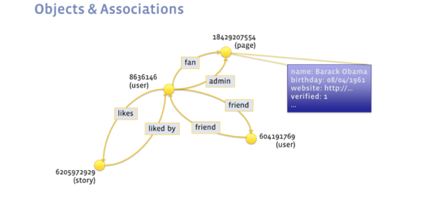
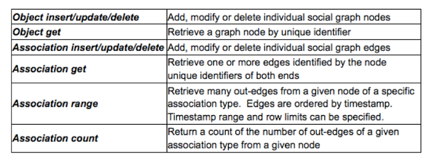
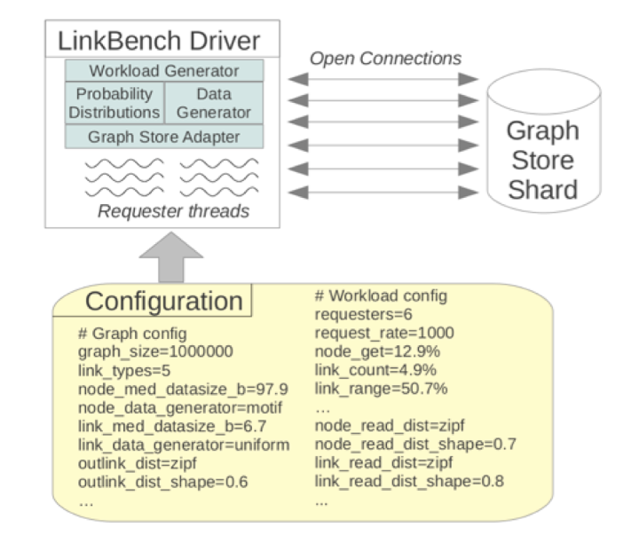

## facebook linkbench 测试PostgreSQL社交关系图谱场景性能     
##### [TAG 15](../class/15.md)
              
### 作者             
digoal              
              
### 日期            
2016-09-11           
              
### 标签            
PostgreSQL , facebook , linkbench   
              
----          
              
## 背景      
Linkbench是facebook提供的一款数据库性能测试开源软件，它的思路是围绕社交关系图谱构建一套测试数据，然后在此基础之上对数据进行关系查询，新增关系，断开关系等操作。    
    
Linkbench的介绍可参考    
https://www.facebook.com/notes/facebook-engineering/linkbench-a-database-benchmark-for-the-social-graph/10151391496443920   
  
http://www.oschina.net/translate/linkbench-a-database-benchmark-for-the-social-graph  
    
linkbench的测试模型在用户社交关系领域，很具有代表性，所以我打算提供一份该测试模型下PostgreSQL数据库性能表现的测试数据，以及测试方法。    
    
用户再看完测试数据后，可以与其他数据库对比测试一下，看看性能差异。    
    
## linkbench测试模型介绍  
社交图谱(social graph)，其中的对象如人(people),文章(posts),评论(comments)和页面(pages)是通过节点间不同的关系类型(模型)相互关联(图中的有向边-directed edges)的。  
  
不同的关联关系类型可以表示好友关系(friendship between two users)，用户喜欢某个对象的关系(user like another object)，还可以表示文章属主(ownership of post)关系等等。    
  
    
  
LinkBench是一个用于生成图(graph-serving)的性能测试工具，而不是处理图(graph-processing)的测试工具--区别在于前者会模拟在一个交互式的社交应用中的那些具有事务性的动作(transactional workload)，而后者只是模拟动作的流程(analytics workload)。  
  
这个测试工具不是用于解决图的社区发现问题(find graph communities)或图的切分问题(graph partitioning)，而是用来实时地查询并更新数据库中的图谱。  
  
例如，对于图的查询比较常见的形式就是找到所有来自节点X并且是A类型的所有的边，而更新操作就是插入、删除边或者更新图中的节点或边。  
  
举个更新操作的例子，如“从user4插入一个好友关系的边到user63459821”。  
  
通过将数据库查询划分为针对关系(边)和对象(节点)的许多小的核心操作，我们就可以逐个地分析在生产数据库环境下对社交图谱的每个操作的性能了。  
  
下面的表列出了用于保存或查询图谱时所对应的查询或更新操作。   
  
    
  
对于边的操作和读操作，特别是边界扫描(edge range scan)会给系统带来极大的负担。  
  
举个边界扫描的例子，如“按最早到最近的时间顺序找出某个文章的所有评论”或“找出某个用户的所有好友”。    
  
优化提示    
  
这个问题在于数据的存放，如果某文章的评论已聚合，则扫描的块会很少，性能不会差。用户的好友查询也一样，如果用户的好友进行了聚合，则也不会出现以上性能问题。      
  
或者通过cluster进行聚集，也能减少行扫描。    
  
## linkbench for PostgreSQL的工具介绍  
性能测试工作是由LinkBench driver负责的，它是一个用于生成社交图谱和各种操作的Java程序。  
  
原来只支持MySQL，已经扩展为支持PostgreSQL，但是务必使用PostgreSQL 9.5以及以上版本，因为QUERY包含UPSET(insert on conflict)，这个功能是9.5新加的。    
https://github.com/mdcallag/linkbench    
  
安装linkbench软件  
```  
mkdir ~/app  
cd ~/app  
```  
    
JDK  
```  
cd ~  
http://www.oracle.com/technetwork/java/javase/downloads/jdk8-downloads-2133151.html  
get     
Java SE Development Kit 8u102  
Linux x64   173.03 MB   jdk-8u102-linux-x64.tar.gz  
  
tar -zxvf jdk-8u102-linux-x64.tar.gz  
mv jdk1.8.0_102 /home/digoal/app/  
```    
  
apache-maven  
```  
http://maven.apache.org/download.cgi  
  
wget http://mirrors.cnnic.cn/apache/maven/maven-3/3.3.9/binaries/apache-maven-3.3.9-bin.tar.gz  
tar -zxvf apache-maven-3.3.9-bin.tar.gz  
mv apache-maven-3.3.9 /home/digoal/app/  
```  
  
配置环境    
```  
export JAVA_HOME=/home/digoal/app/jdk1.8.0_102  
export PATH=/home/digoal/app/apache-maven-3.3.9/bin:/home/digoal/app/jdk1.8.0_102/bin:$PATH  
export LD_LIBRARY_PATH=/home/digoal/app/apache-maven-3.3.9/lib:$LD_LIBRARY_PATH  
```  
  
安装linkbench  
```  
git clone https://github.com/mdcallag/linkbench  
```  
    
打包linkbench    
```  
$ cd linkbench  
  
$ mvn clean package -P pgsql -D skipTests  
  
[INFO] ------------------------------------------------------------------------  
[INFO] BUILD SUCCESS  
[INFO] ------------------------------------------------------------------------  
[INFO] Total time: 5.146 s  
[INFO] Finished at: 2016-09-11T13:07:55+08:00  
[INFO] Final Memory: 39M/1582M  
[INFO] ------------------------------------------------------------------------  
```  
  
生成环境变量配置文件  
$ vi ~/.bash_profile  
```  
# append  
export JAVA_HOME=/home/digoal/app/jdk1.8.0_102  
export PATH=/home/digoal/app/linkbench/bin:/home/digoal/app/apache-maven-3.3.9/bin:/home/digoal/app/jdk1.8.0_102/bin:$PATH  
export LD_LIBRARY_PATH=/home/digoal/app/apache-maven-3.3.9/lib:$LD_LIBRARY_PATH  
export CLASSPATH=.:/home/digoal/app/linkbench/target/FacebookLinkBench.jar  
```  
  
$ linkbench   
```  
Using java at: /home/digoal/app/jdk1.8.0_102/bin/java  
Did not select benchmark mode  
usage: linkbench [-c <file>] [-csvstats <file>] [-csvstream <file>] [-D  
       <property=value>] [-L <file>] [-l] [-r]  
 -c <file>                       Linkbench config file  
 -csvstats,--csvstats <file>     CSV stats output  
 -csvstream,--csvstream <file>   CSV streaming stats output  
 -D <property=value>             Override a config setting  
 -L <file>                       Log to this file  
 -l                              Execute loading stage of benchmark  
 -r                              Execute request stage of benchmark  
```  
    
测试工作分为两个阶段：  
  
1\. 载入阶段(load phase)，会生成一个初始的图谱并载入(loaded in bulk)到数据库中;  
  
2\. 请求阶段(request phase)，许多请求线程会用各种操作对数据库进行并发访问。在请求阶段，各种操作的延迟和吞吐量都会被统计并给出报告。  
  
在两个阶段的具体行为是通过一个配置文件进行控制的，通过这个配置文件可以轻松地控制性能测试中的各个参数。   
  
配置文件模板为 config/LinkConfigPgsql.properties   
  
    
  
## PostgreSQL 部署  
本文不包括OS的参数优化部分。  
```  
$ wget https://ftp.postgresql.org/pub/source/v9.6rc1/postgresql-9.6rc1.tar.bz2      
$ tar -jxvf postgresql-9.6rc1.tar.bz2      
$ cd postgresql-9.6rc1      
$ ./configure --prefix=/home/postgres/pgsql9.6rc1 --enable-debug       
$ gmake world -j 32      
$ gmake install-world      
```  
  
环境变量配置  
```  
  
$ vi ~/env_pg.sh      
# add by digoal      
export PS1="$USER@`/bin/hostname -s`-> "      
export PGPORT=1921      
export PGDATA=/data01/pgdata/pg_root_96      
export LANG=en_US.utf8      
export PGHOME=/home/postgres/pgsql9.6rc1      
export LD_LIBRARY_PATH=$PGHOME/lib:/lib64:/usr/lib64:/usr/local/lib64:/lib:/usr/lib:/usr/local/lib:$LD_LIBRARY_PATH      
export DATE=`date +"%Y%m%d%H%M"`      
export PATH=$PGHOME/bin:$PATH:.      
export MANPATH=$PGHOME/share/man:$MANPATH      
export PGHOST=$PGDATA      
export PGDATABASE=postgres      
alias rm='rm -i'      
alias ll='ls -lh'      
unalias vi      
```  
  
```  
$ . ~/env_pg.sh     
```  
  
## 创建测试库  
1) 初始化数据库  
    initdb -D $PGDATA -E UTF8 --locale=C -U postgres  
  
2) 创建数据库  
```  
    $> psql   
    DROP DATABASE IF EXISTS linkdb;  
    CREATE DATABASE linkdb ENCODING='latin1' template template0;  
  
    --drop user linkbench to create new one  
    DROP USER  IF EXISTS linkdb;  
  
    --  You may want to set up a special database user account for benchmarking:  
    CREATE USER linkdb password 'password';  
    -- Grant all privileges on linkdb to this user  
    GRANT ALL ON database linkdb TO linkdb;  
```  
3) Connect to linkdb and create tables and index  
```  
    $> \c linkdb linkdb  
  
    --add Schema keep the same query style (dbid.table_name)  
    DROP SCHEMA IF EXISTS linkdb CASCADE;   
    CREATE SCHEMA linkdb;  
  
    -- FIXME:Need to make it partitioned by key id1 %16  
    -- 建议使用分区表，也可以直接使用单表  
    -- 如果使用分区表，需要给子表id1加约束 check(mod(id1,16)=0), .....
    -- 同时还需要修改并重新编译src/main/java/com/facebook/LinkBench/LinkStorePgsql.java  
    -- 在原有id1=...的基础上加上约束相同的查询条件,例如where id1=val and mod(id1,16) = mod(val,16) ... 
    -- 这样pg的优化器才能过滤id1=val的条件
    CREATE TABLE linkdb.linktable (  
            id1 numeric(20) NOT NULL DEFAULT '0',  
            id2 numeric(20) NOT NULL DEFAULT '0',  
            link_type numeric(20) NOT NULL DEFAULT '0',  
            visibility smallint NOT NULL DEFAULT '0',  
            data varchar(255) NOT NULL DEFAULT '',  
            time numeric(20) NOT NULL DEFAULT '0',  
            version bigint NOT NULL DEFAULT '0',  
            PRIMARY KEY (link_type, id1,id2)  
            );  
  
    -- this is index for linktable  
    CREATE INDEX id1_type on linkdb.linktable(  
            id1,link_type,visibility,time,id2,version,data);  
  
    CREATE TABLE linkdb.counttable (  
            id numeric(20) NOT NULL DEFAULT '0',  
            link_type numeric(20) NOT NULL DEFAULT '0',  
            count int NOT NULL DEFAULT '0',  
            time numeric(20) NOT NULL DEFAULT '0',  
            version numeric(20) NOT NULL DEFAULT '0',  
            PRIMARY KEY (id,link_type)  
            );  
  
    CREATE TABLE linkdb.nodetable (  
            id BIGSERIAL NOT NULL,  
            type int NOT NULL,  
            version numeric NOT NULL,  
            time int NOT NULL,  
            data text NOT NULL,  
            PRIMARY KEY(id)  
            );  
```  
  
## 配置装载模板  
注意linkbench的配置文件，每个配置的value末尾不要有空格，否则可能解析错误。    
  
配置导入多少测试数据    
  
$ vi ~/app/linkbench/config/FBWorkload.properties    
```  
# end node id for initial load (exclusive)  
# With default config and MySQL/InnoDB, 1M ids ~= 1GB  
maxid1 = 1000000001  
# 配置为10亿条node记录，约1TB  
```  
  
如何连接数据库，报告频率，线程数，每个线程测多少笔操作，最大测试时长 压测  
  
$ vi ~/app/linkbench/config/LinkConfigPgsql.properties  
```  
workload_file = config/FBWorkload.properties  
linkstore = com.facebook.LinkBench.LinkStorePgsql  
nodestore = com.facebook.LinkBench.LinkStorePgsql  
# 数据库连接信息  
host = xxx.xxx.xxx.xxx  
user = linkdb  
password = linkdb  
port = 1922  
dbid = linkdb  
# 数据库表  
linktable = linktable  
counttable = counttable  
nodetable = nodetable  
# 信息输出等级  
debuglevel = INFO  
# 打印频率  
progressfreq = 300  
displayfreq = 1800  
# 允许每个线程装载、请求多少条记录  
load_progress_interval = 500000  
req_progress_interval = 500000  
maxsamples = 10000  
# 加载几个线程  
loaders = 64  
generate_nodes = true  
loader_chunk_size = 2048  
# 开多少个请求，乘以2得到连接数    
requesters = 192  
# 每个线程请求多少次  
requests = 5000000  
requestrate = 0  
maxtime = 100000  
warmup_time = 0  
max_failed_requests = 100  
```  
  
## 装载测试数据  
```  
$ cd ~/app/linkbench  
  
$ ./bin/linkbench -c config/LinkConfigPgsql.properties -l  
```  
    
## 配置测试模板  
同上《配置装载模板》    
  
## 压测  
```  
./bin/linkbench -c config/LinkConfigPgsql.properties -r  
```  
  
## 测试结果解读  
### 数据装载结果  
```  
INFO 2016-09-12 01:19:07,229 [main]: LOAD_NODE_BULK count = 390625  p25 = [8000,9000]ms  p50 = [8000,9000]ms  p75 = [9000,10000]ms  p95 = [10000,100000]ms  p99 = [10000,100000]ms  max = 1259341.029ms  mean = 9759.494ms
INFO 2016-09-12 01:19:07,229 [main]: LOAD_LINKS_BULK count = 1708831  p25 = [10000,100000]ms  p50 = [10000,100000]ms  p75 = [10000,100000]ms  p95 = [10000,100000]ms  p99 = [10000,100000]ms  max = 1292335.24ms  mean = 33558.09ms
INFO 2016-09-12 01:19:07,229 [main]: LOAD_COUNTS_BULK count = 301615  p25 = [10000,100000]ms  p50 = [10000,100000]ms  p75 = [10000,100000]ms  p95 = [10000,100000]ms  p99 = [10000,100000]ms  max = 1318474.297ms  mean = 66637.2ms
INFO 2016-09-12 01:19:07,229 [main]: LOAD PHASE COMPLETED.  Loaded 100000000 nodes (Expected 100000000). Loaded 437452202 links (4.37 links per node).  Took 4060.6 seconds.  Links/second = 107731 
```  
    
### 数据压测结果  
  
单向指标的QUERY性能  
```  
INFO 2016-09-11 21:49:47,069 [main]: 
ADD_NODE 
count = 2471774  
p25 = [0.4,0.5]ms  百分之25的请求小于0.5毫秒
p50 = [0.5,0.6]ms  百分之50的请求小于0.6毫秒
p75 = [0.6,0.7]ms  百分之75的请求小于0.7毫秒
p95 = [1,2]ms  百分之95的请求小于2毫秒
p99 = [4,5]ms  百分之99的请求小于5毫秒
max = 213.324ms  最大RT
mean = 0.715ms   平均RT
```  
    
p25表示 0-25%的请求RT范围为a,b毫秒, p50表示25-50%的请求RT范围a,b毫秒.    
    
总体测试统计，包括QPS  
```  
INFO 2016-09-11 21:49:47,070 [main]: 
REQUEST PHASE COMPLETED. 
96000000 requests done in 796 seconds. 
Requests/second = 120482 
```  
  
一个32Core机型的测试结果      
```  
INFO 2016-09-11 21:49:47,069 [main]: ADD_NODE count = 2471774  p25 = [0.4,0.5]ms  p50 = [0.5,0.6]ms  p75 = [0.6,0.7]ms  p95 = [1,2]ms  p99 = [4,5]ms  max = 213.324ms  mean = 0.715ms  
INFO 2016-09-11 21:49:47,069 [main]: UPDATE_NODE count = 7073914  p25 = [0.4,0.5]ms  p50 = [0.5,0.6]ms  p75 = [0.7,0.8]ms  p95 = [2,3]ms  p99 = [5,6]ms  max = 154.589ms  mean = 0.813ms  
INFO 2016-09-11 21:49:47,069 [main]: DELETE_NODE count = 971421  p25 = [0.3,0.4]ms  p50 = [0.4,0.5]ms  p75 = [0.6,0.7]ms  p95 = [2,3]ms  p99 = [4,5]ms  max = 80.185ms  mean = 0.731ms  
INFO 2016-09-11 21:49:47,070 [main]: GET_NODE count = 12414612  p25 = [0.4,0.5]ms  p50 = [0.6,0.7]ms  p75 = [0.9,1]ms  p95 = [2,3]ms  p99 = [5,6]ms  max = 78.739ms  mean = 0.943ms  
INFO 2016-09-11 21:49:47,070 [main]: ADD_LINK count = 8631075  p25 = [1,2]ms  p50 = [2,3]ms  p75 = [3,4]ms  p95 = [5,6]ms  p99 = [9,10]ms  max = 103.442ms  mean = 2.657ms  
INFO 2016-09-11 21:49:47,070 [main]: DELETE_LINK count = 2870975  p25 = [1,2]ms  p50 = [2,3]ms  p75 = [3,4]ms  p95 = [6,7]ms  p99 = [14,15]ms  max = 134.991ms  mean = 3.197ms  
INFO 2016-09-11 21:49:47,070 [main]: UPDATE_LINK count = 7694028  p25 = [1,2]ms  p50 = [2,3]ms  p75 = [3,4]ms  p95 = [5,6]ms  p99 = [9,10]ms  max = 91.146ms  mean = 2.654ms  
INFO 2016-09-11 21:49:47,070 [main]: COUNT_LINK count = 4690047  p25 = [0.4,0.5]ms  p50 = [0.6,0.7]ms  p75 = [1,2]ms  p95 = [2,3]ms  p99 = [5,6]ms  max = 79.349ms  mean = 1.026ms  
INFO 2016-09-11 21:49:47,070 [main]: MULTIGET_LINK count = 504147  p25 = [0.7,0.8]ms  p50 = [0.9,1]ms  p75 = [1,2]ms  p95 = [3,4]ms  p99 = [6,7]ms  max = 59.272ms  mean = 1.325ms  
INFO 2016-09-11 21:49:47,070 [main]: GET_LINKS_LIST count = 48678007  p25 = [0.7,0.8]ms  p50 = [0.9,1]ms  p75 = [1,2]ms  p95 = [3,4]ms  p99 = [6,7]ms  max = 117.932ms  mean = 1.386ms  
INFO 2016-09-11 21:49:47,070 [main]: REQUEST PHASE COMPLETED. 96000000 requests done in 796 seconds. Requests/second = 120482  
```  
    
每一项代表了一个测试用例，具体参考前面的图，最后一行表示综合性能。    
    
这里测试的PG linkbench性能达到了12万QPS。    
  
主机32 Core。    
  
## 参考  
https://github.com/mdcallag/linkbench  
  
https://www.facebook.com/notes/facebook-engineering/linkbench-a-database-benchmark-for-the-social-graph/10151391496443920  
  
http://www.oschina.net/translate/linkbench-a-database-benchmark-for-the-social-graph  
  
          
      
  
<a rel="nofollow" href="http://info.flagcounter.com/h9V1"  ></a>  
  
  
  
  
  
  
## [digoal's 大量PostgreSQL文章入口](https://github.com/digoal/blog/blob/master/README.md "22709685feb7cab07d30f30387f0a9ae")
  
