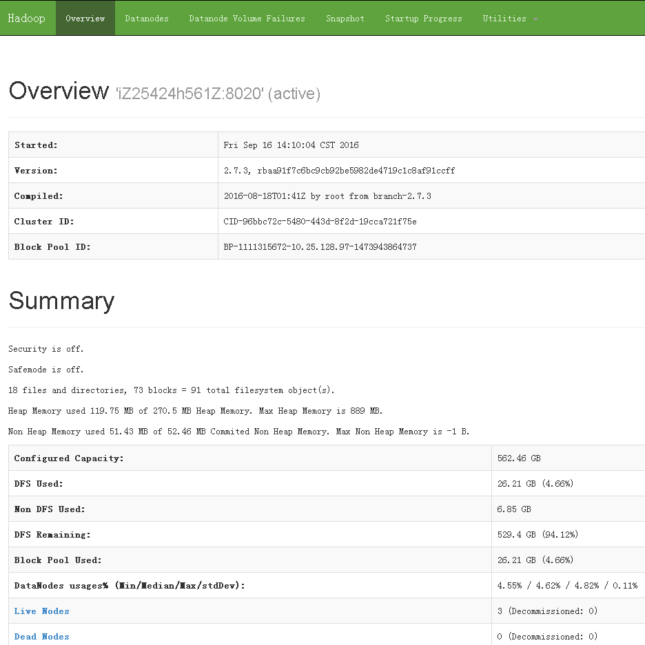
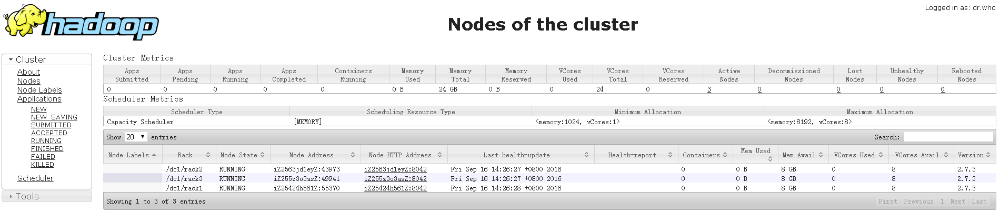
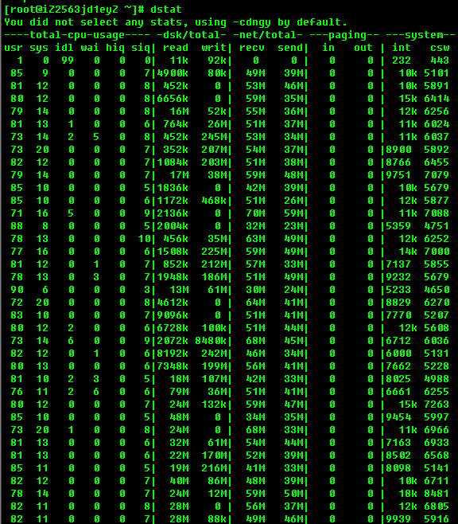

## HAWQ 集群部署 on ECS
          
### 作者         
digoal          
          
### 日期        
2016-09-16      
          
### 标签        
PostgreSQL , HAWQ , Greenplum , ECS , 集群
          
----        
          
## 背景  
之前写过两篇HAWQ on CentOS 6.x, 7.x的单机部署，本文主要描述的是HAWQ on ECS的多机部署。  
  
本文参考以下文章部署，详见如下    
http://hdb.docs.pivotal.io/20/  
  
http://www.aboutyun.com/thread-7684-1-1.html  
  
http://www.aboutyun.com/thread-8146-1-1.html  
  
http://hadoop.apache.org/docs/current/hadoop-project-dist/hadoop-common/core-default.xml  
  
http://hadoop.apache.org/docs/current/hadoop-project-dist/hadoop-hdfs/hdfs-default.xml  
  
http://hadoop.apache.org/docs/current/hadoop-project-dist/hadoop-common/ClusterSetup.html  
  
## 环境描述
```
ECS * 3

ECS 配置: 2 Core , 8G 

系统: CentOS 7.2 x64

40G /  本地盘    
100G /data01  云盘1  
100G /data02  云盘2  

ioscheduler deadline

mount 选项 ext4   defaults,noatime,nodiratime,nodelalloc,barrier=0,data=writeback   

内网IP
xxx.xxx.xxx.97     namenode, datanode, resourcemanager, nodemanager
xxx.xxx.xxx.108    secondary namenode, datanode, nodemanager
xxx.xxx.xxx.104    datanode, nodemanager
```
  
## 初始化文件系统
```
mkdir /data01
mkdir /data02
umount /data01
umount /data02

parted -s /dev/vdb mklabel gpt
parted -s /dev/vdc mklabel gpt

parted -s -a optimal /dev/vdb mkpart primary 2 102400 unit MiB
parted -s -a optimal /dev/vdc mkpart primary 2 102400 unit MiB

mkfs.ext4 /dev/vdb1 -m 0 -O extent,uninit_bg -E lazy_itable_init=1
mkfs.ext4 /dev/vdc1 -m 0 -O extent,uninit_bg -E lazy_itable_init=1

sed  -i  "/vdb1/d" /etc/fstab
sed  -i  "/vdc1/d" /etc/fstab
echo "/dev/vdb1 /data01     ext4        defaults,noatime,nodiratime,nodelalloc,barrier=0,data=writeback    0 0" >> /etc/fstab
echo "/dev/vdc1 /data02     ext4        defaults,noatime,nodiratime,nodelalloc,barrier=0,data=writeback    0 0" >> /etc/fstab

mount -a
df -h
```
  
## 安装7.x epel yum源
http://fedoraproject.org/wiki/EPEL  
```
# wget https://dl.fedoraproject.org/pub/epel/epel-release-latest-7.noarch.rpm

# rpm -ivh epel-release-latest-7.noarch.rpm

# yum makecache fast
```
  
## 从yum仓库安装依赖包
```
# yum install -y man passwd sudo tar which git mlocate links make bzip2 net-tools \
  autoconf automake libtool m4 gcc gcc-c++ gdb bison flex gperf maven indent \
  libuuid-devel krb5-devel libgsasl-devel expat-devel libxml2-devel \
  perl-ExtUtils-Embed pam-devel python-devel libcurl-devel snappy-devel \
  thrift-devel libyaml-devel libevent-devel bzip2-devel openssl-devel \
  openldap-devel protobuf-devel readline-devel net-snmp-devel apr-devel \
  libesmtp-devel xerces-c-devel python-pip json-c-devel libhdfs3-devel \
  apache-ivy java-1.7.0-openjdk-devel \
  openssh-clients openssh-server  

# pip install --upgrade pip

# pip --retries=50 --timeout=300 install --upgrade paramiko pycrypto

# yum install -y lcov
```
  
## 安装 cmake
```
# useradd gpadmin
# su - gpadmin
$ mkdir -p /home/gpadmin/app

cd ~
wget https://cmake.org/files/v3.6/cmake-3.6.1.tar.gz
tar -zxvf cmake-3.6.1.tar.gz
cd cmake-3.6.1
./configure --parallel=32 --prefix=/home/gpadmin/app/cmake
make -j 32
make install

配置环境变量
echo "export PATH=/home/gpadmin/app/cmake/bin:\$PATH" >> /home/gpadmin/.bash_profile
```
  
## 配置os
### corefiles目录
```
# mkdir /data01/corefiles
# chmod 777 /data01/corefiles
```
  
### 内核参数
```
# vi /etc/sysctl.conf

fs.aio-max-nr = 1048576
fs.file-max = 76724600
kernel.core_pattern= /data01/corefiles/core_%e_%u_%t_%s.%p         
kernel.sem = 4096 2147483647 2147483646 512000    
kernel.shmall = 107374182      
kernel.shmmax = 274877906944   
kernel.shmmni = 819200         
net.core.netdev_max_backlog = 10000
net.core.rmem_default = 262144       
net.core.rmem_max = 4194304          
net.core.wmem_default = 262144       
net.core.wmem_max = 4194304          
net.core.somaxconn = 4096
net.ipv4.tcp_max_syn_backlog = 4096
net.ipv4.tcp_keepalive_intvl = 20
net.ipv4.tcp_keepalive_probes = 3
net.ipv4.tcp_keepalive_time = 60
net.ipv4.tcp_mem = 8388608 12582912 16777216
net.ipv4.tcp_fin_timeout = 5
net.ipv4.tcp_synack_retries = 2
net.ipv4.tcp_syncookies = 1    
net.ipv4.tcp_timestamps = 1    
net.ipv4.tcp_tw_recycle = 0    
net.ipv4.tcp_tw_reuse = 1      
net.ipv4.tcp_max_tw_buckets = 262144
net.ipv4.tcp_rmem = 8192 87380 16777216
net.ipv4.tcp_wmem = 8192 65536 16777216
vm.dirty_background_bytes = 4096000000       
vm.dirty_expire_centisecs = 6000             
vm.dirty_ratio = 80                          
vm.dirty_writeback_centisecs = 50            
vm.min_free_kbytes = 2097152
vm.mmap_min_addr = 65536
vm.overcommit_memory = 0     
vm.overcommit_ratio = 90     
vm.swappiness = 0            
vm.zone_reclaim_mode = 0     
net.ipv4.ip_local_port_range = 40000 65535    

# sysctl -p
```
  
### 资源限制
```
# rm -f /etc/security/limits.d/*.conf

# vi /etc/security/limits.conf
* soft    nofile  1024000
* hard    nofile  1024000
* soft    nproc   unlimited
* hard    nproc   unlimited
* soft    core    unlimited
* hard    core    unlimited
* soft    memlock unlimited
* hard    memlock unlimited
```
  
## 安装R
```
centos 7带的R版本比较高，如果图省事就直接用YUM安装，建议还是从R官网下载源码安装。

# yum install -y R R-devel
```
  
## 配置本地域名解析，主机列表
```
获取主机名
# hostname -s
```
  
配置/etc/hosts  
```
echo "127.0.0.1 localhost" > /etc/hosts
echo "xxx.xxx.xxx.97  host_digoal_01 >> /etc/hosts
echo "xxx.xxx.xxx.108 host_digoal_02 >> /etc/hosts
echo "xxx.xxx.xxx.104 host_digoal_03 >> /etc/hosts
```
  
## 配置主机与trust认证
```
# su - gpadmin
$ ssh-keygen 

$ cat ~/.ssh/id_rsa.pub >> ~/.ssh/authorized_keys
$ chmod 600 ~/.ssh/authorized_keys
所有主机id_rsa.pub全部写入 ~/.ssh/authorized_keys
```
  
产生known_hosts  
```
cat /etc/hosts|awk '{print "ssh -o \"StrictHostKeyChecking no\" " $1  " date\n ssh -o \"StrictHostKeyChecking no\" " $2 " date \n"}' > /tmp/tmp.sh; . /tmp/tmp.sh ; rm -f /tmp/tmp.sh
```
  
## 安装java
选择最佳版本  
  
http://wiki.apache.org/hadoop/HadoopJavaVersions  
```
$ cd ~

get   
Java SE Development Kit 8u102
Linux x64   173.03 MB   jdk-8u102-linux-x64.tar.gz

$ tar -zxvf jdk-8u102-linux-x64.tar.gz
$ mv jdk1.8.0_102 /home/gpadmin/app/

$ echo "export JAVA_HOME=/home/gpadmin/app/jdk1.8.0_102" >> /home/gpadmin/.bash_profile
```
  
## 下载hadoop稳定版本
http://apache.fayea.com/hadoop/common/stable/  
```
$ cd ~
$ wget http://apache.fayea.com/hadoop/common/stable/hadoop-2.7.3.tar.gz
$ tar -zxvf hadoop-2.7.3.tar.gz
$ mv hadoop-2.7.3 /home/gpadmin/app/
$ cd /home/gpadmin/app/hadoop-2.7.3

$ bin/hadoop
Usage: hadoop [--config confdir] [COMMAND | CLASSNAME]
  CLASSNAME            run the class named CLASSNAME
 or
  where COMMAND is one of:
  fs                   run a generic filesystem user client
  version              print the version
  jar <jar>            run a jar file
                       note: please use "yarn jar" to launch
                             YARN applications, not this command.
  checknative [-a|-h]  check native hadoop and compression libraries availability
  distcp <srcurl> <desturl> copy file or directories recursively
  archive -archiveName NAME -p <parent path> <src>* <dest> create a hadoop archive
  classpath            prints the class path needed to get the
  credential           interact with credential providers
                       Hadoop jar and the required libraries
  daemonlog            get/set the log level for each daemon
  trace                view and modify Hadoop tracing settings

Most commands print help when invoked w/o parameters.
```
  
配置用户shell环境变量  
```
echo "export PATH=/home/gpadmin/app/hadoop-2.7.3/bin:/home/gpadmin/app/hadoop-2.7.3/sbin:\$PATH" >> /home/gpadmin/.bash_profile
echo "export LD_LIBRARY_PATH=/home/gpadmin/app/hadoop-2.7.3/lib/native:\$LD_LIBRARY_PATH" >> /home/gpadmin/.bash_profile
echo "export CLASSPATH=.:/home/gpadmin/app/jdk1.8.0_102/jre/lib" >> /home/gpadmin/.bash_profile
```
  
## 配置hadoop环境变量
hadoop-env.sh  
```
$ vi /home/gpadmin/app/hadoop-2.7.3/etc/hadoop/hadoop-env.sh

export JAVA_HOME=/home/gpadmin/app/jdk1.8.0_102

export HADOOP_NAMENODE_OPTS="-XX:+UseParallelGC -Dhadoop.security.logger=${HADOOP_SECURITY_LOGGER:-INFO,RFAS} -Dhdfs.audit.logger=${HDFS_AUDIT_LOGGER:-INFO,NullAppender} $HADOOP_NAMENODE_OPTS"
```
  
角色相关选项属性描述  
```
NameNode	HADOOP_NAMENODE_OPTS
DataNode	HADOOP_DATANODE_OPTS
Secondary NameNode	HADOOP_SECONDARYNAMENODE_OPTS

HADOOP_PID_DIR - The directory where the daemons’ process id files are stored.
HADOOP_LOG_DIR - The directory where the daemons’ log files are stored. 
                 Log files are automatically created if they don’t exist.

HADOOP_HEAPSIZE_MAX - The maximum amount of memory to use for the Java heapsize.  
                      Units supported by the JVM are also supported here. 
                      If no unit is present, it will be assumed the number is in megabytes. 
                      By default, Hadoop will let the JVM determine how much to use. 
                      This value can be overriden on a per-daemon basis using the appropriate _OPTS variable listed above. 
                      For example, setting HADOOP_HEAPSIZE_MAX=1g and HADOOP_NAMENODE_OPTS="-Xmx5g" will configure the NameNode with 5GB heap.

HADOOP_HOME=/path/to/hadoop
export HADOOP_HOME
```

## 配置Hadoop Daemons配置文件
1\. /home/gpadmin/app/hadoop-2.7.3/etc/hadoop/core-site.xml  
  
datanode & namenode  
```
fs.defaultFS	        NameNode URI	hdfs://host:port/     # namenode节点的IP, 配置内网IP
io.file.buffer.size	131072	        Size of read/write buffer used in SequenceFiles.
```
  
配置  
```
$ vi /home/gpadmin/app/hadoop-2.7.3/etc/hadoop/core-site.xml

<configuration>
    <property>
        <name>fs.defaultFS</name>
        <value>hdfs://xxx.xxx.xxx.97:8020</value>
    </property>
    <property>
        <name>io.file.buffer.size</name>
        <value>131072</value>
    </property>
    <property>
        <name>ipc.client.connection.maxidletime</name>
        <value>3600000</value>
    </property>
    <property>
        <name>ipc.client.connect.timeout</name>
        <value>300000</value>
    </property>
    <property>
        <name>ipc.server.listen.queue.size</name>
        <value>3300</value>
    </property>
    <property>
        <name>hadoop.tmp.dir</name>
        <value>file:/data01/gpadmin/hadoop/tmp</value>
        <description>Abase for other temporary directories.</description>
    </property>
</configuration>
```
  
配置目录  
```
# mkdir -p /data01/gpadmin/hadoop/tmp
# chown -R gpadmin:gpadmin /data01
```
  
2\. /home/gpadmin/app/hadoop-2.7.3/etc/hadoop/hdfs-site.xml  
  
namenode  
```
dfs.namenode.name.dir	        Path on the local filesystem where the NameNode stores the namespace and transactions logs persistently.	
                                If this is a comma-delimited list of directories then the name table is replicated in all of the directories, for redundancy.
dfs.hosts / dfs.hosts.exclude	List of permitted/excluded DataNodes.	
                                If necessary, use these files to control the list of allowable datanodes.
dfs.blocksize	                268435456	
                                HDFS blocksize of 256MB for large file-systems.
dfs.namenode.handler.count	100	
                                More NameNode server threads to handle RPCs from large number of DataNodes.
```
  
datanode  
```
dfs.datanode.data.dir	Comma separated list of paths on the local filesystem of a DataNode where it should store its blocks.	
                        If this is a comma-delimited list of directories, then data will be stored in all named directories, typically on different devices.
```
  
配置  
```
$ vi /home/gpadmin/app/hadoop-2.7.3/etc/hadoop/hdfs-site.xml

<configuration>
    <property>
        <name>dfs.hosts</name>
        <value>/home/gpadmin/app/hadoop-2.7.3/etc/hadoop/slaves</value>
    </property>
    <property>
        <name>dfs.replication</name>
        <value>2</value>
    </property>
    <property>
        <name>dfs.allow.truncate</name>
        <value>true</value>
    </property>
    <property>
        <name>dfs.blocksize</name>
        <value>268435456</value>
    </property>
    <property>
        <name>dfs.block.access.token.enable</name>
        <value>false</value>
    </property>
    <property>
        <name>dfs.block.local-path-access.user</name>
        <value>gpadmin</value>
    </property>
    <property>
        <name>dfs.client.socket-timeout</name>
        <value>300000000</value>
    </property>
    <property>
        <name>dfs.client.use.legacy.blockreader.local</name>
        <value>false</value>
    </property>
    <property>
        <name>dfs.datanode.data.dir.perm</name>
        <value>750</value>
    </property>
    <property>
        <name>dfs.datanode.handler.count</name>
        <value>60</value>
    </property>
    <property>
        <name>dfs.datanode.max.transfer.threads</name>
        <value>40960</value>
    </property>
    <property>
        <name>dfs.datanode.socket.write.timeout</name>
        <value>7200000</value>
    </property>
    <property>
        <name>dfs.namenode.accesstime.precision</name>
        <value>0</value>
    </property>
    <property>
        <name>dfs.namenode.handler.count</name>
        <value>600</value>
    </property>
    <property>
        <name>dfs.support.append</name>
        <value>true</value>
    </property>
    <property>
         <name>dfs.namenode.name.dir</name>
         <value>file:/data01/gpadmin/hadoop/dfs/name,file:/data02/gpadmin/hadoop/dfs/name</value>
    </property>
    <property>
         <name>dfs.datanode.data.dir</name>
         <value>file:/data01/gpadmin/hadoop/dfs/data,file:/data02/gpadmin/hadoop/dfs/data</value>
    </property>
    <property>
        <name>dfs.client.read.shortcircuit</name>
        <value>true</value>
    </property>
    <property>
        <name>dfs.domain.socket.path</name>
        <value>/data01/gpadmin/hadoop/sock/dn._PORT</value>
    </property>
</configuration>
```
  
配置目录  
```
mkdir -p /data01/gpadmin/hadoop/dfs/name
mkdir -p /data01/gpadmin/hadoop/dfs/data
mkdir -p /data02/gpadmin/hadoop/dfs/name
mkdir -p /data02/gpadmin/hadoop/dfs/data
mkdir -p /data01/gpadmin/hadoop/sock
chown -R gpadmin:root /data01/gpadmin
chown -R gpadmin:root /data02/gpadmin
```

## 配置Slaves File(host file)
datanode记为slave，所以所有的datanode主机名或IP都要写在这里  
  
```
Typically you choose one machine in the cluster to act as the NameNode and one machine as to act as the JobTracker, exclusively. 
The rest of the machines act as both a DataNode and TaskTracker and are referred to as slaves.
```
  
配置   
```
vi /home/gpadmin/app/hadoop-2.7.3/etc/hadoop/slaves
host_digoal_01
host_digoal_02
host_digoal_03

chown gpadmin:gpadmin /home/gpadmin/app/hadoop-2.7.3/etc/hadoop/slaves
```
  
## 配置rack感知 
dcn 表示主机处于哪个IDCn    
  
rackn 表示主机处于哪个交换机下（或哪个主机柜中）    
  
IP与主机名都需要配置入slaves文件    
  
```
echo "xxx.xxx.xxx.97  /dc1/rack1" > /home/gpadmin/app/hadoop-2.7.3/etc/hadoop/topology.data 
echo "xxx.xxx.xxx.108 /dc1/rack2" >> /home/gpadmin/app/hadoop-2.7.3/etc/hadoop/topology.data 
echo "xxx.xxx.xxx.104 /dc1/rack3" >> /home/gpadmin/app/hadoop-2.7.3/etc/hadoop/topology.data 
echo "host_digoal_01 /dc1/rack1" >> /home/gpadmin/app/hadoop-2.7.3/etc/hadoop/topology.data 
echo "host_digoal_02 /dc1/rack2" >> /home/gpadmin/app/hadoop-2.7.3/etc/hadoop/topology.data 
echo "host_digoal_03 /dc1/rack3" >> /home/gpadmin/app/hadoop-2.7.3/etc/hadoop/topology.data 

chown gpadmin:gpadmin /home/gpadmin/app/hadoop-2.7.3/etc/hadoop/topology.data 
```
  
创建rack回馈脚本  
```
vi /home/gpadmin/app/hadoop-2.7.3/etc/hadoop/hostrack.sh


HADOOP_CONF=/home/gpadmin/app/hadoop-2.7.3/etc/hadoop

while [ $# -gt 0 ] ; do  # //$#代表执行命令时输入的参数个数
  nodeArg=$1
  exec< ${HADOOP_CONF}/topology.data   # //读入文件
  result="" 
  while read line ; do        # //循环遍历文件内容
    ar=( $line ) 
    if [ "${ar[0]}" = "$nodeArg" ] ; then
      result="${ar[1]}"
    fi
  done 
  shift 
  if [ -z "$result" ] ; then
    echo -n "/default/rack "
  else
    echo -n "$result "
  fi
done


chown gpadmin:gpadmin /home/gpadmin/app/hadoop-2.7.3/etc/hadoop/hostrack.sh
chmod 755 /home/gpadmin/app/hadoop-2.7.3/etc/hadoop/hostrack.sh
```
  
配置core-site.xml  
  
$ vi /home/gpadmin/app/hadoop-2.7.3/etc/hadoop/core-site.xml  
```
添加
    <property>
        <name>net.topology.script.file.name</name>
        <value>/home/gpadmin/app/hadoop-2.7.3/etc/hadoop/hostrack.sh</value>
    </property>
    <property>
        <name>net.topology.script.number.args</name>
        <value>8000</value>
    </property>
```
  
## 配置secondary namenodes
需要用于secondary namenode的主机名都添加进来，本例使用1主1备  
  
可以使用IP或主机名  
  
```
vi /home/gpadmin/app/hadoop-2.7.3/etc/hadoop/masters
xxx.xxx.xxx.108


chown gpadmin:gpadmin /home/gpadmin/app/hadoop-2.7.3/etc/hadoop/masters
```
  
修改hdfs-site.xml, core-site.xml配置  
```
追加
vi /home/gpadmin/app/hadoop-2.7.3/etc/hadoop/hdfs-site.xml

    <property>
        <name>dfs.http.address</name>
        <value>xxx.xxx.xxx.97:50070</value>
    </property>
    <property>
        <name>dfs.namenode.secondary.http-address</name>
        <value>xxx.xxx.xxx.108:50090</value>
    </property>


vi /home/gpadmin/app/hadoop-2.7.3/etc/hadoop/core-site.xml
    <property>
        <name>fs.checkpoint.period</name>
        <value>3600</value>
        <description>The number of seconds between two periodic checkpoints.
        </description>
    </property>
    <property>
        <name>fs.checkpoint.size</name>
        <value>67108864</value>
    </property>
```
  
## 配置日志
/home/gpadmin/app/hadoop-2.7.3/etc/hadoop/log4j.properties  
  
## 确保配置文件所在目录，所有节点保持一致  
```
HADOOP_CONF_DIR 

cat /home/gpadmin/app/hadoop-2.7.3/etc/hadoop/hadoop-env.sh|grep HADOOP_CONF_DIR
```
  
## 初始化hdfs namenode
```
$HADOOP_HOME/bin/hdfs namenode -format <cluster_name>
```
  
例如  
```
$HADOOP_HOME/bin/hdfs namenode -format digoal
```
  
## 配置防火墙
内网相互信任，根据实际情况开放  
  
```
vi /etc/sysconfig/iptables

# 私有网段 INSERT
-A RH-Firewall-1-INPUT -s 192.168.0.0/16 -j ACCEPT
-A RH-Firewall-1-INPUT -s 10.0.0.0/8 -j ACCEPT
-A RH-Firewall-1-INPUT -s 172.16.0.0/16 -j ACCEPT
```
  
## 启动dfs  
如果配置了ssh无秘钥认证，并且配置了slave file(host file)，则可以直接启动  
```
$ start-dfs.sh

Starting namenodes on [host_digoal_01]
host_digoal_01: starting namenode, logging to /home/gpadmin/app/hadoop-2.7.3/logs/hadoop-gpadmin-namenode-host_digoal_01.out
host_digoal_01: starting datanode, logging to /home/gpadmin/app/hadoop-2.7.3/logs/hadoop-gpadmin-datanode-host_digoal_01.out
host_digoal_02: starting datanode, logging to /home/gpadmin/app/hadoop-2.7.3/logs/hadoop-gpadmin-datanode-host_digoal_02.out
host_digoal_03: starting datanode, logging to /home/gpadmin/app/hadoop-2.7.3/logs/hadoop-gpadmin-datanode-host_digoal_03.out
Starting secondary namenodes [host_digoal_02]
host_digoal_02: starting secondarynamenode, logging to /home/gpadmin/app/hadoop-2.7.3/logs/hadoop-gpadmin-secondarynamenode-host_digoal_02.out
```
  
## 检查dfs状态
```
[gpadmin@host_digoal_01 ~]$ hdfs dfsadmin -report
Configured Capacity: 603937480704 (562.46 GB)
Present Capacity: 603429277696 (561.99 GB)
DFS Remaining: 603429081088 (561.99 GB)
DFS Used: 196608 (192 KB)
DFS Used%: 0.00%
Under replicated blocks: 0
Blocks with corrupt replicas: 0
Missing blocks: 0
Missing blocks (with replication factor 1): 0

-------------------------------------------------
Live datanodes (3):

Name: xxx.xxx.xxx.108:50010 (host_digoal_02)
Hostname: host_digoal_02
Rack: /dc1/rack2
Decommission Status : Normal
Configured Capacity: 201312493568 (187.49 GB)
DFS Used: 65536 (64 KB)
Non DFS Used: 168005632 (160.22 MB)
DFS Remaining: 201144422400 (187.33 GB)
DFS Used%: 0.00%
DFS Remaining%: 99.92%
Configured Cache Capacity: 0 (0 B)
Cache Used: 0 (0 B)
Cache Remaining: 0 (0 B)
Cache Used%: 100.00%
Cache Remaining%: 0.00%
Xceivers: 2
Last contact: Fri Sep 16 08:39:18 CST 2016


Name: xxx.xxx.xxx.97:50010 (host_digoal_01)
Hostname: host_digoal_01
Rack: /dc1/rack1
Decommission Status : Normal
Configured Capacity: 201312493568 (187.49 GB)
DFS Used: 65536 (64 KB)
Non DFS Used: 180682752 (172.31 MB)
DFS Remaining: 201131745280 (187.32 GB)
DFS Used%: 0.00%
DFS Remaining%: 99.91%
Configured Cache Capacity: 0 (0 B)
Cache Used: 0 (0 B)
Cache Remaining: 0 (0 B)
Cache Used%: 100.00%
Cache Remaining%: 0.00%
Xceivers: 2
Last contact: Fri Sep 16 08:39:18 CST 2016


Name: xxx.xxx.xxx.104:50010 (host_digoal_03)
Hostname: host_digoal_03
Rack: /dc1/rack3
Decommission Status : Normal
Configured Capacity: 201312493568 (187.49 GB)
DFS Used: 65536 (64 KB)
Non DFS Used: 159514624 (152.13 MB)
DFS Remaining: 201152913408 (187.34 GB)
DFS Used%: 0.00%
DFS Remaining%: 99.92%
Configured Cache Capacity: 0 (0 B)
Cache Used: 0 (0 B)
Cache Remaining: 0 (0 B)
Cache Used%: 100.00%
Cache Remaining%: 0.00%
Xceivers: 2
Last contact: Fri Sep 16 08:39:18 CST 2016
```
  
## 测试hdfs
```
[gpadmin@host_digoal_01 ~]$ hdfs dfs -mkdir -p /user
[gpadmin@host_digoal_01 ~]$ hdfs dfs -put /home/gpadmin/hadoop-2.7.3.tar.gz /user/
[gpadmin@host_digoal_01 ~]$ hdfs dfs -ls -R /
drwxr-xr-x   - gpadmin supergroup          0 2016-09-16 08:41 /user
-rw-r--r--   2 gpadmin supergroup  214092195 2016-09-16 08:41 /user/hadoop-2.7.3.tar.gz
```
  
## 公网访问dfs开放端口(WEB)
```
[gpadmin@host_digoal_01 ~]$ netstat -anp|grep LISTEN
(Not all processes could be identified, non-owned process info
 will not be shown, you would have to be root to see it all.)
tcp        0      0 127.0.0.1:57777         0.0.0.0:*               LISTEN      10893/java          
tcp        0      0 xxx.xxx.xxx.97:8020       0.0.0.0:*               LISTEN      10161/java          
tcp        0      0 xxx.xxx.xxx.97:50070      0.0.0.0:*               LISTEN      10161/java          
tcp        0      0 0.0.0.0:22              0.0.0.0:*               LISTEN      -                   
tcp        0      0 0.0.0.0:50010           0.0.0.0:*               LISTEN      10893/java          
tcp        0      0 0.0.0.0:50075           0.0.0.0:*               LISTEN      10893/java          
tcp        0      0 0.0.0.0:50020           0.0.0.0:*               LISTEN      10893/java          
```
  
如果要在外部访问，可以使用balance或IPTABLES跳转  
https://www.inlab.de/balance.html  
  
或使用nginx代理  
  
balance配置  
```
sudo 
wget https://www.inlab.de/balance-3.57.tar.gz
tar -zxvf balance-3.57.tar.gz
cd balance-3.57
make && make install
```
  
端口映射  
```
# balance 19998 xxx.xxx.xxx.97:50070
```
  
view http://xx公x.xx网x.xxIPx.xx地址x:19998  
  
  
  
## 如何关闭dfs集群
如果配置了ssh无秘钥认证，并且配置了slave file(host file)，则可以直接关闭  
```
stop-dfs.sh
```
  
## 允许gpadmin访问hdfs namenode
```
$ /home/gpadmin/app/hadoop-2.7.3/bin/hdfs dfs -chown gpadmin hdfs://xxx.xxx.xxx.97:8020/
```
  
## 配置yarn
如果需要使用yarn来做资源管理的话，需要安装YARN  
  
YARN is only needed when you want to use YARN as the global resource manager  
  
### 配置yarn环境变量  
```
$ cd ~/app/hadoop-2.7.3
$ vi etc/hadoop/yarn-env.sh
export JAVA_HOME=/home/gpadmin/app/jdk1.8.0_102
```
  
### 配置mapred-site.xml
```
$ cp etc/hadoop/mapred-site.xml.template etc/hadoop/mapred-site.xml

$ vi etc/hadoop/mapred-site.xml
<configuration>
    <property>
        <name>mapreduce.framework.name</name>
        <value>yarn</value>
    </property>
    <property>
        <name>mapreduce.jobhistory.address</name>
        <value>xxx.xxx.xxx.97:10020</value>
    </property>
    <property>
        <name>mapreduce.jobhistory.webapp.address</name>
        <value>xxx.xxx.xxx.97:19888</value>
    </property>
</configuration>
```
  
### 配置yarn-site.xml
```
$ vi etc/hadoop/yarn-site.xml
<configuration>
    <property>
        <name>yarn.nodemanager.aux-services</name>
        <value>mapreduce_shuffle</value>
    </property>
    <property>
        <name>yarn.nodemanager.aux-services.mapreduce.shuffle.class</name>
        <value>org.apache.hadoop.mapred.ShuffleHandler</value>
    </property>
    <property>
        <name>yarn.resourcemanager.address</name>
        <value>xxx.xxx.xxx.97:8032</value>
    </property>
    <property>
        <name>yarn.resourcemanager.scheduler.address</name>
        <value>xxx.xxx.xxx.97:8030</value>
    </property>
    <property>
        <name>yarn.resourcemanager.resource-tracker.address</name>
        <value>xxx.xxx.xxx.97:8031</value>
    </property>
    <property>
        <name>yarn.resourcemanager.admin.address</name>
        <value>xxx.xxx.xxx.97:8033</value>
    </property>
    <property>
        <name>yarn.resourcemanager.webapp.address</name>
        <value>xxx.xxx.xxx.97:8088</value>
    </property>
</configuration>
```
  
### 启动yarn  
```
$ start-yarn.sh

[gpadmin@host_digoal_01 hadoop-2.7.3]$ start-yarn.sh
starting yarn daemons
starting resourcemanager, logging to /home/gpadmin/app/hadoop-2.7.3/logs/yarn-gpadmin-resourcemanager-host_digoal_01.out
host_digoal_03: starting nodemanager, logging to /home/gpadmin/app/hadoop-2.7.3/logs/yarn-gpadmin-nodemanager-host_digoal_03.out
host_digoal_02: starting nodemanager, logging to /home/gpadmin/app/hadoop-2.7.3/logs/yarn-gpadmin-nodemanager-host_digoal_02.out
host_digoal_01: starting nodemanager, logging to /home/gpadmin/app/hadoop-2.7.3/logs/yarn-gpadmin-nodemanager-host_digoal_01.out
```
  
## 查看Hadoop各主机进程
```
[gpadmin@host_digoal_01 hadoop-2.7.3]$ jps
14880 DataNode
16306 NodeManager
16626 Jps
14147 NameNode
16194 ResourceManager

[gpadmin@host_digoal_02 hadoop-2.7.3]$ jps 
5421 NodeManager
5002 SecondaryNameNode
4828 DataNode
5550 Jps

[gpadmin@host_digoal_03 hadoop-2.7.3]$ jps
1390 DataNode
2088 Jps
1933 NodeManager
```
  
## 查看Hadoop WEB管理页面  
```
# balance 1999 xxx.xxx.xxx.97:8088
```
  
view http://xx公x.xx网x.xxIPx.xx地址x:1999  
  
  
  
## hadoop 其他
本文未涉及的内容，下次的文章中再详细介绍  
  
1\. 监控  
  
2\. 安全认证  
  
3\. HA  
  
4\. 优化  

## hadoop部署参考  
http://www.aboutyun.com/thread-7684-1-1.html  
  
http://www.aboutyun.com/thread-8146-1-1.html  
  
http://hadoop.apache.org/docs/current/hadoop-project-dist/hadoop-common/core-default.xml  
  
http://hadoop.apache.org/docs/current/hadoop-project-dist/hadoop-hdfs/hdfs-default.xml  
  
http://hadoop.apache.org/docs/current/hadoop-project-dist/hadoop-common/ClusterSetup.html  
  
## install hawq
### 克隆git  
```
cd ~
git clone https://git-wip-us.apache.org/repos/asf/incubator-hawq.git
```
  
### 安装依赖包  
```
CODE_BASE=`pwd`/incubator-hawq


cd ~
wget ftp://ftp.gnu.org/gnu/gsasl/libgsasl-1.8.0.tar.gz
tar -zxvf libgsasl-1.8.0.tar.gz
cd libgsasl-1.8.0
./configure --prefix=/home/gpadmin/app/sasl
make -j 32 
make install


cd ~
git clone https://github.com/google/googletest
cd googletest
mkdir build
cd build
cmake -DCMAKE_INSTALL_PREFIX:PATH=/home/gpadmin/app/google ..
make -j 32
make install


cd ~
cd $CODE_BASE/depends/libhdfs3

mkdir build
cd build
../bootstrap --prefix=/home/gpadmin/app/libhdfs3 --dependency=/home/gpadmin/app/sasl:/home/gpadmin/app/google
make -j 32
make install
```
  
### 安装libyarn
```
cd ~
cd $CODE_BASE/depends/libyarn
mkdir build
cd build
../bootstrap --prefix=/home/gpadmin/app/libyarn --dependency=/home/gpadmin/app/sasl:/home/gpadmin/app/google
make -j 32
make install
```
  
### 编译hawq
```
cd ~
cd $CODE_BASE

CPPFLAGS="-I/home/gpadmin/app/libyarn/include -I/home/gpadmin/app/hadoop-2.7.3/include -I/home/gpadmin/app/libhdfs3/include" LDFLAGS="-L/home/gpadmin/app/libyarn/lib -L/home/gpadmin/app/hadoop-2.7.3/lib -L/home/gpadmin/app/libhdfs3/lib" ./configure --prefix=/home/gpadmin/app/hawq --with-python --with-r --with-pgcrypto --with-openssl --enable-debug --enable-orca --without-libyarn --without-libhdfs3 --without-thrift

# Run command to build and install
# To build concurrently , run make with -j option. For example, make -j8
# On Linux system without large memory, you will probably encounter errors like
# "Error occurred during initialization of VM" and/or "Could not reserve enough space for object heap"
# and/or "out of memory", try to set vm.overcommit_memory = 1 temporarily, and/or avoid "-j" build,
# and/or add more memory and then rebuild.
# On mac os, you will probably see this error: "'openssl/ssl.h' file not found".
# "brew link openssl --force" should be able to solve the issue.
make -j 32

# Install HAWQ
make install
```
  
## 配置hawq环境变量
```
echo ". /home/gpadmin/app/hawq/greenplum_path.sh" >> /home/gpadmin/.bash_profile
echo "export HADOOP_HOME=/home/gpadmin/app/hadoop-2.7.3" >> /home/gpadmin/.bash_profile
echo "export LD_LIBRARY_PATH=/home/gpadmin/app/libyarn/lib:/home/gpadmin/app/libhdfs3/lib:/home/gpadmin/app/google/lib:/home/gpadmin/app/sasl/lib:\$LD_LIBRARY_PATH" >> /home/gpadmin/.bash_profile
echo "export PGHOST=127.0.0.1" >> /home/gpadmin/.bash_profile
echo "export PGPORT=1921" >> /home/gpadmin/.bash_profile
echo "export PGDATABASE=postgres" >> /home/gpadmin/.bash_profile
echo "export PGUSER=gpadmin" >> /home/gpadmin/.bash_profile
echo "export PGPASSWORD=gpadmin" >> /home/gpadmin/.bash_profile
echo "export PGDATA=/data01/gpadmin/pgdata_master" >> /home/gpadmin/.bash_profile

. /home/gpadmin/.bash_profile
```
  
## 配置greenplum_path.sh  
(否则可能通过remote_ssh调用pg_ctl时报fgets failed的错误)    
```
echo "export PATH=/home/gpadmin/app/hadoop-2.7.3/bin:/home/gpadmin/app/hadoop-2.7.3/sbin:/home/gpadmin/app/cmake/bin:\$PATH" >> /home/gpadmin/app/hawq/greenplum_path.sh
echo "export JAVA_HOME=/home/gpadmin/app/jdk1.8.0_102" >> /home/gpadmin/app/hawq/greenplum_path.sh
echo "export HADOOP_HOME=/home/gpadmin/app/hadoop-2.7.3" >> /home/gpadmin/app/hawq/greenplum_path.sh
echo "export LD_LIBRARY_PATH=/home/gpadmin/app/libyarn/lib:/home/gpadmin/app/libhdfs3/lib:/home/gpadmin/app/google/lib:/home/gpadmin/app/sasl/lib:\$LD_LIBRARY_PATH" >> /home/gpadmin/app/hawq/greenplum_path.sh
echo "export PGHOST=127.0.0.1" >> /home/gpadmin/app/hawq/greenplum_path.sh
echo "export PGPORT=1921" >> /home/gpadmin/app/hawq/greenplum_path.sh
echo "export PGDATABASE=postgres" >> /home/gpadmin/app/hawq/greenplum_path.sh
echo "export PGUSER=gpadmin" >> /home/gpadmin/app/hawq/greenplum_path.sh
echo "export PGPASSWORD=gpadmin" >> /home/gpadmin/app/hawq/greenplum_path.sh
echo "export PGDATA=/data01/gpadmin/pgdata_master" >> /home/gpadmin/app/hawq/greenplum_path.sh
```
  
## 配置初始化数据库集群目录
```
$ mkdir -p /data01/gpadmin/pgdata_master
$ mkdir -p /data01/gpadmin/pgdata_segment
$ mkdir -p /data01/gpadmin/pgdata_master_tmp
$ mkdir -p /data01/gpadmin/pgdata_segment_tmp
$ mkdir -p /data02/gpadmin/pgdata_master_tmp
$ mkdir -p /data02/gpadmin/pgdata_segment_tmp
```

## 配置hawq配置文件hawq-site.xml
(hawq-site.xml的优先级配置比postgresql.conf更高)  
  
```
cd ~/app/hawq


vi etc/hawq-site.xml

<configuration>
        <property>
                <name>hawq_master_address_host</name>
                <value>xxx.xxx.xxx.97</value>
                <description>The host name of hawq master.</description>
        </property>

        <property>
                <name>hawq_master_address_port</name>
                <value>1921</value>
                <description>The port of hawq master.</description>
        </property>

        <property>
                <name>hawq_standby_address_host</name>
                <value>none</value>
                <description>The host name of hawq standby master.</description>
        </property>

        <property>
                <name>hawq_segment_address_port</name>
                <value>40000</value>
                <description>The port of hawq segment.</description>
        </property>

        <property>
                <name>hawq_dfs_url</name>
                <value>xxx.xxx.xxx.97:8020/hawq_default</value>
                <description>URL for accessing HDFS.</description>
        </property>

        <property>
                <name>hawq_master_directory</name>
                <value>/data01/gpadmin/pgdata_master</value>
                <description>The directory of hawq master.</description>
        </property>

        <property>
                <name>hawq_segment_directory</name>
                <value>/data01/gpadmin/pgdata_segment</value>
                <description>The directory of hawq segment.</description>
        </property>

        <property>
                <name>hawq_master_temp_directory</name>
                <value>/data01/gpadmin/pgdata_master_tmp,/data02/gpadmin/pgdata_master_tmp</value>
                <description>The temporary directory reserved for hawq master.</description>
        </property>

        <property>
                <name>hawq_segment_temp_directory</name>
                <value>/data01/gpadmin/pgdata_segment_tmp,/data02/gpadmin/pgdata_segment_tmp</value>
                <description>The temporary directory reserved for hawq segment.</description>
        </property>

        <property>
                <name>hawq_global_rm_type</name>
                <value>none</value>
                <description>The resource manager type to start for allocating resource.
                                         'none' means hawq resource manager exclusively uses whole
                                         cluster; 'yarn' means hawq resource manager contacts YARN
                                         resource manager to negotiate resource.
                </description>
        </property>

        <property>
                <name>hawq_rm_memory_limit_perseg</name>
                <value>64GB</value>
                <description>The limit of memory usage in a hawq segment when
                                         hawq_global_rm_type is set 'none'.
                </description>
        </property>

        <property>
                <name>hawq_rm_nvcore_limit_perseg</name>
                <value>16</value>
                <description>The limit of virtual core usage in a hawq segment when
                                         hawq_global_rm_type is set 'none'.
                </description>
        </property>

        <property>
                <name>hawq_rm_yarn_address</name>
                <value>xxx.xxx.xxx.97:8032</value>
                <description>The address of YARN resource manager server.</description>
        </property>

        <property>
                <name>hawq_rm_yarn_scheduler_address</name>
                <value>xxx.xxx.xxx.97:8030</value>
                <description>The address of YARN scheduler server.</description>
        </property>

        <property>
                <name>hawq_rm_yarn_queue_name</name>
                <value>default</value>
                <description>The YARN queue name to register hawq resource manager.</description>
        </property>

        <property>
                <name>hawq_rm_yarn_app_name</name>
                <value>hawq</value>
                <description>The application name to register hawq resource manager in YARN.</description>
        </property>

        <property>
                <name>hawq_re_cpu_enable</name>
                <value>false</value>
                <description>The control to enable/disable CPU resource enforcement.</description>
        </property>

        <property>
                <name>hawq_re_cgroup_mount_point</name>
                <value>/sys/fs/cgroup</value>
                <description>The mount point of CGroup file system for resource enforcement.
                                         For example, /sys/fs/cgroup/cpu/hawq for CPU sub-system.
                </description>
        </property>

        <property>
                <name>hawq_re_cgroup_hierarchy_name</name>
                <value>hawq</value>
                <description>The name of the hierarchy to accomodate CGroup directories/files for resource enforcement.
                                         For example, /sys/fs/cgroup/cpu/hawq for CPU sub-system.
                </description>
        </property>

        <property>
                <name>default_hash_table_bucket_number</name>
                <value>16</value>
        </property>

</configuration>
```
  
经验值  
  
default_hash_table_bucket_number = 每主机的cpu核数 * 主机数 * 0.8  
  
## 配置datanode配置文件slaves  
编辑slaves配置文件(所有的segment)主机都在这里，与hadoop hdfs的slaves文件对齐  
```
$ vi /home/gpadmin/app/hawq/etc/slaves
host_digoal_01
host_digoal_02
host_digoal_03
```
  
## 初始化HAWQ集群 (on master)
```
[gpadmin@digoal ~]$ hawq init cluster --locale=C --shared_buffers=256MB
```
  
如果segment没有成功初始化，可以手工初始化segment (on datanode)  
```
$ hawq init segment
```
  
## 测试  
```
postgres=# select * from gp_segment_configuration ;
 registration_order | role | status | port  |   hostname   |    address    | description 
--------------------+------+--------+-------+--------------+---------------+-------------
                  0 | m    | u      |  1921 | host_digoal_01 | host_digoal_01  | 
                  1 | p    | u      | 40000 | host_digoal_01 | xxx.xxx.xxx.97  | 
                  2 | p    | u      | 40000 | host_digoal_02 | xxx.xxx.xxx.108 | 
                  3 | p    | u      | 40000 | host_digoal_03 | xxx.xxx.xxx.104 | 
(4 rows)

postgres=# create table test(id int, info text, crt_time timestamp) with(appendonly=true,ORIENTATION=parquet) distributed by (id);
CREATE TABLE

postgres=# insert into test select generate_series(1,10000000),'test',now();

postgres=# select count(*) from test;
  count   
----------
 10000000
(1 row)
Time: 869.120 ms

postgres=# insert into test select * from test;
INSERT 0 10000000
Time: 3666.853 ms
postgres=# insert into test select * from test;
INSERT 0 20000000
Time: 6904.953 ms
postgres=# insert into test select * from test;
INSERT 0 40000000
Time: 11905.882 ms
postgres=# insert into test select * from test;
INSERT 0 80000000
Time: 21634.354 ms

postgres=# select count(*) from test;
   count   
-----------
 320000000
(1 row)
Time: 19773.366 ms
```
  
查看hdfs文件  
```
[gpadmin@host_digoal_03 ~]$ hdfs dfs -ls -R /
drwxr-xr-x   - gpadmin supergroup          0 2016-09-16 13:57 /hawq_default
drwx------   - gpadmin supergroup          0 2016-09-16 14:02 /hawq_default/16385
drwx------   - gpadmin supergroup          0 2016-09-16 14:02 /hawq_default/16385/16387
drwx------   - gpadmin supergroup          0 2016-09-16 14:02 /hawq_default/16385/16387/16508
-rw-------   3 gpadmin supergroup  402653184 2016-09-16 14:04 /hawq_default/16385/16387/16508/1
-rw-------   3 gpadmin supergroup  402653184 2016-09-16 14:03 /hawq_default/16385/16387/16508/10
-rw-------   3 gpadmin supergroup  402653184 2016-09-16 14:04 /hawq_default/16385/16387/16508/11
-rw-------   3 gpadmin supergroup  402653184 2016-09-16 14:03 /hawq_default/16385/16387/16508/12
-rw-------   3 gpadmin supergroup  402653184 2016-09-16 14:04 /hawq_default/16385/16387/16508/2
-rw-------   3 gpadmin supergroup  402653184 2016-09-16 14:04 /hawq_default/16385/16387/16508/3
-rw-------   3 gpadmin supergroup  402653184 2016-09-16 14:04 /hawq_default/16385/16387/16508/4
-rw-------   3 gpadmin supergroup  268435456 2016-09-16 14:03 /hawq_default/16385/16387/16508/5
-rw-------   3 gpadmin supergroup  268435456 2016-09-16 14:04 /hawq_default/16385/16387/16508/6
-rw-------   3 gpadmin supergroup  268435456 2016-09-16 14:03 /hawq_default/16385/16387/16508/7
-rw-------   3 gpadmin supergroup  268435456 2016-09-16 14:03 /hawq_default/16385/16387/16508/8
-rw-------   3 gpadmin supergroup  402653184 2016-09-16 14:03 /hawq_default/16385/16387/16508/9
-rw-------   3 gpadmin supergroup          4 2016-09-16 14:02 /hawq_default/16385/16387/PG_VERSION
```
  
## 停止集群
on master  
  
### 停止hawq

```
$ hawq stop cluster -a
```
  
### 停止hdfs
```
stop-dfs.sh
```
  
### 停止yarn
```
stop-yarn.sh
```
  
## 启动集群
on master  
  
### 启动hdfs
```
start-dfs.sh
```
  
### 启动yarn
```
start-yarn.sh
```
  
### 启动 hawq
```
hawq start cluster -a

[gpadmin@host_digoal_01 hawq]$ hawq start cluster -a
20160916:14:17:33:008672 hawq_start:host_digoal_01:gpadmin-[INFO]:-Prepare to do 'hawq start'
20160916:14:17:33:008672 hawq_start:host_digoal_01:gpadmin-[INFO]:-You can find log in:
20160916:14:17:33:008672 hawq_start:host_digoal_01:gpadmin-[INFO]:-/home/gpadmin/hawqAdminLogs/hawq_start_20160916.log
20160916:14:17:33:008672 hawq_start:host_digoal_01:gpadmin-[INFO]:-GPHOME is set to:
20160916:14:17:33:008672 hawq_start:host_digoal_01:gpadmin-[INFO]:-/home/gpadmin/app/hawq
20160916:14:17:33:008672 hawq_start:host_digoal_01:gpadmin-[INFO]:-Start hawq with args: ['start', 'cluster']
20160916:14:17:33:008672 hawq_start:host_digoal_01:gpadmin-[INFO]:-Gathering information and validating the environment...
20160916:14:17:33:008672 hawq_start:host_digoal_01:gpadmin-[INFO]:-No standby host configured
20160916:14:17:33:008672 hawq_start:host_digoal_01:gpadmin-[INFO]:-Start all the nodes in hawq cluster
20160916:14:17:33:008672 hawq_start:host_digoal_01:gpadmin-[INFO]:-Starting master node 'xxx.xxx.xxx.97'
20160916:14:17:33:008672 hawq_start:host_digoal_01:gpadmin-[INFO]:-Start master service
20160916:14:17:35:008672 hawq_start:host_digoal_01:gpadmin-[INFO]:-Master started successfully
20160916:14:17:35:008672 hawq_start:host_digoal_01:gpadmin-[INFO]:-Start all the segments in hawq cluster
20160916:14:17:35:008672 hawq_start:host_digoal_01:gpadmin-[INFO]:-Start segments in list: ['host_digoal_01', 'host_digoal_02', 'host_digoal_03']
20160916:14:17:35:008672 hawq_start:host_digoal_01:gpadmin-[INFO]:-Start segment service
20160916:14:17:35:008672 hawq_start:host_digoal_01:gpadmin-[INFO]:-Total segment number is: 3
...
20160916:14:17:38:008672 hawq_start:host_digoal_01:gpadmin-[INFO]:-3 of 3 segments start successfully
20160916:14:17:38:008672 hawq_start:host_digoal_01:gpadmin-[INFO]:-Segments started successfully
20160916:14:17:38:008672 hawq_start:host_digoal_01:gpadmin-[INFO]:-HAWQ cluster started successfully
```
  
## 查看HDFS使用是否均匀
```
[gpadmin@host_digoal_01 hawq]$ hdfs dfsadmin -report
Configured Capacity: 603937480704 (562.46 GB)
Present Capacity: 602985836544 (561.57 GB)
DFS Remaining: 583632003072 (543.55 GB)
DFS Used: 19353833472 (18.02 GB)
DFS Used%: 3.21%
Under replicated blocks: 0
Blocks with corrupt replicas: 0
Missing blocks: 0
Missing blocks (with replication factor 1): 0

-------------------------------------------------
Live datanodes (3):

Name: xxx.xxx.xxx.108:50010 (host_digoal_02)
Hostname: host_digoal_02
Rack: /dc1/rack2
Decommission Status : Normal
Configured Capacity: 201312493568 (187.49 GB)
DFS Used: 6451277824 (6.01 GB)
Non DFS Used: 349503488 (333.31 MB)
DFS Remaining: 194511712256 (181.15 GB)
DFS Used%: 3.20%
DFS Remaining%: 96.62%
Configured Cache Capacity: 0 (0 B)
Cache Used: 0 (0 B)
Cache Remaining: 0 (0 B)
Cache Used%: 100.00%
Cache Remaining%: 0.00%
Xceivers: 2
Last contact: Fri Sep 16 14:18:23 CST 2016


Name: xxx.xxx.xxx.97:50010 (host_digoal_01)
Hostname: host_digoal_01
Rack: /dc1/rack1
Decommission Status : Normal
Configured Capacity: 201312493568 (187.49 GB)
DFS Used: 6451277824 (6.01 GB)
Non DFS Used: 362795008 (345.99 MB)
DFS Remaining: 194498420736 (181.14 GB)
DFS Used%: 3.20%
DFS Remaining%: 96.62%
Configured Cache Capacity: 0 (0 B)
Cache Used: 0 (0 B)
Cache Remaining: 0 (0 B)
Cache Used%: 100.00%
Cache Remaining%: 0.00%
Xceivers: 2
Last contact: Fri Sep 16 14:18:24 CST 2016


Name: xxx.xxx.xxx.104:50010 (host_digoal_03)
Hostname: host_digoal_03
Rack: /dc1/rack3
Decommission Status : Normal
Configured Capacity: 201312493568 (187.49 GB)
DFS Used: 6451277824 (6.01 GB)
Non DFS Used: 239345664 (228.26 MB)
DFS Remaining: 194621870080 (181.26 GB)
DFS Used%: 3.20%
DFS Remaining%: 96.68%
Configured Cache Capacity: 0 (0 B)
Cache Used: 0 (0 B)
Cache Remaining: 0 (0 B)
Cache Used%: 100.00%
Cache Remaining%: 0.00%
Xceivers: 2
Last contact: Fri Sep 16 14:18:24 CST 2016

在各节点查看
[gpadmin@host_digoal_01 hawq]$ df -h
Filesystem      Size  Used Avail Use% Mounted on
/dev/vda1        40G  7.1G   31G  20% /
devtmpfs        3.9G     0  3.9G   0% /dev
tmpfs           3.9G     0  3.9G   0% /dev/shm
tmpfs           3.9G  8.5M  3.9G   1% /run
tmpfs           3.9G     0  3.9G   0% /sys/fs/cgroup
/dev/vdb1        94G  3.3G   91G   4% /data01
/dev/vdc1        94G  3.1G   91G   4% /data02
tmpfs           783M     0  783M   0% /run/user/0
tmpfs           783M     0  783M   0% /run/user/1000
```
  
## TPCH测试  
参考  
https://github.com/digoal/gp_tpch  
  
### 生成测试数据
```
SF=100
dbgen -s $SF
for i in `ls *.tbl`; do sed 's/|$//' $i > ${i/tbl/csv}; echo $i; done;

rm -rf dss/queries
mkdir dss/queries
for q in `seq 1 22`
do
    DSS_QUERY=dss/templates ./qgen -s $SF $q > dss/queries/$q.sql
    sed 's/^select/explain select/' dss/queries/$q.sql > dss/queries/$q.explain.sql
done
```
  
### 建表SQL  
```
        CREATE TABLE PART (
                P_PARTKEY               SERIAL8,
                P_NAME                  VARCHAR(55),
                P_MFGR                  CHAR(25),
                P_BRAND                 CHAR(10),
                P_TYPE                  VARCHAR(25),
                P_SIZE                  INTEGER,
                P_CONTAINER             CHAR(10),
                P_RETAILPRICE   FLOAT8,
                P_COMMENT               VARCHAR(23)
        ) with (APPENDONLY=true,ORIENTATION=PARQUET,OIDS=false) DISTRIBUTED BY (p_partkey);


        CREATE TABLE REGION (
                R_REGIONKEY     SERIAL8,
                R_NAME          CHAR(25),
                R_COMMENT       VARCHAR(152)
        )  with (APPENDONLY=true,ORIENTATION=PARQUET,OIDS=false) DISTRIBUTED BY (r_regionkey);


        CREATE TABLE NATION (
                N_NATIONKEY             SERIAL8,
                N_NAME                  CHAR(25),
                N_REGIONKEY             BIGINT NOT NULL,  -- references R_REGIONKEY
                N_COMMENT               VARCHAR(152)
        )  with (APPENDONLY=true,ORIENTATION=PARQUET,OIDS=false) DISTRIBUTED BY (n_nationkey);


        CREATE TABLE SUPPLIER (
                S_SUPPKEY               SERIAL8,
                S_NAME                  CHAR(25),
                S_ADDRESS               VARCHAR(40),
                S_NATIONKEY             BIGINT NOT NULL, -- references N_NATIONKEY
                S_PHONE                 CHAR(15),
                S_ACCTBAL               FLOAT8,
                S_COMMENT               VARCHAR(101)
        )  with (APPENDONLY=true,ORIENTATION=PARQUET,OIDS=false) DISTRIBUTED BY (s_suppkey);


        CREATE TABLE CUSTOMER (
                C_CUSTKEY               SERIAL8,
                C_NAME                  VARCHAR(25),
                C_ADDRESS               VARCHAR(40),
                C_NATIONKEY             BIGINT NOT NULL, -- references N_NATIONKEY
                C_PHONE                 CHAR(15),
                C_ACCTBAL               FLOAT8,
                C_MKTSEGMENT    CHAR(10),
                C_COMMENT               VARCHAR(117)
        )  with (APPENDONLY=true,ORIENTATION=PARQUET,OIDS=false) DISTRIBUTED BY (c_custkey);


        CREATE TABLE PARTSUPP (
                PS_PARTKEY              BIGINT NOT NULL, -- references P_PARTKEY
                PS_SUPPKEY              BIGINT NOT NULL, -- references S_SUPPKEY
                PS_AVAILQTY             INTEGER,
                PS_SUPPLYCOST   FLOAT8,
                PS_COMMENT              VARCHAR(199)
        )  with (APPENDONLY=true,ORIENTATION=PARQUET,OIDS=false) DISTRIBUTED BY (ps_suppkey);


        CREATE TABLE ORDERS (
                O_ORDERKEY              SERIAL8,
                O_CUSTKEY               BIGINT NOT NULL, -- references C_CUSTKEY
                O_ORDERSTATUS   CHAR(1),
                O_TOTALPRICE    FLOAT8,
                O_ORDERDATE             DATE,
                O_ORDERPRIORITY CHAR(15),
                O_CLERK                 CHAR(15),
                O_SHIPPRIORITY  INTEGER,
                O_COMMENT               VARCHAR(79)
        )  with (APPENDONLY=true,ORIENTATION=PARQUET,OIDS=false) DISTRIBUTED BY (o_orderkey)
           PARTITION BY RANGE (O_ORDERDATE) (START (date '1992-01-01') INCLUSIVE END (date '2000-01-01') EXCLUSIVE EVERY (INTERVAL '1 month' ));


        CREATE TABLE LINEITEM (
                L_ORDERKEY              BIGINT NOT NULL, -- references O_ORDERKEY
                L_PARTKEY               BIGINT NOT NULL, -- references P_PARTKEY (compound fk to PARTSUPP)
                L_SUPPKEY               BIGINT NOT NULL, -- references S_SUPPKEY (compound fk to PARTSUPP)
                L_LINENUMBER    INTEGER,
                L_QUANTITY              FLOAT8,
                L_EXTENDEDPRICE FLOAT8,
                L_DISCOUNT              FLOAT8,
                L_TAX                   FLOAT8,
                L_RETURNFLAG    CHAR(1),
                L_LINESTATUS    CHAR(1),
                L_SHIPDATE              DATE,
                L_COMMITDATE    DATE,
                L_RECEIPTDATE   DATE,
                L_SHIPINSTRUCT  CHAR(25),
                L_SHIPMODE              CHAR(10),
                L_COMMENT               VARCHAR(44)
        )  with (APPENDONLY=true,ORIENTATION=PARQUET,OIDS=false) DISTRIBUTED BY (l_orderkey)
           PARTITION BY RANGE (L_SHIPDATE) (START (date '1992-01-01') INCLUSIVE END (date '2000-01-01') EXCLUSIVE EVERY (INTERVAL '1 month' ));
```
  
### 数据导入   
  
因为有个BUG可能导致COPY消耗大量内存，这个BUG在阿里云提供的的Greenplum已修复，目前HAWQ还未修复。  
  
所以我这里切成小文件再导入，避免触发BUG。  
```
$ vi tpch.sh
#!/bin/bash

func() {
rm -f $dir/${splitsuff}*
split --line-bytes=1G $dir/${1}.csv $dir/${splitsuff}
for file in `ls $dir/${splitsuff}*`
do
  cat $file | psql -h xx公x.xx网x.xxIPx.xx地址x -p 1921 -U gpadmin postgres -c "copy $1 from stdin WITH csv DELIMITER '|'"
done
}

dir="/tmp/dss-data"
splitsuff="tmp.digoal."

func part
func region
func nation
func supplier
func customer
func partsupp
func orders
func lineitem


$ chmod 700 tpch.sh

$ nohup ./tpch.sh >/tmp/load.log 2>&1 &
```
  
  
  
一组测试结果  
```
2016-09-18 05:36:17 [1474148177] : preparing TPC-H database
2016-09-18 05:36:17 [1474148177] : running TPC-H benchmark
2016-09-18 05:36:18 [1474148178] : running queries defined in TPC-H benchmark
2016-09-18 05:36:18 [1474148178] :   running query 1
2016-09-18 05:46:17 [1474148777] :     query 1 finished OK (597 seconds)
2016-09-18 05:46:17 [1474148777] :   running query 2
2016-09-18 05:47:33 [1474148853] :     query 2 finished OK (73 seconds)
2016-09-18 05:47:33 [1474148853] :   running query 3
2016-09-18 05:50:38 [1474149038] :     query 3 finished OK (183 seconds)
2016-09-18 05:50:38 [1474149038] :   running query 4
2016-09-18 05:50:39 [1474149039] :     query 4 finished OK (0 seconds)
2016-09-18 05:50:39 [1474149039] :   running query 5
2016-09-18 05:50:41 [1474149041] :     query 5 finished OK (0 seconds)
2016-09-18 05:50:41 [1474149041] :   running query 6
2016-09-18 05:50:42 [1474149042] :     query 6 finished OK (0 seconds)
2016-09-18 05:50:42 [1474149042] :   running query 7
2016-09-18 05:53:58 [1474149238] :     query 7 finished OK (194 seconds)
2016-09-18 05:53:58 [1474149238] :   running query 8
2016-09-18 05:57:52 [1474149472] :     query 8 finished OK (230 seconds)
2016-09-18 05:57:52 [1474149472] :   running query 9
2016-09-18 06:05:33 [1474149933] :     query 9 finished OK (456 seconds)
2016-09-18 06:05:33 [1474149933] :   running query 10
2016-09-18 06:05:34 [1474149934] :     query 10 finished OK (0 seconds)
2016-09-18 06:05:34 [1474149934] :   running query 11
2016-09-18 06:06:15 [1474149975] :     query 11 finished OK (40 seconds)
2016-09-18 06:06:15 [1474149975] :   running query 12
2016-09-18 06:06:16 [1474149976] :     query 12 finished OK (0 seconds)
2016-09-18 06:06:16 [1474149976] :   running query 13
2016-09-18 06:10:08 [1474150208] :     query 13 finished OK (230 seconds)
2016-09-18 06:10:08 [1474150208] :   running query 14
2016-09-18 06:10:09 [1474150209] :     query 14 finished OK (0 seconds)
2016-09-18 06:10:09 [1474150209] :   running query 15
2016-09-18 06:10:12 [1474150212] :     query 15 finished OK (1 seconds)
2016-09-18 06:10:12 [1474150212] :   running query 16
2016-09-18 06:11:38 [1474150298] :     query 16 finished OK (85 seconds)
2016-09-18 06:11:38 [1474150298] :   running query 17
2016-09-18 06:31:41 [1474151501] :     query 17 finished OK (1199 seconds)
2016-09-18 06:31:41 [1474151501] :   running query 18
2016-09-18 06:42:21 [1474152141] :     query 18 finished OK (637 seconds)
2016-09-18 06:42:21 [1474152141] :   running query 19
2016-09-18 06:45:45 [1474152345] :     query 19 finished OK (202 seconds)
2016-09-18 06:45:45 [1474152345] :   running query 20
2016-09-18 06:46:17 [1474152377] :     query 20 finished OK (30 seconds)
2016-09-18 06:46:17 [1474152377] :   running query 21
2016-09-18 06:58:42 [1474153122] :     query 21 finished OK (739 seconds)
2016-09-18 06:58:42 [1474153122] :   running query 22
2016-09-18 07:01:43 [1474153303] :     query 22 finished OK (180 seconds)
2016-09-18 07:01:44 [1474153304] : finished TPC-H benchmark
```
  
## 未来 
目前本文未涉及的内容如下，在将来的文章中输出。  
  
HA, 扩容, 缩容, 备份, 最佳实践, 优化。  
    
  
  
<a rel="nofollow" href="http://info.flagcounter.com/h9V1"  ></a>  
  
  
  
  
  
  
## [digoal's 大量PostgreSQL文章入口](https://github.com/digoal/blog/blob/master/README.md "22709685feb7cab07d30f30387f0a9ae")
  
