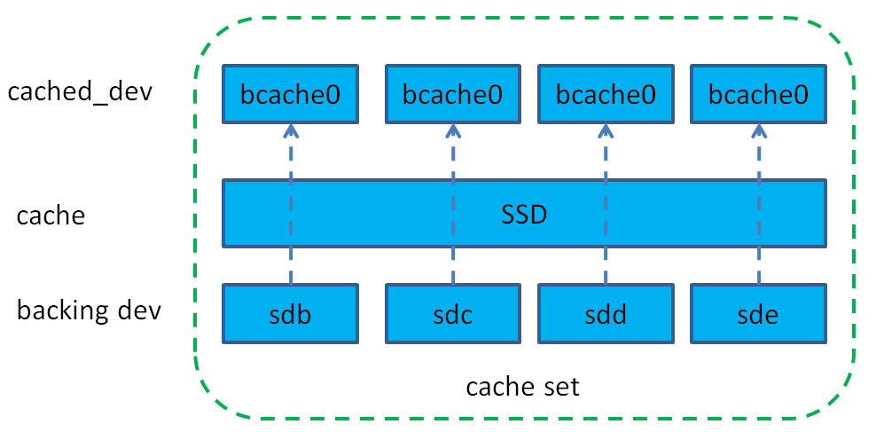
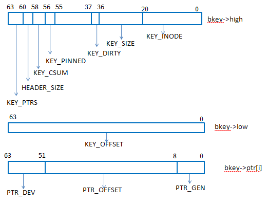
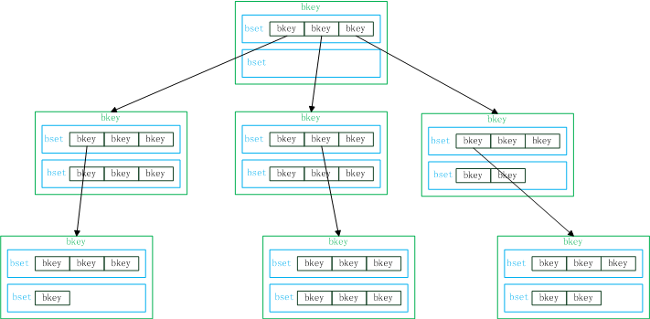
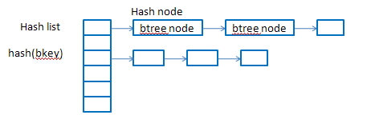
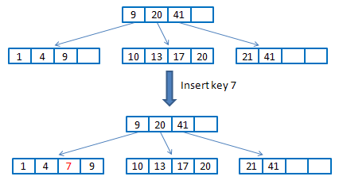
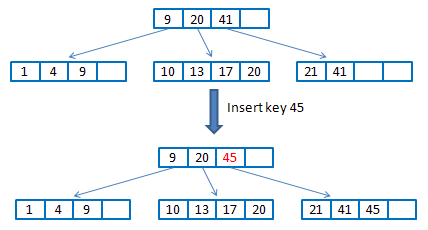
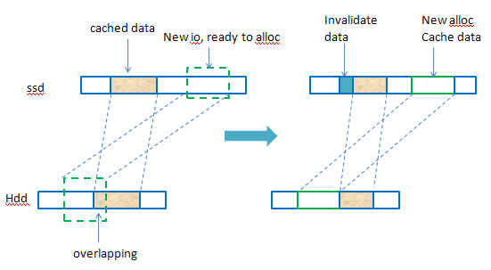
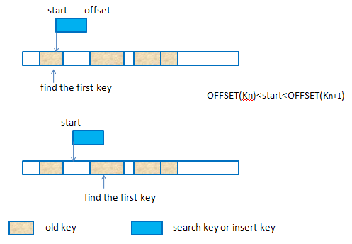
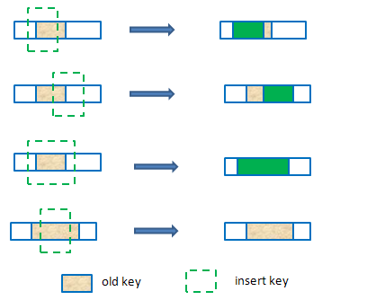
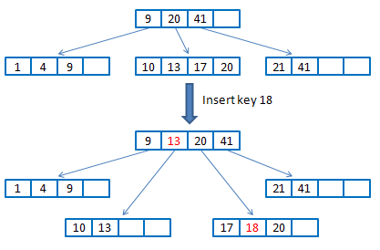

## bcache / 如何使用bcache构建LVM,软RAID / 如何优化bcache
          
### 作者         
digoal          
          
### 日期        
2016-09-19      
          
### 标签        
bcache , mdadm , lvm2 , 软RAID    
          
----        
        
## bcache 背景知识
本小章节转载自 http://www.sysnote.org/2014/06/20/bcache-analysis/  
  
1\. 简介  
bcache是linux内核块设备层cache，类似于flashcache使用ssd作为hdd的缓存方案，相比于flashcache，bcache更加灵活，支持ssd作为多块hdd的共享缓存，并且还支持多块ssd（还未完善），能够在运行中动态增加，删除缓存设备和后端设备。  
  
从3.10开始，bcache进入内核主线。  
  
bcache支持writeback、writethrough、writearoud三种策略，默认是wriththrough，可以动态修改，缓存替换方式支持lru、fifo和random三种。下面从几个方面介绍bcache的实现机制。  
  
2\.总体结构  
  
bcache的整体结构如图所示。  
  
  
  
bcache中是以cache set来划分不同存储集合，一个cache set中包含一个或多个缓存设备（一般是ssd），一个或多个后端设备（一般是hdd）。  
  
bcache对外输出给用户使用的是/dev/bcache这种设备，每个bcache设备都与一个后端物理盘一一对应。  
  
用户对不同bcache设备的io会缓存在ssd中，刷脏数据的时候就会写到各自对应的后端设备上。  
  
因此，bcache扩容很容易，只要注册一个新的物理设备即可。  
  
3\. bcache关键结构  
  
3\.1 bucket  
  
缓存设备会按照bucket大小划分成很多bucket，bucket的大小最好是设置成与缓存设备ssd的擦除大小一致，一般建议128k~2M+，默认是512k。    
  
每个bucket有个优先级编号（16 bit的priority），每次hit都会增加，然后所有的bucket的优先级编号都会周期性地减少，不常用的会被回收，这个优先级编号主要是用来实现lru替换的。    
  
bucket还有8bit的generation，用来invalidate bucket用的。  
  
bucket内空间是追加分配的，只记录当前分配到哪个偏移了，下一次分配的时候从当前记录位置往后分配。另外在选择bucket来缓存数据时有两个优先原则：    
    
1）优先考虑io连续性，即使io可能来自于不同的生产者；  
  
2）其次考虑相关性，同一个进程产生的数据尽量缓存到相同的bucket里。  
  
3\.2 bkey  
  
bucket的管理是使用b+树索引，而b+树节点中的关键结构就是bkey，bkey就是记录缓存设备缓存数据和后端设备数据的映射关系的，其结构如下。  
  
```
struct bkey {
 uint64_t	high;
 uint64_t	low;
 uint64_t	ptr[];
}
```
  
  
  
其中：  
  
* KEY_INODE:表示一个后端设备的id编号（后端设备在cache set中一般以bdev0，bdev1这种方式出现）  
* KEY_SIZE：表示该bkey所对应缓存数据的大小  
* KEY_DIRTY：表示该块缓存数据是否是脏数据  
* KEY_PTRS：表示cache设备的个数（多个ptr是用来支持多个cache设备的，多个cache设备只对脏数据和元数据做镜像）  
* KEY_OFFSET：bkey所缓存的hdd上的那段数据区域的结束地址  
* PTR_DEV：cache设备  
* PTR_OFFSET：在缓存设备中缓存的数据的起始地址  
* PTR_GEN：对应cache的bucket的迭代数（版本）  
  
3\.3 bset  
  
一个bset是一个bkey的数组，在内存中的bset是一段连续的内存，并且以bkey排序的（bkey之间进行比较的时候是先比较KEY_INODE，如果KEY_INODE相同，再比较KEY_OFFSET）。  
  
bset在磁盘上（缓存设备）有很多，但是内存中一个btree node只有4个bset。  
  
4\. bcache中的b+树  
  
4\.1 btree结构  
  
bcache中以b+tree来维护索引，一个btree node里包含4个bset，每个bset中是排序的bkey。  
  
  
  
图中做了简化，一个btree node只画了两个bset。  
  
每个btree node以一个bkey来标识，该bkey是其子节点中所有bkey中的最大值，不同于标准的b+树那样，父节点存放子节点的地址指针，bcache中的b+树中非叶子节点中存放的bkey用于查找其子节点（并不是存的地址指针），而是根据bkey计算hash，再到hash表中取查找btree node。  
  
叶子节点中的bkey存放的就是实际的映射了（根据这些key可以找到缓存数据以及在hdd上的位置）。  
  
  
  
bkey插入到b+树中的过程与标准的b+树的插入过程类似，这里不做细讲。  
  
  
  
  
  
4\.2 btree插入bkey时overlapping的处理  
  
收到新的写io时，这个io对应hdd上的数据可能有部分已经缓存在ssd上了，这个时候为这个io创建的bkey就需要处理这种overlapping的问题。  
  
Btree node 是log structured，磁盘上的btree node有可能有overlap的情况，因为是在不同时候写入的。  

但是内存中的btree node不会有overlap，因为插入bkey时如果和内存中的bkey有overlap，就会解决overlap的问题；  
  
另外，从磁盘上读出btree node时就会把bsets中的bkey做归并排序，就会检查overlap的问题并进行解决。  
  
下图给出了一个示例情况。  

  
  
出现这种overlapping的情况，原来的bkey会做修改（ssd和hdd上的偏移都会修改，还有数据大小）。  
  
插入key或者查找key时，使用待处理的key的start来遍历bset中的bkey（bset中的bkey排序了），找到可能存在overlapping的第一个key，如下图描述的两种情况。  
  
  
  
要处理的overlapping情况有以下几种：  
  
  
  
读数据的时候也有可能出现这种部分命中，部分miss的情况，本质上和插入key处理overlapping的一样，只不过命中的部分从cache设备中读，miss的部分是从hdd读，并且会重新插入一个新的key来缓存这部分miss的数据。  
  
4\.3 btree node split  
  
b+树节点有最大大小限制，在新创建一个btree node时就在内存中分配了一段连续的空间来存放bset及bkey（按照指定的内存pages数），如果超过这个pages数，btree node就会分裂。  
  
在进行key的插入时，递归进行插入，到叶子节点上如果需要分裂，则会以3/5节点大小分裂成2个节点，把分裂成的两个节点的最大key通过op传到上层函数调用中，叶子节点这层函数退出后，在上一层的函数里就会把op中的key添加到keys中（这样就修改了父节点的指针），如果这一层还需要分裂，跟之前的分裂过程一致，分裂后的节点都会立即持久化到ssd中。  
  
  
  
5\. writeback  
  
bcache支持三种缓存策略：writeback，writethrough，writearoud。  
  
* writethrough就是既写ssd也写hdd，这样读的时候如果命中的话就可以从ssd中读，适应于读多写少的场景；  
* writearoud就是绕过ssd直接读写hdd，个人感觉这种方式没啥意义；  
* writeback就是ssd做写缓存，所有的写入都是先写缓存，然后会在后台刷脏数据，这里主要介绍writeback。  
  
上文提到bucket内是以追加的方式来分配空间的，一个bucket里面缓存的数据可能对应hdd上的不同位置，甚至有可能在不同的hdd。  
  
不同于flashcache以set为单位刷脏数据（等同于bcache中的bucket），bcache中以bkey为单位来writeback，而不是以bucket为单位。  
  
每个cache set都有一个writeback_keys，记录需要writeback的bkeys。  
  
当满足刷脏数据的条件时（脏数据比例），就会遍历整个b+树，查找dirty的bkey，放到writeback_keys中（writeback_keys有个大小限制），然后按照磁盘偏移排序，再进行刷脏数据的动作，数据写到hdd后，会把对应的bkey从writeback_keys移除，并去掉该bkey的dirty标记。  
  
这样的好处在于刷脏数据的时候可以尽量考虑hdd上的连续性，减少磁头的移动，而如果以bucket为单位刷，一个bucket可能缓存hdd上不同位置的数据，比较随机，刷脏数据的效率不高。  
  
既然bucket内的空间分配是按照追加的方式，每次都是从后面开发分配，而刷脏数据又不是以bucket为单位，那么就会出现bucket中有空洞的情况（bucket中间有些数据已经刷到磁盘上了），导致bucket已用空间不多，但是很多空闲空间比较分散，从后面分配又空间不足。  
  
对于这种情况，bcache中又专门的垃圾回收机制（gc），会把这种情况的bucket给回收掉，从而可以重新使用这个bucket。  
  
writeback方式虽然性能比较高，但是会出现意外宕机情况下的恢复问题。  
  
对于这种情况，bcache能够很好地处理。在引入journal之前（后面会介绍），在数据写入到缓存ssd中后，io并没有返回，而是等到相应的btree node也持久化后，再返回写成功，这样意味着每次写io都会写元数据，宕机的情况下就能够根据元数据恢复出来，不过这种方式就导致每次都要写元数据，而元数据的io都比较小，对于ssd来说，小io有写放大的问题，导致了效率低下。  
  
引入journal后，就解决了这个性能问题。  
  
6\. journal  
  
journal不是为了一致性恢复用的，而是为了提高性能。在writeback一节提到没有journal之前每次写操作都会更新元数据（一个bset），为了减少这个开销，引入journal，journal就是插入的keys的log，按照插入时间排序，只用记录叶子节点上bkey的更新，非叶子节点在分裂的时候就已经持久化了。  
  
这样每次写操作在数据写入后就只用记录一下log，在崩溃恢复的时候就可以根据这个log重新插入key。  
  
7\. garbage colletction  
  
gc的目的是为了重用buckets。  
  
初始化cache时会在bch_moving_init_cache_set中会初始化一个判断bkey是否可以gc的函数moving_pred，该函数就是判断该key所对应的bucket的GC_SECTORS_USED是否小于cache->gc_move_threshold，如果是则可以gc，否则不能。  
  
gc一般是由invalidate buckets触发的。  
  
bcache使用一个moving_gc_keys（key buf，以红黑树来维护）来存放可以gc的keys，gc时会扫描整个btree，判断哪些bkey是可以gc的，把能够gc的bkey加到moving_gc_keys中，然后就根据这个可以gc的key先从ssd中读出数据，然后同样根据key中记录的hdd上的偏移写到hdd中，成功后把该key从moving_gc_keys中移除。  
  
8\. 总结  
  
bcache相对于flashcache要复杂很多，使用b+树来维护索引就可见一斑。  
  
虽然bcache已经进入了内核主线，但是目前使用bcache的人还是比较少的，离商用还有一段距离。  
  
bcache还不太稳定，时不时有些bug出现，而且其稳定性需要比较长的时间来检测。  
  
而flashcache来说就稳定很多，而且有facebook作为其最大的维护者，国内外还有很多公司也在使用，成熟度是公认的。  
  
## 一、bcache 术语
### bcache 设备种类
1\. backing 设备  
    
指SSD后面的设备，通常是机械盘。  
    
2\. cache 设备  
    
指缓存设备，通常为SSD。  
    
使用bcache分为三个步骤:   
1\. 创建backing和cache设备    
  
2\. 注册backing和cache设备  
  
3\. 绑定backing和cache设备  
  
所有设备在使用之前都需要注册。  
  
一个cache设备可以绑定到多个backing设备，但是一个backing设备不可以绑定多个cache设备。    
  
### cache模式
```
writethrough [writeback] writearound none
```
  
### bucket size
cache设备（ssd）被格式为多个bucket，每个bucket用来缓存一部分backing设备的block。  
  
cache设备将以bucket为最小单位，将数据同步到backing设备，或重用bucket。  
  
使用bucket的好处是减少离散的写操作。  
  
### block size
表示cache设备数据块的大小，should match hardware sector size.   
  
ssd通常为4K。  
  
## 二、bcache 安装
需要安装bcache、bcache-tools包。  
  
需要将块设备的ioscheduler改成deadline的。   
  
## 三、bcache 设备的部署
1\. 环境说明  
```
ssd /dev/dfa   

disk /dev/sdb, ...... 若干  
```
  
2\. 创建gpt分区表  
```
#parted -s /dev/dfa mklabel gpt
#parted -s /dev/sdb mklabel gpt
#parted -s /dev/sdc mklabel gpt
```
  
3\. 分区，注意对齐  
```
#parted -s /dev/dfa mkpart primary 1MiB xxxxGB
#parted -s /dev/dfa mkpart primary xxxxGB yyyyGB
#parted -s /dev/sdb mkpart primary 1MiB zzzzGB
#parted -s /dev/sdc mkpart primary 1MiB zzzzGB
```
  
这里将ssd分成2个区，目的是演示多个cache设备的情况，实际上一个SSD不需要分成多个区来使用。  
  
4\. 创建backing或cache设备的命令  
```
#make-bcache --help
Usage: make-bcache [options] device
        -C, --cache             Format a cache device
        -B, --bdev              Format a backing device
        -b, --bucket            bucket size
        -w, --block             block size (hard sector size of SSD, often 2k)
        -o, --data-offset       data offset in sectors
            --cset-uuid         UUID for the cache set
            --writeback         enable writeback
            --discard           enable discards
            --cache_replacement_policy=(lru|fifo)
        -h, --help              display this help and exit
```
  
5\. 创建cache设备  
  
指定cache设备的扇区大小，以及bucket大小  
  
```
#make-bcache -C -b 1MiB -w 4KiB --discard --cache_replacement_policy=lru /dev/dfa1
UUID:                   8ef3535a-c42f-49ca-a5ed-2d4207524e22
Set UUID:               a01f921f-a91b-46ad-b682-2f59d0be4717
version:                0
nbuckets:               1525878
block_size:             8     单位(扇区,512字节)
bucket_size:            2048  单位(扇区,512字节)
nr_in_set:              1
nr_this_dev:            0
first_bucket:           1
```
  
说明  
```
discard
  Boolean; if on a discard/TRIM will be issued to each bucket before it is
  reused. Defaults to off, since SATA TRIM is an unqueued command (and thus
  slow).

block_size
Minimum granularity of writes - should match hardware sector size.
```
  
6\. 创建backing设备，(data-offset可以用来指定偏移量，达到对齐的目的)。  
  
backing设备与cache设备的block_size必须设置为一样的，所以以两者大的为准即可。  
  
```
#make-bcache -B --writeback -w 4KiB /dev/sdb1 --wipe-bcache
UUID:                   d813d8ab-6541-4296-a77e-e35d18d2d6ec
Set UUID:               8033e49c-270d-4a8f-b5e9-f331ac77bf80
version:                1
block_size:             8    单位(扇区,512字节)
data_offset:            16   单位(扇区,512字节)
```
  
7\. 注册cache, backing设备  
  
```
echo /dev/dfa1 > /sys/fs/bcache/register
echo /dev/sdb1 > /sys/fs/bcache/register
```
  
8\. 观察  
  
```
#ll /sys/block/dfa/dfa1/bcache/
block_size                bucket_size               clear_stats               io_errors                 nbuckets                  priority_stats            written                   
btree_written             cache_replacement_policy  discard                   metadata_written          physical_block_size       set/ 

#ll /sys/block/sdb/sdb1/bcache/
attach                         dirty_bytes                    no_cache_wt_pages              sequential_cutoff              stripe_size                    writeback_percent              writeback_running
cache_mode                     dirty_data                     page_cache_enable              state                          tdc/                           writeback_rate                 wt_torture_test
clear_stats                    drop_page_cache                partial_stripes_expensive      stats_day/                     winto_keys_debug               writeback_rate_debug           
dc_high_latency_filter_ms      io_stats_read                  readahead                      stats_five_minute/             writeback_debug                writeback_rate_d_term          
dc_high_latency_stats          io_stats_write                 read_via_page_cache            stats_hour/                    writeback_delay                writeback_rate_min             
detach                         io_stats_writeback_detail      running                        stats_total/                   writeback_flush_enable         writeback_rate_p_term_inverse  
device/                        label                          sequential_bios                stop                           writeback_metadata             writeback_rate_update_seconds 
```
  
如果注册了cache设备，可以看到bcache的cache set UUID，对应创建cache设备是返回的Set UUID:   
```
#ll /sys/fs/bcache/
total 0
drwxr-xr-x 7 root root    0 Sep 18 16:39 a01f921f-a91b-46ad-b682-2f59d0be4717
drwxr-xr-x 2 root root    0 Sep 18 16:41 bdevs
--w------- 1 root root 4096 Sep 18 16:38 register
--w------- 1 root root 4096 Sep 18 16:41 register_quiet
```
  
注册了backing设备，则可以看到对应的bcache设备  
```
#lsblk
sdb           8:16   0   xxT  0 disk 
`-sdb1        8:17   0   xxT  0 part 
  `-bcache0 251:0    0   xxT  0 disk 
```
  
9\. 将cache设备绑定到backing设备  
  
完成这一步，ssd缓存才生效  
  
指定cache设备的UUID(通过#ll /sys/fs/bcache/得到)，写入backing设备对应的attach  
  
```
# echo a01f921f-a91b-46ad-b682-2f59d0be4717 > /sys/block/sdb/sdb1/bcache/attach
```
  
10\. 检查bcache设备状态  
```
#cat /sys/block/sdb/sdb1/bcache/state 
clean
```
  
11\. 检查 或 修改缓存模式   
```
#cat /sys/block/sdb/sdb1/bcache/cache_mode 
writethrough [writeback] writearound none

#echo writethrough > /sys/block/sdb/sdb1/bcache/cache_mode 

#cat /sys/block/sdb/sdb1/bcache/cache_mode 
[writethrough] writeback writearound none

#echo writeback > /sys/block/sdb/sdb1/bcache/cache_mode 

#cat /sys/block/sdb/sdb1/bcache/cache_mode 
writethrough [writeback] writearound none
```
  
12\. 创建文件系统  
```
#mkfs.ext4 /dev/bcache0 -m 0 -O extent,uninit_bg -E lazy_itable_init=1 -T largefile -L sdb1
```
  
13\. mount 文件系统  
```
mount -o defaults,noatime,nodiratime,nodelalloc,barrier=0 LABEL=sdb1 /disk1
```
  
## 四、bcache 调优
1\. backing设备块对齐，如果backing设备是RAID设备，可以将--data-offset设置为raid 条带大小的倍数，避免写放大。  
  
```
make-bcache --data-offset  
```
  
如果考虑未来RAID的扩展，则建议这样计算data-offset的值    
```
   For example:  If you have a 64k stripe size, then the following offset
   would provide alignment for many common RAID5 data spindle counts:
	64k * 2*2*2*3*3*5*7 bytes = 161280k

   That space is wasted, but for only 157.5MB you can grow your RAID 5
   volume to the following data-spindle counts without re-aligning:
	3,4,5,6,7,8,9,10,12,14,15,18,20,21 ...
```
  
2\. 调整backing设备的连续IO阈值，表示bcache0设备的连续写IO大于4MB时，大于4MB的部分不会过SSD设备，也不会缓存到ssd，而是直接写backing设备。  
```
echo 4M > /sys/block/bcache0/bcache/sequential_cutoff
```
  
3\. 如何防止cache设备成为瓶颈  
  
bcache会跟踪每个IO，如果IO的时间超过阈值，则旁路cache设备，直接读写backing设备。  
  
如果你的SSD足够强大，可以不跟踪，减少跟踪的开销。  
```
   # echo 0 > /sys/fs/bcache/<cache set uuid>/congested_read_threshold_us
   # echo 0 > /sys/fs/bcache/<cache set uuid>/congested_write_threshold_us
```
  
关闭旁路的另一个好处是，所有的离散读写都会经过cache设备，从而不会导致cache missing。  
  
默认情况下当读请求超过2ms，写请求超过20ms时，旁路cache设备。  
```
   The default is 2000 us (2 milliseconds) for reads, and 20000 for writes.  
```
  
## 五、bcache 自启动脚本
重启后，需要启动bcache模块(内核自带bcache除外)，重新注册设备，如果修改了bcache的一些配置，也需要重新修改，例如。  
  
```
加载内核模块

modprobe bcache

注册设备
echo /dev/dfa1 > /sys/fs/bcache/register
echo /dev/sdb1 > /sys/fs/bcache/register
......
```
  
重启后，不需要重新创建cache, backing设备，不需要重新绑定backing和cache设备。  
  
## 六、bcache 性能测试
使用fio测试bcache设备的性能。  
  
```
yum install -y libaio

git clone https://github.com/axboe/fio
cd fio
./configure --prefix=/home/digoal/fiohome
make -j 32
make install

export PATH=/home/digoal/fiohome/bin:$PATH
```
  
测试性能  
  
假设bcache设备的挂载点为/disk1  
```
fio -filename=/disk1/testdir -direct=1 -iodepth 1 -thread -rw=write -ioengine=libaio -bs=32K -size=16G -numjobs=128 -runtime=60 -group_reporting -name=mytest
fio -filename=/disk1/testdir -direct=1 -iodepth 1 -thread -rw=read -ioengine=libaio -bs=32K -size=16G -numjobs=128 -runtime=60 -group_reporting -name=mytest
fio -filename=/disk1/testdir -direct=1 -iodepth 1 -thread -rw=randwrite -ioengine=libaio -bs=32K -size=16G -numjobs=128 -runtime=60 -group_reporting -name=mytest
fio -filename=/disk1/testdir -direct=1 -iodepth 1 -thread -rw=randread -ioengine=libaio -bs=32K -size=16G -numjobs=128 -runtime=60 -group_reporting -name=mytest
```
  
## 七、bcache 维护
### 添加backing, cache设备
  
1\. 添加cache设备  
```
#make-bcache -C -b 1MiB -w 4KiB --discard --cache_replacement_policy=lru /dev/dfa2
UUID:                   cbe1760b-43bf-47f0-94b1-cd1136576873
Set UUID:               826b8b21-1f40-4a1d-ad2b-84f1ecbb4c45
version:                0
nbuckets:               1525878
block_size:             8
bucket_size:            2048
nr_in_set:              1
nr_this_dev:            0
first_bucket:           1
```
  
2\. 注册cache设备  
```
echo /dev/dfa2 > /sys/fs/bcache/register
```
  
3\. 添加backing设备  
```
# make-bcache -B --writeback -w 4KiB /dev/sdc1 --wipe-bcache
UUID:                   e406b0b2-69f9-4f4c-8b18-2d314ce6ed35
Set UUID:               f8877b48-3c59-40a7-919e-029ce2d3249d
version:                1
block_size:             8
data_offset:            16
```
  
4\. 注册backing设备  
```
echo /dev/sdc1 > /sys/fs/bcache/register
```
   
5\. 绑定cache与backing设备  
```
echo 826b8b21-1f40-4a1d-ad2b-84f1ecbb4c45 > /sys/block/sdc/sdc1/bcache/attach
```
  
使用以上方法，将所有的backding盘都操作一下(mklabel gpt, mkpart, make-bcache -B, register, 绑定)。    
  
现在变成这样的。  
  
```
#lsblk
NAME         MAJ:MIN RM   SIZE RO TYPE MOUNTPOINT
sdb            8:16   0   xxT  0 disk 
`-sdb1         8:17   0   xxT  0 part 
  `-bcache0  251:0    0   xxT  0 disk /disk1
sdc            8:32   0   xxT  0 disk 
`-sdc1         8:33   0   xxT  0 part 
  `-bcache1  251:1    0   xxT  0 disk 
......
dfa          252:0    0   zzT  0 disk 
|-dfa1       252:1    0   yyT  0 part 
| |-bcache0  251:0    0   xxT  0 disk /disk1
| |-bcache1  251:1    0   xxT  0 disk 
| |...
| `-bcache5  251:5    0   xxT  0 disk 
`-dfa2       252:2    0   yyT  0 part 
  |-bcache6  251:6    0   xxT  0 disk 
  |-bcache7  251:7    0   xxT  0 disk 
  |...
  `-bcache11 251:11   0   xxT  0 disk 
```
  
12块机械盘分别绑定到两个cache设备上。    
  
注意  
  
如果有多个SSD设备都需要作为一个backing设备的cache设备的话，可以使用lvm将ssd做成条带，从而提升cache设备的整体IO能力和带宽能力。  
  
然后再将lvm设备作为cache设备即可。    
  
如果是多个backding设备，则可以像以上的方法一样，不同的backing设备绑定不同的cache设备。  
  
### 删除backing, cache设备  
步骤如下  
  
1\. umount 挂载点  
  
2\. 如果有在bcache设备上建立了软RAID或者逻辑卷，首先要解除这层关系  
```
lvremove 
vgremove
pvremove
```
  
或
```
mdadm -S md设备
```
  
3\. 删除cache设备前，必须确保没有任何与之绑定的backing设备，解除backing与cache设备的绑定 (detach)    
```
echo 1 > /sys/block/sdX/sdX[Y]/bcache/detach  

echo <cache set uuid> /sys/block/bcache<N>/bcache/detach
```
  
4\. 停止 backing设备  
detach cache设备后，我们还需要这一步，才能删除backing设备。  
```
echo 1 > /sys/block/sdX/sdX[Y]/bcache/stop
```
  
5\. unregister cache 设备  
```
echo 1 > /sys/fs/bcache/<cache-set-uuid>/stop

echo 1 > /sys/fs/bcache/[SSD bcache UUID]/unregister
```
  
6\. wipe-cache -a 清理块设备的头信息  
```
wipe-cache -a /dev/dfa1
wipe-cache -a /dev/sd[b-m]1
```
  
## 八、软raid on bcache
使用bcache盘，构建软RAID的例子  
  
1\. 4块bcache盘，创建raid5   
```
#mdadm --create --verbose /dev/md0 -c 4M --level=5 --raid-devices=4 /dev/bcache[0-3]
```
  
2\. 4块bcache盘，创建raid5   
```
#mdadm --create --verbose /dev/md1 -c 4M --level=5 --raid-devices=4 /dev/bcache[4-7]
```
  
3\. 4块bcache盘，创建raid5   
```
#mdadm --create --verbose /dev/md2 -c 4M --level=5 --raid-devices=4 /dev/bcache[89] /dev/bcache1[01]
```
  
4\. 2块软raid盘，创建raid0   
```
#mdadm --create --verbose /dev/md3 -c 4M --level=0 --raid-devices=2 /dev/md[01]
```
  
5\. 创建文件系统  
stride即条带的大小（单位512字节）  
  
stripe-width即条带的宽度，等于stride*实际的数据盘数量（扣掉校验盘和mirror盘）  
```
#/home/digoal/e2fsprogs/sbin/mkfs.ext4 /dev/md3 -b 4096 -m 0 -O extent,uninit_bg -E lazy_itable_init=1,stripe-width=192,stride=32 -T largefile -L md3

#/home/digoal/e2fsprogs/sbin/mkfs.ext4 /dev/md2 -b 4096 -m 0 -O extent,uninit_bg -E lazy_itable_init=1,stripe-width=96,stride=32 -T largefile -L md2
```
  
6\. 加载文件系统  
stripe等于创建时指定的stripe-width  
```
#mount -o defaults,noatime,nodiratime,nodelalloc,barrier=0,data=writeback,stripe=192 LABEL=md3 /disk1

#mount -o defaults,noatime,nodiratime,nodelalloc,barrier=0,data=writeback,stripe=96 LABEL=md2 /disk2
```
  
## 九、lvm on bcache
使用bcache设备构建逻辑卷。  
  
1\. 添加bcache lvm支持  
```
vi /etc/lvm.conf
types = [ "bcache", 16 ]
```
  
2\. 创建PV  
```
pvcreate /dev/bcache[0-9]
pvcreate /dev/bcache1[01]
```
  
3\. 创建VG  
设置一个PE的大小  
```
vgcreate -s 128M vgdata01 /dev/bcache[0-9] /dev/bcache1[01]

#vgs
  VG       #PV #LV #SN Attr   VSize  VFree 
  vgdata01  12   0   0 wz--n- 87.33t 87.33t
```
  
4\. 创建 lvm raid时触发BUG，LVM版本太老  
```
#lvcreate --type raid5 -i 11 -I 4M -l 100%VG -n lv01 vgdata01 
  WARNING:  RAID segment types are considered Tech Preview
  For more information on Tech Preview features, visit:
  https://access.redhat.com/support/offerings/techpreview/
  Rounding size (715392 extents) up to stripe boundary size (715396 extents)
  Volume group "vgdata01" has insufficient free space (715392 extents): 715396 required.


man lvmcreate
Sistina Software UK LVM TOOLS 2.02.87(2)-RHEL6 (2011-10-12)


dmesg
[32634.575210] device-mapper: raid: Supplied region_size (1024 sectors) below minimum (8943)
[32634.583958] device-mapper: table: 253:24: raid: Supplied region size is too small
[32634.592008] device-mapper: ioctl: error adding target to table
```
  
原因，测试环境为CentOS 6.3以前的版本，所以LVM2版本很老，存在BUG    
https://bugzilla.redhat.com/show_bug.cgi?id=837927  
```
    RAID: Fix problems with creating, extending and converting large RAID LVs
    
    MD's bitmaps can handle 2^21 regions at most.  The RAID code has always
    used a region_size of 1024 sectors.  That means the size of a RAID LV was
    limited to 1TiB.  (The user can adjust the region_size when creating a
    RAID LV, which can affect the maximum size.)  Thus, creating, extending or
    converting to a RAID LV greater than 1TiB would result in a failure to
    load the new device-mapper table.
    
    Again, the size of the RAID LV is not limited by how much space is allocated
    for the metadata area, but by the limitations of the MD bitmap.  Therefore,
    we must adjust the 'region_size' to ensure that the number of regions does
    not exceed the limit.  I've added code to do this when extending a RAID LV
    (which covers 'create' and 'extend' operations) and when up-converting -
    specifically from linear to RAID1.

Fix verified in the latest rpms.

2.6.32-348.el6.x86_64
lvm2-2.02.98-6.el6    BUILT: Thu Dec 20 07:00:04 CST 2012
lvm2-libs-2.02.98-6.el6    BUILT: Thu Dec 20 07:00:04 CST 2012
lvm2-cluster-2.02.98-6.el6    BUILT: Thu Dec 20 07:00:04 CST 2012
udev-147-2.43.el6    BUILT: Thu Oct 11 05:59:38 CDT 2012
device-mapper-1.02.77-6.el6    BUILT: Thu Dec 20 07:00:04 CST 2012
device-mapper-libs-1.02.77-6.el6    BUILT: Thu Dec 20 07:00:04 CST 2012
device-mapper-event-1.02.77-6.el6    BUILT: Thu Dec 20 07:00:04 CST 2012
device-mapper-event-libs-1.02.77-6.el6    BUILT: Thu Dec 20 07:00:04 CST 2012
cmirror-2.02.98-6.el6    BUILT: Thu Dec 20 07:00:04 CST 2012
```
  
5\. 创建普通lvm正常(-I 大点，对于OLAP系统更好)  
```
# lvcreate -i 12 -I 4M -l 100%VG -n lv01 vgdata01 
  Logical volume "lv01" created


# lvs
  LV   VG       Attr   LSize  Origin Snap%  Move Log Copy%  Convert
  lv01 vgdata01 -wi-a- 87.33t 


# /home/digoal/e2fsprogs/sbin/mkfs.ext4 /dev/mapper/vgdata01-lv01 -b 4096 -m 0 -O extent,uninit_bg -E lazy_itable_init=1,stripe-width=24,stride=2 -T largefile -L lv01


# mount -o defaults,noatime,nodiratime,nodelalloc,barrier=0,data=writeback,stripe=24 LABEL=lv01 /disk1
```
  
6\. 使用新版本LVM2解决BUG  
更新LVM2版本    
  
https://sourceware.org/lvm2/  
  
```
# tar -zxvf LVM2.2.02.165.tgz

# cd LVM2.2.02.165

# sudo 

# ./configure --prefix=/home/digoal/lvm2 ; make -j 32 ; make install

#export LD_LIBRARY_PATH=/home/digoal/lvm2/lib:$LD_LIBRARY_PATH
#export PATH=/home/digoal/lvm2/sbin:$PATH
#export MANPATH=/home/digoal/lvm2/share/man:$MANPATH

# /home/digoal/lvm2/sbin/pvs
  PV            VG       Fmt  Attr PSize PFree
  /dev/bcache0  vgdata01 lvm2 a--  7.28t 7.28t
  /dev/bcache1  vgdata01 lvm2 a--  7.28t 7.28t
  /dev/bcache10 vgdata01 lvm2 a--  7.28t 7.28t
  /dev/bcache11 vgdata01 lvm2 a--  7.28t 7.28t
  /dev/bcache2  vgdata01 lvm2 a--  7.28t 7.28t
  /dev/bcache3  vgdata01 lvm2 a--  7.28t 7.28t
  /dev/bcache4  vgdata01 lvm2 a--  7.28t 7.28t
  /dev/bcache5  vgdata01 lvm2 a--  7.28t 7.28t
  /dev/bcache6  vgdata01 lvm2 a--  7.28t 7.28t
  /dev/bcache7  vgdata01 lvm2 a--  7.28t 7.28t
  /dev/bcache8  vgdata01 lvm2 a--  7.28t 7.28t
  /dev/bcache9  vgdata01 lvm2 a--  7.28t 7.28t

# man /home/digoal/lvm2/share/man/man8/lvcreate.8
```
  
6\.1\. 创建2个raid5逻辑卷，分别使用8块，4块bcache盘。    
lvcreate -i 表示实际的数据盘数量（需要扣除校验盘，mirror盘）。  
  
lvcreate -I 单位KB，表示写多少内容后开始写下一个数据盘，即表示条带的大小。  
  
mkfs.ext4 stride=16表示条带大小，单位扇区（512字节），stripe-width=112 表示条带宽度（=stride * -i）。  
  
```
#/home/digoal/lvm2/sbin/lvcreate --type raid5 -i 7 -I 64 -l 100%PVS -n lv01 vgdata01 /dev/bcache[0-7]
  Rounding size 58.22 TiB (476928 extents) up to stripe boundary size 58.22 TiB (476931 extents).
  Logical volume "lv01" created.

#/home/digoal/e2fsprogs/sbin/mkfs.ext4 /dev/mapper/vgdata01-lv01 -b 4096 -m 0 -O extent,uninit_bg -E lazy_itable_init=1,stripe-width=112,stride=16 -T largefile -L lv01

#mount -o defaults,noatime,nodiratime,nodelalloc,barrier=0,data=writeback,stripe=112 LABEL=lv01 /disk1


/home/digoal/lvm2/sbin/lvcreate --type raid5 -i 3 -I 64 -l 100%PVS -n lv02 vgdata01 /dev/bcache[89] /dev/bcache1[01]

/home/digoal/e2fsprogs/sbin/mkfs.ext4 /dev/mapper/vgdata01-lv02 -b 4096 -m 0 -O extent,uninit_bg -E lazy_itable_init=1,stripe-width=48,stride=16 -T largefile -L lv02

mount -o defaults,noatime,nodiratime,nodelalloc,barrier=0,data=writeback,stripe=48 LABEL=lv02 /disk2
```
  
6\.2\. 创建raid10逻辑卷  
```
/home/digoal/lvm2/sbin/lvcreate --type raid10 -i 6 -I 128 -l 100%VG -n lv01 vgdata01

/home/digoal/e2fsprogs/sbin/mkfs.ext4 /dev/mapper/vgdata01-lv01 -b 4096 -m 0 -O extent,uninit_bg -E lazy_itable_init=1,stripe-width=192,stride=32 -T largefile -L lv01

mount -o defaults,noatime,nodiratime,nodelalloc,barrier=0,data=writeback,stripe=192 LABEL=lv01 /disk1
```
  
## 十、配置参数或模块参数参考 
有些值可以被修改，达到调整的目的。    
  
1\. SYSFS - BACKING DEVICE  
```
Available at /sys/block/<bdev>/bcache, /sys/block/bcache*/bcache and
(if attached) /sys/fs/bcache/<cset-uuid>/bdev*

attach
  Echo the UUID of a cache set to this file to enable caching.

cache_mode
  Can be one of either writethrough, writeback, writearound or none.

clear_stats
  Writing to this file resets the running total stats (not the day/hour/5 minute
  decaying versions).

detach
  Write to this file to detach from a cache set. If there is dirty data in the
  cache, it will be flushed first.

dirty_data
  Amount of dirty data for this backing device in the cache. Continuously
  updated unlike the cache set's version, but may be slightly off.

label
  Name of underlying device.

readahead
  Size of readahead that should be performed.  Defaults to 0.  If set to e.g.
  1M, it will round cache miss reads up to that size, but without overlapping
  existing cache entries.

running
  1 if bcache is running (i.e. whether the /dev/bcache device exists, whether
  it's in passthrough mode or caching).

sequential_cutoff
  A sequential IO will bypass the cache once it passes this threshold; the
  most recent 128 IOs are tracked so sequential IO can be detected even when
  it isn't all done at once.

sequential_merge
  If non zero, bcache keeps a list of the last 128 requests submitted to compare
  against all new requests to determine which new requests are sequential
  continuations of previous requests for the purpose of determining sequential
  cutoff. This is necessary if the sequential cutoff value is greater than the
  maximum acceptable sequential size for any single request.

state
  The backing device can be in one of four different states:

  no cache: Has never been attached to a cache set.

  clean: Part of a cache set, and there is no cached dirty data.

  dirty: Part of a cache set, and there is cached dirty data.

  inconsistent: The backing device was forcibly run by the user when there was
  dirty data cached but the cache set was unavailable; whatever data was on the
  backing device has likely been corrupted.

stop
  Write to this file to shut down the bcache device and close the backing
  device.

writeback_delay
  When dirty data is written to the cache and it previously did not contain
  any, waits some number of seconds before initiating writeback. Defaults to
  30.

writeback_percent
  If nonzero, bcache tries to keep around this percentage of the cache dirty by
  throttling background writeback and using a PD controller to smoothly adjust
  the rate.

writeback_rate
  Rate in sectors per second - if writeback_percent is nonzero, background
  writeback is throttled to this rate. Continuously adjusted by bcache but may
  also be set by the user.

writeback_running
  If off, writeback of dirty data will not take place at all. Dirty data will
  still be added to the cache until it is mostly full; only meant for
  benchmarking. Defaults to on.
```
  
2\. SYSFS - BACKING DEVICE STATS:  
```
There are directories with these numbers for a running total, as well as
versions that decay over the past day, hour and 5 minutes; they're also
aggregated in the cache set directory as well.

bypassed
  Amount of IO (both reads and writes) that has bypassed the cache

cache_hits
cache_misses
cache_hit_ratio
  Hits and misses are counted per individual IO as bcache sees them; a
  partial hit is counted as a miss.

cache_bypass_hits
cache_bypass_misses
  Hits and misses for IO that is intended to skip the cache are still counted,
  but broken out here.

cache_miss_collisions
  Counts instances where data was going to be inserted into the cache from a
  cache miss, but raced with a write and data was already present (usually 0
  since the synchronization for cache misses was rewritten)

cache_readaheads
  Count of times readahead occurred.
```
  
3\. SYSFS - CACHE SET:  
```
Available at /sys/fs/bcache/<cset-uuid>

average_key_size
  Average data per key in the btree.

bdev<0..n>
  Symlink to each of the attached backing devices.

block_size
  Block size of the cache devices.

btree_cache_size
  Amount of memory currently used by the btree cache

bucket_size
  Size of buckets

cache<0..n>
  Symlink to each of the cache devices comprising this cache set.

cache_available_percent
  Percentage of cache device which doesn't contain dirty data, and could
  potentially be used for writeback.  This doesn't mean this space isn't used
  for clean cached data; the unused statistic (in priority_stats) is typically
  much lower.

clear_stats
  Clears the statistics associated with this cache

dirty_data
  Amount of dirty data is in the cache (updated when garbage collection runs).

flash_vol_create
  Echoing a size to this file (in human readable units, k/M/G) creates a thinly
  provisioned volume backed by the cache set.

io_error_halflife
io_error_limit
  These determines how many errors we accept before disabling the cache.
  Each error is decayed by the half life (in # ios).  If the decaying count
  reaches io_error_limit dirty data is written out and the cache is disabled.

journal_delay_ms
  Journal writes will delay for up to this many milliseconds, unless a cache
  flush happens sooner. Defaults to 100.

root_usage_percent
  Percentage of the root btree node in use.  If this gets too high the node
  will split, increasing the tree depth.

stop
  Write to this file to shut down the cache set - waits until all attached
  backing devices have been shut down.

tree_depth
  Depth of the btree (A single node btree has depth 0).

unregister
  Detaches all backing devices and closes the cache devices; if dirty data is
  present it will disable writeback caching and wait for it to be flushed.
```
  
4\. SYSFS - CACHE SET INTERNAL:  
```
This directory also exposes timings for a number of internal operations, with
separate files for average duration, average frequency, last occurrence and max
duration: garbage collection, btree read, btree node sorts and btree splits.

active_journal_entries
  Number of journal entries that are newer than the index.

btree_nodes
  Total nodes in the btree.

btree_used_percent
  Average fraction of btree in use.

bset_tree_stats
  Statistics about the auxiliary search trees

btree_cache_max_chain
  Longest chain in the btree node cache's hash table

cache_read_races
  Counts instances where while data was being read from the cache, the bucket
  was reused and invalidated - i.e. where the pointer was stale after the read
  completed. When this occurs the data is reread from the backing device.

trigger_gc
  Writing to this file forces garbage collection to run.
```
  
5\. SYSFS - CACHE DEVICE:  
```
Available at /sys/block/<cdev>/bcache

block_size
  Minimum granularity of writes - should match hardware sector size.

btree_written
  Sum of all btree writes, in (kilo/mega/giga) bytes

bucket_size
  Size of buckets

cache_replacement_policy
  One of either lru, fifo or random.

discard
  Boolean; if on a discard/TRIM will be issued to each bucket before it is
  reused. Defaults to off, since SATA TRIM is an unqueued command (and thus
  slow).

freelist_percent
  Size of the freelist as a percentage of nbuckets. Can be written to to
  increase the number of buckets kept on the freelist, which lets you
  artificially reduce the size of the cache at runtime. Mostly for testing
  purposes (i.e. testing how different size caches affect your hit rate), but
  since buckets are discarded when they move on to the freelist will also make
  the SSD's garbage collection easier by effectively giving it more reserved
  space.

io_errors
  Number of errors that have occurred, decayed by io_error_halflife.

metadata_written
  Sum of all non data writes (btree writes and all other metadata).

nbuckets
  Total buckets in this cache

priority_stats
  Statistics about how recently data in the cache has been accessed.
  This can reveal your working set size.  Unused is the percentage of
  the cache that doesn't contain any data.  Metadata is bcache's
  metadata overhead.  Average is the average priority of cache buckets.
  Next is a list of quantiles with the priority threshold of each.

written
  Sum of all data that has been written to the cache; comparison with
  btree_written gives the amount of write inflation in bcache.
```
  
## 十一、参考
http://www.sysnote.org/2014/06/20/bcache-analysis/  
http://www.sysnote.org/2014/05/29/bcache-use/    
http://blog.csdn.net/liangchen0322/article/details/50322635  
https://wiki.archlinux.org/index.php/Bcache  
https://github.com/axboe/fio  
http://elf8848.iteye.com/blog/2168876  
http://www.atatech.org/articles/62373  
https://www.kernel.org/doc/Documentation/bcache.txt  
http://raid.wiki.kernel.org/  
http://wushank.blog.51cto.com/3489095/1114437  
http://zackreed.me/raid50-mdadm/  
https://access.redhat.com/documentation/en-US/Red_Hat_Enterprise_Linux/6/html/Logical_Volume_Manager_Administration/raid_volumes.html  
https://sourceware.org/lvm2/  
https://linux.die.net/man/1/fio  
  
  
  
<a rel="nofollow" href="http://info.flagcounter.com/h9V1"  ></a>  
  
  
  
  
  
  
## [digoal's 大量PostgreSQL文章入口](https://github.com/digoal/blog/blob/master/README.md "22709685feb7cab07d30f30387f0a9ae")
  
