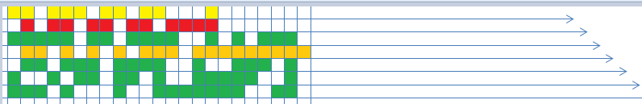

## PostgreSQL pgbench SQL RT 与 事务RT 浅析
          
### 作者         
digoal          
          
### 日期        
2016-09-26       
          
### 标签        
PostgreSQL , pgbench , rt    
          
----        
          
## 背景  
使用pgbench测试数据库性能时，在输出的报告中，可以输出事务的平均RT，以及单条SQL的平均RT。  
  
那么这两个有什么分别呢？  
  
   
  
每行代表一个线程，被填充了颜色的部分表示从客户端发起SQL到SQL返回的时间窗口，没有填充颜色的部分表示线程的空闲时间。  
  
如何统计事务 平均RT :    
执行的事务数/总的测试时长    
    
如何统计SQL 平均RT :    
每条SQL的执行时长累加/总的SQL执行次数    
    
从计算公式以及图例来分析，显然SQL的平均RT会更低，因为没有计算线程的空闲时间。  
  
特别是pgbench与数据库在同一主机进行测试时，全力压测（CPU吃满）的情况下，PGBENCH的线程等待（空闲）时间会更明显，SQL的RT会比事务的RT低很多。  
    
那么哪个值更能代表数据库的处理能力呢？  
  
SQL平均RT可以代表数据库的真实处理能力，而事务RT则是代表从客户端到数据库端作为一个整体来看待的事务处理能力（包括客户端的处理时间，数据库的处理时间，以及网络传输时间）。   
  
## pgbench 相关源码浅析
### 不加 -r 参数
返回样例如下  
```
transaction type: TPC-B (sort of)
scaling factor: 100
query mode: prepared
number of clients: 10
number of threads: 10
duration: 10 s
number of transactions actually processed: 29032
latency average: 3.442 ms
latency stddev: 74.879 ms
tps = 2902.936994 (including connections establishing)
tps = 2903.710037 (excluding connections establishing)
```

代码如下  
打印事务RT（或脚本RT）为 测试的持续时长 除以 总的事务数   
```
                /* only an average latency computed from the duration is available */
                printf("latency average: %.3f ms\n",
                           1000.0 * duration * nclients / total->cnt);
```
  
### 加 -r 参数
```
  -r, --report-latencies   report average latency per command
```
  
返回样例如下  
```
transaction type: TPC-B (sort of)
scaling factor: 100
query mode: prepared
number of clients: 10
number of threads: 10
duration: 10 s
number of transactions actually processed: 22000
latency average: 5.634 ms
latency stddev: 191.632 ms
tps = 1773.794731 (including connections establishing)
tps = 1774.193277 (excluding connections establishing)
statement latencies in milliseconds:
        0.003053        \set nbranches 1 * :scale
        0.000832        \set ntellers 10 * :scale
        0.000661        \set naccounts 100000 * :scale
        0.001120        \setrandom aid 1 :naccounts
        0.000909        \setrandom bid 1 :nbranches
        0.000742        \setrandom tid 1 :ntellers
        0.000773        \setrandom delta -5000 5000
        0.053747        BEGIN;
        0.183235        UPDATE pgbench_accounts SET abalance = abalance + :delta WHERE aid = :aid;
        0.092281        SELECT abalance FROM pgbench_accounts WHERE aid = :aid;
        0.113678        UPDATE pgbench_tellers SET tbalance = tbalance + :delta WHERE tid = :tid;
        0.155755        UPDATE pgbench_branches SET bbalance = bbalance + :delta WHERE bid = :bid;
        0.088806        INSERT INTO pgbench_history (tid, bid, aid, delta, mtime) VALUES (:tid, :bid, :aid, :delta, CURRENT_TIMESTAMP);
        4.929969        END;
```

代码浅析  
参数  
```
-r
                        case 'r':
                                benchmarking_option_set = true;
                                per_script_stats = true;
                                is_latencies = true;
                                break;
```

语句开始时间  
```
        instr_time      stmt_begin;             /* used for measuring statement latencies */
......
        /* Record statement start time if per-command latencies are requested */
        if (is_latencies)
                INSTR_TIME_SET_CURRENT(st->stmt_begin);
```
  
累加语句的执行时间  
```
                /*
                 * command finished: accumulate per-command execution times in
                 * thread-local data structure, if per-command latencies are requested
                 */
                if (is_latencies)
                {
                        if (INSTR_TIME_IS_ZERO(now))
                                INSTR_TIME_SET_CURRENT(now);

                        /* XXX could use a mutex here, but we choose not to */
                        addToSimpleStats(&commands[st->state]->stats,
                                                         INSTR_TIME_GET_DOUBLE(now) -
                                                         INSTR_TIME_GET_DOUBLE(st->stmt_begin));
                }
......
/*
 * Accumulate one value into a SimpleStats struct.
 */
static void
addToSimpleStats(SimpleStats *ss, double val)
{
        if (ss->count == 0 || val < ss->min)
                ss->min = val;
        if (ss->count == 0 || val > ss->max)
                ss->max = val;
        ss->count++;
        ss->sum += val;
        ss->sum2 += val * val;
}
```
  
数据结构  
```
/*
 * Simple data structure to keep stats about something.
 *
 * XXX probably the first value should be kept and used as an offset for
 * better numerical stability...
 */
typedef struct SimpleStats
{
        int64           count;                  /* how many values were encountered */
        double          min;                    /* the minimum seen */
        double          max;                    /* the maximum seen */
        double          sum;                    /* sum of values */
        double          sum2;                   /* sum of squared values */
} SimpleStats;


/*
 * Data structure to hold various statistics: per-thread and per-script stats
 * are maintained and merged together.
 */
typedef struct StatsData
{
        long            start_time;             /* interval start time, for aggregates */
        int64           cnt;                    /* number of transactions */
        int64           skipped;                /* number of transactions skipped under --rate
                                                                 * and --latency-limit */
        SimpleStats latency;
        SimpleStats lag;
} StatsData;
```
  
打印语句的RT （语句的累计时间 除以 语句的调用次数）    
```
                        /* Report per-command latencies */
                        if (is_latencies)
                        {
                                Command   **commands;

                                printf(" - statement latencies in milliseconds:\n");

                                for (commands = sql_script[i].commands;
                                         *commands != NULL;
                                         commands++)
                                        printf("   %11.3f  %s\n",
                                                   1000.0 * (*commands)->stats.sum /
                                                   (*commands)->stats.count,
                                                   (*commands)->line);
                        }
```
        
    
  
<a rel="nofollow" href="http://info.flagcounter.com/h9V1"  ></a>  
  
  
  
  
  
  
## [digoal's 大量PostgreSQL文章入口](https://github.com/digoal/blog/blob/master/README.md "22709685feb7cab07d30f30387f0a9ae")
  
