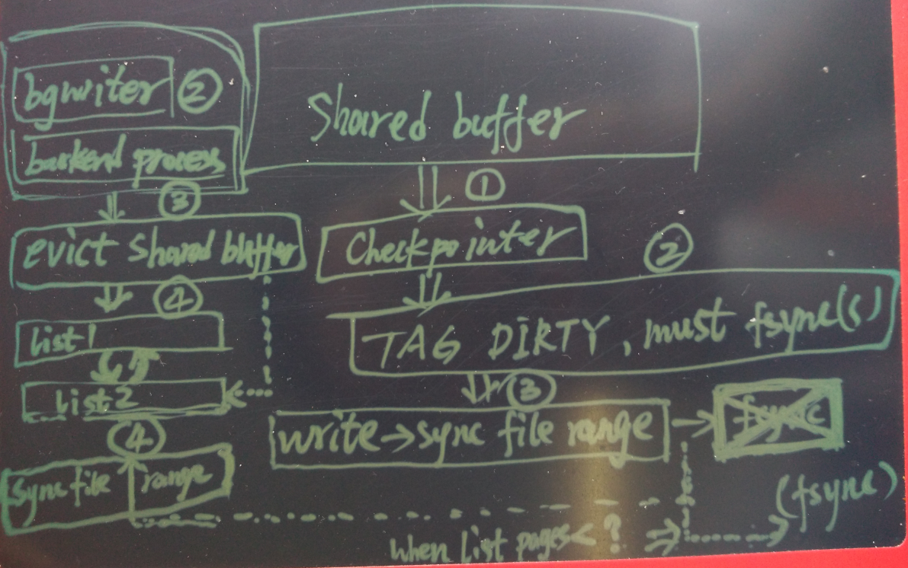

## PostgreSQL 9.6 检查点柔性优化(SYNC_FILE_RANGE) - 在单机多实例下的IO Hang问题浅析与优化
          
### 作者         
digoal          
          
### 日期        
2016-09-28       
          
### 标签        
PostgreSQL , 检查点 , sync_file_range      
          
----        
          
## 背景  
PostgreSQL检查点是将shared buffer中的脏页打标记，并集中将其刷到磁盘的动作（fsync）。（期间可能有刷盘的调度，降低当脏页很多时带来的IO影响）    
  
在检查点之外，平时bgwriter进程则会使用bufferio的方式（write）将脏页写到OS的dirty page。  
  
如果shared buffer非常大，而且数据库应用如果是频繁产生脏页的应用，那么检查点带来的性能影响会非常的明显。  
  
例如shared buffer有100G，活跃数据有100G，同时活跃数据在不停的被UPDATE（产生脏页），那么在发生检查点时，fsync的过程中，可能导致性能急剧下降。    
  
## 现象
接下来重现一下以上问题。  
  
单机开启100个PG实例，每个实例限制一定的内存，CPU，以及IO资源，其中日志盘IOPS限制4000，数据盘IOPS限制800。  
  
压测方法  
  
每个实例最大数据量1亿，对数据进行随机的UPSERT操作。    
```
  echo "\set id random(1,100000000)" > ~/test$i.sql
  echo "insert into test (id,info,crt_time) values (:id, md5(random()::text), now()) on conflict on constraint test_pkey do update set info=excluded.info, crt_time=excluded.crt_time;" >> ~/test$i.sql
```
  
因此全表都是热点。  
  
每个实例连4个连接，同时进行压测。  
  
测试用例参考  
  
[20160927_01.md](20160927_01.md)  
    
由于同时开启测试，每个节点几乎在同一时间点进入检查点状态。  
  
产生大量的Writeback内存。  
  
通过以下方法可以观察到    
```
while(true) ; do cat /proc/meminfo |grep -E "Dirty|Writeback"; sleep 0.5; done

Dirty:          24752872 kB
Writeback:      11312408 kB
WritebackTmp:          0 kB
```
  
解释  
```
Dirty — The total amount of memory, in kilobytes, waiting to be written back to the disk.
Writeback — The total amount of memory, in kilobytes, actively being written back to the disk.
```
  
在产生了大量的Writeback内存计数后，最后检查点调用fsync前，因为脏页没有完全落盘，导致实例的检查点在fsync的阶段需要耗费自己的IOPS进行刷盘，非常慢。  
  
甚至实例完全不可用。  
  
观察到的现象   
  
数据库整机IO很低（只有数据盘的IO，并且受到CGROUP限制），  
  
tps降到0  (更新块被堵塞)  ( shared buffer中没有剩余的块?  )    
```
progress: 1321.0 s, 0.0 tps, lat -nan ms stddev -nan
progress: 1322.0 s, 0.0 tps, lat -nan ms stddev -nan
progress: 1323.0 s, 0.0 tps, lat -nan ms stddev -nan
progress: 1324.0 s, 0.0 tps, lat -nan ms stddev -nan
progress: 1325.0 s, 0.0 tps, lat -nan ms stddev -nan
progress: 1326.0 s, 0.0 tps, lat -nan ms stddev -nan
progress: 1327.0 s, 0.0 tps, lat -nan ms stddev -nan
progress: 1328.0 s, 0.0 tps, lat -nan ms stddev -nan
progress: 1329.0 s, 0.0 tps, lat -nan ms stddev -nan
progress: 1330.0 s, 0.0 tps, lat -nan ms stddev -nan
```
  
需要等待实例的Writeback 全部刷盘后才能恢复。    
  
期间进程状态如下  
```
  PID USER      PR  NI  VIRT  RES  SHR S %CPU %MEM    TIME+  COMMAND
49799 digoal  20   0 1300m 155m 155m S  0.0  0.0   0:00.59 postgres -B 1GB -c port=1922 -c listen_addresses=0.0.0.0 -c synchronous_commit=on -c full_page_writes=on -c wal_buffers=128MB -c wal_writer_flush_after=0 -c bgwriter_delay=10ms
49844 digoal  20   0 1300m 129m 128m S  0.0  0.0   0:09.01 postgres: wal writer process                                                                                                                                                    
49845 digoal  20   0 1300m 1952 1224 S  0.0  0.0   0:05.71 postgres: autovacuum launcher process                                                                                                                                           
49838 digoal  20   0  113m  892  460 S  0.0  0.0   0:00.03 postgres: logger process                                                                                                                                                        
16531 digoal  20   0 1300m 1.1g 1.1g D  0.0  0.2   1:22.71 postgres: postgres postgres 127.0.0.1(49777) INSERT                                                                                                                             
16534 digoal  20   0 1300m 1.1g 1.1g D  0.0  0.2   1:22.32 postgres: postgres postgres 127.0.0.1(49778) INSERT                                                                                                                             
16535 digoal  20   0 1300m 1.1g 1.1g D  0.0  0.2   1:22.73 postgres: postgres postgres 127.0.0.1(49780) INSERT                                                                                                                             
16537 digoal  20   0 1300m 1.1g 1.1g D  0.0  0.2   1:22.43 postgres: postgres postgres 127.0.0.1(49781) INSERT                                                                                                                             
49842 digoal  20   0 1301m 1.0g 1.0g D  0.0  0.2   0:23.70 postgres: checkpointer process                                                                                                                                                  
49846 digoal  20   0  115m 1048  552 D  0.0  0.0   0:12.83 postgres: stats collector process                                                                                                                                               
49843 digoal  20   0 1300m 978m 977m D  0.0  0.2   0:46.35 postgres: writer process
```
  
状态解释  
```
       w: S  --  Process Status
          The status of the task which can be one of:
             ’D’ = uninterruptible sleep
             ’R’ = running
             ’S’ = sleeping
             ’T’ = traced or stopped
             ’Z’ = zombie
```
  
进程stack信息    
  
checkpointer进程  
```
cat /proc/49842/stack 
[<ffffffff81121281>] generic_file_aio_write+0x71/0x100
[<ffffffffa00c0463>] ext4_file_write+0x43/0xe0 [ext4]
[<ffffffff8118863a>] do_sync_write+0xfa/0x140
[<ffffffff81188938>] vfs_write+0xb8/0x1a0
[<ffffffff81189231>] sys_write+0x51/0x90
[<ffffffff8100c072>] system_call_fastpath+0x16/0x1b
[<ffffffffffffffff>] 0xffffffffffffffff
```
  
stats收集进程  
```
cat /proc/49846/stack 
[<ffffffffa00a708a>] start_this_handle+0x25a/0x480 [jbd2]
[<ffffffffa00a7495>] jbd2_journal_start+0xb5/0x100 [jbd2]
[<ffffffffa00e4b24>] ext4_journal_start_sb+0x74/0x140 [ext4]
[<ffffffffa00d20ba>] ext4_create+0x7a/0x150 [ext4]
[<ffffffff811972c4>] vfs_create+0xb4/0xe0
[<ffffffff8119ad90>] do_filp_open+0xb10/0xdd0
[<ffffffff81185829>] do_sys_open+0x69/0x140
[<ffffffff81185940>] sys_open+0x20/0x30
[<ffffffff8100c072>] system_call_fastpath+0x16/0x1b
[<ffffffffffffffff>] 0xffffffffffffffff
```
  
bgwriter进程   
```
cat /proc/49843/stack 
[<ffffffffa00a708a>] start_this_handle+0x25a/0x480 [jbd2]
[<ffffffffa00a7495>] jbd2_journal_start+0xb5/0x100 [jbd2]
[<ffffffffa00e4b24>] ext4_journal_start_sb+0x74/0x140 [ext4]
[<ffffffffa00c896a>] ext4_dirty_inode+0x2a/0x60 [ext4]
[<ffffffff811b461b>] __mark_inode_dirty+0x3b/0x160
[<ffffffff811a3e12>] file_update_time+0xf2/0x170
[<ffffffff81120fb0>] __generic_file_aio_write+0x230/0x490
[<ffffffff81121298>] generic_file_aio_write+0x88/0x100
[<ffffffffa00c0463>] ext4_file_write+0x43/0xe0 [ext4]
[<ffffffff8118863a>] do_sync_write+0xfa/0x140
[<ffffffff81188938>] vfs_write+0xb8/0x1a0
[<ffffffff81189231>] sys_write+0x51/0x90
[<ffffffff8100c072>] system_call_fastpath+0x16/0x1b
[<ffffffffffffffff>] 0xffffffffffffffff
```
  
backend process 进程    
```
cat /proc/16537/stack 
[<ffffffffa00bfff0>] ext4_llseek+0x60/0x110 [ext4]
[<ffffffff81186eda>] vfs_llseek+0x3a/0x40
[<ffffffff81188b96>] sys_lseek+0x66/0x80
[<ffffffff8100c072>] system_call_fastpath+0x16/0x1b
[<ffffffffffffffff>] 0xffffffffffffffff
```
    
logger进程    
```
cat /proc/49838/stack 
[<ffffffffa00a708a>] start_this_handle+0x25a/0x480 [jbd2]
[<ffffffffa00a7495>] jbd2_journal_start+0xb5/0x100 [jbd2]
[<ffffffffa00e4b24>] ext4_journal_start_sb+0x74/0x140 [ext4]
[<ffffffffa00c896a>] ext4_dirty_inode+0x2a/0x60 [ext4]
[<ffffffff811b461b>] __mark_inode_dirty+0x3b/0x160
[<ffffffff811a3e12>] file_update_time+0xf2/0x170
[<ffffffff81120fb0>] __generic_file_aio_write+0x230/0x490
[<ffffffff81121298>] generic_file_aio_write+0x88/0x100
[<ffffffffa00c0463>] ext4_file_write+0x43/0xe0 [ext4]
[<ffffffff8118863a>] do_sync_write+0xfa/0x140
[<ffffffff81188938>] vfs_write+0xb8/0x1a0
[<ffffffff81189231>] sys_write+0x51/0x90
[<ffffffff8100c072>] system_call_fastpath+0x16/0x1b
[<ffffffffffffffff>] 0xffffffffffffffff
``` 
    
wal writer进程    
```
cat /proc/49844/stack 
[<ffffffff811d0bfd>] ep_poll+0x2ad/0x330
[<ffffffff811d0d45>] sys_epoll_wait+0xc5/0xe0
[<ffffffff8100c072>] system_call_fastpath+0x16/0x1b
[<ffffffffffffffff>] 0xffffffffffffffff
```
      
文件系统已使用data=writeback挂载  
```
/dev/mapper/vgdata01-lv01 on /u01 type ext4 (rw,noatime,nodiratime,nodelalloc,barrier=0,data=writeback)
/dev/mapper/vgdata01-lv02 on /u02 type ext4 (rw,noatime,nodiratime,nodelalloc,barrier=0,data=writeback)
```
  
## 原因分析
PostgreSQL 9.6的检查点改进如下  
  
1\. 阶段1(调用write + 检查点调度)   
2\. 阶段2(调用sync_file_range)  
实际上通过设置OS调度也能缓解，例如。   
```
vm.dirty_background_ratio = 0
vm.dirty_background_bytes = 102400000
vm.dirty_ratio = 95
vm.dirty_bytes = 0
vm.dirty_writeback_centisecs = 100
vm.dirty_expire_centisecs = 3000
```
3\. 阶段3(fsync)  
    
分析  
  
1\. 从检查点源码开始  
```
/*
 * CheckPointBuffers
 *
 * Flush all dirty blocks in buffer pool to disk at checkpoint time.
 *
 * Note: temporary relations do not participate in checkpoints, so they don't
 * need to be flushed.
 */
void
CheckPointBuffers(int flags)
{
        TRACE_POSTGRESQL_BUFFER_CHECKPOINT_START(flags);
        CheckpointStats.ckpt_write_t = GetCurrentTimestamp();
        BufferSync(flags);
        CheckpointStats.ckpt_sync_t = GetCurrentTimestamp();
        TRACE_POSTGRESQL_BUFFER_CHECKPOINT_SYNC_START();
        smgrsync();
        CheckpointStats.ckpt_sync_end_t = GetCurrentTimestamp();
        TRACE_POSTGRESQL_BUFFER_CHECKPOINT_DONE();
}
```
  
### 阶段1(write+检查点调度)
2\. 调用BufferSync  
```
/*
 * BufferSync -- Write out all dirty buffers in the pool.
 *
 * This is called at checkpoint time to write out all dirty shared buffers.
 * The checkpoint request flags should be passed in.  If CHECKPOINT_IMMEDIATE
 * is set, we disable delays between writes; if CHECKPOINT_IS_SHUTDOWN,
 * CHECKPOINT_END_OF_RECOVERY or CHECKPOINT_FLUSH_ALL is set, we write even
 * unlogged buffers, which are otherwise skipped.  The remaining flags
 * currently have no effect here.
 */
static void
BufferSync(int flags)
{

.....
        WritebackContextInit(&wb_context, &checkpoint_flush_after);

.....
        /*
         * Iterate through to-be-checkpointed buffers and write the ones (still)
         * marked with BM_CHECKPOINT_NEEDED. The writes are balanced between
         * tablespaces; otherwise the sorting would lead to only one tablespace
         * receiving writes at a time, making inefficient use of the hardware.
         */
        num_processed = 0;
        num_written = 0;
        while (!binaryheap_empty(ts_heap))
        {
......
                if (pg_atomic_read_u32(&bufHdr->state) & BM_CHECKPOINT_NEEDED)
                {
                        // 调用 write，产生os dirty page，同时记录writeback wb_context。   
			if (SyncOneBuffer(buf_id, false, &wb_context) & BUF_WRITTEN)    
                        {
                                TRACE_POSTGRESQL_BUFFER_SYNC_WRITTEN(buf_id);
                                BgWriterStats.m_buf_written_checkpoints++;
                                num_written++;
                        }
                }
.......
                /*
                 * Sleep to throttle our I/O rate.
                 */
                // 这里有一个检查点调度，通过GUC变量checkpoint_completion_target设置。    
		// 不展开，详见 src/backend/postmaster/checkpointer.c    
		// 这里只是write调度，并不是fsync的调度。  
		CheckpointWriteDelay(flags, (double) num_processed / num_to_scan);  
.....
        }
.....
        // 告诉操作系统内核，开始将dirty page write out到磁盘。  (异步)  
	/* issue all pending flushes */
        IssuePendingWritebacks(&wb_context);
.....
```
  
3\. 调用SyncOneBuffer  
```
...
        FlushBuffer(bufHdr, NULL);
...
        ScheduleBufferTagForWriteback(wb_context, &tag);
...
```
  
4\. 调用FlushBuffer  
```
...
        /*
         * bufToWrite is either the shared buffer or a copy, as appropriate.
         */
        smgrwrite(reln,
                          buf->tag.forkNum,
                          buf->tag.blockNum,
                          bufToWrite,
                          false);
...
```
  
5\. 调用mdwrite    
```
        nbytes = FileWrite(v->mdfd_vfd, buffer, BLCKSZ);  
```
  
6\. 调用FileWrite     
```
        returnCode = write(VfdCache[file].fd, buffer, amount);  
```
  
调用write产生dirty page    
  
7\. 调用ScheduleBufferTagForWriteback  
```
        /*
         * Perform pending flushes if the writeback limit is exceeded. This
         * includes the case where previously an item has been added, but control
         * is now disabled.
         */
        if (context->nr_pending >= *context->max_pending)
                IssuePendingWritebacks(context);
```
  
8\. 调用IssuePendingWritebacks   
作用见阶段2。  
  
### 阶段2(sync_file_range)  
9\. 调用IssuePendingWritebacks  
```
/*
 * Issue all pending writeback requests, previously scheduled with
 * ScheduleBufferTagForWriteback, to the OS.
 *
 * Because this is only used to improve the OSs IO scheduling we try to never
 * error out - it's just a hint.
 */
void
IssuePendingWritebacks(WritebackContext *context)
{
        int                     i;

        if (context->nr_pending == 0)
                return;

        /*
         * Executing the writes in-order can make them a lot faster, and allows to
         * merge writeback requests to consecutive blocks into larger writebacks.
         */
        // 对脏页排序，sync file range时合并单个文件中的相邻page，减少fsync时的随机IO    
	qsort(&context->pending_writebacks, context->nr_pending,
                  sizeof(PendingWriteback), buffertag_comparator);

        /*
         * Coalesce neighbouring writes, but nothing else. For that we iterate
         * through the, now sorted, array of pending flushes, and look forward to
         * find all neighbouring (or identical) writes.  
         */
        for (i = 0; i < context->nr_pending; i++)
        {
                PendingWriteback *cur;
                PendingWriteback *next;
                SMgrRelation reln;
                int                     ahead;
                BufferTag       tag;
                Size            nblocks = 1;

                cur = &context->pending_writebacks[i];
                tag = cur->tag;

                /*
                 * Peek ahead, into following writeback requests, to see if they can
                 * be combined with the current one.
                 */
                // 合并顺序的BLOCK，减少IO次数。XFS文件系统的sync_file_range操作已经自动支持了。    
		for (ahead = 0; i + ahead + 1 < context->nr_pending; ahead++)
                {
                        next = &context->pending_writebacks[i + ahead + 1];

                        /* different file, stop */
                        if (!RelFileNodeEquals(cur->tag.rnode, next->tag.rnode) ||
                                cur->tag.forkNum != next->tag.forkNum)
                                break;

                        /* ok, block queued twice, skip */
                        if (cur->tag.blockNum == next->tag.blockNum)
                                continue;

                        /* only merge consecutive writes */
                        if (cur->tag.blockNum + 1 != next->tag.blockNum)
                                break;

                        nblocks++;
                        cur = next;
                }

                i += ahead;

                /* and finally tell the kernel to write the data to storage */
                reln = smgropen(tag.rnode, InvalidBackendId);
                
		// 告诉OS内核，准备刷脏页，一个range为以上合并的页数.  
		smgrwriteback(reln, tag.forkNum, tag.blockNum, nblocks);
        }

        context->nr_pending = 0;
}

......
```
  
10\. 调用smgrwriteback    
src/backend/storage/smgr/md.c  
```
/*
 * mdwriteback() -- Tell the kernel to write pages back to storage.
 *
 * This accepts a range of blocks because flushing several pages at once is
 * considerably more efficient than doing so individually.
 */
void
mdwriteback(SMgrRelation reln, ForkNumber forknum,
                        BlockNumber blocknum, BlockNumber nblocks)
{
        /*
         * Issue flush requests in as few requests as possible; have to split at
         * segment boundaries though, since those are actually separate files.
         */
        while (nblocks > 0)
        {
                BlockNumber nflush = nblocks;
                off_t           seekpos;
                MdfdVec    *v;
                int                     segnum_start,
                                        segnum_end;

                v = _mdfd_getseg(reln, forknum, blocknum, true /* not used */ ,
                                                 EXTENSION_RETURN_NULL);

                /*
                 * We might be flushing buffers of already removed relations, that's
                 * ok, just ignore that case.
                 */
                if (!v)
                        return;

                /* compute offset inside the current segment */
                segnum_start = blocknum / RELSEG_SIZE;

                /* compute number of desired writes within the current segment */
                segnum_end = (blocknum + nblocks - 1) / RELSEG_SIZE;
                if (segnum_start != segnum_end)
                        nflush = RELSEG_SIZE - (blocknum % ((BlockNumber) RELSEG_SIZE));

                Assert(nflush >= 1);
                Assert(nflush <= nblocks);

                seekpos = (off_t) BLCKSZ *(blocknum % ((BlockNumber) RELSEG_SIZE));

                // 调用FileWriteback
		FileWriteback(v->mdfd_vfd, seekpos, (off_t) BLCKSZ * nflush);

                nblocks -= nflush;
                blocknum += nflush;
        }
}
```
   
11\. 调用FileWriteback  
```
void
FileWriteback(File file, off_t offset, off_t nbytes)
{
        int                     returnCode;

        Assert(FileIsValid(file));

        DO_DB(elog(LOG, "FileWriteback: %d (%s) " INT64_FORMAT " " INT64_FORMAT,
                           file, VfdCache[file].fileName,
                           (int64) offset, (int64) nbytes));

        /*
         * Caution: do not call pg_flush_data with nbytes = 0, it could trash the
         * file's seek position.  We prefer to define that as a no-op here.
         */
        if (nbytes <= 0)
                return;

        returnCode = FileAccess(file);
        if (returnCode < 0)
                return;

        // 调用pg_flush_data
	pg_flush_data(VfdCache[file].fd, offset, nbytes);
}
```
  
12\. 调用pg_flush_data  
src/backend/storage/file/fd.c  
```
void
pg_flush_data(int fd, off_t offset, off_t nbytes)
{
...
#if defined(HAVE_SYNC_FILE_RANGE)
        {
                int                     rc;

                // 注意，如果脏页很多时，sync_file_range的异步模式也可能被堵塞。    
		/*
                 * sync_file_range(SYNC_FILE_RANGE_WRITE), currently linux specific,
                 * tells the OS that writeback for the specified blocks should be
                 * started, but that we don't want to wait for completion.  Note that
                 * this call might block if too much dirty data exists in the range.
                 * This is the preferable method on OSs supporting it, as it works
                 * reliably when available (contrast to msync()) and doesn't flush out
                 * clean data (like FADV_DONTNEED).
                 */
                
		// 调用sync_file_range  
		rc = sync_file_range(fd, offset, nbytes,
                                                         SYNC_FILE_RANGE_WRITE);

                /* don't error out, this is just a performance optimization */
                if (rc != 0)
                {
                        ereport(WARNING,
                                        (errcode_for_file_access(),
                                         errmsg("could not flush dirty data: %m")));
                }

                return;
        }
...
```
  
（前面已经调用了write，现在告诉os 内核，开始将脏页刷到磁盘）      
  
注意，如果range指定的脏页很多时，sync_file_range的异步模式也可能被堵塞。     
  
调用sync_file_range  
  
异步模式    
```
SYNC_FILE_RANGE_WRITE
  Start  write-out  of  all dirty pages in the specified range which are not presently under write-out.      
  This is an asynchronous flush-to-disk operation.      
  This is not suitable for data integrity operations.     
```
  
### 不安定因素分析
1\. 以上动作做完后，操作系统不一定把dirty page都刷盘了。      
因为调用的是异步的sync_file_range。      
  
2\. 同时在此过程中，bgwrite, backend process还有可能将shared buffer中新产生的脏页写入os dirty page。    
这些脏页也许涉及到接下来检查点需要fsync的文件。   
  
### 阶段3(fsync)
13\. 接下来, 检查点开始调用smgrsync    
开始fsync文件级别，如果文件又产生了脏页怎么办(见以上不稳定因素分析)。    
  
```
/*
 *      smgrsync() -- Sync files to disk during checkpoint.
 */
void
smgrsync(void)
{
        int                     i;

        for (i = 0; i < NSmgr; i++)
        {
                if (smgrsw[i].smgr_sync)
                        (*(smgrsw[i].smgr_sync)) ();
        }
}
```
  
14\. 调用mdsync  
```
/*
 *      mdsync() -- Sync previous writes to stable storage.
 */
void
mdsync(void)
{
......
        /*
         * If we are in the checkpointer, the sync had better include all fsync
         * requests that were queued by backends up to this point.  The tightest
         * race condition that could occur is that a buffer that must be written
         * and fsync'd for the checkpoint could have been dumped by a backend just
         * before it was visited by BufferSync().  We know the backend will have
         * queued an fsync request before clearing the buffer's dirtybit, so we
         * are safe as long as we do an Absorb after completing BufferSync().
         */
        AbsorbFsyncRequests();

.....
        /* Now scan the hashtable for fsync requests to process */
        absorb_counter = FSYNCS_PER_ABSORB;
        hash_seq_init(&hstat, pendingOpsTable);
        while ((entry = (PendingOperationEntry *) hash_seq_search(&hstat)) != NULL)
        {
.....
                /*
                 * Scan over the forks and segments represented by the entry.
                 *
                 * The bitmap manipulations are slightly tricky, because we can call
                 * AbsorbFsyncRequests() inside the loop and that could result in
                 * bms_add_member() modifying and even re-palloc'ing the bitmapsets.
                 * This is okay because we unlink each bitmapset from the hashtable
                 * entry before scanning it.  That means that any incoming fsync
                 * requests will be processed now if they reach the table before we
                 * begin to scan their fork.
                 */
                for (forknum = 0; forknum <= MAX_FORKNUM; forknum++)
                {
......
                                        /* Attempt to open and fsync the target segment */
                                        seg = _mdfd_getseg(reln, forknum,
                                                         (BlockNumber) segno * (BlockNumber) RELSEG_SIZE,
                                                                           false,
                                                                           EXTENSION_RETURN_NULL
                                                                           | EXTENSION_DONT_CHECK_SIZE);

                                        INSTR_TIME_SET_CURRENT(sync_start);

                                        if (seg != NULL &&
                                                // 调用FileSync, 同步整个文件
						FileSync(seg->mdfd_vfd) >= 0)
                                        {
                                                /* Success; update statistics about sync timing */
                                                INSTR_TIME_SET_CURRENT(sync_end);
                                                sync_diff = sync_end;
                                                INSTR_TIME_SUBTRACT(sync_diff, sync_start);
                                                elapsed = INSTR_TIME_GET_MICROSEC(sync_diff);
                                                if (elapsed > longest)
                                                        longest = elapsed;
                                                total_elapsed += elapsed;
                                                processed++;
                                                if (log_checkpoints)
                                                        elog(DEBUG1, "checkpoint sync: number=%d file=%s time=%.3f msec",
                                                                 processed,
                                                                 FilePathName(seg->mdfd_vfd),
                                                                 (double) elapsed / 1000);

                                                break;  /* out of retry loop */
                                        }
```
  
15\. 调用FileSync, 同步整个文件  
```
int
FileSync(File file)
{
        int                     returnCode;

        Assert(FileIsValid(file));

        DO_DB(elog(LOG, "FileSync: %d (%s)",
                           file, VfdCache[file].fileName));

        returnCode = FileAccess(file);
        if (returnCode < 0)
                return returnCode;

        // 调用pg_fsync
	return pg_fsync(VfdCache[file].fd);
}
```
  
16\. 调用pg_fsync  
```
/*
 * pg_fsync --- do fsync with or without writethrough
 */
int
pg_fsync(int fd)
{
        // 从代码分析 linux下面不会调用pg_fsync_writethrough
	/* #if is to skip the sync_method test if there's no need for it */
#if defined(HAVE_FSYNC_WRITETHROUGH) && !defined(FSYNC_WRITETHROUGH_IS_FSYNC)
        if (sync_method == SYNC_METHOD_FSYNC_WRITETHROUGH)
                return pg_fsync_writethrough(fd);
        else
#endif
                return pg_fsync_no_writethrough(fd);
}
```

17\. 调用pg_fsync_no_writethrough  
```
/*
 * pg_fsync_no_writethrough --- same as fsync except does nothing if
 *      enableFsync is off
 */
int
pg_fsync_no_writethrough(int fd)
{
        if (enableFsync)
                return fsync(fd);
        else
                return 0;
}
```
  
18\. 调用 fsync 刷盘    
  
## 检查点带来的不安定因素分析
  
1\. 调用fsync前，操作系统不一定把dirty page都刷盘了。      
因为调用的是异步的sync_file_range。      
  
2\. 同时在此过程中，bgwrite, backend process还有可能将shared buffer中新产生的脏页写入os dirty page。    
这些脏页也许涉及到接下来检查点需要fsync的文件。  
  
因为这两个不安定因素的存在，同时加上环境中有多个PG实例，并且每个PG实例都限制了较小的DATA盘IO，导致fsync时刷盘非常的慢。    
  
REDO的IO能力远大于DATA盘的IO能力时，checkpoint过程中可能又会产生很多热点脏页。    
  
导致检查点在最后fsync收官时，需要刷dirty page，而同时又被实例的cgroup限制住，看起来就好像实例hang住一样。      
    
## 检查点调度在什么阶段
是在write阶段进行调度，在sync_file_range和fsync过程中都没有任何调度。    
  
## 检查点抖动优化方法1  
  
  
1\. 解决不安定因素1 - 避免检查点过程中产生未刷盘的dirty page  
  
在检查点过程中，bgwriter或backend process从shared buffer产生的脏页write out时，会调用write即buffer io。  
  
进入检查点后，bgwriter或backend process从shared buffer产生的脏页write out时，同时记录该PAGE的ID到list(1或2)。  
    
2\. checkpoint在最后阶段，即调用fsync前，插入一个阶段。  
  
将list(1或2)的PAGE实行sync_file_range，等待其刷盘成功。  
  
使用以下flag    
```
       SYNC_FILE_RANGE_WAIT_BEFORE | SYNC_FILE_RANGE_WRITE
              Ensures that all pages in the specified range which were dirty when sync_file_range() was called are placed under write-out.  This is a start-write-for-data-integrity operation.

或

       SYNC_FILE_RANGE_WAIT_BEFORE | SYNC_FILE_RANGE_WRITE | SYNC_FILE_RANGE_WAIT_AFTER
              This is a write-for-data-integrity operation that will ensure that all pages in the specified range which were dirty when sync_file_range() was called are committed to disk.
```
  
3\. 为了防止bgwrite或backend process 与checkpoint 的sync file range冲突。  
   
使用两个list来交替记录检查点开始后的shared buffer evict pages。  
  
4\. 新增一个GUC变量，配置当checkpoint最后一次sync file range的list page树少于多少时，进入fsync阶段。  
  
允许用户根据IOPS的规格，配置这个GUC变量，从而减少最后FSYNC时需要等待的page数。  
  
注意这个值也不能设得太小，否则可能造成漫长的很多轮list1和list2的sync file range过程。  
  
需要修改PostgreSQL内核，动作较大。  
  
5\. 解决不安定因素2 - 检查点最后的阶段，调用fsync前，确保fd的所有dirty page都已经write out。    
  
目前checkpoint调用的pg_flush_data是异步的sync_file_range，我们需要将其修改为同步的模式。  
  
建议只修改checkoint的调用，不要动到原有的逻辑。  
    
```
void
(int fd, off_t offset, off_t nbytes)
{
...
#if defined(HAVE_SYNC_FILE_RANGE)
        {
                int                     rc;

                // 注意，如果脏页很多时，sync_file_range的异步模式也可能被堵塞。    
		/*
                 * sync_file_range(SYNC_FILE_RANGE_WRITE), currently linux specific,
                 * tells the OS that writeback for the specified blocks should be
                 * started, but that we don't want to wait for completion.  Note that
                 * this call might block if too much dirty data exists in the range.
                 * This is the preferable method on OSs supporting it, as it works
                 * reliably when available (contrast to msync()) and doesn't flush out
                 * clean data (like FADV_DONTNEED).
                 */
                
		// 调用sync_file_range  ， 修改如下  
		rc = sync_file_range(fd, offset, nbytes,
                                                         SYNC_FILE_RANGE_WAIT_BEFORE | SYNC_FILE_RANGE_WRITE | SYNC_FILE_RANGE_WAIT_AFTER);

                /* don't error out, this is just a performance optimization */
                if (rc != 0)
                {
                        ereport(WARNING,
                                        (errcode_for_file_access(),
                                         errmsg("could not flush dirty data: %m")));
                }

                return;
        }
```
  
6\. 从OS内核层面解决IO hang的问题。  
    
阿里云RDS for PostgreSQL已从数据库内核层面完美的解决了这个问题，欢迎使用。  
    
## 检查点抖动优化方法2  
1\. 检查点柔性调度，减少FSYNC时的dirty pages，降低stall。  
checkpoint_flush_after (integer)  
```
Whenever more than checkpoint_flush_after bytes have been written while performing a checkpoint, 
attempt to force the OS to issue these writes to the underlying storage. 

Doing so will limit the amount of dirty data in the kernel's page cache, 
reducing the likelihood of stalls when an fsync is issued at the end of the checkpoint, 
or when the OS writes data back in larger batches in the background. 

Often that will result in greatly reduced transaction latency, but there also are some cases, 
especially with workloads that are bigger than shared_buffers, but smaller than the OS's page cache, 
where performance might degrade. 

This setting may have no effect on some platforms. 

The valid range is between 0, which disables controlled writeback, and 2MB. 

The default is 256kB on Linux, 0 elsewhere. 

(Non-default values of BLCKSZ change the default and maximum.) 

This parameter can only be set in the postgresql.conf file or on the server command line.
```
  
2\. bgwrite bufferio柔性调度，降低stall。     
bgwriter_flush_after (integer)    
```
Whenever more than bgwriter_flush_after bytes have been written by the bgwriter, 
attempt to force the OS to issue these writes to the underlying storage. 

Doing so will limit the amount of dirty data in the kernel's page cache, 
reducing the likelihood of stalls when an fsync is issued at the end of a checkpoint, 
or when the OS writes data back in larger batches in the background. 

Often that will result in greatly reduced transaction latency, but there also are some cases, 
especially with workloads that are bigger than shared_buffers, 
but smaller than the OS's page cache, where performance might degrade. 

This setting may have no effect on some platforms. 

The valid range is between 0, which disables controlled writeback, and 2MB. 

The default is 512kB on Linux, 0 elsewhere. 

(Non-default values of BLCKSZ change the default and maximum.) This parameter can only be set in the postgresql.conf file or on the server command line.
```
    
3\. 当SHARED BUFFER中没有空闲页或者干净的页时，backend也会evict dirty page。  这是对backend process的调度。  
backend_flush_after (integer)    
```
Whenever more than backend_flush_after bytes have been written by a single backend, 
attempt to force the OS to issue these writes to the underlying storage. 

Doing so will limit the amount of dirty data in the kernel's page cache, 
reducing the likelihood of stalls when an fsync is issued at the end of a checkpoint, 
or when the OS writes data back in larger batches in the background. 

Often that will result in greatly reduced transaction latency, but there also are some cases, 
especially with workloads that are bigger than shared_buffers, 
but smaller than the OS's page cache, where performance might degrade. 

This setting may have no effect on some platforms. 

The valid range is between 0, which disables controlled writeback, and 2MB. 

The default is 0 (i.e. no flush control). (Non-default values of BLCKSZ change the maximum.)
```
  
4\. 这个和shared buffer无关，是wal buffer的柔性调度。  
wal_writer_flush_after (integer)  
```
Specifies how often the WAL writer flushes WAL. 

In case the last flush happened less than wal_writer_delay milliseconds ago and less than wal_writer_flush_after bytes of WAL have been produced since, 
WAL is only written to the OS, not flushed to disk. 

If wal_writer_flush_after is set to 0 WAL is flushed every time the WAL writer has written WAL. 

The default is 1MB. This parameter can only be set in the postgresql.conf file or on the server command line.
```
  
## 摘录sync_file_range分析  
http://yoshinorimatsunobu.blogspot.com/2014/03/how-syncfilerange-really-works.html  
   
    
  
  
<a rel="nofollow" href="http://info.flagcounter.com/h9V1"  ></a>  
  
  
  
  
  
  
## [digoal's 大量PostgreSQL文章入口](https://github.com/digoal/blog/blob/master/README.md "22709685feb7cab07d30f30387f0a9ae")
  
