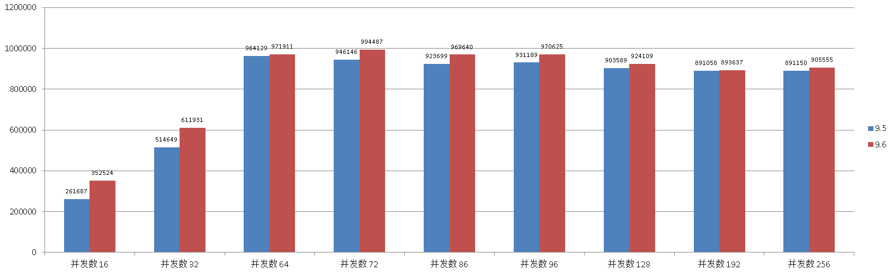
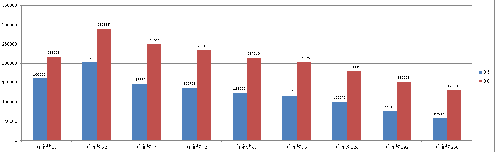
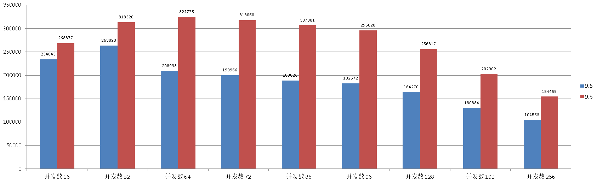
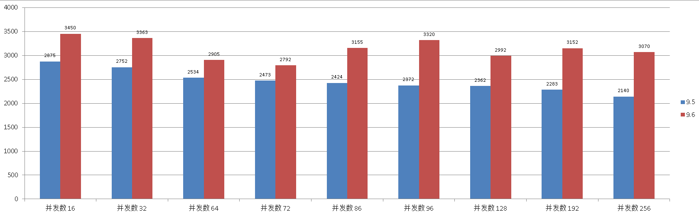
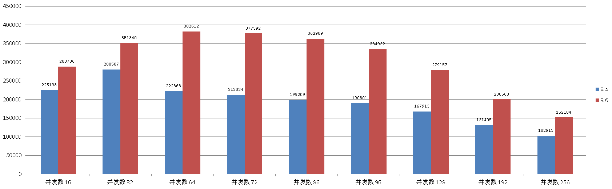

## PostgreSQL 9.6 scale-up高并发增强 VS 9.5
            
### 作者           
digoal            
            
### 日期          
2016-10-02           
            
### 标签          
PostgreSQL , 9.6 , scale-up , 高并发 , 多核增强  
            
----          
            
## 背景    
PostgreSQL 在向和纵向的扩展能力在开源数据库中一直处于非常领先的地位，例如今年推出的9.6，内置了sharding的功能，同时在scale-up的能力也有非常明显的提升，特别是在多核与高并发处理这块。    
  
社区有同学在128核的机器上测试tpc-b的select only模式可以达到几百万的qps。   
  
除了读的高并发有明显的性能提升，在写这块，引入了动态扩展数据文件，从而对单个表的插入性能也有非常明显的提升，如果你的应用场景是日志型的，需要大批量的高并发入库，9.6就非常适合你。   
  
LOCK改进，Partition the shared hash table freelist to reduce contention on multi-CPU-socket servers (Aleksander Alekseev)   
  
本文将针对高并发的读，写，更新场景测试一下9.6和9.5的性能差异。  
  
为了规避IO瓶颈的影响，体现9.6代码处理逻辑方面的改进，所有测试场景的数据均小于内存大小。  
    
## 环境介绍  
32核, 512G, SSD, XFS。  
  
## 安装与配置
测试机器为同一主机。  
  
1\. OS配置  
```
# yum -y install coreutils glib2 lrzsz sysstat e4fsprogs xfsprogs ntp readline-devel zlib zlib-devel openssl openssl-devel pam-devel libxml2-devel libxslt-devel python-devel tcl-devel gcc make smartmontools flex bison perl perl-devel perl-ExtUtils* openldap openldap-devel

# vi /etc/sysctl.conf
# add by digoal.zhou
fs.aio-max-nr = 1048576
fs.file-max = 76724600
kernel.core_pattern= /data01/corefiles/core_%e_%u_%t_%s.%p         
# /data01/corefiles事先建好，权限777
kernel.sem = 4096 2147483647 2147483646 512000    
# 信号量, ipcs -l 或 -u 查看，每16个进程一组，每组信号量需要17个信号量。
kernel.shmall = 107374182      
# 所有共享内存段相加大小限制(建议内存的80%)
kernel.shmmax = 274877906944   
# 最大单个共享内存段大小(建议为内存一半), >9.2的版本已大幅降低共享内存的使用
kernel.shmmni = 819200         
# 一共能生成多少共享内存段，每个PG数据库集群至少2个共享内存段
net.core.netdev_max_backlog = 10000
net.core.rmem_default = 262144       
# The default setting of the socket receive buffer in bytes.
net.core.rmem_max = 4194304          
# The maximum receive socket buffer size in bytes
net.core.wmem_default = 262144       
# The default setting (in bytes) of the socket send buffer.
net.core.wmem_max = 4194304          
# The maximum send socket buffer size in bytes.
net.core.somaxconn = 4096
net.ipv4.tcp_max_syn_backlog = 4096
net.ipv4.tcp_keepalive_intvl = 20
net.ipv4.tcp_keepalive_probes = 3
net.ipv4.tcp_keepalive_time = 60
net.ipv4.tcp_mem = 8388608 12582912 16777216
net.ipv4.tcp_fin_timeout = 5
net.ipv4.tcp_synack_retries = 2
net.ipv4.tcp_syncookies = 1    
# 开启SYN Cookies。当出现SYN等待队列溢出时，启用cookie来处理，可防范少量的SYN攻击
net.ipv4.tcp_timestamps = 1    
# 减少time_wait
net.ipv4.tcp_tw_recycle = 0    
# 如果=1则开启TCP连接中TIME-WAIT套接字的快速回收，但是NAT环境可能导致连接失败，建议服务端关闭它
net.ipv4.tcp_tw_reuse = 1      
# 开启重用。允许将TIME-WAIT套接字重新用于新的TCP连接
net.ipv4.tcp_max_tw_buckets = 262144
net.ipv4.tcp_rmem = 8192 87380 16777216
net.ipv4.tcp_wmem = 8192 65536 16777216
net.nf_conntrack_max = 1200000
net.netfilter.nf_conntrack_max = 1200000
vm.dirty_background_bytes = 409600000       
#  系统脏页到达这个值，系统后台刷脏页调度进程 pdflush（或其他） 自动将(dirty_expire_centisecs/100）秒前的脏页刷到磁盘
vm.dirty_expire_centisecs = 3000             
#  比这个值老的脏页，将被刷到磁盘。3000表示30秒。
vm.dirty_ratio = 95                          
#  如果系统进程刷脏页太慢，使得系统脏页超过内存 95 % 时，则用户进程如果有写磁盘的操作（如fsync, fdatasync等调用），则需要主动把系统脏页刷出。
#  有效防止用户进程刷脏页，在单机多实例，并且使用CGROUP限制单实例IOPS的情况下非常有效。  
vm.dirty_writeback_centisecs = 100            
#  pdflush（或其他）后台刷脏页进程的唤醒间隔， 100表示1秒。
vm.extra_free_kbytes = 4096000
vm.min_free_kbytes = 2097152
vm.mmap_min_addr = 65536
vm.overcommit_memory = 0     
#  在分配内存时，允许少量over malloc, 如果设置为 1, 则认为总是有足够的内存，内存较少的测试环境可以使用 1 .  
vm.overcommit_ratio = 90     
#  当overcommit_memory = 2 时，用于参与计算允许指派的内存大小。
vm.swappiness = 0            
#  关闭交换分区
vm.zone_reclaim_mode = 0     
# 禁用 numa, 或者在vmlinux中禁止. 
net.ipv4.ip_local_port_range = 40000 65535    
# 本地自动分配的TCP, UDP端口号范围
#  vm.nr_hugepages = 102352    
#  建议shared buffer设置超过64GB时 使用大页，页大小 /proc/meminfo Hugepagesize

# sysctl -p

# vi /etc/security/limits.conf
* soft    nofile  1024000
* hard    nofile  1024000
* soft    nproc   unlimited
* hard    nproc   unlimited
* soft    core    unlimited
* hard    core    unlimited
* soft    memlock unlimited
* hard    memlock unlimited

# rm -f /etc/security/limits.d/*
```
  
2\. 数据库配置  
安装  
```
$ wget https://ftp.postgresql.org/pub/source/v9.6.0/postgresql-9.6.0.tar.bz2
$ wget https://ftp.postgresql.org/pub/source/v9.5.4/postgresql-9.5.4.tar.bz2

$ tar -jxvf postgresql-9.5.4.tar.bz2
$ tar -jxvf postgresql-9.6.0.tar.bz2

$ cd ~/postgresql-9.6.0
$ ./configure --prefix=/home/digoal/pgsql9.6.0
$ make world -j 32
$ make install-world -j 32

$ cd ~/postgresql-9.5.4
$ ./configure --prefix=/home/digoal/pgsql9.5
$ make world -j 32
$ make install-world -j 32

$ vi ~/envpg96.sh
export PS1="$USER@`/bin/hostname -s`-> "
export PGPORT=5281
export PGDATA=/data02/digoal/pg_root$PGPORT
export LANG=en_US.utf8
export PGHOME=/home/digoal/pgsql9.6.0
export LD_LIBRARY_PATH=$PGHOME/lib:/lib64:/usr/lib64:/usr/local/lib64:/lib:/usr/lib:/usr/local/lib:$LD_LIBRARY_PATH
export DATE=`date +"%Y%m%d%H%M"`
export PATH=$PGHOME/bin:$PATH:.
export MANPATH=$PGHOME/share/man:$MANPATH
export PGHOST=$PGDATA
export PGUSER=postgres
export PGDATABASE=postgres
alias rm='rm -i'
alias ll='ls -lh'
unalias vi

$ vi ~/envpg95.sh
export PS1="$USER@`/bin/hostname -s`-> "
export PGPORT=5288
export PGDATA=/data02/digoal/pg_root$PGPORT
export LANG=en_US.utf8
export PGHOME=/home/digoal/pgsql9.5
export LD_LIBRARY_PATH=$PGHOME/lib:/lib64:/usr/lib64:/usr/local/lib64:/lib:/usr/lib:/usr/local/lib:$LD_LIBRARY_PATH
export DATE=`date +"%Y%m%d%H%M"`
export PATH=$PGHOME/bin:$PATH:.
export MANPATH=$PGHOME/share/man:$MANPATH
export PGHOST=$PGDATA
export PGUSER=postgres
export PGDATABASE=postgres
alias rm='rm -i'
alias ll='ls -lh'
unalias vi
  
$ df -h
/dev/mapper/vgdata01-lv03
                      4.0T  1.3T  2.8T  32% /u01
/dev/mapper/vgdata01-lv04
                      7.7T  899G  6.8T  12% /u02
```
  
初始化集群  
```
$ . ~/envpg96.sh
$ initdb -D $PGDATA -E UTF8 --locale=C -U postgres -X /data01/digoal/pg_xlog$PGPORT

$ . ~/envpg95.sh
$ initdb -D $PGDATA -E UTF8 --locale=C -U postgres -X /data01/digoal/pg_xlog$PGPORT
```
  
配置数据库参数  
```
$ . ~/envpg96.sh
$ cd $PGDATA


$ vi postgresql.conf
listen_addresses = '0.0.0.0'
port = 5281
max_connections = 800
superuser_reserved_connections = 13
unix_socket_directories = '.'
unix_socket_permissions = 0700
tcp_keepalives_idle = 60
tcp_keepalives_interval = 10
tcp_keepalives_count = 10
shared_buffers = 128GB
huge_pages = try
maintenance_work_mem = 2GB
dynamic_shared_memory_type = sysv
vacuum_cost_delay = 0
bgwriter_delay = 10ms
bgwriter_lru_maxpages = 1000
bgwriter_lru_multiplier = 10.0
bgwriter_flush_after = 256
max_worker_processes = 128
max_parallel_workers_per_gather = 0
old_snapshot_threshold = -1
backend_flush_after = 0
synchronous_commit = off
full_page_writes = off
wal_buffers = 1981MB
wal_writer_delay = 10ms
wal_writer_flush_after = 4MB
checkpoint_timeout = 55min
max_wal_size = 256GB
checkpoint_flush_after = 1MB
random_page_cost = 1.0
effective_cache_size = 512GB
constraint_exclusion = on  
log_destination = 'csvlog'
logging_collector = on
log_checkpoints = on
log_connections = on
log_disconnections = on
log_error_verbosity = verbose  
log_timezone = 'PRC'
autovacuum = on
log_autovacuum_min_duration = 0
autovacuum_max_workers = 8
autovacuum_naptime = 10s
autovacuum_vacuum_scale_factor = 0.02
autovacuum_analyze_scale_factor = 0.01
statement_timeout = 0
lock_timeout = 0
idle_in_transaction_session_timeout = 0
gin_fuzzy_search_limit = 0
gin_pending_list_limit = 4MB
datestyle = 'iso, mdy'
timezone = 'PRC'
lc_messages = 'C'
lc_monetary = 'C'
lc_numeric = 'C'
lc_time = 'C'
default_text_search_config = 'pg_catalog.english'
deadlock_timeout = 1s


$ vi pg_hba.conf
local   all             all                                     trust
host    all             all             127.0.0.1/32            trust
host    all             all             ::1/128                 trust
host all all 0.0.0.0/0 md5


$ . ~/envpg95.sh
$ cd $PGDATA


$ vi postgresql.conf
listen_addresses = '0.0.0.0'
port = 5288
max_connections = 800
superuser_reserved_connections = 13
unix_socket_directories = '.'
unix_socket_permissions = 0700
tcp_keepalives_idle = 60
tcp_keepalives_interval = 10
tcp_keepalives_count = 10
shared_buffers = 128GB
huge_pages = try
maintenance_work_mem = 2GB
dynamic_shared_memory_type = posix
vacuum_cost_delay = 0
bgwriter_delay = 10ms
bgwriter_lru_maxpages = 1000
bgwriter_lru_multiplier = 10.0
max_worker_processes = 128
synchronous_commit = off
full_page_writes = off
wal_buffers = 1981MB
wal_writer_delay = 10ms
checkpoint_timeout = 55min
max_wal_size = 256GB
random_page_cost = 1.0
effective_cache_size = 512GB
constraint_exclusion = on  
log_destination = 'csvlog'
logging_collector = on
log_checkpoints = on
log_connections = on
log_disconnections = on
log_error_verbosity = verbose
log_timezone = 'PRC'
log_autovacuum_min_duration = 0
autovacuum_max_workers = 8
autovacuum_naptime = 10s
autovacuum_vacuum_scale_factor = 0.02
autovacuum_analyze_scale_factor = 0.01
statement_timeout = 0
lock_timeout = 0
gin_fuzzy_search_limit = 0
gin_pending_list_limit = 4MB
datestyle = 'iso, mdy'
timezone = 'PRC'
lc_messages = 'C'
lc_monetary = 'C'
lc_numeric = 'C'
lc_time = 'C'
default_text_search_config = 'pg_catalog.english'
deadlock_timeout = 1s


$ vi pg_hba.conf
local   all             all                                     trust
host    all             all             127.0.0.1/32            trust
host    all             all             ::1/128                 trust
host all all 0.0.0.0/0 md5
```
  
启动数据库  
```
$ . ~/envpg96.sh
$ pg_ctl start

$ . ~/envpg95.sh
$ pg_ctl start
```
  
测试时只启动一个数据库，防止干扰。   
    
## 一、select based on PK only
### 环境准备
单表1亿数据量，基于PK的查询。  
  
考察高并发下的代码优化能力。  
  
SQL如下  
```
create table test(id int, info text, crt_time timestamp) with (autovacuum_freeze_max_age=1500000000, autovacuum_freeze_table_age=1400000000, autovacuum_multixact_freeze_max_age=1500000000, autovacuum_multixact_freeze_table_age=1400000000);
insert into test select generate_series(1,100000000),md5(random()::text),clock_timestamp();
set maintenance_work_mem='16GB';
alter table test add constraint test_pkey primary key (id);
vacuum analyze test;
select * from test limit 10;
 id |               info               |          crt_time          
----+----------------------------------+----------------------------
  1 | 652802c64d630dfbde4770ed0d2a649c | 2016-10-02 15:38:12.866501
  2 | c31d0e4ddd63618dbbb1c2a7932eae87 | 2016-10-02 15:38:12.866581
  3 | f1689301bf26efd4050a88d50713ac66 | 2016-10-02 15:38:12.866586
  4 | 155df78e2cd8f14291ddfd3f9179cde3 | 2016-10-02 15:38:12.866589
  5 | 12aa2596dadb2af637bee07f05e78feb | 2016-10-02 15:38:12.866592
  6 | 915f06af99501e629631b37f46f23816 | 2016-10-02 15:38:12.866595
  7 | be79647d50351435b903c03a377e0ff5 | 2016-10-02 15:38:12.866597
  8 | 676bedb18ffe2c7cc30a0d7ff081e7da | 2016-10-02 15:38:12.8666
  9 | e7111e4c9f910ac00312f7a67ddbd162 | 2016-10-02 15:38:12.866602
 10 | 22c6dd399e49663f3f14ce7634ff56d8 | 2016-10-02 15:38:12.866604
(10 rows)
```
  
### 9.5
```
$ vi test.sql
\setrandom id 1 100000000
select * from test where id=:id;

$ vi bench.sh
pgbench -M prepared -n -r -f ./test.sql -c 16 -j 16 -T 120
pgbench -M prepared -n -r -f ./test.sql -c 32 -j 32 -T 120
pgbench -M prepared -n -r -f ./test.sql -c 64 -j 64 -T 120
pgbench -M prepared -n -r -f ./test.sql -c 72 -j 72 -T 120
pgbench -M prepared -n -r -f ./test.sql -c 86 -j 86 -T 120
pgbench -M prepared -n -r -f ./test.sql -c 96 -j 96 -T 120
pgbench -M prepared -n -r -f ./test.sql -c 128 -j 128 -T 120
pgbench -M prepared -n -r -f ./test.sql -c 192 -j 192 -T 120
pgbench -M prepared -n -r -f ./test.sql -c 256 -j 256 -T 120

$ . ./bench.sh
```
  
测试结果  
  
并发数 , TPS  
```
16 , 261687
32 , 514649
64 , 964129
72 , 946146
86 , 923699
96 , 931189
128 , 903589
192 , 891058
256 , 891150
```
  
### 9.6
```
$ vi test.sql
\set id random(1,100000000)
select * from test where id=:id;

$ vi bench.sh
pgbench -M prepared -n -r -f ./test.sql -c 16 -j 16 -T 120
pgbench -M prepared -n -r -f ./test.sql -c 32 -j 32 -T 120
pgbench -M prepared -n -r -f ./test.sql -c 64 -j 64 -T 120
pgbench -M prepared -n -r -f ./test.sql -c 72 -j 72 -T 120
pgbench -M prepared -n -r -f ./test.sql -c 86 -j 86 -T 120
pgbench -M prepared -n -r -f ./test.sql -c 96 -j 96 -T 120
pgbench -M prepared -n -r -f ./test.sql -c 128 -j 128 -T 120
pgbench -M prepared -n -r -f ./test.sql -c 192 -j 192 -T 120
pgbench -M prepared -n -r -f ./test.sql -c 256 -j 256 -T 120

$ . ./bench.sh
```
  
测试结果  
  
并发数 , TPS  
```
16 , 352524
32 , 611931
64 , 971911
72 , 994487
86 , 969640
96 , 970625
128 , 924109
192 , 893637
256 , 905555
```
  
### 对比
  
  
## 二、单表 update based on PK only
### 环境准备
单表1亿数据量，基于PK的更新。  
  
考察高并发下的数据更新，autovacuum优化能力，XLOG优化能力。    
  
SQL如下  
```
create table test(id int, info text, crt_time timestamp) with (autovacuum_freeze_max_age=1500000000, autovacuum_freeze_table_age=1400000000, autovacuum_multixact_freeze_max_age=1500000000, autovacuum_multixact_freeze_table_age=1400000000);;
insert into test select generate_series(1,100000000),md5(random()::text),clock_timestamp();
set maintenance_work_mem='16GB';
alter table test add constraint test_pkey primary key (id);
vacuum analyze test;
select * from test limit 10;
 id |               info               |          crt_time          
----+----------------------------------+----------------------------
  1 | 652802c64d630dfbde4770ed0d2a649c | 2016-10-02 15:38:12.866501
  2 | c31d0e4ddd63618dbbb1c2a7932eae87 | 2016-10-02 15:38:12.866581
  3 | f1689301bf26efd4050a88d50713ac66 | 2016-10-02 15:38:12.866586
  4 | 155df78e2cd8f14291ddfd3f9179cde3 | 2016-10-02 15:38:12.866589
  5 | 12aa2596dadb2af637bee07f05e78feb | 2016-10-02 15:38:12.866592
  6 | 915f06af99501e629631b37f46f23816 | 2016-10-02 15:38:12.866595
  7 | be79647d50351435b903c03a377e0ff5 | 2016-10-02 15:38:12.866597
  8 | 676bedb18ffe2c7cc30a0d7ff081e7da | 2016-10-02 15:38:12.8666
  9 | e7111e4c9f910ac00312f7a67ddbd162 | 2016-10-02 15:38:12.866602
 10 | 22c6dd399e49663f3f14ce7634ff56d8 | 2016-10-02 15:38:12.866604
(10 rows)
```
  
### 9.5
```
$ vi test.sql
\setrandom id 1 100000000
update test set crt_time=now() where id=:id;

$ vi bench.sh
pgbench -M prepared -n -r -f ./test.sql -c 16 -j 16 -T 120
pgbench -M prepared -n -r -f ./test.sql -c 32 -j 32 -T 120
pgbench -M prepared -n -r -f ./test.sql -c 64 -j 64 -T 120
pgbench -M prepared -n -r -f ./test.sql -c 72 -j 72 -T 120
pgbench -M prepared -n -r -f ./test.sql -c 86 -j 86 -T 120
pgbench -M prepared -n -r -f ./test.sql -c 96 -j 96 -T 120
pgbench -M prepared -n -r -f ./test.sql -c 128 -j 128 -T 120
pgbench -M prepared -n -r -f ./test.sql -c 192 -j 192 -T 120
pgbench -M prepared -n -r -f ./test.sql -c 256 -j 256 -T 120

$ . ./bench.sh
```
  
并发数 , TPS  
```
16 , 160502
32 , 202785
64 , 146669
72 , 136701
86 , 124060
96 , 116345
128 , 100642
192 , 76714
256 , 57945
```

### 9.6
```
$ vi test.sql
\set id random(1,100000000)
update test set crt_time=now() where id=:id;

$ vi bench.sh
pgbench -M prepared -n -r -f ./test.sql -c 16 -j 16 -T 120
pgbench -M prepared -n -r -f ./test.sql -c 32 -j 32 -T 120
pgbench -M prepared -n -r -f ./test.sql -c 64 -j 64 -T 120
pgbench -M prepared -n -r -f ./test.sql -c 72 -j 72 -T 120
pgbench -M prepared -n -r -f ./test.sql -c 86 -j 86 -T 120
pgbench -M prepared -n -r -f ./test.sql -c 96 -j 96 -T 120
pgbench -M prepared -n -r -f ./test.sql -c 128 -j 128 -T 120
pgbench -M prepared -n -r -f ./test.sql -c 192 -j 192 -T 120
pgbench -M prepared -n -r -f ./test.sql -c 256 -j 256 -T 120

$ . ./bench.sh
```
  
并发数 , TPS  
```
16 , 216928
32 , 289555
64 , 249844
72 , 233400
86 , 214760
96 , 203196
128 , 178891
192 , 152073
256 , 129707
```
  
### 对比
  
  
## 三、单表 autocommit 单条 insert only
### 环境准备
一张空表，22个字段，每行约201字节，包含两个索引。   
  
采用autocommit的模式，每个连接每个事务插入一条记录。   
  
考察高并发下的数据插入，数据块扩展能力，XLOG优化能力。     
  
SQL如下    
```
create table test(id serial8, c1 int8 default 0, c2 int8 default 0, c3 int8 default 0, c4 int8 default 0, c5 int8 default 0, c6 int8 default 0, c7 int8 default 0, c8 int8 default 0, c9 int8 default 0, c10 int8 default 0, c11 int8 default 0, c12 int8 default 0, c13 int8 default 0, c14 int8 default 0, c15 int8 default 0, c16 int8 default 0, c17 int8 default 0, c18 int8 default 0, c19 int8 default 0, c20 int8 default 0, crt_time timestamptz) with (autovacuum_enabled=off, autovacuum_freeze_max_age=1500000000, autovacuum_freeze_table_age=1400000000, autovacuum_multixact_freeze_max_age=1500000000, autovacuum_multixact_freeze_table_age=1400000000); 
alter sequence test_id_seq cache 100000;
create index idx_test_1 on test using brin(id);
create index idx_test_2 on test using brin(crt_time);
```
  
测试脚本如下  
```
$ vi test.sql
insert into test(crt_time) values(now());

$ vi bench.sh
pgbench -M prepared -n -r -f ./test.sql -c 16 -j 16 -T 120
pgbench -M prepared -n -r -f ./test.sql -c 32 -j 32 -T 120
pgbench -M prepared -n -r -f ./test.sql -c 64 -j 64 -T 120
pgbench -M prepared -n -r -f ./test.sql -c 72 -j 72 -T 120
pgbench -M prepared -n -r -f ./test.sql -c 86 -j 86 -T 120
pgbench -M prepared -n -r -f ./test.sql -c 96 -j 96 -T 120
pgbench -M prepared -n -r -f ./test.sql -c 128 -j 128 -T 120
pgbench -M prepared -n -r -f ./test.sql -c 192 -j 192 -T 120
pgbench -M prepared -n -r -f ./test.sql -c 256 -j 256 -T 120

$ . ./bench.sh
```
  
### 9.5
并发数 , TPS  
```
16 , 234043
32 , 263893
64 , 208993
72 , 199966
86 , 188826
96 , 182672
128 , 164270
192 , 130384
256 , 104563
```
  
### 9.6
并发数 , TPS  
```
16 , 268877
32 , 313320
64 , 324775
72 , 318060
86 , 307001
96 , 296028
128 , 256317
192 , 202902
256 , 154469
```
  
### 对比
  
  
## 四、单表 autocommit 批量 insert only
### 环境准备
批量插入，考察的同样是高并发处理单表时XLOG的优化能力，数据文件的扩展优化能力。  
  
测试脚本如下  
  
一次插入400条记录。  
```
$ vi test.sql
insert into test(crt_time) values(now()),(now()),(now()),(now()),(now()),(now()),(now()),(now()),(now()),(now()),(now()),(now()),(now()),(now()),(now()),(now()),(now()),(now()),(now()),(now()),(now()),(now()),(now()),(now()),(now()),(now()),(now()),(now()),(now()),(now()),(now()),(now()),(now()),(now()),(now()),(now()),(now()),(now()),(now()),(now()),(now()),(now()),(now()),(now()),(now()),(now()),(now()),(now()),(now()),(now()),(now()),(now()),(now()),(now()),(now()),(now()),(now()),(now()),(now()),(now()),(now()),(now()),(now()),(now()),(now()),(now()),(now()),(now()),(now()),(now()),(now()),(now()),(now()),(now()),(now()),(now()),(now()),(now()),(now()),(now()),(now()),(now()),(now()),(now()),(now()),(now()),(now()),(now()),(now()),(now()),(now()),(now()),(now()),(now()),(now()),(now()),(now()),(now()),(now()),(now()),(now()),(now()),(now()),(now()),(now()),(now()),(now()),(now()),(now()),(now()),(now()),(now()),(now()),(now()),(now()),(now()),(now()),(now()),(now()),(now()),(now()),(now()),(now()),(now()),(now()),(now()),(now()),(now()),(now()),(now()),(now()),(now()),(now()),(now()),(now()),(now()),(now()),(now()),(now()),(now()),(now()),(now()),(now()),(now()),(now()),(now()),(now()),(now()),(now()),(now()),(now()),(now()),(now()),(now()),(now()),(now()),(now()),(now()),(now()),(now()),(now()),(now()),(now()),(now()),(now()),(now()),(now()),(now()),(now()),(now()),(now()),(now()),(now()),(now()),(now()),(now()),(now()),(now()),(now()),(now()),(now()),(now()),(now()),(now()),(now()),(now()),(now()),(now()),(now()),(now()),(now()),(now()),(now()),(now()),(now()),(now()),(now()),(now()),(now()),(now()),(now()),(now()),(now()),(now()),(now()),(now()),(now()),(now()),(now()),(now()),(now()),(now()),(now()),(now()),(now()),(now()),(now()),(now()),(now()),(now()),(now()),(now()),(now()),(now()),(now()),(now()),(now()),(now()),(now()),(now()),(now()),(now()),(now()),(now()),(now()),(now()),(now()),(now()),(now()),(now()),(now()),(now()),(now()),(now()),(now()),(now()),(now()),(now()),(now()),(now()),(now()),(now()),(now()),(now()),(now()),(now()),(now()),(now()),(now()),(now()),(now()),(now()),(now()),(now()),(now()),(now()),(now()),(now()),(now()),(now()),(now()),(now()),(now()),(now()),(now()),(now()),(now()),(now()),(now()),(now()),(now()),(now()),(now()),(now()),(now()),(now()),(now()),(now()),(now()),(now()),(now()),(now()),(now()),(now()),(now()),(now()),(now()),(now()),(now()),(now()),(now()),(now()),(now()),(now()),(now()),(now()),(now()),(now()),(now()),(now()),(now()),(now()),(now()),(now()),(now()),(now()),(now()),(now()),(now()),(now()),(now()),(now()),(now()),(now()),(now()),(now()),(now()),(now()),(now()),(now()),(now()),(now()),(now()),(now()),(now()),(now()),(now()),(now()),(now()),(now()),(now()),(now()),(now()),(now()),(now()),(now()),(now()),(now()),(now()),(now()),(now()),(now()),(now()),(now()),(now()),(now()),(now()),(now()),(now()),(now()),(now()),(now()),(now()),(now()),(now()),(now()),(now()),(now()),(now()),(now()),(now()),(now()),(now()),(now()),(now()),(now()),(now()),(now()),(now()),(now()),(now()),(now()),(now()),(now()),(now()),(now()),(now()),(now()),(now()),(now()),(now()),(now()),(now()),(now()),(now()),(now()),(now()),(now()),(now()),(now());


$ . ./bench.sh
```
  
### 9.5
并发数 , TPS  
```
16 , 2875
32 , 2752
64 , 2534
72 , 2473
86 , 2424
96 , 2372
128 , 2362
192 , 2283
256 , 2140
```
  
### 9.6
并发数 , TPS  
```
16 , 3450
32 , 3363
64 , 2905
72 , 2792
86 , 3155
96 , 3320
128 , 2992
192 , 3152
256 , 3070
```
  
### 对比
  
  
## 五、多表 autocommit 单条 insert only
### 环境准备
每个连接对应一张空表，22个字段，每行约201字节，包含两个索引。   
  
采用autocommit的模式，每个连接每个事务插入一条记录。   
  
考察高并发下的数据插入，XLOG优化能力。     
  
与单表不同，因为没有单表的文件扩展并发要求，所以不考察数据块扩展能力。   
  
SQL如下    
```
create table test(id serial8, c1 int8 default 0, c2 int8 default 0, c3 int8 default 0, c4 int8 default 0, c5 int8 default 0, c6 int8 default 0, c7 int8 default 0, c8 int8 default 0, c9 int8 default 0, c10 int8 default 0, c11 int8 default 0, c12 int8 default 0, c13 int8 default 0, c14 int8 default 0, c15 int8 default 0, c16 int8 default 0, c17 int8 default 0, c18 int8 default 0, c19 int8 default 0, c20 int8 default 0, crt_time timestamptz) with (autovacuum_enabled=off, autovacuum_freeze_max_age=1500000000, autovacuum_freeze_table_age=1400000000, autovacuum_multixact_freeze_max_age=1500000000, autovacuum_multixact_freeze_table_age=1400000000);  
alter sequence test_id_seq cache 100000;
create index idx_test_1 on test using brin(id);
create index idx_test_2 on test using brin(crt_time);
```
  
批量创建测试表，测试脚本    
```
for ((i=1;i<=256;i++)); do psql -c "create table test$i(like test including all) with (autovacuum_enabled=off, autovacuum_freeze_max_age=1500000000, autovacuum_freeze_table_age=1400000000, autovacuum_multixact_freeze_max_age=1500000000, autovacuum_multixact_freeze_table_age=1400000000)"; done

for ((i=1;i<=256;i++)); do echo "insert into test$i(crt_time) values(now());" > ~/test$i.sql; done
```
  
测试脚本如下  
```
$ vi bench.sh
for ((i=1;i<=16;i++)); do psql -c "truncate test$i"; done
psql -c "checkpoint;"
for ((i=1;i<=16;i++)); do pgbench -M prepared -n -r -f ./test$i.sql -c 1 -j 1 -T 120 >/tmp/test_16_$i.log & done
sleep 130
for ((i=1;i<=32;i++)); do psql -c "truncate test$i"; done
psql -c "checkpoint;"
for ((i=1;i<=32;i++)); do pgbench -M prepared -n -r -f ./test$i.sql -c 1 -j 1 -T 120 >/tmp/test_32_$i.log & done
sleep 130
for ((i=1;i<=64;i++)); do psql -c "truncate test$i"; done
psql -c "checkpoint;"
for ((i=1;i<=64;i++)); do pgbench -M prepared -n -r -f ./test$i.sql -c 1 -j 1 -T 120 >/tmp/test_64_$i.log & done
sleep 130
for ((i=1;i<=72;i++)); do psql -c "truncate test$i"; done
psql -c "checkpoint;"
for ((i=1;i<=72;i++)); do pgbench -M prepared -n -r -f ./test$i.sql -c 1 -j 1 -T 120 >/tmp/test_72_$i.log & done
sleep 130
for ((i=1;i<=86;i++)); do psql -c "truncate test$i"; done
psql -c "checkpoint;"
for ((i=1;i<=86;i++)); do pgbench -M prepared -n -r -f ./test$i.sql -c 1 -j 1 -T 120 >/tmp/test_86_$i.log & done
sleep 130
for ((i=1;i<=96;i++)); do psql -c "truncate test$i"; done
psql -c "checkpoint;"
for ((i=1;i<=96;i++)); do pgbench -M prepared -n -r -f ./test$i.sql -c 1 -j 1 -T 120 >/tmp/test_96_$i.log & done
sleep 130
for ((i=1;i<=128;i++)); do psql -c "truncate test$i"; done
psql -c "checkpoint;"
for ((i=1;i<=128;i++)); do pgbench -M prepared -n -r -f ./test$i.sql -c 1 -j 1 -T 120 >/tmp/test_128_$i.log & done
sleep 130
for ((i=1;i<=192;i++)); do psql -c "truncate test$i"; done
psql -c "checkpoint;"
for ((i=1;i<=192;i++)); do pgbench -M prepared -n -r -f ./test$i.sql -c 1 -j 1 -T 120 >/tmp/test_192_$i.log & done
sleep 130
for ((i=1;i<=256;i++)); do psql -c "truncate test$i"; done
psql -c "checkpoint;"
for ((i=1;i<=256;i++)); do pgbench -M prepared -n -r -f ./test$i.sql -c 1 -j 1 -T 120 >/tmp/test_256_$i.log & done
sleep 130


$ . ./bench.sh
```
  
统计  
```
$ vi res.sh

x=0; for ((i=1;i<=16;i++)); do y=`cat /tmp/test_16_$i.log | grep "excluding connections establishing" | awk '{print $3}' | awk -F "." '{print $1}'`; x=$(($x+$y)); done; echo "16 , $x"
x=0; for ((i=1;i<=32;i++)); do y=`cat /tmp/test_32_$i.log | grep "excluding connections establishing" | awk '{print $3}' | awk -F "." '{print $1}'`; x=$(($x+$y)); done; echo "32 , $x"
x=0; for ((i=1;i<=64;i++)); do y=`cat /tmp/test_64_$i.log | grep "excluding connections establishing" | awk '{print $3}' | awk -F "." '{print $1}'`; x=$(($x+$y)); done; echo "64 , $x"
x=0; for ((i=1;i<=72;i++)); do y=`cat /tmp/test_72_$i.log | grep "excluding connections establishing" | awk '{print $3}' | awk -F "." '{print $1}'`; x=$(($x+$y)); done; echo "72 , $x"
x=0; for ((i=1;i<=86;i++)); do y=`cat /tmp/test_86_$i.log | grep "excluding connections establishing" | awk '{print $3}' | awk -F "." '{print $1}'`; x=$(($x+$y)); done; echo "86 , $x"
x=0; for ((i=1;i<=96;i++)); do y=`cat /tmp/test_96_$i.log | grep "excluding connections establishing" | awk '{print $3}' | awk -F "." '{print $1}'`; x=$(($x+$y)); done; echo "96 , $x"
x=0; for ((i=1;i<=128;i++)); do y=`cat /tmp/test_128_$i.log | grep "excluding connections establishing" | awk '{print $3}' | awk -F "." '{print $1}'`; x=$(($x+$y)); done; echo "128 , $x"
x=0; for ((i=1;i<=192;i++)); do y=`cat /tmp/test_192_$i.log | grep "excluding connections establishing" | awk '{print $3}' | awk -F "." '{print $1}'`; x=$(($x+$y)); done; echo "192 , $x"
x=0; for ((i=1;i<=256;i++)); do y=`cat /tmp/test_256_$i.log | grep "excluding connections establishing" | awk '{print $3}' | awk -F "." '{print $1}'`; x=$(($x+$y)); done; echo "256 , $x"


$ . ./res.sh
```
  
### 9.5
并发数 , TPS  
```
16 , 225198
32 , 280587
64 , 222368
72 , 213024
86 , 199209
96 , 190801
128 , 167913
192 , 131405
256 , 102913
```
  
### 9.6
并发数 , TPS  
```
16 , 288706
32 , 351340
64 , 382612
72 , 377392
86 , 362909
96 , 334932
128 , 279157
192 , 200568
256 , 152104
```
  
### 对比
  
  
## 六、多表 autocommit 批量 insert only
### 环境准备
批量插入，考察的同样是高并发处理单表时XLOG的优化能力，数据文件的扩展优化能力。  
    
测试脚本如下  
  
一次插入400条记录。  
```
for ((i=1;i<=256;i++)); do echo "insert into test$i(crt_time) values(now()),(now()),(now()),(now()),(now()),(now()),(now()),(now()),(now()),(now()),(now()),(now()),(now()),(now()),(now()),(now()),(now()),(now()),(now()),(now()),(now()),(now()),(now()),(now()),(now()),(now()),(now()),(now()),(now()),(now()),(now()),(now()),(now()),(now()),(now()),(now()),(now()),(now()),(now()),(now()),(now()),(now()),(now()),(now()),(now()),(now()),(now()),(now()),(now()),(now()),(now()),(now()),(now()),(now()),(now()),(now()),(now()),(now()),(now()),(now()),(now()),(now()),(now()),(now()),(now()),(now()),(now()),(now()),(now()),(now()),(now()),(now()),(now()),(now()),(now()),(now()),(now()),(now()),(now()),(now()),(now()),(now()),(now()),(now()),(now()),(now()),(now()),(now()),(now()),(now()),(now()),(now()),(now()),(now()),(now()),(now()),(now()),(now()),(now()),(now()),(now()),(now()),(now()),(now()),(now()),(now()),(now()),(now()),(now()),(now()),(now()),(now()),(now()),(now()),(now()),(now()),(now()),(now()),(now()),(now()),(now()),(now()),(now()),(now()),(now()),(now()),(now()),(now()),(now()),(now()),(now()),(now()),(now()),(now()),(now()),(now()),(now()),(now()),(now()),(now()),(now()),(now()),(now()),(now()),(now()),(now()),(now()),(now()),(now()),(now()),(now()),(now()),(now()),(now()),(now()),(now()),(now()),(now()),(now()),(now()),(now()),(now()),(now()),(now()),(now()),(now()),(now()),(now()),(now()),(now()),(now()),(now()),(now()),(now()),(now()),(now()),(now()),(now()),(now()),(now()),(now()),(now()),(now()),(now()),(now()),(now()),(now()),(now()),(now()),(now()),(now()),(now()),(now()),(now()),(now()),(now()),(now()),(now()),(now()),(now()),(now()),(now()),(now()),(now()),(now()),(now()),(now()),(now()),(now()),(now()),(now()),(now()),(now()),(now()),(now()),(now()),(now()),(now()),(now()),(now()),(now()),(now()),(now()),(now()),(now()),(now()),(now()),(now()),(now()),(now()),(now()),(now()),(now()),(now()),(now()),(now()),(now()),(now()),(now()),(now()),(now()),(now()),(now()),(now()),(now()),(now()),(now()),(now()),(now()),(now()),(now()),(now()),(now()),(now()),(now()),(now()),(now()),(now()),(now()),(now()),(now()),(now()),(now()),(now()),(now()),(now()),(now()),(now()),(now()),(now()),(now()),(now()),(now()),(now()),(now()),(now()),(now()),(now()),(now()),(now()),(now()),(now()),(now()),(now()),(now()),(now()),(now()),(now()),(now()),(now()),(now()),(now()),(now()),(now()),(now()),(now()),(now()),(now()),(now()),(now()),(now()),(now()),(now()),(now()),(now()),(now()),(now()),(now()),(now()),(now()),(now()),(now()),(now()),(now()),(now()),(now()),(now()),(now()),(now()),(now()),(now()),(now()),(now()),(now()),(now()),(now()),(now()),(now()),(now()),(now()),(now()),(now()),(now()),(now()),(now()),(now()),(now()),(now()),(now()),(now()),(now()),(now()),(now()),(now()),(now()),(now()),(now()),(now()),(now()),(now()),(now()),(now()),(now()),(now()),(now()),(now()),(now()),(now()),(now()),(now()),(now()),(now()),(now()),(now()),(now()),(now()),(now()),(now()),(now()),(now()),(now()),(now()),(now()),(now()),(now()),(now()),(now()),(now()),(now()),(now()),(now()),(now()),(now()),(now()),(now()),(now()),(now()),(now()),(now()),(now()),(now()),(now()),(now()),(now()),(now()),(now()),(now()),(now()),(now()),(now());" > ~/test$i.sql; done


$ . ./bench.sh
```
  
统计  
```
$ . ./res.sh
```
  
### 9.5
并发数 , TPS  
```
16 , 5693
32 , 5767
64 , 5297
72 , 4073
86 , 5374
96 , 4978
128 , 5438
192 , 5247
256 , 5376
```
  
### 9.6
并发数 , TPS  
```
16 , 6007
32 , 6120
64 , 5289
72 , 5501
86 , 5503
96 , 5605
128 , 5537
192 , 5467
256 , 5376
```
  
### 对比
  
  
## 小结
PostgreSQL 9.6的锁控制能力又有比较大的进步，在WAL的高并发管理，获取快照，扩展数据文件等方面都有较大改进，相比9.5在scale-up的扩展能力上又上了一个新的台阶，在高并发的读，插入，更新场景，都有非常明显的性能提升。  
     
结合9.6的多核并行计算，可以适合高并发的TP场景，又能在业务低谷时充分发挥硬件能力，处理AP的报表和分析需求，完成业务对TP+AP的混合需求。   
    
对于3,4,5,6的测试CASE，由于是批量入库，可以关闭测试表的autovacuum，达到更好的性能。    
    
现在的CPU一直在往多核的方向发展，32核已经是非常普遍的配置，多的甚至可以达到上千核。  
    
使用PostgreSQL可以更好的发挥硬件的性能，虽然PostgreSQL已经在内核层面支持sharding了，但是使用单机能解决的场景，不推荐使用sharding。    
    
目前sharding对应用开发的限制还比较多，比如大多数sharding技术需要解决几个痛点：  
    
分布式事务的控制，跨库JOIN，全局一致性，全局约束，数据倾斜，扩容，备份，容灾，迁移，确保全局一致性的高可用技术。等等一系列需要考虑的问题。    
       
       
  
<a rel="nofollow" href="http://info.flagcounter.com/h9V1"  ></a>  
  
  
  
  
  
  
## [digoal's 大量PostgreSQL文章入口](https://github.com/digoal/blog/blob/master/README.md "22709685feb7cab07d30f30387f0a9ae")
  
