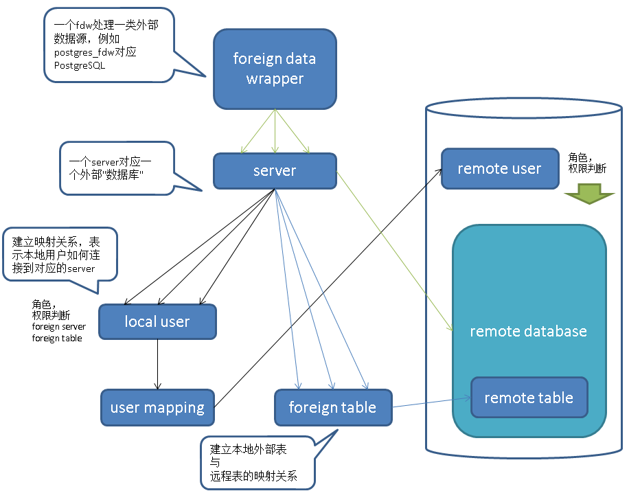

## PostgreSQL 9.6 单元化,sharding (based on postgres_fdw) - 内核层支持前传
            
### 作者           
digoal            
            
### 日期          
2016-10-04           
            
### 标签          
PostgreSQL , 9.6 , 水平分库 , sharding , 单元化 , postgres_fdw , FDW , foreign data wrapper     
            
----          
            
## 背景    
PostgreSQL 从 2011年的9.1版本引入FDW开始，发展到现在已经支持几乎所有的外部数据源读写操作，例如mysql,oracle,pgsql,redis,mongo,hive,jdbc,odbc,file,sqlserver,es,S3,......。  
  
https://wiki.postgresql.org/wiki/Fdw  
  
开放的接口，允许用户自己添加外部数据源的支持。  
  
9.6针对postgres_fdw（即PostgreSQL外部数据源）再次增强，开始支持对sort, where, join的下推，支持remote cancel query, 用户使用FDW可以对应用透明的实现数据库的sharding，单元化需求。      
  
内核层支持sharding，这种分片技术相比中间件分片技术的好处：  
1\. 支持跨库JOIN    
2\. 支持绑定变量    
3\. 支持master(coordinator)节点水平扩展  
4\. 支持segment(datanode)节点水平扩展  
5\. 支持函数和存储过程    
  
ps: 不支持分布式事务（需要用户干预2PC）  
通常业务设计时需要规避跨库事务，或者用户能够容忍跨库事务的一致性问题。  
  
## 一、FDW架构
架构如图  
  
  
   
1\. 每种数据源，需要定义对应的fdw handler，例如mysql, oracle, pgsql都各自有各自的fdw handler。    
  
本文接下来要讲的是pgsql 的fdw handler : postgres_fdw。      
  
2\. 基于fdw handler，我们可以建立server，server代表你要访问的目标，在PostgreSQL这个数据源中，server的粒度为database。    
  
换句话说一个server对应一个外部的postgresql database。     
  
3\. 定义好server，我们可以创建外部表，映射到目标server中的可访问对象（外部表即一种到remote database中对象的映射关系，remote 对象可以是表，物化视图，视图，外部表等）。    
  
4\. 创建好外部表之后，如何访问呢？  
  
当本地用户访问一张外部表时，因为外部表代表的是目标SERVER的可访问对象，而server只是目标，并不包含访问目标server的认证信息。  
  
认证信息在PostgreSQL的FDW中成为user mapping，是登陆到外部server的认证信息，local user对一个server只能存储一份认证信息。  
  
例如本地用户为role_a, foreign server所在的数据库集群有3个用户分别为rmt_a, rmt_b, rmt_c。   
  
role_a同一时间对一个foreign server只能存储一个认证关系，即要么使用rmt_a认证，要么使用rmt_b，要么使用rmt_c。  
  
如果你要访问的远程表分别属于三个角色，那么建议创建三个foreign server，在每个foreign server下创建对应的外部表，以及建立相应的映射关系。  
  
例子  
  
外部数据源如下    

用户  
```
rmt_a
rmt_b
rmt_c
```
  
表  
```
rmt_a owned: tbla
rmt_b owned: tblb
rmt_c owned: tblc
```
  
创建foreign server，目标一样，名字不一样    
```
foreign server: s1, s2, s3 (set same HOST, PORT, DBNAME)
```
  
创建外部表，ON 不同的foreign server   
```
foreign table: ft1 on s1
foreign table: ft2 on s2
foreign table: ft3 on s3
```
  
创建user mapping，每个foreign server对应不同的远程用户   
```
user mapping for s1 (rmt_a)
user mapping for s2 (rmt_b)
user mapping for s3 (rmt_c)
```
  
当然你还有另一种选择，在目标库创建一个用户，有这三张表的对应权限。    
  
那么只需要一个foreign server，并且在建立USER MAPPING时使用这个远程用户认证，这样访问外部表的权限就正确了。    
    
例如  
```
grant select on tbla,tblb,tblc to new_role;

foreign server: s1;

foreign table: ft1,ft2,ft3 on s1;

user mapping for s1 (new_role);
```
  
postgres_fdw用法参考  
  
https://www.postgresql.org/docs/9.6/static/postgres-fdw.html  
  
https://www.postgresql.org/docs/9.6/static/sql-createforeigndatawrapper.html  
  
https://www.postgresql.org/docs/9.6/static/sql-createserver.html  
  
https://www.postgresql.org/docs/9.6/static/sql-createforeigntable.html  
  
https://www.postgresql.org/docs/9.6/static/sql-createusermapping.html  
  
下面是详解。   
  
## 二、postgres_fdw支持的options
### server
1\. 语法  
```
CREATE SERVER server_name [ TYPE 'server_type' ] [ VERSION 'server_version' ]
    FOREIGN DATA WRAPPER fdw_name
    [ OPTIONS ( option 'value' [, ... ] ) ]
```
  
2\. create server时支持的options    
  
与libpq支持的options一致(https://www.postgresql.org/docs/9.6/static/libpq-connect.html#LIBPQ-PARAMKEYWORDS)，除了以下   
```
user
    在user mapping中设置

password
    在user mapping中设置

client_encoding    

fallback_application_name
    (强制设置为postgres_fdw)    
```
  
3\. postgres_fdw额外支持的options  
```
use_remote_estimate = true | false(default)  
    是否使用远程explain获得成本估算信息。(foreign table也支持这个option，并且优先级更高)      
    如果false，建议使用analyze 分析外部表，并且外部表是相对比较静态的数据，这样保证本地的统计信息准确。  
    false 可以减少外部表的执行计划带来的开销与时间。  

fdw_startup_cost = 100(default)
    该foreign server的启动成本，表示建立连接，parser and plan query on this server的成本。  

fdw_tuple_cost = 0.01(default)
    表示从该server每获取一条记录的额外传输成本，根据带宽调整设置。  

extensions = 'xx,xxx'
    表示远程数据库 也 安装了哪些extensions，当query中带有这些extensions中创建的immutable的function, operations时，可以push down。     
    否则只有building immutable function, operations可以push down。(即PostgreSQL内置的immutable函数和操作符)    
    因为extension是相对可控的，PostgreSQL社区认为用户可以也有责任保证远程数据库extension与本地数据库extension的版本是 一致的。      

fetch_size = 100(default)
    指一次fetch remote 对象操作的记录数。  foreign table级设置优先。    

updatable = true(default)
    指foreign 对象是否允许执行insert,update,delete操作。     foreign table级设置优先。    
```
  
4\. 用法举例   
```
postgres=# create server s3 foreign data wrapper postgres_fdw 
OPTIONS (
  extensions 'hstore,pageinspect', 
  host '127.0.0.1', 
  port '5281', 
  dbname 'postgres'
);
CREATE SERVER
```
    
### foreign table
1\. 语法  
```
CREATE FOREIGN TABLE [ IF NOT EXISTS ] table_name ( [
  { column_name data_type [ OPTIONS ( option 'value' [, ... ] ) ] [ COLLATE collation ] [ column_constraint [ ... ] ]
    | table_constraint }
    [, ... ]
] )
[ INHERITS ( parent_table [, ... ] ) ]
  SERVER server_name
[ OPTIONS ( option 'value' [, ... ] ) ]

where column_constraint is:

[ CONSTRAINT constraint_name ]
{ NOT NULL |
  NULL |
  CHECK ( expression ) [ NO INHERIT ] |
  DEFAULT default_expr }

and table_constraint is:

[ CONSTRAINT constraint_name ]
CHECK ( expression ) [ NO INHERIT ]
```
  
2\. create foreign table时支持的options  
```
schema_name
    指定外部对象所属的 namespace.  
table_name
    指定外部对象名，如目标（表名，视图名，物化视图名，外部表名）
column_name
    column option, 指定本地列 对应的 外部对象的 列名。  
```
  
3\. postgres_fdw额外支持的options  
```
use_remote_estimate = true | false(default)
    是否使用远程explain获得成本估算信息。(优先级高于foreign server设置的值)       

fetch_size = 100(default)
    指一次fetch remote 对象操作的记录数。  foreign table级设置优先。    

updatable = true(default)
    指foreign 对象是否允许执行insert,update,delete操作。   foreign table级设置优先。    
```
  
4\. 用法举例   
```
postgres=# create foreign table ft1 (
  c1 int options (column_name 'id'), 
  info text ) 
server s1 
options(
  schema_name 'public', 
  table_name 'tbl1', 
  use_remote_estimate 'true', 
  fetch_size '10'
);
CREATE FOREIGN TABLE
```
  
### user mapping
1\. 语法    
```
CREATE USER MAPPING FOR { user_name | USER | CURRENT_USER | PUBLIC }
    SERVER server_name
    [ OPTIONS ( option 'value' [ , ... ] ) ]
```
  
2\. create user mapping时支持的options  
```
user
    remote database中的用户

password
    remote database中的用户密码
```
  
3\. 用法举例  
```
postgres=# create user mapping for postgres server s1 options (user 'admin', password 'pwd');
```
  
注意，只有超级用户支持无秘钥认证，普通用户需要提供密码，所以当映射的远程用户为普通用户时，必须提供密码。   
  
### import foreign schema
import foreign schema语法用于快速的将远程数据库的对象创建为本地的外部访问对象。  
  
1\. 语法  
IMPORT FOREIGN SCHEMA remote_schema
    [ { LIMIT TO | EXCEPT } ( table_name [, ...] ) ]
    FROM SERVER server_name
    INTO local_schema
    [ OPTIONS ( option 'value' [, ... ] ) ]

  
2\. options  
```
import_collate = 'true'(default)
    是否将外部对象定义中的collate也在本地外部对象中使用同样的定义。  默认为true，通常在本地库与外部库所在的操作系统不一致，或者LC不一致时，可以设置为false。  

import_default = 'false'(default)
    是否将外部对象定义中的默认值也在本地外部对象中使用同样的定义。   默认为false，注意如果使用了序列，表达式或函数作为默认值，需要考虑远程和本地的一致性。  

import_not_null = 'true'(default)
    是否将外部的非空约束也在本地对象中定义。  
```
  
3\. 用法举例  
将server s1的public schema中的table, view, foreign table, mview都import到本地schema ft中，作为外部表。  
```
postgres=# create schema ft;
CREATE SCHEMA

postgres=# import foreign schema public from server s1 into ft;
IMPORT FOREIGN SCHEMA
```
  
## 三、postgres_fdw使用举例
1\. 远程数据库介绍  
数据库: rmt_db  
用户: digoal  
schema: digoal  
表: tbl1, tbl2  
视图，v1, v2  
物化视图, mv1, mv2  
  
```
postgres=# create database rmt_db;
CREATE DATABASE
postgres=# create role digoal nosuperuser encrypted password 'digoal' login;
CREATE ROLE
postgres=# grant all on database rmt_db to digoal;
GRANT
postgres=# \c rmt_db digoal
You are now connected to database "rmt_db" as user "digoal".
rmt_db=> create schema digoal;
CREATE SCHEMA
rmt_db=> create table tbl1(id int, info text);
CREATE TABLE
rmt_db=> create table tbl2(id int, info text,crt_time timestamp);
CREATE TABLE
rmt_db=> create view v1 as select * from tbl1 where id<=100;
CREATE VIEW
rmt_db=> create view v2 as select * from tbl2 where id<=100;
CREATE VIEW
rmt_db=> create materialized view mv1 as select * from tbl1 where id<=100;
rmt_db=> create materialized view mv2 as select * from tbl2 where id>100 and id<=1000;
rmt_db=> insert into tbl1 select generate_series(1,1000000);
INSERT 0 1000000
rmt_db=> insert into tbl2 select generate_series(1,1000000);
INSERT 0 1000000
rmt_db=> alter table tbl1 add constraint tbl1_pkey primary key(id);
rmt_db=> alter table tbl2 add constraint tbl2_pkey primary key(id);
rmt_db=> create unique index mv1_pkey on mv1(id);
CREATE INDEX
rmt_db=> create unique index mv2_pkey on mv2(id);
CREATE INDEX
rmt_db=> refresh materialized view CONCURRENTLY mv1;
REFRESH MATERIALIZED VIEW
rmt_db=> refresh materialized view CONCURRENTLY mv2;
REFRESH MATERIALIZED VIEW
```
  
2\. 本地数据库介绍
数据库: loc_db  
用户: test  
schema: ft  
  
```
postgres=# create database loc_db;
CREATE DATABASE
postgres=# create role test nosuperuser encrypted password 'test' login;
CREATE ROLE
postgres=# grant all on database loc_db to test;
GRANT
postgres=# \c loc_db test
You are now connected to database "loc_db" as user "test".
loc_db=> create schema ft;
CREATE SCHEMA
```
  
3\. 创建server
```
loc_db=> \c loc_db postgres
loc_db=# create extension postgres_fdw;
CREATE EXTENSION
loc_db=# create server s1 foreign data wrapper postgres_fdw OPTIONS (host '127.0.0.1', port '5281', dbname 'rmt_db', use_remote_estimate 'true');
CREATE SERVER
loc_db=# grant usage on FOREIGN server s1 to test;
GRANT
```
  
4\. 创建user mapping  
```
loc_db=# \c loc_db test
loc_db=> create user mapping FOR test SERVER s1 options (user 'digoal', password 'digoal');
CREATE USER MAPPING
```
  
5\. import foreign schema  
```
loc_db=# \c loc_db test
loc_db=> import foreign schema digoal from server s1 into ft;
IMPORT FOREIGN SCHEMA
loc_db=> \det+ ft.*
                              List of foreign tables
 Schema | Table | Server |                FDW Options                | Description 
--------+-------+--------+-------------------------------------------+-------------
 ft     | mv1   | s1     | (schema_name 'digoal', table_name 'mv1')  | 
 ft     | mv2   | s1     | (schema_name 'digoal', table_name 'mv2')  | 
 ft     | tbl1  | s1     | (schema_name 'digoal', table_name 'tbl1') | 
 ft     | tbl2  | s1     | (schema_name 'digoal', table_name 'tbl2') | 
 ft     | v1    | s1     | (schema_name 'digoal', table_name 'v1')   | 
 ft     | v2    | s1     | (schema_name 'digoal', table_name 'v2')   | 
(6 rows)
```
  
6\. 访问外部表  
```
loc_db=> select * from ft.mv1 limit 1;
 id | info 
----+------
  1 | 
(1 row)

loc_db=> select * from ft.v1 limit 1;
 id | info 
----+------
  1 | 
(1 row)

loc_db=> select * from ft.tbl1 limit 1;
 id | info 
----+------
  1 | 
(1 row)

......
```
  
## 四、9.6 postgres_fdw 改进
### 1. 安全加固
只允许server和user mapping相同的外表JOIN下推。  
  
确保使用了同样的用户密码，连接到了同样的外部数据源。  
  
目标同源，自然允许push down JOIN。  
  
除此之外，JOIN 条件中用到的operation, function，必须是immutable的，并且是buildin的，或者在server中设置了extension时，属于extension中的immutable function or operations.  
  
所以，JOIN PUSH DOWN的原则是，1、必须同源。 2、JOIN条件必须使用内置或server指定extensions中的immutable function or operations。  
  
https://git.postgresql.org/gitweb/?p=postgresql.git;a=commit;h=fbe5a3fb73102c2cfec11aaaa4a67943f4474383  
  
```
Consider performing joins of foreign tables remotely only when the tables will be accessed under the same role ID (Shigeru Hanada, Ashutosh Bapat, Etsuro Fujita)  
  
Previously, the foreign join pushdown infrastructure left the question of security entirely up to individual foreign data wrappers, but that made it too easy for an FDW to inadvertently create subtle security holes.     
  
So, make it the core code's job to determine which role ID will access each table, and do not attempt join pushdown unless the role is the same for all relevant relations.  
``` 
  
代码  
  
在JOIN时检查外部表的源是否一致，同时检查USER MAPPING是否一致。    
```
--- a/src/backend/optimizer/plan/createplan.c
+++ b/src/backend/optimizer/plan/createplan.c
@@ -2152,6 +2152,15 @@ create_foreignscan_plan(PlannerInfo *root, ForeignPath *best_path,
    scan_plan->fs_relids = best_path->path.parent->relids;
 
    /*
+    * If a join between foreign relations was pushed down, remember it. The
+    * push-down safety of the join depends upon the server and user mapping
+    * being same. That can change between planning and execution time, in which
+    * case the plan should be invalidated. 
+    */
+   if (scan_relid == 0)
+       root->glob->hasForeignJoin = true;
+
+   /*
     * Replace any outer-relation variables with nestloop params in the qual,
     * fdw_exprs and fdw_recheck_quals expressions.  We do this last so that
     * the FDW doesn't have to be involved.  (Note that parts of fdw_exprs

index 539f4b9..a93825d 100644 (file)
--- a/src/backend/utils/cache/plancache.c
+++ b/src/backend/utils/cache/plancache.c

+   /*
+    * Walk through the plist and set hasForeignJoin if any of the plans have
+    * it set.
+    */
+   plan->has_foreign_join = false;
+   foreach(lc, plist)
+   {
+       PlannedStmt *plan_stmt = (PlannedStmt *) lfirst(lc);
+
+       if (IsA(plan_stmt, PlannedStmt))
+           plan->has_foreign_join =
+               plan->has_foreign_join || plan_stmt->hasForeignJoin;
+   }
+
    /* assign generation number to new plan */
    plan->generation = ++(plansource->generation);
 
@@ -1844,6 +1876,40 @@ PlanCacheSysCallback(Datum arg, int cacheid, uint32 hashvalue)
 }
 
 /*
+ * PlanCacheUserMappingCallback
+ *         Syscache inval callback function for user mapping cache invalidation.
+ *
+ *     Invalidates plans which have pushed down foreign joins.
+ */
+static void
+PlanCacheUserMappingCallback(Datum arg, int cacheid, uint32 hashvalue)
+{
+   CachedPlanSource *plansource;
+
+   for (plansource = first_saved_plan; plansource; plansource = plansource->next_saved)
+   {
+       Assert(plansource->magic == CACHEDPLANSOURCE_MAGIC);
+
+       /* No work if it's already invalidated */
+       if (!plansource->is_valid)
+           continue;
+
+       /* Never invalidate transaction control commands */
+       if (IsTransactionStmtPlan(plansource))
+           continue;
+
+       /*
+        * If the plan has pushed down foreign joins, those join may become
+        * unsafe to push down because of user mapping changes. Invalidate only
+        * the generic plan, since changes to user mapping do not invalidate the
+        * parse tree.
+        */
+       if (plansource->gplan && plansource->gplan->has_foreign_join)
+           plansource->gplan->is_valid = false;
+   }
+}
+
+/*
```
  
### 2. 功能增强
1\. 增强create server语法，支持extension options。   
  
意指远程数据库中也包含了这些extension，所以这些extension中的immutalbe function, operations在远程目标库也存在，用到这些function , operations时可以下推。  
```
Allow extension-provided operators and functions to be sent for remote execution, if the extension is whitelisted in the foreign server's options (Paul Ramsey)

Users can enable this feature when the extension is known to exist in a compatible version in the remote database. 

It allows more efficient execution of queries involving extension operators.
```
  
https://git.postgresql.org/gitweb/?p=postgresql.git;a=commit;h=d89494166351e1fdac77d87c6af500401deb2422  
  
2\. 允许远程排序，不需要将数据全部收过来再排序。  
  
Consider performing sorts on the remote server (Ashutosh Bapat)    
  
例子  
```
loc_db=> explain verbose select * from ft.tbl1 order by id limit 10;
                                   QUERY PLAN                                    
---------------------------------------------------------------------------------
 Limit  (cost=100.00..100.41 rows=10 width=36)
   Output: id, info
   ->  Foreign Scan on ft.tbl1  (cost=100.00..155.68 rows=1365 width=36)
         Output: id, info
         Remote SQL: SELECT id, info FROM digoal.tbl1 ORDER BY id ASC NULLS LAST
(5 rows)
```
  
3\. 允许远程JOIN，限制条件有2（1、必须同源（server+user mapping一致）。 2、JOIN条件必须使用内置或server指定extensions中的immutable function or operations。）  
  
Consider performing joins on the remote server (Shigeru Hanada, Ashutosh Bapat)  
  
例子  
```
loc_db=> explain verbose select * from ft.tbl1 t1 join ft.tbl2 t2 on (t1.id=t2.id and t1.id<=10) ;
                                                                         QUERY PLAN                                                                          
-------------------------------------------------------------------------------------------------------------------------------------------------------------
 Foreign Scan  (cost=100.85..124.84 rows=9 width=80)
   Output: t1.id, t1.info, t2.id, t2.info, t2.crt_time
   Relations: (ft.tbl1 t1) INNER JOIN (ft.tbl2 t2)
   Remote SQL: SELECT r1.id, r1.info, r2.id, r2.info, r2.crt_time FROM (digoal.tbl1 r1 INNER JOIN digoal.tbl2 r2 ON (((r1.id = r2.id)) AND ((r1.id <= 10))))
(4 rows)
```
  
4\. 当foreign table的DML query不需要本地处理任何数据时，可以将DML直接发送到remote database执行，而不需要通过发送select for update，再发送DML的方式。  
```
When feasible, perform UPDATE or DELETE entirely on the remote server (Etsuro Fujita)  
  
Formerly, remote updates involved sending a SELECT FOR UPDATE command and then updating or deleting the selected rows one-by-one.   
    
While that is still necessary if the operation requires any local processing, it can now be done remotely if all elements of the query are safe to send to the remote server.   
```
  
例子  
```
=操作符是immutable的，没有其他条件，所以可以直接发送到远程执行  
loc_db=> explain verbose update ft.tbl2 set info='new';
                                   QUERY PLAN                                   
--------------------------------------------------------------------------------
 Update on ft.tbl2  (cost=100.00..44525.00 rows=1000000 width=50)
   ->  Foreign Update on ft.tbl2  (cost=100.00..44525.00 rows=1000000 width=50)
         Remote SQL: UPDATE digoal.tbl2 SET info = 'new'::text
(3 rows)

<=操作符是immutable的，并且条件为常量，所以也可以发送给远程执行  
loc_db=> explain verbose update ft.tbl2 set info='new' where crt_time<='2016-10-04 12:00:00';
                                                               QUERY PLAN                                                               
----------------------------------------------------------------------------------------------------------------------------------------
 Update on ft.tbl2  (cost=100.00..17025.03 rows=1 width=50)
   ->  Foreign Update on ft.tbl2  (cost=100.00..17025.03 rows=1 width=50)
         Remote SQL: UPDATE digoal.tbl2 SET info = 'new'::text WHERE ((crt_time <= '2016-10-04 12:00:00'::timestamp without time zone))
(3 rows)

虽然=和<=都是immutable的，但是now()函数是stable的，所以需要本地处理，因此使用了for update的方式。  
loc_db=> explain verbose update ft.tbl2 set info='new' where crt_time<=now();
                                QUERY PLAN                                 
---------------------------------------------------------------------------
 Update on ft.tbl2  (cost=100.00..49525.00 rows=1 width=50)
   Remote SQL: UPDATE digoal.tbl2 SET info = $2 WHERE ctid = $1
   ->  Foreign Scan on ft.tbl2  (cost=100.00..49525.00 rows=1 width=50)
         Output: id, 'new'::text, crt_time, ctid
         Filter: (tbl2.crt_time <= now())
         Remote SQL: SELECT id, crt_time, ctid FROM digoal.tbl2 FOR UPDATE
(6 rows)
```
  
5\. 允许用户设置server或foreign table的option fetch_size    
  
如果表需要批量返回很多数据，可以设置较大的值。  
```
Allow the fetch size to be set as a server or table option (Corey Huinker)

Formerly, postgres_fdw always fetched 100 rows at a time from remote queries; 

now that behavior is configurable.
```
  
例子  
```
loc_db=> alter foreign table ft.tbl1 options (add fetch_size '100');
ALTER FOREIGN TABLE

loc_db=> alter foreign table ft.tbl1 options (set fetch_size '1');
ALTER FOREIGN TABLE
```
  
6\. 当本地用户对同一个server设置了同样的远程user时，可以使用单个连接。  
Use a single foreign-server connection for local user IDs that all map to the same remote user (Ashutosh Bapat)  
  
例子  
```
foreign server: s1

user mapping for loc_u1 options (user 'rmt_u1');
user mapping for loc_u2 options (user 'rmt_u1');
user mapping for loc_u3 options (user 'rmt_u1');

那么loc_u1, loc_u2, loc_u3在访问s1下的外部表时，可以共用一个连接。  因为remote user都是rmt_u1。  
```
  
7\. 当本地会话接收到cancel请求时，同时会发送cacnel 请求给当前会话正在查询的remote database。  
```
Transmit query cancellation requests to the remote server (Michael Paquier)  

Previously, a local query cancellation request did not cause an already-sent remote query to terminate early.  
```
  
## 小结
1\. 本文主要讲解了PostgreSQL postgres_fdw的架构、用法以及9.6的增强。  
  
目前postgres_fdw支持JOIN\SORT\WHERE\DML的下推。  
  
2\. 结合PostgreSQL的表继承，用户可以使用postgres_fdw实现数据库的sharding，高效的解决了同数据源的DML，排序，JOIN。   
  
同时PG天然支持FDW与本地表，FDW表与FDW表的数据JOIN，复杂查询。  如果非频繁的访问这种跨库的JOIN，也是不错的(如果频繁的话用户可以选择性的使用逻辑复制)。  
  
后面的文章将重点根据postgres_fdw结合继承，复制，讲一下PG的sharding如何使用。  
  
例子    
```
大表，水平拆分

小表，但是需要与其他表JOIN操作，逻辑复制

维度表，复制

一些单元化相关的表，可以垂直拆分或隔离，按单元拆分

同时需要考虑全局约束，序列步调等

还将包括，复制怎么做？

如何避免环路，如何解决冲突。  
```
   
        
    
  
<a rel="nofollow" href="http://info.flagcounter.com/h9V1"  ></a>  
  
  
  
  
  
  
## [digoal's 大量PostgreSQL文章入口](https://github.com/digoal/blog/blob/master/README.md "22709685feb7cab07d30f30387f0a9ae")
  
