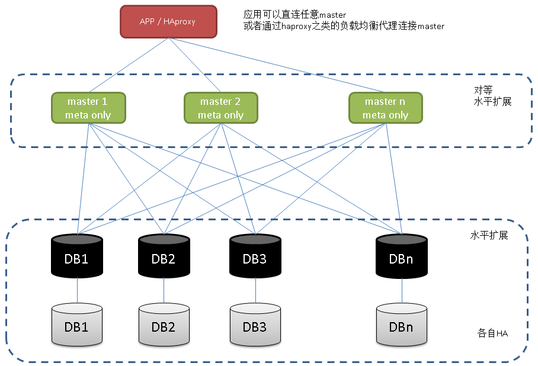

## PostgreSQL 9.6 sharding + 单元化 (based on postgres_fdw) 最佳实践 - 通用水平分库场景设计与实践
##### [TAG 24](../class/24.md)
             
### 作者           
digoal            
            
### 日期          
2016-10-05           
            
### 标签          
PostgreSQL , 9.6 , 水平分库 , sharding , 单元化      
            
----          
            
## 背景    
[20161004_01.md](20161004_01.md)这篇文档讲解了PostgreSQL postgres_fdw的用法以及9.6的增强。  
  
本文将以实践为主，定一个小目标，讲解一下如何使用postgres_fdw实现sharding。  
    
单元化则可以结合bdr插件来实现。  
  
## 一、通用场景设计    
我以一个最简单易懂的场景来举例，例如所有的业务表都包含了用户ID这个字段，并且业务访问数据时，一定会带上用户ID进行访问。  
  
同时用户没有跨用户ID的访问需求。  
  
以上设计是大多数公司使用数据库sharding的最佳实践设计。   
  
### 目标场景
以典型的关系系统为例，构建一个测试场景，每个表都带有用户ID，以用户ID哈希取模为分片规则。  
  
1\. 用户信息表  
```
create table userinfo(uid int8 primary key, info text, crt_time timestamp);
```
  
2\. 日志表  
```
create table user_log(uid int8, logintime timestamp, logouttime timestamp, client_addr inet, client_port int);
```
  
3\. 用户正向关系表（user like who）  
```
create table user_membership(uid1 int8, uid2 int8, unique (uid1,uid2) );
```
  
聚合物化视图  
```
create materialized view mv_user_membership as select uid1,array_agg(uid2) uid2s from user_membership group by uid1;
create unique index idx_mv_user_membership_1 on mv_user_membership (uid1);
refresh materialized view CONCURRENTLY mv_user_membership with data;
```
  
4\. 用户反向关系表（who like user）  
```
create table user_membership_rev(uid2 int8, uid1 int8, unique (uid2,uid1) );
```
  
聚合物化视图  
```
create materialized view mv_user_membership_rev as select uid2,array_agg(uid1) uid1s from user_membership_rev group by uid2;
create unique index idx_mv_user_membership_rev_1 on mv_user_membership_rev (uid2);
refresh materialized view CONCURRENTLY mv_user_membership_rev with data;
```
  
ddl-1.sql如下    
```
create table userinfo(uid int8 primary key, info text, crt_time timestamp);

create table user_log(uid int8, logintime timestamp, logouttime timestamp, client_addr inet, client_port int);

create table user_membership(uid1 int8, uid2 int8, unique (uid1,uid2) );

create materialized view mv_user_membership as select uid1,array_agg(uid2) uid2s from user_membership group by uid1;
create unique index idx_mv_user_membership_1 on mv_user_membership (uid1);
refresh materialized view CONCURRENTLY mv_user_membership with data;

create table user_membership_rev(uid2 int8, uid1 int8, unique (uid2,uid1) );

create materialized view mv_user_membership_rev as select uid2,array_agg(uid1) uid1s from user_membership_rev group by uid2;
create unique index idx_mv_user_membership_rev_1 on mv_user_membership_rev (uid2);
refresh materialized view CONCURRENTLY mv_user_membership_rev with data;
```
  
业务需求  
```
userinfo 增删改查
新增用户、销毁用户、修改用户资料、查询用户资料

user_log 增查
新增用户登陆日志、查询用户日志

user_membership 增删查
新增用户关系，删除用户关系，查询用户关系

user_membership_rev 增删查
新增反向用户关系，删除反向用户关系，查询反向用户关系

mv_user_membership 刷新、查询
mv_user_membership_rev 刷新、查询
聚合物化视图主要是提高关系查询效率用的，刷新物化视图，查询物化视图
```
  
### 构建测试环境
初设256个分片，4个datanode，每个datanode存放64个分片。    
  
测试时使用本地环境模拟，真实环境修改为对应的IP地址和端口即可。  
  
segment 1 :  127.0.0.1:5281:db0:role0:pwd , schema_name role0  
  
segment 2 :  127.0.0.1:5281:db1:role1:pwd , schema_name role1  
  
segment 3 :  127.0.0.1:5281:db2:role2:pwd , schema_name role2  
  
segment 4 :  127.0.0.1:5281:db3:role3:pwd , schema_name role3  
  
master 1 :  127.0.0.1:5281:mas1:digoal:pwd , schema_name digoal  
  
master 2 :  127.0.0.1:5281:mas2:digoal:pwd , schema_name digoal  
  
修改pg_hba.conf，确保127.0.0.1使用md5认证    
  
0\. 初始化测试环境  
```
create role role0 nosuperuser login encrypted password 'pwd';
create role role1 nosuperuser login encrypted password 'pwd';
create role role2 nosuperuser login encrypted password 'pwd';
create role role3 nosuperuser login encrypted password 'pwd';
create role digoal nosuperuser login encrypted password 'pwd';

create database db0 with template template0 encoding 'UTF8';
create database db1 with template template0 encoding 'UTF8';
create database db2 with template template0 encoding 'UTF8';
create database db3 with template template0 encoding 'UTF8';
create database mas1 with template template0 encoding 'UTF8';
create database mas2 with template template0 encoding 'UTF8';

grant all on database db0 to role0;
grant all on database db1 to role1;
grant all on database db2 to role2;
grant all on database db3 to role3;
grant all on database mas1 to digoal;
grant all on database mas2 to digoal;

\c db0 role0
create schema role0;
\c db1 role1
create schema role1;
\c db2 role2
create schema role2;
\c db3 role3
create schema role3;
\c mas1 digoal
create schema digoal;
\c mas2 digoal
create schema digoal;

\c mas1 postgres
create extension postgres_fdw;
grant usage on foreign data wrapper postgres_fdw to digoal;
\c mas2 postgres
create extension postgres_fdw;
grant usage on foreign data wrapper postgres_fdw to digoal;
```
  
1\. 初始化segments (datanodes)   
  
初始化segment1  
```
\c db0 role0

执行 ddl-1.sql  

然后执行 :   
do language plpgsql $$
declare
  i int;
  mod int := 64;
  nod int := 0;
  sql text;
begin
  for i in (mod*nod)..(mod*(nod+1)-1) loop
      sql := 'create table userinfo_'||i||'(like userinfo including all, check(mod(abs(uid), 256) = '||i||' ))';
      execute sql;
      sql := 'create table user_log_'||i||'(like user_log including all, check(mod(abs(uid), 256) = '||i||' ))';
      execute sql;
      sql := 'create table user_membership_'||i||'(like user_membership including all, check(mod(abs(uid1), 256) = '||i||' ))';
      execute sql;
      sql := 'create table user_membership_rev_'||i||'(like user_membership_rev including all, check(mod(abs(uid2), 256) = '||i||' ))';
      execute sql;
      sql := 'create materialized view mv_user_membership_'||i||' as select uid1,array_agg(uid2) uid2s from user_membership_'||i||' group by uid1';
      execute sql;
      sql := 'create unique index idx_mv_user_membership_'||i||'_1 on mv_user_membership_'||i||' (uid1)';
      execute sql;
      sql := 'create materialized view mv_user_membership_rev_'||i||' as select uid2,array_agg(uid1) uid1s from user_membership_rev_'||i||' group by uid2';
      execute sql;
      sql := 'create unique index idx_mv_user_membership_rev_'||i||'_1 on mv_user_membership_rev_'||i||' (uid2)';
      execute sql;
  end loop;
end;
$$;

create or replace function refresh_mv(nsp name, mvname name) returns void as $$
declare
begin
  execute 'refresh materialized view CONCURRENTLY '||quote_ident($1)||'.'||quote_ident($2)||' with data';
end;
$$ language plpgsql strict;

create view v_refresh_mv0 as 
select refresh_mv('role0'::name, mvname::name)::text from 
( 
select id, 'mv_user_membership_'||id mvname from generate_series(0,255) t(id) 
union all 
select id, 'mv_user_membership_rev_'||id mvname from generate_series(0,255) t(id) 
) t 
where mod(abs(id), 256) >= 0 and mod(abs(id), 256) <= 63;
```
  
初始化segment2  
```
\c db1 role1

执行 ddl-1.sql  

修改为
  nod int := 1;

修改为
create view v_refresh_mv1 as 
select refresh_mv('role1'::name, mvname::name)::text from 
( 
select id, 'mv_user_membership_'||id mvname from generate_series(0,255) t(id) 
union all 
select id, 'mv_user_membership_rev_'||id mvname from generate_series(0,255) t(id) 
) t 
where mod(abs(id), 256) >= 64 and mod(abs(id), 256) <= 127;
```
  
初始化segment3  
```
\c db2 role2

执行 ddl-1.sql  

修改为
  nod int := 2;

修改为
create view v_refresh_mv2 as 
select refresh_mv('role2'::name, mvname::name)::text from 
( 
select id, 'mv_user_membership_'||id mvname from generate_series(0,255) t(id) 
union all 
select id, 'mv_user_membership_rev_'||id mvname from generate_series(0,255) t(id) 
) t 
where mod(abs(id), 256) >= 128 and mod(abs(id), 256) <= 191;
```
  
初始化segment4  
```
\c db3 role3

执行 ddl-1.sql  

修改为
  nod int := 3;

修改为
create view v_refresh_mv3 as 
select refresh_mv('role3'::name, mvname::name)::text from 
( 
select id, 'mv_user_membership_'||id mvname from generate_series(0,255) t(id) 
union all 
select id, 'mv_user_membership_rev_'||id mvname from generate_series(0,255) t(id) 
) t 
where mod(abs(id), 256) >= 192 and mod(abs(id), 256) <= 255;
```
  
2\. 初始化masters (coordinators)    
master节点只存储元数据，无状态，完全对称，可以横向或者。      
  
初始化 master_1  
  
导入外部表结构  
```
\c mas1 digoal

create server db0 foreign data wrapper postgres_fdw OPTIONS (host '127.0.0.1', port '5281', dbname 'db0', use_remote_estimate 'true');
create server db1 foreign data wrapper postgres_fdw OPTIONS (host '127.0.0.1', port '5281', dbname 'db1', use_remote_estimate 'true');
create server db2 foreign data wrapper postgres_fdw OPTIONS (host '127.0.0.1', port '5281', dbname 'db2', use_remote_estimate 'true');
create server db3 foreign data wrapper postgres_fdw OPTIONS (host '127.0.0.1', port '5281', dbname 'db3', use_remote_estimate 'true');

create user mapping FOR digoal SERVER db0 options (user 'role0', password 'pwd');
create user mapping FOR digoal SERVER db1 options (user 'role1', password 'pwd');
create user mapping FOR digoal SERVER db2 options (user 'role2', password 'pwd');
create user mapping FOR digoal SERVER db3 options (user 'role3', password 'pwd');

import foreign schema role0 EXCEPT (userinfo,user_log,user_membership,mv_user_membership,user_membership_rev,mv_user_membership_rev) from server db0 into digoal;
import foreign schema role1 EXCEPT (userinfo,user_log,user_membership,mv_user_membership,user_membership_rev,mv_user_membership_rev) from server db1 into digoal;
import foreign schema role2 EXCEPT (userinfo,user_log,user_membership,mv_user_membership,user_membership_rev,mv_user_membership_rev) from server db2 into digoal;
import foreign schema role3 EXCEPT (userinfo,user_log,user_membership,mv_user_membership,user_membership_rev,mv_user_membership_rev) from server db3 into digoal;
```
  
构建约束   
```
do language plpgsql $$
declare
  i int;
  x int := 0;
  y int := 255;
  sql text;
begin
  for i in x..y loop
      sql := 'alter foreign table userinfo_'||i||' add constraint ck_userinfo_'||i||' check(mod(abs(uid), 256) = '||i||' )';
      execute sql;
      sql := 'alter foreign table user_log_'||i||' add constraint ck_user_log_'||i||' check(mod(abs(uid), 256) = '||i||' )';
      execute sql;
      sql := 'alter foreign table user_membership_'||i||' add constraint ck_user_membership_'||i||' check(mod(abs(uid1), 256) = '||i||' )';
      execute sql;
      sql := 'alter foreign table user_membership_rev_'||i||' add constraint ck_user_membership_rev_'||i||' check(mod(abs(uid2), 256) = '||i||' )';
      execute sql;
      sql := 'alter foreign table mv_user_membership_'||i||' add constraint ck_mv_user_membership_'||i||' check(mod(abs(uid1), 256) = '||i||' )';
      execute sql;
      sql := 'alter foreign table mv_user_membership_rev_'||i||' add constraint ck_mv_user_membership_rev_'||i||' check(mod(abs(uid2), 256) = '||i||' )';
      execute sql;
  end loop;
end;
$$;
```
  
构建继承关系   
```
create table userinfo(uid int8 primary key, info text, crt_time timestamp);

create table user_log(uid int8, logintime timestamp, logouttime timestamp, client_addr inet, client_port int);

create table user_membership(uid1 int8, uid2 int8, unique (uid1,uid2) );

create table mv_user_membership (uid1 int8, uid2s int8[]);

create table user_membership_rev(uid2 int8, uid1 int8, unique (uid2,uid1) );

create table mv_user_membership_rev (uid2 int8, uid1s int8[]);
```
  
```
do language plpgsql $$
declare
  i int;
  x int := 0;
  y int := 255;
  sql text;
begin
  for i in x..y loop
      sql := 'alter foreign table userinfo_'||i||' inherit userinfo';
      execute sql;
      sql := 'alter foreign table user_log_'||i||' inherit user_log';
      execute sql;
      sql := 'alter foreign table user_membership_'||i||' inherit user_membership';
      execute sql;
      sql := 'alter foreign table user_membership_rev_'||i||' inherit user_membership_rev';
      execute sql;
      sql := 'alter foreign table mv_user_membership_'||i||' inherit mv_user_membership';
      execute sql;
      sql := 'alter foreign table mv_user_membership_rev_'||i||' inherit mv_user_membership_rev';
      execute sql;
  end loop;
end;
$$;
```
  
构建插入触发器  
  
对于业务需要插入数据的表，构建插入触发器，例子使用动态SQL，未优化效率。  
  
```
userinfo 增删改查
新增用户、销毁用户、修改用户资料、查询用户资料

user_log 增查
新增用户登陆日志、查询用户日志

user_membership 增删查
新增用户关系，删除用户关系，查询用户关系

user_membership_rev 增删查
新增反向用户关系，删除反向用户关系，查询反向用户关系
```
  
```
create or replace function tg_userinfo_ins() returns trigger as $$
declare
  i int;
begin
  i := mod(abs(NEW.uid), 256);
  execute 'insert into userinfo_'||i||'(uid,info,crt_time) values ('||quote_nullable(NEW.uid)||','||quote_nullable(NEW.info)||','||quote_nullable(NEW.crt_time)||')';
  return null;
end;
$$ language plpgsql strict;

create or replace function tg_user_log_ins() returns trigger as $$
declare
  i int;
begin
  i := mod(abs(NEW.uid), 256);
  execute 'insert into user_log_'||i||'(uid,logintime,logouttime,client_addr,client_port) values ('||quote_nullable(NEW.uid)||','||quote_nullable(NEW.logintime)||','||quote_nullable(NEW.logouttime)||','||quote_nullable(NEW.client_addr)||','||quote_nullable(NEW.client_port)||')';
  return null;
end;
$$ language plpgsql strict;

create or replace function tg_user_membership_ins() returns trigger as $$
declare
  i int;
begin
  i := mod(abs(NEW.uid1), 256);
  execute 'insert into user_membership_'||i||'(uid1,uid2) values ('||quote_nullable(NEW.uid1)||','||quote_nullable(NEW.uid2)||')';
  return null;
end;
$$ language plpgsql strict;

create or replace function tg_user_membership_rev_ins() returns trigger as $$
declare
  i int;
begin
  i := mod(abs(NEW.uid2), 256);
  execute 'insert into user_membership_rev_'||i||'(uid2,uid1) values ('||quote_nullable(NEW.uid2)||','||quote_nullable(NEW.uid1)||')';
  return null;
end;
$$ language plpgsql strict;
```
  
```
create trigger tg_ins before insert on userinfo for each row execute procedure tg_userinfo_ins();
create trigger tg_ins before insert on user_log for each row execute procedure tg_user_log_ins();
create trigger tg_ins before insert on user_membership for each row execute procedure tg_user_membership_ins();
create trigger tg_ins before insert on user_membership_rev for each row execute procedure tg_user_membership_rev_ins();
```
  
初始化 master_n  
```
从mas1克隆一个结构即可  

pg_dump -s -d mas1 -U digoal | psql -U postgres -d mas2 -f -  
```
  
如果元数据发生变更，注意同步master的meta信息。    
  
可以使用逻辑复制的方式，复制出多个一样的master。   
  
### 初始化测试数据
```
\c mas1 digoal

-- 生成用户信息
insert into userinfo select generate_series(1,100000), md5(random()::text), now();

-- 生成用户日志信息
insert into user_log select uid,now(),null,null,null from userinfo;

-- 生成uid1喜欢uid2信息
insert into user_membership select uid1, uid2 from (select trunc(100000*random()) uid1,trunc(100000*random()) uid2 from generate_series(1,100000)) t where uid1<>uid2 group by 1,2; 

-- 生成uid2被uid1喜欢信息
insert into user_membership_rev select uid2, uid1 from user_membership; 

-- 刷新物化视图
select count(*) from v_refresh_mv0 union all select count(*) from v_refresh_mv1 union all select count(*) from v_refresh_mv2 union all select count(*) from v_refresh_mv3 ;
```
  
### 业务SQL 设计  
1\. 所有SQL都需要带上分区条件，例如  
```
where uid=? and mod(abs(uid), 256) = mod(abs(?), 256);

where uid1=? and mod(abs(uid1), 256) = mod(abs(?), 256);

where uid2=? and mod(abs(uid2), 256) = mod(abs(?), 256);
```
  
2\. userinfo 增删改查    
新增用户、销毁用户、修改用户资料、查询用户资料    
```
insert into userinfo(uid,info,text) values (?,?,?);

delete from userinfo where uid=? and mod(abs(uid), 256) = mod(abs(?), 256);

update userinfo set xxx=xxx where uid=? and mod(abs(uid), 256) = mod(abs(?), 256);

select x,x,x from userinfo where uid=? and mod(abs(uid), 256) = mod(abs(?), 256);
```
    
3\. user_log 增查  
新增用户登陆日志、查询用户日志  
```
insert into user_log(uid,logintime,logouttime,client_addr,client_port) values (?,?,?,?,?);

select x,x,x,x,x from user_log where uid=? and mod(abs(uid), 256) = mod(abs(?), 256);
```
  
4\. user_membership 增删查  
新增用户关系，删除用户关系，查询用户关系  
```
insert into user_membership(uid1, uid2) values (?,?);

delete from user_membership where uid1=? and mod(abs(uid1), 256) = mod(abs(?), 256);

select x,x from user_membership where uid1=? and mod(abs(uid1), 256) = mod(abs(?), 256);
```
  
5\. user_membership_rev 增删查  
新增反向用户关系，删除反向用户关系，查询反向用户关系  
```
insert into user_membership_rev(uid2, uid1) values (?,?);

delete from user_membership_rev where uid2=? and mod(abs(uid2), 256) = mod(abs(?), 256);

select x,x from user_membership_rev where uid2=? and mod(abs(uid2), 256) = mod(abs(?), 256);
```
  
6\. 物化视图  
mv_user_membership 刷新、查询  
mv_user_membership_rev 刷新、查询  
聚合物化视图主要是提高关系查询效率用的，刷新物化视图，查询物化视图  
```
select count(*) from v_refresh_mv0 union all select count(*) from v_refresh_mv1 union all select count(*) from v_refresh_mv2 union all select count(*) from v_refresh_mv3 ;

select x,x from mv_user_membership where uid1=? and mod(abs(uid1), 256) = mod(abs(?), 256);

select x,x from mv_user_membership_rev where uid2=? and mod(abs(uid2), 256) = mod(abs(?), 256);
```
  
### 执行计划查看
1\. 查看执行计划，SQL是否下推到对应节点执行，是否只访问目标数据节点。    
```
查询
mas1=> explain verbose select * from userinfo where uid=100 and mod(abs(uid), 256) = mod(abs(100), 256);
                                                             QUERY PLAN                                                              
-------------------------------------------------------------------------------------------------------------------------------------
 Append  (cost=0.00..102.19 rows=2 width=48)
   ->  Seq Scan on digoal.userinfo  (cost=0.00..0.00 rows=1 width=48)
         Output: userinfo.uid, userinfo.info, userinfo.crt_time
         Filter: ((userinfo.uid = 100) AND (mod(abs(userinfo.uid), '256'::bigint) = 100))
   ->  Foreign Scan on digoal.userinfo_100  (cost=100.15..102.19 rows=1 width=49)
         Output: userinfo_100.uid, userinfo_100.info, userinfo_100.crt_time
         Remote SQL: SELECT uid, info, crt_time FROM role1.userinfo_100 WHERE ((uid = 100)) AND ((mod(abs(uid), 256::bigint) = 100))
(7 rows)

排序
mas1=> explain verbose select * from user_membership where uid1=100 and mod(abs(uid1), 256) = mod(abs(100), 256) order by uid2;
                                                                               QUERY PLAN                                                                               
------------------------------------------------------------------------------------------------------------------------------------------------------------------------
 Sort  (cost=102.33..102.34 rows=2 width=16)
   Output: user_membership.uid1, user_membership.uid2
   Sort Key: user_membership.uid2
   ->  Append  (cost=0.00..102.32 rows=2 width=16)
         ->  Seq Scan on digoal.user_membership  (cost=0.00..0.00 rows=1 width=16)
               Output: user_membership.uid1, user_membership.uid2
               Filter: ((user_membership.uid1 = 100) AND (mod(abs(user_membership.uid1), '256'::bigint) = 100))
         ->  Foreign Scan on digoal.user_membership_100  (cost=100.27..102.32 rows=1 width=16)
               Output: user_membership_100.uid1, user_membership_100.uid2
               Remote SQL: SELECT uid1, uid2 FROM role1.user_membership_100 WHERE ((uid1 = 100)) AND ((mod(abs(uid1), 256::bigint) = 100)) ORDER BY uid2 ASC NULLS LAST
(10 rows)

更新
mas1=> explain verbose update userinfo set info='new' where uid=100 and mod(abs(uid), 256) = mod(abs(100), 256);
                                                            QUERY PLAN                                                             
-----------------------------------------------------------------------------------------------------------------------------------
 Update on digoal.userinfo  (cost=0.00..102.20 rows=2 width=54)
   Update on digoal.userinfo
   Foreign Update on digoal.userinfo_100
   ->  Seq Scan on digoal.userinfo  (cost=0.00..0.00 rows=1 width=54)
         Output: userinfo.uid, 'new'::text, userinfo.crt_time, userinfo.ctid
         Filter: ((userinfo.uid = 100) AND (mod(abs(userinfo.uid), '256'::bigint) = 100))
   ->  Foreign Update on digoal.userinfo_100  (cost=100.15..102.20 rows=1 width=54)
         Remote SQL: UPDATE role1.userinfo_100 SET info = 'new'::text WHERE ((uid = 100)) AND ((mod(abs(uid), 256::bigint) = 100))
(8 rows)

删除
mas1=> explain verbose delete from user_membership where uid1=1001 and mod(abs(uid1), 256) = mod(abs(1001), 256);
                                                        QUERY PLAN                                                         
---------------------------------------------------------------------------------------------------------------------------
 Delete on digoal.user_membership  (cost=0.00..102.33 rows=2 width=6)
   Delete on digoal.user_membership
   Foreign Delete on digoal.user_membership_233
   ->  Seq Scan on digoal.user_membership  (cost=0.00..0.00 rows=1 width=6)
         Output: user_membership.ctid
         Filter: ((user_membership.uid1 = 1001) AND (mod(abs(user_membership.uid1), '256'::bigint) = 233))
   ->  Foreign Delete on digoal.user_membership_233  (cost=100.27..102.33 rows=1 width=6)
         Remote SQL: DELETE FROM role3.user_membership_233 WHERE ((uid1 = 1001)) AND ((mod(abs(uid1), 256::bigint) = 233))
(8 rows)

JOIN
mas1=> explain verbose select * from userinfo t1 join user_membership t2 on (t1.uid=t2.uid1) 
where 
t2.uid1=1001 and mod(abs(t2.uid1), 256) = mod(abs(1001), 256) 
and 
t1.uid=1001 and mod(abs(t1.uid), 256) = mod(abs(1001), 256);
                                                                    QUERY PLAN                                                                    
--------------------------------------------------------------------------------------------------------------------------------------------------
 Nested Loop  (cost=0.00..204.57 rows=4 width=64)
   Output: t1.uid, t1.info, t1.crt_time, t2.uid1, t2.uid2
   ->  Append  (cost=0.00..102.19 rows=2 width=48)
         ->  Seq Scan on digoal.userinfo t1  (cost=0.00..0.00 rows=1 width=48)
               Output: t1.uid, t1.info, t1.crt_time
               Filter: ((t1.uid = 1001) AND (mod(abs(t1.uid), '256'::bigint) = 233))
         ->  Foreign Scan on digoal.userinfo_233 t1_1  (cost=100.15..102.19 rows=1 width=49)
               Output: t1_1.uid, t1_1.info, t1_1.crt_time
               Remote SQL: SELECT uid, info, crt_time FROM role3.userinfo_233 WHERE ((uid = 1001)) AND ((mod(abs(uid), 256::bigint) = 233))
   ->  Materialize  (cost=0.00..102.33 rows=2 width=16)
         Output: t2.uid1, t2.uid2
         ->  Append  (cost=0.00..102.32 rows=2 width=16)
               ->  Seq Scan on digoal.user_membership t2  (cost=0.00..0.00 rows=1 width=16)
                     Output: t2.uid1, t2.uid2
                     Filter: ((t2.uid1 = 1001) AND (mod(abs(t2.uid1), '256'::bigint) = 233))
               ->  Foreign Scan on digoal.user_membership_233 t2_1  (cost=100.27..102.32 rows=1 width=16)
                     Output: t2_1.uid1, t2_1.uid2
                     Remote SQL: SELECT uid1, uid2 FROM role3.user_membership_233 WHERE ((uid1 = 1001)) AND ((mod(abs(uid1), 256::bigint) = 233))
(18 rows)
```
  
以上SQL满足业务需求。  
  
对于SQL中带的用户新增的函数或其他条件，如果要下推，则必须使用extension来管理这些函数，master与所有的segment都需要创建这些extension，并且在创建server时包含这些extension。   
  
语法见我上一篇讲postgres_fdw的文档。  
  
### 全局约束设计  
1\. 全局唯一序列    
  
步调一致，起始值不一致。  
```
create sequence seq increment by 10000 start with 0;
create sequence seq increment by 10000 start with 1;
create sequence seq increment by 10000 start with 2;
......
create sequence seq increment by 10000 start with 255;
```
  
### master横向扩展  
由于master只存储了META数据，因此master 都是对等的，如果master成为瓶颈的话，我们可以新增master节点，上层使用负载均衡的方式连接多个master即可。  
  
通常master不会成为瓶颈，因为master不参与计算，对于9.6来说，单节点的master已经可以处理百万级别的QPS(基于PK的查询)。  
  
  
  
### fdw的一些使用限制  
1\. 外部表暂时不支持truncate  
```
mas1=> truncate userinfo ;
ERROR:  42809: "userinfo_0" is not a table
LOCATION:  truncate_check_rel, tablecmds.c:1300
Time: 5.950 ms
```
  
2\. 外部表暂时不支持透传upsert  
```
mas1=> insert into userinfo values (1,'test',now()) on conflict (uid) do update set info=excluded.info;
ERROR:  23505: duplicate key value violates unique constraint "userinfo_1_pkey"
DETAIL:  Key (uid)=(1) already exists.
CONTEXT:  Remote SQL command: INSERT INTO role0.userinfo_1(uid, info, crt_time) VALUES ($1, $2, $3)
SQL statement "insert into userinfo_1(uid,info,crt_time) values ('1','test','2016-10-05 16:50:15.794812')"
PL/pgSQL function tg_userinfo_ins() line 6 at EXECUTE
LOCATION:  pgfdw_report_error, connection.c:574
Time: 0.931 ms
```
  
3\. 目前没有办法过滤主表的扫描(除非使用 https://github.com/postgrespro/pg_pathman/ 插件)  
```
mas1=> explain verbose select * from user_membership where uid1=100 and mod(abs(uid1), 256) = mod(abs(100), 256) order by uid2;
                                                                               QUERY PLAN                                                                               
------------------------------------------------------------------------------------------------------------------------------------------------------------------------
 Sort  (cost=102.33..102.34 rows=2 width=16)
   Output: user_membership.uid1, user_membership.uid2
   Sort Key: user_membership.uid2
   ->  Append  (cost=0.00..102.32 rows=2 width=16)
         ->  Seq Scan on digoal.user_membership  (cost=0.00..0.00 rows=1 width=16)
               Output: user_membership.uid1, user_membership.uid2
               Filter: ((user_membership.uid1 = 100) AND (mod(abs(user_membership.uid1), '256'::bigint) = 100))
         ->  Foreign Scan on digoal.user_membership_100  (cost=100.27..102.32 rows=1 width=16)
               Output: user_membership_100.uid1, user_membership_100.uid2
               Remote SQL: SELECT uid1, uid2 FROM role1.user_membership_100 WHERE ((uid1 = 100)) AND ((mod(abs(uid1), 256::bigint) = 100)) ORDER BY uid2 ASC NULLS LAST
(10 rows)
```
  
  
简单场景未包含需要在多个segment之间复制的维度表，小表。  
  
下一篇将为大家介绍    
  
二、复杂场景设计  
  
三、单元化  
  
```
负载均衡  
  
对等  
  
单元化  

大表，水平拆分  

小表，但是需要与其他表JOIN操作，逻辑复制   

维度表，复制  

一些单元化相关的表，可以垂直拆分或隔离，按单元拆分  

同时需要考虑全局约束，序列步调等  

还将包括，复制怎么做？  

如何避免环路，如何解决冲突。    
```
   
        
    
  
<a rel="nofollow" href="http://info.flagcounter.com/h9V1"  ></a>  
  
  
  
  
  
  
## [digoal's 大量PostgreSQL文章入口](https://github.com/digoal/blog/blob/master/README.md "22709685feb7cab07d30f30387f0a9ae")
  
