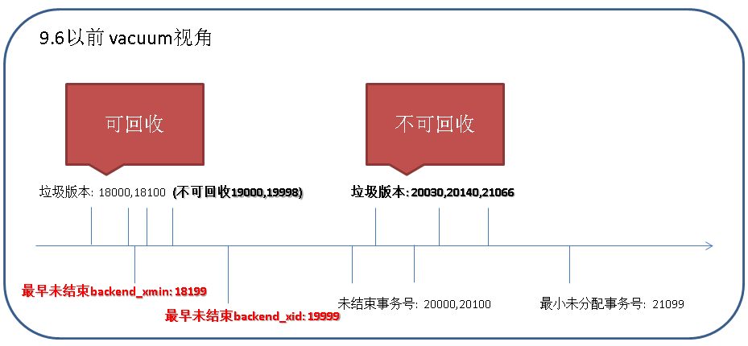
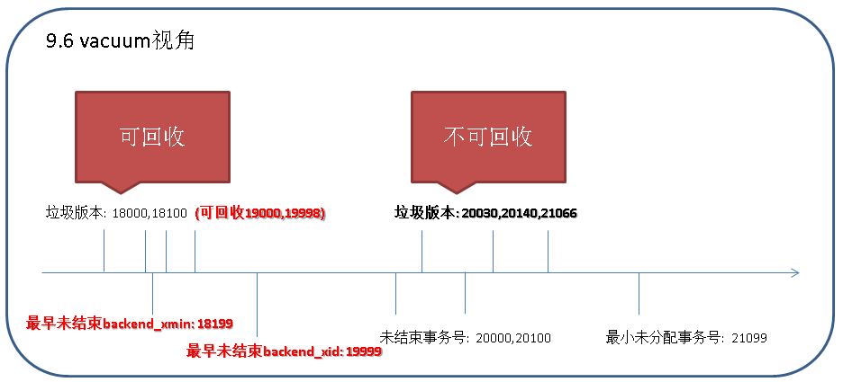
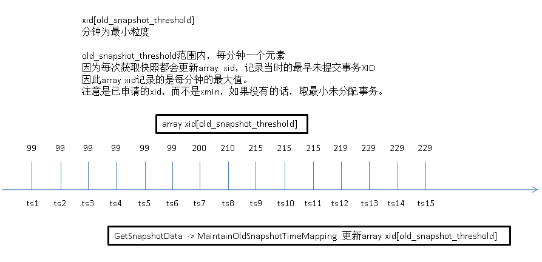

## PostgreSQL 9.6 快照过旧 - 源码浅析
             
### 作者           
digoal            
            
### 日期          
2016-10-05           
            
### 标签          
PostgreSQL , 9.6 , 快照过旧 , snapshot too old  
            
----          
            
## 背景    
在PostgreSQL 9.6以前，垃圾回收存在的问题。  
  
当vacuum回收垃圾时，遇到垃圾记录的xmax大于数据库中现存的最早未提交事务xmin时，不会对其进行回收。  
  
因此当数据库中存在很久为结束的事务时，可能会导致数据库膨胀。  
  
  
  
PostgreSQL 9.6加入了快照过旧的功能，目的是防止过长的事务导致数据库膨胀。  
  
```
Allow old MVCC snapshots to be invalidated after a configurable timeout (Kevin Grittner)    

Normally, deleted tuples cannot be physically removed by vacuuming until the last transaction that could "see" them is gone.   

A transaction that stays open for a long time can thus cause considerable table bloat because space cannot be recycled.   

This feature allows setting a time-based limit, via the new configuration parameter old_snapshot_threshold, on how long an MVCC snapshot is guaranteed to be valid.   

After that, dead tuples are candidates for removal.   

A transaction using an outdated snapshot will get an error if it attempts to read a page that potentially could have contained such data.  
```
  
  
    
那么如何配置快照过旧，什么情况选会导致snapshot too old呢？    
  
## 事务快照解说 
### 快照数据结构
src/include/utils/snapshot.h  
```
/*
 * Struct representing all kind of possible snapshots.
 *
 * There are several different kinds of snapshots:
 * * Normal MVCC snapshots
 * * MVCC snapshots taken during recovery (in Hot-Standby mode)
 * * Historic MVCC snapshots used during logical decoding
 * * snapshots passed to HeapTupleSatisfiesDirty()
 * * snapshots used for SatisfiesAny, Toast, Self where no members are
 *       accessed.
 *
 * TODO: It's probably a good idea to split this struct using a NodeTag
 * similar to how parser and executor nodes are handled, with one type for
 * each different kind of snapshot to avoid overloading the meaning of
 * individual fields.
 */
typedef struct SnapshotData
{
        SnapshotSatisfiesFunc satisfies;        /* tuple test function */

        /*
         * The remaining fields are used only for MVCC snapshots, and are normally
         * just zeroes in special snapshots.  (But xmin and xmax are used
         * specially by HeapTupleSatisfiesDirty.)
         *
         * An MVCC snapshot can never see the effects of XIDs >= xmax. It can see
         * the effects of all older XIDs except those listed in the snapshot. xmin
         * is stored as an optimization to avoid needing to search the XID arrays
         * for most tuples.
         */
        TransactionId xmin;                     /* all XID < xmin are visible to me */
        TransactionId xmax;                     /* all XID >= xmax are invisible to me */

        /*
         * For normal MVCC snapshot this contains the all xact IDs that are in
         * progress, unless the snapshot was taken during recovery in which case
         * it's empty. For historic MVCC snapshots, the meaning is inverted, i.e.
         * it contains *committed* transactions between xmin and xmax.
         *
         * note: all ids in xip[] satisfy xmin <= xip[i] < xmax
         */
        TransactionId *xip;
        uint32          xcnt;                   /* # of xact ids in xip[] */

        /*
         * For non-historic MVCC snapshots, this contains subxact IDs that are in
         * progress (and other transactions that are in progress if taken during
         * recovery). For historic snapshot it contains *all* xids assigned to the
         * replayed transaction, including the toplevel xid.
         *
         * note: all ids in subxip[] are >= xmin, but we don't bother filtering
         * out any that are >= xmax
         */
        TransactionId *subxip;
        int32           subxcnt;                /* # of xact ids in subxip[] */
        bool            suboverflowed;  /* has the subxip array overflowed? */

        bool            takenDuringRecovery;    /* recovery-shaped snapshot? */
        bool            copied;                 /* false if it's a static snapshot */

        CommandId       curcid;                 /* in my xact, CID < curcid are visible */

        /*
         * An extra return value for HeapTupleSatisfiesDirty, not used in MVCC
         * snapshots.
         */
        uint32          speculativeToken;

        /*
         * Book-keeping information, used by the snapshot manager
         */
        uint32          active_count;   /* refcount on ActiveSnapshot stack */
        uint32          regd_count;             /* refcount on RegisteredSnapshots */
        pairingheap_node ph_node;       /* link in the RegisteredSnapshots heap */

        int64           whenTaken;              /* timestamp when snapshot was taken */
        XLogRecPtr      lsn;                    /* position in the WAL stream when taken */
} SnapshotData;
```
  
### xmin,xid
对于repeatable read与serializable隔离级别的事务来说，第一个query开始时需要获取一个快照，用于可见性判断。    
  
对于read committed隔离级别的事务来说，事务中每条QUERY开始都会重新获取一个快照。  
  
快照中将包含一个xmin值，表示当前数据库中最小的正在运行的事务号，如果没有，则为最小未分配事务号。  
  
快照xmin与事务申请的事务号有别，在pg_stat_activity视图中用两个分开的字段表示：  
```
 backend_xid      | xid                      | 
 backend_xmin     | xid                      | 
```
  
xid表示该事务申请的事务号，是消耗掉的。  
  
快照中xid与xmin的数据结构如下    
```
/*
 * Prior to PostgreSQL 9.2, the fields below were stored as part of the
 * PGPROC.  However, benchmarking revealed that packing these particular
 * members into a separate array as tightly as possible sped up GetSnapshotData
 * considerably on systems with many CPU cores, by reducing the number of
 * cache lines needing to be fetched.  Thus, think very carefully before adding
 * anything else here.
 */
typedef struct PGXACT
{
        TransactionId xid;                      /* id of top-level transaction currently being
                                                                 * executed by this proc, if running and XID
                                                                 * is assigned; else InvalidTransactionId */

        TransactionId xmin;                     /* minimal running XID as it was when we were
                                                                 * starting our xact, excluding LAZY VACUUM:
                                                                 * vacuum must not remove tuples deleted by
                                                                 * xid >= xmin ! */

        uint8           vacuumFlags;    /* vacuum-related flags, see above */
        bool            overflowed;
        bool            delayChkpt;             /* true if this proc delays checkpoint start;
                                                                 * previously called InCommit */

        uint8           nxids;
} PGXACT;
```
  
在pg_stat_activity中存储的xmin,xid结构如下  
```
/* ----------
 * LocalPgBackendStatus
 *
 * When we build the backend status array, we use LocalPgBackendStatus to be
 * able to add new values to the struct when needed without adding new fields
 * to the shared memory. It contains the backend status as a first member.
 * ----------
 */
typedef struct LocalPgBackendStatus
{
        /*
         * Local version of the backend status entry.
         */
        PgBackendStatus backendStatus;

        /*
         * The xid of the current transaction if available, InvalidTransactionId
         * if not.
         */
        TransactionId backend_xid;

        /*
         * The xmin of the current session if available, InvalidTransactionId if
         * not.
         */
        TransactionId backend_xmin;
} LocalPgBackendStatus;
```
  
举一些例子帮助了解快照中的xid与xmin。  
  
1\. repeatable read与serializable隔离级别的事务，事务的第一条SQL会获取快照，快照持续到事务结束释放。    
```
session A:  
获取当前会话PID，并开启一个repeatable read或serializable隔离级别的事务 
postgres=# select pg_backend_pid();
 pg_backend_pid 
----------------
          57479
(1 row)
postgres=# begin transaction isolation level repeatable read;
BEGIN

session B:
查询会话A的xmin,xid
postgres=# select pid,backend_xid,backend_xmin from pg_stat_activity where pid=57479;
  pid  | backend_xid | backend_xmin 
-------+-------------+--------------
 57479 |             |             
(1 row)

session A: 
执行第一条SQL
postgres=# select 1;
 ?column? 
----------
        1
(1 row)

session B:
78336为session A事务开启时数据库集群中未分配的最小事务号，或者未结束的最小事务号
postgres=# select pid,backend_xid,backend_xmin from pg_stat_activity where pid=57479;
  pid  | backend_xid | backend_xmin 
-------+-------------+--------------
 57479 |             |        78336
(1 row)
在session B消耗2个事务(使用两种方法，各消耗1个事务ID)
postgres=# select txid_current();
 txid_current 
--------------
        78336
(1 row)
postgres=# insert into tbl1 values (1);
INSERT 0 1

session A:
执行第二条SQL
postgres=# select 2;
 ?column? 
----------
        2
(1 row)

session B:
对于repeatable read或serializable隔离级别的事务来说，xmin不会变化。
postgres=# select pid,backend_xid,backend_xmin from pg_stat_activity where pid=57479;
  pid  | backend_xid | backend_xmin 
-------+-------------+--------------
 57479 |             |        78336
(1 row)

session A:
执行一条会申请XID的SQL，例如插入数据。  
postgres=# insert into tbl1 values (1);
INSERT 0 1

session B:
xid有值了，为session A对应事务申请下来的事务号，是已消耗掉的，XID不会变化。  
postgres=# select pid,backend_xid,backend_xmin from pg_stat_activity where pid=57479;
  pid  | backend_xid | backend_xmin 
-------+-------------+--------------
 57479 |       78338 |        78336
(1 row)
```
  
2\. read committed隔离级别的事务，事务的每一条SQL会获取快照，SQL执行结束就会释放快照。    
```
session A:  
获取当前会话PID，并开启一个repeatable read或serializable隔离级别的事务 
postgres=# select pg_backend_pid();
 pg_backend_pid 
----------------
          57479
(1 row)
postgres=# begin transaction isolation level read committed;
BEGIN

session B:
查询会话A的xmin,xid
postgres=# select pid,backend_xid,backend_xmin from pg_stat_activity where pid=57479;
  pid  | backend_xid | backend_xmin 
-------+-------------+--------------
 57479 |             |             
(1 row)

session A: 
执行第一条SQL
postgres=# select 1;
 ?column? 
----------
        1
(1 row)

session B:
并没有观察到xmin，因为select 1;开始时获取，SQL执行结束马上就释放了
postgres=# select pid,backend_xid,backend_xmin from pg_stat_activity where pid=57479;
  pid  | backend_xid | backend_xmin 
-------+-------------+--------------
 57479 |             |             
(1 row)

session A: 
执行第一条long SQL
postgres=# select pg_sleep(10);

session B:
pg_sleep执行结束前，赶快查看，可以观察到xmin，SQL执行结束再查看xmin就会消失。  
postgres=# select pid,backend_xid,backend_xmin from pg_stat_activity where pid=57479;
  pid  | backend_xid | backend_xmin 
-------+-------------+--------------
 57479 |             |        78339
(1 row)

session B:
在session B消耗2个事务(使用两种方法，各消耗1个事务ID)
postgres=# select txid_current();
 txid_current 
--------------
        78339
(1 row)
postgres=# insert into tbl1 values (1);
INSERT 0 1

session A: 
执行第2条long SQL
postgres=# select pg_sleep(10);

session B:
pg_sleep执行结束前，赶快查看，可以观察到xmin，SQL执行结束再查看xmin就会消失。  
xmin与第一条SQL不一样，因为read committed隔离级别的事务，每条SQL开始时都会新申请快照。  
postgres=# select pid,backend_xid,backend_xmin from pg_stat_activity where pid=57479;
  pid  | backend_xid | backend_xmin 
-------+-------------+--------------
 57479 |             |        78341
(1 row)

session A:
执行一条会申请XID的SQL，例如插入数据。  
postgres=# insert into tbl1 values (1);
INSERT 0 1

session B:
xid有值了，为session A对应事务申请下来的事务号，是已消耗掉的，XID不会变化，直到事务结束。  
postgres=# select pid,backend_xid,backend_xmin from pg_stat_activity where pid=57479;
  pid  | backend_xid | backend_xmin 
-------+-------------+--------------
 57479 |       78341 |             
(1 row)
```
  
以上例子解释了事务快照中的xmin, xid的含义，大家熟悉后，就可以看PostgreSQL 9.6的改进了。  
  
### lsn, whenTaken
快照中的lsn表示获取快照时WAL的写入位置，whenTaken表示获取快照时的时间  
```
        int64           whenTaken;              /* timestamp when snapshot was taken */
        XLogRecPtr      lsn;                    /* position in the WAL stream when taken */
```
  
### PostgreSQL 9.6 判断快照过旧的代码
1\. src/include/storage/bufmgr.h  
```
/*
 * Check whether the given snapshot is too old to have safely read the given
 * page from the given table.  If so, throw a "snapshot too old" error.
 *
 * This test generally needs to be performed after every BufferGetPage() call
 * that is executed as part of a scan.  It is not needed for calls made for
 * modifying the page (for example, to position to the right place to insert a
 * new index tuple or for vacuuming).  It may also be omitted where calls to
 * lower-level functions will have already performed the test.
 *
 * Note that a NULL snapshot argument is allowed and causes a fast return
 * without error; this is to support call sites which can be called from
 * either scans or index modification areas.
 *
 * For best performance, keep the tests that are fastest and/or most likely to
 * exclude a page from old snapshot testing near the front.
 */
static inline void
TestForOldSnapshot(Snapshot snapshot, Relation relation, Page page)
{
        Assert(relation != NULL);

        if (old_snapshot_threshold >= 0
                && (snapshot) != NULL
                && ((snapshot)->satisfies == HeapTupleSatisfiesMVCC
                        || (snapshot)->satisfies == HeapTupleSatisfiesToast)
                && !XLogRecPtrIsInvalid((snapshot)->lsn)
                && PageGetLSN(page) > (snapshot)->lsn)
                TestForOldSnapshot_impl(snapshot, relation);
}
```
  
2\. src/backend/storage/buffer/bufmgr.c  
```
/*
 * Implement slower/larger portions of TestForOldSnapshot
 *
 * Smaller/faster portions are put inline, but the entire set of logic is too
 * big for that.
 */
void
TestForOldSnapshot_impl(Snapshot snapshot, Relation relation)
{
        if (RelationAllowsEarlyPruning(relation)
                && (snapshot)->whenTaken < GetOldSnapshotThresholdTimestamp())
                ereport(ERROR,
                                (errcode(ERRCODE_SNAPSHOT_TOO_OLD),
                                 errmsg("snapshot too old")));
}
```
  
3\. src/backend/utils/time/snapmgr.c  
获取old_snapshot_threshold配置的时间  
```
/*
 * Get timestamp through which vacuum may have processed based on last stored
 * value for threshold_timestamp.
 *
 * XXX: So far, we never trust that a 64-bit value can be read atomically; if
 * that ever changes, we could get rid of the spinlock here.
 */
int64
GetOldSnapshotThresholdTimestamp(void)
{
        int64           threshold_timestamp;

        SpinLockAcquire(&oldSnapshotControl->mutex_threshold);
        threshold_timestamp = oldSnapshotControl->threshold_timestamp;
        SpinLockRelease(&oldSnapshotControl->mutex_threshold);

        return threshold_timestamp;
}
```
    
GUC变量old_snapshot_threshold，表示多少分钟以前的xmin可能会被垃圾回收时清除掉。  
```
+ * GUC parameters
+ */
+int            old_snapshot_threshold;     /* number of minutes, -1 disables */
+
```
  
报错与old_snapshot_threshold快照相关信息的数据结构    
```
/*
 * Structure for dealing with old_snapshot_threshold implementation.
 */
typedef struct OldSnapshotControlData
{
        /*
         * Variables for old snapshot handling are shared among processes and are
         * only allowed to move forward.
         */
        slock_t         mutex_current;  /* protect current_timestamp */
        int64           current_timestamp;              /* latest snapshot timestamp */
        slock_t         mutex_latest_xmin;              /* protect latest_xmin and
                                                                                 * next_map_update */
        TransactionId latest_xmin;      /* latest snapshot xmin */
        int64           next_map_update;        /* latest snapshot valid up to */
        slock_t         mutex_threshold;        /* protect threshold fields */
        int64           threshold_timestamp;    /* earlier snapshot is old */
        TransactionId threshold_xid;    /* earlier xid may be gone */

        /*
         * Keep one xid per minute for old snapshot error handling.
         *
         * Use a circular buffer with a head offset, a count of entries currently
         * used, and a timestamp corresponding to the xid at the head offset.  A
         * count_used value of zero means that there are no times stored; a
         * count_used value of OLD_SNAPSHOT_TIME_MAP_ENTRIES means that the buffer
         * is full and the head must be advanced to add new entries.  Use
         * timestamps aligned to minute boundaries, since that seems less
         * surprising than aligning based on the first usage timestamp.  The
         * latest bucket is effectively stored within latest_xmin.  The circular
         * buffer is updated when we get a new xmin value that doesn't fall into
         * the same interval.
         *
         * It is OK if the xid for a given time slot is from earlier than
         * calculated by adding the number of minutes corresponding to the
         * (possibly wrapped) distance from the head offset to the time of the
         * head entry, since that just results in the vacuuming of old tuples
         * being slightly less aggressive.  It would not be OK for it to be off in
         * the other direction, since it might result in vacuuming tuples that are
         * still expected to be there.
         *
         * Use of an SLRU was considered but not chosen because it is more
         * heavyweight than is needed for this, and would probably not be any less
         * code to implement.
         *
         * Persistence is not needed.
         */
        int                     head_offset;    /* subscript of oldest tracked time */
        int64           head_timestamp; /* time corresponding to head xid */
        int                     count_used;             /* how many slots are in use */
        TransactionId xid_by_minute[FLEXIBLE_ARRAY_MEMBER];    // 记录每分钟的最大xid号，垃圾回收时有用  
} OldSnapshotControlData;
```
  
query获取快照时，会更新这个结构的值，开启快照过旧的功能，目前有重度性能影响（指高并发的场景）      
```
GetSnapshotData -> MaintainOldSnapshotTimeMapping -> 更新xid_by_minute......
```
  
## PostgreSQL 9.6 snapshot too old的配置和测试
配置old_snapshot_threshold参数，需要重启数据库  
```
old_snapshot_threshold = 1min     # 为了方便测试，设置为1分钟。           # 1min-60d; -1 disables; 0 is immediate
                                                                        # (change requires restart)
```
  
PostgreSQL 9.6目前解决的问题是长时间持有backend_xmin的问题，它并不关心是否存在backend_xid。  
  
1\. 包含xmin，没有申请xid的只读事务  
  
当持有xmin的query执行时间超过old_snapshot_threshold设置的阈值，并且读取到数据块的LSN大于快照存储的LSN时，报snapshot too old错误。    
```
postgres=# create table tbl1(id int);
CREATE TABLE
postgres=# insert into tbl1 select generate_series(1,10000);
INSERT 0 10000
postgres=# create index idx_tbl1 on tbl1(id);
CREATE INDEX


session A:
postgres=# begin transaction isolation level repeatable read;
BEGIN
1号数据块的数据
postgres=# select ctid,* from tbl1 where id=2;
 ctid  | id 
-------+----
 (0,1) |  2
(1 row)
另一个数据块的数据
postgres=# select ctid,* from tbl1 where id=1000;
  ctid  |  id  
--------+------
 (4,95) | 1000
(1 row)


session B:
更新1号数据块的某条记录
postgres=# update tbl1 set id=0 where id=2 returning ctid,*;
  ctid   | id 
---------+----
 (44,57) |  0
(1 row)
UPDATE 1


1分钟后
session A:
访问未发生变化的数据块正常(因为id=1000走索引，所以不会扫描变更的数据块，这也是前面测试要建立索引的原因)
postgres=# select ctid,* from tbl1 where id=1000;
  ctid  |  id  
--------+------
 (4,95) | 1000
(1 row)
访问发生变化的数据块, snapshot too old  
postgres=# select ctid,* from tbl1 where id=3;
ERROR:  snapshot too old
postgres=# end;
ROLLBACK
```
  
2\. 已申请xid的写repeatable read/serializable事务，由于持有了xmin，一样可能出现snapshot too old。    
```
session A:
postgres=# begin transaction isolation level repeatable read;
BEGIN
postgres=# insert into tbl1 values (1) returning ctid,*;
  ctid   | id 
---------+----
 (44,60) |  1
(1 row)


session B:
修改44号数据块的记录，导致44号数据块LSN变大
postgres=# update tbl1 set id=0 where ctid::text ~ '^\(44,' returning ctid,*;
   ctid   | id 
----------+----
 (44,61)  |  0
 (44,62)  |  0
 (44,63)  |  0
 (44,64)  |  0
 (44,65)  |  0
 (44,66)  |  0
 (44,67)  |  0
......
UPDATE 58


1分钟后  
session A:
访问变更的数据块，报错  
postgres=# select * from tbl1 where ctid::text ~ '^\(44,';
ERROR:  snapshot too old
postgres=# end;
ROLLBACK
```
  
3\. 已申请xid的read committed写事务，由于query开始时会重新生成快照，所以通常query持有的快照lsn大于或等于访问到的PAGE的LSN，则不会出现snapshot too old。      
```
session A:
postgres=# begin transaction isolation level read committed;
BEGIN
postgres=# insert into tbl1 values (1) returning ctid,*;
   ctid   | id 
----------+----
 (44,178) |  1
(1 row)


session B:
修改44号数据块的记录，导致44号数据块LSN变大
postgres=# update tbl1 set id=0 where ctid::text ~ '^\(44,' returning ctid,*;
   ctid   | id 
----------+----
 (44,179) |  0
 (44,180) |  0
 (44,181) |  0
UPDATE 58


1分钟后  
session A:
访问变更的数据块，不会报错  
postgres=# select * from tbl1 where ctid::text ~ '^\(44,';
 id 
----
  0
  0
  0
  0
  0
......
  
但是如果QUERY本身访问时间长，并且访问到了快照创建以后被修改的页，还是会报错的。  
模拟长SQL
session A:
with t as (select pg_sleep(100) ) select * from tbl1,t;

立即执行如下
session B:
postgres=# update tbl1 set id=0 where ctid::text ~ '^\(44,' returning ctid,*;
   ctid   | id 
----------+----
 (44,166) |  0

长SQL报错
session A:
ERROR:  snapshot too old
```
  
## 小结
### 哪些情况可能导致snapshot too old错误  
包含了backend_xmin的事务，只要SQL的执行时间超过old_snapshot_threshold阈值，并且该SQL读取到了LSN超过快照存储的LSN的数据块时。  
  
1\. snapshot too old报错通常出现在非常大的SQL，同时读取的数据块在不断的变化。  
  
2\. snapshot too old也可能出现在pg_dump备份数据库时，因为pg_dump使用的是repeatable read隔离级别，快照是在事务启动后的第一条SQL创建的，备份时间长的话，极有可能在备份过程中读取到LSN大于快照LSN的数据块，导致snapshot too old报错。  
  
### 垃圾回收受到什么影响？  
1\. 在9.6以前，这些垃圾tuple不能回收？     
  
PostgreSQL通过vacuum回收垃圾tuple时，判断哪些dead tuple可以被回收，哪些不能被回收有一个很简单的规则。  
  
产生垃圾tuple的事务号（通常在为垃圾tuple的头信息中的xmax版本号）大于或等于vacuum开启时数据库中最小的（backend_xmin, backend_xid），这条垃圾tuple就不能被回收。  
  
9.5版本的例子  
```
$ psql
psql (9.5.4)
Type "help" for help.

create table tbl1 (id int);
insert into tbl1 values (1);

session A
postgres=# select pg_sleep(1000);

session A结束前
session B
在xmin后, 产生一条垃圾记录  
postgres=# delete from tbl1;
DELETE 1
无法回收这条垃圾记录，因为产生这条垃圾记录的事务大于或等于VACUUM开启时数据库中最小的backend_xmin,backend_xid。   
postgres=# vacuum verbose tbl1;
INFO:  vacuuming "public.tbl1"
INFO:  "tbl1": found 0 removable, 1 nonremovable row versions in 1 out of 1 pages
DETAIL:  1 dead row versions cannot be removed yet.
There were 0 unused item pointers.
Skipped 0 pages due to buffer pins.
0 pages are entirely empty.
CPU 0.00s/0.00u sec elapsed 0.00 sec.
VACUUM
postgres=# vacuum verbose tbl1;
INFO:  vacuuming "public.tbl1"
INFO:  "tbl1": found 0 removable, 1 nonremovable row versions in 1 out of 1 pages
DETAIL:  1 dead row versions cannot be removed yet.
There were 0 unused item pointers.
Skipped 0 pages due to buffer pins.
0 pages are entirely empty.
CPU 0.00s/0.00u sec elapsed 0.00 sec.
VACUUM
```
  
### 9.6的改进原理
  
如果配置了old_snapshot_threshold.  
  
则需要记录每分钟最大的backend_xid(没有则取最小未分配事务号) list（而非backend_xmin），vacuum时用于判断。   
  
vacuum时，在（1. old_snapshot_threshold最老的记录 与 2.当前系统最小的backend_xmin, backend_xid）中取最大值，超过这个值的垃圾不回收。  
  
使用这种方法可以避免在此之前的，长时间持有xmin的事务或SQL，导致对其以后产生的垃圾无法回收的问题。  
  
  
  
测试  
1\. 长时间持有xid，9.6依旧无法回收    
```
session a:
postgres=# begin;
BEGIN
postgres=# select txid_current();  -- 持有xid后的垃圾无法回收
 txid_current 
--------------
     11097940
(1 row)


session b:
postgres=# delete from tbl1;
DELETE 2
超过old_snapshot_threshold阈值后，无法回收垃圾tuple
postgres=# vacuum verbose tbl1;
INFO:  vacuuming "public.tbl1"
INFO:  "tbl1": found 0 removable, 2 nonremovable row versions in 1 out of 1 pages
DETAIL:  2 dead row versions cannot be removed yet.
There were 0 unused item pointers.
Skipped 0 pages due to buffer pins.
0 pages are entirely empty.
CPU 0.00s/0.00u sec elapsed 0.00 sec.
VACUUM
```
  
2\. 长时间持有xmin，但是不持有xid时，9.6可以回收其垃圾( 必须配置 old_snapshot_threshold > 0 , =0没有 时间<->xmin list所以vacuum使用了backend_xmin?)       
```
session a:  
postgres=# select pg_sleep(1000);


session b:  
postgres=# insert into tbl1 values (1);
INSERT 0 1
postgres=# delete from tbl1;
DELETE 1
postgres=# insert into tbl1 values (1);
INSERT 0 1
postgres=# delete from tbl1;
DELETE 1
postgres=# select * FROM TBL1;  -- 目前需要访问一下才能回收?  
(0 rows)
时间超过old_snapshot_threshold后，可以回收  
postgres=# vacuum verbose tbl1;
INFO:  vacuuming "public.tbl1"
INFO:  "tbl1": found 0 removable, 0 nonremovable row versions in 1 out of 1 pages
DETAIL:  0 dead row versions cannot be removed yet.
There were 4 unused item pointers.
Skipped 0 pages due to buffer pins.
0 pages are entirely empty.
CPU 0.00s/0.00u sec elapsed 0.00 sec.
```
  
### 9.6的矛盾点或叫不对称点：    
对于有backend_xid的read committed写事务，9.6无法回收大于该xid的垃圾tuple，正常的理解是此后的query都不应该报snapshot too old错误。      
  
但是，9.6的snapshot too old报错是和快照when超过阈值，并且快照lsn大于被访问的BLOCK时就会报错。    
  
而实际上，这种情况不应该报snapshot too old。   
  
矛盾例子  
```
create table tbl1(id int);
insert into tbl1 values (1);

session a:
postgres=# begin;
BEGIN
postgres=# insert into tbl1 values (2);  -- 生成xid, 此后垃圾无法回收。  
INSERT 0 1
postgres=# with t as(select pg_sleep(100)) select * from tbl1,t;  -- 虽然垃圾无法回收，但是报错依旧存在。  (理论上xmin>=xid，在持有 xid后，不应该再出现snapshot too old错误) 


马上修改session a将要访问的数据页产生一个新的LSN  
session b:
postgres=# update tbl1 set id=3;


session a:
报错
ERROR:  snapshot too old
```
  
### 性能影响
开启快照过旧，对性能有影响。  
  
因为每次获取快照都要更新SNAPSHOT TOO OLD需要用到的数据结构。    
  
同时get buffer page时，每次都要判断，是否满足快照过旧。    
    
依旧有优化的空间。     
    
## 参考
1\. https://git.postgresql.org/gitweb/?p=postgresql.git;a=blobdiff;f=src/backend/access/heap/heapam.c;h=29fd31a819d278c8e052a398c56fd6f4294614e9;hp=66b23540fe29f556a985e2dc3fadf226dad4ddc0;hb=848ef42bb8c7909c9d7baa38178d4a209906e7c1;hpb=8b65cf4c5edabdcae45ceaef7b9ac236879aae50  
  
2\. https://git.postgresql.org/gitweb/?p=postgresql.git;a=blobdiff;f=src/backend/utils/time/snapmgr.c;h=19504c3598747db0dd121bc29e8af9c82a20738c;hp=b88e01200419b114309f01ab7dd8ab4e5c9cc3b3;hb=848ef42bb8c7909c9d7baa38178d4a209906e7c1;hpb=8b65cf4c5edabdcae45ceaef7b9ac236879aae50  
  
3\. src/backend/utils/time/snapmgr.c  
    
4\. src/backend/storage/ipc/procarray.c  
```
/*
 * GetSnapshotData -- returns information about running transactions.
 *
 * The returned snapshot includes xmin (lowest still-running xact ID),
 * xmax (highest completed xact ID + 1), and a list of running xact IDs
 * in the range xmin <= xid < xmax.  It is used as follows:
 *              All xact IDs < xmin are considered finished.
 *              All xact IDs >= xmax are considered still running.
 *              For an xact ID xmin <= xid < xmax, consult list to see whether
 *              it is considered running or not.
 * This ensures that the set of transactions seen as "running" by the
 * current xact will not change after it takes the snapshot.
 *
 * All running top-level XIDs are included in the snapshot, except for lazy
 * VACUUM processes.  We also try to include running subtransaction XIDs,
 * but since PGPROC has only a limited cache area for subxact XIDs, full
 * information may not be available.  If we find any overflowed subxid arrays,
 * we have to mark the snapshot's subxid data as overflowed, and extra work
 * *may* need to be done to determine what's running (see XidInMVCCSnapshot()
 * in tqual.c).
 *
 * We also update the following backend-global variables:
 *              TransactionXmin: the oldest xmin of any snapshot in use in the
 *                      current transaction (this is the same as MyPgXact->xmin).
 *              RecentXmin: the xmin computed for the most recent snapshot.  XIDs
 *                      older than this are known not running any more.
 *              RecentGlobalXmin: the global xmin (oldest TransactionXmin across all
 *                      running transactions, except those running LAZY VACUUM).  This is
 *                      the same computation done by GetOldestXmin(true, true).
 *              RecentGlobalDataXmin: the global xmin for non-catalog tables
 *                      >= RecentGlobalXmin
 *
 * Note: this function should probably not be called with an argument that's
 * not statically allocated (see xip allocation below).
 */

        if (old_snapshot_threshold < 0)
        {
                /*
                 * If not using "snapshot too old" feature, fill related fields with
                 * dummy values that don't require any locking.
                 */
                snapshot->lsn = InvalidXLogRecPtr;
                snapshot->whenTaken = 0;
        }
        else
        {
                /*
                 * Capture the current time and WAL stream location in case this
                 * snapshot becomes old enough to need to fall back on the special
                 * "old snapshot" logic.
                 */
                snapshot->lsn = GetXLogInsertRecPtr();
                snapshot->whenTaken = GetSnapshotCurrentTimestamp();
                MaintainOldSnapshotTimeMapping(snapshot->whenTaken, xmin);
        }
```
  
5\. https://www.postgresql.org/docs/9.6/static/runtime-config-resource.html#RUNTIME-CONFIG-RESOURCE-ASYNC-BEHAVIOR  
  
old_snapshot_threshold (integer)  
```
Sets the minimum time that a snapshot can be used without risk of a snapshot too old error occurring when using the snapshot. This parameter can only be set at server start.

Beyond the threshold, old data may be vacuumed away. This can help prevent bloat in the face of snapshots which remain in use for a long time. To prevent incorrect results due to cleanup of data which would otherwise be visible to the snapshot, an error is generated when the snapshot is older than this threshold and the snapshot is used to read a page which has been modified since the snapshot was built.

A value of -1 disables this feature, and is the default. Useful values for production work probably range from a small number of hours to a few days. The setting will be coerced to a granularity of minutes, and small numbers (such as 0 or 1min) are only allowed because they may sometimes be useful for testing. While a setting as high as 60d is allowed, please note that in many workloads extreme bloat or transaction ID wraparound may occur in much shorter time frames.

When this feature is enabled, freed space at the end of a relation cannot be released to the operating system, since that could remove information needed to detect the snapshot too old condition. All space allocated to a relation remains associated with that relation for reuse only within that relation unless explicitly freed (for example, with VACUUM FULL).

This setting does not attempt to guarantee that an error will be generated under any particular circumstances. In fact, if the correct results can be generated from (for example) a cursor which has materialized a result set, no error will be generated even if the underlying rows in the referenced table have been vacuumed away. Some tables cannot safely be vacuumed early, and so will not be affected by this setting. Examples include system catalogs and any table which has a hash index. For such tables this setting will neither reduce bloat nor create a possibility of a snapshot too old error on scanning.
```
  
  
          
    
  
<a rel="nofollow" href="http://info.flagcounter.com/h9V1"  ></a>  
  
  
  
  
  
  
## [digoal's 大量PostgreSQL文章入口](https://github.com/digoal/blog/blob/master/README.md "22709685feb7cab07d30f30387f0a9ae")
  
