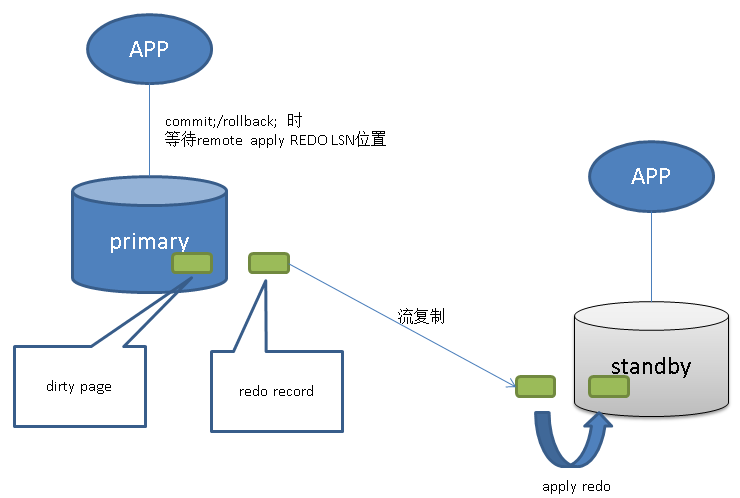

## PostgreSQL 9.6 同步多副本 与 remote_apply事务同步级别  
               
### 作者             
digoal              
              
### 日期            
2016-10-06             
              
### 标签            
PostgreSQL , 9.6 , 同步多副本 , remote_apply , 全同步    
              
----            
              
## 背景     
对于金融级的应用场景，2个副本通常是不够的，用户可能会需要多个副本。  
  
例如，一主4从，要求除了主以外，还需要2个同步的副本，其他可以为异步的副本。  
  
  
  
另一方面，我们在使用数据库时，为了扩展读的能力，读写分离是比较常见的用法。  
  
9.6以前的版本，同步复制是确保XLOG已经复制到备库，而不是已经在备库apply，虽然APPLY通常都很快，可能也在毫秒级别完成，但是以前没有apply级别的同步机制。  
  
例如，用户A往用户B的账户汇了一笔钱，同一时间用户B在异地马上要看到A汇过来的钱，这种异地、异库的读写分离场景，就需要主备事务级的严格一致，因此9.6的remote_apply就非常有效。   
  
  
  
还有一种场景，在主备切换时，要求备库快速激活成和主库一样的状态，也需要remote_apply级别的复制。  
  
以上是PostgreSQL 9.6在流复制方面的增强。  
  
## 同步多副本配置方法
参数配置如下  
  
synchronous_standby_names (string)  

支持两种写法  
```
num_sync ( standby_name [, ...] )  

standby_name [, ...]  
```
  
num_sync 数字，表示同步的副本数。  
  
没有写num_sync的格式兼容以前的配置，表示1个副本。    
  
standby_name是standby配置在recovery.conf中的application_name，可以使用*代替所有standby。  
  
例子  
```
2 (s1, s2, s3, s4)
```  
  
表示2个副本为同步standby，其他为异步standby。  
  
事物提交时，确保XLOG已同步到任意2个副本（前面两个是同步节点，后面2个是替补，当前面两个中任意的节点出问题，后面的会依次替补上）。  
  
手册说明  
```
Specifies a list of standby servers that can support synchronous replication, as described in Section 26.2.8. 

There will be one or more active synchronous standbys; 

transactions waiting for commit will be allowed to proceed after these standby servers confirm receipt of their data. 

The synchronous standbys will be those whose names appear earlier in this list, and that are both currently connected and streaming data in real-time 

(as shown by a state of streaming in the pg_stat_replication view). 

Other standby servers appearing later in this list represent potential synchronous standbys. 

If any of the current synchronous standbys disconnects for whatever reason, it will be replaced immediately with the next-highest-priority standby. 

Specifying more than one standby name can allow very high availability.

This parameter specifies a list of standby servers using either of the following syntaxes:

num_sync ( standby_name [, ...] )

standby_name [, ...]

where num_sync is the number of synchronous standbys that transactions need to wait for replies from, and standby_name is the name of a standby server. 

For example, a setting of 3 (s1, s2, s3, s4) makes transaction commits wait until their WAL records are received by three higher-priority standbys chosen from standby servers s1, s2, s3 and s4.

The second syntax was used before PostgreSQL version 9.6 and is still supported. 

It's the same as the first syntax with num_sync equal to 1. 

For example, 1 (s1, s2) and s1, s2 have the same meaning: 

either s1 or s2 is chosen as a synchronous standby.

The name of a standby server for this purpose is the application_name setting of the standby, as set in the primary_conninfo of the standby's WAL receiver. 

There is no mechanism to enforce uniqueness. 

In case of duplicates one of the matching standbys will be considered as higher priority, though exactly which one is indeterminate. 

The special entry * matches any application_name, including the default application name of walreceiver.

Note: Each standby_name should have the form of a valid SQL identifier, unless it is *. 

You can use double-quoting if necessary. 

But note that standby_names are compared to standby application names case-insensitively, whether double-quoted or not.

If no synchronous standby names are specified here, then synchronous replication is not enabled and transaction commits will not wait for replication. 

This is the default configuration. 

Even when synchronous replication is enabled, individual transactions can be configured not to wait for replication by setting the synchronous_commit parameter to local or off.  
```
  
注意standby_name只是指定了同步的standby节点，而事务级别还有一个开关为synchronous_commit，通过配置synchronous_commit用于控制事务的同步级别，可以是异步的，也可以是同步的。  
  
对于可靠性要求高的，可以配置为同步，否则可以为了性能配置为异步。  
  
## 事务同步级别说明  
通过参数synchronous_commit (enum)配置事务的同步级别。  
  
如果要配置事务或者会话级别的参数，通过以下语法  
```
SET [ SESSION | LOCAL ] configuration_parameter { TO | = } { value | 'value' | DEFAULT }
```
  
也就是说，用户可以根据实际的业务需求，对不同的事务，设置不同的同步级别。  
  
目前支持的同步级别如下  
```
事务提交或回滚时，会产生一笔事务结束的commit/rollback redo record，在REDO的地址系统中，用LSN表示。  
  
on,     
    事务commit或rollback时，等待其redo在primary、以及同步standby(s)已持久化（>=其lsn）。  
    
remote_apply,      
    事务commit或rollback时，等待其redo在primary、以及同步standby(s)已持久化（>=其lsn）。 并且其redo在同步standby(s)已apply（>=其lsn）。    
  
remote_write, 
    事务commit或rollback时，等待其redo在primary已持久化;  其redo在同步standby(s)已调用write接口(写到OS, 但是还没有调用持久化接口如fsync)（>=其lsn）。    
  
local, 
    事务commit或rollback时，等待其redo在primary已持久化;

off
    事务commit或rollback时，等待其redo在primary已写入wal buffer，不需要等待其持久化;
```
  
手册说明  
```
synchronous_commit (enum)

Specifies whether transaction commit will wait for WAL records to be written to disk before the command returns a "success" indication to the client. 

Valid values are on, remote_apply, remote_write, local, and off. The default, and safe, setting is on. 

When off, there can be a delay between when success is reported to the client and when the transaction is really guaranteed to be safe against a server crash. 

(The maximum delay is three times wal_writer_delay.) 

Unlike fsync, setting this parameter to off does not create any risk of database inconsistency: 

an operating system or database crash might result in some recent allegedly-committed transactions being lost, but the database state will be just the same as if those transactions had been aborted cleanly. 

So, turning synchronous_commit off can be a useful alternative when performance is more important than exact certainty about the durability of a transaction. 

For more discussion see Section 30.3.

If synchronous_standby_names is non-empty, this parameter also controls whether or not transaction commits will wait for their WAL records to be replicated to the standby server(s). 

When set to on, commits will wait until replies from the current synchronous standby(s) indicate they have received the commit record of the transaction and flushed it to disk. 

This ensures the transaction will not be lost unless both the primary and all synchronous standbys suffer corruption of their database storage. 

When set to remote_apply, commits will wait until replies from the current synchronous standby(s) indicate they have received the commit record of the transaction and applied it, 

so that it has become visible to queries on the standby(s). 

When set to remote_write, commits will wait until replies from the current synchronous standby(s) indicate they have received the commit record of the transaction and written it out to their operating system.

This setting is sufficient to ensure data preservation even if a standby instance of PostgreSQL were to crash, 

but not if the standby suffers an operating-system-level crash, since the data has not necessarily reached stable storage on the standby. 

Finally, the setting local causes commits to wait for local flush to disk, but not for replication. 

This is not usually desirable when synchronous replication is in use, but is provided for completeness.

If synchronous_standby_names is empty, the settings on, remote_apply, remote_write and local all provide the same synchronization level: 

transaction commits only wait for local flush to disk.

This parameter can be changed at any time; the behavior for any one transaction is determined by the setting in effect when it commits. 

It is therefore possible, and useful, to have some transactions commit synchronously and others asynchronously. 

For example, to make a single multistatement transaction commit asynchronously when the default is the opposite, issue SET LOCAL synchronous_commit TO OFF within the transaction.
```
  
## remote_apply事务同步级别配置方法
通过参数synchronous_commit (enum)配置事务的同步级别。  
  
如果要配置事务或者会话级别的参数，通过以下语法  
```
SET [ SESSION | LOCAL ] configuration_parameter { TO | = } { value | 'value' | DEFAULT }
```
  
## 小结
1\. 可靠性  
  
结合synchronous_standby_names与synchronous_commit的设置，可以实现非常灵活的事务级别可靠性的要求。  
  
2\. 读写分离的读一致性保证  
  
当synchronous_commit=remote_apply时，这个事务产生的REDO必须要在sync standby(s)已apply，才返回给客户端事务结束。  
  
这类事务，事务结束后发起的读请求，在primary以及sync standby可以做到读写完全一致。  
  
牺牲写事务的RT，获得在多借点的读事务的完全一致。  
  
3\. 切换时延  
  
当设置了synchronous_commit=remote_apply事务同步复制级别时，可以降低切换延迟。  
  
备库在激活时，不需要apply redo，可以迅速的激活成为主库。  
  
          
      
  
<a rel="nofollow" href="http://info.flagcounter.com/h9V1"  ></a>  
  
  
  
  
  
  
## [digoal's 大量PostgreSQL文章入口](https://github.com/digoal/blog/blob/master/README.md "22709685feb7cab07d30f30387f0a9ae")
  
