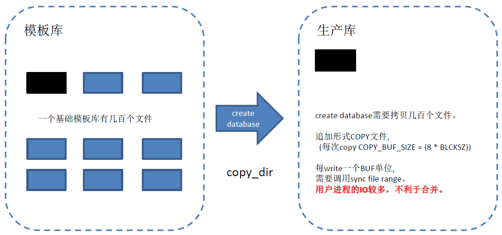

## PostgreSQL 9.6 平滑fsync, write原理浅析  
               
### 作者             
digoal              
              
### 日期            
2016-10-06             
              
### 标签            
PostgreSQL , 9.6 , 平滑 fsync , write , smooth fsync       
              
----            
              
## 背景   
汽车换挡是否平顺，通常取决于档位数，或者换挡技术。  
  
档位数越多，换挡时感觉会约平顺，档位数较少的情况下，换挡可能会有比较明显的顿挫感觉。  
  
数据库也一样，有些时候可能就会出现卡顿的现象，比如尖锐(堆积)的IO需求时。  
  
本文将给大家介绍9.6在fsync, write方面的平顺性改进，减少尖锐的IO需求。  
  
数据库为了保证数据可靠性，同时还要保证好的读写性能，以及读写的一致性，经过多年的发展，REDO日志，shared buffer基本已经成为数据库的标配。    
  
为了保证数据的可靠性，通常需要在将dirty page刷盘前，保证其REDO先刷盘，然后再通过LRU算法异步的老化shared buffer中的dirty page。  
  
为了保证好的读写性能，通常会需要shared buffer，写先落在shared buffer中，而不是直接同步修改数据页，因为数据页很离散。 数据库会把把离散的IO转换成顺序的REDO IO。    
  
那么问题来了，什么时候会调用fsync，什么时候会调用write呢？    
  
为什么9.6会需要优化平滑的fsync, write呢？    
  
## 数据库哪些场合调用fsync,write
### write
调用write的地方较多，我举一些非常重度的write场景，也是9.6重点优化的地方。  
  
1\. shared buffer  
  
bgwriter后台进程会将shared buffer中的脏页根据设置的唤醒时间，老化算法，写调度设置，将老化的dirty page写到操作系统。  (调用系统的write接口)  。   
  
backend process 进程，当请求shared buffer中的page时，如果没有足够的空闲page则会主动触发与bgwriter一样的操作，将老化的dirty page写到操作系统。  (调用系统的write接口)  。   
  
2\. wal buffer  
  
walwriter后台进程，将wal buffer中的脏页根据设置的唤醒时间，将wal buffer中的dirty page写到操作系统。   (调用系统的write接口)  。    
  
注意walwriter的fsync接口是可配置的，有buffer writer也有direct IO。  如果配置了direct io则直接落盘，不会写到操作系统的dirty page。    
  
#### 大内存主机隐藏的write问题
因为write实际上是写到了操作系统中，操作系统再调度将脏页落盘。  
  
操作系统调度刷脏页涉及到几个内核参数，同时还涉及到文件系统。  
  
```
vm.dirty_background_ratio = 10  # 表示当脏页比例达到了内存的10%，系统触发background flush线程刷脏页
vm.dirty_ratio = 20  # 当脏页比例达到20%，用户进程在调用write时，会触发flush磁盘的操作。  
vm.dirty_writeback_centisecs = 50  #  background flush线程的唤醒间隔(单位：百分之一秒)
vm.dirty_expire_centisecs = 6000  # background flush线程将存活时间超过该值的脏页刷盘（类似LRU）(单位：百分之一秒)
```
  
如果系统内存非常大，当触发后台线程刷脏页时，可能需要刷很多脏页，导致尖锐的IO需求。  
  
因此，我们可以通过修改内核参数达到削尖的目的。  
```
vm.dirty_background_bytes = 102400000  # 当脏页数达到了100MB，系统触发background flush线程刷脏页
```
  
但是这样设置可能还不够，因为数据库是可以并发操作的（wal writer, bgwriter, backend processes都可能并发的调用write），也就是说高峰时产生脏页的速度可能远远大于操作系统后台线程flush的速度。  
  
因此这种情况下os dirty page还是可能堆积，爆发尖锐的IO需求。  
  
  
### fsync
1\. create database  
  
创建数据库时，需要COPY 模板库DIR，每个文件COPY一部分后，会调用sync_file_range，最后调用fsync持久化。  
  
  
  
如果模板库文件数多，或者文件很大，可能导致产生较多的os dirty page。  
  
2\. checkpoint  
  
2\.1 首先标记shared buffer中的脏页   
  
2\.2 对已标记为脏页的PAGE，调用write  
  
如果shared buffer很大，并且业务形态导致数据库产生脏页速度很快的话，检查点会瞬间产生很多的os dirty page。  
  
2\.3 对相关的fd，调用fsync，持久化  
  
数据库检查点进程调用fsync，如果OS后台线程没有将检查点过程中write出去的脏页落盘，数据库检查点进程fsync会产生大量的刷盘IO。  
  
3\. wal writer   
  
wal writer会根据配置的fsync系统调用方法、调度间隔，将wal buffer中的数据刷到XLOG文件。    
  
如果wal buffer配置较大，同时数据库高并发的产生大量的REDO，则WAL writer也会产生大量的写盘IO。  
  
#### fsync隐藏的问题
1\. 如果模板库文件数多，或者文件很大，create database可能导致瞬间产生较多的os dirty page，在文件write完后，调用fsync导致大量的写盘IO。  
  
2\. 如果shared buffer很大，并且业务形态导致数据库产生脏页速度很快的话，检查点会瞬间产生很多的os dirty page。  
  
3\. 数据库检查点进程调用fsync，如果OS后台线程没有将检查点过程中write出去的脏页落盘，数据库检查点进程fsync会产生大量的刷盘IO。  
  
4\. 如果wal buffer配置较大，同时数据库高并发的产生大量的REDO，则WAL writer也会产生大量的写盘IO。    
  
### 尖锐IO需求问题分析
前面分析了数据库write, fsync在特定的场景（通常是写非常重的场景）中，可能导致大量的IO需求。  
  
这些需求其实是因为数据库为了提高性能，大量的时候了BUFFER，并且没有很好的处理BUFFER堆积，导致蜂拥而至的写盘IO请求。  
  
通过配置OS的backend flush线程的调度参数，可以缓解，但是不能彻底根治（无法抵御高并发的写，有点像三英占吕布的感觉，吕布再强也干不过高并发的写操作产生的os dirty page）。  
  
那么9.6是如何改进的呢？  
    
## 9.6平滑fsync,write优化
1\. 新增 sync_file_range 异步写的调度策略
```
Where feasible, trigger kernel writeback after a configurable number of writes, to prevent accumulation of dirty data in kernel disk buffers (Fabien Coelho, Andres Freund)

PostgreSQL writes data to the kernel's disk cache, from where it will be flushed to physical storage in due time. 

Many operating systems are not smart about managing this and allow large amounts of dirty data to accumulate before deciding to flush it all at once, 

causing long delays for new I/O requests until the flushing finishes. 

This change attempts to alleviate this problem by explicitly requesting data flushes after a configurable interval. 

On Linux, sync_file_range() is used for this purpose, and the feature is on by default on Linux because that function has few downsides. 

This flushing capability is also available on other platforms if they have msync() or posix_fadvise(), 

but those interfaces have some undesirable side-effects so the feature is disabled by default on non-Linux platforms.

The new configuration parameters backend_flush_after, bgwriter_flush_after, checkpoint_flush_after, and wal_writer_flush_after control this behavior.
```
  
通过以下4个参数，控制这4中进程的write操作  
```
backend_flush_after,  （单位：BLCKSZ ）
    当某backend process write dirty page的数量超过配置阈值时，触发调用OS sync_file_range，告诉os backend flush 线程异步刷盘。  
    从而削减os dirty page堆积。  

bgwriter_flush_after,   （单位：BLCKSZ ）
    当bgwriter process write dirty page的数量超过配置阈值时，触发调用OS sync_file_range，告诉os backend flush 线程异步刷盘。  
    从而削减os dirty page堆积。  

checkpoint_flush_after,   （单位：BLCKSZ ）
    当checkpointer process write dirty page的数量超过配置阈值时，触发调用OS sync_file_range，告诉os backend flush 线程异步刷盘。  
    从而削减os dirty page堆积。  

wal_writer_flush_after  （单位：size）  
    当wal writer process write dirty page的数量超过配置阈值时，触发调用OS sync_file_range，告诉os backend flush 线程异步刷盘。  
    从而削减os dirty page堆积。  
```
  
9.6以前的版本，我们可以认为他们是没有克制的滥用write调用，高峰时比较容易出现os backend flush线程跟不上的节奏。  
  
9.6改成了有节制的使用write，即每隔一段，会提醒后台线程刷脏页。  
  
但是由于使用的是sync_file_range的异步接口，问题可能不能完全解决，再改进一下，当os dirty page超过多少的时候，触发sync_file_range的同步调用可能更好(起到抑制产生脏页的速度的左右)。   
  
2\. 检查点write属于同一个fd的dirty page时，排序后再write，从而降低离散的IO。  
```
Perform checkpoint writes in sorted order (Fabien Coelho, Andres Freund)

Previously, checkpoints wrote out dirty pages in whatever order they happen to appear in shared buffers, which usually is nearly random. 

That performs poorly, especially on rotating media. 

This change causes checkpoint-driven writes to be done in order by file and block number, and to be balanced across tablespaces.  
```
  
## 代码剖析参考
[《PostgreSQL 9.6 检查点柔性优化(SYNC_FILE_RANGE) - 在单机多实例下的IO Hang问题浅析与优化》](../201609/20160928_01.md)  
   
src/backend/storage/file/fd.c  
```
/*
 * pg_flush_data --- advise OS that the described dirty data should be flushed
 *
 * offset of 0 with nbytes 0 means that the entire file should be flushed;
 * in this case, this function may have side-effects on the file's
 * seek position!
 */
void
pg_flush_data(int fd, off_t offset, off_t nbytes)
{
...
                /*
                 * sync_file_range(SYNC_FILE_RANGE_WRITE), currently linux specific,
                 * tells the OS that writeback for the specified blocks should be
                 * started, but that we don't want to wait for completion.  Note that
                 * this call might block if too much dirty data exists in the range.
                 * This is the preferable method on OSs supporting it, as it works
                 * reliably when available (contrast to msync()) and doesn't flush out
                 * clean data (like FADV_DONTNEED).
                 */
                rc = sync_file_range(fd, offset, nbytes,
                                                         SYNC_FILE_RANGE_WRITE);
```
  
```
NAME
       sync_file_range - sync a file segment with disk
DESCRIPTION
       sync_file_range() permits fine control when synchronising the open file referred to by the file descriptor fd with disk.

       offset  is the starting byte of the file range to be synchronised.  nbytes specifies the length of the range to be synchronised, in bytes; if nbytes is zero, then all bytes from offset through to the end of
       file are synchronised.  Synchronisation is in units of the system page size: offset is rounded down to a page boundary; (offset+nbytes-1) is rounded up to a page boundary.

       The flags bit-mask argument can include any of the following values:

       SYNC_FILE_RANGE_WAIT_BEFORE
              Wait upon write-out of all pages in the specified range that have already been submitted to the device driver for write-out before performing any write.

       SYNC_FILE_RANGE_WRITE
              Initiate write-out of all dirty pages in the specified range which are not presently submitted write-out.

       SYNC_FILE_RANGE_WAIT_AFTER
              Wait upon write-out of all pages in the range after performing any write.

       Specifying flags as 0 is permitted, as a no-op.

NOTES
       None of these operations write out the file’s metadata.  Therefore, unless the application is strictly performing overwrites of already-instantiated disk blocks, there are no guarantees that the  data  will
       be available after a crash.

       SYNC_FILE_RANGE_WAIT_BEFORE and SYNC_FILE_RANGE_WAIT_AFTER will detect any I/O errors or ENOSPC conditions and will return these to the caller.

       Useful combinations of the flags bits are:

       SYNC_FILE_RANGE_WAIT_BEFORE | SYNC_FILE_RANGE_WRITE
              Ensures that all pages in the specified range which were dirty when sync_file_range() was called are placed under write-out.  This is a start-write-for-data-integrity operation.

       SYNC_FILE_RANGE_WRITE
              Start  write-out  of  all dirty pages in the specified range which are not presently under write-out.  This is an asynchronous flush-to-disk operation.  This is not suitable for data integrity opera-
              tions.

       SYNC_FILE_RANGE_WAIT_BEFORE (or SYNC_FILE_RANGE_WAIT_AFTER)
              Wait for completion of write-out of all pages in the specified range.  This can be used after an earlier SYNC_FILE_RANGE_WAIT_BEFORE | SYNC_FILE_RANGE_WRITE operation to wait for completion  of  that
              operation, and obtain its result.

       SYNC_FILE_RANGE_WAIT_BEFORE | SYNC_FILE_RANGE_WRITE | SYNC_FILE_RANGE_WAIT_AFTER
              This is a traditional fdatasync(2) operation.  It is a write-for-data-integrity operation that will ensure that all pages in the specified range which were dirty when sync_file_range() was called are
              committed to disk.
```
    
## 参数详解
1\. backend_flush_after (integer)  
```
Whenever more than backend_flush_after bytes have been written by a single backend, attempt to force the OS to issue these writes to the underlying storage. 

Doing so will limit the amount of dirty data in the kernel's page cache, reducing the likelihood of stalls when an fsync is issued at the end of a checkpoint, or when the OS writes data back in larger batches in the background. 

Often that will result in greatly reduced transaction latency, but there also are some cases, especially with workloads that are bigger than shared_buffers, but smaller than the OS's page cache, where performance might degrade. This setting may have no effect on some platforms. 

The valid range is between 0, which disables controlled writeback, and 2MB. The default is 0 (i.e. no flush control). 
(Non-default values of BLCKSZ change the maximum.)
```
  
2\. bgwriter_flush_after (integer)    
```
Whenever more than bgwriter_flush_after bytes have been written by the bgwriter, attempt to force the OS to issue these writes to the underlying storage. 

Doing so will limit the amount of dirty data in the kernel's page cache, reducing the likelihood of stalls when an fsync is issued at the end of a checkpoint, or when the OS writes data back in larger batches in the background. 

Often that will result in greatly reduced transaction latency, but there also are some cases, especially with workloads that are bigger than shared_buffers, but smaller than the OS's page cache, where performance might degrade. 

This setting may have no effect on some platforms. 

The valid range is between 0, which disables controlled writeback, and 2MB. 

The default is 512kB on Linux, 0 elsewhere. (Non-default values of BLCKSZ change the default and maximum.) 

This parameter can only be set in the postgresql.conf file or on the server command line.
```
  
3\. checkpoint_flush_after (integer)  
```
Whenever more than checkpoint_flush_after bytes have been written while performing a checkpoint, attempt to force the OS to issue these writes to the underlying storage. 

Doing so will limit the amount of dirty data in the kernel's page cache, reducing the likelihood of stalls when an fsync is issued at the end of the checkpoint, or when the OS writes data back in larger batches in the background. 

Often that will result in greatly reduced transaction latency, but there also are some cases, especially with workloads that are bigger than shared_buffers, but smaller than the OS's page cache, where performance might degrade. 

This setting may have no effect on some platforms. The valid range is between 0, which disables controlled writeback, and 2MB. 

The default is 256kB on Linux, 0 elsewhere. (Non-default values of BLCKSZ change the default and maximum.) 

This parameter can only be set in the postgresql.conf file or on the server command line.
```
  
4\. wal_writer_flush_after (integer)  
```
Specifies how often the WAL writer flushes WAL. 

In case the last flush happened less than wal_writer_delay milliseconds ago and less than wal_writer_flush_after bytes of WAL have been produced since, WAL is only written to the OS, not flushed to disk. 

If wal_writer_flush_after is set to 0 WAL is flushed every time the WAL writer has written WAL. 

The default is 1MB. 

This parameter can only be set in the postgresql.conf file or on the server command line.
```
  
   
          
      
  
<a rel="nofollow" href="http://info.flagcounter.com/h9V1"  ></a>  
  
  
  
  
  
  
## [digoal's 大量PostgreSQL文章入口](https://github.com/digoal/blog/blob/master/README.md "22709685feb7cab07d30f30387f0a9ae")
  
