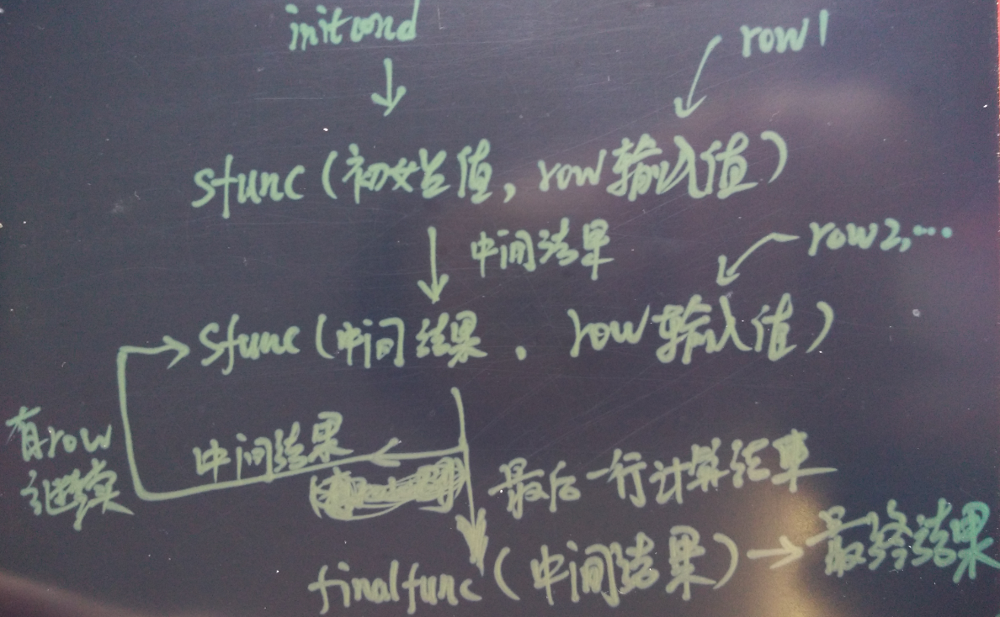
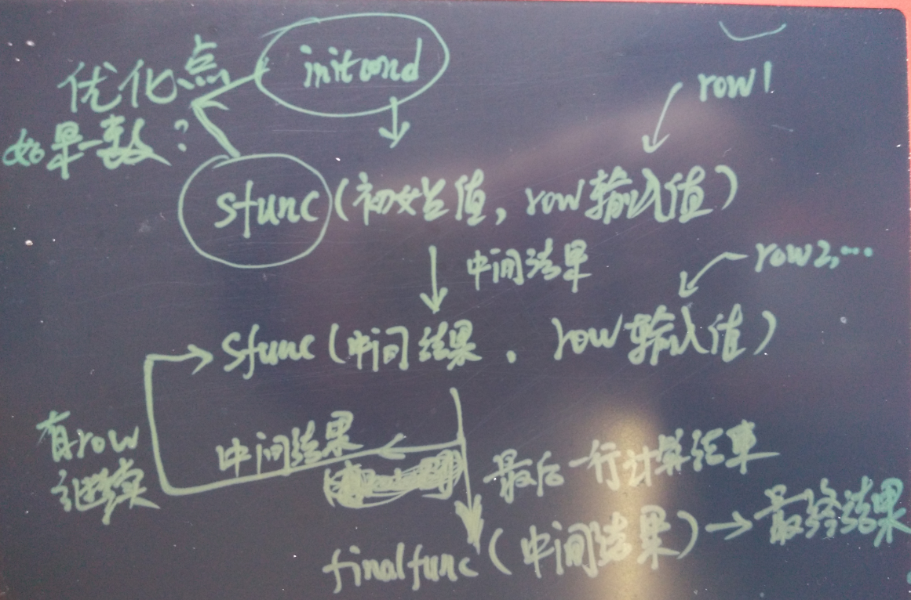
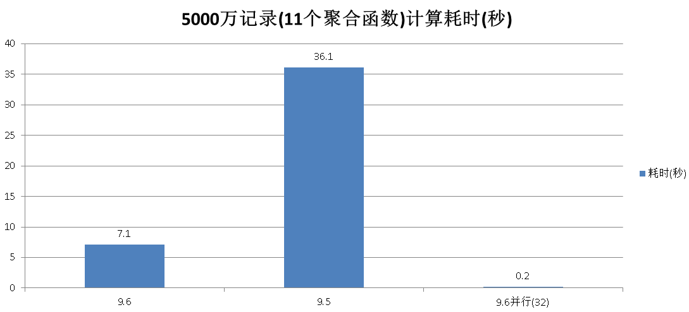

## PostgreSQL 9.6 内核优化之 聚合代码优化OP复用浅析  
               
### 作者             
digoal              
              
### 日期            
2016-10-08             
              
### 标签            
PostgreSQL , 9.6 , 内核优化 , 聚合代码优化 , OP复用     
              
----            
              
## 背景   
聚合操作指将分组的数据聚合为一个结果输出。   
  
聚合通常用在统计应用中，例如统计分组的最大值，最小值，记录数，平均值，方差，截距，相关性。  
  
聚合也可能被用于文本分析或者图像分析等，例如最佳相似度，行列变换，聚合为数组或JSON，图像堆叠等。    
  
因此聚合通常需要启动值，行的处理，以及结果的格式转换3个过程。  
  
PostgreSQL的聚合也包含了以上三个过程，创建一个聚合函数的语法如下：  
```
CREATE AGGREGATE name ( [ argmode ] [ argname ] arg_data_type [ , ... ] ) (
    SFUNC = sfunc,
    STYPE = state_data_type
    [ , SSPACE = state_data_size ]
    [ , FINALFUNC = ffunc ]
    [ , FINALFUNC_EXTRA ]
    [ , COMBINEFUNC = combinefunc ]
    [ , SERIALFUNC = serialfunc ]
    [ , DESERIALFUNC = deserialfunc ]
    [ , INITCOND = initial_condition ]
    [ , MSFUNC = msfunc ]
    [ , MINVFUNC = minvfunc ]
    [ , MSTYPE = mstate_data_type ]
    [ , MSSPACE = mstate_data_size ]
    [ , MFINALFUNC = mffunc ]
    [ , MFINALFUNC_EXTRA ]
    [ , MINITCOND = minitial_condition ]
    [ , SORTOP = sort_operator ]
    [ , PARALLEL = { SAFE | RESTRICTED | UNSAFE } ]
)
```
  
例子  
```
CREATE AGGREGATE avg (float8)
(
    sfunc = float8_accum,
    stype = float8[],
    finalfunc = float8_avg,
    initcond = '{0,0,0}'
);
```
  
参考  
  
https://www.postgresql.org/docs/9.6/static/xaggr.html  
  
https://www.postgresql.org/docs/9.6/static/sql-createaggregate.html  
  
PostgreSQL 聚合处理流程如图  
  
  
  
```
1. 使用initcond指定internal-state的初始值，没有则为空。    

2. 每条记录(作为next-data-values输入)，调用 sfunc( internal-state, next-data-values ) ---> next-internal-state  
   输出的结果作为中间结果继续调用sfunc

3. ffunc( internal-state ) ---> aggregate-value
   可选，作为结果转换使用
```
  
## 9.6 聚合OP优化
  
  
如果initcond与sfunc一致，在同一个聚合分组内，sfunc只需要计算一遍所有记录，而不需要计算多遍。  
  
https://git.postgresql.org/gitweb/?p=postgresql.git;a=commit;h=804163bc25e979fcd91b02e58fa2d1c6b587cc65  
```
Share transition state between different aggregates when possible.

If there are two different aggregates in the query with same inputs, 
and the aggregates have the same initial condition and transition function,
only calculate the state value once, and only call the final functionsseparately. 
For example, AVG(x) and SUM(x) aggregates have the same transition function, which accumulates the sum and number of input tuples.
For a query like "SELECT AVG(x), SUM(x) FROM x", we can therefore accumulate the state function only once, which gives a nice speedup.

David Rowley, reviewed and edited by me.
```
  
我们可以通过以下SQL查看可以共享OP的聚合函数，rank一致的都可以共享。  
```
postgres=# select rank() over (partition by 1 order by aggtransfn,agginitval),
           row_number() over (partition by aggtransfn,agginitval order by aggfnoid) rn,
           aggfnoid,aggtransfn,agginitval from pg_aggregate ;
```
  
```
 rank | rn |          aggfnoid          |          aggtransfn          |     agginitval      
------|----|----------------------------|------------------------------|---------------------
    1 |  1 | pg_catalog.sum             | float4pl                     | none
    2 |  1 | pg_catalog.avg             | float4_accum                 | {0,0,0}
    2 |  2 | pg_catalog.variance        | float4_accum                 | {0,0,0}
    2 |  3 | pg_catalog.stddev          | float4_accum                 | {0,0,0}
    2 |  4 | pg_catalog.var_samp        | float4_accum                 | {0,0,0}
    2 |  5 | pg_catalog.stddev_samp     | float4_accum                 | {0,0,0}
    2 |  6 | pg_catalog.var_pop         | float4_accum                 | {0,0,0}
    2 |  7 | pg_catalog.stddev_pop      | float4_accum                 | {0,0,0}
    9 |  1 | pg_catalog.max             | float4larger                 | none
   10 |  1 | pg_catalog.min             | float4smaller                | none
   11 |  1 | pg_catalog.sum             | float8pl                     | none
   12 |  1 | pg_catalog.avg             | float8_accum                 | {0,0,0}
   12 |  2 | pg_catalog.variance        | float8_accum                 | {0,0,0}
   12 |  3 | pg_catalog.stddev          | float8_accum                 | {0,0,0}
   12 |  4 | pg_catalog.var_samp        | float8_accum                 | {0,0,0}
   12 |  5 | pg_catalog.stddev_samp     | float8_accum                 | {0,0,0}
   12 |  6 | pg_catalog.var_pop         | float8_accum                 | {0,0,0}
   12 |  7 | pg_catalog.stddev_pop      | float8_accum                 | {0,0,0}
   19 |  1 | pg_catalog.max             | float8larger                 | none
   20 |  1 | pg_catalog.min             | float8smaller                | none
   21 |  1 | pg_catalog.max             | text_larger                  | none
   22 |  1 | pg_catalog.min             | text_smaller                 | none
   23 |  1 | pg_catalog.max             | array_larger                 | none
   24 |  1 | pg_catalog.min             | array_smaller                | none
   25 |  1 | pg_catalog.max             | int4larger                   | none
   25 |  2 | pg_catalog.max             | int4larger                   | none
   27 |  1 | pg_catalog.min             | int4smaller                  | none
   27 |  2 | pg_catalog.min             | int4smaller                  | none
   29 |  1 | pg_catalog.max             | int2larger                   | none
   30 |  1 | pg_catalog.min             | int2smaller                  | none
   31 |  1 | pg_catalog.sum             | cash_pl                      | none
   32 |  1 | pg_catalog.max             | cashlarger                   | none
   33 |  1 | pg_catalog.min             | cashsmaller                  | none
   34 |  1 | pg_catalog.max             | bpchar_larger                | none
   35 |  1 | pg_catalog.min             | bpchar_smaller               | none
   36 |  1 | pg_catalog.max             | date_larger                  | none
   37 |  1 | pg_catalog.min             | date_smaller                 | none
   38 |  1 | pg_catalog.sum             | interval_pl                  | none
   39 |  1 | pg_catalog.min             | timestamptz_smaller          | none
   40 |  1 | pg_catalog.max             | timestamptz_larger           | none
   41 |  1 | pg_catalog.min             | interval_smaller             | none
   42 |  1 | pg_catalog.max             | interval_larger              | none
   43 |  1 | pg_catalog.count           | int8inc                      | 0
   44 |  1 | pg_catalog.max             | int8larger                   | none
   45 |  1 | pg_catalog.min             | int8smaller                  | none
   46 |  1 | pg_catalog.max             | time_larger                  | none
   47 |  1 | pg_catalog.min             | time_smaller                 | none
   48 |  1 | pg_catalog.max             | timetz_larger                | none
   49 |  1 | pg_catalog.min             | timetz_smaller               | none
   50 |  1 | pg_catalog.bit_and         | bitand                       | none
   51 |  1 | pg_catalog.bit_or          | bitor                        | none
   52 |  1 | pg_catalog.min             | numeric_smaller              | none
   53 |  1 | pg_catalog.max             | numeric_larger               | none
   54 |  1 | pg_catalog.variance        | numeric_accum                | none
   54 |  2 | pg_catalog.stddev          | numeric_accum                | none
   54 |  3 | pg_catalog.var_samp        | numeric_accum                | none
   54 |  4 | pg_catalog.stddev_samp     | numeric_accum                | none
   54 |  5 | pg_catalog.var_pop         | numeric_accum                | none
   54 |  6 | pg_catalog.stddev_pop      | numeric_accum                | none
   60 |  1 | pg_catalog.variance        | int2_accum                   | none
   60 |  2 | pg_catalog.stddev          | int2_accum                   | none
   60 |  3 | pg_catalog.var_samp        | int2_accum                   | none
   60 |  4 | pg_catalog.stddev_samp     | int2_accum                   | none
   60 |  5 | pg_catalog.var_pop         | int2_accum                   | none
   60 |  6 | pg_catalog.stddev_pop      | int2_accum                   | none
   66 |  1 | pg_catalog.variance        | int4_accum                   | none
   66 |  2 | pg_catalog.stddev          | int4_accum                   | none
   66 |  3 | pg_catalog.var_samp        | int4_accum                   | none
   66 |  4 | pg_catalog.stddev_samp     | int4_accum                   | none
   66 |  5 | pg_catalog.var_pop         | int4_accum                   | none
   66 |  6 | pg_catalog.stddev_pop      | int4_accum                   | none
   72 |  1 | pg_catalog.variance        | int8_accum                   | none
   72 |  2 | pg_catalog.stddev          | int8_accum                   | none
   72 |  3 | pg_catalog.var_samp        | int8_accum                   | none
   72 |  4 | pg_catalog.stddev_samp     | int8_accum                   | none
   72 |  5 | pg_catalog.var_pop         | int8_accum                   | none
   72 |  6 | pg_catalog.stddev_pop      | int8_accum                   | none
   78 |  1 | pg_catalog.sum             | int2_sum                     | none
   79 |  1 | pg_catalog.sum             | int4_sum                     | none
   80 |  1 | pg_catalog.avg             | interval_accum               | {0 second,0 second}
   81 |  1 | pg_catalog.bit_and         | int2and                      | none
   82 |  1 | pg_catalog.bit_or          | int2or                       | none
   83 |  1 | pg_catalog.bit_and         | int4and                      | none
   84 |  1 | pg_catalog.bit_or          | int4or                       | none
   85 |  1 | pg_catalog.bit_and         | int8and                      | none
   86 |  1 | pg_catalog.bit_or          | int8or                       | none
   87 |  1 | pg_catalog.avg             | int2_avg_accum               | {0,0}
   88 |  1 | pg_catalog.avg             | int4_avg_accum               | {0,0}
   89 |  1 | pg_catalog.max             | oidlarger                    | none
   90 |  1 | pg_catalog.min             | oidsmaller                   | none
   91 |  1 | pg_catalog.min             | timestamp_smaller            | none
   92 |  1 | pg_catalog.max             | timestamp_larger             | none
   93 |  1 | pg_catalog.array_agg       | array_agg_transfn            | none
   94 |  1 | bool_and                   | booland_statefunc            | none
   94 |  2 | every                      | booland_statefunc            | none
   96 |  1 | bool_or                    | boolor_statefunc             | none
   97 |  1 | pg_catalog.avg             | int8_avg_accum               | none
   97 |  2 | pg_catalog.sum             | int8_avg_accum               | none
   99 |  1 | pg_catalog.max             | tidlarger                    | none
  100 |  1 | pg_catalog.min             | tidsmaller                   | none
  101 |  1 | pg_catalog.count           | int8inc_any                  | 0
  102 |  1 | regr_count                 | int8inc_float8_float8        | 0
  103 |  1 | regr_sxx                   | float8_regr_accum            | {0,0,0,0,0,0}
  103 |  2 | regr_syy                   | float8_regr_accum            | {0,0,0,0,0,0}
  103 |  3 | regr_sxy                   | float8_regr_accum            | {0,0,0,0,0,0}
  103 |  4 | regr_avgx                  | float8_regr_accum            | {0,0,0,0,0,0}
  103 |  5 | regr_avgy                  | float8_regr_accum            | {0,0,0,0,0,0}
  103 |  6 | regr_r2                    | float8_regr_accum            | {0,0,0,0,0,0}
  103 |  7 | regr_slope                 | float8_regr_accum            | {0,0,0,0,0,0}
  103 |  8 | regr_intercept             | float8_regr_accum            | {0,0,0,0,0,0}
  103 |  9 | covar_pop                  | float8_regr_accum            | {0,0,0,0,0,0}
  103 | 10 | covar_samp                 | float8_regr_accum            | {0,0,0,0,0,0}
  103 | 11 | corr                       | float8_regr_accum            | {0,0,0,0,0,0}
  114 |  1 | pg_catalog.avg             | numeric_avg_accum            | none
  114 |  2 | pg_catalog.sum             | numeric_avg_accum            | none
  116 |  1 | xmlagg                     | xmlconcat2                   | none
  117 |  1 | json_agg                   | json_agg_transfn             | none
  118 |  1 | json_object_agg            | json_object_agg_transfn      | none
  119 |  1 | jsonb_agg                  | jsonb_agg_transfn            | none
  120 |  1 | jsonb_object_agg           | jsonb_object_agg_transfn     | none
  121 |  1 | pg_catalog.min             | enum_smaller                 | none
  122 |  1 | pg_catalog.max             | enum_larger                  | none
  123 |  1 | pg_catalog.string_agg      | string_agg_transfn           | none
  124 |  1 | pg_catalog.string_agg      | bytea_string_agg_transfn     | none
  125 |  1 | pg_catalog.max             | network_larger               | none
  126 |  1 | pg_catalog.min             | network_smaller              | none
  127 |  1 | pg_catalog.percentile_disc | ordered_set_transition       | none
  127 |  2 | pg_catalog.percentile_cont | ordered_set_transition       | none
  127 |  3 | pg_catalog.percentile_cont | ordered_set_transition       | none
  127 |  4 | pg_catalog.percentile_disc | ordered_set_transition       | none
  127 |  5 | pg_catalog.percentile_cont | ordered_set_transition       | none
  127 |  6 | pg_catalog.percentile_cont | ordered_set_transition       | none
  127 |  7 | mode                       | ordered_set_transition       | none
  134 |  1 | pg_catalog.rank            | ordered_set_transition_multi | none
  134 |  2 | pg_catalog.percent_rank    | ordered_set_transition_multi | none
  134 |  3 | pg_catalog.cume_dist       | ordered_set_transition_multi | none
  134 |  4 | pg_catalog.dense_rank      | ordered_set_transition_multi | none
  138 |  1 | pg_catalog.array_agg       | array_agg_array_transfn      | none
```
  
我接下来抽取几个数据统计相关的，验证9.6的优化效果  
  
```
  103 |  1 | regr_sxx                   | float8_regr_accum            | {0,0,0,0,0,0}
  103 |  2 | regr_syy                   | float8_regr_accum            | {0,0,0,0,0,0}
  103 |  3 | regr_sxy                   | float8_regr_accum            | {0,0,0,0,0,0}
  103 |  4 | regr_avgx                  | float8_regr_accum            | {0,0,0,0,0,0}
  103 |  5 | regr_avgy                  | float8_regr_accum            | {0,0,0,0,0,0}
  103 |  6 | regr_r2                    | float8_regr_accum            | {0,0,0,0,0,0}
  103 |  7 | regr_slope                 | float8_regr_accum            | {0,0,0,0,0,0}
  103 |  8 | regr_intercept             | float8_regr_accum            | {0,0,0,0,0,0}
  103 |  9 | covar_pop                  | float8_regr_accum            | {0,0,0,0,0,0}
  103 | 10 | covar_samp                 | float8_regr_accum            | {0,0,0,0,0,0}
  103 | 11 | corr                       | float8_regr_accum            | {0,0,0,0,0,0}
```
  
这几个聚合函数的用法如下  
  
https://www.postgresql.org/docs/9.6/static/functions-aggregate.html  
  
Function |      Argument Type   | Return Type | Partial Mode |  Description
---|---|---|---|---
corr(Y, X)      | double precision |    double precision |      Yes |   correlation coefficient
covar_pop(Y, X) | double precision |    double precision |      Yes |   population covariance
covar_samp(Y, X) |      double precision |      double precision |      Yes |   sample covariance
regr_avgx(Y, X) |       double precision |      double precision |      Yes |   average of the independent variable (sum(X)/N)
regr_avgy(Y, X) |       double precision |      double precision |      Yes |   average of the dependent variable (sum(Y)/N)
regr_intercept(Y, X) |  double precision |      double precision |      Yes |   y-intercept of the least-squares-fit linear equation determined by the (X, Y) pairs
regr_r2(Y, X) | double precision |      double precision |      Yes |   square of the correlation coefficient
regr_slope(Y, X) |      double precision |      double precision |      Yes |   slope of the least-squares-fit linear equation determined by the (X, Y) pairs
regr_sxx(Y, X) |        double precision |      double precision |      Yes |   sum(X^2) - sum(X)^2/N ("sum of squares" of the independent variable)
regr_sxy(Y, X) |        double precision |      double precision |      Yes |   sum(X*Y) - sum(X) * sum(Y)/N ("sum of products" of independent times dependent variable)
regr_syy(Y, X) |        double precision |      double precision |      Yes |   sum(Y^2) - sum(Y)^2/N ("sum of squares" of the dependent variable)
  
## 对比测试
测试5000万条记录  
```
postgres=# create table agg_test(x float8, y float8);
postgres=# insert into agg_test select 10000*random(), 10000*random() from generate_series(1,50000000);
```

1\. 9.6 非并行  
聚合计算耗费了7.1秒  
```
postgres=# show max_parallel_workers_per_gather ;
 max_parallel_workers_per_gather 
---------------------------------
 0
(1 row)

postgres=# explain (analyze,verbose,timing,costs,buffers) select corr(y,x), covar_pop(y,x), covar_samp(y,x), regr_avgx(y,x), regr_avgy(y,x), regr_intercept(y,x), regr_r2(y,x), regr_slope(y,x), regr_sxx(y,x), regr_sxy(y,x), regr_syy(y,x) from agg_test ;
                                                                                            QUERY PLAN                                                                                            
--------------------------------------------------------------------------------------------------------------------------------------------------------------------------------------------------
 Aggregate  (cost=2145276.13..2145276.14 rows=1 width=88) (actual time=11703.472..11703.472 rows=1 loops=1)
   Output: corr(y, x), covar_pop(y, x), covar_samp(y, x), regr_avgx(y, x), regr_avgy(y, x), regr_intercept(y, x), regr_r2(y, x), regr_slope(y, x), regr_sxx(y, x), regr_sxy(y, x), regr_syy(y, x)
   Buffers: shared hit=270271
   ->  Seq Scan on public.agg_test  (cost=0.00..770272.36 rows=50000136 width=16) (actual time=0.010..4594.588 rows=50000000 loops=1)
         Output: x, y
         Buffers: shared hit=270271
 Planning time: 0.082 ms
 Execution time: 11703.541 ms
(8 rows)
```
  
2\. 9.5  
聚合计算耗费了36.1秒  
```
postgres=# explain (analyze,verbose,timing,costs,buffers) select corr(y,x), covar_pop(y,x), covar_samp(y,x), regr_avgx(y,x), regr_avgy(y,x), regr_intercept(y,x), regr_r2(y,x), regr_slope(y,x), regr_sxx(y,x), regr_sxy(y,x), regr_syy(y,x) from agg_test ;
                                                                                            QUERY PLAN                                                                                            
--------------------------------------------------------------------------------------------------------------------------------------------------------------------------------------------------
 Aggregate  (cost=2145276.13..2145276.14 rows=1 width=16) (actual time=40563.668..40563.669 rows=1 loops=1)
   Output: corr(y, x), covar_pop(y, x), covar_samp(y, x), regr_avgx(y, x), regr_avgy(y, x), regr_intercept(y, x), regr_r2(y, x), regr_slope(y, x), regr_sxx(y, x), regr_sxy(y, x), regr_syy(y, x)
   Buffers: shared hit=270271
   ->  Seq Scan on public.agg_test  (cost=0.00..770272.36 rows=50000136 width=16) (actual time=0.009..4481.032 rows=50000000 loops=1)
         Output: x, y
         Buffers: shared hit=270271
 Planning time: 0.063 ms
 Execution time: 40563.742 ms
(8 rows)
```
  
3\. 9.6 并行  
聚合计算约耗费0.2秒  
```
postgres=# set max_parallel_workers_per_gather =128;
postgres=# set force_parallel_mode =on;  
postgres=# alter table agg_test set (parallel_workers =32);
postgres=# explain (analyze,verbose,timing,costs,buffers) select corr(y,x), covar_pop(y,x), covar_samp(y,x), regr_avgx(y,x), regr_avgy(y,x), regr_intercept(y,x), regr_r2(y,x), regr_slope(y,x), regr_sxx(y,x), regr_sxy(y,x), regr_syy(y,x) from agg_test ;
                                                                                                                                                      QUERY PLAN                                                 

 Finalize Aggregate  (cost=329869.02..329869.03 rows=1 width=88) (actual time=456.718..456.718 rows=1 loops=1)
   Output: corr(y, x), covar_pop(y, x), covar_samp(y, x), regr_avgx(y, x), regr_avgy(y, x), regr_intercept(y, x), regr_r2(y, x), regr_slope(y, x), regr_sxx(y, x), regr_sxy(y, x), regr_syy(y, x)
   Buffers: shared hit=275071
   ->  Gather  (cost=329864.90..329868.11 rows=32 width=352) (actual time=456.567..456.612 rows=33 loops=1)
         Output: (PARTIAL corr(y, x)), (PARTIAL covar_pop(y, x)), (PARTIAL covar_samp(y, x)), (PARTIAL regr_avgx(y, x)), (PARTIAL regr_avgy(y, x)), (PARTIAL regr_intercept(y, x)), (PARTIAL regr_r2(y, x)), (PARTIAL regr_slope(y, x)), (PARTIAL regr_sxx(y, x)), (PARTIAL regr_sxy(y, x)), (PARTIAL regr_syy(y, x))
         Workers Planned: 32
         Workers Launched: 32
         Buffers: shared hit=275071
         ->  Partial Aggregate  (cost=328864.90..328864.91 rows=1 width=352) (actual time=451.769..451.769 rows=1 loops=33)
               Output: PARTIAL corr(y, x), PARTIAL covar_pop(y, x), PARTIAL covar_samp(y, x), PARTIAL regr_avgx(y, x), PARTIAL regr_avgy(y, x), PARTIAL regr_intercept(y, x), PARTIAL regr_r2(y, x), PARTIAL regr_slope(y, x), PARTIAL regr_sxx(y, x), PARTIAL regr_sxy(y, x), PARTIAL regr_syy(y, x)
               Buffers: shared hit=270655
               Worker 0: actual time=448.888..448.888 rows=1 loops=1
                 Buffers: shared hit=8265
               Worker 1: actual time=449.881..449.881 rows=1 loops=1
                 Buffers: shared hit=8357
               Worker 2: actual time=450.175..450.176 rows=1 loops=1
                 Buffers: shared hit=8295
               Worker 3: actual time=450.306..450.306 rows=1 loops=1
                 Buffers: shared hit=8357
               Worker 4: actual time=449.567..449.567 rows=1 loops=1
                 Buffers: shared hit=6844
               Worker 5: actual time=450.467..450.467 rows=1 loops=1
                 Buffers: shared hit=8360
               Worker 6: actual time=450.574..450.574 rows=1 loops=1
                 Buffers: shared hit=7898
               Worker 7: actual time=450.665..450.665 rows=1 loops=1
                 Buffers: shared hit=8397
               Worker 8: actual time=450.719..450.719 rows=1 loops=1
                 Buffers: shared hit=8084
               Worker 9: actual time=450.922..450.922 rows=1 loops=1
                 Buffers: shared hit=8405
               Worker 10: actual time=451.004..451.004 rows=1 loops=1
                 Buffers: shared hit=5421
               Worker 11: actual time=451.175..451.175 rows=1 loops=1
                 Buffers: shared hit=8431
               Worker 12: actual time=451.316..451.316 rows=1 loops=1
                 Buffers: shared hit=8276
               Worker 13: actual time=451.457..451.457 rows=1 loops=1
                 Buffers: shared hit=8431
               Worker 14: actual time=451.506..451.506 rows=1 loops=1
                 Buffers: shared hit=8163
               Worker 15: actual time=451.670..451.670 rows=1 loops=1
                 Buffers: shared hit=7959
               Worker 16: actual time=451.797..451.797 rows=1 loops=1
                 Buffers: shared hit=8428
               Worker 17: actual time=451.875..451.875 rows=1 loops=1
                 Buffers: shared hit=8265
               Worker 18: actual time=451.982..451.982 rows=1 loops=1
                 Buffers: shared hit=8444
               Worker 19: actual time=452.127..452.127 rows=1 loops=1
                 Buffers: shared hit=7717
               Worker 20: actual time=452.232..452.232 rows=1 loops=1
                 Buffers: shared hit=8450
               Worker 21: actual time=452.331..452.331 rows=1 loops=1
                 Buffers: shared hit=8304
               Worker 22: actual time=452.450..452.450 rows=1 loops=1
                 Buffers: shared hit=8455
               Worker 23: actual time=452.592..452.592 rows=1 loops=1
                 Buffers: shared hit=8367
               Worker 24: actual time=452.679..452.679 rows=1 loops=1
                 Buffers: shared hit=8460
               Worker 25: actual time=452.814..452.815 rows=1 loops=1
                 Buffers: shared hit=8445
               Worker 26: actual time=452.969..452.969 rows=1 loops=1
                 Buffers: shared hit=8465
               Worker 27: actual time=452.999..452.999 rows=1 loops=1
                 Buffers: shared hit=8454
               Worker 28: actual time=453.193..453.193 rows=1 loops=1
                 Buffers: shared hit=8462
               Worker 29: actual time=452.985..452.985 rows=1 loops=1
                 Buffers: shared hit=8437
               Worker 30: actual time=453.482..453.483 rows=1 loops=1
                 Buffers: shared hit=8348
               Worker 31: actual time=453.505..453.505 rows=1 loops=1
                 Buffers: shared hit=8182
               ->  Parallel Seq Scan on public.agg_test  (cost=0.00..285896.04 rows=1562504 width=16) (actual time=0.046..248.331 rows=1515152 loops=33)
                     Output: y, x
                     Buffers: shared hit=270655
                     Worker 0: actual time=0.058..247.983 rows=1526805 loops=1
                       Buffers: shared hit=8265
                     Worker 1: actual time=0.047..249.121 rows=1543825 loops=1
                       Buffers: shared hit=8357
                     Worker 2: actual time=0.047..249.206 rows=1532355 loops=1
                       Buffers: shared hit=8295
                     Worker 3: actual time=0.047..249.914 rows=1543825 loops=1
                       Buffers: shared hit=8357
                     Worker 4: actual time=0.069..244.072 rows=1263920 loops=1
                       Buffers: shared hit=6844
                     Worker 5: actual time=0.046..250.046 rows=1544380 loops=1
                       Buffers: shared hit=8360
                     Worker 6: actual time=0.047..247.860 rows=1458910 loops=1
                       Buffers: shared hit=7898
                     Worker 7: actual time=0.045..249.471 rows=1551225 loops=1
                       Buffers: shared hit=8397
                     Worker 8: actual time=0.047..247.850 rows=1493320 loops=1
                       Buffers: shared hit=8084
                     Worker 9: actual time=0.049..249.905 rows=1552705 loops=1
                       Buffers: shared hit=8405
                     Worker 10: actual time=0.048..240.578 rows=1000665 loops=1
                       Buffers: shared hit=5421
                     Worker 11: actual time=0.043..249.234 rows=1557515 loops=1
                       Buffers: shared hit=8431
                     Worker 12: actual time=0.044..248.830 rows=1528840 loops=1
                       Buffers: shared hit=8276
                     Worker 13: actual time=0.046..249.576 rows=1557515 loops=1
                       Buffers: shared hit=8431
                     Worker 14: actual time=0.043..248.819 rows=1507935 loops=1
                       Buffers: shared hit=8163
                     Worker 15: actual time=0.046..248.303 rows=1470195 loops=1
                       Buffers: shared hit=7959
                     Worker 16: actual time=0.045..249.997 rows=1556960 loops=1
                       Buffers: shared hit=8428
                     Worker 17: actual time=0.046..249.282 rows=1526805 loops=1
                       Buffers: shared hit=8265
                     Worker 18: actual time=0.043..249.849 rows=1559785 loops=1
                       Buffers: shared hit=8444
                     Worker 19: actual time=0.047..247.241 rows=1425425 loops=1
                       Buffers: shared hit=7717
                     Worker 20: actual time=0.043..250.134 rows=1561030 loops=1
                       Buffers: shared hit=8450
                     Worker 21: actual time=0.044..249.316 rows=1534020 loops=1
                       Buffers: shared hit=8304
                     Worker 22: actual time=0.043..250.169 rows=1561955 loops=1
                       Buffers: shared hit=8455
                     Worker 23: actual time=0.045..249.550 rows=1545675 loops=1
                       Buffers: shared hit=8367
                     Worker 24: actual time=0.044..250.062 rows=1562880 loops=1
                       Buffers: shared hit=8460
                     Worker 25: actual time=0.043..250.298 rows=1560105 loops=1
                       Buffers: shared hit=8445
                     Worker 26: actual time=0.043..249.939 rows=1563805 loops=1
                       Buffers: shared hit=8465
                     Worker 27: actual time=0.049..250.511 rows=1561770 loops=1
                       Buffers: shared hit=8454
                     Worker 28: actual time=0.045..250.523 rows=1563250 loops=1
                       Buffers: shared hit=8462
                     Worker 29: actual time=0.049..250.492 rows=1558625 loops=1
                       Buffers: shared hit=8437
                     Worker 30: actual time=0.053..247.131 rows=1542160 loops=1
                       Buffers: shared hit=8348
                     Worker 31: actual time=0.053..249.789 rows=1511450 loops=1
                       Buffers: shared hit=8182
 Planning time: 0.101 ms
 Execution time: 483.888 ms
(144 rows)
```
  
9.6的优化效果很明显，在没有使用并行的情况下，聚合操作已经有约5倍的性能提升。  
  
结果对比  
  
版本  |9.6|     9.5|    9.6并行(32)
---|---|---|---
5000万记录(11个聚合函数)耗时(秒)|       7.1|    36.1|   0.2
  
  
  
## 代码
https://git.postgresql.org/gitweb/?p=postgresql.git;a=commit;h=804163bc25e979fcd91b02e58fa2d1c6b587cc65  
  
涉及如下  
```
src/backend/executor/execQual.c         diff | blob | blame | history
src/backend/executor/nodeAgg.c          diff | blob | blame | history
src/backend/executor/nodeWindowAgg.c            diff | blob | blame | history
src/backend/parser/parse_agg.c          diff | blob | blame | history
src/include/nodes/execnodes.h           diff | blob | blame | history
src/include/parser/parse_agg.h          diff | blob | blame | history
src/test/regress/expected/aggregates.out                diff | blob | blame | history
src/test/regress/sql/aggregates.sql             diff | blob | blame | history
```
  
## 小结
在统计学中，大多数的统计算法的中间结果都是可以共用的，例如sum,avg; 方差,相关性,count,sum等运算;    
  
PostgreSQL 9.6很好的抓住了这样的特征，对初始条件一致，中间算法一致的聚合函数，在同一个分组中数据只需要计算一遍，大大降低了CPU的开销，提高了统计效率。  
  
这个思路与LLVM有一些神似的地方，不过LLVM的适用场景更广。  
  
          
      
  
<a rel="nofollow" href="http://info.flagcounter.com/h9V1"  ></a>  
  
  
  
  
  
  
## [digoal's 大量PostgreSQL文章入口](https://github.com/digoal/blog/blob/master/README.md "22709685feb7cab07d30f30387f0a9ae")
  
