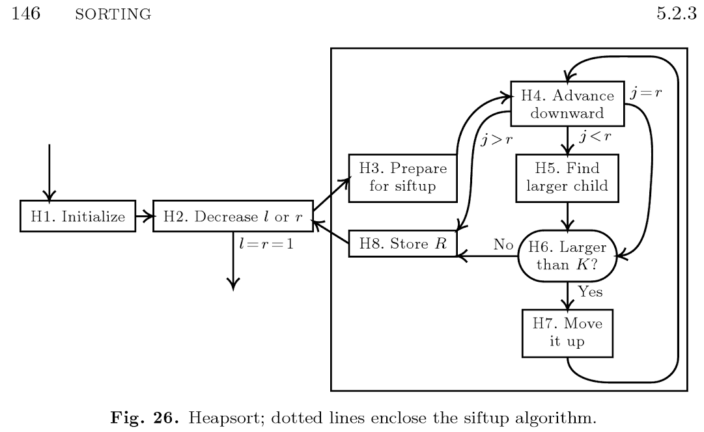
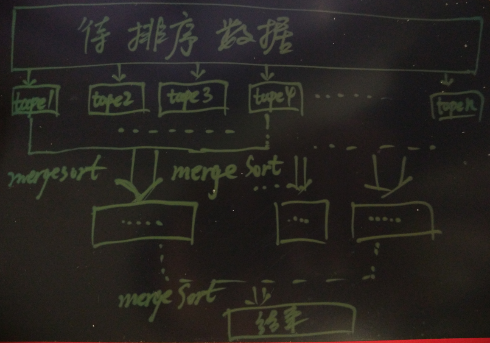
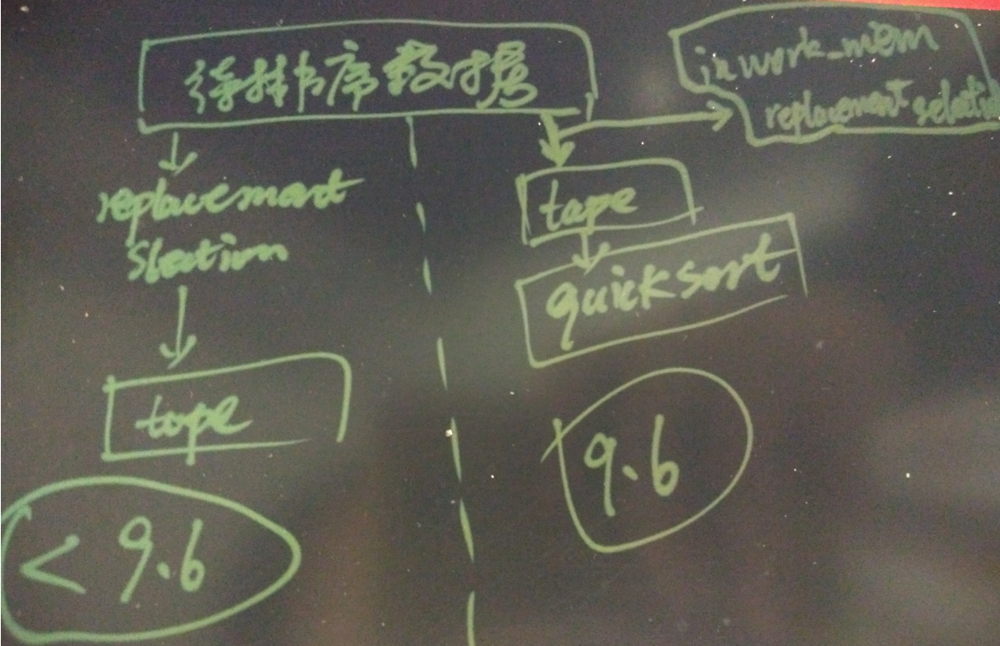

## PostgreSQL 9.6 内核优化 - sort性能增强(batch化quicksort代替replacement selection when work_mem small)
               
### 作者             
digoal              
              
### 日期            
2016-10-08             
              
### 标签            
PostgreSQL , 9.6 , 内核优化 , sort , replacement selection , quciksort        
              
----            
              
## 背景   
排序是比较常见的业务需求，为了降低排序的CPU开销，通常会使用索引来满足排序的需求。  
  
但是并不是所有的QUERY都能使用索引排序，或者说使用索引排序就一定高效。  
  
例如带过滤条件的QUERY，过滤完之后再根据某些字段或表达式排序。这种QUERY的排序不一定能用上索引。  
  
当需要实时排序时，PostgreSQL数据库怎么处理的呢？   
  
PostgreSQL根据排序的数据量, work_mem的大小 选择合适的排序算法。  
     
排序算法参考    
  
https://en.wikipedia.org/wiki/Sorting_algorithm  
  
包括每种排序算法的最小开销，最大开销，平均开销，内存需求，稳定性等。  
  
1\. 当需要排序的数据量较小，可以在work_mem参数设置的内存值内完成时，会使用qsort排序，这个9.6并没有改进，与以前一样。  
  
quicksort算法参考    
    
https://en.wikipedia.org/wiki/Quicksort    
    
    
  
2\. 当需要排序的数据量较大，无法在work_mem参数设置的内存值内完成时，会使用临时文件以及标准的external sort算法。  
  
2\.1  PostgreSQL 9.6以前的版本external sort使用heapsort算法(selection排序的变种)。  
  
参考1 Knuth volume 3, Algorithm 5.2.3H  
  
https://books.google.com.hk/books?id=cYULBAAAQBAJ&pg=PA757&lpg=PA757&dq=Knuth++5.2.3H&source=bl&ots=KJCxOiQs5G&sig=s0gEBVMp_bB0uqRGxShzfRDBYjU&hl=zh-CN&sa=X&ved=0ahUKEwiy8tSJ0czPAhXE3YMKHe3yDr0Q6AEIOjAE#v=onepage&q&f=false    
  
    
  
参考2 Heapsort      
  
https://en.wikipedia.org/wiki/Sorting_algorithm#Heapsort    
  
heapsort原理如图  
    
    
    
selection sort原理如图，对排序顺序与实际顺序一致的数据效果很不错，但是对离散数据效果不好。    
    
    
    
2\.2 PostgreSQL 9.6 的改进，只对头部扫描的N条记录使用selection排序，提升随机数据的排序效率，通过参数work_mem与replacement_sort_tuples限制N。随后的数据使用分批的quicksort和merge sort得到结果。      
  
决定使用replacement selection  
  
```
/*
 * Possible states of a Tuplesort object.  These denote the states that
 * persist between calls of Tuplesort routines.
 */
typedef enum
{
        TSS_INITIAL,                            /* Loading tuples; still within memory limit */
        TSS_BOUNDED,                            /* Loading tuples into bounded-size heap */
        TSS_BUILDRUNS,                          /* Loading tuples; writing to tape */
        TSS_SORTEDINMEM,                        /* Sort completed entirely in memory */
        TSS_SORTEDONTAPE,                       /* Sort completed, final run is on tape */
        TSS_FINALMERGE                          /* Performing final merge on-the-fly */
} TupSortStatus;
......
/*
 * useselection - determine algorithm to use to sort first run.
 *
 * It can sometimes be useful to use the replacement selection algorithm if it
 * results in one large run, and there is little available workMem.  See
 * remarks on RUN_SECOND optimization within dumptuples().
 */
static bool
useselection(Tuplesortstate *state)
{
        /*
         * memtupsize might be noticeably higher than memtupcount here in atypical
         * cases.  It seems slightly preferable to not allow recent outliers to
         * impact this determination.  Note that caller's trace_sort output
         * reports memtupcount instead.
         */
        if (state->memtupsize <= replacement_sort_tuples)
                return true;

        return false;
}
......
        /*
         * Give replacement selection a try based on user setting.  There will be
         * a switch to a simple hybrid sort-merge strategy after the first run
         * (iff we could not output one long run).
         */
        state->replaceActive = useselection(state);
......
                case TSS_BUILDRUNS:

                        /*
                         * Insert the tuple into the heap, with run number currentRun if
                         * it can go into the current run, else HEAP_RUN_NEXT.  The tuple
                         * can go into the current run if it is >= the first
                         * not-yet-output tuple.  (Actually, it could go into the current
                         * run if it is >= the most recently output tuple ... but that
                         * would require keeping around the tuple we last output, and it's
                         * simplest to let writetup free each tuple as soon as it's
                         * written.)
                         *
                         * Note that this only applies when:
                         *
                         * - currentRun is RUN_FIRST
                         *
                         * - Replacement selection is in use (typically it is never used).
                         *
                         * When these two conditions are not both true, all tuples are
                         * appended indifferently, much like the TSS_INITIAL case.
                         *
                         * There should always be room to store the incoming tuple.
                         */
                        Assert(!state->replaceActive || state->memtupcount > 0);
                        if (state->replaceActive &&
                                COMPARETUP(state, tuple, &state->memtuples[0]) >= 0)
                        {
                                Assert(state->currentRun == RUN_FIRST);
```
  
replacement_sort_tuples建议设置的值与CPU cache size有关，CPU cache size越大，可以调大这个值。  否则建议不要修改它。    
    
3\. 分批使用Knuth's Algorithm 5.4.2D, 在PostgreSQL的logtape.c中实现。  
  
4\. merge sort, 参考  
    
https://en.wikipedia.org/wiki/Polyphase_merge_sort    
    
5\. tuplesort说明。  
  
src/backend/utils/sort/tuplesort.c  
```
 * This module handles sorting of heap tuples, index tuples, or single
 * Datums (and could easily support other kinds of sortable objects,
 * if necessary).  It works efficiently for both small and large amounts
 * of data.  Small amounts are sorted in-memory using qsort().  Large
 * amounts are sorted using temporary files and a standard external sort
 * algorithm.
 *
 * See Knuth, volume 3, for more than you want to know about the external
 * sorting algorithm.  Historically, we divided the input into sorted runs
 * using replacement selection, in the form of a priority tree implemented
 * as a heap (essentially his Algorithm 5.2.3H), but now we only do that
 * for the first run, and only if the run would otherwise end up being very
 * short.  We merge the runs using polyphase merge, Knuth's Algorithm
 * 5.4.2D.  The logical "tapes" used by Algorithm D are implemented by
 * logtape.c, which avoids space wastage by recycling disk space as soon
 * as each block is read from its "tape".
 *
 * We do not use Knuth's recommended data structure (Algorithm 5.4.1R) for
 * the replacement selection, because it uses a fixed number of records
 * in memory at all times.  Since we are dealing with tuples that may vary
 * considerably in size, we want to be able to vary the number of records
 * kept in memory to ensure full utilization of the allowed sort memory
 * space.  So, we keep the tuples in a variable-size heap, with the next
 * record to go out at the top of the heap.  Like Algorithm 5.4.1R, each
 * record is stored with the run number that it must go into, and we use
 * (run number, key) as the ordering key for the heap.  When the run number
 * at the top of the heap changes, we know that no more records of the prior
 * run are left in the heap.  Note that there are in practice only ever two
 * distinct run numbers, because since PostgreSQL 9.6, we only use
 * replacement selection to form the first run.
 *
 * In PostgreSQL 9.6, a heap (based on Knuth's Algorithm H, with some small
 * customizations) is only used with the aim of producing just one run,
 * thereby avoiding all merging.  Only the first run can use replacement
 * selection, which is why there are now only two possible valid run
 * numbers, and why heapification is customized to not distinguish between
 * tuples in the second run (those will be quicksorted).  We generally
 * prefer a simple hybrid sort-merge strategy, where runs are sorted in much
 * the same way as the entire input of an internal sort is sorted (using
 * qsort()).  The replacement_sort_tuples GUC controls the limited remaining
 * use of replacement selection for the first run.
 *
 * There are several reasons to favor a hybrid sort-merge strategy.
 * Maintaining a priority tree/heap has poor CPU cache characteristics.
 * Furthermore, the growth in main memory sizes has greatly diminished the
 * value of having runs that are larger than available memory, even in the
 * case where there is partially sorted input and runs can be made far
 * larger by using a heap.  In most cases, a single-pass merge step is all
 * that is required even when runs are no larger than available memory.
 * Avoiding multiple merge passes was traditionally considered to be the
 * major advantage of using replacement selection.
 *
 * The approximate amount of memory allowed for any one sort operation
 * is specified in kilobytes by the caller (most pass work_mem).  Initially,
 * we absorb tuples and simply store them in an unsorted array as long as
 * we haven't exceeded workMem.  If we reach the end of the input without
 * exceeding workMem, we sort the array using qsort() and subsequently return
 * tuples just by scanning the tuple array sequentially.  If we do exceed
 * workMem, we begin to emit tuples into sorted runs in temporary tapes.
 * When tuples are dumped in batch after quicksorting, we begin a new run
 * with a new output tape (selected per Algorithm D).  After the end of the
 * input is reached, we dump out remaining tuples in memory into a final run
 * (or two, when replacement selection is still used), then merge the runs
 * using Algorithm D.
 *
 * When merging runs, we use a heap containing just the frontmost tuple from
 * each source run; we repeatedly output the smallest tuple and insert the
 * next tuple from its source tape (if any).  When the heap empties, the merge
 * is complete.  The basic merge algorithm thus needs very little memory ---
 * only M tuples for an M-way merge, and M is constrained to a small number.
 * However, we can still make good use of our full workMem allocation by
 * pre-reading additional tuples from each source tape.  Without prereading,
 * our access pattern to the temporary file would be very erratic; on average
 * we'd read one block from each of M source tapes during the same time that
 * we're writing M blocks to the output tape, so there is no sequentiality of
 * access at all, defeating the read-ahead methods used by most Unix kernels.
 * Worse, the output tape gets written into a very random sequence of blocks
 * of the temp file, ensuring that things will be even worse when it comes
 * time to read that tape.  A straightforward merge pass thus ends up doing a
 * lot of waiting for disk seeks.  We can improve matters by prereading from
 * each source tape sequentially, loading about workMem/M bytes from each tape
 * in turn.  Then we run the merge algorithm, writing but not reading until
 * one of the preloaded tuple series runs out.  Then we switch back to preread
 * mode, fill memory again, and repeat.  This approach helps to localize both
 * read and write accesses.
 *
 * When the caller requests random access to the sort result, we form
 * the final sorted run on a logical tape which is then "frozen", so
 * that we can access it randomly.  When the caller does not need random
 * access, we return from tuplesort_performsort() as soon as we are down
 * to one run per logical tape.  The final merge is then performed
 * on-the-fly as the caller repeatedly calls tuplesort_getXXX; this
 * saves one cycle of writing all the data out to disk and reading it in.
 *
 * Before Postgres 8.2, we always used a seven-tape polyphase merge, on the
 * grounds that 7 is the "sweet spot" on the tapes-to-passes curve according
 * to Knuth's figure 70 (section 5.4.2).  However, Knuth is assuming that
 * tape drives are expensive beasts, and in particular that there will always
 * be many more runs than tape drives.  In our implementation a "tape drive"
 * doesn't cost much more than a few Kb of memory buffers, so we can afford
 * to have lots of them.  In particular, if we can have as many tape drives
 * as sorted runs, we can eliminate any repeated I/O at all.  In the current
 * code we determine the number of tapes M on the basis of workMem: we want
 * workMem/M to be large enough that we read a fair amount of data each time
 * we preread from a tape, so as to maintain the locality of access described
 * above.  Nonetheless, with large workMem we can have many tapes.
```
    
## external sort
当work_mem不足完成内存排序时，会选择external sort或external merge。  
    
  
    
根据数据量的大小，分阶段排序，合并。  
  
可以通过trace_sort观察，后面会有例子。  
  
explain 时可能看到的一些信息   
```
tuplesort_get_stats
......
        switch (state->status)
        {
                case TSS_SORTEDINMEM:
                        if (state->boundUsed)
                                *sortMethod = "top-N heapsort";
                        else
                                *sortMethod = "quicksort";
                        break;
                case TSS_SORTEDONTAPE:
                        *sortMethod = "external sort";
                        break;
                case TSS_FINALMERGE:
                        *sortMethod = "external merge";
                        break;
                default:
                        *sortMethod = "still in progress";
                        break;
        }
```
  
## 9.6external sort改进点
前面已经描述过了，以9.5作为比较，9.6不同的地方，如下图  
  
  
    
9.5每个小的batch(tape)都是使用replacement selection的排序算法。  
  
而9.6则是通过replacement_sort_tuples配置，初次扫描的replacement_sort_tuples条记录使用replacement selection算法（以装下一个work_mem单位为止，所以可能实际的replacement selection记录数小于replacement_sort_tuples的设置），超出的tuples使用quicksort。    
  
使用trace_sort也可以跟踪到两个版本的排序算法差异。  
  
replacement selection 是替代排序，对于乱序的数据，排序的效率很差，因为得不停的替换，而对于物理顺序与逻辑顺序一致(是顺序一致，倒序一致不算)的效果则很不错。    
    
乱序数据quick sort效率比replacement selection效率高，适用范围广泛。  
    
9.6的排序改进说明如下  
  
```
Improve sorting performance by using quicksort, not replacement selection sort, when performing external sort steps (Peter Geoghegan)

The new approach makes better use of the CPU cache for typical cache sizes and data volumes. 

Where necessary, the behavior can be adjusted via the new configuration parameter replacement_sort_tuples.
```
  
https://git.postgresql.org/gitweb/?p=postgresql.git;a=commit;h=0711803775a37e0bf39d7efdd1e34d9d7e640ea1  
  
```
Use quicksort, not replacement selection, for external sorting.

We still use replacement selection for the first run of the sort only
and only when the number of tuples is relatively small.  Otherwise,
the first run, and subsequent runs in all cases, are produced using
quicksort.  This tends to be faster except perhaps for very small
amounts of working memory.

Peter Geoghegan, reviewed by Tomas Vondra, Jeff Janes, Mithun Cy,
Greg Stark, and me.
```
  
## 测试
1\. 1000万乱序数据排序  
  
```
create table sort_random(id int);
insert into sort_random select 10000000*random() from generate_series(1,10000000);
set work_mem='4MB';  -- 小于表大小，使之走external sort或external merge。  
set trace_sort=on;
set client_min_messages='debug';
explain (analyze,verbose,timing,costs,buffers) select * from sort_random order by id;
```
  
1\.1 9.5  
```
LOG:  begin tuple sort: nkeys = 1, workMem = 4096, randomAccess = f
LOG:  switching to external sort with 15 tapes: CPU 0.00s/0.01u sec elapsed 0.01 sec

使用replacement selection排序，随机数据这种排序较慢  
LOG:  finished writing run 1 to tape 0: CPU 0.00s/0.06u sec elapsed 0.06 sec
LOG:  finished writing run 2 to tape 1: CPU 0.00s/0.12u sec elapsed 0.13 sec
LOG:  finished writing run 3 to tape 2: CPU 0.00s/0.18u sec elapsed 0.19 sec
LOG:  finished writing run 4 to tape 3: CPU 0.00s/0.25u sec elapsed 0.25 sec
......
LOG:  finished writing run 97 to tape 5: CPU 0.13s/6.09u sec elapsed 6.22 sec
LOG:  finished writing run 98 to tape 6: CPU 0.13s/6.15u sec elapsed 6.29 sec
LOG:  performsort starting: CPU 0.13s/6.19u sec elapsed 6.32 sec
LOG:  finished writing run 99 to tape 7: CPU 0.13s/6.20u sec elapsed 6.33 sec
LOG:  finished writing final run 100 to tape 8: CPU 0.13s/6.21u sec elapsed 6.34 sec
run多少次和work_mem大小有关。  

LOG:  finished 9-way merge step: CPU 0.14s/6.38u sec elapsed 6.53 sec
LOG:  finished 14-way merge step: CPU 0.16s/6.68u sec elapsed 6.83 sec
LOG:  finished 14-way merge step: CPU 0.17s/6.97u sec elapsed 7.14 sec
LOG:  finished 14-way merge step: CPU 0.18s/7.27u sec elapsed 7.45 sec
LOG:  finished 14-way merge step: CPU 0.21s/7.73u sec elapsed 7.93 sec
LOG:  finished 14-way merge step: CPU 0.23s/8.30u sec elapsed 8.52 sec
LOG:  finished 14-way merge step: CPU 0.27s/9.29u sec elapsed 9.55 sec
LOG:  performsort done (except 14-way final merge): CPU 0.27s/9.29u sec elapsed 9.56 sec
LOG:  external sort ended, 17112 disk blocks used: CPU 0.35s/12.17u sec elapsed 12.51 sec
                                                              QUERY PLAN                                                               
---------------------------------------------------------------------------------------------------------------------------------------
 Sort  (cost=1463181.24..1488181.36 rows=10000048 width=4) (actual time=9561.908..11953.239 rows=10000000 loops=1)
   Output: id
   Sort Key: sort_random.id
   Sort Method: external merge  Disk: 136896kB
   Buffers: shared hit=44251, temp read=42656 written=42656
   ->  Seq Scan on public.sort_random  (cost=0.00..144248.48 rows=10000048 width=4) (actual time=0.014..995.089 rows=10000000 loops=1)
         Output: id
         Buffers: shared hit=44248
 Planning time: 0.165 ms
 Execution time: 12514.975 ms
(10 rows)
```
  
1000万随机数据9.5排序约耗时9562-995=8567毫秒  
  
1\.2 9.6  
```
postgres=# show replacement_sort_tuples ;
 replacement_sort_tuples 
-------------------------
 150000
(1 row)

LOG:  begin tuple sort: nkeys = 1, workMem = 4096, randomAccess = f
LOG:  switching to external sort with 15 tapes: CPU 0.00s/0.00u sec elapsed 0.01 sec

最开始的58253条记录使用 replacement selection 排序  
为什么是58253呢？和work_mem有关，4MB刚好装下。  

LOG:  replacement selection will sort 58253 first run tuples
LOG:  finished incrementally writing first run 1 to tape 0: CPU 0.00s/0.06u sec elapsed 0.06 sec
LOG:  starting quicksort of run 2: CPU 0.00s/0.06u sec elapsed 0.06 sec
LOG:  finished quicksort of run 2: CPU 0.00s/0.07u sec elapsed 0.07 sec

LOG:  finished writing run 2 to tape 1: CPU 0.00s/0.07u sec elapsed 0.07 sec
LOG:  starting quicksort of run 3: CPU 0.00s/0.08u sec elapsed 0.08 sec
LOG:  finished quicksort of run 3: CPU 0.00s/0.08u sec elapsed 0.09 sec
接下来每个tape都是使用quicksort，需要RUN多少次则由work_mem决定，越大则一个tape越大，run越少。    


LOG:  finished writing run 3 to tape 2: CPU 0.00s/0.09u sec elapsed 0.09 sec
LOG:  starting quicksort of run 4: CPU 0.00s/0.10u sec elapsed 0.10 sec
LOG:  finished quicksort of run 4: CPU 0.00s/0.10u sec elapsed 0.11 sec
LOG:  finished writing run 4 to tape 3: CPU 0.00s/0.11u sec elapsed 0.11 sec
LOG:  starting quicksort of run 5: CPU 0.00s/0.11u sec elapsed 0.12 sec
LOG:  finished quicksort of run 5: CPU 0.00s/0.12u sec elapsed 0.12 sec
LOG:  finished writing run 5 to tape 4: CPU 0.00s/0.12u sec elapsed 0.13 sec
LOG:  starting quicksort of run 6: CPU 0.00s/0.13u sec elapsed 0.14 sec
LOG:  finished quicksort of run 6: CPU 0.00s/0.14u sec elapsed 0.14 sec
LOG:  finished writing run 6 to tape 5: CPU 0.00s/0.14u sec elapsed 0.15 sec
LOG:  starting quicksort of run 7: CPU 0.00s/0.15u sec elapsed 0.16 sec
LOG:  finished quicksort of run 7: CPU 0.00s/0.16u sec elapsed 0.16 sec
......
LOG:  finished writing run 195 to tape 13: CPU 0.11s/3.65u sec elapsed 3.77 sec
LOG:  starting quicksort of run 196: CPU 0.11s/3.66u sec elapsed 3.78 sec
LOG:  finished quicksort of run 196: CPU 0.11s/3.67u sec elapsed 3.79 sec
LOG:  finished writing run 196 to tape 0: CPU 0.11s/3.67u sec elapsed 3.79 sec
LOG:  performsort starting: CPU 0.11s/3.68u sec elapsed 3.80 sec
LOG:  starting quicksort of run 197: CPU 0.11s/3.68u sec elapsed 3.80 sec
LOG:  finished quicksort of run 197: CPU 0.11s/3.69u sec elapsed 3.80 sec
LOG:  finished writing run 197 to tape 1: CPU 0.12s/3.69u sec elapsed 3.81 sec

LOG:  finished 2-way merge step: CPU 0.12s/3.70u sec elapsed 3.82 sec
LOG:  finished 14-way merge step: CPU 0.13s/3.84u sec elapsed 3.98 sec
LOG:  finished 14-way merge step: CPU 0.13s/3.99u sec elapsed 4.13 sec
LOG:  finished 14-way merge step: CPU 0.14s/4.14u sec elapsed 4.28 sec
LOG:  finished 14-way merge step: CPU 0.15s/4.28u sec elapsed 4.43 sec
LOG:  finished 14-way merge step: CPU 0.15s/4.43u sec elapsed 4.58 sec
LOG:  finished 14-way merge step: CPU 0.16s/4.57u sec elapsed 4.73 sec
LOG:  finished 14-way merge step: CPU 0.17s/4.72u sec elapsed 4.88 sec
LOG:  finished 14-way merge step: CPU 0.18s/4.87u sec elapsed 5.06 sec
LOG:  finished 14-way merge step: CPU 0.19s/5.15u sec elapsed 5.35 sec
LOG:  finished 14-way merge step: CPU 0.21s/5.43u sec elapsed 5.64 sec
LOG:  finished 14-way merge step: CPU 0.22s/5.71u sec elapsed 5.93 sec
LOG:  finished 14-way merge step: CPU 0.23s/6.15u sec elapsed 6.38 sec
LOG:  finished 14-way merge step: CPU 0.26s/6.69u sec elapsed 6.94 sec
LOG:  finished 14-way merge step: CPU 0.29s/7.64u sec elapsed 7.94 sec

LOG:  grew memtuples 1.29x from 58253 (1366 KB) to 74896 (1756 KB) for final merge
LOG:  tape 0 initially used 126 KB of 144 KB batch (0.875) and 5347 out of 5348 slots (1.000)
LOG:  tape 1 initially used 126 KB of 144 KB batch (0.875) and 5347 out of 5348 slots (1.000)
LOG:  tape 2 initially used 126 KB of 144 KB batch (0.875) and 5347 out of 5348 slots (1.000)
LOG:  tape 3 initially used 126 KB of 144 KB batch (0.875) and 5347 out of 5348 slots (1.000)
LOG:  tape 4 initially used 126 KB of 144 KB batch (0.875) and 5347 out of 5348 slots (1.000)
LOG:  tape 5 initially used 126 KB of 144 KB batch (0.875) and 5347 out of 5348 slots (1.000)
LOG:  tape 6 initially used 126 KB of 144 KB batch (0.875) and 5347 out of 5348 slots (1.000)
LOG:  tape 7 initially used 126 KB of 144 KB batch (0.875) and 5347 out of 5348 slots (1.000)
LOG:  tape 8 initially used 126 KB of 144 KB batch (0.875) and 5347 out of 5348 slots (1.000)
LOG:  tape 9 initially used 126 KB of 144 KB batch (0.875) and 5347 out of 5348 slots (1.000)
LOG:  tape 11 initially used 126 KB of 144 KB batch (0.875) and 5347 out of 5348 slots (1.000)
LOG:  tape 12 initially used 126 KB of 144 KB batch (0.875) and 5347 out of 5348 slots (1.000)
LOG:  tape 13 initially used 126 KB of 144 KB batch (0.875) and 5347 out of 5348 slots (1.000)
LOG:  tape 14 initially used 126 KB of 144 KB batch (0.875) and 5347 out of 5348 slots (1.000)
LOG:  performsort done (except 14-way final merge): CPU 0.30s/7.64u sec elapsed 7.94 sec
LOG:  external sort ended, 17118 disk blocks used: CPU 0.37s/10.26u sec elapsed 10.63 sec
                                                              QUERY PLAN                                                              
--------------------------------------------------------------------------------------------------------------------------------------
 Sort  (cost=1463171.76..1488171.71 rows=9999977 width=4) (actual time=7944.288..10057.455 rows=10000000 loops=1)
   Output: id
   Sort Key: sort_random.id
   Sort Method: external merge  Disk: 136944kB
   Buffers: shared hit=44248, temp read=50520 written=50520
   ->  Seq Scan on public.sort_random  (cost=0.00..144247.77 rows=9999977 width=4) (actual time=0.014..899.352 rows=10000000 loops=1)
         Output: id
         Buffers: shared hit=44248
 Planning time: 0.030 ms
 Execution time: 10638.156 ms
(10 rows)
```
  
1000万随机数据9.6排序约耗时7944-899=7045毫秒  
  
如果不想让9.6使用replacement selection，把replacement_sort_tuples设置为0即可。  
  
```
postgres=# set replacement_sort_tuples =0;
postgres=# explain (analyze,verbose,timing,costs,buffers) select * from sort_random order by id;

LOG:  begin tuple sort: nkeys = 1, workMem = 4096, randomAccess = f
LOG:  switching to external sort with 15 tapes: CPU 0.00s/0.01u sec elapsed 0.01 sec
LOG:  starting quicksort of run 1: CPU 0.00s/0.01u sec elapsed 0.01 sec
LOG:  finished quicksort of run 1: CPU 0.00s/0.01u sec elapsed 0.01 sec
LOG:  finished writing run 1 to tape 0: CPU 0.00s/0.02u sec elapsed 0.02 sec
LOG:  starting quicksort of run 2: CPU 0.00s/0.02u sec elapsed 0.03 sec
LOG:  finished quicksort of run 2: CPU 0.00s/0.03u sec elapsed 0.03 sec
......
```
  
如果要少点batch，可以设置更大的work_mem，但是不要超过表的大小，否则会使用inmemory排序，那就看不到external sort或external merge的效果了。  
  
9\.5  
```
postgres=# set work_mem='32MB';
SET
postgres=# explain (analyze,verbose,timing,costs,buffers) select * from sort_random order by id;
LOG:  begin tuple sort: nkeys = 1, workMem = 32768, randomAccess = f
LOG:  switching to external sort with 117 tapes: CPU 0.01s/0.08u sec elapsed 0.10 sec
LOG:  finished writing run 1 to tape 0: CPU 0.02s/0.63u sec elapsed 0.66 sec
LOG:  finished writing run 2 to tape 1: CPU 0.03s/1.25u sec elapsed 1.28 sec
LOG:  finished writing run 3 to tape 2: CPU 0.04s/1.88u sec elapsed 1.93 sec
LOG:  finished writing run 4 to tape 3: CPU 0.05s/2.52u sec elapsed 2.57 sec
LOG:  finished writing run 5 to tape 4: CPU 0.06s/3.15u sec elapsed 3.22 sec
LOG:  finished writing run 6 to tape 5: CPU 0.08s/3.78u sec elapsed 3.87 sec
LOG:  finished writing run 7 to tape 6: CPU 0.09s/4.42u sec elapsed 4.51 sec
LOG:  finished writing run 8 to tape 7: CPU 0.10s/5.06u sec elapsed 5.16 sec
LOG:  finished writing run 9 to tape 8: CPU 0.10s/5.70u sec elapsed 5.81 sec
LOG:  finished writing run 10 to tape 9: CPU 0.12s/6.34u sec elapsed 6.45 sec
LOG:  finished writing run 11 to tape 10: CPU 0.13s/6.97u sec elapsed 7.10 sec
LOG:  performsort starting: CPU 0.14s/7.59u sec elapsed 7.73 sec
LOG:  finished writing run 12 to tape 11: CPU 0.14s/7.60u sec elapsed 7.74 sec
LOG:  finished writing final run 13 to tape 12: CPU 0.15s/7.81u sec elapsed 7.96 sec
LOG:  performsort done (except 13-way final merge): CPU 0.15s/7.85u sec elapsed 7.99 sec
LOG:  external sort ended, 17097 disk blocks used: CPU 0.24s/11.14u sec elapsed 11.38 sec
                                                              QUERY PLAN                                                               
---------------------------------------------------------------------------------------------------------------------------------------
 Sort  (cost=1385055.24..1410055.36 rows=10000048 width=4) (actual time=7998.517..10823.779 rows=10000000 loops=1)
   Output: id
   Sort Key: sort_random.id
   Sort Method: external merge  Disk: 136776kB
   Buffers: shared hit=44248, temp read=17120 written=17120
   ->  Seq Scan on public.sort_random  (cost=0.00..144248.48 rows=10000048 width=4) (actual time=0.010..924.432 rows=10000000 loops=1)
         Output: id
         Buffers: shared hit=44248
 Planning time: 0.046 ms
 Execution time: 11388.315 ms
(10 rows)
```
  
9\.6  
```
postgres=# set work_mem='32MB';
SET
postgres=# explain (analyze,verbose,timing,costs,buffers) select * from sort_random order by id;
LOG:  begin tuple sort: nkeys = 1, workMem = 32768, randomAccess = f
LOG:  switching to external sort with 117 tapes: CPU 0.01s/0.08u sec elapsed 0.10 sec
LOG:  starting quicksort of run 1: CPU 0.01s/0.08u sec elapsed 0.10 sec
LOG:  finished quicksort of run 1: CPU 0.01s/0.16u sec elapsed 0.18 sec
LOG:  finished writing run 1 to tape 0: CPU 0.02s/0.20u sec elapsed 0.22 sec
LOG:  starting quicksort of run 2: CPU 0.02s/0.28u sec elapsed 0.30 sec
LOG:  finished quicksort of run 2: CPU 0.02s/0.34u sec elapsed 0.37 sec
......
LOG:  starting quicksort of run 24: CPU 0.13s/3.97u sec elapsed 4.10 sec
LOG:  finished quicksort of run 24: CPU 0.13s/4.03u sec elapsed 4.17 sec
LOG:  finished writing run 24 to tape 23: CPU 0.14s/4.06u sec elapsed 4.20 sec
LOG:  performsort starting: CPU 0.14s/4.10u sec elapsed 4.24 sec
LOG:  starting quicksort of run 25: CPU 0.14s/4.10u sec elapsed 4.24 sec
LOG:  finished quicksort of run 25: CPU 0.14s/4.12u sec elapsed 4.27 sec
LOG:  finished writing run 25 to tape 24: CPU 0.14s/4.14u sec elapsed 4.28 sec
LOG:  grew memtuples 1.29x from 466033 (10923 KB) to 599185 (14044 KB) for final merge
LOG:  tape 0 initially used 562 KB of 725 KB batch (0.775) and 23965 out of 23966 slots (1.000)
LOG:  tape 1 initially used 562 KB of 725 KB batch (0.775) and 23965 out of 23966 slots (1.000)
LOG:  tape 2 initially used 562 KB of 725 KB batch (0.775) and 23965 out of 23966 slots (1.000)
LOG:  tape 3 initially used 562 KB of 725 KB batch (0.775) and 23965 out of 23966 slots (1.000)
LOG:  tape 4 initially used 562 KB of 725 KB batch (0.775) and 23965 out of 23966 slots (1.000)
LOG:  tape 5 initially used 562 KB of 725 KB batch (0.775) and 23965 out of 23966 slots (1.000)
LOG:  tape 6 initially used 562 KB of 725 KB batch (0.775) and 23965 out of 23966 slots (1.000)
LOG:  tape 7 initially used 562 KB of 725 KB batch (0.775) and 23965 out of 23966 slots (1.000)
LOG:  tape 8 initially used 562 KB of 725 KB batch (0.775) and 23965 out of 23966 slots (1.000)
LOG:  tape 9 initially used 562 KB of 725 KB batch (0.775) and 23965 out of 23966 slots (1.000)
LOG:  tape 10 initially used 562 KB of 725 KB batch (0.775) and 23965 out of 23966 slots (1.000)
LOG:  tape 11 initially used 562 KB of 725 KB batch (0.775) and 23965 out of 23966 slots (1.000)
LOG:  tape 12 initially used 562 KB of 725 KB batch (0.775) and 23965 out of 23966 slots (1.000)
LOG:  tape 13 initially used 562 KB of 725 KB batch (0.775) and 23965 out of 23966 slots (1.000)
LOG:  tape 14 initially used 562 KB of 725 KB batch (0.775) and 23965 out of 23966 slots (1.000)
LOG:  tape 15 initially used 562 KB of 725 KB batch (0.775) and 23965 out of 23966 slots (1.000)
LOG:  tape 16 initially used 562 KB of 725 KB batch (0.775) and 23965 out of 23966 slots (1.000)
LOG:  tape 17 initially used 562 KB of 725 KB batch (0.775) and 23965 out of 23966 slots (1.000)
LOG:  tape 18 initially used 562 KB of 725 KB batch (0.775) and 23965 out of 23966 slots (1.000)
LOG:  tape 19 initially used 562 KB of 725 KB batch (0.775) and 23965 out of 23966 slots (1.000)
LOG:  tape 20 initially used 562 KB of 725 KB batch (0.775) and 23965 out of 23966 slots (1.000)
LOG:  tape 21 initially used 562 KB of 725 KB batch (0.775) and 23965 out of 23966 slots (1.000)
LOG:  tape 22 initially used 562 KB of 725 KB batch (0.775) and 23965 out of 23966 slots (1.000)
LOG:  tape 23 initially used 562 KB of 725 KB batch (0.775) and 23965 out of 23966 slots (1.000)
LOG:  tape 24 initially used 562 KB of 725 KB batch (0.775) and 23965 out of 23966 slots (1.000)
LOG:  performsort done (except 25-way final merge): CPU 0.14s/4.17u sec elapsed 4.31 sec
LOG:  external sort ended, 17088 disk blocks used: CPU 0.24s/7.35u sec elapsed 7.58 sec
                                                              QUERY PLAN                                                              
--------------------------------------------------------------------------------------------------------------------------------------
 Sort  (cost=1385045.76..1410045.71 rows=9999977 width=4) (actual time=4315.876..7013.478 rows=10000000 loops=1)
   Output: id
   Sort Key: sort_random.id
   Sort Method: external merge  Disk: 136704kB
   Buffers: shared hit=44248, temp read=17112 written=17112
   ->  Seq Scan on public.sort_random  (cost=0.00..144247.77 rows=9999977 width=4) (actual time=0.015..901.672 rows=10000000 loops=1)
         Output: id
         Buffers: shared hit=44248
 Planning time: 0.051 ms
 Execution time: 7592.963 ms
(10 rows)
```
  
2\. 1000万顺序数据排序  
  
```
create table sort_seq(id int);
insert into sort_seq select generate_series(1,10000000);  -- 产生顺序数据
set work_mem='4MB';  -- 小于表大小，使之走external sort。  
set trace_sort=on;
set client_min_messages='debug';
explain (analyze,verbose,timing,costs,buffers) select * from sort_seq order by id;  -- 按顺序排序, 体现replacement selection的优势
```
  
2\.1 9.5  
```
postgres=# explain (analyze,verbose,timing,costs,buffers) select * from sort_seq order by id;
LOG:  begin tuple sort: nkeys = 1, workMem = 4096, randomAccess = f
LOG:  switching to external sort with 15 tapes: CPU 0.00s/0.01u sec elapsed 0.01 sec
LOG:  performsort starting: CPU 0.12s/5.57u sec elapsed 5.69 sec
LOG:  finished writing final run 1 to tape 0: CPU 0.13s/5.59u sec elapsed 5.71 sec
LOG:  performsort done: CPU 0.13s/5.59u sec elapsed 5.71 sec
LOG:  external sort ended, 17107 disk blocks used: CPU 0.21s/7.12u sec elapsed 7.33 sec
                                                            QUERY PLAN                                                             
-----------------------------------------------------------------------------------------------------------------------------------
 Sort  (cost=1463171.76..1488171.71 rows=9999977 width=4) (actual time=5717.099..6780.135 rows=10000000 loops=1)
   Output: id
   Sort Key: sort_seq.id
   Sort Method: external sort  Disk: 136856kB
   Buffers: shared hit=44248, temp read=17107 written=17107
   ->  Seq Scan on public.sort_seq  (cost=0.00..144247.77 rows=9999977 width=4) (actual time=0.009..901.238 rows=10000000 loops=1)
         Output: id
         Buffers: shared hit=44248
 Planning time: 0.049 ms
 Execution time: 7339.662 ms
(10 rows)
```
  
1000万顺序数据9.5排序约耗时5717-901=4816毫秒  
  
2\.2 9.6  
```
postgres=# explain (analyze,verbose,timing,costs,buffers) select * from sort_seq order by id;
LOG:  begin tuple sort: nkeys = 1, workMem = 4096, randomAccess = f
LOG:  switching to external sort with 15 tapes: CPU 0.00s/0.00u sec elapsed 0.01 sec

头部58253记录依旧使用了replacement selection排序  
LOG:  replacement selection will sort 58253 first run tuples
LOG:  performsort starting: CPU 0.12s/5.76u sec elapsed 5.88 sec

完成头部记录 sort  
LOG:  finished incrementally writing only run 1 to tape 0: CPU 0.12s/5.77u sec elapsed 5.90 sec

排序结束
LOG:  performsort done: CPU 0.12s/5.77u sec elapsed 5.90 sec
LOG:  external sort ended, 17107 disk blocks used: CPU 0.19s/7.38u sec elapsed 7.57 sec
                                                            QUERY PLAN                                                             
-----------------------------------------------------------------------------------------------------------------------------------
 Sort  (cost=1463171.76..1488171.71 rows=9999977 width=4) (actual time=5903.008..7003.703 rows=10000000 loops=1)
   Output: id
   Sort Key: sort_seq.id
   Sort Method: external sort  Disk: 136856kB
   Buffers: shared hit=44248, temp read=17107 written=17107
   ->  Seq Scan on public.sort_seq  (cost=0.00..144247.77 rows=9999977 width=4) (actual time=0.015..924.067 rows=10000000 loops=1)
         Output: id
         Buffers: shared hit=44248
 Planning time: 0.053 ms
 Execution time: 7578.416 ms
(10 rows)
```
  
1000万顺序数据9.6排序约耗时5903-924=4979毫秒  
    
## 测试结果
  
1000万随机数据9.5排序约耗时9562-995=8567毫秒  
1000万随机数据9.6排序约耗时7944-899=7045毫秒  
  
1000万顺序数据9.5排序约耗时5717-901=4816毫秒  
1000万顺序数据9.6排序约耗时5903-924=4979毫秒  
  
## 小结
通常不建议修改replacement_sort_tuples的值，与CPU CACHE匹配。    
  
https://www.postgresql.org/docs/9.6/static/runtime-config-resource.html#RUNTIME-CONFIG-RESOURCE-MEMORY  
```
replacement_sort_tuples (integer)

When the number of tuples to be sorted is smaller than this number, a sort will produce its first output run using replacement selection rather than quicksort. 
This may be useful in memory-constrained environments where tuples that are input into larger sort operations have a strong physical-to-logical correlation. 
Note that this does not include input tuples with an inverse correlation. 
It is possible for the replacement selection algorithm to generate one long run that requires no merging, 
where use of the default strategy would result in many runs that must be merged to produce a final sorted output. 
This may allow sort operations to complete sooner.

The default is 150,000 tuples. 
Note that higher values are typically not much more effective, and may be counter-productive, since the priority queue is sensitive to the size of available CPU cache,   
whereas the default strategy sorts runs using a cache oblivious algorithm.   
This property allows the default sort strategy to automatically and transparently make effective use of available CPU cache.  

Setting maintenance_work_mem to its default value usually prevents utility command external sorts 
(e.g., sorts used by CREATE INDEX to build B-Tree indexes) from ever using replacement selection sort, unless the input tuples are quite wide.
```
   
  
## 参考
    
https://en.wikipedia.org/wiki/External_sorting  
  
https://en.wikipedia.org/wiki/Sorting_algorithm  
  
https://en.wikipedia.org/wiki/Selection_sort  
  
src/backend/utils/sort/tuplesort.c  
    
          
      
  
<a rel="nofollow" href="http://info.flagcounter.com/h9V1"  ></a>  
  
  
  
  
  
  
## [digoal's 大量PostgreSQL文章入口](https://github.com/digoal/blog/blob/master/README.md "22709685feb7cab07d30f30387f0a9ae")
  
