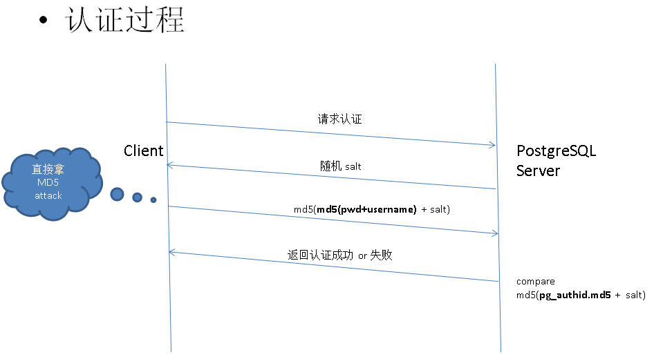
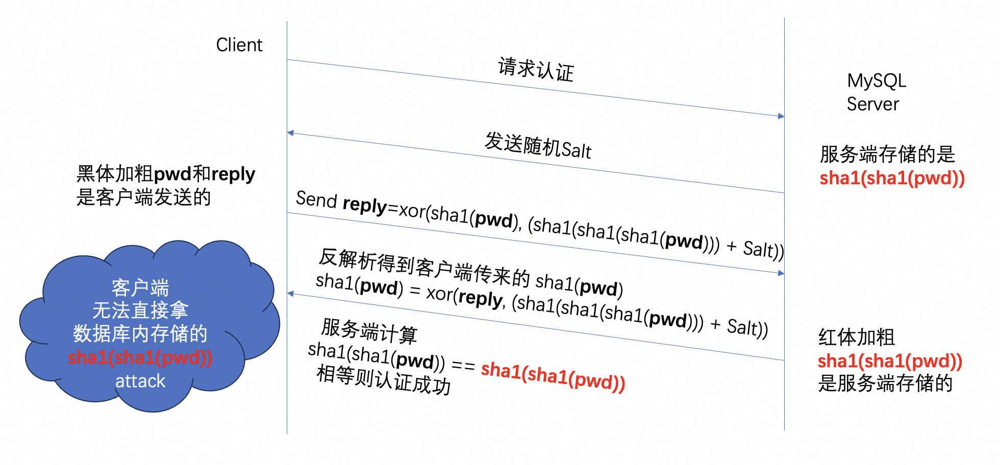

## PostgreSQL md5 对比 MySQL - 秘钥认证  
##### [TAG 6](../class/6.md)
               
### 作者             
digoal              
              
### 日期            
2016-10-09             
              
### 标签            
PostgreSQL , MySQL , 秘钥认证 , 安全      
              
----            
              
## 背景   
PostgreSQL支持的认证方法很多，例如  
  
```
20.3.1. Trust Authentication
20.3.2. Password Authentication
20.3.3. GSSAPI Authentication
20.3.4. SSPI Authentication
20.3.5. Ident Authentication
20.3.6. Peer Authentication
20.3.7. LDAP Authentication
20.3.8. RADIUS Authentication
20.3.9. Certificate Authentication
20.3.10. PAM Authentication
20.3.11. BSD Authentication
```
  
详见  
  
https://www.postgresql.org/docs/9.6/static/client-authentication.html  
  
秘钥认证还是最流行的认证方法，在PostgreSQL中秘钥认证分为password和md5两种，本文要讲的是md5。   
  
本文主要针对秘钥认证方法的过程进行分析，对比一下MySQL与PostgreSQL MD5认证的不同之处。  
  
### 注意
PostgreSQL的认证也是模块化的，你不喜欢md5的认证方法，可以随意更换认证模块，提高安全性哦。  
  
比如10.0，又加了一个SCRAM-SHA-256的认证。  
  
## PostgreSQL 秘钥认证原理
如图  
  
    
  
1\. 密码加密存储原理  
  
用户创建用户时，密码被加密存储在pg_catalog.pg_authid系统表中。  
  
```
postgres=# create role digoal encrypted password 'digoal123' login ;
CREATE ROLE
postgres=# select * from pg_authid ;
 rolname  | rolsuper | rolinherit | rolcreaterole | rolcreatedb | rolcanlogin | rolreplication | rolbypassrls | rolconnlimit |             rolpassword             | rolvaliduntil 
----------+----------+------------+---------------+-------------+-------------+----------------+--------------+--------------+-------------------------------------+---------------
 postgres | t        | t          | t             | t           | t           | t              | t            |           -1 |                                     | 
 digoal   | f        | t          | f             | f           | t           | f              | f            |           -1 | md5421dd797066ed21dec75dca5fd13b81b | 
(2 rows)
```
  
加密算法如下md5(pwd+username)，不可逆     
```
postgres=# select md5('digoal123digoal');
               md5                
----------------------------------
 421dd797066ed21dec75dca5fd13b81b
(1 row)
```
  
2\. 认证流程   
  
2\.1 客户端发起认证消息  
  
2\.2 服务端接收到认证消息报文，生成一个随机Salt，发生给客户端  
  
2\.3 客户端收到Salt后，将计算这个值 md5(md5(pwd+username) + Salt) 得到认证秘钥，发送给服务端    
  
2\.4 服务端收到客户端发过来的认证秘钥，与服务端存储的pg_catalog.pg_authid中对应的md5，计算md5(md5+Salt)得到一个值，与客户端发过来的认证秘钥对比，如果一致则认证成功，如果不一致则认证失败。  
  
3\. 认证分析  
  
认证过程中服务端发送的Salt，主要是防止用户发送的认证秘钥被截获，导致密码泄露。  
  
如果泄露了pg_authid.MD5，客户端即使没有密码，也能认证，方法如下，修改客户端2.3的步骤即可。  
  
src/backend/libpq/md5.c  
```
/*
 * Computes MD5 checksum of "passwd" (a null-terminated string) followed
 * by "salt" (which need not be null-terminated).
 *
 * Output format is "md5" followed by a 32-hex-digit MD5 checksum.
 * Hence, the output buffer "buf" must be at least 36 bytes long.
 *
 * Returns TRUE if okay, FALSE on error (out of memory).
 */
bool
pg_md5_encrypt(const char *passwd, const char *salt, size_t salt_len,
                           char *buf)
{
        size_t          passwd_len = strlen(passwd);

        /* +1 here is just to avoid risk of unportable malloc(0) */
        char       *crypt_buf = malloc(passwd_len + salt_len + 1);
        bool            ret;

        if (!crypt_buf)
                return false;

        /*
         * Place salt at the end because it may be known by users trying to crack
         * the MD5 output.
         */
        memcpy(crypt_buf, passwd, passwd_len);
        memcpy(crypt_buf + passwd_len, salt, salt_len);

        strcpy(buf, "md5");
        ret = pg_md5_hash(crypt_buf, passwd_len + salt_len, buf + 3);

        free(crypt_buf);

        return ret;
}
```
  
修改的客户端代码如下  
  
src/interfaces/libpq/fe-auth.c  
```
static int
pg_password_sendauth(PGconn *conn, const char *password, AuthRequest areq)
{
        int                     ret;
        char       *crypt_pwd = NULL;
        const char *pwd_to_send;

        /* Encrypt the password if needed. */

        switch (areq)
        {
                case AUTH_REQ_MD5:
                        {
                                char       *crypt_pwd2;

                                /* Allocate enough space for two MD5 hashes */
                                crypt_pwd = malloc(2 * (MD5_PASSWD_LEN + 1));
                                if (!crypt_pwd)
                                {
                                        printfPQExpBuffer(&conn->errorMessage,
                                                                          libpq_gettext("out of memory\n"));
                                        return STATUS_ERROR;
                                }

/*  注释，不处理用户提供的password
                                crypt_pwd2 = crypt_pwd + MD5_PASSWD_LEN + 1;
                                if (!pg_md5_encrypt(password, conn->pguser,
                                                                        strlen(conn->pguser), crypt_pwd2))
                                {
                                        free(crypt_pwd);
                                        return STATUS_ERROR;
                                }
*/

                                // if (!pg_md5_encrypt(crypt_pwd2 + strlen("md5"), conn->md5Salt,
				// 修改如下  

                                if (!pg_md5_encrypt(password + strlen("md5"), conn->md5Salt,
                                                                        sizeof(conn->md5Salt), crypt_pwd))
                                {
                                        free(crypt_pwd);
                                        return STATUS_ERROR;
                                }

                                pwd_to_send = crypt_pwd;
                                break;
                        }
                case AUTH_REQ_PASSWORD:
                        pwd_to_send = password;
                        break;
                default:
                        return STATUS_ERROR;
        }
        /* Packet has a message type as of protocol 3.0 */
        if (PG_PROTOCOL_MAJOR(conn->pversion) >= 3)
                ret = pqPacketSend(conn, 'p', pwd_to_send, strlen(pwd_to_send) + 1);
        else
                ret = pqPacketSend(conn, 0, pwd_to_send, strlen(pwd_to_send) + 1);
        if (crypt_pwd)
                free(crypt_pwd);
        return ret;
}
```
  
重新编译客户端，即可使用md5认证    
```
psql -h $HOST -p $PORT -U digoal postgres
```
  
提升输入秘钥, 输入md5421dd797066ed21dec75dca5fd13b81b即可认证成功。  
     
对于PostgreSQL数据库来说，MD5也不要泄露，风险自知。  
  
目前pg_authid这个系统表只有超级用户能看到，其他用户看不到，所以相对来说还是比较安全的，但是请千万不要泄露MD5。  
  
接下来看看MySQL的秘钥认证是怎么做的？  
  
## MySQL 秘钥认证原理
如图  
  
   
  
1\. 密码加密存储原理  
  
在MySQL的服务端，存储的是明文密码的两次加密后的密文。  
  
sha1(sha1(pwd))  
  
2\. 认证原理  
  
2\.1 客户端发起认证消息  
  
2\.2 服务端接收到认证消息报文，生成一个随机Salt，发生给客户端  
  
2\.3 客户端收到Salt后，将使用pwd,Salt计算如下，并发送给服务端     
     
xor(sha1(pwd), sha1(sha1(sha1(pwd)) + Salt) )     
    
客户端的目的是将封装后的sha1(pwd)发送给服务端。    
     
2\.4 服务端收到客户端发过来的认证秘钥(我这里称之为reply)。   

使用服务端存储的sha1(sha1(pwd)) 、Salt以及客户端发过来的reply, 计算出客户端发过来的sha1(pwd)。    
  
算法如下  
  
客户端传输(reply),  服务端存储的(sha1(sha1(pwd))),  服务端生成并发送给客户端的(Salt)    
sha1(pwd) = xor(reply, sha1( sha1(sha1(pwd))  + Salt )   
    
计算得到的sha1(pwd)即客户端传输过来的值，通过这个值计算得到二次加密的秘钥，与服务端存储的二次加密秘钥比较， 如果一致则认证成功。   
  
sha1(客户端传输的sha1(pwd)) == 服务端存储的sha1(sha1(pwd))  
  
代码中的解释如下  
  
sql/auth/password.c  
```
/*****************************************************************************
  The main idea is that no password are sent between client & server on
  connection and that no password are saved in mysql in a decodable form.

  On connection a random string is generated and sent to the client.
  The client generates a new string with a random generator inited with
  the hash values from the password and the sent string.
  This 'check' string is sent to the server where it is compared with
  a string generated from the stored hash_value of the password and the
  random string.

  The password is saved (in user.password) by using the PASSWORD() function in
  mysql.

  This is .c file because it's used in libmysqlclient, which is entirely in C.
  (we need it to be portable to a variety of systems).
  Example:
    update user set password=PASSWORD("hello") where user="test"
  This saves a hashed number as a string in the password field.

  The new authentication is performed in following manner:

  SERVER:  public_seed=generate_user_salt()
           send(public_seed)

  CLIENT:  recv(public_seed)
           hash_stage1=sha1("password")
           hash_stage2=sha1(hash_stage1)
           reply=xor(hash_stage1, sha1(public_seed,hash_stage2)

           // this three steps are done in scramble() 

           send(reply)

     
  SERVER:  recv(reply)
           hash_stage1=xor(reply, sha1(public_seed,hash_stage2))
           candidate_hash2=sha1(hash_stage1)
           check(candidate_hash2==hash_stage2)

           // this three steps are done in check_scramble()

*****************************************************************************/
``` 
  
3\. 认证分析  
  
MySQL这种认证方法，即使泄露了服务端存储的二次加密秘钥，也是安全的。  
    
因为客户端的目的是把第一次加密的结果传过来，而不是第二次加密的结果，而且sha1也是不可逆的，因此仅凭二次加密秘钥，无法像PostgreSQL一样完成伪装认证。   
    
除非用户泄露了二次加密秘钥sha1(sha1(pwd))，并且salt与reply的包都被截获了，才能通过xor得到sha1(pwd)，否则是安全的。   
    
## 小结
从安全级别来看，PG目前的MD5秘钥认证协议不如MySQL安全，对于PG来说，存储的MD5与密码一样，都不能泄露，虽然只有超级用户能查询pg_authid.md5。   
    
如果PG用户要求更高的安全级别，有几种方法可选，  
    
1\. 不要使用MD5秘钥认证，使用其他的认证方法，例如LDAP，或者其他的。  
  
参考  
https://www.postgresql.org/docs/9.6/static/client-authentication.html  
  
2\. 可以自行修改认证协议，那样的话客户端驱动也要修改，属于封闭式的用法。   
  
注意文章中使用的+是伪代码，表示同时需要这几个元素的意思。  
  
3\. 使用10.0提供的SCRAM-SHA-256认证方法。  
    
    
          
          
  
<a rel="nofollow" href="http://info.flagcounter.com/h9V1"  ></a>  
  
  
  
  
  
  
## [digoal's 大量PostgreSQL文章入口](https://github.com/digoal/blog/blob/master/README.md "22709685feb7cab07d30f30387f0a9ae")
  
