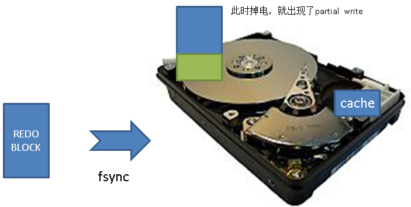
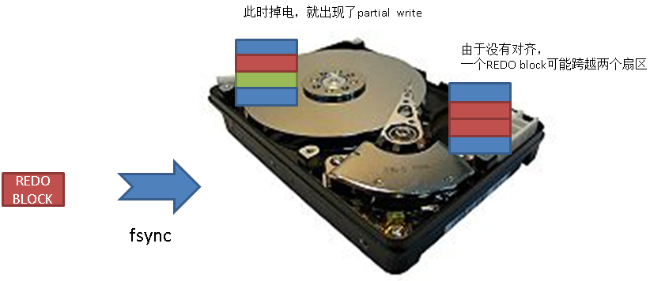
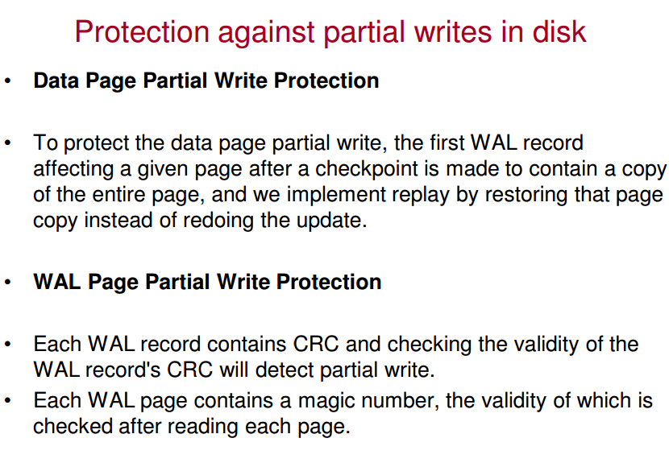

## PostgreSQL 可靠性分析 - 关于redo block原子写  
               
### 作者             
digoal              
              
### 日期            
2016-10-11              
              
### 标签            
PostgreSQL , redo , redo block 原子写 , 可靠性分析     
              
----            
              
## 背景   
PostgreSQL 可靠性与大多数关系数据库一样，都是通过REDO来保障的。  
     
群里有位童鞋问了一个问题，为什么PostgreSQL的REDO块大小默认是8K的，不是512字节。    
     
这位童鞋提问的理由是，大多数的块设备扇区大小是512字节的，512字节可以保证原子写，而如果REDO的块大于512字节，可能会出现partial write。   
     
那么PostgreSQL的redo(wal) 块大小设置为8KB时，靠谱吗？本文将给大家分析一下。    
  
## 什么情况下会出现partial write?  
1\. 当开启了易失缓存时，如果写数据的块大小大于磁盘原子写的大小（通常为512字节），掉电则可能出现partial write。    
    
例如disk cache，没有掉电保护，而且操作系统的fsync接口不感知disk cache，如果你调用了fsync，即使返回成功，数据其实可能还在disk cache里面。  
    
当发生掉电时，在disk cache里的数据会丢失掉，如果程序写一个8K的数据，因为磁盘的原子写小于8K，则可能出现8K里有些写成功了，有些没有写成功，即partial write。    
    
    
    
(ps: 某些企业级SSD可以通过电容残余的电量，将DISK CACHE里的数据持久化下来，但是请不要相信所有磁盘都有这个功能)    
    
2\. 当开启了易失缓存时，如果写数据的块大小小于或等于磁盘原子写的大小(即"原子写")，掉电时也可能出现partial write。    
  
对于MySQL来说，REDO的写为512字节的，其中包含12个字节的头信息，4个字节的校验信息。    
  
这个怎么理解呢，为什么没有对齐则可能出现。  
  
    
  
## 不对齐的坏处
1\. 前面提到了，如果没有对齐，并且开启了易失缓存，原子写是没有用的，同样会出现partial write。  
  
2\. 如果没有对齐，会造成写放大，本来写512字节的，磁盘上会造成写1024字节(将两个扇区数据读出来再与要写的数据合并,  分成两个扇区回写)。  
  
## 原子写不能抵御什么风险？  
1\. 开启易失缓存时，原子写一样会丢失易失缓存中的数据。  
  
2\. 当未对齐时，原子写并不是真的原子写。  
  
数据库只靠REDO的原子写，如果不考虑以上两个因素，起不到保证数据可靠性和一致性的作用。  
    
## PostgreSQL如何保证数据库可靠性
1\. shared buffer 中的dirty page在write前，必须要保证对应的redo已经持久化（指已经落到非易失存储介质）。    
  
2\. 在检查点后出现的脏页，必须要在redo中写dirty page的full page。    
    
这2条保证的是数据文件的一致性。  
  
3\. 在不考虑standby的情况下，当设置为同步提交的事务在事务提交时，必须等待事务产生的REDO已持久化才返回（指已经落到非易失存储介质）。    
  
参考  
  
[《PostgreSQL 9.6 同步多副本 与 remote_apply事务同步级别》](20161006_02.md)  
  
4\. 当设置为异步提交的事务在事务提交时，不需要等待事务产生的REDO持久化。  
  
由于有第一条的保护，所以即使使用异步事务，丢失REDO buffer中的数据后，也不会出现不一致（比如一半提交，一半未提交）的情况，仅仅丢失redo buffer中未提交的事务而已。  
  
一致性由PostgreSQL MVCC的机制来保证，不会读到脏数据。    
  
## 建议
1\. 在使用COW的文件系统（如btrfs, zfs）时，可以关闭full page write，因为这种文件系统可以保证不会出现partial write。  
  
2\. 对齐，可以避免写放大的问题。  
  
3\. 不要使用易失缓存，但是可以使用有掉电保护的易失缓存。   
  
PostgreSQL认为系统提供的fsync调用是可靠的，即写到了持久化的存储。  
    
如果连fsync都不可靠了，管它是不是原子写，都是不可靠的。  
  
包括DirectIO在内(PostgreSQL支持REDO使用DirectIO)，也无法感知disk cache，所以请慎重。  
  
## PostgreSQL redo block不是原子写，安全吗?  
首先，前面已经分析了，原子写并不能抵御易失存储导致的丢数据。  
  
1\. PostgreSQL redo block是有checksum的，可以保证块的一致性，不会APPLY不一致的块。  
  
2\. 事务提交时，返回给用户前，一定会保证REDO已持久化。  
  
所以用户收到反馈的事务，一定是持久化的，不可能存在partial write。   
  
而没有收到反馈或未结束的事务，才有可能包含partial write，那么问题就简化了：  
  
这些没有收到反馈或未结束的事务产生的REDO 出现partial write会不会导致数据不一致？    
  
回答是不会，参考前面 "PostgreSQL如何保证数据库可靠性"，MVCC机制可以保证这些 。     
    
## 模拟redo block partial write
数据库参数  
```
wal_level = logical  

便于观察，验证  
```
  
产生测试数据  
```
pgbench -i -s 100
```
  
模拟压力测试  
```
pgbench -M prepared -n -r -P 2 -c 32 -j 32 -T 1000
```
  
观测到产生了一些XLOG，约200秒后，测试过程中强制停库，下次启动会进入恢复状态  
```
pg_ctl stop -m immediate 
```
  
记录接下来要纂改的REDO文件以及之前的文件最后的内容    
    
纂改的前一个文件的末尾的一些内容，用于判断已持久化的记录    
能看到几笔commit rec就行了
```
pg_xlogdump -b 0000000100000116000000F7 0000000100000116000000F7 | tail -n 20

rmgr: Heap2       len (rec/tot):      8/    58, tx:          0, lsn: 116/F7FFFA80, prev 116/F7FFFA50, desc: CLEAN remxid 772066680
        blkref #0: rel 1663/13241/38254 fork main blk 90969

772208346已持久化  
rmgr: Transaction len (rec/tot):     20/    46, tx:  772208346, lsn: 116/F7FFFAC0, prev 116/F7FFFA80, desc: COMMIT 2016-10-11 15:04:16.395000 CST
rmgr: Heap        len (rec/tot):      3/    79, tx:  772208353, lsn: 116/F7FFFAF0, prev 116/F7FFFAC0, desc: INSERT off 130
        blkref #0: rel 1663/13241/38242 fork main blk 17723
rmgr: Heap        len (rec/tot):     14/   163, tx:  772208368, lsn: 116/F7FFFB40, prev 116/F7FFFAF0, desc: HOT_UPDATE off 71 xmax 772208368 ; new off 76 xmax 0
        blkref #0: rel 1663/13241/38254 fork main blk 90969
rmgr: Heap2       len (rec/tot):      8/    58, tx:          0, lsn: 116/F7FFFBE8, prev 116/F7FFFB40, desc: CLEAN remxid 772061924
        blkref #0: rel 1663/13241/38254 fork main blk 37123
rmgr: Heap        len (rec/tot):     14/    74, tx:  772208358, lsn: 116/F7FFFC28, prev 116/F7FFFBE8, desc: HOT_UPDATE off 22 xmax 772208358 ; new off 25 xmax 0
        blkref #0: rel 1663/13241/38251 fork main blk 34
rmgr: Heap        len (rec/tot):     14/    78, tx:  772208360, lsn: 116/F7FFFC78, prev 116/F7FFFC28, desc: HOT_UPDATE off 121 xmax 772208360 ; new off 123 xmax 0
        blkref #0: rel 1663/13241/38245 fork main blk 124

772208344已持久化  
rmgr: Transaction len (rec/tot):     20/    46, tx:  772208344, lsn: 116/F7FFFCC8, prev 116/F7FFFC78, desc: COMMIT 2016-10-11 15:04:16.395018 CST
rmgr: Heap        len (rec/tot):     14/   163, tx:  772208369, lsn: 116/F7FFFCF8, prev 116/F7FFFCC8, desc: HOT_UPDATE off 67 xmax 772208369 ; new off 73 xmax 0
        blkref #0: rel 1663/13241/38254 fork main blk 37123
rmgr: Heap        len (rec/tot):     14/    78, tx:  772208355, lsn: 116/F7FFFDA0, prev 116/F7FFFCF8, desc: HOT_UPDATE off 97 xmax 772208355 ; new off 110 xmax 0
        blkref #0: rel 1663/13241/38245 fork main blk 988

772208351,772208352已持久化
rmgr: Transaction len (rec/tot):     20/    46, tx:  772208351, lsn: 116/F7FFFDF0, prev 116/F7FFFDA0, desc: COMMIT 2016-10-11 15:04:16.395031 CST
rmgr: Transaction len (rec/tot):     20/    46, tx:  772208352, lsn: 116/F7FFFE20, prev 116/F7FFFDF0, desc: COMMIT 2016-10-11 15:04:16.395031 CST
rmgr: Heap        len (rec/tot):      3/    79, tx:  772208354, lsn: 116/F7FFFE50, prev 116/F7FFFE20, desc: INSERT off 117
        blkref #0: rel 1663/13241/38242 fork main blk 17727
rmgr: Heap        len (rec/tot):      7/    53, tx:  772208357, lsn: 116/F7FFFEA0, prev 116/F7FFFE50, desc: LOCK off 133: xid 772208357 LOCK_ONLY EXCL_LOCK 
        blkref #0: rel 1663/13241/38251 fork main blk 42

已持久化
rmgr: Transaction len (rec/tot):     20/    46, tx:  772208353, lsn: 116/F7FFFED8, prev 116/F7FFFEA0, desc: COMMIT 2016-10-11 15:04:16.395037 CST
rmgr: Heap        len (rec/tot):     14/    78, tx:  772208363, lsn: 116/F7FFFF08, prev 116/F7FFFED8, desc: HOT_UPDATE off 127 xmax 772208363 ; new off 186 xmax 0
        blkref #0: rel 1663/13241/38245 fork main blk 79

已持久化
rmgr: Transaction len (rec/tot):     20/    46, tx:  772208345, lsn: 116/F7FFFF58, prev 116/F7FFFF08, desc: COMMIT 2016-10-11 15:04:16.395040 CST
rmgr: Heap        len (rec/tot):      7/    53, tx:  772208349, lsn: 116/F7FFFF88, prev 116/F7FFFF58, desc: LOCK off 154: xid 772208349 LOCK_ONLY EXCL_LOCK 
        blkref #0: rel 1663/13241/38251 fork main blk 38

查看某事务的REDO
pg_xlogdump -x 772208351 0000000100000116000000F7 0000000100000116000000F7
rmgr: Heap        len (rec/tot):     14/   163, tx:  772208351, lsn: 116/F7FFD3B8, prev 116/F7FFD378, desc: HOT_UPDATE off 8 xmax 772208351 ; new off 73 xmax 0, blkref #0: rel 1663/13241/38254 blk 69436
rmgr: Heap        len (rec/tot):     14/    78, tx:  772208351, lsn: 116/F7FFE6A0, prev 116/F7FFE660, desc: HOT_UPDATE off 17 xmax 772208351 ; new off 40 xmax 0, blkref #0: rel 1663/13241/38245 blk 117
rmgr: Heap        len (rec/tot):     14/    74, tx:  772208351, lsn: 116/F7FFF048, prev 116/F7FFEFA0, desc: HOT_UPDATE off 165 xmax 772208351 ; new off 166 xmax 0, blkref #0: rel 1663/13241/38251 blk 35
rmgr: Heap        len (rec/tot):      3/    79, tx:  772208351, lsn: 116/F7FFF7D8, prev 116/F7FFF788, desc: INSERT off 66, blkref #0: rel 1663/13241/38242 blk 17736
rmgr: Transaction len (rec/tot):     20/    46, tx:  772208351, lsn: 116/F7FFFDF0, prev 116/F7FFFDA0, desc: COMMIT 2016-10-11 15:04:16.395031 CST
```
  
被纂改的文件的头部的内容，用于判断未持久化的记录       
这里显示的都是将要纂改掉，对PG来说就是未持久化的事务，数据库恢复后是不会显示的.    
```
pg_xlogdump -b -n 20 0000000100000116000000F8 0000000100000116000000F9

纂改后，772208342这个事务将不可见
rmgr: Transaction len (rec/tot):     20/    46, tx:  772208342, lsn: 116/F8000038, prev 116/F7FFFFC0, desc: COMMIT 2016-10-11 15:04:16.395055 CST
rmgr: Heap        len (rec/tot):     14/    78, tx:  772208362, lsn: 116/F8000068, prev 116/F8000038, desc: HOT_UPDATE off 148 xmax 772208362 ; new off 154 xmax 0
        blkref #0: rel 1663/13241/38245 fork main blk 90
rmgr: Heap        len (rec/tot):     14/    78, tx:  772208365, lsn: 116/F80000B8, prev 116/F8000068, desc: HOT_UPDATE off 85 xmax 772208365 ; new off 89 xmax 0
        blkref #0: rel 1663/13241/38245 fork main blk 68
rmgr: Heap2       len (rec/tot):      8/    58, tx:          0, lsn: 116/F8000108, prev 116/F80000B8, desc: CLEAN remxid 772208308
        blkref #0: rel 1663/13241/38254 fork main blk 146480
rmgr: Heap        len (rec/tot):     14/    74, tx:  772208349, lsn: 116/F8000148, prev 116/F8000108, desc: HOT_UPDATE off 154 xmax 772208349 ; new off 155 xmax 772208349
        blkref #0: rel 1663/13241/38251 fork main blk 38
rmgr: Heap        len (rec/tot):      3/    79, tx:  772208358, lsn: 116/F8000198, prev 116/F8000148, desc: INSERT off 101
        blkref #0: rel 1663/13241/38242 fork main blk 17730
rmgr: Heap        len (rec/tot):     14/    74, tx:  772208359, lsn: 116/F80001E8, prev 116/F8000198, desc: HOT_UPDATE off 78 xmax 772208359 ; new off 85 xmax 0
        blkref #0: rel 1663/13241/38251 fork main blk 31
rmgr: Heap        len (rec/tot):     14/   163, tx:  772208370, lsn: 116/F8000238, prev 116/F80001E8, desc: HOT_UPDATE off 25 xmax 772208370 ; new off 71 xmax 0
        blkref #0: rel 1663/13241/38254 fork main blk 146480

纂改后，772208354这个事务将不可见
rmgr: Transaction len (rec/tot):     20/    46, tx:  772208354, lsn: 116/F80002E0, prev 116/F8000238, desc: COMMIT 2016-10-11 15:04:16.395071 CST
rmgr: Heap2       len (rec/tot):      8/    58, tx:          0, lsn: 116/F8000310, prev 116/F80002E0, desc: CLEAN remxid 772112027
        blkref #0: rel 1663/13241/38254 fork main blk 121847
rmgr: Heap        len (rec/tot):     14/    74, tx:  772208355, lsn: 116/F8000350, prev 116/F8000310, desc: HOT_UPDATE off 82 xmax 772208355 ; new off 86 xmax 0
        blkref #0: rel 1663/13241/38251 fork main blk 31
rmgr: Heap        len (rec/tot):     14/    78, tx:  772208366, lsn: 116/F80003A0, prev 116/F8000350, desc: HOT_UPDATE off 73 xmax 772208366 ; new off 104 xmax 0
        blkref #0: rel 1663/13241/38245 fork main blk 86
rmgr: Heap2       len (rec/tot):      8/    58, tx:          0, lsn: 116/F80003F0, prev 116/F80003A0, desc: CLEAN remxid 772176420
        blkref #0: rel 1663/13241/38254 fork main blk 162972
rmgr: Heap        len (rec/tot):     14/    74, tx:  772208363, lsn: 116/F8000430, prev 116/F80003F0, desc: HOT_UPDATE off 23 xmax 772208363 ; new off 26 xmax 0
        blkref #0: rel 1663/13241/38251 fork main blk 30
rmgr: Heap        len (rec/tot):     14/    74, tx:  772208360, lsn: 116/F8000480, prev 116/F8000430, desc: HOT_UPDATE off 164 xmax 772208360 ; new off 167 xmax 0
        blkref #0: rel 1663/13241/38251 fork main blk 35
rmgr: Heap        len (rec/tot):     14/   163, tx:  772208371, lsn: 116/F80004D0, prev 116/F8000480, desc: HOT_UPDATE off 2 xmax 772208371 ; new off 72 xmax 0
        blkref #0: rel 1663/13241/38254 fork main blk 121847

纂改后，772208358这个事务将不可见
rmgr: Transaction len (rec/tot):     20/    46, tx:  772208358, lsn: 116/F8000578, prev 116/F80004D0, desc: COMMIT 2016-10-11 15:04:16.395090 CST
rmgr: Heap2       len (rec/tot):      8/    58, tx:          0, lsn: 116/F80005A8, prev 116/F8000578, desc: CLEAN remxid 772172802
        blkref #0: rel 1663/13241/38254 fork main blk 120028
rmgr: Heap        len (rec/tot):     14/   163, tx:  772208372, lsn: 116/F80005E8, prev 116/F80005A8, desc: HOT_UPDATE off 57 xmax 772208372 ; new off 71 xmax 0
        blkref #0: rel 1663/13241/38254 fork main blk 162972

纂改后，772208350这个事务将不可见
rmgr: Transaction len (rec/tot):     20/    46, tx:  772208350, lsn: 116/F8000690, prev 116/F80005E8, desc: COMMIT 2016-10-11 15:04:16.395095 CST
...
```
  
纂改redo  
```
cd $PGDATA/pg_xlog

找到最后两个xlog文件，纂改一下offset 100字节后的中间位置，模拟partial write。   
dd if=/dev/zero of=./0000000100000116000000F8 bs=1 count=10000 skip=100
dd if=/dev/zero of=./0000000100000116000000F9 bs=1 count=10000 skip=100
```
  
启动数据库，进入恢复状态，当读到checksum不一致的block，停止继续往前，也就是说数据库恢复到这里截至。  
  
未恢复的事务造成的变更，对用户不可见。  
```
2016-10-11 15:10:49.909 CST,,,15039,,57fc9076.3abf,1,,2016-10-11 15:10:46 CST,,0,LOG,00000,"ending log output to stderr",,"Future log output will go to log destination ""csvlog"".",,,,,,"PostmasterMain, postmaster.c:1223",""

由于强制停库，数据库进入恢复状态
2016-10-11 15:10:49.910 CST,,,15042,,57fc9079.3ac2,1,,2016-10-11 15:10:49 CST,,0,LOG,00000,"database system was interrupted; last known up at 2016-10-11 15:03:14 CST",,,,,,,,"StartupXLOG, xlog.c:5934",""
2016-10-11 15:10:49.991 CST,,,15042,,57fc9079.3ac2,2,,2016-10-11 15:10:49 CST,,0,LOG,00000,"database system was not properly shut down; automatic recovery in progress",,,,,,,,"StartupXLOG, xlog.c:6414",""
2016-10-11 15:10:49.992 CST,,,15042,,57fc9079.3ac2,3,,2016-10-11 15:10:49 CST,,0,LOG,00000,"redo starts at 116/9D8E4600",,,,,,,,"StartupXLOG, xlog.c:6669",""

读到被纂改的REDO时，停止恢复
2016-10-11 15:11:21.215 CST,,,15042,,57fc9079.3ac2,4,,2016-10-11 15:10:49 CST,,0,LOG,00000,"invalid magic number 0000 in log segment 0000000100000116000000F8, offset 0",,,,,,,,"ReadRecord, xlog.c:3942",""
2016-10-11 15:11:21.215 CST,,,15042,,57fc9079.3ac2,5,,2016-10-11 15:10:49 CST,,0,LOG,00000,"redo done at 116/F7FFFF88",,,,,,,,"StartupXLOG, xlog.c:6921",""
2016-10-11 15:11:21.215 CST,,,15042,,57fc9079.3ac2,6,,2016-10-11 15:10:49 CST,,0,LOG,00000,"last completed transaction was at log time 2016-10-11 15:04:16.39504+08",,,,,,,,"StartupXLOG, xlog.c:6926",""
2016-10-11 15:11:21.216 CST,,,15042,,57fc9079.3ac2,7,,2016-10-11 15:10:49 CST,,0,LOG,00000,"checkpoint starting: end-of-recovery immediate",,,,,,,,"LogCheckpointStart, xlog.c:7949",""
2016-10-11 15:11:23.223 CST,,,15042,,57fc9079.3ac2,8,,2016-10-11 15:10:49 CST,,0,LOG,00000,"checkpoint complete: wrote 215999 buffers (1.3%); 0 transaction log file(s) added, 1 removed, 0 recycled; write=1.598 s, sync=0.405 s, total=2.006 s; sync files=20, longest=0.207 s, average=0.020 s; distance=1481838 kB, estimate=1481838 kB",,,,,,,,"LogCheckpointEnd, xlog.c:8031",""
2016-10-11 15:11:23.223 CST,,,15042,,57fc9079.3ac2,9,,2016-10-11 15:10:49 CST,,0,LOG,00000,"MultiXact member wraparound protections are now enabled",,,,,,,,"SetOffsetVacuumLimit, multixact.c:2628",""
2016-10-11 15:11:23.405 CST,,,15039,,57fc9076.3abf,2,,2016-10-11 15:10:46 CST,,0,LOG,00000,"database system is ready to accept connections",,,,,,,,"reaper, postmaster.c:2792",""
2016-10-11 15:11:23.405 CST,,,15083,,57fc909b.3aeb,1,,2016-10-11 15:11:23 CST,,0,LOG,00000,"autovacuum launcher started",,,,,,,,"AutoVacLauncherMain, autovacuum.c:416",""
```
  
验证  
```
纂改前在REDO中显示提交的事务，验证确实已提交。  
postgres=# select xmin,* from pgbench_history where xmin in (772208346,772208344,772208351,772208352,772208353,772208345);
   xmin    | tid | bid |   aid   | delta |           mtime            | filler 
-----------+-----+-----+---------+-------+----------------------------+--------
 772208345 | 109 |  76 |   96685 |  4792 | 2016-10-11 15:04:16.394519 | 
 772208353 | 657 |   1 | 7473886 |  1540 | 2016-10-11 15:04:16.394708 | 
 772208344 | 146 |  58 | 2671263 | -2297 | 2016-10-11 15:04:16.394504 | 
 772208352 |  55 |  57 | 9608997 |  2862 | 2016-10-11 15:04:16.39463  | 
 772208351 | 531 |   8 | 4235604 |  1582 | 2016-10-11 15:04:16.394601 | 
 772208346 | 105 |  83 | 5770382 |   590 | 2016-10-11 15:04:16.394542 | 
(6 rows)

纂改后在REDO中显示已提交的事务，显示未提交，所以partial write没有影响数据库的一致性。  
postgres=# select * from pgbench_history where xmin in (772208342,772208354,772208358,772208350);
 tid | bid | aid | delta | mtime | filler 
-----+-----+-----+-------+-------+--------
(0 rows)
```
  
通过检验。  
  
## PostgreSQL redo block size可配置
```
./configure --with-wal-blocksize=?

Allowed values are 1,2,4,8,16,32,64.
```
  
## 参考
  
1\. https://www.pgcon.org/2012/schedule/attachments/258_212_Internals%20Of%20PostgreSQL%20Wal.pdf    
    
如果要深入了解PostgreSQL redo的内部机制，可以参考以上文档以及源码。  
  
  
  
[Count](http://info.flagcounter.com/h9V1)          
          
          
