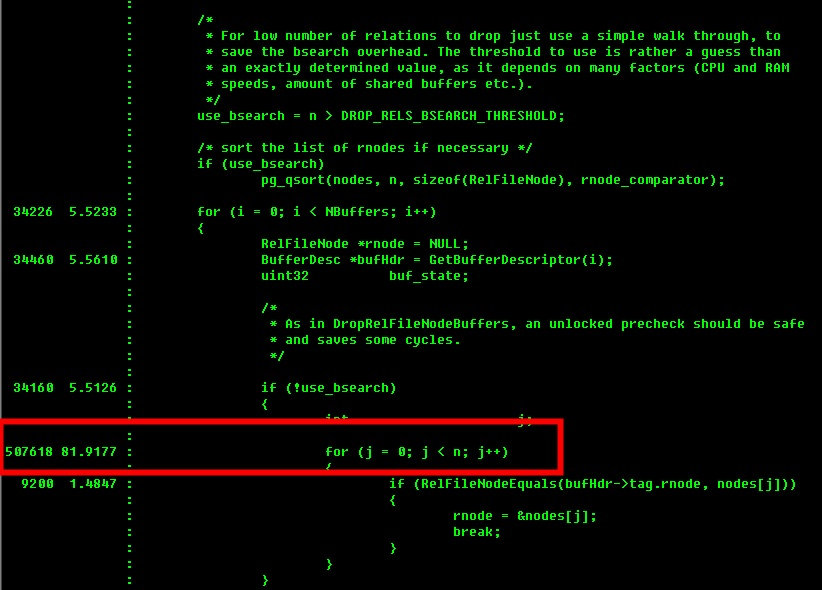

## PostgreSQL DaaS设计注意 - schema与database的抉择
            
### 作者           
digoal            
            
### 日期          
2016-10-12             
            
### 标签          
PostgreSQL , DaaS , 模板 , schema , database , apply delay , standby      
            
----          
            
## 背景    
市面上有一些提供DaaS服务的厂商，例如heroKu，可能有上百万的数据库服务；  
  
又比如提供PaaS平台的服务商，数据库也会有很多，同事这些数据库可能也是模板化的，这些厂商并不一定是为每个客户都新建一个数据库集群来满足数据库的需求。  
  
很有可能是使用数据库或者schema来隔离不同用户的。  
     
1\. 例如将模板存储在模板数据库中，根据一个模板数据库创建新的数据库提供服务。  
    
2\. 有或者将模板存储在SQL文件中，使用SQL文件构建新的SCHEMA提供服务。  
    
两种方式构建模板的差别  
  
1\. 数据库的方式隔离比较彻底，共用的资源较少。  
  
可以实现存储的隔离。  
  
可以实现connection的隔离。  
  
可以实现auth的隔离。    
  
可以实现权限的隔离。    
  
但是数据库与数据库之间是无法直接访问的，需要的话通过DBLINK或者FDW插件，当然也可以应用层面跨库访问。  
  
2\. schema的方式，共用资源较多，可以同时操作不同的schema之间的对象，事务都是本地事务。  
  
简单来说是有schema更便捷，但是权限隔离没有使用数据库那么彻底，可以从pg_class等系统表窥探到没有权限的对象的定义。  
  
从生成效率来讲，使用数据库模板的方式会高很多，因为它只需要COPY DIR，产生的REDO很少，也不需要大量的变更元数据。  
  
从删除效率来讲，差别也非常大，删除SCHEMA与创建schema一样，会产生大量的REDO，甚至会导致STANDBY剧烈的延迟，后面会有分析。而删除数据库很快，只产生少量的REDO。    
  
本文将要给大家分析的就是两者在创建和删除时的大幅差异。  
  
## 环境准备
用到两块PCI-E SSD，分别存放主库和备库。  
   
主库监听5289,备库监听5290  
  
### 配置  
1\. postgresql.conf    
```
listen_addresses = '0.0.0.0'
port = 5289
max_connections = 100
unix_socket_directories = '.'
shared_buffers = 8GB
maintenance_work_mem = 512MB
dynamic_shared_memory_type = posix
bgwriter_delay = 10ms
bgwriter_lru_maxpages = 1000
bgwriter_lru_multiplier = 10.0
wal_level = hot_standby
synchronous_commit = off
wal_buffers = 128MB
wal_writer_delay = 10ms
checkpoint_segments = 256
checkpoint_timeout = 30min
checkpoint_completion_target = 0.0001
max_wal_senders = 10
wal_keep_segments = 512
hot_standby = on
max_standby_archive_delay = 300s
max_standby_streaming_delay = 300s
wal_receiver_status_interval = 1s
hot_standby_feedback = off
random_page_cost = 1.0
log_destination = 'csvlog'
logging_collector = on
log_truncate_on_rotation = on
log_checkpoints = on
log_connections = on
log_disconnections = on
log_error_verbosity = verbose
log_timezone = 'PRC'
autovacuum = on
log_autovacuum_min_duration = 0
autovacuum_naptime = 10s
datestyle = 'iso, mdy'
timezone = 'PRC'
lc_messages = 'C'
lc_monetary = 'C'
lc_numeric = 'C'
lc_time = 'C'
default_text_search_config = 'pg_catalog.english'
max_locks_per_transaction = 1000000
```
  
2\. pg_hba.conf  
```
local   all             all                                     trust
host    all             all             127.0.0.1/32            trust
host    all             all             ::1/128                 trust
host    replication     postgres        127.0.0.1/32            trust
```
  
3\. recovery.done    
```
recovery_target_timeline = 'latest'
standby_mode = on
primary_conninfo = 'host=localhost port=5289 user=postgres'
```
  
### 创建备库
```
pg_basebackup -D /data01/digoal/pg_root5290 -F p -x -h 127.0.0.1 -p 5289 -U postgres

cd /data01/digoal/pg_root5290
mv recovery.done recovery.conf

vi postgresql.conf
port = 5290

pg_ctl start
```
  
## 准备schema
进入template1数据库，准备schema。  
  
```
\c template1 postgres
```
  
主表建表语句如下，为了让schema尽量大一些，使用这种方法来建立。    
  
```
create table test(
c0 serial  unique  check(c0>0), 
c1 serial  unique  check(c1>0), 
c2 serial  unique  check(c2>0),
c3 serial  unique  check(c3>0), 
c4 serial  unique  check(c4>0),
c5 serial  unique  check(c5>0), 
c6 serial  unique  check(c6>0),
c7 serial  unique  check(c7>0), 
c8 serial  unique  check(c8>0),
c9 serial  unique  check(c9>0), 
c10 serial unique   check(c10>0), 
c11 serial unique   check(c11>0), 
c12 serial unique   check(c12>0),
c13 serial unique   check(c13>0), 
c14 serial unique   check(c14>0),
c15 serial unique   check(c15>0), 
c16 serial unique   check(c16>0),
c17 serial unique   check(c17>0), 
c18 serial unique   check(c18>0),
c19 serial unique   check(c19>0), 
c20 serial unique   check(c20>0), 
c21 serial unique   check(c21>0), 
c22 serial unique   check(c22>0),
c23 serial unique   check(c23>0), 
c24 serial unique   check(c24>0),
c25 serial unique   check(c25>0), 
c26 serial unique   check(c26>0),
c27 serial unique   check(c27>0), 
c28 serial unique   check(c28>0),
c29 serial unique   check(c29>0), 
c30 serial unique   check(c30>0), 
c31 serial unique   check(c31>0), 
c32 serial unique   check(c32>0),
c33 serial unique   check(c33>0), 
c34 serial unique   check(c34>0),
c35 serial unique   check(c35>0), 
c36 serial unique   check(c36>0),
c37 serial unique   check(c37>0), 
c38 serial unique   check(c38>0),
c39 serial unique   check(c39>0), 
c40 serial unique   check(c40>0), 
c41 serial unique   check(c41>0), 
c42 serial unique   check(c42>0),
c43 serial unique   check(c43>0), 
c44 serial unique   check(c44>0),
c45 serial unique   check(c45>0), 
c46 serial unique   check(c46>0),
c47 serial unique   check(c47>0), 
c48 serial unique   check(c48>0),
c49 serial unique   check(c49>0), 
c50 serial unique   check(c50>0), 
c51 serial unique   check(c51>0), 
c52 serial unique   check(c52>0),
c53 serial unique   check(c53>0), 
c54 serial unique   check(c54>0),
c55 serial unique   check(c55>0), 
c56 serial unique   check(c56>0),
c57 serial unique   check(c57>0), 
c58 serial unique   check(c58>0),
c59 serial unique   check(c59>0), 
c60 serial unique   check(c60>0), 
c61 serial unique   check(c61>0), 
c62 serial unique   check(c62>0),
c63 serial unique   check(c63>0), 
c64 serial unique   check(c64>0),
c65 serial unique   check(c65>0), 
c66 serial unique   check(c66>0),
c67 serial unique   check(c67>0), 
c68 serial unique   check(c68>0),
c69 serial unique   check(c69>0), 
c70 serial unique   check(c70>0), 
c71 serial unique   check(c71>0), 
c72 serial unique   check(c72>0),
c73 serial unique   check(c73>0), 
c74 serial unique   check(c74>0),
c75 serial unique   check(c75>0), 
c76 serial unique   check(c76>0),
c77 serial unique   check(c77>0), 
c78 serial unique   check(c78>0),
c79 serial unique   check(c79>0), 
c80 serial unique   check(c80>0), 
c81 serial unique   check(c81>0), 
c82 serial unique   check(c82>0),
c83 serial unique   check(c83>0), 
c84 serial unique   check(c84>0),
c85 serial unique   check(c85>0), 
c86 serial unique   check(c86>0),
c87 serial unique   check(c87>0), 
c88 serial unique   check(c88>0),
c89 serial unique   check(c89>0), 
c90 serial unique   check(c90>0), 
c91 serial unique   check(c91>0), 
c92 serial unique   check(c92>0),
c93 serial unique   check(c93>0), 
c94 serial unique   check(c94>0),
c95 serial unique   check(c95>0), 
c96 serial unique   check(c96>0),
c97 serial unique   check(c97>0), 
c98 serial unique   check(c98>0),
c99 serial unique   check(c99>0)
);
  
create or replace function create_test(int,int) returns void as $$
declare
begin
for i in $1..$2 loop
execute 'create table test'||i||' (like test including all)';
end loop;
end;
$$ language plpgsql strict;
```
    
100个字段，每个字段都有一个约束。    
    
在数据库元数据中，也会产生一大批系统记录，例如    
    
每个表至少会新增的元数据(没算序列的，算序列还更多)    
  
```
pg_class , 101条 (表+索引) 

pg_attribute , 106条 (tableoid, cmax, cmin, xmax, xmin, ctid, 字段)  

pg_constraint , 200条 (唯一, check各100个)  

pg_depend , 401条 (表, 索引+唯一约束+check约束)(索引,唯一约束)  

pg_index , 100条 
```
    
同时还会产生很多数据文件，每个索引，表都会有一个数据文件，如果算上fork(vm, fsm, init)的话，就更多了。    
    
使用test新建500张一样的表，会产生较多的元数据变动，同时会产生一堆数据文件。    
  
```
do language plpgsql $$         
declare
  i int ;
begin
  for i in 1..500 loop
    execute 'create table test'||i||' (like test including all)';
  end loop;
end;
$$;
```
  
或者这样批量创建8\*500=4000个test\*对象    
  
```
for ((i=1;i<=8;i++)) ; do psql template1 -c "select create_test(($i-1)*500, $i*500-1);" & done
```
    
建完表后，template1就变500多MB了。    
  
```
template1=# \l+
                                                               List of databases
   Name    |  Owner   | Encoding | Collate | Ctype |   Access privileges   |  Size   | Tablespace |                Description                 
-----------+----------+----------+---------+-------+-----------------------+---------+------------+--------------------------------------------
 postgres  | postgres | UTF8     | C       | C     |                       | 1044 MB | pg_default | default administrative connection database
 template0 | postgres | UTF8     | C       | C     | =c/postgres          +| 6681 kB | pg_default | unmodifiable empty database
           |          |          |         |       | postgres=CTc/postgres |         |            | 
 template1 | postgres | UTF8     | C       | C     | =c/postgres          +| 624 MB  | pg_default | default template for new databases
           |          |          |         |       | postgres=CTc/postgres |         |            | 
```
  
## 测试drop schema
### 以template1为模板创建新数据库  
```
postgres=# create database db0 with template template1;
```
    
### 记录当前XLOG位点
```
postgres=# select pg_current_xlog_location();
-[ RECORD 1 ]------------+-----------
pg_current_xlog_location | 1/7394D08
```
  
### 删除schema
```
\c db0

drop schema public cascade;
```
  
### 记录当前XLOG位点
等待drop schema结束，并记录当前XLOG位点（很长一段时间后稳定（autovacuum）结束）  
```
db0=# select pg_current_xlog_location();
-[ RECORD 1 ]------------+-----------
pg_current_xlog_location | 1/168E6EA8
```
  
### 监控延迟
在主库执行  
```
\x

select 
pg_size_pretty(pg_xlog_location_diff(pg_current_xlog_location(),sent_location)),
pg_size_pretty(pg_xlog_location_diff(pg_current_xlog_location(),write_location)),
pg_size_pretty(pg_xlog_location_diff(pg_current_xlog_location(),flush_location)),
pg_size_pretty(pg_xlog_location_diff(pg_current_xlog_location(),replay_location)), 
* from pg_stat_replication ;

\watch 1
```
  
发现备库apply卡在一个REDO REC上很久，如果接下来主库又产生了大量的REDO，那么备库的apply就会延迟严重。  
  
主机REDO发送是没有延迟的，也就是说REDO已经在备机那里了，但是还没有被apply。  
```
-[ RECORD 1 ]----+------------------------------
pg_size_pretty   | 0 bytes
pg_size_pretty   | 0 bytes
pg_size_pretty   | 0 bytes
pg_size_pretty   | 56 MB  -- 出现apply延迟
pid              | 27375
usesysid         | 10
usename          | postgres
application_name | walreceiver
client_addr      | 127.0.0.1
client_hostname  | 
client_port      | 53164
backend_start    | 2016-10-12 10:17:16.414473+08
backend_xmin     | 2030
state            | streaming
sent_location    | 1/168E6EA8
write_location   | 1/168E6EA8
flush_location   | 1/168E6EA8
replay_location  | 1/13151E28  -- 卡住
sync_priority    | 0
sync_state       | async
```
  
备机apply延迟严重的话，另外一个问题就是备机的xlog会占用较大的空间。  
  
### 延迟分析
使用pg_xlogdump分析  "堵塞"  apply的redo rec       

```
pg_xlogdump -b 000000010000000100000013 000000010000000100000014 2>&1 |less
```
    
搜索1/13151E28  
   
```
rmgr: Transaction len (rec/tot): 17680828/17680860, tx:       2029, lsn: 1/13151E28, prev 1/13151930, bkp: 0000, desc: commit: 2016-10-12 17:04:39.615288 CST; rels: 
大量的文件位置  
base/400932/199021 base/400932/199422 base/400932/199019 base/400932/199420 base/400932/199017 base/400932/199418 base/400932/199015 base/400932/199416 base/400932/199013 
base/400932/199414 base/400932/199011 base/400932/199412 base/400932/199009 base/400932/199410 
base/400932/199007 base/400932/199408 base/400932/199005 base/400932/199406 base/400932/199003 base/400932/199404 base/400932/199001 base/400932/199402 base/400932/198999
........
........
lcache 400523 snapshot 2608 relcache 400523 snapshot 2608 snapshot 2608 relcache 400730 relcache 400523 snapshot 2608 relcache 400523 snapshot 2608 relcache 400523 snapshot 2608 snapshot 2608 relcache 400728 relcache 400523 snapshot 2608
 relcache 400523 snapshot 2608 relcache 400523 snapshot 2608 snapshot 2608 relcache 400726 relcache 400523 snapshot 2608 snapshot 2608 snapshot 2608

rmgr: Standby     len (rec/tot):     24/    56, tx:          0, lsn: 1/1423B310, prev 1/13151E28, bkp: 0000, desc: running xacts: nextXid 2030 latestCompletedXid 2029 oldestRunningXid 2030
```
  
这笔redo很大，十几MB    

```
db0=# select pg_xlog_location_diff('1/1423B310', '1/13151E28');
-[ RECORD 1 ]---------+---------
pg_xlog_location_diff | 17732840
```
    
备库apply卡住的地方，跟踪备库startup进程(用于recovery的进程)在干什么  

```
strace -p $pid  

一堆的unlink
unlink("base/400932/307422")            = 0
unlink("base/400932/307422.1")          = -1 ENOENT (No such file or directory)
unlink("base/400932/307422_fsm")        = -1 ENOENT (No such file or directory)
unlink("base/400932/307422_vm")         = -1 ENOENT (No such file or directory)
unlink("base/400932/307422_init")       = -1 ENOENT (No such file or directory)
unlink("base/400932/307420")            = 0
unlink("base/400932/307420.1")          = -1 ENOENT (No such file or directory)
unlink("base/400932/307420_fsm")        = -1 ENOENT (No such file or directory)
unlink("base/400932/307420_vm")         = -1 ENOENT (No such file or directory)
unlink("base/400932/307420_init")       = -1 ENOENT (No such file or directory)
unlink("base/400932/307418")            = 0
unlink("base/400932/307418.1")          = -1 ENOENT (No such file or directory)
unlink("base/400932/307418_fsm")        = -1 ENOENT (No such file or directory)
unlink("base/400932/307418_vm")         = -1 ENOENT (No such file or directory)
unlink("base/400932/307418_init")       = -1 ENOENT (No such file or directory)
unlink("base/400932/307416")            = 0
unlink("base/400932/307416.1")          = -1 ENOENT (No such file or directory)
unlink("base/400932/307416_fsm")        = -1 ENOENT (No such file or directory)
unlink("base/400932/307416_vm")         = -1 ENOENT (No such file or directory)
unlink("base/400932/307416_init")       = -1 ENOENT (No such file or directory)
....
还有很多
```
  
unlink返回ENOENT表示文件不存在，也就是说没有必要对这个文件调用unlink?   
  
```
man 2 unlink

       ENOENT A component in pathname does not exist or is a dangling symbolic link, or pathname is empty.
```
  
在主库跟踪主库执行drop schema cascade的PID, strace -p PID  
  
```
open("base/13269/174717", O_RDWR)       = 17
ftruncate(17, 0)                        = 0
close(17)                               = 0
unlink("base/13269/174717.1")           = -1 ENOENT (No such file or directory)
unlink("base/13269/174717_fsm")         = -1 ENOENT (No such file or directory)
unlink("base/13269/174717_vm")          = -1 ENOENT (No such file or directory)
unlink("base/13269/174717_init")        = -1 ENOENT (No such file or directory)
......

与备库有些许不同，这里执行了open, ftruncate, close，然后再执行的unlink，是否这样速度会更快？
```
  
查看一下template1下面有多少个文件，（200多个是系统自带的一些元表的数据文件）有50954多个文件。   
  
unlink这些文件至少也要耗费10几分钟。  
  
### perf top分析
```
export USE_NAMED_POSIX_SEMAPHORES=1
LIBS=-lpthread CFLAGS="-O0 -g -ggdb -fno-omit-frame-pointer" ./configure --prefix=/home/digoal/pgsql10 --enable-cassert
LIBS=-lpthread CFLAGS="-O0 -g -ggdb -fno-omit-frame-pointer" make world -j 64
LIBS=-lpthread CFLAGS="-O0 -g -ggdb -fno-omit-frame-pointer" make install-world

perf record -ag
perf report -g -v --stdio

    24.30%         postgres  /home/digoal/pgsql10/bin/postgres                                                                 0x403db2         B [.] DropRelFileNodesAllBuffers
                   |
                   --- DropRelFileNodesAllBuffers
                       smgrdounlink
                       xact_redo_abort
                       xact_redo
                       StartupXLOG
                       StartupProcessMain
                       AuxiliaryProcessMain
                       StartChildProcess
                       PostmasterMain
                       startup_hacks
                       __libc_start_main
```
  
主库执行drop schema后，数据库需要花费大量的时间查找依赖对象，观察到如下function耗时很多  
  
```
查找依赖
                           findDependentObjects                           /home/digoal/pgsql9.6/bin/postgres
处理stats entity.

             3745.00 11.3% get_tabstat_entry                              /home/digoal/pgsql9.6/bin/postgres
```
  
删除对象  
```
             5862.00 17.7% DropRelFileNodesAllBuffers                     /home/digoal/pgsql9.6/bin/postgres                                
             4058.00 12.2% smgrclose                                      /home/digoal/pgsql9.6/bin/postgres 
```
  
备库在apply时，观察到删除对象花费了更多的时间O(n^2)  
```
standby apply
            12464.00 92.5% DropRelFileNodesAllBuffers                     /home/digoal/pgsql9.6/bin/postgres          
               56.00  0.6% DropRelFileNodeBuffers                         /home/digoal/pgsql9.6/bin/postgres                                
```
     
```
src/backend/storage/buffer/bufmgr.c

/* ---------------------------------------------------------------------
 *              DropRelFileNodesAllBuffers
 *
 *              This function removes from the buffer pool all the pages of all
 *              forks of the specified relations.  It's equivalent to calling
 *              DropRelFileNodeBuffers once per fork per relation with
 *              firstDelBlock = 0.
 * --------------------------------------------------------------------
 */
void
DropRelFileNodesAllBuffers(RelFileNodeBackend *rnodes, int nnodes)
{
...............
        /*
         * For low number of relations to drop just use a simple walk through, to
         * save the bsearch overhead. The threshold to use is rather a guess than
         * an exactly determined value, as it depends on many factors (CPU and RAM
         * speeds, amount of shared buffers etc.).
         */
        use_bsearch = n > DROP_RELS_BSEARCH_THRESHOLD;

        /* sort the list of rnodes if necessary */
        if (use_bsearch)
                pg_qsort(nodes, n, sizeof(RelFileNode), rnode_comparator);

        for (i = 0; i < NBuffers; i++)
        {
```
  
```
test=# show shared_buffers ;
 shared_buffers 
----------------
 16GB
(1 row)
```
  
### 使用oprofile可以观察到问题出在这里  
[《PostgreSQL 代码性能诊断之 - OProfile & Systemtap》](../201505/20150509_01.md)    
  
  
  
**SHARED_BUFFER越大，耗时越久，把shared_buffer调到64MB这个问题就会平复很多（但是这当然不是解决之道），阿里云RDS PG在内核层面做了优化，彻底解决了这个问题，欢迎使用。**       
        
在社区的讨论贴  
  
https://www.postgresql.org/message-id/flat/20140630231741.GA30918%40alap3.anarazel.de#20140630231741.GA30918@alap3.anarazel.de  
  
```
>> compiled with -fno-omit-frame-pointer doesn't yield much more info:
> 
> You'd need to do perf record -ga instead of perf record -a to see
> additional information.
> 

Ah! That's right.

Here's how that looks:

Samples: 473K of event 'cpu-clock', Event count (approx.): 473738
+  68.42%          init  [kernel.kallsyms]                         [k] native_safe_halt
+  26.07%      postgres  postgres                                  [.] StandbyReleaseLocks
+   2.82%       swapper  [kernel.kallsyms]                         [k] native_safe_halt
+   0.19%           ssh  libcrypto.so.1.0.1e                       [.] md5_block_asm_data_order
+   0.19%      postgres  postgres                                  [.] RecordIsValid
+   0.16%           ssh  libcrypto.so.1.0.1e                       [.] RC4
+   0.10%      postgres  postgres                                  [.] hash_search_with_hash_value
+   0.06%      postgres  [kernel.kallsyms]                         [k] _spin_unlock_irqrestore
+   0.05%          init  [vmxnet3]                                 [k] vmxnet3_poll_rx_only
+   0.04%      postgres  [kernel.kallsyms]                         [k] copy_user_generic_unrolled
+   0.04%          init  [kernel.kallsyms]                         [k] finish_task_switch
+   0.04%          init  [kernel.kallsyms]                         [k] __do_softirq
+   0.04%           ssh  [kernel.kallsyms]                         [k] _spin_unlock_irqrestore
+   0.04%           ssh  [vmxnet3]                                 [k] vmxnet3_xmit_frame
+   0.03%      postgres  postgres                                  [.] PinBuffer
+   0.03%          init  [vmxnet3]                                 [k] vmxnet3_xmit_frame
+   0.03%           ssh  [kernel.kallsyms]                         [k] copy_user_generic_unrolled
+   0.03%      postgres  postgres                                  [.] XLogReadBufferExtended
+   0.03%           ssh  ssh                                       [.] 0x000000000002aa07
+   0.03%          init  [kernel.kallsyms]                         [k] _spin_unlock_irqrestore
+   0.03%           ssh  [vmxnet3]                                 [k] vmxnet3_poll_rx_only
+   0.02%           ssh  [kernel.kallsyms]                         [k] __do_softirq
+   0.02%      postgres  libc-2.12.so                              [.] _wordcopy_bwd_dest_aligned
+   0.02%      postgres  postgres                                  [.] mdnblocks
+   0.02%           ssh  libcrypto.so.1.0.1e                       [.] 0x00000000000e25a1
+   0.02%           scp  [kernel.kallsyms]                         [k] copy_user_generic_unrolled
+   0.02%           ssh  libc-2.12.so                              [.] memcpy
+   0.02%      postgres  libc-2.12.so                              [.] memcpy


> Ah ... that's more like a number I can believe something would have
> trouble coping with.  Did you see a noticeable slowdown with this?
> Now that we've seen that number, of course it's possible there was an
> even higher peak occurring when you saw the trouble.
> 
> Perhaps there's an O(N^2) behavior in StandbyReleaseLocks, or maybe
> it just takes awhile to handle that many locks.

I don't think there's a O(n^2) in StandbyReleaseLocks() itself, but in
combination with StandbyReleaseLockTree() it looks possibly bad. The
latter will call StandbyReleaseLocks() for every xid/subxid, and each of
the StandbyReleaseLocks() will then trawl the entire RecoveryLockList...

It'd probably be better to implement ReleaseLocksTree() by sorting the
subxid list and bsearch that while iterating RecoveryLockList.

Greetings,

Andres Freund
```
  
https://www.postgresql.org/message-id/flat/1b0753d6.1bcc.157da888833.Coremail.digoal%40126.com#1b0753d6.1bcc.157da888833.Coremail.digoal@126.com  
  
### 小结
1\. drop schema 产生了多少redo    
本例的测试用例，约17MB的REDO。    
  
2\. 为什么drop schema会导致standby apply的延迟严重    
大量的文件操作，导致了apply的延迟。    
  
使用drop table也一样，问题依旧  
  
```
for ((i=1;i<=4000;i++)) ; do psql template1 -c "drop table test$i" & done
```
    
## 测试基于database的DaaS
### 记录当前XLOG位点
```
postgres=# select pg_current_xlog_location();
 pg_current_xlog_location 
--------------------------
 1/168EE5F8
(1 row)
```
  
### 以template1为模板创建新数据库  
```
postgres=# create database db0 with template template1;
```
    
### 记录当前XLOG位点
```
postgres=# select pg_current_xlog_location();
 pg_current_xlog_location 
--------------------------
 1/168F0640
(1 row)
```
  
### 创建数据库产生了多少REDO   
```
postgres=# select pg_xlog_location_diff('1/168F0640', '1/168EE5F8');
-[ RECORD 1 ]---------+-----
pg_xlog_location_diff | 8264
```
  
### 删除database
```
postgres=# drop database db0;
DROP DATABASE
```
  
### 记录当前XLOG位点
```
postgres=# select pg_current_xlog_location();
 pg_current_xlog_location 
--------------------------
 1/168F20E0
(1 row)
```
  
### drop数据库产生了多少REDO   
```
postgres=# select pg_xlog_location_diff('1/168F20E0','1/168F0640');
-[ RECORD 1 ]---------+-----
pg_xlog_location_diff | 6816
```
  
### 监控延迟
在主库执行  
```
select 
pg_size_pretty(pg_xlog_location_diff(pg_current_xlog_location(),sent_location)),
pg_size_pretty(pg_xlog_location_diff(pg_current_xlog_location(),write_location)),
pg_size_pretty(pg_xlog_location_diff(pg_current_xlog_location(),flush_location)),
pg_size_pretty(pg_xlog_location_diff(pg_current_xlog_location(),replay_location)), 
* from pg_stat_replication ;

\watch 1
```
  
未发现延迟  
```
-[ RECORD 1 ]----+------------------------------
pg_size_pretty   | 0 bytes
pg_size_pretty   | 0 bytes
pg_size_pretty   | 0 bytes
pg_size_pretty   | 0 bytes
pid              | 27375
usesysid         | 10
usename          | postgres
application_name | walreceiver
client_addr      | 127.0.0.1
client_hostname  | 
client_port      | 53164
backend_start    | 2016-10-12 10:17:16.414473+08
backend_xmin     | 2046
state            | streaming
sent_location    | 1/168F20E0
write_location   | 1/168F20E0
flush_location   | 1/168F20E0
replay_location  | 1/168F20E0
sync_priority    | 0
sync_state       | async
```
  
### xlogdump分析
分析一下create 和 drop database产生的redo内容  
```
pg_xlogdump -b 000000010000000100000016 000000010000000100000016 2>&1 |less
```
  
分析从1/168EE5F8到1/168F20E0的内容全部如下  
```
rmgr: Standby     len (rec/tot):     24/    56, tx:          0, lsn: 1/168EE5F8, prev 1/168EE5A8, bkp: 0000, desc: running xacts: nextXid 2044 latestCompletedXid 2043 oldestRunningXid 2044
rmgr: Heap        len (rec/tot):     21/  6437, tx:       2044, lsn: 1/168EE630, prev 1/168EE5F8, bkp: 1000, desc: insert: rel 1664/0/12999; tid 0/24
        backup bkp #0; rel 1664/0/12999; fork: main; block: 0; hole: offset: 120, length: 1832
rmgr: Btree       len (rec/tot):     18/   618, tx:       2044, lsn: 1/168EFF58, prev 1/168EE630, bkp: 1000, desc: insert: rel 1664/0/13001; tid 1/1
        backup bkp #0; rel 1664/0/13001; fork: main; block: 1; hole: offset: 120, length: 7648
rmgr: Btree       len (rec/tot):     18/   594, tx:       2044, lsn: 1/168F01E0, prev 1/168EFF58, bkp: 1000, desc: insert: rel 1664/0/13002; tid 1/24
        backup bkp #0; rel 1664/0/13002; fork: main; block: 1; hole: offset: 120, length: 7672
rmgr: Standby     len (rec/tot):     28/    60, tx:          0, lsn: 1/168F0438, prev 1/168F01E0, bkp: 0000, desc: running xacts: nextXid 2045 latestCompletedXid 2043 oldestRunningXid 2044; 1 xacts: 2044
rmgr: XLOG        len (rec/tot):     72/   104, tx:          0, lsn: 1/168F0478, prev 1/168F0438, bkp: 0000, desc: checkpoint: redo 1/168F0438; tli 1; prev tli 1; fpw true; xid 0/2045; oid 401408; multi 1; offset 0; oldest xid 1798 in DB 1; oldest multi 1 in DB 1; oldest running xid 2044; online
rmgr: Database    len (rec/tot):     16/    48, tx:       2044, lsn: 1/168F04E0, prev 1/168F0478, bkp: 0000, desc: create db: copy dir 1/1663 to 400934/1663
rmgr: Standby     len (rec/tot):     28/    60, tx:          0, lsn: 1/168F0510, prev 1/168F04E0, bkp: 0000, desc: running xacts: nextXid 2045 latestCompletedXid 2043 oldestRunningXid 2044; 1 xacts: 2044
rmgr: XLOG        len (rec/tot):     72/   104, tx:          0, lsn: 1/168F0550, prev 1/168F0510, bkp: 0000, desc: checkpoint: redo 1/168F0510; tli 1; prev tli 1; fpw true; xid 0/2045; oid 401408; multi 1; offset 0; oldest xid 1798 in DB 1; oldest multi 1 in DB 1; oldest running xid 2044; online
rmgr: Transaction len (rec/tot):     48/    80, tx:       2044, lsn: 1/168F05B8, prev 1/168F0550, bkp: 0000, desc: commit: 2016-10-12 19:17:16.791771 CST; inval msgs: catcache 21
rmgr: Standby     len (rec/tot):     24/    56, tx:          0, lsn: 1/168F0608, prev 1/168F05B8, bkp: 0000, desc: running xacts: nextXid 2045 latestCompletedXid 2044 oldestRunningXid 2045
rmgr: Heap        len (rec/tot):     26/  6442, tx:       2045, lsn: 1/168F0640, prev 1/168F0608, bkp: 1000, desc: delete: rel 1664/0/12999; tid 0/24 KEYS_UPDATED 
        backup bkp #0; rel 1664/0/12999; fork: main; block: 0; hole: offset: 120, length: 1832
rmgr: Standby     len (rec/tot):     28/    60, tx:          0, lsn: 1/168F1F70, prev 1/168F0640, bkp: 0000, desc: running xacts: nextXid 2046 latestCompletedXid 2044 oldestRunningXid 2045; 1 xacts: 2045
rmgr: XLOG        len (rec/tot):     72/   104, tx:          0, lsn: 1/168F1FB0, prev 1/168F1F70, bkp: 0000, desc: checkpoint: redo 1/168F1F70; tli 1; prev tli 1; fpw true; xid 0/2046; oid 401408; multi 1; offset 0; oldest xid 1798 in DB 1; oldest multi 1 in DB 1; oldest running xid 2045; online
rmgr: Database    len (rec/tot):      8/    40, tx:       2045, lsn: 1/168F2030, prev 1/168F1FB0, bkp: 0000, desc: drop db: dir 400934/1663
rmgr: Transaction len (rec/tot):     48/    80, tx:       2045, lsn: 1/168F2058, prev 1/168F2030, bkp: 0000, desc: commit: 2016-10-12 19:17:30.981401 CST; inval msgs: catcache 21
rmgr: Standby     len (rec/tot):     24/    56, tx:          0, lsn: 1/168F20A8, prev 1/168F2058, bkp: 0000, desc: running xacts: nextXid 2046 latestCompletedXid 2045 oldestRunningXid 2046
```
    
create 和 drop database并没有产生很多的日志，也没有那么多的文件操作。只有copy dir和drop dir。   
    
文件操作少了，比drop schema快多了。  
    
## 打开文件描述符限制优化测试
环境：基于流复制的主备，采用异步流复制。  
  
在主库创建一个模板库，然后在模板库中创建45万张表，每张表有若干索引，约束，序列。  
  
观察主备延迟的情况。  
  
1\. 创建模板库  
  
```  
create database tmp1 with template template0;  
```  
  
2\. 连接到模板库，创建测试单表  
  
```  
\c tmp1  
  
create table public.test(  
c0 serial  unique  check(c0>0),   
c1 serial  unique  check(c1>0),   
c2 serial  unique  check(c2>0),  
c3 serial  unique  check(c3>0),   
c4 serial  ,  
c5 serial  ,   
c6 serial  ,  
c7 serial  ,   
c8 serial  ,  
c9 serial  ,   
c10 serial  ,   
c11 serial  ,   
c12 serial  ,  
c13 serial  ,   
c14 serial  ,  
c15 serial  ,   
c16 serial  ,  
c17 serial  ,   
c18 serial  ,  
c19 serial  ,   
c20 serial  ,   
c21 serial  ,   
c22 serial  ,  
c23 serial  ,   
c24 serial  ,  
c25 serial  ,   
c26 serial  ,  
c27 serial  ,   
c28 serial  ,  
c29 serial  ,   
c30 serial  ,   
c31 serial  ,   
c32 serial  ,  
c33 serial  ,   
c34 serial  ,  
c35 serial  ,   
c36 serial  ,  
c37 serial  ,   
c38 serial  ,  
c39 serial    
);  
```  
  
3\. 在模板库创建3000个schema  
  
```  
for ((i=1;i<=3000;i++)) ; do psql tmp1 -c "create schema s$i" ; done  
```  
  
1分钟内完成  
  
观察到主备无延迟  
  
```  
select pg_size_pretty(pg_xlog_location_diff(pg_current_xlog_insert_location(),sent_location)),  pg_size_pretty(pg_xlog_location_diff(pg_current_xlog_insert_location(),replay_location)) from pg_stat_replication ;  
  
\watch 1  
```  
  
4\. 每个schema创建150张表(基于模板表)，开启150个并发连接开始建表  
  
```  
vi test.sh  
  
for ((x=1;x<=150;x++)) ; do (for ((i=1;i<=3000;i++)) ; do psql tmp1 -c "create table if not exists s$i.test$x (like public.test including all)" ; done) & done  
  
chmod 500 test.sh  
  
nohup ./test.sh >/dev/null 2>&1 &  
```  
  
37分钟完成  
  
除了初始化日志，autovacuum也会产生大量的日志  
  
观察主备延迟如下   
  
发送延迟5.6GB，应用延迟15GB  
  
发送延迟多久平复：与 主备网络环境、主库XLOG读取速度、备库XLOG写入速度 有关，测试环境耗时约2分钟。  
  
应用延迟多久平复：与 备库apply速度有关（关闭备库fsync将达到0延迟目的）， 测试环境耗时约9分钟。  
  
创建完成后  
  
模板库对象数  
  
```  
select count(*) from pg_class;  
  
225 万   
```  
  
模板库大小  
  
```  
\l+  
  
47 GB   
```  
  
5\. 主库执行检查点  
  
```  
checkpoint;  
```  
  
观察主备延迟，备库checkpoint进程，CPU 100%，维持了约7小时。  
  
strace -p checkpoint观察到缓慢的close(xxx)。  
  
perf 跟踪结果   
  
```
perf record -avg -p checkpoint进程PID

perf report --stdio

    99.74%  postgres  postgres           [.] remove_from_unowned_list
            |
            --- remove_from_unowned_list
                smgrclose
                smgrcloseall
                CheckpointerMain
                AuxiliaryProcessMain
                StartChildProcess
                sigusr1_handler
                __restore_rt
                PostmasterMain
                startup_hacks
                __libc_start_main
```
  
跟踪到备库bgwriter进程也是100%  
  
```
    99.78%  postgres  postgres           [.] remove_from_unowned_list
            |
            --- remove_from_unowned_list
                smgrclose
                smgrcloseall
                BackgroundWriterMain
                AuxiliaryProcessMain
                StartChildProcess
                sigusr1_handler
                __restore_rt
                PostmasterMain
                startup_hacks
                __libc_start_main
```
  
不过还好备库的checkpoint进程可以被startup进程打断，因此不会堵塞恢复。  
  
```
close(149466)                           = 0
close(137674)                           = 0
close(895987)                           = 0
--- SIGINT (Interrupt) @ 0 (0) ---
rt_sigreturn(0x7facea633e3c)            = 217400424
close(438148)                           = 0
close(541088)                           = 0
```
  
如果备库的max_files_per_process足够大（比如本文的CASE有几百万个小文件），max_files_per_process设置为100万的话，备库不会遇到checkpoint问题，即使有，重启备库马上就可以消失。  
   
使用oprofile或systemtap跟踪参考:   
  
[《PostgreSQL 代码性能诊断之 - OProfile & Systemtap》](../201505/20150509_01.md)    
  
6\. 创建数据库(使用前面创建的模板库)  
  
```  
create database test with template tmp1;  
```  
  
耗时4分钟 。  
  
备库XLOG延迟360字节 。    
  
备库XLOG延迟平复时间  6分钟 。   
  
```  
备库startup进程strace跟踪，涉及大量文件操作，因为这个库涉及到的文件数有2252981个。    
  
lstat("base/16384/12976402", {st_mode=S_IFREG|0600, st_size=0, ...}) = 0  
open("base/16384/12976402", O_RDONLY)   = 12  
open("base/24795111/12976402", O_RDWR|O_CREAT|O_EXCL, 0600) = 13  
read(12, "", 65536)                     = 0  
close(13)                               = 0  
close(12)                               = 0  
lstat("base/16384/305700", {st_mode=S_IFREG|0600, st_size=8192, ...}) = 0  
open("base/16384/305700", O_RDONLY)     = 12  
open("base/24795111/305700", O_RDWR|O_CREAT|O_EXCL, 0600) = 13  
read(12, "\0\0\0\0\30p\234+\0\0\0\0000\0\360\37\360\37\4 \0\0\0\0b1\5\0\2\0\0\0"..., 65536) = 8192  
write(13, "\0\0\0\0\30p\234+\0\0\0\0000\0\360\37\360\37\4 \0\0\0\0b1\5\0\2\0\0\0"..., 8192) = 8192  
sync_file_range(0xd, 0, 0x2000, 0x2)    = 0  
read(12, "", 65536)                     = 0  
close(13)                               = 0  
close(12)                               = 0  
lstat("base/16384/639437", {st_mode=S_IFREG|0600, st_size=8192, ...}) = 0  
```  
  
7\. 删除单个schema   
  
```  
\c test  
  
drop schema s1 cascade;  
```  
  
耗时3秒 。  
  
备库XLOG延迟773字节 。    
  
备库XLOG延迟平复时间  27秒 。   
  
相差9倍的时间。所以你需要注意这一点。  
  
8\. 删除刚刚创建的数据库  
  
```  
drop database  test;  
```  
  
耗时1分钟 。  
  
备库XLOG延迟176字节 。    
  
备库XLOG延迟平复时间  30秒，实际上没有差别，因为drop database结束后，才产生XLOG，然后这笔XLOG还需要在备库apply，所以drop database实际上是没有延迟的 。  
  
9\. 多次通过模板创建并删除（非常多小文件的）数据库，依旧会导致备库startup进程慢，延迟   
  
```
create database test1 with template tmp1;
drop database test1;
```
  
```
startup perf

    99.76%  postgres  postgres           [.] remove_from_unowned_list
            |
            --- remove_from_unowned_list
                smgrclose
                smgrcloseall
                XLogDropDatabase
                dbase_redo
                StartupXLOG
                StartupProcessMain
                AuxiliaryProcessMain
                StartChildProcess
                PostmasterMain
                startup_hacks
                __libc_start_main
```
  
#### 奇怪现象
有几次startup, checkpoint进程CPU 100%，卡在close()系统调用时，使用pg_ctl stop -m immediate强行关库后，重启，就快了。    
  
猜测mark一下，回头看看代码，难道shared buffer中存储了什么fd list？停库后没有了，所以不需要挨个close()快了？   
  
src/backend/catalog/storage.c   
  
```
typedef struct PendingRelDelete
{
        RelFileNode relnode;            /* relation that may need to be deleted */
        BackendId       backend;                /* InvalidBackendId if not a temp rel */
        bool            atCommit;               /* T=delete at commit; F=delete at abort */
        int                     nestLevel;              /* xact nesting level of request */
        struct PendingRelDelete *next;          /* linked-list link */
} PendingRelDelete;


/*
 * RelationDropStorage
 *              Schedule unlinking of physical storage at transaction commit.
 */
void
RelationDropStorage(Relation rel)
{
        PendingRelDelete *pending;

        /* Add the relation to the list of stuff to delete at commit */
        pending = (PendingRelDelete *)
                MemoryContextAlloc(TopMemoryContext, sizeof(PendingRelDelete));
        pending->relnode = rel->rd_node;
        pending->backend = rel->rd_backend;
        pending->atCommit = true;       /* delete if commit */
        pending->nestLevel = GetCurrentTransactionNestLevel();
        pending->next = pendingDeletes;
        pendingDeletes = pending;

        /*
         * NOTE: if the relation was created in this transaction, it will now be
         * present in the pending-delete list twice, once with atCommit true and
         * once with atCommit false.  Hence, it will be physically deleted at end
         * of xact in either case (and the other entry will be ignored by
         * smgrDoPendingDeletes, so no error will occur).  We could instead remove
         * the existing list entry and delete the physical file immediately, but
         * for now I'll keep the logic simple.
         */

        RelationCloseSmgr(rel);
}
```
  
### 优化  
1\. 修改操作系统打开文件限制  
  
```  
vi /etc/sysctl.conf  
  
fs.nr_open=10240000  
  
sysctl -p  
```  
  
```  
vi /etc/security/limits.conf  
  
* soft    nofile  10240000  
* hard    nofile  10240000  
```  
  
2\. 修改数据库打开文件限制  
  
```  
vi postgresql.conf  
  
max_files_per_process = 2048000  
```  
  
3\. 使用新的ulimit值，重启数据库  
  
通常退出Linux会话，重新登录即可  
  
```  
pg_ctl restart -m fast  
```  
  
4\. 备库关闭 fsync 将缩短至几乎0延迟  
  
在有多个备库的情况下，如果考虑性能，关闭某些备库的fsync也未尝不可。  
  
例如内存数据库voltdb，就是类似的。  

# 补充(20180808)
  
## schema实现多租户  
  
1、不同租户数据放在不同的schema下面  
  
2、通过设置search_path，访问不同schema下面的数据。（如此，不需要每次都引用schema name）  
  
3、当租户需要独立计费时，可以将租户整个schema的数据从共享实例中迁移到独立实例。  
  
### 好处  
  
1、相比DB模式，SCHEMA模式下连接可以复用。(ip:port:user:pwd:db) ，同一个用户连接同一个DB的连接，可以复用。  
  
2、多租户隔离后，数据按租户分别存储，IO放大减少，提升性能。  
  
3、schema提供了一定的隔离性。权限、存储。  
  
4、相比DB节约元数据资源（INODE），DB为单位  
  
5、相比租户数据混合存到同样的表里面，使用租户字段的方式隔离。SCHEAM降低了单表大小，同时隔离了数据，查询，写入效率更佳。  
  
6、相比使用分区的方式。SCHEAM的方式完全可以模板化，而分区不行，也不利于方便的剥离租客。  
  
7、、好迁移，一个租户的数据在同一个schema里面，整个schema迁移。  
  
8、好升级扩容，租户的数据分布在不同的schema里面，升级单个租户的数据库时，迁移到新实例即可。  
  
  
### 内核层面增强  
PostgreSQL增加了一个application_name参数，可以识别会话  
  
通过增加对application_name的识别（不同租户使用同一个用户连接，但是使用不同的application_name），提供一些限流功能（权限，连接数，资源限制等）。  
  
## 小结
1\. schema和database在物理结构上的差别  
  
database是以目录的形式组织在表空间的目录下的，而schema是以文件的形式在数据库的目录下的，没有再细分独立的目录。   
  
所以在drop database时系统调用变得更简单，而drop schema需要挨个文件来。  
  
2\. schema和database在元数据上的差别  
  
简单来说就是比擦屁股的动作, drop database擦屁股很快，因为元数据很少只影响pg_databases。    
  
drop schema擦屁股就很烦了，要挨个清理pg_class, pg_attribute, 等等元表。 ?元表清理完还需要vacuum。   
  
3\. create 和 drop schema的文件操作很多，是一个个文件进行的，而且都会记录在REDO中，如果schema中有很对对象并且有很多文件的话，会非常慢。  
        
4\. create 和 drop database产生的日志少，系统调用也更少。   
      
schema不建议作为daas的模板环境频繁(新增和删除时)使用，如果要频繁的创建和删除模板，建议使用database作为模板。 ?
    
database作为模板的一个缺点是连接复用的问题，因为连接复用需要基于user+database，如果有很多DB的话，连接可能会消耗很多。    
  
5\. 当数据库中有很多实体对象时，文件数会非常庞大，而对于Linux操作系统来说，单个进程的打开文件数是有限制的。PostgreSQL数据库新增了一层文件句柄管理，使用文件句柄池来管理文件的打开和关闭。  
  
但是如果需要打开或关闭的文件数特别多（例如 某个业务一下子创建了几十万张表，然后做检查点），文件句柄池就会不停的切换，成为系统的瓶颈。  
  
所以增加进程的打开文件句柄限制，也是优化方法之一。  
  
## drop schema的数据库内核优化点
把schema放到database下，新增一个目录存放。删除的时候可以drop dir，但是清理元数据还是少不了的。    
  
schema与其他schema之间的一些依赖关系也需要清理(可能涉及元数据的清理)。    
  
## 社区内核已优化解决

https://git.postgresql.org/gitweb/?p=postgresql.git;a=commit;h=b41669118c00e25376a6c9ac991e0d074990484a  
  
   
        
  
<a rel="nofollow" href="http://info.flagcounter.com/h9V1"  ></a>  
  
  
  
  
  
  
## [digoal's 大量PostgreSQL文章入口](https://github.com/digoal/blog/blob/master/README.md "22709685feb7cab07d30f30387f0a9ae")
  
