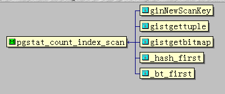
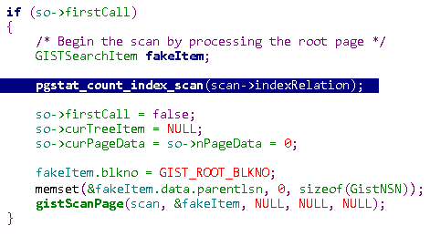
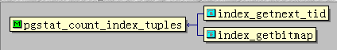
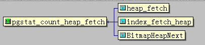
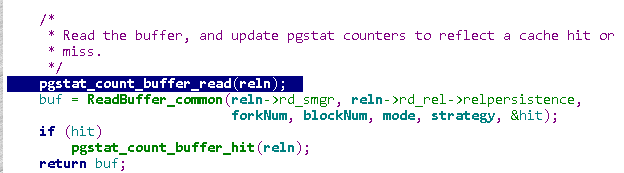
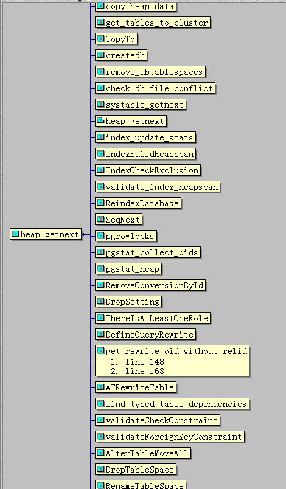

## PostgreSQL pg_stat_ pg_statio_ 统计信息(scan,read,fetch,hit)源码解读      
                
### 作者               
digoal                
                
### 日期              
2016-10-18                 
                
### 标签              
PostgreSQL , pg_stat_ , pg_statio_ , 统计信息 , scan , read , fetch , hit                  
                  
----              
        
## 背景    
PostgreSQL 几个统计信息的解释难以理解，本文花一些时间从源码的角度来解释一下。让大家对这几个容易误解的统计值有更好的理解。      
    
比较难理解的几个统计值为：    
    
pg_stat_all_indexes 的    
    
```  
idx_scan           
idx_tup_read        
idx_tup_fetch       
```  
    
pg_statio_all_indexes 的    
    
```  
idx_blks_read      
idx_blks_hit      
```  
    
pg_stat_all_tables 的    
    
```  
seq_scan      
seq_tup_read      
idx_scan      
idx_tup_fetch      
```  
    
pg_statio_all_tables 的    
    
```  
heap_blks_read       
heap_blks_hit        
idx_blks_read        
idx_blks_hit         
toast_blks_read     heap表对应的toast表统计字段       
toast_blks_hit            
tidx_blks_read      heap表的索引对应的toast索引统计字段       
tidx_blks_hit        
```  
    
## 统计信息来源  
首先需要获得以上统计字段的信息来源：    
    
```  
postgres=# \d+ pg_stat_all_indexes       
           View "pg_catalog.pg_stat_all_indexes"      
    Column     |  Type  | Modifiers | Storage | Description       
---------------+--------+-----------+---------+-------------      
 relid         | oid    |           | plain   |       
 indexrelid    | oid    |           | plain   |       
 schemaname    | name   |           | plain   |       
 relname       | name   |           | plain   |       
 indexrelname  | name   |           | plain   |       
 idx_scan      | bigint |           | plain   | --     pg_stat_get_numscans(i.oid)      
 idx_tup_read  | bigint |           | plain   | --     pg_stat_get_tuples_returned(i.oid)      
 idx_tup_fetch | bigint |           | plain   | --     pg_stat_get_tuples_fetched(i.oid)      
View definition:      
 SELECT c.oid AS relid,      
    i.oid AS indexrelid,      
    n.nspname AS schemaname,      
    c.relname,      
    i.relname AS indexrelname,      
    pg_stat_get_numscans(i.oid) AS idx_scan,      
    pg_stat_get_tuples_returned(i.oid) AS idx_tup_read,      
    pg_stat_get_tuples_fetched(i.oid) AS idx_tup_fetch      
   FROM pg_class c      
     JOIN pg_index x ON c.oid = x.indrelid      
     JOIN pg_class i ON i.oid = x.indexrelid      
     LEFT JOIN pg_namespace n ON n.oid = c.relnamespace      
  WHERE c.relkind = ANY (ARRAY['r'::"char", 't'::"char", 'm'::"char"]);      
  
postgres=# \d+ pg_statio_all_indexes       
          View "pg_catalog.pg_statio_all_indexes"      
    Column     |  Type  | Modifiers | Storage | Description       
---------------+--------+-----------+---------+-------------      
 relid         | oid    |           | plain   |       
 indexrelid    | oid    |           | plain   |       
 schemaname    | name   |           | plain   |       
 relname       | name   |           | plain   |       
 indexrelname  | name   |           | plain   |       
 idx_blks_read | bigint |           | plain   | --  pg_stat_get_blocks_fetched(i.oid) - pg_stat_get_blocks_hit(i.oid)      
 idx_blks_hit  | bigint |           | plain   | --  pg_stat_get_blocks_hit(i.oid)      
View definition:      
 SELECT c.oid AS relid,      
    i.oid AS indexrelid,      
    n.nspname AS schemaname,      
    c.relname,      
    i.relname AS indexrelname,      
    pg_stat_get_blocks_fetched(i.oid) - pg_stat_get_blocks_hit(i.oid) AS idx_blks_read,      
    pg_stat_get_blocks_hit(i.oid) AS idx_blks_hit      
   FROM pg_class c      
     JOIN pg_index x ON c.oid = x.indrelid      
     JOIN pg_class i ON i.oid = x.indexrelid      
     LEFT JOIN pg_namespace n ON n.oid = c.relnamespace      
  WHERE c.relkind = ANY (ARRAY['r'::"char", 't'::"char", 'm'::"char"]);      
  
postgres=# \d+ pg_stat_all_tables       
                        View "pg_catalog.pg_stat_all_tables"      
       Column        |           Type           | Modifiers | Storage | Description       
---------------------+--------------------------+-----------+---------+-------------      
 relid               | oid                      |           | plain   |       
 schemaname          | name                     |           | plain   |       
 relname             | name                     |           | plain   |       
 seq_scan            | bigint                   |           | plain   | --  pg_stat_get_numscans(c.oid)      
 seq_tup_read        | bigint                   |           | plain   | --  pg_stat_get_tuples_returned(c.oid)      
 idx_scan            | bigint                   |           | plain   | --  sum(pg_stat_get_numscans(i.indexrelid))      
 idx_tup_fetch       | bigint                   |           | plain   | --  sum(pg_stat_get_tuples_fetched(i.indexrelid)) + pg_stat_get_tuples_fetched(c.oid)      
 n_tup_ins           | bigint                   |           | plain   |       
 n_tup_upd           | bigint                   |           | plain   |       
 n_tup_del           | bigint                   |           | plain   |       
 n_tup_hot_upd       | bigint                   |           | plain   |       
 n_live_tup          | bigint                   |           | plain   |       
 n_dead_tup          | bigint                   |           | plain   |       
 n_mod_since_analyze | bigint                   |           | plain   |       
 last_vacuum         | timestamp with time zone |           | plain   |       
 last_autovacuum     | timestamp with time zone |           | plain   |       
 last_analyze        | timestamp with time zone |           | plain   |       
 last_autoanalyze    | timestamp with time zone |           | plain   |       
 vacuum_count        | bigint                   |           | plain   |       
 autovacuum_count    | bigint                   |           | plain   |       
 analyze_count       | bigint                   |           | plain   |       
 autoanalyze_count   | bigint                   |           | plain   |       
View definition:      
 SELECT c.oid AS relid,      
    n.nspname AS schemaname,      
    c.relname,      
    pg_stat_get_numscans(c.oid) AS seq_scan,      
    pg_stat_get_tuples_returned(c.oid) AS seq_tup_read,      
    sum(pg_stat_get_numscans(i.indexrelid))::bigint AS idx_scan,      
    sum(pg_stat_get_tuples_fetched(i.indexrelid))::bigint + pg_stat_get_tuples_fetched(c.oid) AS idx_tup_fetch,      
    pg_stat_get_tuples_inserted(c.oid) AS n_tup_ins,      
    pg_stat_get_tuples_updated(c.oid) AS n_tup_upd,      
    pg_stat_get_tuples_deleted(c.oid) AS n_tup_del,      
    pg_stat_get_tuples_hot_updated(c.oid) AS n_tup_hot_upd,      
    pg_stat_get_live_tuples(c.oid) AS n_live_tup,      
    pg_stat_get_dead_tuples(c.oid) AS n_dead_tup,      
    pg_stat_get_mod_since_analyze(c.oid) AS n_mod_since_analyze,      
    pg_stat_get_last_vacuum_time(c.oid) AS last_vacuum,      
    pg_stat_get_last_autovacuum_time(c.oid) AS last_autovacuum,      
    pg_stat_get_last_analyze_time(c.oid) AS last_analyze,      
    pg_stat_get_last_autoanalyze_time(c.oid) AS last_autoanalyze,      
    pg_stat_get_vacuum_count(c.oid) AS vacuum_count,      
    pg_stat_get_autovacuum_count(c.oid) AS autovacuum_count,      
    pg_stat_get_analyze_count(c.oid) AS analyze_count,      
    pg_stat_get_autoanalyze_count(c.oid) AS autoanalyze_count      
   FROM pg_class c      
     LEFT JOIN pg_index i ON c.oid = i.indrelid      
     LEFT JOIN pg_namespace n ON n.oid = c.relnamespace      
  WHERE c.relkind = ANY (ARRAY['r'::"char", 't'::"char", 'm'::"char"])      
  GROUP BY c.oid, n.nspname, c.relname;      
  
postgres=# \d+ pg_statio_all_tables       
            View "pg_catalog.pg_statio_all_tables"      
     Column      |  Type  | Modifiers | Storage | Description       
-----------------+--------+-----------+---------+-------------      
 relid           | oid    |           | plain   |       
 schemaname      | name   |           | plain   |       
 relname         | name   |           | plain   |       
 heap_blks_read  | bigint |           | plain   | --  pg_stat_get_blocks_fetched(c.oid) - pg_stat_get_blocks_hit(c.oid)      
 heap_blks_hit   | bigint |           | plain   | --  pg_stat_get_blocks_hit(c.oid)      
 idx_blks_read   | bigint |           | plain   | --  sum(pg_stat_get_blocks_fetched(i.indexrelid) - pg_stat_get_blocks_hit(i.indexrelid))      
 idx_blks_hit    | bigint |           | plain   | --  sum(pg_stat_get_blocks_hit(i.indexrelid))      
 toast_blks_read | bigint |           | plain   | --  pg_stat_get_blocks_fetched(t.oid) - pg_stat_get_blocks_hit(t.oid)      
 toast_blks_hit  | bigint |           | plain   | --  pg_stat_get_blocks_hit(t.oid)      
 tidx_blks_read  | bigint |           | plain   | --  sum(pg_stat_get_blocks_fetched(x.indexrelid) - pg_stat_get_blocks_hit(x.indexrelid))      
 tidx_blks_hit   | bigint |           | plain   | --  sum(pg_stat_get_blocks_hit(x.indexrelid))      
View definition:      
 SELECT c.oid AS relid,      
    n.nspname AS schemaname,      
    c.relname,      
    pg_stat_get_blocks_fetched(c.oid) - pg_stat_get_blocks_hit(c.oid) AS heap_blks_read,      
    pg_stat_get_blocks_hit(c.oid) AS heap_blks_hit,      
    sum(pg_stat_get_blocks_fetched(i.indexrelid) - pg_stat_get_blocks_hit(i.indexrelid))::bigint AS idx_blks_read,      
    sum(pg_stat_get_blocks_hit(i.indexrelid))::bigint AS idx_blks_hit,      
    pg_stat_get_blocks_fetched(t.oid) - pg_stat_get_blocks_hit(t.oid) AS toast_blks_read,      
    pg_stat_get_blocks_hit(t.oid) AS toast_blks_hit,      
    sum(pg_stat_get_blocks_fetched(x.indexrelid) - pg_stat_get_blocks_hit(x.indexrelid))::bigint AS tidx_blks_read,      
    sum(pg_stat_get_blocks_hit(x.indexrelid))::bigint AS tidx_blks_hit      
   FROM pg_class c      
     LEFT JOIN pg_index i ON c.oid = i.indrelid      
     LEFT JOIN pg_class t ON c.reltoastrelid = t.oid      
     LEFT JOIN pg_index x ON t.oid = x.indrelid      
     LEFT JOIN pg_namespace n ON n.oid = c.relnamespace      
  WHERE c.relkind = ANY (ARRAY['r'::"char", 't'::"char", 'm'::"char"])      
  GROUP BY c.oid, n.nspname, c.relname, t.oid, x.indrelid;      
```  
    
以上几个统计字段的统计信息来自如下函数：    
    
```  
 idx_scan        | bigint |           | plain   | --  pg_stat_get_numscans(i.oid)      
 idx_tup_read    | bigint |           | plain   | --  pg_stat_get_tuples_returned(i.oid)      
 idx_tup_fetch   | bigint |           | plain   | --  pg_stat_get_tuples_fetched(i.oid)      
 idx_blks_read   | bigint |           | plain   | --  pg_stat_get_blocks_fetched(i.oid) - pg_stat_get_blocks_hit(i.oid)      
 idx_blks_hit    | bigint |           | plain   | --  pg_stat_get_blocks_hit(i.oid)      
    
 seq_scan        | bigint |           | plain   | --  pg_stat_get_numscans(c.oid)      
 seq_tup_read    | bigint |           | plain   | --  pg_stat_get_tuples_returned(c.oid)      
 idx_scan        | bigint |           | plain   | --  sum(pg_stat_get_numscans(i.indexrelid))      
 idx_tup_fetch   | bigint |           | plain   | --  sum(pg_stat_get_tuples_fetched(i.indexrelid)) + pg_stat_get_tuples_fetched(c.oid)      
 heap_blks_read  | bigint |           | plain   | --  pg_stat_get_blocks_fetched(c.oid) - pg_stat_get_blocks_hit(c.oid)      
 heap_blks_hit   | bigint |           | plain   | --  pg_stat_get_blocks_hit(c.oid)      
 idx_blks_read   | bigint |           | plain   | --  sum(pg_stat_get_blocks_fetched(i.indexrelid) - pg_stat_get_blocks_hit(i.indexrelid))      
 idx_blks_hit    | bigint |           | plain   | --  sum(pg_stat_get_blocks_hit(i.indexrelid))      
 toast_blks_read | bigint |           | plain   | --  pg_stat_get_blocks_fetched(t.oid) - pg_stat_get_blocks_hit(t.oid)      
 toast_blks_hit  | bigint |           | plain   | --  pg_stat_get_blocks_hit(t.oid)      
 tidx_blks_read  | bigint |           | plain   | --  sum(pg_stat_get_blocks_fetched(x.indexrelid) - pg_stat_get_blocks_hit(x.indexrelid))      
 tidx_blks_hit   | bigint |           | plain   | --  sum(pg_stat_get_blocks_hit(x.indexrelid))      
```  
    
这些SQL函数对应的C函数如下：    
    
```  
postgres=# \df+ pg_stat_get_numscans      
|     Source code      |                   Description                          
+----------------------+--------------------------------------------------      
| pg_stat_get_numscans | statistics: number of scans done for table/index      
    
postgres=# \df+ pg_stat_get_tuples_returned      
|         Source code         |                 Description                        
+-----------------------------+----------------------------------------------      
| pg_stat_get_tuples_returned | statistics: number of tuples read by seqscan      
    
postgres=# \df+ pg_stat_get_tuples_fetched      
|        Source code         |                   Description                         
+----------------------------+-------------------------------------------------      
| pg_stat_get_tuples_fetched | statistics: number of tuples fetched by idxscan      
    
postgres=# \df+ pg_stat_get_blocks_fetched      
|        Source code         |             Description                    
+----------------------------+--------------------------------------      
| pg_stat_get_blocks_fetched | statistics: number of blocks fetched      
    
postgres=# \df+ pg_stat_get_blocks_hit      
|      Source code       |                 Description                       
+------------------------+---------------------------------------------      
| pg_stat_get_blocks_hit | statistics: number of blocks found in cache      
```  
    
## 源码分析  
以上5个C函数的源码分析    
    
```  
pg_stat_get_numscans      
  result = (int64) (tabentry->numscans);      
    
pg_stat_get_tuples_returned      
  result = (int64) (tabentry->tuples_returned);      
    
pg_stat_get_tuples_fetched      
  result = (int64) (tabentry->tuples_fetched);      
    
pg_stat_get_blocks_fetched      
  result = (int64) (tabentry->blocks_fetched);      
    
pg_stat_get_blocks_hit      
  result = (int64) (tabentry->blocks_hit);      
```  
    
他们都是返回以下数据结构中的某项计数器的值：    
    
```  
/* ----------    
 * PgStat_StatTabEntry          The collector's data per table (or index)    
 * ----------    
 */    
typedef struct PgStat_StatTabEntry    
{    
    Oid         tableid;    
    
    PgStat_Counter numscans;    
    
    PgStat_Counter tuples_returned;    
    PgStat_Counter tuples_fetched;    
    
    PgStat_Counter tuples_inserted;    
    PgStat_Counter tuples_updated;    
    PgStat_Counter tuples_deleted;    
    PgStat_Counter tuples_hot_updated;    
    
    PgStat_Counter n_live_tuples;    
    PgStat_Counter n_dead_tuples;    
    PgStat_Counter changes_since_analyze;    
    
    PgStat_Counter blocks_fetched;    
    PgStat_Counter blocks_hit;    
    
    TimestampTz vacuum_timestamp;       /* user initiated vacuum */    
    PgStat_Counter vacuum_count;    
    TimestampTz autovac_vacuum_timestamp;       /* autovacuum initiated */    
    PgStat_Counter autovac_vacuum_count;    
    TimestampTz analyze_timestamp;      /* user initiated */    
    PgStat_Counter analyze_count;    
    TimestampTz autovac_analyze_timestamp;      /* autovacuum initiated */    
    PgStat_Counter autovac_analyze_count;    
} PgStat_StatTabEntry;    
```  
    
这些值是由pgstats进程来进行统计的    
    
```  
PgstatCollectorMain(int argc, char *argv[])      
{      
...      
    for (;;)      
    {      
        /* Clear any already-pending wakeups */      
        ResetLatch(&pgStatLatch);      
    
...      
            /*      
             * O.K. - we accept this message.  Process it.      
             */      
            switch (msg.msg_hdr.m_type)      
            {      
...      
                case PGSTAT_MTYPE_TABSTAT:      
                    pgstat_recv_tabstat((PgStat_MsgTabstat *) &msg, len);      
                    break;      
...      
    
    
/* ----------      
 * pgstat_recv_tabstat() -      
 *      
 *  Count what the backend has done.      
 * ----------      
 */      
static void      
pgstat_recv_tabstat(PgStat_MsgTabstat *msg, int len)      
{      
...      
            tabentry->numscans += tabmsg->t_counts.t_numscans;      
            tabentry->tuples_returned += tabmsg->t_counts.t_tuples_returned;      
            tabentry->tuples_fetched += tabmsg->t_counts.t_tuples_fetched;      
            tabentry->tuples_inserted += tabmsg->t_counts.t_tuples_inserted;      
            tabentry->tuples_updated += tabmsg->t_counts.t_tuples_updated;      
            tabentry->tuples_deleted += tabmsg->t_counts.t_tuples_deleted;      
            tabentry->tuples_hot_updated += tabmsg->t_counts.t_tuples_hot_updated;      
            tabentry->n_live_tuples += tabmsg->t_counts.t_delta_live_tuples;      
            tabentry->n_dead_tuples += tabmsg->t_counts.t_delta_dead_tuples;      
            tabentry->changes_since_analyze += tabmsg->t_counts.t_changed_tuples;      
            tabentry->blocks_fetched += tabmsg->t_counts.t_blocks_fetched;      
            tabentry->blocks_hit += tabmsg->t_counts.t_blocks_hit;      
...      
```  
    
tabmsg->t_counts.? 则是通过如下macro进行改写的：    
    
```  
/* nontransactional event counts are simple enough to inline */      
    
#define pgstat_count_heap_scan(rel)                                                                     \      
        do {                                                                                                                    \      
                if ((rel)->pgstat_info != NULL)                                                         \      
                        (rel)->pgstat_info->t_counts.t_numscans++;                              \      
        } while (0)      
#define pgstat_count_heap_getnext(rel)                                                          \      
        do {                                                                                                                    \      
                if ((rel)->pgstat_info != NULL)                                                         \      
                        (rel)->pgstat_info->t_counts.t_tuples_returned++;               \      
        } while (0)      
#define pgstat_count_heap_fetch(rel)                                                            \      
        do {                                                                                                                    \      
                if ((rel)->pgstat_info != NULL)                                                         \      
                        (rel)->pgstat_info->t_counts.t_tuples_fetched++;                \      
        } while (0)      
#define pgstat_count_index_scan(rel)                                                            \      
        do {                                                                                                                    \      
                if ((rel)->pgstat_info != NULL)                                                         \      
                        (rel)->pgstat_info->t_counts.t_numscans++;                              \      
        } while (0)      
#define pgstat_count_index_tuples(rel, n)                                                       \      
        do {                                                                                                                    \      
                if ((rel)->pgstat_info != NULL)                                                         \      
                        (rel)->pgstat_info->t_counts.t_tuples_returned += (n);  \      
        } while (0)      
#define pgstat_count_buffer_read(rel)                                                           \      
        do {                                                                                                                    \      
                if ((rel)->pgstat_info != NULL)                                                         \      
                        (rel)->pgstat_info->t_counts.t_blocks_fetched++;                \      
        } while (0)      
#define pgstat_count_buffer_hit(rel)                                                            \      
        do {                                                                                                                    \      
                if ((rel)->pgstat_info != NULL)                                                         \      
                        (rel)->pgstat_info->t_counts.t_blocks_hit++;                    \      
        } while (0)      
```  
    
取出每个macro对应的调用以及解释如下：    
    
pgstat_count_index_scan(idx_oid)    
    
统计指定索引的扫描次数，和扫描多少条记录无关，和node有个，一般看执行计划中，同一个索引如果在NODE中出现一次，那么就算扫描一次。    
    
       
    
       
    
pgstat_count_index_tuples(rel, n)    
    
统计从指定索引获取tid的条数    
    
       
    
pgstat_count_heap_fetch    
    
统计从使用指定索引的tid获取HEAP tuple的条数    
    
       
    
pgstat_count_buffer_read    
    
统计所有的buffer read次数, 包括在postgresql shared buffers中命中的，或者未在postgresql shared buffers中命中的。    
    
       
    
pgstat_count_buffer_hit(rel)    
    
统计在shared buffers中命中的buffer read次数。    
    
       
    
       
    
pgstat_count_heap_scan(rel)    
    
统计指定表的，全表扫描的次数，和返回的记录数无关，只和执行计划中的node相关，如果在plan中某个表只有一个seq scan的次数，则这条SQL执行一次时算一次。    
    
       
    
pgstat_count_heap_getnext(rel)    
    
指从全表扫描节点中扫描的记录数    
    
       
    
       
    
梳理一下最初的统计字段和这些macro的对应关系：    
    
pg_stat_all_indexes 的       
    
```  
idx_scan         对应  pgstat_count_index_scan(idx_oid)  产生的计数的累加      
idx_tup_read     对应  pgstat_count_index_tuples(idx_oid, n)  产生的计数的累加      
idx_tup_fetch    对应  pgstat_count_heap_fetch(idx_oid)  产生的计数的累加      
```  
    
pg_statio_all_indexes 的       
    
```  
idx_blks_read    对应  pgstat_count_buffer_read(idx_oid)  产生的计数的累加      
idx_blks_hit     对应  pgstat_count_buffer_hit(idx_oid)  产生的计数的累加      
```  
    
pg_stat_all_tables 的       
    
```  
seq_scan         对应  pgstat_count_heap_scan(tbl_oid)  产生的计数的累加      
seq_tup_read     对应  pgstat_count_heap_getnext(tbl_oid)  产生的计数的累加      
idx_scan         对应  sum( 索引 pgstat_count_index_scan(tbl_oid) )  产生的计数的累加      
idx_tup_fetch    对应  sum( 索引 pgstat_count_index_tuples(idx_oid, n) ) + pgstat_count_heap_fetch(tbl_oid)  产生的计数的累加      
```  
    
pg_statio_all_tables 的       
    
```  
heap_blks_read    对应  pgstat_count_buffer_read(tbl_oid) - pgstat_count_buffer_hit(tbl_oid)  产生的计数的累加      
heap_blks_hit     对应  pgstat_count_buffer_hit(tbl_oid)  产生的计数的累加      
idx_blks_read     对应  sum( 索引 pgstat_count_buffer_read(idx_oid) - pgstat_count_buffer_hit(idx_oid) )  产生的计数的累加      
idx_blks_hit      对应  sum( pgstat_count_buffer_hit(idx_oid) )  产生的计数的累加      
toast_blks_read   对应  pgstat_count_buffer_read(toast_oid) - pgstat_count_buffer_hit(toast_oid)  产生的计数的累加      
toast_blks_hit    对应  pgstat_count_buffer_hit(toast_oid)   产生的计数的累加      
tidx_blks_read    对应  sum( 索引 pgstat_count_buffer_read(toast_idx_oid) - pgstat_count_buffer_hit(toast_idx_oid) )  产生的计数的累加      
tidx_blks_hit     对应  sum( pgstat_count_buffer_hit(toast_idx_oid) )  产生的计数的累加      
```  
  
## 例子  
1、建表，写入100万数据，平均单个ID 1000行。    
    
```    
postgres=# create table h (id int, info text);    
CREATE TABLE    
postgres=# insert into h select random()*1000 , 'test' from generate_series(1,1000000);    
INSERT 0 1000000    
```    
    
2、创建索引    
    
```    
postgres=# create index idx_h_1 on h(id);    
CREATE INDEX    
```    
    
3、查询pg_stat_all_indexes统计信息的idx_tup_read, idx_tup_fetch    
    
```    
postgres=# select * from pg_stat_all_indexes where indexrelname='idx_h_1';    
 relid | indexrelid | schemaname | relname | indexrelname | idx_scan | idx_tup_read | idx_tup_fetch     
-------+------------+------------+---------+--------------+----------+--------------+---------------    
 35692 |      35698 | public     | h       | idx_h_1      |        0 |            0 |             0    
(1 row)    
```    
    
4、bitmapscan查询，观察idx_tup_read, idx_tup_fetch    
    
```    
postgres=# explain (analyze,verbose,timing,costs,buffers) select * from h where id=2;    
                                                     QUERY PLAN                                                          
---------------------------------------------------------------------------------------------------------------------    
 Bitmap Heap Scan on public.h  (cost=11.43..988.56 rows=994 width=9) (actual time=0.321..1.428 rows=938 loops=1)    
   Output: id, info    
   Recheck Cond: (h.id = 2)    
   Heap Blocks: exact=857    
   Buffers: shared hit=857 read=5    
   I/O Timings: read=0.054    
   ->  Bitmap Index Scan on idx_h_1  (cost=0.00..11.18 rows=994 width=0) (actual time=0.204..0.204 rows=938 loops=1)    
         Index Cond: (h.id = 2)    
         Buffers: shared read=5    
         I/O Timings: read=0.054    
 Planning Time: 0.197 ms    
 Execution Time: 1.502 ms    
(12 rows)    
```    
    
以上bitmapscan返回938行，由于使用了bitmapscan，所以idx_tup_fetch=0，但是idx_tup_read=938。下面解释为什么    
    
```    
postgres=# select * from pg_stat_all_indexes where indexrelname='idx_h_1';    
 relid | indexrelid | schemaname | relname | indexrelname | idx_scan | idx_tup_read | idx_tup_fetch     
-------+------------+------------+---------+--------------+----------+--------------+---------------    
 35692 |      35698 | public     | h       | idx_h_1      |        1 |          938 |             0    
(1 row)    
```    
    
5、index scan查询，观察idx_tup_read, idx_tup_fetch    
    
关闭bitmapscan    
    
```    
postgres=# set enable_bitmapscan = off;    
SET    
```    
    
使用index scan    
    
```    
postgres=# explain (analyze,verbose,timing,costs,buffers) select * from h where id=2;    
                                                       QUERY PLAN                                                            
-------------------------------------------------------------------------------------------------------------------------    
 Index Scan using idx_h_1 on public.h  (cost=0.42..1023.22 rows=994 width=9) (actual time=0.021..0.939 rows=938 loops=1)    
   Output: id, info    
   Index Cond: (h.id = 2)    
   Buffers: shared hit=862    
 Planning Time: 0.051 ms    
 Execution Time: 1.019 ms    
(6 rows)    
```    
    
返回938行，使用index scan，所以idx_tup_fetch=938，但是idx_tup_read=938。下面解释为什么    
    
```    
postgres=# select * from pg_stat_all_indexes where indexrelname='idx_h_1';    
 relid | indexrelid | schemaname | relname | indexrelname | idx_scan | idx_tup_read | idx_tup_fetch     
-------+------------+------------+---------+--------------+----------+--------------+---------------    
 35692 |      35698 | public     | h       | idx_h_1      |        2 |         1876 |           938    
(1 row)    
```    
    
为什么会有以上现象？    
    
bitmapscan和 index scan的获取记录方法如下：    
    
```    
bitmap scan: index -> heap blockid -> heap block scan -> recheck (filter tuple)      
    
index scan: index -> ctid (heap tuple id) -> read heap tuple     
```    
    
bitmap scan分了两个步骤，1、首先使用index 扫出HEAP BLOCK ID，2、然后有序的使用block ids扫描heap pages，从heap pages中找到所有的记录并根据索引条件再次recheck，筛选出有效记录。    
    
所以bitmapscan idx_tup_fetch = 0，是因为heap tuple不是走index leaf page的ctid直接获取的。而是通过heap block scan获取的heap tuple。    
    
index scan 的idx_tup_read可能大于idx_tup_fetch，因为index有垃圾版本，HEAP tuple也有垃圾版本。数据库并不知道index的版本是否为垃圾版本时都会被记录到idx_tup_read。但是计算idx_tup_fetch时，算的是有效tuple(所以一定不会计算垃圾tuple)。    
    
关闭自动垃圾回收，观察现象    
    
```    
postgres=# alter table h set (autovacuum_enabled =off);    
ALTER TABLE    
postgres=# delete from h where ctid = any (array ( select ctid from h where id=2 limit 100));    
DELETE 100    
```    
    
```    
postgres=# select * from pg_stat_all_indexes where indexrelname='idx_h_1';    
 relid | indexrelid | schemaname | relname | indexrelname | idx_scan | idx_tup_read | idx_tup_fetch     
-------+------------+------------+---------+--------------+----------+--------------+---------------    
 25052 |      25058 | public     | h       | idx_h_1      |        3 |         2076 |          1088    
(1 row)    
```    
    
```    
postgres=# explain (analyze,verbose,timing,costs,buffers) select * from h where id=2;    
                                                       QUERY PLAN                                                            
-------------------------------------------------------------------------------------------------------------------------    
 Index Scan using idx_h_1 on public.h  (cost=0.42..1801.36 rows=968 width=9) (actual time=0.765..1.820 rows=888 loops=1)    
   Output: id, info    
   Index Cond: (h.id = 2)    
   Buffers: shared hit=905 dirtied=1    
 Planning time: 0.076 ms    
 Execution time: 1.879 ms    
(6 rows)    
    
postgres=# select * from pg_stat_all_indexes where indexrelname='idx_h_1';    
 relid | indexrelid | schemaname | relname | indexrelname | idx_scan | idx_tup_read | idx_tup_fetch     
-------+------------+------------+---------+--------------+----------+--------------+---------------    
 25052 |      25058 | public     | h       | idx_h_1      |        4 |         3064 |          1976    
(1 row)    
    
postgres=# select 1976-1088;    
 ?column?     
----------    
      888    
(1 row)    
    
postgres=# select 3064-2076;    
 ?column?     
----------    
      988    
(1 row)    
```    
    
    
idx_tup_fetch 算的是有效heap table tuples    
    
idx_tup_read 算的是索引叶子节点的ctids（包含了100个垃圾版本）    
    
    
第一次查询时，可能设置了垃圾index leaf page ctids(因为第二次查询时，并不会计算这些垃圾版本).    
    
```    
postgres=# explain (analyze,verbose,timing,costs,buffers) select * from h where id=2;    
                                                       QUERY PLAN                                                            
-------------------------------------------------------------------------------------------------------------------------    
 Index Scan using idx_h_1 on public.h  (cost=0.42..1801.36 rows=968 width=9) (actual time=0.024..0.926 rows=888 loops=1)    
   Output: id, info    
   Index Cond: (h.id = 2)    
   Buffers: shared hit=812    
 Planning time: 0.076 ms    
 Execution time: 0.988 ms    
(6 rows)    
    
postgres=# select * from pg_stat_all_indexes where indexrelname='idx_h_1';    
 relid | indexrelid | schemaname | relname | indexrelname | idx_scan | idx_tup_read | idx_tup_fetch     
-------+------------+------------+---------+--------------+----------+--------------+---------------    
 25052 |      25058 | public     | h       | idx_h_1      |        5 |         3952 |          2864    
(1 row)    
    
postgres=# select 3952-3064;    
 ?column?     
----------    
      888    
(1 row)    
    
postgres=# select 2864-1976;    
 ?column?     
----------    
      888    
(1 row)    
```    
    
但是，在进行垃圾回收时，依旧发现index中有垃圾，所以不计数是为什么呢？：    
    
```    
postgres=# vacuum verbose h;    
psql: INFO:  vacuuming "public.h"    
psql: INFO:  scanned index "idx_h_1" to remove 200 row versions    
DETAIL:  CPU: user: 0.04 s, system: 0.00 s, elapsed: 0.04 s    
psql: INFO:  "h": removed 200 row versions in 184 pages    
DETAIL:  CPU: user: 0.01 s, system: 0.00 s, elapsed: 0.01 s    
psql: INFO:  index "idx_h_1" now contains 999800 row versions in 2749 pages    
DETAIL:  200 index row versions were removed.    
0 index pages have been deleted, 0 are currently reusable.    
CPU: user: 0.00 s, system: 0.00 s, elapsed: 0.00 s.    
psql: INFO:  "h": found 0 removable, 999800 nonremovable row versions in 5406 out of 5406 pages    
DETAIL:  0 dead row versions cannot be removed yet, oldest xmin: 71675731    
There were 0 unused item identifiers.    
Skipped 0 pages due to buffer pins, 0 frozen pages.    
0 pages are entirely empty.    
CPU: user: 0.10 s, system: 0.00 s, elapsed: 0.11 s.    
psql: INFO:  vacuuming "pg_toast.pg_toast_35692"    
psql: INFO:  index "pg_toast_35692_index" now contains 0 row versions in 1 pages    
DETAIL:  0 index row versions were removed.    
0 index pages have been deleted, 0 are currently reusable.    
CPU: user: 0.00 s, system: 0.00 s, elapsed: 0.00 s.    
psql: INFO:  "pg_toast_35692": found 0 removable, 0 nonremovable row versions in 0 out of 0 pages    
DETAIL:  0 dead row versions cannot be removed yet, oldest xmin: 71675731    
There were 0 unused item identifiers.    
Skipped 0 pages due to buffer pins, 0 frozen pages.    
0 pages are entirely empty.    
CPU: user: 0.00 s, system: 0.00 s, elapsed: 0.00 s.    
VACUUM    
```    
    
关注这个回复    
    
https://www.postgresql.org/message-id/flat/15830-bb9bb19722c42076%40postgresql.org    
    
    
    
## 小结  
pg_stat_all_indexes 的    
    
```  
idx_scan            索引被扫描了多少次，和扫描多少条记录无关，和node有关，一般看执行计划，同一个索引如果在NODE中出现一次，那么这条SQL执行时这个索引就算扫描一次。    
idx_tup_read        从指定索引的leap page获取tid的条数(tid是指向heap表数据块上某条记录的一个数据结构(即heap表行号), 如(1,10)表示heap表的1号数据块的第10条记录)    
idx_tup_fetch       从索引的tid获取到的有效HEAP tuple的记数(垃圾版本不算)（每扫一条tuple计1） (bitmap scan不会算idx_tup_fetch，因为不是从leaf page的tid去查询heap tuple获取的，而是从HEAP BLOCK id去查询heap block然后再过滤出有效tuple的)   
```  
    
pg_statio_all_indexes 的    
    
```  
idx_blks_read       该索引的buffer read记数(每读一个block记1次), 包括在postgresql shared buffers中命中的，或者未在postgresql shared buffers中命中的。    
idx_blks_hit        在postgresql shared buffers中命中的buffer read记数。    
```  
    
pg_stat_all_tables 的    
    
```  
seq_scan            全表扫描的次数    
seq_tup_read        使用全表扫描扫过的tuple条数    
idx_scan            该表的所有索引扫描次数总和    
idx_tup_fetch       该表的所有 从索引的tid获取HEAP tuple的条数    
```  
    
pg_statio_all_tables 的    
    
```  
heap_blks_read      该表的buffer read记数, 包括在postgresql shared buffers中命中的，或者未在postgresql shared buffers中命中的。    
heap_blks_hit       在postgresql shared buffers中命中的buffer read记数。    
idx_blks_read       该表所有索引 所有buffer read记数(含命中和未命中)    
idx_blks_hit        该表所有索引 在shared buffer命中的buffer read记数    
toast_blks_read     heap表对应的toast表统计字段       
toast_blks_hit          
tidx_blks_read      heap表的索引对应的toast索引统计字段       
tidx_blks_hit           
```  
    
希望能帮助到大家，还不理解就要打屁屁了。    
        
            
        
    
<a rel="nofollow" href="http://info.flagcounter.com/h9V1"  ></a>    
    
    
    
    
    
    
## [digoal's 大量PostgreSQL文章入口](https://github.com/digoal/blog/blob/master/README.md "22709685feb7cab07d30f30387f0a9ae")  
    
    
## [免费领取阿里云RDS PostgreSQL实例、ECS虚拟机](https://free.aliyun.com/ "57258f76c37864c6e6d23383d05714ea")  
    
