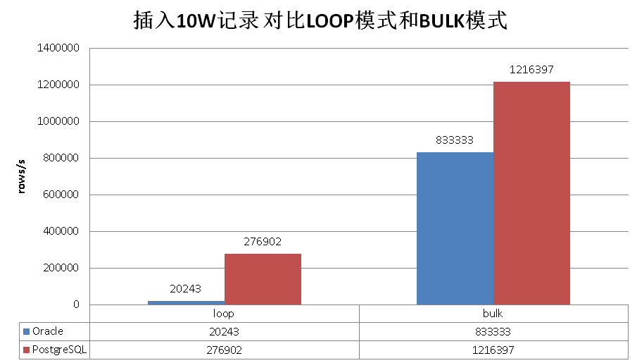
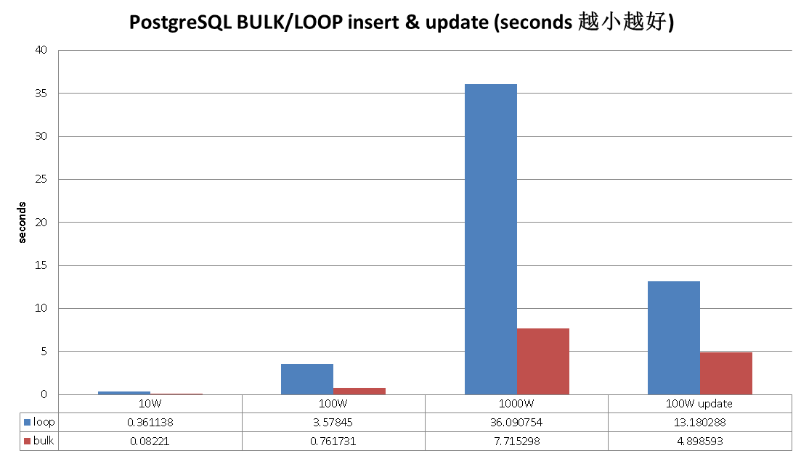
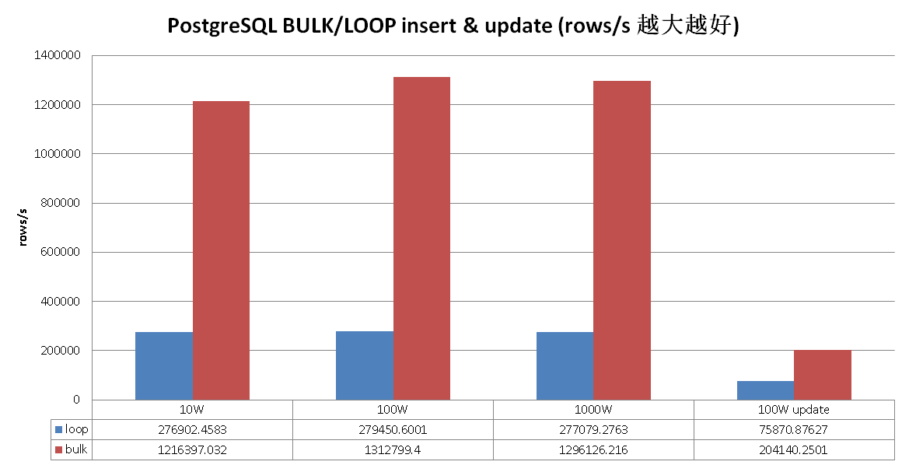
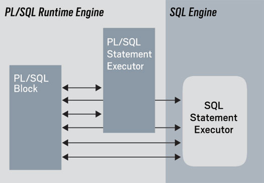

## PostgreSQL Oracle 兼容性之 - PL/SQL FORALL, BULK COLLECT
##### [TAG 21](../class/21.md)
            
### 作者           
digoal            
            
### 日期          
2016-10-18             
            
### 标签          
PostgreSQL , Oracle 兼容性 , FORALL , BULK COLLECT , PL/SQL , plpgsql         
            
----          
            
## 背景    
Bulk Collect and Binds


Bulk Collect and Binds provide extremely fast processing for
queries that perform a lot of switching between the SQL and
Stored Procedure engines.
Bulk binding is used when a SQL statement is required to
change a set of rows with a different set of values for each
row. This technique is applied by the FORALL statement. The
FORALL statement passes sets of values to the database
server in collections. This eliminates the need to reiteratively
invoke the same SQL statement with the different values.


Bulk collecting is used when a SQL statement returns
multiple rows such as in a SELECT statement, FETCH
statement, or when the RETURNING clause is used with
insertions, updates, or deletions. The BULK COLLECT clause
employs bulk collecting to return the result set in collections.
  
熟悉Oracle PL/SQL 开发的童鞋，一定对O家的bulk批量处理的性能很是赞赏吧。   
  
但是PostgreSQL用户请不要垂涎，作为学院派和工业界的一颗璀璨明珠。  
  
最高级的开源数据库PostgreSQL，也有对应的批量处理策略哦，而且性能完全不输Oracle。  
  
下面是一组LOOP和BULK的性能测试数据  

  
  
  
  
  
    
一起来耍耍吧，先看看Oracle怎么耍的。  
  
## Oracle PL/SQL FORALL, BULK COLLECT介绍
为什么Oracle的PL/SQL过程语言需要bulk处理SQL，看一张图你就明白了，因为过程语言handler和SQL之间需要切换，如果是一个较大的LOOP，切换一多，性能就会下降严重。  
  
  
  
因此对于在PL/SQL需要多次调用SQL的处理场景，Oracle想到了bulk collect的处理方法。   
  
比如用户提交一个数组，要求PL/SQL将这个数组的元素一条条插入到表里面，或者拿来更新表里面的值，又或是删除表里的值。  
  
Oracle官网的例子  
  
http://www.oracle.com/technetwork/issue-archive/2012/12-sep/o52plsql-1709862.html  
  
原始的处理方法，通过query loop来更新某个表的值，pl/sql引擎和sql引擎之间需要切换100次(即循环次数)  
  
```
Code Listing 1: increase_salary procedure with FOR loop 

PROCEDURE increase_salary (
   department_id_in   IN employees.department_id%TYPE,
   increase_pct_in    IN NUMBER)
IS
BEGIN
   FOR employee_rec
      IN (SELECT employee_id
            FROM employees
           WHERE department_id =
                    increase_salary.department_id_in)
   LOOP
      UPDATE employees emp
         SET emp.salary = emp.salary + 
             emp.salary * increase_salary.increase_pct_in
       WHERE emp.employee_id = employee_rec.employee_id;
   END LOOP;
END increase_salary;
 

Suppose there are 100 employees in department 15. When I execute this block, 

BEGIN
   increase_salary (15, .10);
END;
 

the PL/SQL engine will “switch” over to the SQL engine 100 times, once for each row being updated. Tom Kyte, of AskTom (asktom.oracle.com), refers to row-by-row switching like this as “slow-by-slow processing,” and it is definitely something to be avoided.
```
  
把它改成bluk的模式  
  
```
Code Listing 4: Bulk processing for the increase_salary procedure 

1  CREATE OR REPLACE PROCEDURE increase_salary (
 2     department_id_in   IN employees.department_id%TYPE,
 3     increase_pct_in    IN NUMBER)
 4  IS
 5     TYPE employee_ids_t IS TABLE OF employees.employee_id%TYPE
 6             INDEX BY PLS_INTEGER; -- 这里有点意思，用了某个字段作为IDX，PG里可用hstore或者一个数组来表示
 7     l_employee_ids   employee_ids_t;
 8     l_eligible_ids   employee_ids_t;
 9
10     l_eligible       BOOLEAN;
11  BEGIN
12     SELECT employee_id
13       BULK COLLECT INTO l_employee_ids  --  批量的插入到一个类似数组的对象中
14       FROM employees
15      WHERE department_id = increase_salary.department_id_in;
16
17     FOR indx IN 1 .. l_employee_ids.COUNT
18     LOOP
19        check_eligibility (l_employee_ids (indx),
20                           increase_pct_in,
21                           l_eligible);
22
23        IF l_eligible
24        THEN
25           l_eligible_ids (l_eligible_ids.COUNT + 1) :=
26              l_employee_ids (indx);
27        END IF;
28     END LOOP;
29
30     FORALL indx IN 1 .. l_eligible_ids.COUNT  -- 批处理，不需要在pl/sql和sql引擎之间多次切换了
31        UPDATE employees emp
32           SET emp.salary =
33                    emp.salary
34                  + emp.salary * increase_salary.increase_pct_in
35         WHERE emp.employee_id = l_eligible_ids (indx);
36  END increase_salary;
```
  
### 效果  
作者的描述， 插入10万记录，从4.94秒提升到了0.12秒。不过他没有给出具体的代码。    
  
```
On my laptop running Oracle Database 11g Release 2, it took 4.94 seconds to insert 100,000 rows, one at a time. With FORALL, those 100,000 were inserted in 0.12 seconds. Wow!   
```
  
## PostgreSQL plpgsql BULK SQL介绍
耍完Oracle，接下该是PostgreSQL登场了。  
  
模拟的例子是批量插入，更新，删除，或查询.  (下面是在一个虚拟机上进行的测试)    
  
我这里用了两种方法来表示批量数据，标量数组以及hstore数组。  
  
测试表  
  
```
create table test(id int, info text);
```
  
### 类似Oracle FORALL的批量插入用法1  
  
用一个数组表示条件，另一个数组表示VALUE  
  
如果有多个条件或者value时，可以用record数组或者hstore（Key-Value类型）数组来表示。  
  
```
CREATE OR REPLACE FUNCTION public.f_bulk_insert1(i_k integer[], i_v text[])
 RETURNS void
 LANGUAGE plpgsql
 STRICT
AS $function$
declare 
  i_length int := array_length(i_k,1);
  s timestamp;
  e timestamp;
begin 
  s := clock_timestamp(); 
  raise notice 'start: %', s;
  insert into test select i_k[i], i_v[i] from generate_series(1, i_length) t(i); 
  e := clock_timestamp(); 
  raise notice 'end: %, %', e, e-s; 
end;
$function$;
```
  
### 类似Oracle FORALL的批量插入用法2      
  
使用hstore表示KV  
  
```
create extension hstore;

CREATE OR REPLACE FUNCTION public.f_bulk_insert2(i_kv hstore[])
 RETURNS void
 LANGUAGE plpgsql
 STRICT
AS $function$
declare 
  i_length int := array_length(i_kv,1);
  s timestamp;
  e timestamp;
begin 
  s := clock_timestamp(); 
  raise notice 'start: %', s;
  insert into test select ((i_kv[i])->'k')::int, (i_kv[i])->'v' from generate_series(1,i_length) t(i); 
  e := clock_timestamp(); 
  raise notice 'end: %, %', e, e-s; 
end;
$function$;
```
  
### 传统的LOOP方法  
  
```
CREATE OR REPLACE FUNCTION public.f_loop_insert(i_k integer[], i_v text[])
 RETURNS void
 LANGUAGE plpgsql
 STRICT
AS $function$
declare 
  i_length int := array_length(i_k,1); 
  i int;
  s timestamp;
  e timestamp;
begin 
  s := clock_timestamp(); 
  raise notice 'start: %', s;
  for i in 1..i_length loop
    insert into test values (i_k[i], i_v[i]); 
  end loop;
  e := clock_timestamp(); 
  raise notice 'end: %, %', e, e-s; 
end;
$function$;
```
  
### 性能对比
  
插入10万  
  
```
select f_bulk_insert1(k,v) from (
  select array_agg(k) as k, array_agg(v) as v from (
    select k, md5(random()::text) v from generate_series(1,100000) t(k)
  ) t
) t;
NOTICE:  start: 2016-06-15 14:23:09.240424
NOTICE:  end: 2016-06-15 14:23:09.322634, 00:00:00.08221

select f_bulk_insert2(kv) from (
  select array_agg(kv) as kv from (
    select hstore(t) as kv from (select k, md5(random()::text) v from generate_series(1,100000) t(k)) t
  ) t
) t;
NOTICE:  start: 2016-06-15 14:23:58.59405
NOTICE:  end: 2016-06-15 14:23:58.703137, 00:00:00.109087


select f_loop_insert(k,v) from (
  select array_agg(k) as k, array_agg(v) as v from (
    select k, md5(random()::text) v from generate_series(1,100000) t(k)
  ) t
) t;
NOTICE:  start: 2016-06-15 14:24:24.598243
NOTICE:  end: 2016-06-15 14:24:24.959381, 00:00:00.361138
```

插入100万  
  
```
select f_bulk_insert1(k,v) from (
  select array_agg(k) as k, array_agg(v) as v from (
    select k, md5(random()::text) v from generate_series(1,1000000) t(k)
  ) t
) t;
NOTICE:  start: 2016-06-15 14:24:53.105227
NOTICE:  end: 2016-06-15 14:24:53.866958, 00:00:00.761731

select f_bulk_insert2(kv) from (
  select array_agg(kv) as kv from (
    select hstore(t) as kv from (select k, md5(random()::text) v from generate_series(1,1000000) t(k)) t
  ) t
) t;
NOTICE:  start: 2016-06-15 14:25:04.706203
NOTICE:  end: 2016-06-15 14:25:05.788041, 00:00:01.081838

select f_loop_insert(k,v) from (
  select array_agg(k) as k, array_agg(v) as v from (
    select k, md5(random()::text) v from generate_series(1,1000000) t(k)
  ) t
) t;
NOTICE:  start: 2016-06-15 14:25:15.812975
NOTICE:  end: 2016-06-15 14:25:19.391425, 00:00:03.57845
```
  
插入1000万  
  
```
select f_bulk_insert1(k,v) from (
  select array_agg(k) as k, array_agg(v) as v from (
    select k, md5(random()::text) v from generate_series(1,10000000) t(k)
  ) t
) t;
NOTICE:  start: 2016-06-15 14:25:46.647381
NOTICE:  end: 2016-06-15 14:25:54.362679, 00:00:07.715298

select f_bulk_insert2(kv) from (
  select array_agg(kv) as kv from (
    select hstore(t) as kv from (select k, md5(random()::text) v from generate_series(1,10000000) t(k)) t
  ) t
) t;
NOTICE:  start: 2016-06-15 14:27:24.782828
NOTICE:  end: 2016-06-15 14:27:36.035167, 00:00:11.252339

select f_loop_insert(k,v) from (
  select array_agg(k) as k, array_agg(v) as v from (
    select k, md5(random()::text) v from generate_series(1,10000000) t(k)
  ) t
) t;
NOTICE:  start: 2016-06-15 14:28:04.030109
NOTICE:  end: 2016-06-15 14:28:40.120863, 00:00:36.090754
```
  
更新测试  
  
```
drop table test;
create table test(id int primary key, info text);

select f_bulk_insert1(k,v) from (
  select array_agg(k) as k, array_agg(v) as v from (
    select k, md5(random()::text) v from generate_series(1,1000000) t(k)
  ) t
) t;

CREATE OR REPLACE FUNCTION public.f_bulk_update(i_k integer[], i_v text[])
 RETURNS void
 LANGUAGE plpgsql
 STRICT
AS $function$
declare 
  i_length int := array_length(i_k,1);
  s timestamp;
  e timestamp;
begin 
  s := clock_timestamp(); 
  raise notice 'start: %', s;
  update test set info=i_v[i] from (select i from generate_series(1, i_length) as t(i)) t where id=i_k[i]; 
  e := clock_timestamp(); 
  raise notice 'end: %, %', e, e-s; 
end;
$function$;

select f_bulk_update(k,v) from (
  select array_agg(k) as k, array_agg(v) as v from (
    select k, md5(random()::text) v from generate_series(1,1000000) t(k)
  ) t
) t;
NOTICE:  start: 2016-06-15 15:10:47.453093
NOTICE:  end: 2016-06-15 15:10:52.351686, 00:00:04.898593


CREATE OR REPLACE FUNCTION public.f_loop_update(i_k integer[], i_v text[])
 RETURNS void
 LANGUAGE plpgsql
 STRICT
AS $function$
declare 
  i_length int := array_length(i_k,1); 
  i int;
  s timestamp;
  e timestamp;
begin 
  s := clock_timestamp(); 
  raise notice 'start: %', s;
  for i in 1..i_length loop
    update test set info=i_v[i] where id=i_k[i]; 
  end loop;
  e := clock_timestamp(); 
  raise notice 'end: %, %', e, e-s; 
end;
$function$;

select f_loop_update(k,v) from (
  select array_agg(k) as k, array_agg(v) as v from (
    select k, md5(random()::text) v from generate_series(1,1000000) t(k)
  ) t
) t;
NOTICE:  start: 2016-06-15 15:11:08.170183
NOTICE:  end: 2016-06-15 15:11:21.350471, 00:00:13.180288
```
  
删除的例子就不再举例了，都差不多。  
  
### 小结
1\. Oracle PL/SQL FORALL, BULK COLLATE 模式对于LOOP次数超过一定阈值时，性能提升非常多，可能和它的PL/sql语言设计有关。  
  
2\. PostgreSQL plpgsql 语言的处理效率是非常高的，即使不使用BULK模式，你可以看到，LOOP的性能也已经非常好了，使用BULK模式后，性能更上一层。  
  
3\. 目前可能有个query cache的问题，请注意，已报给了社区。后面会有改PG内核的解决方法。   
  
https://www.postgresql.org/message-id/20160615054752.5792.1646%40wrigleys.postgresql.org  
  
（建议可以设置function 的spi次数，或者直接使用generic plan）    
  
http://blog.163.com/digoal@126/blog/static/1638770402012112452432251/  
  
测试的时候你可以先调用5次小数据了(SPI)，PLAN CACHE了再调用大的，否则会悲剧的，代码如下。    
  
```
src/backend/utils/cache/plancache.c  
static bool
choose_custom_plan(CachedPlanSource *plansource, ParamListInfo boundParams)
{

00860     /* Generate custom plans until we have done at least 5 (arbitrary) */
00861     if (plansource->num_custom_plans < 5)
00862         return true;

	if (plansource->generic_cost < avg_custom_cost)
		return false;

	return true;
```
  
改动一下代码，重新编译PG，重启数据库即可。(让它一来就使用generic plan)    
  
```
	/* Generate custom plans until we have done at least 5 (arbitrary) */
	// if (plansource->num_custom_plans < 5)
	// 	return true;
...
	if (plansource->generic_cost < avg_custom_cost)
		return false;

	// return true;
	return false;
```
  
当然最好的解决办法是做成创建函数时的option，指定这个函数是否需要custom plan.    
  
## 参考
1\. http://docs.oracle.com/cd/B19306_01/appdev.102/b14261/tuning.htm#i48876  
  
2\. http://docs.oracle.com/cd/B19306_01/appdev.102/b14261/forall_statement.htm  
  
3\. http://www.postgresql.org/docs/9.5/static/arrays.html  
  
4\. http://www.oracle.com/technetwork/issue-archive/2012/12-sep/o52plsql-1709862.html  
  
5\. http://blog.csdn.net/leshami/article/details/7536926  
  
    
        
    
  
<a rel="nofollow" href="http://info.flagcounter.com/h9V1"  ></a>  
  
  
  
  
  
  
## [digoal's 大量PostgreSQL文章入口](https://github.com/digoal/blog/blob/master/README.md "22709685feb7cab07d30f30387f0a9ae")
  
