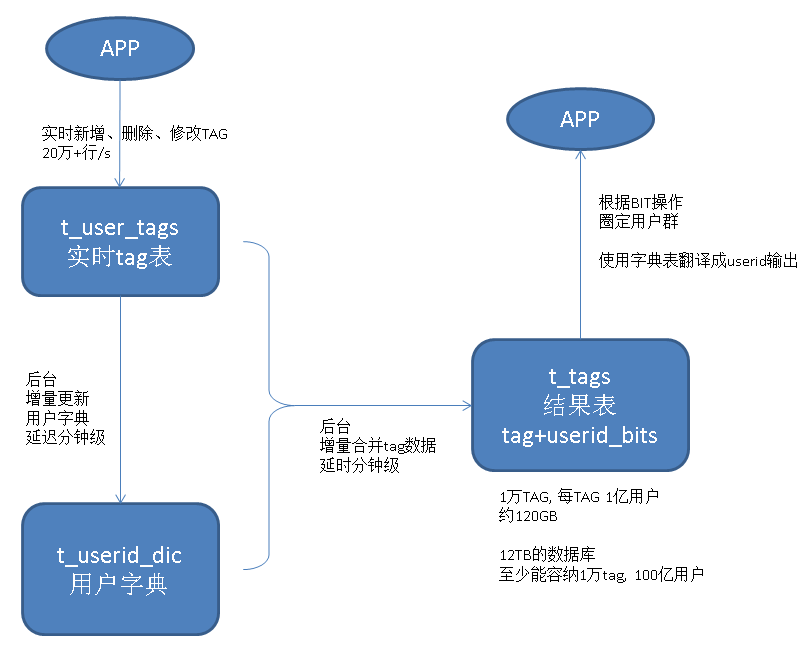

## 基于 阿里云 RDS PostgreSQL 打造实时用户画像推荐系统(varbitx)  
##### [TAG 24](../class/24.md)
            
### 作者           
digoal            
            
### 日期          
2016-10-21           
            
### 标签          
PostgreSQL , 实时推荐系统 , 用户画像 , 标签 , TAG , 比特位           
            
----          
            
## 背景
用户画像在市场营销的应用重建中非常常见，已经不是什么新鲜的东西，比较流行的解决方案是给用户贴标签，根据标签的组合，圈出需要的用户。  
  
通常画像系统会用到宽表，以及分布式的系统。  
  
宽表的作用是存储标签，例如每列代表一个标签。  
  
但实际上这种设计不一定是最优或唯一的设计，本文将以PostgreSQL数据库为基础，给大家讲解一下更加另类的设计思路，并且看看效率如何。  
  
## 业务场景模拟
假设有一个2B的实时用户推荐系统，每个APPID代表一个B。  
  
业务数据包括APPID，USERIDs，TAGs。（2B的用户ID，最终用户ID，标签）  
  
业务没有跨APPID的数据交换操作需求，也就是说仅限于APPID内的用户推荐。  
  
查询局限在某个选定的APPID，以及TAG组合，搜索符合条件的USERID，并将USERID推送给用户。    
  
数据总量约10亿，单个APPID的用户数最大约1亿。     
  
TAG总数设计容量为1万个。    
  
查询需求: 包含，不包含，或，与。     
  
并发几百，RT 毫秒级。   
    
接下来我会列举4个方案，并分析每种方案的优缺点。  
  
## 一、宽表方案分析
通常表的宽度是有限制的，以PostgreSQL为例，一条记录是无法跨PAGE的（变长字段存储到TOAST存储，以存储超过1页大小的列，页内只存储指针），这就使得表的宽度受到了限制。  
  
例如8KB的数据块，可能能存下接近2000个列。  
  
如果要为每个TAG设计一个列，则需要1万个列的宽表。  
  
相信其它数据库也有类似的限制，1万个列的宽表，除非改造数据库内核，否则无法满足需求。  
  
那么可以使用APPID+USERID作为PK，存储为多个表来实现无限个TAG的需求。  以单表1000个列为例，10个表就能满足1万个TAG的需求。  
  
```
create table t_tags_1(appid int, userid int8, tag1 boolean, tag2 boolean, ...... tag1000 boolean);  
.....
create table t_tags_10(appid int, userid int8, tag9001 boolean, tag9002 boolean, ...... tag10000 boolean);  
```
  
为了提升效率，要为每个tag字段创建索引，也就是说需要1万个索引。   
    
如果TAG的组合跨表了，还有JOIN操作。  
    
1\. 优点  
  
没有用什么特殊的优化，几乎所有的数据库都支持。  
  
2\. 缺点  
  
性能不一定好，特别是查询组合条件多的话，性能会下降比较明显，例如(tag1 and tag2 and (tag4 or tag5) or not tag6) 。    
     
## 二、数组方案分析
使用数组代替TAG列，要求数据库有数组类型，同时有数组的高效检索能力，这一点PostgreSQL可以很好的满足需求。  
  
1\. 数据结构  
  
```
APPID， USERID， TAG[] 数组
```
  
单个数组最大长度1GB(约支持2.6亿个TAG)  
  
2\. 按APPID分区，随机分片  
  
3\. query语法  
  
3\.1 包含array2指定的所有TAG  
  
数组1包含数组2的所有元素  
  
```
array1 @> array2  
```
    
支持索引检索  
  
3\.2 包含array2指定的TAG之一  
  
数组1与数组2有重叠元素  
  
```
array1 &&  array2  
```
  
支持索引检索  
  
3\.3 不包含array2指定的所有tag  
  
数组1与数组2没有重叠元素  
   
```
not array1 && array2  
```
  
不支持索引检索  
  
4\. 例子   
  
```
create table t_arr(appid int, userid int8, tags int2[]) with(parallel_workers=128);
create index idx_t_array_tags on t_arr using gin (tags) with (fastupdate=on, gin_pending_list_limit= 1024000000);
create index idx_t_arr_uid on t_arr(userid);

819200KB约缓冲10000条80K的数组记录，可以自行调整.
```  
  
```
1.每个USERID包含10000个TAG(极限)。

insert into t_arr select 1, 2000000000*random(),(select array_agg(10000*random()) from generate_series(1,10000));

nohup pgbench -M prepared -n -r -f ./test.sql -P 1 -c 50 -j 50 -t 2000000 > ./arr.log 2>&1 &
```
  
5\. 优点  
  
可以存储很多TAG，几亿个足够用啦(行业内有1万个TAG的已经是非常多的啦)。  
  
支持数组的索引查询，但是not不支持索引。  
  
6\. 缺点  
  
数据量还是有点大，一条记录1万个TAG，约80KB。  
  
1亿记录约8TB，索引还需要约8TB。  
    
不是所有的数据库都支持数组类型。  
  
## 三、比特位方案1分析
使用BIT存储TAG，0和1表示有或者没有这个TAG。  
  
1\. 数据结构  
  
```
APPID， USERID， TAG  比特流
```
  
单个BIT字段最大支持1GB长度BIT流（支持85亿个TAG）  
  
每个BIT代表一个TAG  
  
2\. 按APPID分区，随机分片  
  
3\. query语法  
  
3\.1 包含bit2指定的所有TAG(需要包含的TAG对应的BIT设置为1，其他为0)  
  
```
bitand(bit1,bit2) = bit2   
```
  
3\.2 包含bit2指定的TAG之一(需要包含的TAG对应的BIT设置为1，其他为0)  
  
```
bitand(bit1,bit2) > 0  
```
  
3\.3 不包含bit2指定的所有tag (需要包含的TAG对应的BIT设置为1，其他为0)  
  
```
bitand(bit1,bit2) = zerobit(10000)
```
  
4\. 例子   
  
```
create table t_bit(appid int, userid int8, tags varbit) ; 

create index idx_t_bit_uid on t_bit(userid);  
```
  
```
每个USERID对应10000位随机的比特值

date;for ((i=1;i<=50;i++)); do psql -c "insert into t_bit select 1, 2000000000*random(), \
(select (string_agg(mod((2*random())::int,2)::text,''))::varbit from generate_series(1,10000)) tags \
from generate_series(1,2000000)" ; done; date

127GB, 每秒插入24.5万, 326MB/s
```
  
```
插入速度
(批量)每秒插入24.5万, 326MB/s

更新、删除 tag速度
create or replace function randbit(int) returns varbit as $$
  select (string_agg(mod((2*random())::int,2)::text,''))::varbit from generate_series(1,$1);
$$ language sql strict volatile;

create or replace function zerobit(int) returns varbit as $$
  select (string_agg('0',''))::varbit from generate_series(1,$1);
$$ language sql strict immutable;

update t_bit set tags=randbit(10000) where userid=:id;

每秒更新、删除1万 记录，响应时间约4毫秒

查询速度
do language plpgsql $$
declare
  sql text;
  bit1 varbit := randbit(10000);
  bit2 varbit := randbit(10000);
  bit3 varbit := randbit(10000);
  zbit varbit := zerobit(10000);
begin
  set max_parallel_workers_per_gather =27;
  sql := 'select * from t_bit where bitand(tags,'''||bit1::text||''')='''||bit1::text||''' and bitand(tags,'''||bit2::text||''')>bit''0'' and bitand(tags,'''||bit3::text||''')='''||zbit::text||'''';
  raise notice '%', sql;
  -- execute sql;
end;
$$;

开27个并行, 17秒。
```
  
5\. 优点  
  
可以存储很多TAG，85亿个TAG足够用啦吧(行业内有1万个TAG的已经是非常多的啦)。    
    
1万个TAG，占用1万个BIT，约1.25KB。    
  
1亿记录约120GB，无索引。  
    
6\. 缺点  
  
没有索引方法，查询是只能通过并行计算提升性能。  
  
PostgreSQL 9.6 支持CPU并行计算，1亿用户时，可以满足20秒内返回，但是会消耗很多的CPU资源，因此查询的并行度不能做到很高。    
  
## 四、比特位方案2分析
有没有又高效，又节省资源的方法呢？  
  
答案是有的。  
  
因为查询通常是以TAG为组合条件，取出复合条件的USERID的查询。  
  
所以反过来设计，查询效果就会很好，以TAG为维度，USERID为比特位的设计。  
  
我们需要维护的是每个tag下有哪些用户，所以这块的数据更新量会很大，需要考虑增量合并与读时合并的设计。  
  
数据流如下，数据可以快速的写入  
```
data -> 明细表 -> 增量聚合 -> appid, tagid, userid_bits 
```
  
读取时，使用两部分数据进行合并，一部分是tag的计算结果，另一部分是未合并的明细表的结果，两者MERGE。  
  
当然，如果可以做到分钟内的合并延迟，业务也能够忍受分钟的延迟的话，那么查询是就没有MERGE的必要了，直接查结果，那会非常非常快。  
  
1\. query  
  
1\.1 包含这些tags的用户  
  
```
userids (bitand) userids  
```
  
结果为bit位为1的用户  
  
1\.2 不包含这些tags的用户  
  
```
userids (bitor) userids  
```
  
结果为bit位为0的用户  
  
1\.3 包含这些tags之一的用户  
  
```
userids (bitor) userids  
```
  
结果为bit位为1的用户  
  
2\. 优点  
    
因为数据存储的维度发生了变化，采用以查询为目标的设计，数据的查询效率非常高。  
    
3\. 缺点  
  
由于使用了比特位表示USERID，所以必须有位置与USERID的映射关系。   
  
需要维护用户ID字典表，需要使用增量合并的手段减少数据的更新频率。  
  
会有一定的延迟，通常可以控制在分钟内，如果业务允许这样的延迟，则非常棒。  
  
通常业务的USERID会周期性的失效（例如僵尸USERID，随着时间可以逐渐失效），那么需要周期性的维护用户ID字典，同时也要更新USERID比特信息。  
  
架构如图  
  
   
      
## 五、比特位方案2实施细节
### 阿里云RDS PostgreSQL 新增的bit操作函数
本文会用到几个新增的FUNCTION，这几个function很有用，同时会加入阿里云的RDS PostgreSQL中。    
    
```
get_bit (varbit, int, int) returns varbit
  从指定位置开始获取N个BIT位，返回varbit
  例如 get_bit('111110000011', 3, 5)   返回11000

set_bit_array (varbit, int, int, int[]) returns varbit 
  将指定位置的BIT设置为0|1，超出原始长度的部分填充0|1  
  例如 set_bit_array('111100001111', 0, 1, array[1,15]) 返回 1011000011111110

bit_count (varbit, int, int, int) returns int
  从第n位开始，统计N个BIT位中有多少个0|1，如果N超出长度，则只计算已经存在的。  
  例如 bit_count('1111000011110000', 1, 5, 4) 返回 1  (0001)

bit_count (varbit, int) returns int 
  统计整个bit string中1|0的个数。  
  例如 bit_count('1111000011110000', 1) 返回 8

bit_fill (int, int) returns varbit 
  填充指定长度的0 或 1
  例如 bit_fill(0,10) 返回 '0000000000'

bit_rand (int, int, float) returns varbit  
  填充指定长度的随机BIT，并指定1或0的随机比例  
  例如 bit_rand(10, 1, 0.3) 可能返回 '0101000001'  

bit_posite (varbit, int, boolean) returns int[]  
  返回 1|0 的位置信息，下标从0开始计数, true时正向返回，false时反向返回    
  例如 bit_posite ('11110010011', 1, true) 返回 [0,1,2,3,6,9,10]  
       bit_posite ('11110010011', 1, false) 返回 [10,9,6,3,2,1,0]

bit_posite (varbit, int, int, boolean) returns int[]  
  返回 1|0 的位置信息，下标从0开始计数，true时正向返回，false时反向返回，返回N个为止  
  例如 bit_posite ('11110010011', 1, 3, true) 返回 [0,1,2]  
       bit_posite ('11110010011', 1, 3, false) 返回 [10,9,6]  

get_bit_2 (varbit, int, int) returns int  
  返回指定位置的bit, 下标从0开始，如果超出BIT位置，返回指定的0或1.  
  例如 get_bit_2('111110000011', 100, 0)   返回 0  (100已经超出长度，返回用户指定的0)  
```
    
数据库内置的BIT操作函数请参考源码  
  
src/backend/utils/adt/varbit.c  
  
### 表结构设计
使用bit存储用户  
    
userid int8表示，可以超过40亿。    
    
rowid int表示，也就是说单个APPID不能允许超过20亿的用户，从0开始自增，配合BIT下标的表示。    
    
appid int表示，不会超过40亿个。    
    
1\. 字典表, rowid决定MAP顺序，使用窗口查询返回顺序。    
  
```
drop table IF EXISTS t_userid_dic;

create table IF NOT EXISTS t_userid_dic(appid int not null, rowid int not null, userid int8 not null, unique (appid,userid), unique (appid,rowid));
```
  
插入用户字典表的函数，可以产生无缝的连续ROWID。  
  
```
create or replace function f_uniq(i_appid int, i_userid int8) returns int as $$
declare
  newid int;
  i int := 0;
  res int;
  stack1 text;
  stack2 text;
  stack3 text;
  stack4 text;
  stack5 text;
  stack6 text;
  stack7 text;
  stack8 text;
  stack9 text;
  stack10 text;
begin
  loop 
    if i>0 then 
      perform pg_sleep(random());
    else
      i := i+1;
    end if;

    -- 获取已有的最大ID+1 (即将插入的ID)
    select max(rowid)+1 into newid from t_userid_dic where appid=i_appid;
    if newid is not null then
      -- 获取AD LOCK (乘以appid, 为了避免不同ID的冲突, 算法可以再改进) 
      if pg_try_advisory_xact_lock(i_appid::int8 * newid) then
        -- 插入
	insert into t_userid_dic (appid, rowid, userid) values (i_appid, newid, i_userid);
        -- 返回此次获取到的UID
	return newid;
      else
	-- 没有获取到AD LOCK则继续循环
	continue;
      end if;
    else
      -- 表示这是第一条记录，获取AD=0 的LOCK
      if pg_try_advisory_xact_lock(0 * i_appid::int8) then
	insert into t_userid_dic (appid, rowid, userid) values (i_appid, 0, i_userid);
        return 0;
      else
	continue;
      end if;
    end if;
  end loop;
  
  exception 
  -- 只忽略违反唯一约束的错误，其他错误继续报 
  when SQLSTATE '23505' then 
    /*
    -- 参考 https://www.postgresql.org/docs/9.6/static/plpgsql-control-structures.html#PLPGSQL-ERROR-TRAPPING
    GET STACKED DIAGNOSTICS stack1 = RETURNED_SQLSTATE,
                            stack2 = COLUMN_NAME,
                            stack3 = CONSTRAINT_NAME,
                            stack4 = PG_DATATYPE_NAME,
                            stack5 = MESSAGE_TEXT,
                            stack6 = TABLE_NAME,
                            stack7 = SCHEMA_NAME,
                            stack8 = PG_EXCEPTION_DETAIL,
                            stack9 = PG_EXCEPTION_HINT,
                            stack10 = PG_EXCEPTION_CONTEXT;
    -- 如果因为瞬态导致PK冲突了，继续调用(注意如果appid+userid重复，会无限循环，所以不建议使用)
    --  select f_uniq(i_appid, i_userid) into res;
    raise notice 'RETURNED_SQLSTATE, %', stack1;
    raise notice 'COLUMN_NAME, %', stack2;
    raise notice 'CONSTRAINT_NAME, %', stack3;
    raise notice 'PG_DATATYPE_NAME, %', stack4;
    raise notice 'MESSAGE_TEXT, %', stack5;
    raise notice 'TABLE_NAME, %', stack6;
    raise notice 'SCHEMA_NAME, %', stack7;
    raise notice 'PG_EXCEPTION_DETAIL, %', stack8;
    raise notice 'PG_EXCEPTION_HINT, %', stack9;
    raise notice 'PG_EXCEPTION_CONTEXT, %', stack10;
    -- 没有插入成功，返回NULL
    */
    return null;
end;
$$ language plpgsql strict;
```
    
如果以上调用返回NULL，说明插入失败，可能违反了唯一约束，应用端重试即可。    
  
压测以上函数是否能无缝插入，压测时raise notice可以去掉。    
  
```
$ vi test.sql

\set appid random(1,1000)
\set userid random(1,2000000000)
select f_uniq(:appid, :userid);

164个并发  
$ pgbench -M prepared -n -r -P 1 -f ./test.sql -c 164 -j 164 -T 10
progress: 10.0 s, 85720.5 tps, lat 1.979 ms stddev 34.808
transaction type: ./test.sql
scaling factor: 1
query mode: prepared
number of clients: 164
number of threads: 164
duration: 10 s
number of transactions actually processed: 827654
latency average = 2.039 ms
latency stddev = 35.674 ms
tps = 75435.422933 (including connections establishing)
tps = 75483.813182 (excluding connections establishing)
script statistics:
 - statement latencies in milliseconds:
         0.001  \set appid random(1,1000)
         0.000  \set userid random(1,2000000000)
         2.034  select f_uniq(:appid, :userid);
```
  
验证  
  
```
postgres=# select count(*) from t_userid_dic ;
 count  
--------
 825815
(1 row)

postgres=# select appid,count(*),max(rowid) from t_userid_dic group by 1;
 appid | count | max 
-------+-------+-----
   251 |   857 | 857
   106 |   854 | 854
   681 |   816 | 816
   120 |   826 | 826
   285 |   815 | 815
   866 |   778 | 778
   264 |   873 | 873
......

postgres=# select * from (select appid,count(*),max(rowid) from t_userid_dic group by 1) t where max<>count;
 appid | count | max 
-------+-------+-----
(0 rows)
```
  
插入速度，无缝需求，完全符合要求。  
  
生成1亿测试用户,APPID=1, 用于后面的测试  
  
```
truncate t_userid_dic;

insert into t_userid_dic select 1, generate_series(1,100000000), generate_series(1,100000000);
```
  
2\. 实时变更表  
  
为了提高写入性能，数据将实时的写入这张表，后台增量的将这个表的数据合并到TAG表。  
  
```
drop table IF EXISTS t_user_tags;

create table IF NOT EXISTS t_user_tags(id serial8 primary key, appid int, userid int8, tag int, ins boolean, dic boolean default false);  

create index idx_t_user_tags_id on t_user_tags(id) where dic is false;

-- ins = true表示新增tag, =false 表示删除tag。  
  
-- dic = true表示该记录设计的USERID已经合并到用户字典表  

-- 这张表的设计有优化余地，例如最好切换使用，以清理数据，比如每天一张，保存31天。  
```
  
生成1.5千万测试数据(APPID=1 , USERID 总量20亿，随机产生, 新增tagid 范围1-10000, 删除tagid 范围1-1000)    
  
```
insert into t_user_tags (appid,userid,tag,ins) select 1, 2000000000*random(),10000*random(),true from generate_series(1,10000000);
insert into t_user_tags (appid,userid,tag,ins) select 1, 2000000000*random(),5000*random(),false from generate_series(1,5000000);
```
  
3\. tag + userids bitmap 表，这个是最关键的表，查询量很大，从t_user_tags增量合并进这个表。  
  
```
drop table IF EXISTS t_tags;

create table IF NOT EXISTS t_tags(id serial primary key, appid int, tag int, userids varbit);
-- id可以用于advisory lock, 并行更新

create unique index idx_t_tags_uk on t_tags(tag,appid);
```
  
生成1万个TAG的测试数据，每个TAG包含1亿个用户的BIT。方便下面的测试      
  
```
-- 生成随机bit  
CREATE OR REPLACE FUNCTION public.randbit(integer)
 RETURNS bit varying
 LANGUAGE plpgsql
 STRICT
AS $function$
declare
  res varbit;
begin
  select (string_agg(mod((2*random())::int,2)::text,''))::varbit into res from generate_series(1,$1);
  if res is not null then 
    return res;
  else
    return ''::varbit;
  end if;
end;
$function$

create sequence seq;

-- 并行插入10000条记录
$ vi test.sql

insert into t_tags(appid,tag,userids) select 1,nextval('seq'::regclass),randbit(100000000);

$ pgbench -M simple -n -r -f ./test.sql -c 50 -j 50 -t 200
```
  
### 测试TAG组合查询性能
这个指标显示了用户勾选一些TAG组合后，圈定并返回用户群体的性能。  
   
测试方法很简单： 包含所有，不包含，包含任意。    
   
1\. 包含以下TAG的用户ID  
   
```
userids (bitand) userids  
```
  
结果为bit位为1的用户  
  
测试SQL如下  
  
```
-- 获取最大BIT的长度 
with tmp as ( select max(bit_length(userids)) maxlen from t_tags where tag in (?,?,...) ) 
select appid,userid from t_userid_dic, tmp 
where appid = ? 
and rowid = any 
(
  ( 
    -- 正向取出1万个bit=1的用户, 如果要反向取，使用false(表示取最近的用户数据) 
    -- rowid从0开始计数，刚好与bit下标起始位置匹配 
    select bit_posite(res, 1, 10000, true) from 
    (
      select t1.userids & t2.userids & t3.userids & t4.userids AS res -- & ......
       from
           -- 根据最大长度, BIT补齐 
         ( select set_bit_array(userids, 0, 0, array[tmp.maxlen-1]) userids from t_tags where tag = ? ) t1 , 
         ( select set_bit_array(userids, 0, 0, array[tmp.maxlen-1]) userids from t_tags where tag = ? ) t2 , 
         ( select set_bit_array(userids, 0, 0, array[tmp.maxlen-1]) userids from t_tags where tag = ? ) t3 , 
         ( select set_bit_array(userids, 0, 0, array[tmp.maxlen-1]) userids from t_tags where tag = ? ) t4 
          -- ......
    ) t
  )::int[]
)
;
```
   
性能数据  
  
```
with tmp as ( select max(bit_length(userids)) maxlen from t_tags where tag in (226833, 226830, 226836, 226834) ) 
select appid,userid from t_userid_dic, tmp 
where appid = 1  
and rowid = any  
(
  ( 
    select bit_posite(res, 1, 10000, true) from 
    (
      select t1.userids & t2.userids & t3.userids & t4.userids as res
       from
          ( select set_bit_array(userids, 0, 0, array[tmp.maxlen-1]) userids from t_tags,tmp where tag = 226833 ) t1 , 
          ( select set_bit_array(userids, 0, 0, array[tmp.maxlen-1]) userids from t_tags,tmp where tag = 226830 ) t2 , 
          ( select set_bit_array(userids, 0, 0, array[tmp.maxlen-1]) userids from t_tags,tmp where tag = 226836 ) t3 , 
          ( select set_bit_array(userids, 0, 0, array[tmp.maxlen-1]) userids from t_tags,tmp where tag = 226834 ) t4 
    ) t
  )::int[]
)
;
```
  
2\. 不包含以下TAG的用户   
  
```
userids (bitor) userids  
```
   
结果为bit位为0的用户  
  
测试SQL如下  
  
```
-- 获取最大BIT的长度 
with tmp as ( select max(bit_length(userids)) maxlen from t_tags where tag in (?,?,...) ) 
select appid,userid from t_userid_dic, tmp 
where appid = ? 
and rowid = any 
(
  ( 
    -- 正向取出1万个bit=0的用户, 如果要反向取，使用false(表示取最近的用户数据)  
    select bit_posite(res, 0, 10000, true) from 
    (
      select t1.userids | t2.userids | t3.userids | t4.userids AS res -- | ......
       from
           -- 根据最大长度, BIT补齐 
         ( select set_bit_array(userids, 0, 0, array[tmp.maxlen-1]) userids from t_tags where tag = ? ) t1 , 
         ( select set_bit_array(userids, 0, 0, array[tmp.maxlen-1]) userids from t_tags where tag = ? ) t2 , 
         ( select set_bit_array(userids, 0, 0, array[tmp.maxlen-1]) userids from t_tags where tag = ? ) t3 , 
         ( select set_bit_array(userids, 0, 0, array[tmp.maxlen-1]) userids from t_tags where tag = ? ) t4 
          -- ......
    ) t
  )::int[]
)
;
```
   
性能数据  
  
```
with tmp as ( select max(bit_length(userids)) maxlen from t_tags where tag in (226833, 226830, 226836, 226834) ) 
select appid,userid from t_userid_dic, tmp 
where appid = 1  
and rowid = any  
(
  ( 
    select bit_posite(res, 0, 10000, true) from 
    (
      select t1.userids | t2.userids | t3.userids | t4.userids as res
       from
          ( select set_bit_array(userids, 0, 0, array[tmp.maxlen-1]) userids from t_tags,tmp where tag = 226833 ) t1 , 
          ( select set_bit_array(userids, 0, 0, array[tmp.maxlen-1]) userids from t_tags,tmp where tag = 226830 ) t2 , 
          ( select set_bit_array(userids, 0, 0, array[tmp.maxlen-1]) userids from t_tags,tmp where tag = 226836 ) t3 , 
          ( select set_bit_array(userids, 0, 0, array[tmp.maxlen-1]) userids from t_tags,tmp where tag = 226834 ) t4 
    ) t
  )::int[]
)
;
```
  
3\. 包含以下任意TAG  
  
```
userids (bitor) userids  
```
    
结果为bit位为1的用户  
  
测试SQL如下  
  
```
-- 获取最大BIT的长度 
with tmp as ( select max(bit_length(userids)) maxlen from t_tags where tag in (?,?,...) ) 
select appid,userid from t_userid_dic, tmp 
where appid = ? 
and rowid = any 
(
  ( 
    -- 正向取出1万个bit=1的用户, 如果要反向取，使用false(表示取最近的用户数据)  
    select bit_posite(res, 1, 10000, true) from 
    (
      select t1.userids | t2.userids | t3.userids | t4.userids AS res -- | ......
       from
           -- 根据最大长度, BIT补齐 
         ( select set_bit_array(userids, 0, 0, array[tmp.maxlen-1]) userids from t_tags where tag = ? ) t1 , 
         ( select set_bit_array(userids, 0, 0, array[tmp.maxlen-1]) userids from t_tags where tag = ? ) t2 , 
         ( select set_bit_array(userids, 0, 0, array[tmp.maxlen-1]) userids from t_tags where tag = ? ) t3 , 
         ( select set_bit_array(userids, 0, 0, array[tmp.maxlen-1]) userids from t_tags where tag = ? ) t4 
          -- ......
    ) t
  )::int[]
)
;
```
   
性能数据  
  
```
with tmp as ( select max(bit_length(userids)) maxlen from t_tags where tag in (226833, 226830, 226836, 226834) ) 
select appid,userid from t_userid_dic, tmp 
where appid = 1  
and rowid = any  
(
  ( 
    select bit_posite(res, 1, 10000, true) from 
    (
      select t1.userids | t2.userids | t3.userids | t4.userids as res
       from
          ( select set_bit_array(userids, 0, 0, array[tmp.maxlen-1]) userids from t_tags,tmp where tag = 226833 ) t1 , 
          ( select set_bit_array(userids, 0, 0, array[tmp.maxlen-1]) userids from t_tags,tmp where tag = 226830 ) t2 , 
          ( select set_bit_array(userids, 0, 0, array[tmp.maxlen-1]) userids from t_tags,tmp where tag = 226836 ) t3 , 
          ( select set_bit_array(userids, 0, 0, array[tmp.maxlen-1]) userids from t_tags,tmp where tag = 226834 ) t4 
    ) t
  )::int[]
)
;
```
  
#### 高级功能
1\. 结合bit_posite，可以实现正向取若干用户，反向取若干用户(例如有100万个结果，本次推广只要1万个用户，而且要最近新增的1万个用户，则反向取1万个用户即可)。    
    
2\. 结合get_bit则可以实现截取某一段BIT，再取得结果，很好用哦。   
    
### 测试新增数据的性能
新增数据即往t_user_tags表插入数据的性能。  
  
```
postgres=# \d+ t_user_tags
                                             Table "public.t_user_tags"
 Column |  Type   |                        Modifiers                         | Storage | Stats target | Description 
--------+---------+----------------------------------------------------------+---------+--------------+-------------
 id     | bigint  | not null default nextval('t_user_tags_id_seq'::regclass) | plain   |              | 
 appid  | integer |                                                          | plain   |              | 
 userid | bigint  |                                                          | plain   |              | 
 tag    | integer |                                                          | plain   |              | 
 ins    | boolean |                                                          | plain   |              | 
 dic    | boolean | default false                                            | plain   |              | 
Indexes:
    "t_user_tags_pkey" PRIMARY KEY, btree (id)
    "idx_t_user_tags_id" btree (id) WHERE dic IS FALSE
```
  
测试如下  
  
```
$ vi test.sql

\set appid random(1,1000) 
\set userid random(1,2000000000) 
\set new_tag random(1,10000) 
\set old_tag random(8001,10000) 
insert into t_user_tags (appid,userid,tag,ins) values (:appid, :userid, :new_tag, true); 
insert into t_user_tags (appid,userid,tag,ins) values (:appid, :userid, :old_tag, false); 


$ pgbench -M prepared -n -r -P 1 -f ./test.sql -c 128 -j 128 -T 120


postgres=# select count(*) from t_user_tags;
  count   
----------
 14721724
(1 row)
```
   
性能数据(单步操作的QPS约12.2万，包括新增，删除TAG)    
  
更新的动作需要拆成两个部分，新增和删除，不要合并到一条记录中。  
  
```
transaction type: ./test.sql
scaling factor: 1
query mode: prepared
number of clients: 128
number of threads: 128
duration: 120 s
number of transactions actually processed: 7360862
latency average = 2.085 ms
latency stddev = 1.678 ms
tps = 61326.338528 (including connections establishing)
tps = 61329.196790 (excluding connections establishing)
script statistics:
 - statement latencies in milliseconds:
         0.001  \set appid random(1,1000) 
         0.000  \set userid random(1,2000000000) 
         0.000  \set new_tag random(1,10000) 
         0.000  \set old_tag random(8001,10000) 
         1.042  insert into t_user_tags (appid,userid,tag,ins) values (:appid, :userid, :new_tag, true);
         1.037  insert into t_user_tags (appid,userid,tag,ins) values (:appid, :userid, :old_tag, false);
```
  
### 测试数据的合并性能
数据的合并包括3个部分，    
    
1\. 更新用户字典表t_userid_dic，  
    
2\. 批量获取并删除t_user_tags的记录，  
    
3\. 合并标签数据到t_tags。    
    
以上三个动作应该在一个事务中完成。   
     
考虑到t_tags表userids字段1亿BIT约12.5MB，更新单条记录耗时会比较长，所以建议采用并行的模式，每个TAG都可以并行。    
    
#### 更新字典封装为函数如下    
从t_user_tags表取出数据并更新数据字典，被取出的数据标记为允许合并。  
  
此操作没有必要并行，串行即可，搞个后台进程无限循环。  
  
```
create or replace function update_dict(v_rows int) returns void as $$
declare
  min_id int;  -- 边界id
  f_uniq_res int8;
begin
  if v_rows<1 then
    raise notice 'v_rows must >=1';
    return;
  end if;
  
  -- 查找APPID, tag对应最小边界, 没有记录直接返回
  select min(id) into min_id from t_user_tags where dic=false;
  if not found then
    raise notice 'no data';
    return;
  end if;

  -- 插入本次需要处理的临时数据到数组
  -- f_uniq失败也不会报错，这里需要修改一下f_uniq仅对UK冲突不处理，其他错误还是需要处理的，否则t_user_tags改了，但是USER可能没有进入字典。  
  with tmp as (update t_user_tags t set dic=true where id>=min_id and id<=min_id+v_rows returning *)
  select count(*) into f_uniq_res from (select f_uniq(appid,userid) from (select appid,userid from tmp group by 1,2) t) t;
end;
$$ language plpgsql;
```
    
由于批量操作，可能申请大量的ad lock, 所以需要增加max_locks_per_transaction, 数据库参数调整  
  
```
max_locks_per_transaction=40960
```
  
验证  
  
```
postgres=# select update_dict(200000);
 update_dict 
-------------
 
(1 row)
Time: 8986.175 ms

多执行几次  
Time: 9395.991 ms
Time: 10798.631 ms
Time: 10726.547 ms
Time: 10620.055 ms
每秒约处理2万  

验证字典更新是否准确  
postgres=# select count(*) from t_userid_dic ;
  count  
---------
 1399501
(1 row)
Time: 110.656 ms

postgres=# select count(*) from (select appid,userid from t_user_tags where dic=true group by 1,2) t;
  count  
---------
 1399501
(1 row)
Time: 2721.264 ms

postgres=# select * from t_userid_dic order by appid,rowid limit 10;
 appid | rowid |   userid   
-------+-------+------------
     1 |     0 | 1802787010
     1 |     1 | 1342147584
     1 |     2 | 1560458710
     1 |     3 | 1478701081
     1 |     4 | 1826138023
     1 |     5 |  182295180
     1 |     6 | 1736227913
     1 |     7 |  512247294
     1 |     8 |  686842950
     1 |     9 | 1940486738
(10 rows)

postgres=# select min(rowid),max(rowid),count(*),appid from t_userid_dic group by appid;
 min |   max   |  count  | appid 
-----+---------+---------+-------
   1 | 1399501 | 1399501 |     1
(1 row)
Time: 369.562 ms
```
  
虽然没有必要并行，但是这个函数需要保护其并行的安全性，所以接下来验证并行安全性    
  
```
$ vi test.sql

select update_dict(1000);


$ pgbench -M prepared -n -r -P 1 -f ./test.sql -c 64 -j 64 -T 100 
```
  
验证并行结果的安全性，结果可靠    
  
```
postgres=# select count(*) from t_userid_dic ;
  count  
---------
 1533534
(1 row)

postgres=# select count(*) from (select appid,userid from t_user_tags where dic=true group by 1,2) t;
  count  
---------
 1533534
(1 row)

postgres=# select * from t_userid_dic order by appid,rowid limit 10;
 appid | rowid |   userid   
-------+-------+------------
     1 |     0 | 1802787010
     1 |     1 | 1342147584
     1 |     2 | 1560458710
     1 |     3 | 1478701081
     1 |     4 | 1826138023
     1 |     5 |  182295180
     1 |     6 | 1736227913
     1 |     7 |  512247294
     1 |     8 |  686842950
     1 |     9 | 1940486738
(10 rows)

postgres=# select min(rowid),max(rowid),count(*),appid from t_userid_dic group by appid;
 min |   max   |  count  | appid 
-----+---------+---------+-------
   1 | 1533534 | 1533534 |     1
(1 row)
```
  
#### 数据合并封装为函数如下
写在前面: 如果你要在一个函数中处理用户字典的更新和合并的动作，务必使用repeatable read隔离级别，保证处理字典的数据与合并的数据一致。   
   
前面已经处理了字典的更新，接下来就可以将t_user_tags.dic=true的数据，合并到t_tags中。  
  
考虑更新T_TAGS可能较慢，尽量提高并行度，不同TAG并行。  
  
-- 不要对同一个APPID并行使用APPID与APPID+tag的模式.   
  
```
create or replace function merge_tags(
  v_appid int,      -- 输入本次要处理的appid 
  v_tag int,        -- 输入本次要处理的tags , 输入null 则处理该APPID的所有tag, 注意不要使用strict function, 否则遇到NULL参数会直接返回NULL
  v_rows int        -- 输入要本次处理多少条记录，即合并量  
) returns void as $$
declare
  min_id int;       -- 边界id
  ad_lockid int8;   -- 可以有效避免不同的APPID在并行操作时冲突

  -- 循环
  i_tag int;
  i_userid_del int8[];
  i_userid_add int8[];

  -- 将userid[]转换为ROWID[]
  i_rowid_del int[];
  i_rowid_add int[];

  -- 临时存储, 用于debug
  i_userids_del varbit := '0'::varbit;
  i_userids_add varbit := '0'::varbit;
begin
  -- 计算ad_lockid
  if v_tag is not null then
    ad_lockid := (v_appid+1)^2 + (v_tag+1)^2;
  else
    ad_lockid := (v_appid+1)^2;
  end if;
  
  -- 获取并行保护锁
  if not pg_try_advisory_xact_lock(ad_lockid) then
    raise notice 'cann''t parallel merge same tag with ad_lockid: %', ad_lockid;
    return;
  end if;

  -- 处理行数
  if v_rows<1 then
    raise notice 'v_rows must >=1';
    return;
  end if;

  -- 判断是否处理单个tag 
  if v_tag is not null then 
    -- raise notice 'v_tag: %', v_tag;
    -- 处理单个tag 
    
    -- 查找APPID, tag对应最小边界, 没有记录直接返回
    select min(id) into min_id from t_user_tags where dic=true and appid=v_appid and tag=v_tag;
    if not found then
      raise notice 'no data for appid:% , tag:% ', v_appid, v_tag;
      return;
    end if;
    
    -- 获取实时数据，删除实时数据，聚合实时数据，合并到TAGS
    -- 建议RDS PostgreSQL新增delete|update limit语法，抛弃with id>=min_id for update
    -- 这里有个BUG, 合并没有考虑到TAG的新增或删除的先后顺序，例如某APPID的某用户新增了一个TAG，然后又把这个TAG删除了。最后合并的结果会变成有这个TAG。
    -- 使用window函数可以解决这个问题, 将array_agg这个QUERY改掉, 在聚合前，先合并数据，使用ins, row_number() over (partition by appid,userid,tag order by id desc) rn .... where rn=1, 每一个appid,userid,tag取最后一个ins的值。  
    for i_tag, i_rowid_del, i_rowid_add in 
      with tmp as (select * from t_user_tags t where dic=true and appid=v_appid and tag=v_tag and id>=min_id order by id limit v_rows for update), 
           tmp0 as (select * from ( select *, row_number() over (partition by appid,userid,tag order by id desc) as rn from tmp ) as ss where ss.rn=1),  -- 同一个appid,userid用窗口取最后一条状态
           tmp1 as (delete from t_user_tags t where exists (select 1 from tmp where tmp.id=t.id)) 
	   select t1.tag, array_remove(array_agg(case when not t1.ins then t2.rowid else null end), null) code_del, array_remove(array_agg(case when t1.ins then t2.rowid else null end), null) code_add 
	     from tmp3 t1 join t_userid_dic t2 on (t1.type=t2.type and t1.code=t2.code and t2.appid=v_appid) group by t1.tag_name   
           -- select tag, array_agg(case when not ins then userid else null end) userid_del, array_agg(case when ins then userid else null end) userid_add from tmp group by tag 
    loop 
      -- 判断TAG是否存在, 存在则更新，否则插入
      perform 1 from t_tags where appid=v_appid and tag=i_tag;
      if found then
        update t_tags set userids = set_bit_array( set_bit_array(userids, 0, 0, i_rowid_del), 1, 0, i_rowid_add )::text::varbit where appid=v_appid and tag=i_tag;
      else
        insert into t_tags(appid, tag, userids) values (v_appid, i_tag, set_bit_array( set_bit_array('0'::varbit, 0, 0, i_rowid_del), 1, 0, i_rowid_add )::text::varbit);
      end if;
    end loop;

  else
    -- 处理所有tag
    
    -- 查找APPID最小边界, 没有记录直接返回
    select min(id) into min_id from t_user_tags where dic=true and appid=v_appid;
    if not found then
      raise notice 'no data for appid:%', v_appid;
      return;
    end if;
  
    -- 获取实时数据，删除实时数据，聚合实时数据，合并到TAGS
    -- 这里有个BUG, 合并没有考虑到TAG的新增或删除的先后顺序，例如某APPID的某用户新增了一个TAG，然后又把这个TAG删除了。最后合并的结果会变成有这个TAG。
    -- 使用window函数可以解决这个问题, 将array_agg这个QUERY改掉, 在聚合前, 先合并数据, 使用ins, row_number() over (partition by appid,userid,tag order by id desc) rn .... where rn=1, 每一个appid,userid,tag取最后一个ins的值。
    for i_tag, i_rowid_del, i_rowid_add in 
      with tmp as (select * from t_user_tags t where dic=true and appid=v_appid and id>=min_id order by id limit v_rows for update), 
           tmp0 as (select * from ( select *, row_number() over (partition by appid,userid,tag order by id desc) as rn from tmp ) as ss where ss.rn=1),  -- 同一个appid,userid用窗口取最后一条状态
           tmp1 as (delete from t_user_tags t where exists (select 1 from tmp where tmp.id=t.id)) 
           select t1.tag, array_remove(array_agg(case when not t1.ins then t2.rowid else null end), null) code_del, array_remove(array_agg(case when t1.ins then t2.rowid else null end), null) code_add 
	     from tmp3 t1 join t_userid_dic t2 on (t1.type=t2.type and t1.code=t2.code and t2.appid=v_appid) group by t1.tag_name   
	   -- select tag, array_agg(case when not ins then userid else null end) userid_del, array_agg(case when ins then userid else null end) userid_add from tmp group by tag
    loop
      -- execute format('select coalesce(array_agg(rowid), array[]::int[]) from t_userid_dic where appid=%L and userid = any (%L)', v_appid, array_remove(i_userid_del, null) ) into i_rowid_del;
      -- execute format('select coalesce(array_agg(rowid), array[]::int[]) from t_userid_dic where appid=%L and userid = any (%L)', v_appid, array_remove(i_userid_add, null) ) into i_rowid_add;


      -- 判断TAG是否存在, 存在则更新，否则插入
      perform 1 from t_tags where appid=v_appid and tag=i_tag;
      if found then
        update t_tags set userids = set_bit_array( set_bit_array(userids, 0, 0, i_rowid_del), 1, 0, i_rowid_add )::text::varbit where appid=v_appid and tag=i_tag;
      else
        insert into t_tags(appid, tag, userids) values (v_appid, i_tag, set_bit_array( set_bit_array('0'::varbit, 0, 0, i_rowid_del), 1, 0, i_rowid_add )::text::varbit);
      end if;
    end loop;

  end if;

end;
$$ language plpgsql;
-- 不要使用strict
```
  
速度测试  
  
```
$ vi test.sql

\set tag random(1,10000)
select merge_tags(1,:tag,10000);

$ pgbench -M prepared -n -r -P 1 -f ./test.sql -c 128 -j 128 -T 100

每秒约合并15万记录。  
```
  
验证方法，merge的结果数据与被merge的数据一致即可。  
  
符合要求    
  
```
truncate t_tags;


select update_dict(100000);


create table check_merge1 as select tag,count(*) cnt from (select tag,userid from t_user_tags where dic=true order by id limit 10000) t group by tag;


select merge_tags(1,null,10000);
。。。。。。
select merge_tags(1,null,10000);


create table check_merge2 as select tag, count_bit(userids,1) cnt from t_tags; 


postgres=# select t1.*,t2.* from check_merge1 t1 full outer join check_merge2 t2 on (t1.tag=t2.tag and t1.cnt=t2.cnt) where t1.* is null or t2.* is null;
 tag | cnt | tag | cnt 
-----+-----+-----+-----
(0 rows)
Time: 5.133 ms

如果有结果说明合并有问题。  
```
  
#### 查询单个用户有哪些TAG
找到userid对应的rowid, 根据userids rowid位置的bit，判断是否有该tag.  
  
```
select tag from (select tag, get_bit(t1.userids, t2.rowid-1) bt from t_tags t1, (select rowid from t_userid_dic where userid=?) t2) t where bt=1;


例子，注意对齐（或者改造get_bit函数，支持没有BIT位的操作）
postgres=# \set FETCH_COUNT 1
postgres=# select tag from (select tag, get_bit(t1.userids, t2.rowid-1) bt from t_tags t1, (select rowid from t_userid_dic where userid=100000) t2) t where bt=1;
  tag   
--------
 226813
 226824
 226818
 226810
 226782
 226790
 226792
 226787
 226803
 226826
(10 rows)
Time: 152.636 ms
```
    
查询单个用户有哪些TAG是一个比较重的操作，如果碰到有很多TAG并且用户数非常庞大时，建议使用并行。  
  
```
并行相关参数配置  
postgres=# show parallel_tuple_cost;
 parallel_tuple_cost 
---------------------
 0
postgres=# show parallel_setup_cost ;
 parallel_setup_cost 
---------------------
 0
postgres=# show max_parallel_workers_per_gather ;
 max_parallel_workers_per_gather 
---------------------------------
 27
postgres=# show max_worker_processes ;
 max_worker_processes 
----------------------
 128
postgres=# show force_parallel_mode ;
 force_parallel_mode 
---------------------
 on
postgres=# alter table t_tags set (parallel_workers=27);
ALTER TABLE

返回用户数组，并行化之后，每个tag处理约耗时0.76毫秒。   
  
如果用游标返回，可以快速得到第一个用户。   
postgres=# explain (analyze,verbose,costs,buffers,timing) select array_agg(tag) from t_tags where get_bit(userids,10000)=1;
                                                              QUERY PLAN                                                              
---------------------------------------------------------------------------------------------------------------------
 Aggregate  (cost=1047.68..1047.69 rows=1 width=32) (actual time=7176.745..7176.745 rows=1 loops=1)
   Output: array_agg(tag)
   Buffers: shared hit=15912565
   ->  Gather  (cost=0.00..1047.55 rows=50 width=4) (actual time=8.940..7175.486 rows=4957 loops=1)
         Output: tag
         Workers Planned: 27
         Workers Launched: 27
         Buffers: shared hit=15912565
         ->  Parallel Seq Scan on public.t_tags  (cost=0.00..1047.55 rows=2 width=4) (actual time=51.974..6023.333 rows=177 loops=28)
               Output: tag
               Filter: (get_bit((t_tags.userids)::"bit", 10000) = 1)
               Rows Removed by Filter: 180
               Buffers: shared hit=15909973
               Worker 0: actual time=24.376..5791.799 rows=158 loops=1
                 Buffers: shared hit=528366
               Worker 1: actual time=23.143..6749.264 rows=198 loops=1
                 Buffers: shared hit=632954
               Worker 2: actual time=55.201..6400.872 rows=186 loops=1
                 Buffers: shared hit=604388
               Worker 3: actual time=23.456..5351.070 rows=152 loops=1
                 Buffers: shared hit=482151
               Worker 4: actual time=71.248..6179.161 rows=181 loops=1
                 Buffers: shared hit=580237
               Worker 5: actual time=124.402..5395.424 rows=140 loops=1
                 Buffers: shared hit=493010
               Worker 6: actual time=111.926..6013.077 rows=168 loops=1
                 Buffers: shared hit=553851
               Worker 7: actual time=24.483..7170.148 rows=202 loops=1
                 Buffers: shared hit=677578
               Worker 8: actual time=23.284..5448.081 rows=139 loops=1
                 Buffers: shared hit=487985
               Worker 9: actual time=54.677..7057.927 rows=233 loops=1
                 Buffers: shared hit=666715
               Worker 10: actual time=73.070..6615.151 rows=177 loops=1
                 Buffers: shared hit=622393
               Worker 11: actual time=25.978..5977.110 rows=182 loops=1
                 Buffers: shared hit=552329
               Worker 12: actual time=22.975..5366.569 rows=150 loops=1
                 Buffers: shared hit=480447
               Worker 13: actual time=76.756..6940.743 rows=201 loops=1
                 Buffers: shared hit=655799
               Worker 14: actual time=54.590..5362.862 rows=161 loops=1
                 Buffers: shared hit=482488
               Worker 15: actual time=106.099..5454.446 rows=153 loops=1
                 Buffers: shared hit=494638
               Worker 16: actual time=53.649..6048.233 rows=165 loops=1
                 Buffers: shared hit=553771
               Worker 17: actual time=23.089..5810.984 rows=160 loops=1
                 Buffers: shared hit=532711
               Worker 18: actual time=55.039..5981.338 rows=165 loops=1
                 Buffers: shared hit=542380
               Worker 19: actual time=24.163..6187.498 rows=182 loops=1
                 Buffers: shared hit=571046
               Worker 20: actual time=23.965..6119.395 rows=194 loops=1
                 Buffers: shared hit=566214
               Worker 21: actual time=106.038..6238.629 rows=187 loops=1
                 Buffers: shared hit=582724
               Worker 22: actual time=54.568..6488.311 rows=183 loops=1
                 Buffers: shared hit=613989
               Worker 23: actual time=24.021..5368.295 rows=152 loops=1
                 Buffers: shared hit=488385
               Worker 24: actual time=53.327..5658.396 rows=178 loops=1
                 Buffers: shared hit=515591
               Worker 25: actual time=23.201..5358.615 rows=142 loops=1
                 Buffers: shared hit=483975
               Worker 26: actual time=109.940..5560.662 rows=163 loops=1
                 Buffers: shared hit=505844
 Planning time: 0.081 ms
 Execution time: 7637.509 ms
(69 rows)
Time: 7638.100 ms

postgres=# select tag from t_tags where get_bit(userids,10000)=1;
  tag   
--------
 226813
 226824
Cancel request sent
ERROR:  canceling statement due to user request
Time: 17.521 ms

profile，get_bit的瓶颈在memcpy，这个可以通过优化PG内核改进。  
             3647.00 34.2% memcpy                        /lib64/libc-2.12.so      
```
  
### 分片
大APPID，按USER号段切分  
  
APPID+号段分片  
  
如果一个APPID 1万个TAG，1亿用户，只占用120GB。  
  
通常是出现倾斜时才需要重分布。  
  
PostgreSQL使用postgres_fdw可以原生支持数据分片。  
  
参考我之前写的文档  
  
[《PostgreSQL 9.6 单元化,sharding (based on postgres_fdw) - 内核层支持前传》](20161004_01.md)   
  
[《PostgreSQL 9.6 sharding + 单元化 (based on postgres_fdw) 最佳实践 - 通用水平分库场景设计与实践》](20161005_01.md)    
  
同一个APPID的一批TAG必须在一个节点
  
## 字典翻译 - 从bit位置得到字典中的VALUE.
假设字典为imei+id(id为无缝自增ID)，  如何从bit位置得到对应的imei呢.

```
create table imei_dict(
  id int primary key,
  imei text
);
```

```
select imei from imei_dict where id = any (bit_posite(....));

你也可以用游标慢慢返回，提高瞬间响应速度。
```
  
这个SQL很快，走索引扫描，1亿记录中in 100万，只需要380毫秒。
  
[《HTAP数据库 PostgreSQL 场景与性能测试之 25 - (OLTP) IN , EXISTS 查询》](../201711/20171107_26.md)

至于字典怎么生成？可以参考这里：

[《PostgreSQL 无缝自增ID的实现 - by advisory lock》](../201610/20161020_02.md)
  
## 扩展阅读
机器学习，生成TAG，本文不涉及。  
  
参考 MADlib、R  ，聚类分析 PostgreSQL都可以非常好的支持。  
  
使用varbitx+阅后即焚, 实现高效增量计算。     
  
[《HTAP数据库 PostgreSQL 场景与性能测试之 27 - (OLTP) 物联网 - FEED日志, 流式处理 与 阅后即焚 (CTE)》](../201711/20171107_28.md)  
      
      

  
<a rel="nofollow" href="http://info.flagcounter.com/h9V1"  ></a>  
  
  
  
  
  
  
## [digoal's 大量PostgreSQL文章入口](https://github.com/digoal/blog/blob/master/README.md "22709685feb7cab07d30f30387f0a9ae")
  
