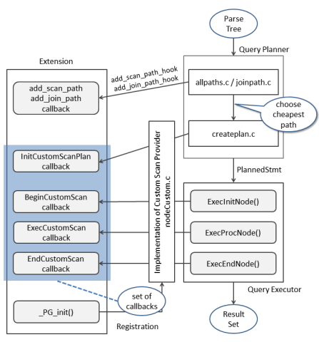
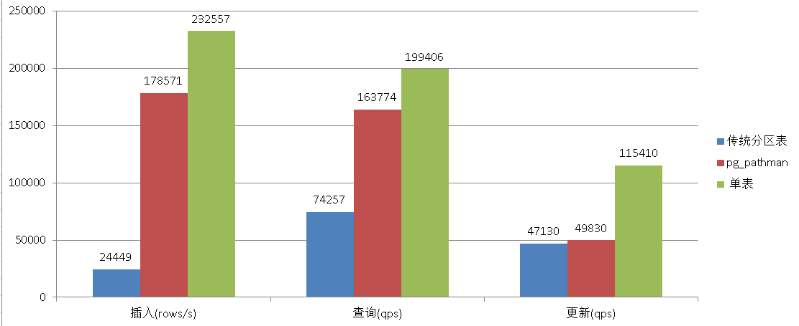
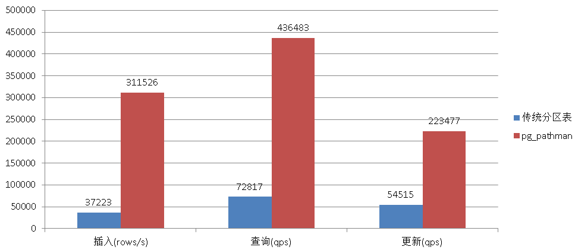

## PostgreSQL 9.5+ 高效分区表实现 - pg_pathman
            
### 作者           
digoal            
            
### 日期          
2016-10-24            
            
### 标签          
PostgreSQL , 分区表 , pg_pathman , custom scan api           
            
----          
            
## 背景 
目前PostgreSQL社区版本的分区表功能比较弱，需要通过继承和触发器或RULE来实现分区表的功能，由于查询和更新涉及约束的检查、插入则涉及触发器或规则重写，导致分区功能性能较差。    
    
商业版本EDB，以及数据仓库Greenplum都有比较好的分区支持。  
    
去年GP开源后，阿里云RDS PostgreSQL的小伙伴将Greenplum的分区表功能port到PostgreSQL 9.4之后，比使用继承和触发器的方式性能提升了近百倍(参考我之前写的文章，传统方法除了粗发去本身的开销，还有SEARCH的开销，分区越多越慢，没有使用binary search)，由于需要改动CATALOG，所以一直没有在9.4的版本上线这个功能。  
    
分区表已经成为PostgreSQL用户万众期待的功能之一啦。  
    
社区核心成员之一oleg所在的公司postgrespro，开发了一款分区表功能的插件，不需要动用catalog，可以很方便的增加分区表的功能。  
  
本文将为大家讲解pg_pathman的原理，以及使用方法。  
  
## 一、pg_pathman 原理
PostgreSQL传统的分区方法，使用约束来区分不同分区存放的数据(配置constraint_exclusion=partition)，执行select/delete/update时执行计划根据约束和查询条件排除不需要查询的分区表。  
  
调用COPY或插入数据时使用触发器或规则，将数据插入对应的分区表。  
  
传统的做法，无论是查询还是插入，对性能的影响都较大。  
  
pg_pathman与传统的继承分区表做法有一个不同的地方，分区的定义存放在一张元数据表中，表的信息会cache在内存中，同时使用HOOK来实现RELATION的替换，所以效率非常高。  
  
目前支持两种分区模式，range和hash，其中range使用binary search查找对应的分区，hash使用hash search查找对应的分区。  
  
pg_pathman 用到的hook如下  
  
1\. pg_pathman uses ProcessUtility_hook hook to handle COPY queries for partitioned tables.  
  
2\. RuntimeAppend (overrides Append plan node)  
  
3\. RuntimeMergeAppend (overrides MergeAppend plan node)  
  
4\. PartitionFilter (drop-in replacement for INSERT triggers)  
  
https://wiki.postgresql.org/wiki/CustomScanAPI  
  
   
  
## 二、pg_pathman 特性
1\. 目前支持range , hash分区。    
  
HASH and RANGE partitioning schemes;  
  
2\. 支持自动分区管理（通过函数接口创建分区，自动将主表数据迁移到分区表），或手工分区管理（通过函数实现，将已有的表绑定到分区表，或者从分区表剥离）。   
   
Both automatic and manual partition management;  
  
3\. 支持的分区字段类型包括int, float, date, 以及其他常用类型，包括自定义的domain。   
  
Support for integer, floating point, date and other types, including domains;    
  
4\. 通过CUSTOM SCAN实现了有效的分区表JOIN, 子查询过滤分区。    
  
Effective query planning for partitioned tables (JOINs, subselects etc);  
  
5\. 使用RuntimeAppend & RuntimeMergeAppend custom plan nodes实现了动态分区选择。  
  
RuntimeAppend & RuntimeMergeAppend custom plan nodes to pick partitions at runtime;  
  
6\. PartitionFilter HOOK，实现insert inplace， 代替传统的insert trigger或insert rule。  
  
PartitionFilter: an efficient drop-in replacement for INSERT triggers;  
  
7\. 支持自动新增分区。  目前仅支持range分区表。  
  
Automatic partition creation for new INSERTed data (only for RANGE partitioning);  
  
8\. 支持copy from/to 直接读取或写入分区表，提高效率。  
  
Improved COPY FROM\TO statement that is able to insert rows directly into partitions;  
  
9\. 支持分区字段的更新，需要添加触发器，如果不需要更新分区字段，则不建议添加这个触发器，会产生一定的性能影响。  
  
UPDATE triggers generation out of the box (will be replaced with custom nodes too);  
  
10\. 允许用户自定义回调函数，在创建分区时会自动触发。  
  
User-defined callbacks for partition creation event handling;  
  
回调函数的规则如下  
  
```
$part_init_callback$(args JSONB) RETURNS VOID

传入参数如下  
/* RANGE-partitioned table abc (for exp: child abc_4) */
{
    "parent":    "abc",
    "parttype":  "2",
    "partition": "abc_4",
    "range_max": "401",
    "range_min": "301"
}

/* HASH-partitioned table abc (for exp: child abc_0) */
{
    "parent":    "abc",
    "parttype":  "1",
    "partition": "abc_0"
}
```
  
11\. 非堵塞式创建分区表，以及后台自动将主表数据迁移到分区表，非堵塞式。  
  
Non-blocking concurrent table partitioning;  
  
12\. 支持FDW，通过配置参数pg_pathman.insert_into_fdw=(disabled | postgres | any_fdw)支持postgres_fdw或任意fdw  
  
FDW support (foreign partitions);  
  
13\. 支持GUC参数配置，注意由于使用了HOOK，如果其他插件也使用了相同的HOOK，需要将pg_pathman放在后面注册，如pg_stat_statements。  
  
shared_preload_libraries = 'pg_stat_statements,pg_pathman'  
    
Various GUC toggles and configurable settings.  
   
## 三、pg_pathman 为什么高效
插入优化，使用PartitionFilter替换relation，代替触发器的方式。效率提升非常明显。  
  
查询优化，分区定义加载在内存中，使用binary search和hash search对应range与hash分区表，使用RuntimeAppend & RuntimeMergeAppend custom plan nodes to pick partitions at runtime;   
  
相比查询时通过约束过滤更加高效。  同时runtime过滤，支持子查询。传统的约束法不支持子查询过滤。  
      
## 四、pg_pathman 使用方法
pg_pathman使用了custom scan provider api，所以只支持PostgreSQL 9.5以及以上的版本。  
  
### 四.1 安装、配置
```
$ git clone https://github.com/postgrespro/pg_pathman
$ export PATH=/home/digoal/pgsql9.6:$PATH

$ cd pg_pathman
$ make USE_PGXS=1
$ make USE_PGXS=1 install

$ cd $PGDATA
$ vi postgresql.conf
shared_preload_libraries = 'pg_stat_statements,pg_pathman' 

$ pg_ctl restart -m fast

$ psql
postgres=# create extension pg_pathman;
CREATE EXTENSION

postgres=# \dx
                   List of installed extensions
    Name    | Version |   Schema   |         Description          
------------+---------+------------+------------------------------
 pg_pathman | 1.1     | public     | Partitioning tool ver. 1.1
```
   
### 四.2 参数
```
pg_pathman.enable --- disable (or enable) pg_pathman completely
默认on

pg_pathman.enable_runtimeappend --- toggle RuntimeAppend custom node on\off
默认on

pg_pathman.enable_runtimemergeappend --- toggle RuntimeMergeAppend custom node on\off
默认on

pg_pathman.enable_partitionfilter --- toggle PartitionFilter custom node on\off
默认on

pg_pathman.enable_auto_partition --- toggle automatic partition creation on\off (per session)
默认on

pg_pathman.insert_into_fdw --- allow INSERTs into various FDWs (disabled | postgres | any_fdw)
默认postgres

pg_pathman.override_copy --- toggle COPY statement hooking on\off
默认on
```
  
### 四.3 相关视图和表
pg_pathman 使用函数来维护分区表，并且创建了一些视图，可以查看分区表的状态。    
    
分区表的定义则存在一张表中，定义数据缓存在内存中。    
  
1\. pathman_config --- main config storage  
  
This table stores a list of partitioned tables.  
  
```
CREATE TABLE IF NOT EXISTS pathman_config (
    partrel         REGCLASS NOT NULL PRIMARY KEY,  -- 主表oid
    attname         TEXT NOT NULL,  -- 分区列名
    parttype        INTEGER NOT NULL,  -- 分区类型(hash or range)
    range_interval  TEXT,  -- range分区的interval

    CHECK (parttype IN (1, 2)) /* check for allowed part types */ );
```
  
2\. pathman_config_params --- optional parameters  
  
This table stores optional parameters which override standard behavior.    
  
这张表存储的信息将覆盖标准配置(即postgresql.conf中的配置)  
  
```
CREATE TABLE IF NOT EXISTS pathman_config_params (
    partrel        REGCLASS NOT NULL PRIMARY KEY,  -- 主表oid
    enable_parent  BOOLEAN NOT NULL DEFAULT TRUE,  -- 是否在优化器中过滤主表
    auto           BOOLEAN NOT NULL DEFAULT TRUE,  -- insert时是否自动扩展不存在的分区
    init_callback  REGPROCEDURE NOT NULL DEFAULT 0);  -- create partition时的回调函数oid
```
  
3\. pathman_concurrent_part_tasks --- currently running partitioning workers  
  
This view lists all currently running concurrent partitioning tasks.   
  
当前正在执行的数据迁移任务（从主表将数据迁移到分区）。  
  
```
-- helper SRF function
CREATE OR REPLACE FUNCTION show_concurrent_part_tasks()  
RETURNS TABLE (
    userid     REGROLE,
    pid        INT,
    dbid       OID,
    relid      REGCLASS,
    processed  INT,
    status     TEXT)
AS 'pg_pathman', 'show_concurrent_part_tasks_internal'
LANGUAGE C STRICT;

CREATE OR REPLACE VIEW pathman_concurrent_part_tasks
AS SELECT * FROM show_concurrent_part_tasks();
```
  
4\. pathman_partition_list --- list of all existing partitions  
  
This view lists all existing partitions, as well as their parents and range boundaries (NULL for HASH partitions).  
  
列出已经存在的分区。  
  
```
-- helper SRF function
CREATE OR REPLACE FUNCTION show_partition_list()
RETURNS TABLE (
    parent     REGCLASS,
    partition  REGCLASS,
    parttype   INT4,
    partattr   TEXT,
    range_min  TEXT,
    range_max  TEXT)
AS 'pg_pathman', 'show_partition_list_internal'
LANGUAGE C STRICT;

CREATE OR REPLACE VIEW pathman_partition_list
AS SELECT * FROM show_partition_list();
```
  
### 四.4 分区表管理
创建分区表时，需要指定主表的名字，主表必须已存在，主表可以有数据，也可以是空表。  
  
如果主表有数据，那么可以配置是否需要在创建分区时，将数据迁移到分区，（不建议对大表这么做）。  
  
如果主表有很多数据，建议使用后台非堵塞式的迁移方法。  （调用partition_table_concurrently()函数进行迁移）。  
  
如果在创建分区表前，使用set_init_callback(relation regclass, callback regproc DEFAULT 0)设置了回调函数，则创建分区时，每个分区表创建是，会自动调用对应的回调函数。  
  
回调函数的传入参数和模式如下    
  
```
$part_init_callback$(args JSONB) RETURNS VOID

传入参数如下  
/* RANGE-partitioned table abc (for exp: child abc_4) */
{
    "parent":    "abc",
    "parttype":  "2",
    "partition": "abc_4",
    "range_max": "401",
    "range_min": "301"
}

/* HASH-partitioned table abc (for exp: child abc_0) */
{
    "parent":    "abc",
    "parttype":  "1",
    "partition": "abc_0"
}
```
  
#### 1. range分区
有4个管理函数用来创建范围分区  
  
指定起始值、间隔、分区个数  
  
```
create_range_partitions(relation       REGCLASS,  -- 主表OID
                        attribute      TEXT,      -- 分区列名
                        start_value    ANYELEMENT,  -- 开始值
                        p_interval     ANYELEMENT,  -- 间隔；任意类型，适合任意类型的分区表
                        p_count        INTEGER DEFAULT NULL,   --  分多少个区
                        partition_data BOOLEAN DEFAULT TRUE)   --  是否立即将数据从主表迁移到分区, 不建议这么使用, 建议使用非堵塞式的迁移( 调用partition_table_concurrently() )

create_range_partitions(relation       REGCLASS,  -- 主表OID
                        attribute      TEXT,      -- 分区列名
                        start_value    ANYELEMENT,  -- 开始值
                        p_interval     INTERVAL,    -- 间隔；interval 类型，用于时间分区表
                        p_count        INTEGER DEFAULT NULL,   --  分多少个区
                        partition_data BOOLEAN DEFAULT TRUE)   --  是否立即将数据从主表迁移到分区, 不建议这么使用, 建议使用非堵塞式的迁移( 调用partition_table_concurrently() )
```
  
指定起始值、终值、间隔  
  
```
create_partitions_from_range(relation       REGCLASS,  -- 主表OID
                             attribute      TEXT,      -- 分区列名
                             start_value    ANYELEMENT,  -- 开始值
                             end_value      ANYELEMENT,  -- 结束值
                             p_interval     ANYELEMENT,  -- 间隔；任意类型，适合任意类型的分区表
                             partition_data BOOLEAN DEFAULT TRUE)   --  是否立即将数据从主表迁移到分区, 不建议这么使用, 建议使用非堵塞式的迁移( 调用partition_table_concurrently() )

create_partitions_from_range(relation       REGCLASS,  -- 主表OID
                             attribute      TEXT,      -- 分区列名
                             start_value    ANYELEMENT,  -- 开始值
                             end_value      ANYELEMENT,  -- 结束值
                             p_interval     INTERVAL,    -- 间隔；interval 类型，用于时间分区表
                             partition_data BOOLEAN DEFAULT TRUE)   --  是否立即将数据从主表迁移到分区, 不建议这么使用, 建议使用非堵塞式的迁移( 调用partition_table_concurrently() )
```
  
例子  
  
```
创建需要分区的主表
postgres=# create table part_test(id int, info text, crt_time timestamp not null);  -- 分区列必须有not null约束  
CREATE TABLE

插入一批测试数据，模拟已经有数据了的主表
postgres=# insert into part_test select id,md5(random()::text),clock_timestamp() + (id||' hour')::interval from generate_series(1,10000) t(id); 
INSERT 0 10000
postgres=# select * from part_test limit 10;                    
 id |               info               |          crt_time          
----+----------------------------------+----------------------------
  1 | 36fe1adedaa5b848caec4941f87d443a | 2016-10-25 10:27:13.206713
  2 | c7d7358e196a9180efb4d0a10269c889 | 2016-10-25 11:27:13.206893
  3 | 005bdb063550579333264b895df5b75e | 2016-10-25 12:27:13.206904
  4 | 6c900a0fc50c6e4da1ae95447c89dd55 | 2016-10-25 13:27:13.20691
  5 | 857214d8999348ed3cb0469b520dc8e5 | 2016-10-25 14:27:13.206916
  6 | 4495875013e96e625afbf2698124ef5b | 2016-10-25 15:27:13.206921
  7 | 82488cf7e44f87d9b879c70a9ed407d4 | 2016-10-25 16:27:13.20693
  8 | a0b92547c8f17f79814dfbb12b8694a0 | 2016-10-25 17:27:13.206936
  9 | 2ca09e0b85042b476fc235e75326b41b | 2016-10-25 18:27:13.206942
 10 | 7eb762e1ef7dca65faf413f236dff93d | 2016-10-25 19:27:13.206947
(10 rows)

注意:  
1. 分区列必须有not null约束  
2. 分区个数必须能覆盖已有的所有记录  

创建分区，每个分区包含1个月的跨度数据  
postgres=# select                                             
create_range_partitions('part_test'::regclass,             -- 主表OID
                        'crt_time',                        -- 分区列名
                        '2016-10-25 00:00:00'::timestamp,  -- 开始值
                        interval '1 month',                -- 间隔；interval 类型，用于时间分区表
                        24,                                -- 分多少个区
                        false) ;                           -- 不迁移数据
NOTICE:  sequence "part_test_seq" does not exist, skipping
 create_range_partitions 
-------------------------
                      24
(1 row)
postgres-# \d+ part_test
                                  Table "public.part_test"
  Column  |            Type             | Modifiers | Storage  | Stats target | Description 
----------+-----------------------------+-----------+----------+--------------+-------------
 id       | integer                     |           | plain    |              | 
 info     | text                        |           | extended |              | 
 crt_time | timestamp without time zone | not null  | plain    |              | 
Child tables: part_test_1,
              part_test_10,
              part_test_11,
              part_test_12,
              part_test_13,
              part_test_14,
              part_test_15,
              part_test_16,
              part_test_17,
              part_test_18,
              part_test_19,
              part_test_2,
              part_test_20,
              part_test_21,
              part_test_22,
              part_test_23,
              part_test_24,
              part_test_3,
              part_test_4,
              part_test_5,
              part_test_6,
              part_test_7,
              part_test_8,
              part_test_9


由于不迁移数据，所以数据还在主表
postgres=# select count(*) from only part_test;
 count 
-------
 10000
(1 row)


使用非堵塞式的迁移接口  
partition_table_concurrently(relation   REGCLASS,              -- 主表OID
                             batch_size INTEGER DEFAULT 1000,  -- 一个事务批量迁移多少记录
                             sleep_time FLOAT8 DEFAULT 1.0)    -- 获得行锁失败时，休眠多久再次获取，重试60次退出任务。


postgres=# select partition_table_concurrently('part_test'::regclass,
                             10000,
                             1.0);
NOTICE:  worker started, you can stop it with the following command: select stop_concurrent_part_task('part_test');
 partition_table_concurrently 
------------------------------
 
(1 row)


迁移结束后，主表数据已经没有了，全部在分区中
postgres=# select count(*) from only part_test;
 count 
-------
     0
(1 row)


数据迁移完成后，建议禁用主表，这样执行计划就不会出现主表了
postgres=# select set_enable_parent('part_test'::regclass, false);
 set_enable_parent 
-------------------
 
(1 row)

postgres=# explain select * from part_test where crt_time = '2016-10-25 00:00:00'::timestamp;
                                   QUERY PLAN                                    
---------------------------------------------------------------------------------
 Append  (cost=0.00..16.18 rows=1 width=45)
   ->  Seq Scan on part_test_1  (cost=0.00..16.18 rows=1 width=45)
         Filter: (crt_time = '2016-10-25 00:00:00'::timestamp without time zone)
(3 rows)
```
  
建议  
  
1\. 分区列必须有not null约束  
2\. 分区个数必须能覆盖已有的所有记录  
3\. 建议使用非堵塞式迁移接口  
4\. 建议数据迁移完成后，禁用主表  
  
#### 2. hash分区
有1个管理函数用来创建范围分区  
  
指定起始值、间隔、分区个数  
  
```
create_hash_partitions(relation         REGCLASS,  -- 主表OID
                       attribute        TEXT,      -- 分区列名
                       partitions_count INTEGER,   -- 打算创建多少个分区
                       partition_data   BOOLEAN DEFAULT TRUE)   --  是否立即将数据从主表迁移到分区, 不建议这么使用, 建议使用非堵塞式的迁移( 调用partition_table_concurrently() )
```
  
例子  
  
```
创建需要分区的主表
postgres=# create table part_test(id int, info text, crt_time timestamp not null);    -- 分区列必须有not null约束  
CREATE TABLE

插入一批测试数据，模拟已经有数据了的主表
postgres=# insert into part_test select id,md5(random()::text),clock_timestamp() + (id||' hour')::interval from generate_series(1,10000) t(id); 
INSERT 0 10000
postgres=# select * from part_test limit 10;   
 id |               info               |          crt_time          
----+----------------------------------+----------------------------
  1 | 29ce4edc70dbfbe78912beb7c4cc95c2 | 2016-10-25 10:47:32.873879
  2 | e0990a6fb5826409667c9eb150fef386 | 2016-10-25 11:47:32.874048
  3 | d25f577a01013925c203910e34470695 | 2016-10-25 12:47:32.874059
  4 | 501419c3f7c218e562b324a1bebfe0ad | 2016-10-25 13:47:32.874065
  5 | 5e5e22bdf110d66a5224a657955ba158 | 2016-10-25 14:47:32.87407
  6 | 55d2d4fd5229a6595e0dd56e13d32be4 | 2016-10-25 15:47:32.874076
  7 | 1dfb9a783af55b123c7a888afe1eb950 | 2016-10-25 16:47:32.874081
  8 | 41eeb0bf395a4ab1e08691125ae74bff | 2016-10-25 17:47:32.874087
  9 | 83783d69cc4f9bb41a3978fe9e13d7fa | 2016-10-25 18:47:32.874092
 10 | affc9406d5b3412ae31f7d7283cda0dd | 2016-10-25 19:47:32.874097
(10 rows)

注意:  
1. 分区列必须有not null约束  

创建128个分区
postgres=# select                                             
create_hash_partitions('part_test'::regclass,              -- 主表OID
                        'crt_time',                        -- 分区列名
                        128,                               -- 打算创建多少个分区
                        false) ;                           -- 不迁移数据
 create_hash_partitions 
------------------------
                    128
(1 row)

postgres=# \d+ part_test
                                  Table "public.part_test"
  Column  |            Type             | Modifiers | Storage  | Stats target | Description 
----------+-----------------------------+-----------+----------+--------------+-------------
 id       | integer                     |           | plain    |              | 
 info     | text                        |           | extended |              | 
 crt_time | timestamp without time zone | not null  | plain    |              | 
Child tables: part_test_0,
              part_test_1,
              part_test_10,
              part_test_100,
              part_test_101,
              part_test_102,
              part_test_103,
              part_test_104,
              part_test_105,
              part_test_106,
              part_test_107,
              part_test_108,
              part_test_109,
              part_test_11,
              part_test_110,
              part_test_111,
              part_test_112,
              part_test_113,
              part_test_114,
              part_test_115,
              part_test_116,
              part_test_117,
              part_test_118,
              part_test_119,
              part_test_12,
              part_test_120,
              part_test_121,
              part_test_122,
              part_test_123,
              part_test_124,
              part_test_125,
              part_test_126,
              part_test_127,
              part_test_13,
              part_test_14,
              part_test_15,
              part_test_16,
              part_test_17,
              part_test_18,
              part_test_19,
              part_test_2,
              part_test_20,
              part_test_21,
              part_test_22,
              part_test_23,
              part_test_24,
              part_test_25,
              part_test_26,
              part_test_27,
              part_test_28,
              part_test_29,
              part_test_3,
              part_test_30,
              part_test_31,
              part_test_32,
              part_test_33,
              part_test_34,
              part_test_35,
              part_test_36,
              part_test_37,
              part_test_38,
              part_test_39,
              part_test_4,
              part_test_40,
              part_test_41,
              part_test_42,
              part_test_43,
              part_test_44,
              part_test_45,
              part_test_46,
              part_test_47,
              part_test_48,
              part_test_49,
              part_test_5,
              part_test_50,
              part_test_51,
              part_test_52,
              part_test_53,
              part_test_54,
              part_test_55,
              part_test_56,
              part_test_57,
              part_test_58,
              part_test_59,
              part_test_6,
              part_test_60,
              part_test_61,
              part_test_62,
              part_test_63,
              part_test_64,
              part_test_65,
              part_test_66,
              part_test_67,
              part_test_68,
              part_test_69,
              part_test_7,
              part_test_70,
              part_test_71,
              part_test_72,
              part_test_73,
              part_test_74,
              part_test_75,
              part_test_76,
              part_test_77,
              part_test_78,
              part_test_79,
              part_test_8,
              part_test_80,
              part_test_81,
              part_test_82,
              part_test_83,
              part_test_84,
              part_test_85,
              part_test_86,
              part_test_87,
              part_test_88,
              part_test_89,
              part_test_9,
              part_test_90,
              part_test_91,
              part_test_92,
              part_test_93,
              part_test_94,
              part_test_95,
              part_test_96,
              part_test_97,
              part_test_98,
              part_test_99


由于不迁移数据，所以数据还在主表
postgres=# select count(*) from only part_test;
 count 
-------
 10000
(1 row)


使用非堵塞式的迁移接口  
partition_table_concurrently(relation   REGCLASS,              -- 主表OID
                             batch_size INTEGER DEFAULT 1000,  -- 一个事务批量迁移多少记录
                             sleep_time FLOAT8 DEFAULT 1.0)    -- 获得行锁失败时，休眠多久再次获取，重试60次退出任务。


postgres=# select partition_table_concurrently('part_test'::regclass,
                             10000,
                             1.0);
NOTICE:  worker started, you can stop it with the following command: select stop_concurrent_part_task('part_test');
 partition_table_concurrently 
------------------------------
 
(1 row)


迁移结束后，主表数据已经没有了，全部在分区中
postgres=# select count(*) from only part_test;
 count 
-------
     0
(1 row)


数据迁移完成后，建议禁用主表，这样执行计划就不会出现主表了
postgres=# select set_enable_parent('part_test'::regclass, false);
 set_enable_parent 
-------------------
 
(1 row)

只查单个分区
postgres=# explain select * from part_test where crt_time = '2016-10-25 00:00:00'::timestamp;
                                   QUERY PLAN                                    
---------------------------------------------------------------------------------
 Append  (cost=0.00..1.91 rows=1 width=45)
   ->  Seq Scan on part_test_122  (cost=0.00..1.91 rows=1 width=45)
         Filter: (crt_time = '2016-10-25 00:00:00'::timestamp without time zone)
(3 rows)

分区表约束如下  
很显然pg_pathman自动完成了转换，如果是传统的继承，select * from part_test where crt_time = '2016-10-25 00:00:00'::timestamp; 这种写法是不能筛选分区的。  
postgres=# \d+ part_test_122
                                Table "public.part_test_122"
  Column  |            Type             | Modifiers | Storage  | Stats target | Description 
----------+-----------------------------+-----------+----------+--------------+-------------
 id       | integer                     |           | plain    |              | 
 info     | text                        |           | extended |              | 
 crt_time | timestamp without time zone | not null  | plain    |              | 
Check constraints:
    "pathman_part_test_122_3_check" CHECK (get_hash_part_idx(timestamp_hash(crt_time), 128) = 122)
Inherits: part_test
```
  
建议  
  
1\. 分区列必须有not null约束  
2\. 建议使用非堵塞式迁移接口  
3\. 建议数据迁移完成后，禁用主表  
4\. pg_pathman不会受制于表达式的写法，所以select * from part_test where crt_time = '2016-10-25 00:00:00'::timestamp;这样的写法也是能走哈希分区的。  
5\. hash分区列不局限于int类型的列，会使用hash函数自动转换。  
    
#### 3. 数据迁移到分区
如果创建分区表时，未将主表数据迁移到分区，那么可以使用非堵塞式的迁移接口，将数据迁移到分区    
  
可能类似如下做法    
```
with tmp as (delete from 主表 limit xx nowait returning *) insert into 分区 select * from tmp

或者使用 select array_agg(ctid) from 主表 limit xx for update nowati 进行标示 然后执行delete和insert。  
```
    
1\. 函数接口如下  
  
```
partition_table_concurrently(relation   REGCLASS,              -- 主表OID
                             batch_size INTEGER DEFAULT 1000,  -- 一个事务批量迁移多少记录
                             sleep_time FLOAT8 DEFAULT 1.0)    -- 获得行锁失败时，休眠多久再次获取，重试60次退出任务。
```
  
2\. 例子  
  
```
postgres=# select partition_table_concurrently('part_test'::regclass,
                             10000,
                             1.0);
NOTICE:  worker started, you can stop it with the following command: select stop_concurrent_part_task('part_test');
 partition_table_concurrently 
------------------------------
 
(1 row)
```
  
3\. 如何停止迁移任务，调用如下函数接口    
  
```
stop_concurrent_part_task(relation REGCLASS)
```
  
4\. 查看后台的数据迁移任务  
  
```
postgres=# select * from pathman_concurrent_part_tasks;
 userid | pid | dbid | relid | processed | status 
--------+-----+------+-------+-----------+--------
(0 rows)
```
  
#### 4. 分裂范围分区
例如某个分区太大了，想分裂为两个分区，可以使用这种方法  
  
仅支持范围分区表  
  
```
split_range_partition(partition      REGCLASS,            -- 分区oid
                      split_value    ANYELEMENT,          -- 分裂值
                      partition_name TEXT DEFAULT NULL)   -- 分裂后新增的分区表名
```
  
例子  
  
```
postgres=# \d+ part_test
                                  Table "public.part_test"
  Column  |            Type             | Modifiers | Storage  | Stats target | Description 
----------+-----------------------------+-----------+----------+--------------+-------------
 id       | integer                     |           | plain    |              | 
 info     | text                        |           | extended |              | 
 crt_time | timestamp without time zone | not null  | plain    |              | 
Child tables: part_test_1,
              part_test_10,
              part_test_11,
              part_test_12,
              part_test_13,
              part_test_14,
              part_test_15,
              part_test_16,
              part_test_17,
              part_test_18,
              part_test_19,
              part_test_2,
              part_test_20,
              part_test_21,
              part_test_22,
              part_test_23,
              part_test_24,
              part_test_3,
              part_test_4,
              part_test_5,
              part_test_6,
              part_test_7,
              part_test_8,
              part_test_9

postgres=# \d+ part_test_1
                                 Table "public.part_test_1"
  Column  |            Type             | Modifiers | Storage  | Stats target | Description 
----------+-----------------------------+-----------+----------+--------------+-------------
 id       | integer                     |           | plain    |              | 
 info     | text                        |           | extended |              | 
 crt_time | timestamp without time zone | not null  | plain    |              | 
Check constraints:
    "pathman_part_test_1_3_check" CHECK (crt_time >= '2016-10-25 00:00:00'::timestamp without time zone AND crt_time < '2016-11-25 00:00:00'::timestamp without time zone)
Inherits: part_test
```
  
分裂  
  
```
postgres=# select split_range_partition('part_test_1'::regclass,              -- 分区oid
                      '2016-11-10 00:00:00'::timestamp,     -- 分裂值
                      'part_test_1_2');                     -- 分区表名
             split_range_partition             
-----------------------------------------------
 {"2016-10-25 00:00:00","2016-11-25 00:00:00"}
(1 row)
```
  
分裂后的两个表如下  
  
```
postgres=# \d+ part_test_1
                                 Table "public.part_test_1"
  Column  |            Type             | Modifiers | Storage  | Stats target | Description 
----------+-----------------------------+-----------+----------+--------------+-------------
 id       | integer                     |           | plain    |              | 
 info     | text                        |           | extended |              | 
 crt_time | timestamp without time zone | not null  | plain    |              | 
Check constraints:
    "pathman_part_test_1_3_check" CHECK (crt_time >= '2016-10-25 00:00:00'::timestamp without time zone AND crt_time < '2016-11-10 00:00:00'::timestamp without time zone)
Inherits: part_test

postgres=# \d+ part_test_1_2 
                                Table "public.part_test_1_2"
  Column  |            Type             | Modifiers | Storage  | Stats target | Description 
----------+-----------------------------+-----------+----------+--------------+-------------
 id       | integer                     |           | plain    |              | 
 info     | text                        |           | extended |              | 
 crt_time | timestamp without time zone | not null  | plain    |              | 
Check constraints:
    "pathman_part_test_1_2_3_check" CHECK (crt_time >= '2016-11-10 00:00:00'::timestamp without time zone AND crt_time < '2016-11-25 00:00:00'::timestamp without time zone)
Inherits: part_test
```
  
数据会自动迁移到另一个分区  
  
```
postgres=# select count(*) from part_test_1;
 count 
-------
   373
(1 row)

postgres=# select count(*) from part_test_1_2;
 count 
-------
   360
(1 row)
```
  
继承关系如下  
  
```
postgres=# \d+ part_test
                                  Table "public.part_test"
  Column  |            Type             | Modifiers | Storage  | Stats target | Description 
----------+-----------------------------+-----------+----------+--------------+-------------
 id       | integer                     |           | plain    |              | 
 info     | text                        |           | extended |              | 
 crt_time | timestamp without time zone | not null  | plain    |              | 
Child tables: part_test_1,
              part_test_10,
              part_test_11,
              part_test_12,
              part_test_13,
              part_test_14,
              part_test_15,
              part_test_16,
              part_test_17,
              part_test_18,
              part_test_19,
              part_test_1_2,    -- 新增的表
              part_test_2,
              part_test_20,
              part_test_21,
              part_test_22,
              part_test_23,
              part_test_24,
              part_test_3,
              part_test_4,
              part_test_5,
              part_test_6,
              part_test_7,
              part_test_8,
              part_test_9
```
  
#### 5. 合并范围分区
目前仅支持范围分区  
    
调用如下接口  
  
```
指定两个需要合并分区，必须为相邻分区  
merge_range_partitions(partition1 REGCLASS, partition2 REGCLASS)    
```
    
例子  
  
```
postgres=# select merge_range_partitions('part_test_2'::regclass, 'part_test_12'::regclass) ;
ERROR:  merge failed, partitions must be adjacent
CONTEXT:  PL/pgSQL function merge_range_partitions_internal(regclass,regclass,regclass,anyelement) line 27 at RAISE
SQL statement "SELECT public.merge_range_partitions_internal($1, $2, $3, NULL::timestamp without time zone)"
PL/pgSQL function merge_range_partitions(regclass,regclass) line 44 at EXECUTE
不是相邻分区，报错

相邻分区可以合并
postgres=# select merge_range_partitions('part_test_1'::regclass, 'part_test_1_2'::regclass) ;
 merge_range_partitions 
------------------------
 
(1 row)
```
    
合并后，会删掉其中一个分区表    
    
```
postgres=# \d part_test_1_2
Did not find any relation named "part_test_1_2".

postgres=# \d part_test_1
             Table "public.part_test_1"
  Column  |            Type             | Modifiers 
----------+-----------------------------+-----------
 id       | integer                     | 
 info     | text                        | 
 crt_time | timestamp without time zone | not null
Check constraints:
    "pathman_part_test_1_3_check" CHECK (crt_time >= '2016-10-25 00:00:00'::timestamp without time zone AND crt_time < '2016-11-25 00:00:00'::timestamp without time zone)
Inherits: part_test

postgres=# select count(*) from part_test_1;
 count 
-------
   733
(1 row)
```
    
#### 6. 向后添加范围分区
如果已经对主表进行了分区，将来需要增加分区的话，有几种方法，一种是向后新增分区（即在末尾追加分区）。  
  
新增分区时，会使用初次创建该分区表时的interval作为间隔。   
  
可以在这个表中查询每个分区表初次创建时的 interval   
  
```
postgres=# select * from pathman_config;
  partrel  | attname  | parttype | range_interval 
-----------+----------+----------+----------------
 part_test | crt_time |        2 | 1 mon
(1 row)
```
  
添加分区接口，支持指定表空间  
  
```
append_range_partition(parent         REGCLASS,            -- 主表OID
                       partition_name TEXT DEFAULT NULL,   -- 新增的分区表名, 默认不需要输入
                       tablespace     TEXT DEFAULT NULL)   -- 新增的分区表放到哪个表空间, 默认不需要输入
```
    
例子  
    
```
postgres=# select append_range_partition('part_test'::regclass);
 append_range_partition 
------------------------
 public.part_test_25
(1 row)

postgres=# \d+ part_test_25
                                Table "public.part_test_25"
  Column  |            Type             | Modifiers | Storage  | Stats target | Description 
----------+-----------------------------+-----------+----------+--------------+-------------
 id       | integer                     |           | plain    |              | 
 info     | text                        |           | extended |              | 
 crt_time | timestamp without time zone | not null  | plain    |              | 
Check constraints:
    "pathman_part_test_25_3_check" CHECK (crt_time >= '2018-10-25 00:00:00'::timestamp without time zone AND crt_time < '2018-11-25 00:00:00'::timestamp without time zone)
Inherits: part_test

postgres=# \d+ part_test_24
                                Table "public.part_test_24"
  Column  |            Type             | Modifiers | Storage  | Stats target | Description 
----------+-----------------------------+-----------+----------+--------------+-------------
 id       | integer                     |           | plain    |              | 
 info     | text                        |           | extended |              | 
 crt_time | timestamp without time zone | not null  | plain    |              | 
Check constraints:
    "pathman_part_test_24_3_check" CHECK (crt_time >= '2018-09-25 00:00:00'::timestamp without time zone AND crt_time < '2018-10-25 00:00:00'::timestamp without time zone)
Inherits: part_test
```
    
#### 7. 向前添加范围分区
在头部追加分区。  
    
接口  
```
prepend_range_partition(parent         REGCLASS,
                        partition_name TEXT DEFAULT NULL,
                        tablespace     TEXT DEFAULT NULL)
```
    
例子  
  
```
postgres=# select prepend_range_partition('part_test'::regclass);
 prepend_range_partition 
-------------------------
 public.part_test_26
(1 row)

postgres=# \d+ part_test_26
                                Table "public.part_test_26"
  Column  |            Type             | Modifiers | Storage  | Stats target | Description 
----------+-----------------------------+-----------+----------+--------------+-------------
 id       | integer                     |           | plain    |              | 
 info     | text                        |           | extended |              | 
 crt_time | timestamp without time zone | not null  | plain    |              | 
Check constraints:
    "pathman_part_test_26_3_check" CHECK (crt_time >= '2016-09-25 00:00:00'::timestamp without time zone AND crt_time < '2016-10-25 00:00:00'::timestamp without time zone)
Inherits: part_test

postgres=# \d+ part_test_1
                                 Table "public.part_test_1"
  Column  |            Type             | Modifiers | Storage  | Stats target | Description 
----------+-----------------------------+-----------+----------+--------------+-------------
 id       | integer                     |           | plain    |              | 
 info     | text                        |           | extended |              | 
 crt_time | timestamp without time zone | not null  | plain    |              | 
Check constraints:
    "pathman_part_test_1_3_check" CHECK (crt_time >= '2016-10-25 00:00:00'::timestamp without time zone AND crt_time < '2016-11-25 00:00:00'::timestamp without time zone)
Inherits: part_test
```
  
#### 8. 添加分区
指定分区起始值的方式添加分区，只要创建的分区和已有分区不会存在数据交叉就可以创建成功。  
  
也就是说使用这种方法，不要求强制创建连续的分区，例如已有分区覆盖了2010-2015的范围，你可以直接创建一个2020年的分区表，不需要覆盖2015到2020的范围。  
  
接口如下  
  
```
add_range_partition(relation       REGCLASS,    -- 主表OID
                    start_value    ANYELEMENT,  -- 起始值
                    end_value      ANYELEMENT,  -- 结束值
                    partition_name TEXT DEFAULT NULL,  -- 分区名
                    tablespace     TEXT DEFAULT NULL)  -- 分区创建在哪个表空间下  
```
  
例子  
  
```
postgres=# select add_range_partition('part_test'::regclass,    -- 主表OID
                    '2020-01-01 00:00:00'::timestamp,  -- 起始值
                    '2020-02-01 00:00:00'::timestamp); -- 结束值
 add_range_partition 
---------------------
 public.part_test_27
(1 row)

postgres=# \d+ part_test_27
                                Table "public.part_test_27"
  Column  |            Type             | Modifiers | Storage  | Stats target | Description 
----------+-----------------------------+-----------+----------+--------------+-------------
 id       | integer                     |           | plain    |              | 
 info     | text                        |           | extended |              | 
 crt_time | timestamp without time zone | not null  | plain    |              | 
Check constraints:
    "pathman_part_test_27_3_check" CHECK (crt_time >= '2020-01-01 00:00:00'::timestamp without time zone AND crt_time < '2020-02-01 00:00:00'::timestamp without time zone)
Inherits: part_test
```
    
#### 9. 删除分区
1\. 删除单个范围分区  
  
接口如下  
  
```
drop_range_partition(partition TEXT,   -- 分区名称
                    delete_data BOOLEAN DEFAULT TRUE)  -- 是否删除分区数据，如果false，表示分区数据迁移到主表。  

Drop RANGE partition and all of its data if delete_data is true.
```
  
例子  
  
```
删除分区， 数据迁移到主表  
postgres=# select drop_range_partition('part_test_1',false);
NOTICE:  733 rows copied from part_test_1
 drop_range_partition 
----------------------
 part_test_1
(1 row)

postgres=# select drop_range_partition('part_test_2',false);
NOTICE:  720 rows copied from part_test_2
 drop_range_partition 
----------------------
 part_test_2
(1 row)

postgres=# select count(*) from part_test;
 count 
-------
 10000
(1 row)

删除分区，分区数据也删除，不迁移到主表  
postgres=# select drop_range_partition('part_test_3',true);
 drop_range_partition 
----------------------
 part_test_3
(1 row)

postgres=# select count(*) from part_test;
 count 
-------
  9256
(1 row)

postgres=# select count(*) from only part_test;
 count 
-------
  1453
(1 row)
```
  
2\. 删除所有分区，并且指定是否要将数据迁移到主表    
  
接口如下  
  
```
drop_partitions(parent      REGCLASS,
                delete_data BOOLEAN DEFAULT FALSE)

Drop partitions of the parent table (both foreign and local relations). 
If delete_data is false, the data is copied to the parent table first. 
Default is false.
```
  
例子  
  
```
postgres=# select drop_partitions('part_test'::regclass, false);  -- 删除所有分区表，并将数据迁移到主表
NOTICE:  function public.part_test_upd_trig_func() does not exist, skipping
NOTICE:  744 rows copied from part_test_4
NOTICE:  672 rows copied from part_test_5
NOTICE:  744 rows copied from part_test_6
NOTICE:  720 rows copied from part_test_7
NOTICE:  744 rows copied from part_test_8
NOTICE:  720 rows copied from part_test_9
NOTICE:  744 rows copied from part_test_10
NOTICE:  744 rows copied from part_test_11
NOTICE:  720 rows copied from part_test_12
NOTICE:  744 rows copied from part_test_13
NOTICE:  507 rows copied from part_test_14
NOTICE:  0 rows copied from part_test_15
NOTICE:  0 rows copied from part_test_16
NOTICE:  0 rows copied from part_test_17
NOTICE:  0 rows copied from part_test_18
NOTICE:  0 rows copied from part_test_19
NOTICE:  0 rows copied from part_test_20
NOTICE:  0 rows copied from part_test_21
NOTICE:  0 rows copied from part_test_22
NOTICE:  0 rows copied from part_test_23
NOTICE:  0 rows copied from part_test_24
NOTICE:  0 rows copied from part_test_25
NOTICE:  0 rows copied from part_test_26
NOTICE:  0 rows copied from part_test_27
 drop_partitions 
-----------------
              24
(1 row)

postgres=# select count(*) from part_test;
 count 
-------
  9256
(1 row)

postgres=# \dt part_test_4
No matching relations found.
```
  
#### 10. 绑定分区(已有的表加入分区表)  
将已有的表，绑定到已有的某个分区主表。  
  
已有的表与主表要保持一致的结构，包括dropped columns。  (查看pg_attribute的一致性)    
    
如果设置了回调函数，会触发。  
  
接口如下  
  
```
attach_range_partition(relation    REGCLASS,    -- 主表OID
                       partition   REGCLASS,    -- 分区表OID
                       start_value ANYELEMENT,  -- 起始值
                       end_value   ANYELEMENT)  -- 结束值
```
  
例子  
  
```
postgres=# create table part_test_1 (like part_test including all);
CREATE TABLE
postgres=# \d+ part_test
                                  Table "public.part_test"
  Column  |            Type             | Modifiers | Storage  | Stats target | Description 
----------+-----------------------------+-----------+----------+--------------+-------------
 id       | integer                     |           | plain    |              | 
 info     | text                        |           | extended |              | 
 crt_time | timestamp without time zone | not null  | plain    |              | 

postgres=# \d+ part_test_1
                                 Table "public.part_test_1"
  Column  |            Type             | Modifiers | Storage  | Stats target | Description 
----------+-----------------------------+-----------+----------+--------------+-------------
 id       | integer                     |           | plain    |              | 
 info     | text                        |           | extended |              | 
 crt_time | timestamp without time zone | not null  | plain    |              | 

postgres=# select attach_range_partition('part_test'::regclass, 'part_test_1'::regclass, '2019-01-01 00:00:00'::timestamp, '2019-02-01 00:00:00'::timestamp);
 attach_range_partition 
------------------------
 part_test_1
(1 row)

绑定分区时，
自动创建继承关系，自动创建约束  
postgres=# \d+ part_test_1
                                 Table "public.part_test_1"
  Column  |            Type             | Modifiers | Storage  | Stats target | Description 
----------+-----------------------------+-----------+----------+--------------+-------------
 id       | integer                     |           | plain    |              | 
 info     | text                        |           | extended |              | 
 crt_time | timestamp without time zone | not null  | plain    |              | 
Check constraints:
    "pathman_part_test_1_3_check" CHECK (crt_time >= '2019-01-01 00:00:00'::timestamp without time zone AND crt_time < '2019-02-01 00:00:00'::timestamp without time zone)
Inherits: part_test
```
  
#### 11. 解绑分区(将分区变成普通表)
将分区从主表的继承关系中删除, 不删数据，删除继承关系，删除约束    
  
接口如下  
  
```
detach_range_partition(partition REGCLASS)  -- 指定分区名，转换为普通表  
```
  
例子  
  
```
postgres=# select count(*) from part_test;
 count 
-------
  9256
(1 row)

postgres=# select count(*) from part_test_2;
 count 
-------
   733
(1 row)

postgres=# select detach_range_partition('part_test_2');
 detach_range_partition 
------------------------
 part_test_2
(1 row)

postgres=# select count(*) from part_test_2;
 count 
-------
   733
(1 row)

postgres=# select count(*) from part_test;
 count 
-------
  8523
(1 row)
```
  
接口函数内容  
  
```
postgres=# \sf detach_range_partition
CREATE OR REPLACE FUNCTION public.detach_range_partition(partition regclass)
 RETURNS text
 LANGUAGE plpgsql
AS $function$
DECLARE
        v_attname               TEXT;
        parent_relid    REGCLASS;

BEGIN
        parent_relid := public.get_parent_of_partition(partition);

        /* Acquire lock on parent */
        PERFORM public.lock_partitioned_relation(parent_relid);

        v_attname := attname
        FROM public.pathman_config
        WHERE partrel = parent_relid;

        IF v_attname IS NULL THEN
                RAISE EXCEPTION 'table "%" is not partitioned', parent_relid::TEXT;
        END IF;

        /* Remove inheritance */
        EXECUTE format('ALTER TABLE %s NO INHERIT %s',
                                   partition::TEXT,
                                   parent_relid::TEXT);

        /* Remove check constraint */
        EXECUTE format('ALTER TABLE %s DROP CONSTRAINT %s',
                                   partition::TEXT,
                                   public.build_check_constraint_name(partition, v_attname));

        /* Invalidate cache */
        PERFORM public.on_update_partitions(parent_relid);

        RETURN partition;
END
$function$
```
  
#### 12. 更新触发器
如果分区字段要被更新，需要创建更新触发器，否则不需要。    
    
接口函数如下  
  
```
create_hash_update_trigger(parent REGCLASS)

Creates the trigger on UPDATE for HASH partitions. 
The UPDATE trigger isn't created by default because of the overhead. 
It's useful in cases when the key attribute might change.

create_range_update_trigger(parent REGCLASS)

Same as above, but for a RANGE-partitioned table.
```
  
例子  
  
创建更新触发器前，如果更新分区字段后的值跨分区了，会报约束错误。  
  
```
postgres=# select * from part_test_3 limit 10;
 id  |               info               |          crt_time          
-----+----------------------------------+----------------------------
 734 | 52288de52fccf3d47efe897e1320a0fd | 2016-11-25 00:11:34.113856
 735 | 16f4fffda933356192af8d1991c673cf | 2016-11-25 01:11:34.113862
 736 | 08ec10184500ef43a6efde38dc43df33 | 2016-11-25 02:11:34.113867
 737 | e658c7fb7f44ae3145401bf348cfa9dd | 2016-11-25 03:11:34.113872
 738 | 81ff4c5cb3404230341aa95c28f86931 | 2016-11-25 04:11:34.113877
 739 | 931652d6ba49f8155b1486d30fd23bab | 2016-11-25 05:11:34.113883
 740 | c616c01d98016ff0022aa5449d53ca8f | 2016-11-25 06:11:34.113888
 741 | 358e44b68259587233a0f571e8a86a81 | 2016-11-25 07:11:34.113893
 742 | 719bb75e67c23c1f76e4eb81cb22004e | 2016-11-25 08:11:34.113899
 743 | 1fc90c401eec2927fe9bb726651e4936 | 2016-11-25 09:11:34.113904
(10 rows)

postgres=# update part_test set crt_time='2016-01-25 00:11:34.113856' where id=734;
ERROR:  new row for relation "part_test_3" violates check constraint "pathman_part_test_3_3_check"
DETAIL:  Failing row contains (734, 52288de52fccf3d47efe897e1320a0fd, 2016-01-25 00:11:34.113856).
```
  
创建更新触发器后，正常  
  
```
postgres=# select create_range_update_trigger('part_test'::regclass);
  create_range_update_trigger   
--------------------------------
 public.part_test_upd_trig_func
(1 row)

postgres=# update part_test set crt_time='2016-01-25 00:11:34.113856' where id=734;
UPDATE 0
postgres=# select * from part_test where id=734;
 id  |               info               |          crt_time          
-----+----------------------------------+----------------------------
 734 | 52288de52fccf3d47efe897e1320a0fd | 2016-01-25 00:11:34.113856
(1 row)
```
    
通常业务设计时，不应该允许分区字段的变更。  
  
#### 13. 永久禁止分区表pg_pathman插件
你可以针对单个分区主表禁用pg_pathman。  
    
接口函数如下  
  
```
disable_pathman_for(relation TEXT)

Permanently disable pg_pathman partitioning mechanism for the specified parent table and remove the insert trigger if it exists. 
All partitions and data remain unchanged.

postgres=# \sf disable_pathman_for
CREATE OR REPLACE FUNCTION public.disable_pathman_for(parent_relid regclass)
 RETURNS void
 LANGUAGE plpgsql
 STRICT
AS $function$
BEGIN
        PERFORM public.validate_relname(parent_relid);

        DELETE FROM public.pathman_config WHERE partrel = parent_relid;
        PERFORM public.drop_triggers(parent_relid);

        /* Notify backend about changes */
        PERFORM public.on_remove_partitions(parent_relid);
END
$function$
```
  
例子  
  
```
postgres=# select disable_pathman_for('part_test');
NOTICE:  drop cascades to 23 other objects
DETAIL:  drop cascades to trigger part_test_upd_trig on table part_test_3
drop cascades to trigger part_test_upd_trig on table part_test_4
drop cascades to trigger part_test_upd_trig on table part_test_5
drop cascades to trigger part_test_upd_trig on table part_test_6
drop cascades to trigger part_test_upd_trig on table part_test_7
drop cascades to trigger part_test_upd_trig on table part_test_8
drop cascades to trigger part_test_upd_trig on table part_test_9
drop cascades to trigger part_test_upd_trig on table part_test_10
drop cascades to trigger part_test_upd_trig on table part_test_11
drop cascades to trigger part_test_upd_trig on table part_test_12
drop cascades to trigger part_test_upd_trig on table part_test_13
drop cascades to trigger part_test_upd_trig on table part_test_14
drop cascades to trigger part_test_upd_trig on table part_test_15
drop cascades to trigger part_test_upd_trig on table part_test_16
drop cascades to trigger part_test_upd_trig on table part_test_17
drop cascades to trigger part_test_upd_trig on table part_test_18
drop cascades to trigger part_test_upd_trig on table part_test_19
drop cascades to trigger part_test_upd_trig on table part_test_20
drop cascades to trigger part_test_upd_trig on table part_test_21
drop cascades to trigger part_test_upd_trig on table part_test_22
drop cascades to trigger part_test_upd_trig on table part_test_23
drop cascades to trigger part_test_upd_trig on table part_test_24
drop cascades to trigger part_test_upd_trig on table part_test_25
 disable_pathman_for 
---------------------
 
(1 row)

postgres=# \d+ part_test
                                  Table "public.part_test"
  Column  |            Type             | Modifiers | Storage  | Stats target | Description 
----------+-----------------------------+-----------+----------+--------------+-------------
 id       | integer                     |           | plain    |              | 
 info     | text                        |           | extended |              | 
 crt_time | timestamp without time zone | not null  | plain    |              | 
Child tables: part_test_10,
              part_test_11,
              part_test_12,
              part_test_13,
              part_test_14,
              part_test_15,
              part_test_16,
              part_test_17,
              part_test_18,
              part_test_19,
              part_test_20,
              part_test_21,
              part_test_22,
              part_test_23,
              part_test_24,
              part_test_25,
              part_test_26,
              part_test_27,
              part_test_28,
              part_test_29,
              part_test_3,
              part_test_30,
              part_test_31,
              part_test_32,
              part_test_33,
              part_test_34,
              part_test_35,
              part_test_4,
              part_test_5,
              part_test_6,
              part_test_7,
              part_test_8,
              part_test_9

postgres=# \d+ part_test_10
                                Table "public.part_test_10"
  Column  |            Type             | Modifiers | Storage  | Stats target | Description 
----------+-----------------------------+-----------+----------+--------------+-------------
 id       | integer                     |           | plain    |              | 
 info     | text                        |           | extended |              | 
 crt_time | timestamp without time zone | not null  | plain    |              | 
Check constraints:
    "pathman_part_test_10_3_check" CHECK (crt_time >= '2017-06-25 00:00:00'::timestamp without time zone AND crt_time < '2017-07-25 00:00:00'::timestamp without time zone)
Inherits: part_test
```
    
禁用pg_pathman后，继承关系和约束不会变化，只是pg_pathman不介入custom scan 执行计划。  
  
禁用pg_pathman后的执行计划  
  
```
postgres=# explain select * from part_test where crt_time='2017-06-25 00:00:00'::timestamp;
                                   QUERY PLAN                                    
---------------------------------------------------------------------------------
 Append  (cost=0.00..16.00 rows=2 width=45)
   ->  Seq Scan on part_test  (cost=0.00..0.00 rows=1 width=45)
         Filter: (crt_time = '2017-06-25 00:00:00'::timestamp without time zone)
   ->  Seq Scan on part_test_10  (cost=0.00..16.00 rows=1 width=45)
         Filter: (crt_time = '2017-06-25 00:00:00'::timestamp without time zone)
(5 rows)
```
   
disable_pathman_for没有可逆操作，请慎用。  
    
#### 14. 全局禁止pg_pathman
与禁用单个分区主表不同，全局禁止只需要调整参数即可，不需要修改pg_pathman的元数据，同时它是可逆操作。  
    
pg_pathman.enable   
    
例子  
    
```
$ vi $PGDATA/postgresql.conf
pg_pathman.enable  = off

$ pg_ctl reload
```
    
### 四.5 分区表高级管理
#### 1. 禁用主表
当主表的数据全部迁移到分区后，可以禁用主表。    
    
接口函数如下    
    
```
set_enable_parent(relation REGCLASS, value BOOLEAN)


Include/exclude parent table into/from query plan. 

In original PostgreSQL planner parent table is always included into query plan even if it's empty which can lead to additional overhead. 

You can use disable_parent() if you are never going to use parent table as a storage. 

Default value depends on the partition_data parameter that was specified during initial partitioning in create_range_partitions() or create_partitions_from_range() functions. 

If the partition_data parameter was true then all data have already been migrated to partitions and parent table disabled. 

Otherwise it is enabled.
```
      
例子    
      
```
select set_enable_parent('part_test', false);
```
      
#### 2. 自动扩展分区
范围分区表，允许自动扩展分区。  
  
如果新插入的数据不在已有的分区范围内，会自动创建分区。  
  
```
set_auto(relation REGCLASS, value BOOLEAN)

Enable/disable auto partition propagation (only for RANGE partitioning). 

It is enabled by default.
```
  
例子  
  
```
postgres=# \d+ part_test
                                  Table "public.part_test"
  Column  |            Type             | Modifiers | Storage  | Stats target | Description 
----------+-----------------------------+-----------+----------+--------------+-------------
 id       | integer                     |           | plain    |              | 
 info     | text                        |           | extended |              | 
 crt_time | timestamp without time zone | not null  | plain    |              | 
Child tables: part_test_10,
              part_test_11,
              part_test_12,
              part_test_13,
              part_test_14,
              part_test_15,
              part_test_16,
              part_test_17,
              part_test_18,
              part_test_19,
              part_test_20,
              part_test_21,
              part_test_22,
              part_test_23,
              part_test_24,
              part_test_25,
              part_test_26,
              part_test_3,
              part_test_4,
              part_test_5,
              part_test_6,
              part_test_7,
              part_test_8,
              part_test_9

postgres=# \d+ part_test_26
                                Table "public.part_test_26"
  Column  |            Type             | Modifiers | Storage  | Stats target | Description 
----------+-----------------------------+-----------+----------+--------------+-------------
 id       | integer                     |           | plain    |              | 
 info     | text                        |           | extended |              | 
 crt_time | timestamp without time zone | not null  | plain    |              | 
Check constraints:
    "pathman_part_test_26_3_check" CHECK (crt_time >= '2018-09-25 00:00:00'::timestamp without time zone AND crt_time < '2018-10-25 00:00:00'::timestamp without time zone)
Inherits: part_test

postgres=# \d+ part_test_25
                                Table "public.part_test_25"
  Column  |            Type             | Modifiers | Storage  | Stats target | Description 
----------+-----------------------------+-----------+----------+--------------+-------------
 id       | integer                     |           | plain    |              | 
 info     | text                        |           | extended |              | 
 crt_time | timestamp without time zone | not null  | plain    |              | 
Check constraints:
    "pathman_part_test_25_3_check" CHECK (crt_time >= '2018-08-25 00:00:00'::timestamp without time zone AND crt_time < '2018-09-25 00:00:00'::timestamp without time zone)
Inherits: part_test

插入一个不在已有分区范围的值，会根据创建分区时的interval自动扩展若干个分区，这个操作可能很久很久。  
postgres=# insert into part_test values (1,'test','2222-01-01'::timestamp);

等了很久  

21298 digoal  20   0 93.1g 184m 127m R 98.7  0.1   0:33.34 postgres: bgworker: SpawnPartitionsWorker 

插入结束后，扩展了好多好多分区，原因是插入的值跨度范围太大了。  

postgres=# \d+ part_test
                                  Table "public.part_test"
  Column  |            Type             | Modifiers | Storage  | Stats target | Description 
----------+-----------------------------+-----------+----------+--------------+-------------
 id       | integer                     |           | plain    |              | 
 info     | text                        |           | extended |              | 
 crt_time | timestamp without time zone | not null  | plain    |              | 
Child tables: part_test_10,
              part_test_100,
              part_test_1000,
              part_test_1001,
	      .....................................
	      很多
```
  
不建议开启自动扩展范围分区  
  
#### 3. 回调函数 (创建每个分区时都会触发)  
回调函数是在每创建一个分区时会自动触发调用的函数。  
    
例如可以用在ddl逻辑复制中，将DDL语句记录下来，存放到表中。  
    
回调函数如下    
    
```
set_init_callback(relation REGCLASS, callback REGPROC DEFAULT 0)

Set partition creation callback to be invoked for each attached or created partition (both HASH and RANGE). 

The callback must have the following signature: 

part_init_callback(args JSONB) RETURNS VOID. 

Parameter arg consists of several fields whose presence depends on partitioning type:

/* RANGE-partitioned table abc (child abc_4) */
{
    "parent":    "abc",
    "parttype":  "2",
    "partition": "abc_4",
    "range_max": "401",
    "range_min": "301"
}

/* HASH-partitioned table abc (child abc_0) */
{
    "parent":    "abc",
    "parttype":  "1",
    "partition": "abc_0"
}
```
  
例子    
  
```
回调函数  
postgres=# create or replace function f_callback_test(jsonb) returns void as
$$
declare
begin
  create table if not exists rec_part_ddl(id serial primary key, parent name, parttype int, partition name, range_max text, range_min text);
  if ($1->>'parttype')::int = 1 then
    raise notice 'parent: %, parttype: %, partition: %', $1->>'parent', $1->>'parttype', $1->>'partition';
    insert into rec_part_ddl(parent, parttype, partition) values (($1->>'parent')::name, ($1->>'parttype')::int, ($1->>'partition')::name);
  elsif ($1->>'parttype')::int = 2 then
    raise notice 'parent: %, parttype: %, partition: %, range_max: %, range_min: %', $1->>'parent', $1->>'parttype', $1->>'partition', $1->>'range_max', $1->>'range_min';
    insert into rec_part_ddl(parent, parttype, partition, range_max, range_min) values (($1->>'parent')::name, ($1->>'parttype')::int, ($1->>'partition')::name, $1->>'range_max', $1->>'range_min');
  end if;
end;
$$ language plpgsql strict;

测试表
postgres=# create table tt(id int, info text, crt_time timestamp not null);
CREATE TABLE

设置测试表的回调函数
select set_init_callback('tt'::regclass, 'f_callback_test'::regproc);

创建分区
postgres=# select                                                          
create_range_partitions('tt'::regclass,                    -- 主表OID
                        'crt_time',                        -- 分区列名
                        '2016-10-25 00:00:00'::timestamp,  -- 开始值
                        interval '1 month',                -- 间隔；interval 类型，用于时间分区表
                        24,                                -- 分多少个区
                        false) ;
 create_range_partitions 
-------------------------
                      24
(1 row)

检查回调函数是否已调用  
postgres=# select * from rec_part_ddl;
 id | parent | parttype | partition |      range_max      |      range_min      
----+--------+----------+-----------+---------------------+---------------------
  1 | tt     |        2 | tt_1      | 2016-11-25 00:00:00 | 2016-10-25 00:00:00
  2 | tt     |        2 | tt_2      | 2016-12-25 00:00:00 | 2016-11-25 00:00:00
  3 | tt     |        2 | tt_3      | 2017-01-25 00:00:00 | 2016-12-25 00:00:00
  4 | tt     |        2 | tt_4      | 2017-02-25 00:00:00 | 2017-01-25 00:00:00
  5 | tt     |        2 | tt_5      | 2017-03-25 00:00:00 | 2017-02-25 00:00:00
  6 | tt     |        2 | tt_6      | 2017-04-25 00:00:00 | 2017-03-25 00:00:00
  7 | tt     |        2 | tt_7      | 2017-05-25 00:00:00 | 2017-04-25 00:00:00
  8 | tt     |        2 | tt_8      | 2017-06-25 00:00:00 | 2017-05-25 00:00:00
  9 | tt     |        2 | tt_9      | 2017-07-25 00:00:00 | 2017-06-25 00:00:00
 10 | tt     |        2 | tt_10     | 2017-08-25 00:00:00 | 2017-07-25 00:00:00
 11 | tt     |        2 | tt_11     | 2017-09-25 00:00:00 | 2017-08-25 00:00:00
 12 | tt     |        2 | tt_12     | 2017-10-25 00:00:00 | 2017-09-25 00:00:00
 13 | tt     |        2 | tt_13     | 2017-11-25 00:00:00 | 2017-10-25 00:00:00
 14 | tt     |        2 | tt_14     | 2017-12-25 00:00:00 | 2017-11-25 00:00:00
 15 | tt     |        2 | tt_15     | 2018-01-25 00:00:00 | 2017-12-25 00:00:00
 16 | tt     |        2 | tt_16     | 2018-02-25 00:00:00 | 2018-01-25 00:00:00
 17 | tt     |        2 | tt_17     | 2018-03-25 00:00:00 | 2018-02-25 00:00:00
 18 | tt     |        2 | tt_18     | 2018-04-25 00:00:00 | 2018-03-25 00:00:00
 19 | tt     |        2 | tt_19     | 2018-05-25 00:00:00 | 2018-04-25 00:00:00
 20 | tt     |        2 | tt_20     | 2018-06-25 00:00:00 | 2018-05-25 00:00:00
 21 | tt     |        2 | tt_21     | 2018-07-25 00:00:00 | 2018-06-25 00:00:00
 22 | tt     |        2 | tt_22     | 2018-08-25 00:00:00 | 2018-07-25 00:00:00
 23 | tt     |        2 | tt_23     | 2018-09-25 00:00:00 | 2018-08-25 00:00:00
 24 | tt     |        2 | tt_24     | 2018-10-25 00:00:00 | 2018-09-25 00:00:00
(24 rows)
```
    
## 五、性能测试
前面介绍了pg_pathman的用法，以及它为什么高效。  
  
接下来对比一下pg_pathman与传统分区表的效率。  
  
### 1. pg_pathman vs 传统分区表
传统分区表使用触发器完成对写操作的分区选择。  
  
传统分区表  
  
```
create table test_pg_part_orig(id int primary key, info text, crt_time timestamp);

create table test_pg_part_orig_1(like test_pg_part_orig including all) inherits(test_pg_part_orig);
create table test_pg_part_orig_2(like test_pg_part_orig including all) inherits(test_pg_part_orig);
create table test_pg_part_orig_3(like test_pg_part_orig including all) inherits(test_pg_part_orig);
create table test_pg_part_orig_4(like test_pg_part_orig including all) inherits(test_pg_part_orig);
create table test_pg_part_orig_5(like test_pg_part_orig including all) inherits(test_pg_part_orig);
create table test_pg_part_orig_6(like test_pg_part_orig including all) inherits(test_pg_part_orig);
create table test_pg_part_orig_7(like test_pg_part_orig including all) inherits(test_pg_part_orig);
create table test_pg_part_orig_8(like test_pg_part_orig including all) inherits(test_pg_part_orig);
create table test_pg_part_orig_9(like test_pg_part_orig including all) inherits(test_pg_part_orig);
create table test_pg_part_orig_10(like test_pg_part_orig including all) inherits(test_pg_part_orig);
create table test_pg_part_orig_11(like test_pg_part_orig including all) inherits(test_pg_part_orig);
create table test_pg_part_orig_12(like test_pg_part_orig including all) inherits(test_pg_part_orig);
create table test_pg_part_orig_13(like test_pg_part_orig including all) inherits(test_pg_part_orig);
create table test_pg_part_orig_14(like test_pg_part_orig including all) inherits(test_pg_part_orig);
create table test_pg_part_orig_15(like test_pg_part_orig including all) inherits(test_pg_part_orig);
create table test_pg_part_orig_16(like test_pg_part_orig including all) inherits(test_pg_part_orig);
create table test_pg_part_orig_17(like test_pg_part_orig including all) inherits(test_pg_part_orig);
create table test_pg_part_orig_18(like test_pg_part_orig including all) inherits(test_pg_part_orig);
create table test_pg_part_orig_19(like test_pg_part_orig including all) inherits(test_pg_part_orig);
create table test_pg_part_orig_20(like test_pg_part_orig including all) inherits(test_pg_part_orig);

alter table test_pg_part_orig_1  add constraint ck_test_pg_part_orig_1  check(id >=1 and id<1000001);
alter table test_pg_part_orig_2  add constraint ck_test_pg_part_orig_2  check(id >=1000000 and id<2000001);
alter table test_pg_part_orig_3  add constraint ck_test_pg_part_orig_3  check(id >=2000000 and id<3000001);
alter table test_pg_part_orig_4  add constraint ck_test_pg_part_orig_4  check(id >=3000000 and id<4000001);
alter table test_pg_part_orig_5  add constraint ck_test_pg_part_orig_5  check(id >=4000000 and id<5000001);
alter table test_pg_part_orig_6  add constraint ck_test_pg_part_orig_6  check(id >=5000000 and id<6000001);
alter table test_pg_part_orig_7  add constraint ck_test_pg_part_orig_7  check(id >=6000000 and id<7000001);
alter table test_pg_part_orig_8  add constraint ck_test_pg_part_orig_8  check(id >=7000000 and id<8000001);
alter table test_pg_part_orig_9  add constraint ck_test_pg_part_orig_9  check(id >=8000000 and id<9000001);
alter table test_pg_part_orig_10 add constraint ck_test_pg_part_orig_10 check(id >=9000000 and id<10000001);
alter table test_pg_part_orig_11 add constraint ck_test_pg_part_orig_11 check(id >=10000000 and id<11000001);
alter table test_pg_part_orig_12 add constraint ck_test_pg_part_orig_12 check(id >=11000000 and id<12000001);
alter table test_pg_part_orig_13 add constraint ck_test_pg_part_orig_13 check(id >=12000000 and id<13000001);
alter table test_pg_part_orig_14 add constraint ck_test_pg_part_orig_14 check(id >=13000000 and id<14000001);
alter table test_pg_part_orig_15 add constraint ck_test_pg_part_orig_15 check(id >=14000000 and id<15000001);
alter table test_pg_part_orig_16 add constraint ck_test_pg_part_orig_16 check(id >=15000000 and id<16000001);
alter table test_pg_part_orig_17 add constraint ck_test_pg_part_orig_17 check(id >=16000000 and id<17000001);
alter table test_pg_part_orig_18 add constraint ck_test_pg_part_orig_18 check(id >=17000000 and id<18000001);
alter table test_pg_part_orig_19 add constraint ck_test_pg_part_orig_19 check(id >=18000000 and id<19000001);
alter table test_pg_part_orig_20 add constraint ck_test_pg_part_orig_20 check(id >=19000000 and id<20000001);

create or replace function tg_ins() returns trigger as $$
declare
  id int := NEW.id;
begin
  if NEW.id >=1 and NEW.id<1000001 then
    insert into test_pg_part_orig_1 values (NEW.*);
  elsif NEW.id >=1000000 and NEW.id<2000001 then
    insert into test_pg_part_orig_2 values (NEW.*);
  elsif NEW.id >=2000000 and NEW.id<3000001 then
    insert into test_pg_part_orig_3 values (NEW.*);
  elsif NEW.id >=3000000 and NEW.id<4000001 then
    insert into test_pg_part_orig_4 values (NEW.*);
  elsif NEW.id >=4000000 and NEW.id<5000001 then
    insert into test_pg_part_orig_5 values (NEW.*);
  elsif NEW.id >=5000000 and NEW.id<6000001 then
    insert into test_pg_part_orig_6 values (NEW.*);
  elsif NEW.id >=6000000 and NEW.id<7000001 then
    insert into test_pg_part_orig_7 values (NEW.*);
  elsif NEW.id >=7000000 and NEW.id<8000001 then
    insert into test_pg_part_orig_8 values (NEW.*);
  elsif NEW.id >=8000000 and NEW.id<9000001 then
    insert into test_pg_part_orig_9 values (NEW.*);
  elsif NEW.id >=9000000 and NEW.id<10000001 then
    insert into test_pg_part_orig_10 values (NEW.*);
  elsif NEW.id >=10000000 and NEW.id<11000001 then
    insert into test_pg_part_orig_11 values (NEW.*);
  elsif NEW.id >=11000000 and NEW.id<12000001 then
    insert into test_pg_part_orig_12 values (NEW.*);
  elsif NEW.id >=12000000 and NEW.id<13000001 then
    insert into test_pg_part_orig_13 values (NEW.*);
  elsif NEW.id >=13000000 and NEW.id<14000001 then
    insert into test_pg_part_orig_14 values (NEW.*);
  elsif NEW.id >=14000000 and NEW.id<15000001 then
    insert into test_pg_part_orig_15 values (NEW.*);
  elsif NEW.id >=15000000 and NEW.id<16000001 then
    insert into test_pg_part_orig_16 values (NEW.*);
  elsif NEW.id >=16000000 and NEW.id<17000001 then
    insert into test_pg_part_orig_17 values (NEW.*);
  elsif NEW.id >=17000000 and NEW.id<18000001 then
    insert into test_pg_part_orig_18 values (NEW.*);
  elsif NEW.id >=18000000 and NEW.id<19000001 then
    insert into test_pg_part_orig_19 values (NEW.*);
  elsif NEW.id >=19000000 and NEW.id<20000001 then
    insert into test_pg_part_orig_20 values (NEW.*);
  else
    -- 超出范围抛出异常
    raise exception 'id: % out of range', NEW.id;
  end if;
  return null;
end;
$$ language plpgsql;

postgres=# create trigger tg_ins before insert on test_pg_part_orig for each row execute procedure tg_ins();
CREATE TRIGGER

postgres=# insert into test_pg_part_orig values (0);
ERROR:  id: 0 out of range
CONTEXT:  PL/pgSQL function tg_ins() line 27 at RAISE
postgres=# insert into test_pg_part_orig values (1);
INSERT 0 0
postgres=# select * from test_pg_part_orig;
 id | info | crt_time 
----+------+----------
  1 |      | 
(1 row)

postgres=# select * from test_pg_part_orig where id=1;
 id | info | crt_time 
----+------+----------
  1 |      | 
(1 row)

postgres=# explain select * from test_pg_part_orig where id=1;
                                                QUERY PLAN                                                 
-----------------------------------------------------------------------------------------------------------
 Append  (cost=0.00..2.17 rows=2 width=44)
   ->  Seq Scan on test_pg_part_orig  (cost=0.00..0.00 rows=1 width=44)
         Filter: (id = 1)
   ->  Index Scan using test_pg_part_orig_1_pkey on test_pg_part_orig_1  (cost=0.15..2.17 rows=1 width=44)
         Index Cond: (id = 1)
(5 rows)
```
    
pg_pathman分区表   
    
```
create table test_pg_part_pathman(id int primary key, info text, crt_time timestamp);

select                                             
create_range_partitions('test_pg_part_pathman'::regclass,             -- 主表OID
                        'id',                                        -- 分区列名
                        1,                                           -- 开始值
                        1000000,                                       -- 间隔
                        20,                                -- 分多少个区
                        true) ;                           -- 迁移数据

postgres=# select set_enable_parent('test_pg_part_pathman'::regclass, false);

postgres=# \d+ test_pg_part_pathman
                            Table "public.test_pg_part_pathman"
  Column  |            Type             | Modifiers | Storage  | Stats target | Description 
----------+-----------------------------+-----------+----------+--------------+-------------
 id       | integer                     | not null  | plain    |              | 
 info     | text                        |           | extended |              | 
 crt_time | timestamp without time zone |           | plain    |              | 
Indexes:
    "test_pg_part_pathman_pkey" PRIMARY KEY, btree (id)
Child tables: test_pg_part_pathman_1,
              test_pg_part_pathman_10,
              test_pg_part_pathman_11,
              test_pg_part_pathman_12,
              test_pg_part_pathman_13,
              test_pg_part_pathman_14,
              test_pg_part_pathman_15,
              test_pg_part_pathman_16,
              test_pg_part_pathman_17,
              test_pg_part_pathman_18,
              test_pg_part_pathman_19,
              test_pg_part_pathman_2,
              test_pg_part_pathman_20,
              test_pg_part_pathman_3,
              test_pg_part_pathman_4,
              test_pg_part_pathman_5,
              test_pg_part_pathman_6,
              test_pg_part_pathman_7,
              test_pg_part_pathman_8,
              test_pg_part_pathman_9

postgres=# \d+ test_pg_part_pathman_1
                           Table "public.test_pg_part_pathman_1"
  Column  |            Type             | Modifiers | Storage  | Stats target | Description 
----------+-----------------------------+-----------+----------+--------------+-------------
 id       | integer                     | not null  | plain    |              | 
 info     | text                        |           | extended |              | 
 crt_time | timestamp without time zone |           | plain    |              | 
Indexes:
    "test_pg_part_pathman_1_pkey" PRIMARY KEY, btree (id)
Check constraints:
    "pathman_test_pg_part_pathman_1_1_check" CHECK (id >= 1 AND id < 1000001)
Inherits: test_pg_part_pathman

postgres=# \d+ test_pg_part_pathman_10
                           Table "public.test_pg_part_pathman_10"
  Column  |            Type             | Modifiers | Storage  | Stats target | Description 
----------+-----------------------------+-----------+----------+--------------+-------------
 id       | integer                     | not null  | plain    |              | 
 info     | text                        |           | extended |              | 
 crt_time | timestamp without time zone |           | plain    |              | 
Indexes:
    "test_pg_part_pathman_10_pkey" PRIMARY KEY, btree (id)
Check constraints:
    "pathman_test_pg_part_pathman_10_1_check" CHECK (id >= 9000001 AND id < 10000001)
Inherits: test_pg_part_pathman
```
    
性能对比  
  
1\. 插入  
  
传统分区表  
  
```
postgres=# \timing
Timing is on.
postgres=# truncate test_pg_part_orig;
postgres=# insert into test_pg_part_orig select generate_series(1,20000000);
INSERT 0 0
Time: 647028.838 ms
postgres=# select count(*) from test_pg_part_orig;
  count   
----------
 20000000
(1 row)
Time: 1879.631 ms
```
  
pg_pathman分区表  
  
```
postgres=#  insert into test_pg_part_pathman select generate_series(1,20000000);
INSERT 0 20000000
Time: 61634.401 ms
postgres=# select count(*) from test_pg_part_pathman;
  count   
----------
 20000000
(1 row)
Time: 1879.867 ms
```
  
2\. 查询  
  
传统分区表  
  
```
$ vi test1.sql

\set id random(1,20000000)
select * from test_pg_part_orig where id=:id;

$ pgbench -M prepared -n -r -P 1 -f ./test1.sql -c 64 -j 64 -T 120
tps = 75102.033587 (including connections establishing)
tps = 75104.843437 (excluding connections establishing)
```
  
pg_pathman分区表  
  
```
$ vi test2.sql

\set id random(1,20000000)
select * from test_pg_part_pathman where id=:id;

$ pgbench -M simple -n -r -P 1 -f ./test2.sql -c 64 -j 64 -T 120
tps = 420535.120243 (including connections establishing)
tps = 420549.323880 (excluding connections establishing)
  
目前pg_pathman使用prepared statement会导致大量的LWLOCK，需要优化，所以这里先使用了simple query  
  
已提issue
```
  
3\. 更新  
  
传统分区表  
  
```
$ vi test1.sql

\set id random(1,20000000)
update test_pg_part_orig set info='test' where id=:id;

$ pgbench -M prepared -n -r -P 1 -f ./test1.sql -c 64 -j 64 -T 120
tps = 56540.152159 (including connections establishing)
tps = 56542.070077 (excluding connections establishing)
```
  
pg_pathman分区表  
  
```
$ vi test2.sql

\set id random(1,20000000)
update test_pg_part_pathman set info='test' where id=:id;

$ pgbench -M simple -n -r -P 1 -f ./test2.sql -c 64 -j 64 -T 120
tps = 224089.981643 (including connections establishing)
tps = 224098.969105 (excluding connections establishing)
```
    
### 2. pg_pathman vs 单表
```
postgres=# create table test_pg_part_single(id int primary key, info text, crt_time timestamp);

postgres=# insert into test_pg_part_single select generate_series(1,20000000);
INSERT 0 20000000
Time: 46749.048 ms


$ vi test3.sql

\set id random(1,20000000)
select * from test_pg_part_single where id=:id;

$ pgbench -M prepared -n -r -P 1 -f ./test3.sql -c 64 -j 64 -T 120
tps = 1071941.086992 (including connections establishing)
tps = 1071986.078786 (excluding connections establishing)


$ vi test3.sql

\set id random(1,20000000)
update test_pg_part_single set info='test' where id=:id;

$ pgbench -M prepared -n -r -P 1 -f ./test3.sql -c 64 -j 64 -T 120
tps = 262356.355517 (including connections establishing)
tps = 262365.373182 (excluding connections establishing)
```
    
性能测试数据对比如图  
    
    
    
### 3. pg_pathman hash分区表性能对比传统分区表
传统分区表  
  
```
create table test_pg_part_orig(id int primary key, info text, crt_time timestamp);

create table test_pg_part_orig_1(like test_pg_part_orig including all) inherits(test_pg_part_orig);
create table test_pg_part_orig_2(like test_pg_part_orig including all) inherits(test_pg_part_orig);
create table test_pg_part_orig_3(like test_pg_part_orig including all) inherits(test_pg_part_orig);
create table test_pg_part_orig_4(like test_pg_part_orig including all) inherits(test_pg_part_orig);
create table test_pg_part_orig_5(like test_pg_part_orig including all) inherits(test_pg_part_orig);
create table test_pg_part_orig_6(like test_pg_part_orig including all) inherits(test_pg_part_orig);
create table test_pg_part_orig_7(like test_pg_part_orig including all) inherits(test_pg_part_orig);
create table test_pg_part_orig_8(like test_pg_part_orig including all) inherits(test_pg_part_orig);
create table test_pg_part_orig_9(like test_pg_part_orig including all) inherits(test_pg_part_orig);
create table test_pg_part_orig_10(like test_pg_part_orig including all) inherits(test_pg_part_orig);
create table test_pg_part_orig_11(like test_pg_part_orig including all) inherits(test_pg_part_orig);
create table test_pg_part_orig_12(like test_pg_part_orig including all) inherits(test_pg_part_orig);
create table test_pg_part_orig_13(like test_pg_part_orig including all) inherits(test_pg_part_orig);
create table test_pg_part_orig_14(like test_pg_part_orig including all) inherits(test_pg_part_orig);
create table test_pg_part_orig_15(like test_pg_part_orig including all) inherits(test_pg_part_orig);
create table test_pg_part_orig_16(like test_pg_part_orig including all) inherits(test_pg_part_orig);
create table test_pg_part_orig_17(like test_pg_part_orig including all) inherits(test_pg_part_orig);
create table test_pg_part_orig_18(like test_pg_part_orig including all) inherits(test_pg_part_orig);
create table test_pg_part_orig_19(like test_pg_part_orig including all) inherits(test_pg_part_orig);
create table test_pg_part_orig_20(like test_pg_part_orig including all) inherits(test_pg_part_orig);

alter table test_pg_part_orig_1  add constraint ck_test_pg_part_orig_1  check(mod(id,20)=0);
alter table test_pg_part_orig_2  add constraint ck_test_pg_part_orig_2  check(mod(id,20)=1);
alter table test_pg_part_orig_3  add constraint ck_test_pg_part_orig_3  check(mod(id,20)=2);
alter table test_pg_part_orig_4  add constraint ck_test_pg_part_orig_4  check(mod(id,20)=3);
alter table test_pg_part_orig_5  add constraint ck_test_pg_part_orig_5  check(mod(id,20)=4);
alter table test_pg_part_orig_6  add constraint ck_test_pg_part_orig_6  check(mod(id,20)=5);
alter table test_pg_part_orig_7  add constraint ck_test_pg_part_orig_7  check(mod(id,20)=6);
alter table test_pg_part_orig_8  add constraint ck_test_pg_part_orig_8  check(mod(id,20)=7);
alter table test_pg_part_orig_9  add constraint ck_test_pg_part_orig_9  check(mod(id,20)=8);
alter table test_pg_part_orig_10 add constraint ck_test_pg_part_orig_10 check(mod(id,20)=9);
alter table test_pg_part_orig_11 add constraint ck_test_pg_part_orig_11 check(mod(id,20)=10);
alter table test_pg_part_orig_12 add constraint ck_test_pg_part_orig_12 check(mod(id,20)=11);
alter table test_pg_part_orig_13 add constraint ck_test_pg_part_orig_13 check(mod(id,20)=12);
alter table test_pg_part_orig_14 add constraint ck_test_pg_part_orig_14 check(mod(id,20)=13);
alter table test_pg_part_orig_15 add constraint ck_test_pg_part_orig_15 check(mod(id,20)=14);
alter table test_pg_part_orig_16 add constraint ck_test_pg_part_orig_16 check(mod(id,20)=15);
alter table test_pg_part_orig_17 add constraint ck_test_pg_part_orig_17 check(mod(id,20)=16);
alter table test_pg_part_orig_18 add constraint ck_test_pg_part_orig_18 check(mod(id,20)=17);
alter table test_pg_part_orig_19 add constraint ck_test_pg_part_orig_19 check(mod(id,20)=18);
alter table test_pg_part_orig_20 add constraint ck_test_pg_part_orig_20 check(mod(id,20)=19);

create or replace function tg_ins() returns trigger as $$
declare
  id int := NEW.id;
begin
  if mod(id,20)=0 then
    insert into test_pg_part_orig_1 values (NEW.*);
  elsif mod(id,20)=1 then
    insert into test_pg_part_orig_2 values (NEW.*);
  elsif mod(id,20)=2 then
    insert into test_pg_part_orig_3 values (NEW.*);
  elsif mod(id,20)=3 then
    insert into test_pg_part_orig_4 values (NEW.*);
  elsif mod(id,20)=4 then
    insert into test_pg_part_orig_5 values (NEW.*);
  elsif mod(id,20)=5 then
    insert into test_pg_part_orig_6 values (NEW.*);
  elsif mod(id,20)=6 then
    insert into test_pg_part_orig_7 values (NEW.*);
  elsif mod(id,20)=7 then
    insert into test_pg_part_orig_8 values (NEW.*);
  elsif mod(id,20)=8 then
    insert into test_pg_part_orig_9 values (NEW.*);
  elsif mod(id,20)=9 then
    insert into test_pg_part_orig_10 values (NEW.*);
  elsif mod(id,20)=10 then
    insert into test_pg_part_orig_11 values (NEW.*);
  elsif mod(id,20)=11 then
    insert into test_pg_part_orig_12 values (NEW.*);
  elsif mod(id,20)=12 then
    insert into test_pg_part_orig_13 values (NEW.*);
  elsif mod(id,20)=13 then
    insert into test_pg_part_orig_14 values (NEW.*);
  elsif mod(id,20)=14 then
    insert into test_pg_part_orig_15 values (NEW.*);
  elsif mod(id,20)=15 then
    insert into test_pg_part_orig_16 values (NEW.*);
  elsif mod(id,20)=16 then
    insert into test_pg_part_orig_17 values (NEW.*);
  elsif mod(id,20)=17 then
    insert into test_pg_part_orig_18 values (NEW.*);
  elsif mod(id,20)=18 then
    insert into test_pg_part_orig_19 values (NEW.*);
  elsif mod(id,20)=19 then
    insert into test_pg_part_orig_20 values (NEW.*);
  else
    -- 超出范围抛出异常
    raise exception 'id: % out of range', NEW.id;
  end if;
  return null;
end;
$$ language plpgsql;

postgres=# create trigger tg_ins before insert on test_pg_part_orig for each row execute procedure tg_ins();
CREATE TRIGGER

postgres=# insert into test_pg_part_orig values (0);
ERROR:  id: 0 out of range
CONTEXT:  PL/pgSQL function tg_ins() line 27 at RAISE
postgres=# insert into test_pg_part_orig values (1);
INSERT 0 0
postgres=# select * from test_pg_part_orig;
 id | info | crt_time 
----+------+----------
  1 |      | 
(1 row)

postgres=# select * from test_pg_part_orig where id=1;
 id | info | crt_time 
----+------+----------
  1 |      | 
(1 row)

使用这种写法才能正确的选择分区表
postgres=# explain select * from test_pg_part_orig where id=1 and mod(id,20)=mod(1,20);
                                                QUERY PLAN                                                 
-----------------------------------------------------------------------------------------------------------
 Append  (cost=0.00..2.18 rows=2 width=44)
   ->  Seq Scan on test_pg_part_orig  (cost=0.00..0.00 rows=1 width=44)
         Filter: ((id = 1) AND (mod(id, 20) = 1))
   ->  Index Scan using test_pg_part_orig_2_pkey on test_pg_part_orig_2  (cost=0.15..2.18 rows=1 width=44)
         Index Cond: (id = 1)
         Filter: (mod(id, 20) = 1)
(6 rows)
```
    
pg_pathman分区表   
    
```
创建20个分区
create table test_hash_pathman(id int primary key, info text, crt_time timestamp);

select 
  create_hash_partitions('test_hash_pathman'::regclass,      -- 主表OID
                        'id',                                -- 分区列名
                        20,                                  -- 打算创建多少个分区
                        false)   ;                           -- 不迁移数据


select set_enable_parent('test_hash_pathman'::regclass, false);
```
    
性能对比  
  
1\. 插入  
  
传统分区表  
  
```
postgres=# \timing
Timing is on.
postgres=# truncate test_pg_part_orig;
postgres=# insert into test_pg_part_orig select generate_series(1,20000000);
INSERT 0 0
Time: 537338.575 ms
postgres=# \dt+ test_pg_part_orig*
                              List of relations
 Schema |         Name         | Type  |  Owner   |    Size    | Description 
--------+----------------------+-------+----------+------------+-------------
 public | test_pg_part_orig    | table | postgres | 8192 bytes | 
 public | test_pg_part_orig_1  | table | postgres | 35 MB      | 
 public | test_pg_part_orig_10 | table | postgres | 35 MB      | 
 public | test_pg_part_orig_11 | table | postgres | 35 MB      | 
 public | test_pg_part_orig_12 | table | postgres | 35 MB      | 
 public | test_pg_part_orig_13 | table | postgres | 35 MB      | 
 public | test_pg_part_orig_14 | table | postgres | 35 MB      | 
 public | test_pg_part_orig_15 | table | postgres | 35 MB      | 
 public | test_pg_part_orig_16 | table | postgres | 35 MB      | 
 public | test_pg_part_orig_17 | table | postgres | 35 MB      | 
 public | test_pg_part_orig_18 | table | postgres | 35 MB      | 
 public | test_pg_part_orig_19 | table | postgres | 35 MB      | 
 public | test_pg_part_orig_2  | table | postgres | 35 MB      | 
 public | test_pg_part_orig_20 | table | postgres | 35 MB      | 
 public | test_pg_part_orig_3  | table | postgres | 35 MB      | 
 public | test_pg_part_orig_4  | table | postgres | 35 MB      | 
 public | test_pg_part_orig_5  | table | postgres | 35 MB      | 
 public | test_pg_part_orig_6  | table | postgres | 35 MB      | 
 public | test_pg_part_orig_7  | table | postgres | 35 MB      | 
 public | test_pg_part_orig_8  | table | postgres | 35 MB      | 
 public | test_pg_part_orig_9  | table | postgres | 35 MB      | 
(21 rows)
postgres=# select count(*) from test_pg_part_orig;
  count   
----------
 20000000
(1 row)
Time: 1907.163 ms

只需要输入分区键值即可选择正确的分区表

```
  
pg_pathman分区表  
  
```
postgres=# insert into test_hash_pathman select generate_series(1,20000000);
INSERT 0 20000000
Time: 64193.880 ms
postgres=# select count(*) from test_hash_pathman;
  count   
----------
 20000000
(1 row)
Time: 1913.448 ms
```
  
2\. 查询  
  
传统分区表  
  
```
$ vi test1.sql

\set id random(1,20000000)
select * from test_pg_part_orig where id=:id and mod(id,20)=mod(:id,20); 

$ pgbench -M prepared -n -r -P 1 -f ./test1.sql -c 64 -j 64 -T 120
tps = 72817.370007 (including connections establishing)
tps = 72820.055756 (excluding connections establishing)
```
  
pg_pathman分区表  
  
```
$ vi test2.sql

\set id random(1,20000000)
select * from test_hash_pathman where id=:id;

$ pgbench -M simple -n -r -P 1 -f ./test2.sql -c 64 -j 64 -T 120
tps = 436483.383155 (including connections establishing)
tps = 436500.556155 (excluding connections establishing)
  
目前pg_pathman使用prepared statement会导致大量的LWLOCK，需要优化，所以这里先使用了simple query  
  
已提issue
```
  
3\. 更新  
  
传统分区表  
  
```
$ vi test1.sql

\set id random(1,20000000)
update test_pg_part_orig set info='test' where id=:id and mod(id,20)=mod(:id,20);

$ pgbench -M prepared -n -r -P 1 -f ./test1.sql -c 64 -j 64 -T 120
tps = 54515.549230 (including connections establishing)
tps = 54517.624457 (excluding connections establishing)
```
  
pg_pathman分区表  
  
```
$ vi test2.sql

\set id random(1,20000000)
update test_pg_part_pathman set info='test' where id=:id;

$ pgbench -M simple -n -r -P 1 -f ./test2.sql -c 64 -j 64 -T 120
tps = 223477.184306 (including connections establishing)
tps = 223484.907151 (excluding connections establishing)
```
  
性能测试数据对比如图  
    
    
  
### 4. pg_pathman哈希分区表，对子查询的功效
对于哈希分区，pg_pathman支持对子查询的分区过滤。  
  
例子  
  
```
/* create table we're going to partition */
CREATE TABLE partitioned_table(id INT NOT NULL, payload REAL);

/* insert some data */
INSERT INTO partitioned_table
SELECT generate_series(1, 1000), random();

/* perform partitioning */
SELECT create_hash_partitions('partitioned_table', 'id', 100);

/* create ordinary table */
CREATE TABLE some_table AS SELECT generate_series(1, 100) AS VAL;

select set_enable_parent('partitioned_table', false);
```
  
RuntimeAppend节点介入，只扫描需要扫描的分区  
  
```
postgres=# EXPLAIN (COSTS OFF, ANALYZE) SELECT * FROM partitioned_table
WHERE id = (SELECT * FROM some_table LIMIT 1);
                                    QUERY PLAN                                    
----------------------------------------------------------------------------------
 Custom Scan (RuntimeAppend) (actual time=0.051..0.053 rows=1 loops=1)
   InitPlan 1 (returns $0)
     ->  Limit (actual time=0.017..0.017 rows=1 loops=1)
           ->  Seq Scan on some_table (actual time=0.015..0.015 rows=1 loops=1)
   ->  Seq Scan on partitioned_table_70 (actual time=0.013..0.014 rows=1 loops=1)
         Filter: (id = $0)
         Rows Removed by Filter: 9
 Planning time: 5.336 ms
 Execution time: 0.128 ms
(9 rows)

postgres=# EXPLAIN (COSTS OFF, ANALYZE) SELECT * FROM partitioned_table
WHERE id = any (SELECT * FROM some_table limit 10);
                                       QUERY PLAN                                        
-----------------------------------------------------------------------------------------
 Nested Loop (actual time=0.053..0.199 rows=10 loops=1)
   ->  HashAggregate (actual time=0.024..0.028 rows=10 loops=1)
         Group Key: some_table.val
         ->  Limit (actual time=0.012..0.014 rows=10 loops=1)
               ->  Seq Scan on some_table (actual time=0.010..0.011 rows=10 loops=1)
   ->  Custom Scan (RuntimeAppend) (actual time=0.007..0.010 rows=1 loops=10)
         ->  Seq Scan on partitioned_table_88 (actual time=0.006..0.009 rows=16 loops=2)
         ->  Seq Scan on partitioned_table_72 (actual time=0.008..0.010 rows=13 loops=1)
         ->  Seq Scan on partitioned_table_70 (actual time=0.002..0.003 rows=10 loops=1)
         ->  Seq Scan on partitioned_table_26 (actual time=0.006..0.007 rows=9 loops=1)
         ->  Seq Scan on partitioned_table_27 (actual time=0.007..0.009 rows=20 loops=1)
         ->  Seq Scan on partitioned_table_83 (actual time=0.008..0.010 rows=9 loops=1)
         ->  Seq Scan on partitioned_table_63 (actual time=0.005..0.006 rows=9 loops=1)
         ->  Seq Scan on partitioned_table_34 (actual time=0.006..0.006 rows=9 loops=1)
         ->  Seq Scan on partitioned_table_23 (actual time=0.005..0.006 rows=9 loops=1)
 Planning time: 1.068 ms
 Execution time: 0.264 ms
(17 rows)
```
  
## 六、sharding based on pg_pathman
未完待续  
  
## 小结
1\. 如果在建初始分区时，需要设置分区表的表空间，可以设置会话或事务的参数  
```
set local default_tablespace='tbs1';
```
  
2\. disable_pathman_for函数没有可逆操作，请慎用。  
  
3\. 不建议关闭pg_pathman.enable  
  
4\. 不建议开启自动扩展范围分区，一个错误的分区值可能导致创建很多分区。  
  
5\. 推荐使用set_enable_parent禁用主表。  
  
6\. 由于pg_pathman使用了custom scan接口，所以只支持9.5以及以上版本。  
  
7\. 传统哈希分区需要输入分区键值的约束条件，才能正确选择分区。pg_pathman只要输入键值即可。  
  
8\. 目前使用prepared statement会造成性能下降，跟踪到与LWLOCK有关，并不是不支持过滤分区造成的，已发ISSUE，将来可能会解决。  
  
when use simple query:  
  
```
	    50236.00  5.2% AllocSetAlloc                 /home/digoal/pgsql9.6/bin/postgres    
            38826.00  4.0% SearchCatCache                /home/digoal/pgsql9.6/bin/postgres    
            24134.00  2.5% hash_search_with_hash_value   /home/digoal/pgsql9.6/bin/postgres    
            22720.00  2.3% base_yyparse                  /home/digoal/pgsql9.6/bin/postgres    
            13425.00  1.4% palloc                        /home/digoal/pgsql9.6/bin/postgres    
            12965.00  1.3% expression_tree_walker        /home/digoal/pgsql9.6/bin/postgres    
            11487.00  1.2% _bt_compare                   /home/digoal/pgsql9.6/bin/postgres    
            11087.00  1.1% MemoryContextAllocZeroAligned /home/digoal/pgsql9.6/bin/postgres    
            10703.00  1.1% GetSnapshotData               /home/digoal/pgsql9.6/bin/postgres    
             9870.00  1.0% _int_malloc                   /lib64/libc-2.12.so                     
             9842.00  1.0% LWLockAcquire                 /home/digoal/pgsql9.6/bin/postgres
```
    
when use prepared query:    
  
```
            26913.00  6.4% hash_search_with_hash_value /home/digoal/pgsql9.6/bin/postgres
            21941.00  5.2% _spin_lock                  [kernel.kallsyms]                   
            12531.00  3.0% LWLockAcquire               /home/digoal/pgsql9.6/bin/postgres
             8658.00  2.0% schedule                    [kernel.kallsyms]                   
             8232.00  1.9% LWLockRelease               /home/digoal/pgsql9.6/bin/postgres
             8072.00  1.9% AllocSetAlloc               /home/digoal/pgsql9.6/bin/postgres
             7650.00  1.8% LockReleaseAll              /home/digoal/pgsql9.6/bin/postgres
             7222.00  1.7% SearchCatCache              /home/digoal/pgsql9.6/bin/postgres
             6795.00  1.6% reschedule_interrupt        [kernel.kallsyms]                   
             5482.00  1.3% LWLockWaitListLock          /home/digoal/pgsql9.6/bin/postgres
             5413.00  1.3% _bt_compare                 /home/digoal/pgsql9.6/bin/postgres
             5085.00  1.2% GetSnapshotData             /home/digoal/pgsql9.6/bin/postgres
             4519.00  1.1% LockAcquireExtended         /home/digoal/pgsql9.6/bin/postgres
             4509.00  1.1% try_atomic_semop            [kernel.kallsyms]                   
             4420.00  1.0% tick_nohz_stop_sched_tick   [kernel.kallsyms]                   
             4222.00  1.0% ktime_get                   [kernel.kallsyms]
```
   
explain 不能显示是否过滤分区，使用explain analyze    
  
```
postgres=# prepare p1 (int) as select * from test_hash_pathman where id=$1;
PREPARE
postgres=# explain execute p1(1);
                                                 QUERY PLAN                                                  
-------------------------------------------------------------------------------------------------------------
 Append  (cost=0.42..2.44 rows=1 width=44)
   ->  Index Scan using test_hash_pathman_10_pkey on test_hash_pathman_10  (cost=0.42..2.44 rows=1 width=44)
         Index Cond: (id = 1)
(3 rows)
第六次
postgres=# explain execute p1(1);
                                                          QUERY PLAN                                                           
-------------------------------------------------------------------------------------------------------------------------------
 Custom Scan (RuntimeAppend)  (cost=0.42..2.44 rows=1 width=44)
   ->  Index Scan using test_hash_pathman_0_pkey on test_hash_pathman_0 test_hash_pathman  (cost=0.42..2.44 rows=1 width=44)
         Index Cond: (id = $1)
   ->  Index Scan using test_hash_pathman_1_pkey on test_hash_pathman_1 test_hash_pathman  (cost=0.42..2.44 rows=1 width=44)
         Index Cond: (id = $1)
   ->  Index Scan using test_hash_pathman_2_pkey on test_hash_pathman_2 test_hash_pathman  (cost=0.42..2.44 rows=1 width=44)
         Index Cond: (id = $1)
.....
   ->  Index Scan using test_hash_pathman_18_pkey on test_hash_pathman_18 test_hash_pathman  (cost=0.42..2.44 rows=1 width=44)
         Index Cond: (id = $1)
   ->  Index Scan using test_hash_pathman_19_pkey on test_hash_pathman_19 test_hash_pathman  (cost=0.42..2.44 rows=1 width=44)
         Index Cond: (id = $1)
(41 rows)

但是实际上选择了分区，使用explain analyze可察觉  
postgres=# explain analyze execute p1(1);
                                                                      QUERY PLAN                                                                       
-------------------------------------------------------------------------------------------------------------------------------------------------------
 Custom Scan (RuntimeAppend)  (cost=0.42..2.44 rows=1 width=44) (actual time=0.061..0.062 rows=1 loops=1)
   ->  Index Scan using test_hash_pathman_10_pkey on test_hash_pathman_10  (cost=0.42..2.44 rows=1 width=44) (actual time=0.034..0.034 rows=1 loops=1)
         Index Cond: (id = $1)
 Execution time: 0.077 ms
(4 rows)
```
  
## 参考
1\. http://akorotkov.github.io/blog/2016/06/15/pg_pathman-runtime-append/  

2\. https://wiki.postgresql.org/wiki/CustomScanAPI  

3\. https://github.com/postgrespro/pg_pathman  

4\. https://www.postgresql.org/docs/9.6/static/postgres-fdw.html  

5\. \sf 查看管理函数的内容  
    
    
  
<a rel="nofollow" href="http://info.flagcounter.com/h9V1"  ></a>  
  
  
  
  
  
  
## [digoal's 大量PostgreSQL文章入口](https://github.com/digoal/blog/blob/master/README.md "22709685feb7cab07d30f30387f0a9ae")
  
