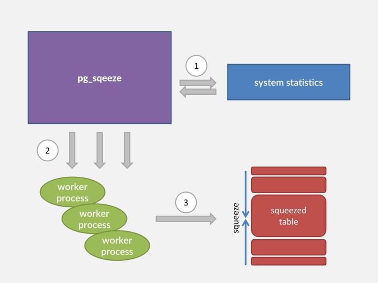

## PostgreSQL 收缩膨胀表或索引 - pg_squeeze or pg_repack
            
### 作者           
digoal            
            
### 日期          
2016-10-30             
            
### 标签          
PostgreSQL , pg_repack , pg_reorg , 表膨胀收缩 , 自动回收垃圾 , 自动收缩 , pg_squeeze                 
            
----          
            
## 背景 
PostgreSQL的表或索引发生膨胀后，用户可以使用vacuum full或rewrite table(如cluster)的方式重建表。  
  
但是vacuum full或者rewrite都需要持有排它锁，会堵塞读操作。  
  
为了减少锁冲突，社区有一个名为pg_reorg或pg_repack的插件，使用了增量的方式重组数据，最后通过切换FILENODE完成数据重组。  
  
仅仅在切换FILENODE时需要持有排他锁，非常短暂，影响比VACUUM FULL和rewrite的方式小多了。  
  
但是pg_reorg或pg_repack都需要建触发器，记录下增量重组时，原表产生的增量数据。  
  
https://github.com/reorg/pg_repack  
  
因此重组时，触发器会带来一定的开销，对被重组的表，有一定的DML性能影响。  
  
本文将要介绍另一个重组插件，名为pg_squeeze，它使用REDO和logical replication实现增量重组，不需要建立触发器，但是要求表上面有PK或者UK。  
  
## pg_squeeze的优点
相比pg_repack或pg_reorg，pg_squeeze不需要建触发器，所以在重组时对原表的DML几乎没有性能影响。  
  
pg_squeeze支持自动的重组，即通过设置阈值、比较用户表与阈值，自动启动WORKER进程，将数据复制到重组表，最后加锁，切换FILENODE。  
  
http://www.cybertec.at/en/products/pg_squeeze-postgresql-extension-to-auto-rebuild-bloated-tables/    
  
http://www.cybertec.at/download/pg_squeeze-1.0beta1.tar.gz    
  
## pg_squeeze 使用注意
由于pg_squeeze需要使用logical replication，所以必须设置足够多的slots，而且必须注意可能与STANDBY争抢SLOTS，必须预留足够的SLOTS。  
  
另外由于pg_squeeze可以自动，也可以不设置自动的收缩。 对于自动的收缩，建议不要对繁忙的数据库开启，以免在高峰期触发，带来一定的性能影响。  
  
## 参考
pg_squeeze, an open-source PostgreSQL extension from Cybertec, enables automatic and transparent fixing of one of the few weak points of PostgreSQL – bloated tables.  
  
Unlike with built-in commands “VACUUM FULL” or “CLUSTER”, with “pg_squeeze” there are no extended periods of full table locking,   
thus reads and writes are not blocked during the rebuild!   
Also the rebuilding process is very efficient due to a novel approach of using transaction log files and logical decoding (instead of triggers) to capture possible data changes to the table being rebuild.   
This helps to save firstly on disk space and IO throughput and even more importantly enables very short locking-times, making it a perfect fit for mission-critical OLTP systems.  
    
How does pg_squeeze work?  
  
The extension is implemented as a background worker process (a framework introduced in version 9.4)   
that periodically monitors user-defined tables and when it detects that a table exceeded the “bloat threshold”,   
it kicks in and rebuilds that table automatically! Rebuilding happens concurrently in the background with minimal storage and computational overhead due to use of Postgres’ built-in   
replication slots together with logical decoding to extract possible table changes happening during the rebuild from XLOG.   
Bloat threshold is of course configurable and bloat ratio calculation is based on the Free Space Map (taking also FILLFACTOR into account) or under certain conditions on the “pgstattuple”   
extension when it’s available.  Additionally many customization parameters like “minimum table size” can be set,   
with non-suitable tables being ignored. Also reordering by an index or moving the table or indexes to new tablespace is possible.  
  
  
  
    
  
  
  
  
  
  
  
  
  
  
  
  
  
  
  
  
  
  
  
  
  
  
  
  
  
  
  
  
  
  
  
  
  
  
  
  
  
  
  
  
  
  
  
  
  
  
  
  
  
  
  
  
  
  
  
  
  
  
  
  
  
  
  
  
  
  
  
  
  
  
  
  
  
#### [PostgreSQL 许愿链接](https://github.com/digoal/blog/issues/76 "269ac3d1c492e938c0191101c7238216")
您的愿望将传达给PG kernel hacker、数据库厂商等, 帮助提高数据库产品质量和功能, 说不定下一个PG版本就有您提出的功能点. 针对非常好的提议，奖励限量版PG文化衫、纪念品、贴纸、PG热门书籍等，奖品丰富，快来许愿。[开不开森](https://github.com/digoal/blog/issues/76 "269ac3d1c492e938c0191101c7238216").  
  
  
#### [9.9元购买3个月阿里云RDS PostgreSQL实例](https://www.aliyun.com/database/postgresqlactivity "57258f76c37864c6e6d23383d05714ea")
  
  
#### [PostgreSQL 解决方案集合](https://yq.aliyun.com/topic/118 "40cff096e9ed7122c512b35d8561d9c8")
  
  
#### [德哥 / digoal's github - 公益是一辈子的事.](https://github.com/digoal/blog/blob/master/README.md "22709685feb7cab07d30f30387f0a9ae")
  
  

  
  
#### [PolarDB 学习图谱: 训练营、培训认证、在线互动实验、解决方案、生态合作、写心得拿奖品](https://www.aliyun.com/database/openpolardb/activity "8642f60e04ed0c814bf9cb9677976bd4")
  
  
#### [购买PolarDB云服务折扣活动进行中, 55元起](https://www.aliyun.com/activity/new/polardb-yunparter?userCode=bsb3t4al "e0495c413bedacabb75ff1e880be465a")
  
  
#### [About 德哥](https://github.com/digoal/blog/blob/master/me/readme.md "a37735981e7704886ffd590565582dd0")
  
