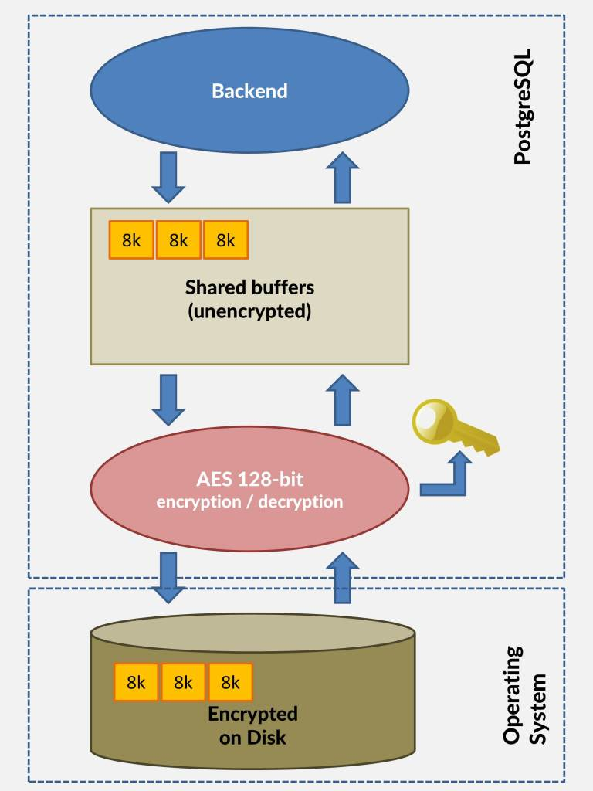

## PostgreSQL 透明加密(TDE,FDE) - 块级加密  
##### [TAG 6](../class/6.md)
            
### 作者           
digoal            
            
### 日期          
2016-10-31             
            
### 标签          
PostgreSQL , 透明加密 , TDE , FDE , 块级加密                        
            
----          
            
## 背景 
在数据库应用中，为了提高数据的安全性，可以选择很多中安全加固的方法。  
  
例如，  
  
1\. 可以对敏感字段进行加密，可以使用服务端加密，也可以使用数据库端加密，例如pgcrypto加密插件。  
  
服务端加解密相对来说比较安全，因为在数据库端存储的是加密后的数据，只要服务端的秘钥保护好，基本上数据都是安全的。  
  
但是服务端加密有一个痛点，失去了对数据的高效访问能力，例如数据库无法对加密后的数据很好的构建索引，或者处理函数。（通常只能对未加密的数据进行处理）。  
  
当然PG是一个比较开放的平台，用户可以自定义对加密数据类型操作的UDF，索引方法，操作符等。  
  
用户也可以自定义加密的数据类型，基于此构建新的OP, AM, FUNC。  
  
2\. 有些商业数据库支持TDE，类似我前面说的（自定义加密类型，同时还自定义了对应的OP, AM, FUNC）。  
  
3\. 网络层加密，这种加密方法主要是防止网络层泄露数据。  
  
4\. 数据块层面的加密，这种加密方法主要是防止数据文件被拷贝后泄露数据。  
  
加密会损失一定的计算资源，损耗性能。  
  
本文要讲的则是数据块层面的加密，这是cybertec开源的一个PostgreSQL版本，支持所有数据文件的加密(FDE)，采用Industry standard 128-bit XTS-AES block cipher。    
    
[PostgreSQL FDE版本源码](postgresql-9.6.0-fde.tar.bz2)   
    
## 块级加密,FDE
The idea behind the patch is to store all the files making up a PostgreSQL cluster securely on disk in encrypted format (data-at-rest encryption) and then decrypt blocks as they are read from disk.   
  
This only requires that the database is initialized with encryption in mind and that the key used for initializing the database is accessible to the server during startup.   
  
The encryption-key can be provided in two ways –   
  
1\. through an environment variable or   
  
2\. through a special configuration parameter specifying a custom key setup command for implementing special security requirements.    
  
  
  
加密解密是在读写文件时完成的，所以如果数据已经在shared buffer中了，对性能的影响就很小了。  
  
For encryption 128-bit AES algorithm in XTS mode is used, sometimes called also XTS-AES.     
  
It’s a block cipher with a “tweak” for extra security and adheres to IEEE P1619 standard.     
  
The key needs to be provided to the server during every startup and when it doesn’t match, the server will refuse to start.     
  
Encrypted will be more or less everything – heap files (tables, indexes, sequences), xlog (as they also contain data), clog, temporary files being generated during execution of a larger query.    
  
Performance penalty incurred by encryption/decryption depends heavily on concrete use cases.   
  
For cases where working set fits well into PostgreSQL shared buffers, it is practically negligible though.  
  
## 测试
下载  
  
```
$ wget http://www.cybertec.at/download/postgresql-9.6.0-fde.tar.bz2

$ tar -jxvf postgresql-9.6.0-fde.tar.bz2
$ cd postgresql-9.6.0-fde

$ ll
total 1108
-rw-r--r--  1 digoal users    384 Sep 27 04:26 aclocal.m4
-rw-r--r--  1 digoal users   5357 Oct 24 19:11 brg_endian.h
-rw-r--r--  1 digoal users   7855 Oct 24 19:11 brg_types.h
drwxr-xr-x  2 digoal users   4096 Sep 27 04:30 config
-rw-r--r--  1 digoal users 368646 Oct 31 09:50 config.log
-rwxr-xr-x  1 digoal users  39393 Oct 31 09:50 config.status
-rwxr-xr-x  1 digoal users 471157 Sep 27 04:26 configure
-rw-r--r--  1 digoal users  75195 Sep 27 04:26 configure.in
drwxr-xr-x 55 digoal users   4096 Sep 27 04:30 contrib
-rw-r--r--  1 digoal users   1192 Sep 27 04:26 COPYRIGHT
drwxr-xr-x  3 digoal users   4096 Sep 27 04:30 doc
-rw-r--r--  1 digoal users   3638 Oct 31 09:50 GNUmakefile
-rw-r--r--  1 digoal users   3638 Sep 27 04:26 GNUmakefile.in
-rw-r--r--  1 digoal users    283 Sep 27 04:26 HISTORY
-rw-r--r--  1 digoal users  75065 Sep 27 04:33 INSTALL
-rw-r--r--  1 digoal users    676 Oct 24 19:11 Makefile.rej
-rw-r--r--  1 digoal users  11026 Oct 24 19:11 mode_hdr.h
-rw-r--r--  1 digoal users   1209 Sep 27 04:26 README
-rw-r--r--  1 digoal users   4455 Oct 24 19:10 README.encryption
drwxr-xr-x 16 digoal users   4096 Oct 31 09:50 src
```
  
编译, 与普通版本pg没什么不同  
```
$ ./configure --prefix=/home/digoal/pgsql9.6-fde
$ make world -j 32
$ make install-world
```
  
设置环境变量  
```
$ vi ~/env_pg96fde.sh 
export PS1="$USER@`/bin/hostname -s`-> "
export PGPORT=5388
export PGDATA=/disk1/digoal/pgdata/pg_root9.6fde
export LANG=en_US.utf8
export PGHOME=/home/digoal/pgsql9.6-fde
export LD_LIBRARY_PATH=$PGHOME/lib:/lib64:/usr/lib64:/usr/local/lib64:/lib:/usr/lib:/usr/local/lib:$LD_LIBRARY_PATH
export DATE=`date +"%Y%m%d%H%M"`
export PATH=$PGHOME/bin:/opt/rh/devtoolset-2/root/usr/bin:$PATH:.
export MANPATH=$PGHOME/share/man:$MANPATH
export PGHOST=127.0.0.1
export PGUSER=postgres
export PGDATABASE=postgres
alias rm='rm -i'
alias ll='ls -lh'
unalias vi


$ . ~/env_pg96fde.sh 
```
  
设置加密秘钥, 初始化数据库集群, 需要读取PGENCRYPTIONKEY这个环境变量的值.    
  
初始化时已经对所有的文件进行了块级别的加密, 建议打开checksum.    
    
```
$ read -sp "Postgres passphrase: " PGENCRYPTIONKEY
$ export PGENCRYPTIONKEY
$ echo $PGENCRYPTIONKEY
$ initdb --data-encryption pgcrypto --data-checksums -D $PGDATA -E SQL_ASCII --locale=C -U postgres
```
    
初始化好之后，postgresql.conf会自动新增一个guc配置  
  
```
$ less $PGDATA/postgresql.conf
encryption_library = 'pgcrypto'
```
  
启动数据库，注意每次启动数据库前，必须设置好 PGENCRYPTIONKEY这个环境变量的值.   
  
```
$ pg_ctl start
```
  
加解密会对性能带来一定的损耗，简单的测试如下。  
  
加密版本PostgreSQL   
  
```
$ psql
Type "help" for help.
postgres=# create unlogged table test(id int);
CREATE TABLE
postgres=# \timing
Timing is on.
postgres=# insert into test select generate_series(1,10000000);
INSERT 0 10000000
Time: 8157.507 ms
postgres=# select max(ctid) from test;
     max     
-------------
 (44247,178)
(1 row)
Time: 5331.924 ms
```
  
profile  
  
```
3358.00 21.9% rijndael_encrypt                               /home/digoal/pgsql9.6-fde/lib/pgcrypto.so                         
 591.00  3.9% ExecModifyTable                                /home/digoal/pgsql9.6-fde/bin/postgres                            
 487.00  3.2% LWLockRelease                                  /home/digoal/pgsql9.6-fde/bin/postgres                            
 404.00  2.6% heap_insert                                    /home/digoal/pgsql9.6-fde/bin/postgres                            
 395.00  2.6% LWLockAttemptLock                              /home/digoal/pgsql9.6-fde/bin/postgres                            
 373.00  2.4% ExecProject                                    /home/digoal/pgsql9.6-fde/bin/postgres                            
 372.00  2.4% RelationPutHeapTuple                           /home/digoal/pgsql9.6-fde/bin/postgres                            
 360.00  2.3% hash_any                                       /home/digoal/pgsql9.6-fde/bin/postgres                            
 344.00  2.2% xor_block_aligned                              /home/digoal/pgsql9.6-fde/lib/pgcrypto.so                         
 332.00  2.2% hash_search_with_hash_value                    /home/digoal/pgsql9.6-fde/bin/postgres                            
 295.00  1.9% PageAddItemExtended                            /home/digoal/pgsql9.6-fde/bin/postgres                            
 294.00  1.9% PinBuffer.isra.3                               /home/digoal/pgsql9.6-fde/bin/postgres                            
 292.00  1.9% RelationGetBufferForTuple                      /home/digoal/pgsql9.6-fde/bin/postgres                            
 284.00  1.9% PageGetHeapFreeSpace                           /home/digoal/pgsql9.6-fde/bin/postgres                            
 273.00  1.8% ReadBuffer_common                              /home/digoal/pgsql9.6-fde/bin/postgres                            
 267.00  1.7% IsCatalogRelation                              /home/digoal/pgsql9.6-fde/bin/postgres                            
 252.00  1.6% ExecMakeFunctionResult                         /home/digoal/pgsql9.6-fde/bin/postgres                            
 242.00  1.6% heap_form_tuple                                /home/digoal/pgsql9.6-fde/bin/postgres                            
 239.00  1.6% ftrace_raw_init_event_xfs_dir2_leafn_add       /lib/modules/2.6.32-358.23.2.ali1195.el6.x86_64/kernel/fs/xfs/xfs.ko
 223.00  1.5% tag_hash                                       /home/digoal/pgsql9.6-fde/bin/postgres                            
 221.00  1.4% copy_user_generic_string                       [kernel.kallsyms]                                                   
 201.00  1.3% UnpinBuffer.constprop.10                       /home/digoal/pgsql9.6-fde/bin/postgres                            
 195.00  1.3% heap_prepare_insert                            /home/digoal/pgsql9.6-fde/bin/postgres                            
 161.00  1.0% MarkBufferDirty                                /home/digoal/pgsql9.6-fde/bin/postgres                            
 157.00  1.0% LWLockAcquire                                  /home/digoal/pgsql9.6-fde/bin/postgres                            
 145.00  0.9% ReadBufferExtended                             /home/digoal/pgsql9.6-fde/bin/postgres                            
 143.00  0.9% heap_fill_tuple                                /home/digoal/pgsql9.6-fde/bin/postgres                            
 141.00  0.9% GetPrivateRefCountEntry                        /home/digoal/pgsql9.6-fde/bin/postgres                            
 128.00  0.8% generate_series_step_int4                      /home/digoal/pgsql9.6-fde/bin/postgres                            
 127.00  0.8% xts_encrypt_block                              /home/digoal/pgsql9.6-fde/lib/pgcrypto.so
```
  
非加密版本PostgreSQL  
  
```
$ psql
Type "help" for help.
postgres=# create unlogged table test(id int);
CREATE TABLE
postgres=# \timing
Timing is on.
postgres=# insert into test select generate_series(1,10000000);
INSERT 0 10000000
Time: 6930.947 ms
postgres=# select max(ctid) from test;
     max     
-------------
 (44247,178)
(1 row)
Time: 1779.663 ms
```
  
profile  
  
```
702.00  3.4% ExecMakeFunctionResult                         /home/digoal/pgsql9.6/bin/postgres
689.00  3.4% heap_prepare_insert                            /home/digoal/pgsql9.6/bin/postgres
671.00  3.3% LWLockRelease                                  /home/digoal/pgsql9.6/bin/postgres
521.00  2.6% ExecModifyTable                                /home/digoal/pgsql9.6/bin/postgres
493.00  2.4% ExecProject                                    /home/digoal/pgsql9.6/bin/postgres
482.00  2.4% LWLockAttemptLock                              /home/digoal/pgsql9.6/bin/postgres
458.00  2.2% pgstat_count_heap_insert                       /home/digoal/pgsql9.6/bin/postgres
451.00  2.2% PageAddItemExtended                            /home/digoal/pgsql9.6/bin/postgres
446.00  2.2% ReadBuffer_common                              /home/digoal/pgsql9.6/bin/postgres
```
  
除了使用PGENCRYPTIONKEY环境变量，还可以使用pgcrypto.keysetup_command参数来指定  
  
```
$ pg_ctl start
server starting
$ LOG:  encryption key not provided
DETAIL:  The database cluster was initialized with encryption but the server was started without an encryption key.
HINT:  Set the key using PGENCRYPTIONKEY environment variable.
FATAL:  data encryption could not be initialized
LOG:  database system is shut down


Optionally if you want to implement a custom procedure for looking up the 
encryption key using pgcrypto.keysetup_command postgresql.conf parameter. 
When this parameter is present it will be executed by PostgreSQL at startup 
and the output processed. Expected output is a string containing 
encryptionkey= and the 256bit key encoded as a hex string (64 hex 
characters):

    "encryptionkey=" ( [0-9a-f]{64} )

To calculate the key from the passphrase hash it using SHA-256.
```
    
秘钥传输相关的代码    
    
```
void
_PG_init(void)
{
        EncryptionRoutines routines;
        routines.SetupEncryption = &pgcrypto_encryption_setup;
        routines.EncryptBlock = &pgcrypto_encrypt_block;
        routines.DecryptBlock = &pgcrypto_decrypt_block;

        register_encryption_module("pgcrypto", &routines);

        DefineCustomStringVariable("pgcrypto.keysetup_command",
                           "Command to fetch database encryption key",
                           "This command will be run at database startup to set up database"
                           " encryption key.",
                           &pgcrypto_keysetup_command,
                           "",
                           PGC_POSTMASTER,
                           0,
                           NULL,
                           NULL,
                           NULL);

        EmitWarningsOnPlaceholders("pgcrypto");
}


const char* encryptionkey_prefix = "encryptionkey=";
const int encryption_key_length = 32;

static bool pgcrypto_run_keysetup_command(uint8 *key)
{
        FILE *fp;
        char buf[encryption_key_length*2+1];
        int bytes_read;
        int i;

        if (pgcrypto_keysetup_command == NULL)
                return false;

        if (!strlen(pgcrypto_keysetup_command))
                return false;

        elog(INFO, "Executing \"%s\" to set up encryption key", pgcrypto_keysetup_command);

        fp = popen(pgcrypto_keysetup_command, "r");
        if (fp == NULL)
                elog(ERROR, "Failed to execute pgcrypto.keysetup_command \"%s\"",
                        pgcrypto_keysetup_command);

        if (fread(buf, 1, strlen(encryptionkey_prefix), fp) != strlen(encryptionkey_prefix))
                elog(ERROR, "Not enough data received from pgcrypto.keysetup_command");

        if (strncmp(buf, encryptionkey_prefix, strlen(encryptionkey_prefix)) != 0)
                elog(ERROR, "Unknown data received from pgcrypto.keysetup_command");

        bytes_read = fread(buf, 1, encryption_key_length*2 + 1, fp);
        if (bytes_read < encryption_key_length*2)
        {
                if (feof(fp))
                        elog(ERROR, "Encryption key provided by pgcrypto.keysetup_command too short");
                else
                        elog(ERROR, "pgcrypto.keysetup_command returned error code %d", ferror(fp));
        }

        for (i = 0; i < encryption_key_length; i++)
        {
                if (sscanf(buf+2*i, "%2hhx", key + i) == 0)
                        elog(ERROR, "Invalid character in encryption key at position %d", 2*i);
        }
        if (bytes_read > encryption_key_length*2)
        {
                if (buf[encryption_key_length*2] != '\n')
                        elog(ERROR, "Encryption key too long '%s' %d.", buf, buf[encryption_key_length*2]);
        }

        while (fread(buf, 1, sizeof(buf), fp) != 0)
        {
                /* Discard rest of the output */
        }

        pclose(fp);


        return true;
}
```
  
加密算法用的是pgcrypto自带的：       
  
contrib/pgcrypto/rijndael.c  
  
```
/* This is an independent implementation of the encryption algorithm:   */
/*                                                                                                                                              */
/*                 RIJNDAEL by Joan Daemen and Vincent Rijmen                                   */
/*                                                                                                                                              */
/* which is a candidate algorithm in the Advanced Encryption Standard   */
/* programme of the US National Institute of Standards and Technology.  */
/*                                                                                                                                              */
/* Copyright in this implementation is held by Dr B R Gladman but I             */
/* hereby give permission for its free direct or derivative use subject */
/* to acknowledgment of its origin and compliance with any conditions   */
/* that the originators of the algorithm place on its exploitation.     */
/*                                                                                                                                              */
/* Dr Brian Gladman (gladman@seven77.demon.co.uk) 14th January 1999             */
  

/* Timing data for Rijndael (rijndael.c)

Algorithm: rijndael (rijndael.c)

128 bit key:
Key Setup:        305/1389 cycles (encrypt/decrypt)
Encrypt:           374 cycles =    68.4 mbits/sec
Decrypt:           352 cycles =    72.7 mbits/sec
Mean:              363 cycles =    70.5 mbits/sec

192 bit key:
Key Setup:        277/1595 cycles (encrypt/decrypt)
Encrypt:           439 cycles =    58.3 mbits/sec
Decrypt:           425 cycles =    60.2 mbits/sec
Mean:              432 cycles =    59.3 mbits/sec

256 bit key:
Key Setup:        374/1960 cycles (encrypt/decrypt)
Encrypt:           502 cycles =    51.0 mbits/sec
Decrypt:           498 cycles =    51.4 mbits/sec
Mean:              500 cycles =    51.2 mbits/sec

*/
```
    
    
  
<a rel="nofollow" href="http://info.flagcounter.com/h9V1"  ></a>  
  
  
  
  
  
  
## [digoal's 大量PostgreSQL文章入口](https://github.com/digoal/blog/blob/master/README.md "22709685feb7cab07d30f30387f0a9ae")
  
