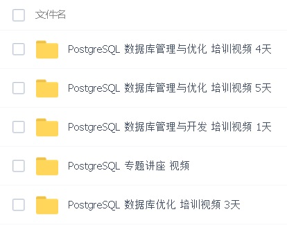

## 致DBA , 开发者 , 内核开发者 , 架构师 - PostgreSQL 爱好者参考资料  
  
### 作者  
digoal  
  
### 日期  
2016-11-01  
  
### 标签  
PostgreSQL , 参考资料 , DBA , 开发者 , 内核开发者 , 架构师  
  
----  
  
## 背景  
给 DBA、应用开发者、内核开发者、架构师 整理了一些PostgreSQL的相关资料。  
  
## 一、TO 应用开发者  
  
### PPT  
1、安装PG集群，PG SQL语言精讲，plpgsql开发语言精讲，PG 客户端、服务端管理，PG 数据库架构，PG 日常维护，PG 分布式使用，PG数据库监控，PG 性能优化。  
  
[<2 Day PostgreSQL DBA>](20161101_01_pdf_001.pdf)  
  
### 视频  
  
1、PostgreSQL 数据库管理与优化 培训视频 4天  
  
2、PostgreSQL 数据库管理与优化 培训视频 5天  
  
3、PostgreSQL 数据库管理与开发 培训视频 1天  
  
4、PostgreSQL 专题讲座 视频  
  
5、PostgreSQL 数据库优化 培训视频 3天  
  
[以上视频及PDF下载地址](http://pan.baidu.com/s/1pKVCgHX)  
  
6、[《阿里云 PostgreSQL 产品生态；案例、开发实践、管理实践 PDF》](../201801/20180121_01_pdf_001.pdf)  
  
[阿里云 PostgreSQL 产品生态；案例、开发实践、管理实践 在线视频](https://edu.aliyun.com/course/836/lesson/list)  
  
### 书  
  
《PostgreSQL Introduction and Concepts》  
  
《PostgreSQL开发必备参考手册》  
  
《PostgreSQL Server Programming》  
  
### 电子书  
1、快速入门PostgreSQL应用开发与管理 系列  
  
[《快速入门PostgreSQL应用开发与管理 - 8 PostgreSQL 管理》](../201704/20170412_04.md)  
  
[《快速入门PostgreSQL应用开发与管理 - 7 函数、存储过程和触发器》](../201704/20170412_02.md)  
  
[《快速入门PostgreSQL应用开发与管理 - 6 事务和锁》](../201704/20170412_01.md)  
  
[《快速入门PostgreSQL应用开发与管理 - 5 数据定义》](../201704/20170411_05.md)  
  
[《快速入门PostgreSQL应用开发与管理 - 4 高级SQL用法》](../201704/20170411_04.md)  
  
[《快速入门PostgreSQL应用开发与管理 - 3 访问数据》](../201704/20170411_03.md)  
  
[《快速入门PostgreSQL应用开发与管理 - 2 Linux基本操作》](../201704/20170411_02.md)  
  
[《快速入门PostgreSQL应用开发与管理 - 1 如何搭建一套学习、开发PostgreSQL的环境》](../201704/20170411_01.md)  
  
2、PostgreSQL 开发者指南：  
  
http://www.postgresqltutorial.com/  
  
https://www.tutorialspoint.com/postgresql/index.htm  
  
3、各种语言的开发入门DEMO：  
  
Java：https://github.com/digoal/blog/blob/master/201701/20170106_05.md  
  
PHP：https://github.com/digoal/blog/blob/master/201701/20170106_08.md  
  
Ruby：https://github.com/digoal/blog/blob/master/201701/20170106_07.md  
  
Python：https://github.com/digoal/blog/blob/master/201701/20170106_06.md  
  
C：https://github.com/digoal/blog/blob/master/201701/20170106_09.md  
  
4、  
  
[《PostgreSQL 数据库开发规范》](../201609/20160926_01.md)  
  
## 二、TO 数据库内核开发者  
  
[《Introduction to Hacking PostgreSQL》](20161101_01_pdf_002.pdf)  
  
[《Introduction PostgreSQL WAL》](20161101_01_pdf_008.pdf)  
  
[《Postgres on the wire - A look at the PostgreSQL wire protocol》](../201708/20170806_01_pdf_001.pdf)  
  
《PostgreSQL 内核分析》 - 彭老师  
  
https://commitfest.postgresql.org/  
  
https://wiki.postgresql.org/wiki/Developer_FAQ  
  
https://www.postgresql.org/developer/coding/  
  
http://blog.csdn.net/v_july_v  
   
http://www.interdb.jp/pg/  写得很不错   
  
https://wiki.postgresql.org/wiki/Pgsrcstructure   
  
## 三、TO DBA  
  
### PPT  
1、  
  
[<2 Day PostgreSQL DBA>](20161101_01_pdf_001.pdf)  
  
2、  
  
[《PostgreSQL 数据库管理 从入门到进阶 Day 1》](20161101_01_pdf_003.pdf)  
  
[《PostgreSQL 数据库管理 从入门到进阶 Day 2》](20161101_01_pdf_004.pdf)  
  
[《PostgreSQL 数据库管理 从入门到进阶 Day 3》](20161101_01_pdf_005.pdf)  
  
[《PostgreSQL 数据库管理 从入门到进阶 Day 4》](20161101_01_pdf_006.pdf)  
  
3、  
  
[《PostgreSQL 数据库性能优化 从入门到进阶》](20161101_01_pdf_007.pdf)  
  
4、  
  
《从小工到专家》 -  唐成  
  
### 视频  
  
1、PostgreSQL 数据库管理与优化 培训视频 4天  
  
2、PostgreSQL 数据库管理与优化 培训视频 5天  
  
3、PostgreSQL 数据库管理与开发 培训视频 1天  
  
4、PostgreSQL 专题讲座 视频  
  
5、PostgreSQL 数据库优化 培训视频 3天  
  
http://pan.baidu.com/s/1pKVCgHX  
  
6、[《阿里云 PostgreSQL 产品生态；案例、开发实践、管理实践 PDF》](../201801/20180121_01_pdf_001.pdf)  
  
[阿里云 PostgreSQL 产品生态；案例、开发实践、管理实践 在线视频](https://edu.aliyun.com/course/836/lesson/list)  
  
### 认证考试  
https://www.enterprisedb.com/training/postgres-certification  
  
### 小工具
自动生成通用优化参数(当然了，还有很多其他参数可以调整，这个小工具可以当成入门)   
  
http://pgtune.leopard.in.ua/  
  
## 四、TO 架构师  
  
### PPT  
  
[《数据库选型之 - 大象十八摸 - 致 架构师、开发者》](../201702/20170209_01.md)  
  
[《数据库选型思考》](../201702/20170208_03.md)  
  
[《PostgreSQL、Greenplum 应用案例宝典《如来神掌》 - 目录》](../201706/20170601_02.md)  
  
[《阿里云 PostgreSQL 产品生态；案例、开发实践、管理实践 PDF》](../201801/20180121_01_pdf_001.pdf)  
  
[阿里云 PostgreSQL 产品生态；案例、开发实践、管理实践 在线视频](https://edu.aliyun.com/course/836/lesson/list)  
  
[《数据库三十六计 - PostgreSQL 三十六计(上)》](../201703/20170322_01.md)  
  
[《数据库三十六计 - PostgreSQL 三十六计(中)》](../201703/20170322_02.md)  
  
[《数据库三十六计 - PostgreSQL 三十六计(下)》](../201703/20170322_03.md)  
  
https://wiki.postgresql.org/wiki/PostgreSQL_derived_databases  
  
[《[未完待续] PostgreSQL\Greenplum Customer视角TODO》](../201710/20171017_01.md)  
  
## 五、其他  
### 概念书籍  
  
《PostgreSQL Introduction and Concepts》  
  
### 开发书籍  
  
《PostgreSQL开发必备参考手册》  
  
### 管理类书籍  
  
《PostgreSQL 9 Administration Cookbook》  
  
《PostgreSQL 9.0 High Performance》  
  
《PostgreSQL Server Programming》  
  
《How PostgreSQL Processes a Query》  
  
### 了解内核  
  
http://www.postgresql.org/developer/backend/  
  
http://wiki.postgresql.org/wiki/Backend_flowchart  
  
《数据库查询优化器的艺术：原理解析与SQL性能优化》  
  
《PostgreSQL 内核分析》 - 彭老师  
  
官方手册：  
  
http://www.postgresql.org/docs/  
  
中文手册：  
  
http://www.postgres.cn/document  
  
培训类PPT：  
  
《PostgreSQL Inside 系列》  
  
《PostgreSQL DBA培训PPT》  
  
中文PostgreSQL圈子  
  
https://yq.aliyun.com/groups/29  
  
中文PostgreSQL内核圈子  
  
https://yq.aliyun.com/groups/12  
  
中文Greenplum圈子  
  
https://yq.aliyun.com/groups/13  
  
中文问答  
  
https://yq.aliyun.com/ask  
  
在线练习 题库  
  
https://pgexercises.com/  
  
http://etutorials.org/SQL/Postgresql/  
  
http://www.postgresqltutorial.com/  
  
代码树：  
  
http://doxygen.postgresql.org/  
  
代码提交集：  
  
https://commitfest.postgresql.org/  
  
项目GIT：  
  
http://git.postgresql.org  
  
PostgreSQL GITHUB镜像  
  
https://github.com/postgres/postgres  
  
PostgreSQL JDBC 驱动：  
  
http://jdbc.postgresql.org  
  
http://jdbc.postgresql.org/development/privateapi/  
  
PostgreSQL ODBC 驱动：  
  
http://www.postgresql.org/ftp/odbc/versions/src/  
  
PostgreSQL 扩展插件：  
  
http://pgfoundry.org  
  
http://pgxn.org/  
  
GUI工具(pgAdmin)：  
  
http://www.pgadmin.org/  
  
安全漏洞：  
  
http://cve.mitre.org/cgi-bin/cvekey.cgi?keyword=postgresql  
  
中文社区：  
  
http://bbs.pgsqldb.com  
  
中文官网：  
  
http://www.postgres.cn  
  
国外FAQ社区, BLOG：  
  
http://www.pgcon.org/  
  
https://www.postgresql.us/  
  
http://www.itpug.org/  
  
http://www.pgug.de/  
  
http://www.diapug.org/  
  
http://stackoverflow.com/questions/tagged/postgresql  
  
http://momjian.us  
  
http://www.pgexperts.com  
  
http://blog.2ndquadrant.com/en  
  
一位社区兄弟ty4z2008整理的资料  
  
https://github.com/ty4z2008/Qix/blob/master/pg.md  
  
其他推荐网站：  
  
http://db.cs.berkeley.edu  
  
http://mariposa.cs.berkeley.edu/  
  
http://www.postgresql.org  
  
http://wiki.postgresql.org/wiki/Todo  
  
http://wiki.postgresql.org/wiki/Development_information  
  
http://wiki.postgresql.org  
  
http://www.pgbuildfarm.org  
  
https://github.com/aggregateknowledge/postgresql-hll  
  
http://www.postgis.org/  
  
http://workshops.opengeo.org/postgis-intro/  
  
http://www.opengeospatial.org/  
  
http://code.google.com  
  
https://developers.google.com/  
  
http://www.perzl.org/aix/  
  
http://db-engines.com/en/  
  
http://pgmag.org/  
  
http://planet.postgresql.org/  
  
http://www.cybertec.at/  
  
http://www.translattice.com/  
  
http://citusdata.com/  
  
http://www.dbms2.com/  
  
http://www.informationweek.com/  
  
http://www.infoq.com/  
  
http://www.actian.com/  
  
http://aws.amazon.com/redshift/  
  
http://sourceforge.net/projects/postgres-xc/  
  
http://www.postgres-xl.org/  
  
http://madlib.net/  
  
http://research.google.com/index.html  
  
http://postgresql.1045698.n5.nabble.com/  
  
http://blog.163.com/digoal%40126  
  
https://github.com/digoal/blog  
  
http://blog.itpub.net/30088583/year-2017-list-1/  
  
http://akorotkov.github.io/  
  
  
http://vitessedata.com/  
  
国内GIS相关BLOG  
  
http://blog.csdn.net/goldenhawking/article/category/1222775  
  
## 书籍打包下载  
  
http://yun.baidu.com/share/link?shareid=3626307544&uk=1982970774  
  
## 案例、数据库管理大全  
[《PostgreSQL、Greenplum 应用案例宝典《如来神掌》 - 目录》](../201706/20170601_02.md)  
  
[《阿里云 PostgreSQL 产品生态；案例、开发实践、管理实践 PDF》](../201801/20180121_01_pdf_001.pdf)  
  
## 规范  
[《PostgreSQL 数据库开发规范》](../201609/20160926_01.md)  
  
## PostgreSQL 培训视频  
  
1、 http://pan.baidu.com/s/1pKVCgHX  ,  如果连接失效请通知我, 谢谢  
  
  
  
2、 [阿里云 PostgreSQL 产品生态；案例、开发实践、管理实践 在线视频](https://edu.aliyun.com/course/836/lesson/list)  
  
  
欢迎转载(注明出处), 如有问题, 可以在这里发issue讨论, 或者微信联系我  
  
### 二维码  
  
  
  
  
  
  
  
  
  
  
## [digoal's 大量PostgreSQL文章入口](https://github.com/digoal/blog/blob/master/README.md "22709685feb7cab07d30f30387f0a9ae")
  
